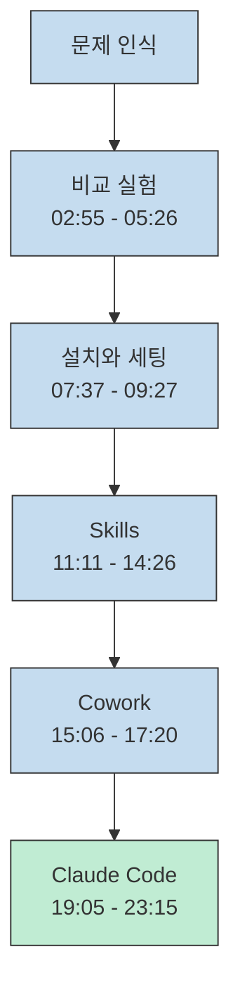
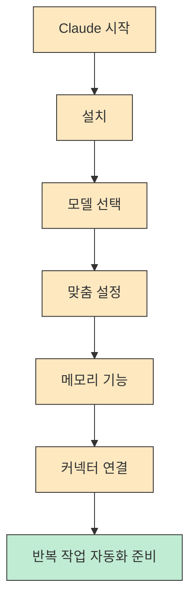
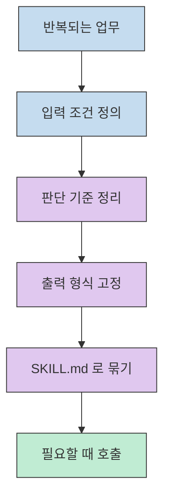
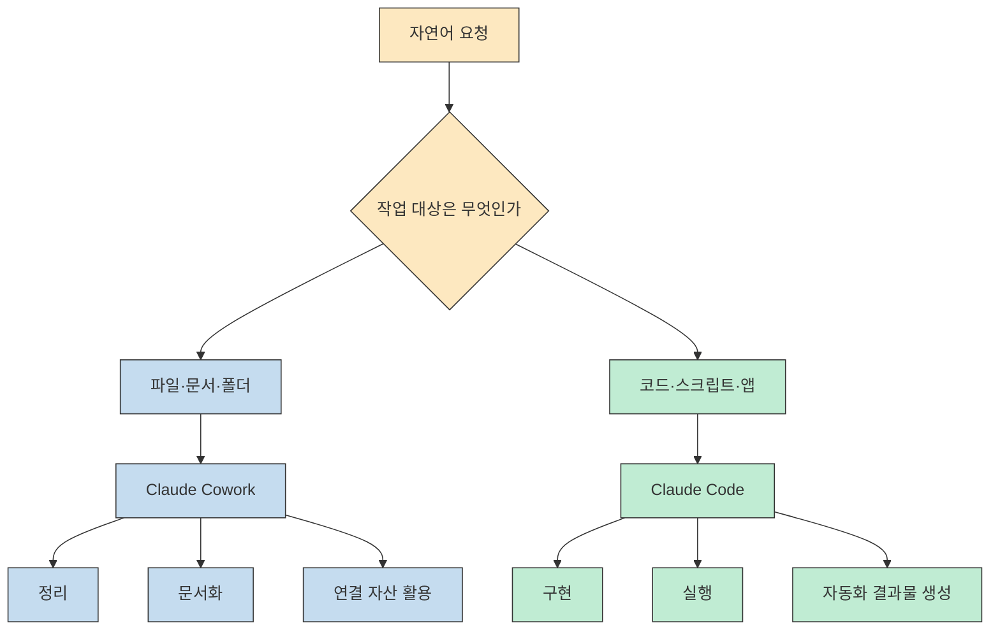

Claude를 처음 접할 때 가장 헷갈리는 지점은 모델 이름이 아니라 **도구의 역할 구분** 입니다. 이번 영상은 그 혼선을 정면으로 다룹니다. 초반에는 ChatGPT와 Claude의 결과물 차이를 보여 주고, 중반에는 설치와 세팅을 짚고, 후반에는 Skills, Cowork, Code를 각각 어떤 종류의 일에 붙여야 하는지 실제 예시로 분해합니다.[^1]
<!--more-->

다만 한 가지는 분명히 짚고 가야 합니다. 이 글은 현재 시점에 자동 생성 자막 전문을 확보하지 못한 상태에서, **영상 설명란에 공개된 챕터 목록과 데모 프롬프트**, 그리고 Anthropic 공식 문서를 대조해 구조를 재구성한 글입니다. 그래서 영상 속 모든 세부 발화를 받아쓴 요약이 아니라, **확인 가능한 단서만으로 다시 조립한 실전 해설** 에 가깝습니다.[^2][^3]

## Sources

- [https://youtube.com/watch?v=Qvv1CHw-on8&si=Z2kiJIdrBRdSP4U-](https://youtube.com/watch?v=Qvv1CHw-on8&si=Z2kiJIdrBRdSP4U-) - 코딩 몰라도 OK - 상위 1% 엔지니어가 알려주는 클로드 코드·코워크·클로드 스킬 “제대로” 쓰는 법
- [https://docs.anthropic.com/en/docs/claude-code](https://docs.anthropic.com/en/docs/claude-code) - Claude Code 공식 문서
- [https://code.claude.com/docs/en/skills](https://code.claude.com/docs/en/skills) - Claude Code Skills 공식 문서
- [https://platform.claude.com/docs/en/agents-and-tools/agent-skills/overview](https://platform.claude.com/docs/en/agents-and-tools/agent-skills/overview) - Agent Skills 공식 개요
- [https://claude.com/cowork](https://claude.com/cowork) - Claude Cowork 공식 소개

## 이 영상이 입문자에게 강한 이유: 비교에서 시작해 역할 분리로 끝난다

영상 설명란에 적힌 챕터를 보면 전체 구성은 매우 선명합니다. `00:00` 에서는 왜 Claude가 화제가 되는지 설명하고, `02:55` 부터 `05:26` 까지는 ChatGPT와 Claude를 세 가지 작업으로 직접 비교합니다. 그다음 `07:37` 부터는 설치와 모델 선택, 기본 세팅으로 넘어가고, `11:11` 이후에는 Skills, `15:06` 이후에는 Cowork, `19:05` 이후에는 Claude Code 시연으로 이어집니다. 그래서 이 글은 이 영상을 "Claude가 좋다"는 소개보다 **어떤 일을 어떤 인터페이스에 맡길 것인가를 정리하는 구조** 로 읽습니다.[^1]

이 흐름이 중요한 이유는 대부분의 초보자가 Claude를 하나의 거대한 챗봇처럼 보기 때문입니다. 하지만 공식 문서를 기준으로 보면 Claude Code는 터미널 안에서 코드베이스를 읽고 파일을 수정하고 명령을 실행하는 에이전트형 코딩 도구이고, Claude Skills는 반복 지시를 재사용 가능한 작업 단위로 묶는 구조이며, Claude Cowork는 그 에이전트성을 데스크톱 업무 쪽으로 확장한 제품입니다. 제품 성격이 다른데 한 덩어리로 쓰면, 당연히 결과가 흐려집니다.[^3][^4][^5]

## 초반 비교 실험이 말하는 것: Claude를 잘 쓰려면 먼저 작업 유형부터 나눠야 한다

챕터 목록만 봐도 초반 비교 실험의 기준이 드러납니다. `02:55` 는 한국어 보고서 작성, `04:24` 는 복잡한 엑셀 데이터 분석, `05:26` 은 이메일 톤 변환과 상황별 재작성입니다. 세 가지 모두 단순 질의응답보다는 **구조화, 맥락 보존, 톤 제어** 와 가까운 작업입니다. 그래서 이 초반 비교는 "누가 더 똑똑한가"보다는 **어떤 모델을 어떤 작업군에 붙여 볼 수 있는가** 를 보여 주는 구간으로 읽는 편이 안전합니다.[^6][^7][^8]

이 기준은 비개발자에게 특히 중요합니다. 코드를 직접 짜지 않더라도, 실제 업무에서 AI를 붙이는 첫 순간은 대부분 보고서 초안 작성, 데이터 해석, 고객 응대 문안 재작성처럼 문맥이 길고 요구 조건이 많은 작업에서 시작되기 때문입니다. 이 글에서는 영상이 이 세 가지를 앞에 둔 구성을, Claude를 "개발자 전용 도구"라기보다 **맥락이 긴 업무에도 붙여 볼 수 있는 운영 도구** 로 해석하게 만드는 배치로 봅니다.[^1]

여기서 얻을 수 있는 교훈은 간단합니다. Claude를 잘 쓰는 사람은 프롬프트를 멋있게 쓰는 사람이 아니라, 먼저 일을 세 부류로 나누는 사람입니다. 첫째, 텍스트 구조화가 필요한 일. 둘째, 데이터 해석이 필요한 일. 셋째, 상황별 톤 조정이 필요한 일입니다. 영상의 후반부에서 Skills, Cowork, Code로 갈라지는 것도 결국 이 분류를 더 강한 실행 환경으로 확장하는 과정입니다.[^1][^3]

## 7분 이후의 핵심: 모델 선택보다 먼저 세팅을 고정해야 한다

`07:37` 부터 `09:27` 까지의 챕터는 설치, 모델 선택, 기본 세팅 3가지로 이어집니다. 이 배열만 보면 적어도 이 영상은 모델 이름 자체보다 **환경 설정과 기본 컨텍스트를 먼저 잡는 흐름** 을 더 앞세우고 있다고 해석할 수 있습니다.[^9][^10][^11]

특히 `09:27` 챕터 이름이 "기본 세팅 3가지"인 점이 중요합니다. 설명란에 적힌 제목은 맞춤 설정, 메모리 기능, 커넥터 연결을 가리킵니다. 이 글은 이 구성을, Claude를 매번 빈 상태로 부르기보다 자주 쓰는 작업 방식과 출력 형태, 연결 대상을 먼저 정리해 두는 편이 이후의 Skills나 Cowork, Code 활용을 더 매끄럽게 만든다는 방향으로 읽습니다.[^11]

공식 문서도 같은 방향을 가리킵니다. Claude Code는 단순히 답변만 생성하는 인터페이스가 아니라, 로컬 코드베이스를 읽고 수정하고 셸 명령을 실행하는 도구입니다. 이런 성격을 감안하면, 한 번의 프롬프트보다 **작업 환경의 기준값** 을 먼저 잡아 두는 접근이 더 자연스럽다고 볼 수 있습니다.[^3]

## Skills 파트의 핵심: 프롬프트를 한 번 쓰고 버리지 말고 작업 자산으로 바꿔라

`11:11` 챕터는 "AI에게 내 업무 방식을 가르치고 자동화하는 법"이고, `14:26` 챕터는 예시 스킬 사용법입니다. 여기에 설명란이 결정적인 단서를 추가합니다. 영상 설명란에는 실제 Skill 시연 프롬프트 두 개가 길게 공개되어 있는데, 하나는 고객 불만 이메일에 대해 브랜드 톤에 맞는 답변 3종을 자동 생성하는 스킬이고, 다른 하나는 질문 5개에 답하면 수익화 단계를 진단하는 인터랙티브 웹앱 생성 예시입니다. 이 조합은 Skills를 "짧은 매크로"가 아니라 **업무 방식을 캡슐화한 재사용 레이어** 로 이해해야 한다는 점을 보여 줍니다.[^2][^12]

이 지점에서 공식 문서와 영상의 메시지가 정확히 만납니다. Anthropic 문서에서 Skills는 `SKILL.md` 를 중심으로 한 지시 폴더 구조이고, Claude Code 문맥에서는 반복적으로 설명해야 하는 작업법을 필요할 때 불러오는 방식입니다. 다시 말해, 프롬프트를 그때그때 복붙하는 것이 아니라, "이 상황이 오면 이렇게 판단하고, 이런 형식으로 출력하라"는 업무 규칙을 **지속 가능한 운영 자산** 으로 승격시키는 것입니다.[^4][^13]

영상 설명란에 공개된 고객 불만 이메일 스킬을 보면 이 구조가 선명합니다. 입력 형식, 브랜드 보이스 원칙, 출력 톤 세 가지, 마지막 체크리스트까지 전부 명시돼 있습니다. 이건 단순한 문장 요청이 아니라 작은 SOP입니다. 초보자 입장에서는 "스킬을 만든다"는 말을 거창하게 느끼기 쉬운데, 실제로는 **반복해서 설명하던 규칙을 폴더 하나로 고정하는 일** 에 가깝습니다.[^2][^12]

## Cowork 파트의 핵심: 코딩이 아니라 파일과 문서를 움직이는 에이전트로 봐야 한다

`15:06` 부터는 Claude Cowork가 등장하고, 이어서 `15:33` 에 파일 및 폴더 자동 정리, `16:26` 에 영수증 사진을 엑셀로 자동 정리, `17:20` 에 구글드라이브 연결 시연이 나옵니다. 이 챕터 이름만으로도 Cowork의 포지션은 분명합니다. Cowork는 코드를 더 잘 쓰기 위한 모드가 아니라, **일반 업무 파일을 다루는 데스크톱형 작업 인터페이스** 로 제시됩니다.[^14][^15][^16][^17]

공식 소개도 같은 결을 가집니다. Claude Cowork는 Claude의 에이전트적 능력을 데스크톱 파일, 문서, 연결 서비스 같은 지식 노동 영역으로 확장한 제품입니다. 그래서 영상 제목이 "코워크"를 Claude Code와 나란히 놓았다고 해서 둘을 같은 도구로 보면 안 됩니다. Code는 실행과 수정의 중심이 코드베이스에 있고, Cowork는 실행과 정리의 중심이 폴더와 문서와 연결 자산에 있습니다.[^5]

비개발자 관점에서 보면 이 구분은 꽤 실용적으로 읽힙니다. 예를 들어 영수증 정리, 파일 구조 정돈, 드라이브 연결처럼 **컴퓨터 위의 자산을 정리하고 구조화하는 일** 은 Cowork 쪽과 더 가깝게 보이고, 앱을 만들거나 API를 붙이거나 자동화 결과물을 실제 산출물로 만들려는 흐름은 Claude Code 쪽과 더 가깝게 보입니다. 영상이 Cowork 뒤에 곧바로 Claude Code 데모를 배치한 것도, 이런 경계를 떠올리게 하는 편집으로 읽을 수 있습니다.[^1]

## Claude Code 파트의 핵심: 결국 결과물을 만드는 쪽은 Code다

`19:05` 챕터는 유튜브 채널 댓글 감성 분석 에이전트이고, `21:17` 챕터는 경쟁사 블로그 트렌드 분석과 콘텐츠 아이디어 도출입니다. 설명란에는 이 두 데모에 대한 실제 미션 텍스트가 꽤 길게 적혀 있습니다. 첫 번째는 YouTube Data API로 최근 댓글 1,000개를 수집해 긍정/부정/중립 분류, 키워드 Top 20 추출, 요청 패턴 분리, 차트 생성, PDF 보고서 저장까지 수행하는 흐름입니다. 두 번째는 검색, RSS, 기존 블로그 주제 목록을 합쳐 틈새 주제 10개를 추천하고 PDF/차트/요약 파일을 만드는 흐름입니다.[^2][^18][^19]

이 예시들이 중요한 이유는 Claude Code를 "코드 생성기"라기보다 **산출물까지 이어지는 실행 환경** 으로 보게 만들기 때문입니다. API를 붙이고, 라이브러리를 설치하고, 파일을 만들고, 결과물을 폴더에 저장하는 전체 연쇄가 한 번에 묶여 있기 때문입니다. 그래서 이 글은 Cowork가 정리와 연결에 가까운 반면, Claude Code는 **실행 가능한 자동화 워크플로우를 끝까지 이어 가는 쪽** 으로 읽습니다.[^2][^3]

또 하나 주목할 점은 두 데모 모두 단순 분석에서 끝나지 않는다는 것입니다. 댓글 분석은 PDF 보고서와 시각화 차트까지 가고, 블로그 분석은 니치 주제 추천과 트렌드 그래프까지 갑니다. 초보자 입장에서 이 차이는 큽니다. AI에게 "분석해 줘"라고 묻는 것과, **데이터 수집부터 보고서 저장까지 한 번에 끝내는 미션** 을 주는 것은 전혀 다른 수준의 작업 설계이기 때문입니다.[^2]

그래서 이 글은 영상 후반부를 "Claude Code는 개발자만 쓴다"의 반대편, 즉 비개발자라도 문제를 데이터 수집 - 처리 - 시각화 - 저장의 흐름으로 나눠서 말할 수 있으면 Claude Code를 활용할 여지가 커지는 방향으로 읽습니다. 제품 공식 문서가 Claude Code를 파일 수정과 명령 실행이 가능한 도구로 설명하는 이유도 이 해석과 잘 맞습니다. 답변만 받는 것이 아니라, **컴퓨터 위에서 일을 실제로 끝내는 능력** 이 강조되기 때문입니다.[^3][^20]

## 실전 적용 포인트

이 영상을 보고 바로 따라 할 때 가장 좋은 접근은 셋을 한꺼번에 쓰려 하지 않는 것입니다. 먼저 내 일이 어디에 가까운지부터 판단하세요. 파일 정리와 문서 처리라면 Cowork, 반복 지시를 자산화하는 것이 목적이라면 Skills, 데이터 수집과 실행 가능한 결과물을 끝까지 만드는 것이 목적이라면 Claude Code가 더 자연스럽습니다.[^4][^5][^18]

두 번째로, 스킬은 거창한 프로젝트보다 **자주 반복되는 판단 규칙** 부터 고정하는 접근이 더 시작하기 쉽습니다. 고객 불만 답변처럼 입력, 톤 원칙, 출력 구조가 명확한 업무가 첫 번째 후보입니다. 이런 종류의 작업은 Skill 형태로 정리했을 때 구조가 분명해지고, 이후 Cowork나 Claude Code에서 다시 불러 쓰기에도 편합니다.[^2][^4]

세 번째로, Claude Code를 쓸 때는 "분석해 줘"보다 "어디서 데이터를 가져오고, 무엇으로 분류하고, 어떤 파일로 저장할지"까지 작업의 끝 형태를 말하는 쪽이 이 영상의 데모와 더 가깝습니다. 설명란에 공개된 두 데모가 모두 폴더명, 결과물 형식, 시각화 방식까지 명시하는 이유도 그 방향을 보여 줍니다. 이 관점에서는 좋은 답변을 받는 것보다, **좋은 결과물을 남기게 하는 요청** 이 더 핵심에 가깝습니다.[^2]

## 핵심 요약

- 이 영상의 구조는 비교 실험 -> 기본 세팅 -> Skills -> Cowork -> Claude Code 순서로 짜여 있고, 이 글은 이를 "어떤 일을 어느 인터페이스에 맡길 것인가"를 정리하는 흐름으로 읽습니다.[^1]
- 초반 비교 실험은 한국어 문서, 데이터 분석, 톤 변환처럼 문맥이 긴 업무를 어떤 모델 비교의 기준으로 삼고 있는지 보여 주는 장면으로 읽을 수 있습니다.[^6][^7][^8]
- Skills는 반복 프롬프트를 한 번 쓰고 버리는 것이 아니라 `SKILL.md` 기반 작업 자산으로 바꾸는 방식이며, 영상 설명란의 고객 응대 예시가 그 성격을 잘 보여 줍니다.[^2][^4]
- Claude Cowork는 파일, 폴더, 문서, 드라이브 연결 같은 데스크톱 업무 쪽에 가깝게 소개되고, Claude Code는 API 연결, 데이터 처리, 결과물 저장이 포함된 실행형 자동화 데모와 함께 배치됩니다.[^3][^5][^18]
- 비개발자에게 중요한 포인트로 읽히는 부분은 코드를 직접 짜는 능력보다, 일을 입력 - 판단 - 출력 - 저장 구조로 분해해서 요청하는 방식입니다.[^2][^20]

## 결론

이 영상이 좋은 이유는 "Claude가 대단하다"는 식의 감탄으로 끝나지 않기 때문입니다. 이 글의 해석대로라면, 여기서 더 중요한 것은 모델 이름을 외우는 일보다 언제 Skills로 규칙을 굳히고, 언제 Cowork로 파일을 정리하고, 언제 Claude Code로 실행까지 이어 갈지를 구분하는 감각입니다.[^1][^3][^5]

그래서 비개발자에게 필요한 첫걸음도 의외로 단순합니다. 코딩을 배워야 한다는 압박부터 갖기보다, 내 업무를 반복 규칙, 파일 작업, 실행형 자동화로 나눠 보고 그중 하나를 Claude에 맡겨 보는 접근이 더 현실적으로 보입니다. 적어도 공개된 챕터와 설명란 기준으로 보면, 이 영상은 그런 역할 분해의 입구로 활용할 만한 출발점입니다.[^2][^18]

[^1]: [https://youtu.be/Qvv1CHw-on8?t=0](https://youtu.be/Qvv1CHw-on8?t=0), [https://youtu.be/Qvv1CHw-on8?t=175](https://youtu.be/Qvv1CHw-on8?t=175), [https://youtu.be/Qvv1CHw-on8?t=457](https://youtu.be/Qvv1CHw-on8?t=457), [https://youtu.be/Qvv1CHw-on8?t=671](https://youtu.be/Qvv1CHw-on8?t=671), [https://youtu.be/Qvv1CHw-on8?t=906](https://youtu.be/Qvv1CHw-on8?t=906), [https://youtu.be/Qvv1CHw-on8?t=1145](https://youtu.be/Qvv1CHw-on8?t=1145)
[^2]: [https://www.youtube.com/watch?v=Qvv1CHw-on8](https://www.youtube.com/watch?v=Qvv1CHw-on8)
[^3]: [https://docs.anthropic.com/en/docs/claude-code](https://docs.anthropic.com/en/docs/claude-code)
[^4]: [https://code.claude.com/docs/en/skills](https://code.claude.com/docs/en/skills)
[^5]: [https://claude.com/cowork](https://claude.com/cowork)
[^6]: [https://youtu.be/Qvv1CHw-on8?t=175](https://youtu.be/Qvv1CHw-on8?t=175)
[^7]: [https://youtu.be/Qvv1CHw-on8?t=264](https://youtu.be/Qvv1CHw-on8?t=264)
[^8]: [https://youtu.be/Qvv1CHw-on8?t=326](https://youtu.be/Qvv1CHw-on8?t=326)
[^9]: [https://youtu.be/Qvv1CHw-on8?t=457](https://youtu.be/Qvv1CHw-on8?t=457)
[^10]: [https://youtu.be/Qvv1CHw-on8?t=527](https://youtu.be/Qvv1CHw-on8?t=527)
[^11]: [https://youtu.be/Qvv1CHw-on8?t=567](https://youtu.be/Qvv1CHw-on8?t=567)
[^12]: [https://youtu.be/Qvv1CHw-on8?t=671](https://youtu.be/Qvv1CHw-on8?t=671), [https://youtu.be/Qvv1CHw-on8?t=866](https://youtu.be/Qvv1CHw-on8?t=866)
[^13]: [https://platform.claude.com/docs/en/agents-and-tools/agent-skills/overview](https://platform.claude.com/docs/en/agents-and-tools/agent-skills/overview)
[^14]: [https://youtu.be/Qvv1CHw-on8?t=906](https://youtu.be/Qvv1CHw-on8?t=906)
[^15]: [https://youtu.be/Qvv1CHw-on8?t=933](https://youtu.be/Qvv1CHw-on8?t=933)
[^16]: [https://youtu.be/Qvv1CHw-on8?t=986](https://youtu.be/Qvv1CHw-on8?t=986)
[^17]: [https://youtu.be/Qvv1CHw-on8?t=1040](https://youtu.be/Qvv1CHw-on8?t=1040)
[^18]: [https://youtu.be/Qvv1CHw-on8?t=1145](https://youtu.be/Qvv1CHw-on8?t=1145)
[^19]: [https://youtu.be/Qvv1CHw-on8?t=1277](https://youtu.be/Qvv1CHw-on8?t=1277)
[^20]: [https://youtu.be/Qvv1CHw-on8?t=1395](https://youtu.be/Qvv1CHw-on8?t=1395)
