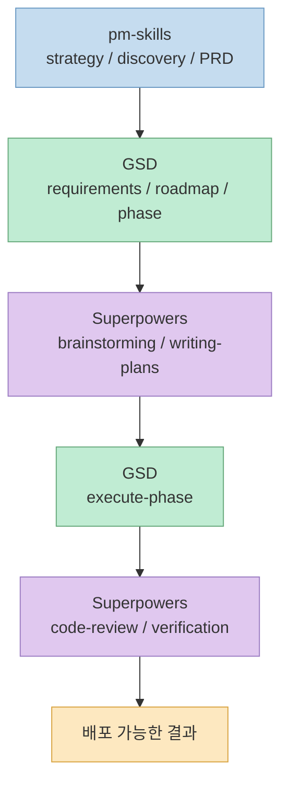
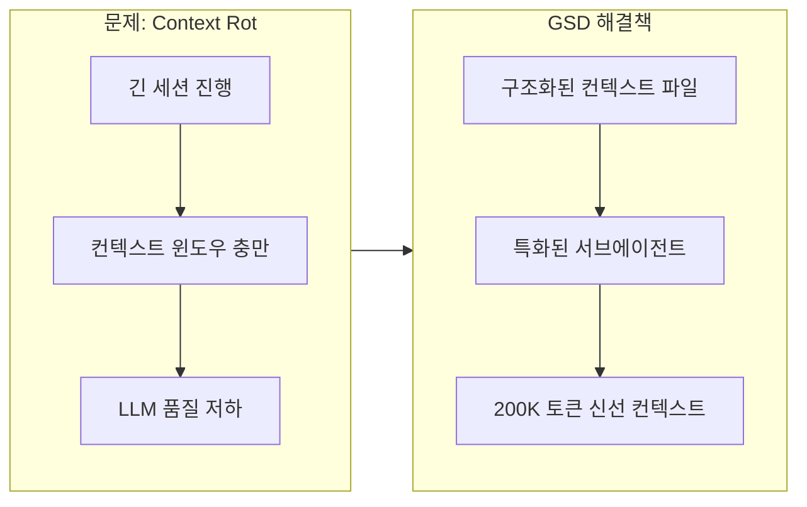
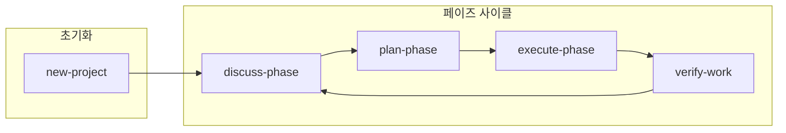
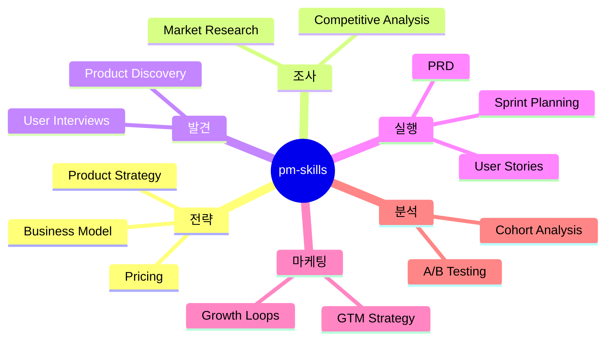
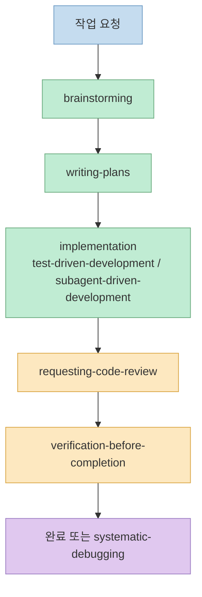
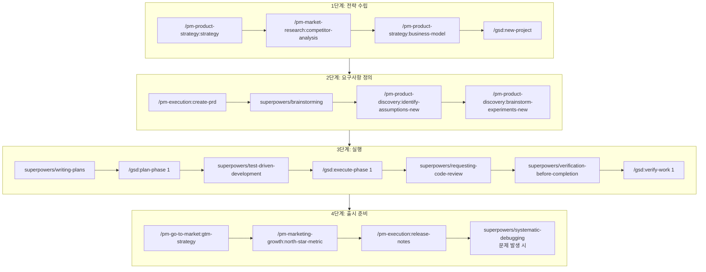
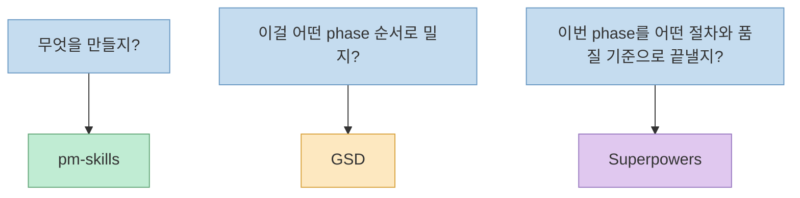

## 왜 이 조합인가

Claude Code 생태계에는 다양한 스킬과 플러그인이 존재합니다. 그중에서도 **GSD + pm-skills + Superpowers** 조합이 강한 이유는, 셋이 같은 일을 두 번 하지 않기 때문입니다.<br>`pm-skills` 가 **무엇을 만들지** 를 정리하고, `GSD` 가 **어떤 phase 순서로 밀지** 를 고정하고, `Superpowers` 가 각 phase 안에서 **어떻게 생각하고 계획하고 검증할지** 를 붙입니다.
<!--more-->



각 도구의 핵심 역할:

| 도구 | 층위 | 핵심 책임 |
|------|------|----------|
| **pm-skills** | 제품 판단/PM 산출물 | "무엇을 만들고 왜 지금 만들어야 하는지" |
| **GSD** | 프로젝트 운영/phase control | "이걸 어떤 순서와 상태로 밀어갈지" |
| **Superpowers** | phase 내부 실행 규율 | "이번 phase 를 어떤 절차와 품질 기준으로 끝낼지" |

핵심은 `Superpowers` 를 주변 보조 도구로 두지 않는 것입니다.<br>실전에서는 `pm-skills` 산출물을 `GSD` 에 태우고, 각 phase 내부를 `Superpowers` 로 정리해야 셋이 제대로 맞물립니다.

<!--more-->

## GSD: 프로젝트 진행 방식 통제

**GSD (Get Shit Done)** 는 Claude Code를 위한 메타 프롬프팅, 컨텍스트 엔지니어링, 스펙 기반 개발 시스템입니다. 핵심은 **"무엇을 할지"가 아니라 "어떻게 진행할지"를 통제**합니다.

### GSD가 해결하는 문제: Context Rot

GSD의 핵심 철학은 **Context Rot** 문제를 해결하는 것입니다. LLM은 긴 세션이 진행되면서 컨텍스트 윈도우가 차고, 품질이 저하되는 문제가 있습니다. GSD는 이를 **구조화된 컨텍스트 파일**과 **특화된 서브에이전트**로 해결합니다.



### 설치

```bash
npx get-shit-done-cc@latest
```

**GitHub:** https://github.com/gsd-build/get-shit-done

### GSD의 핵심 컨셉

GSD는 프로젝트를 **페이즈(Phase)** 단위로 나누고, 각 페이즈를 **계획(Plan) → 실행(Execute) → 검증(Verify)** 사이클로 관리합니다.



### 주요 명령어

```bash
# 프로젝트 초기화 (질문 → 리서치 → 요구사항 → 로드맵)
/gsd:new-project

# 페이즈 계획 수립
/gsd:plan-phase 1

# 페이즈 실행
/gsd:execute-phase 1

# 진행 상황 확인
/gsd:progress

# 디버깅 세션 시작
/gsd:debug "로그인 버튼 작동 안 함"
```

### GSD의 특화된 서브에이전트

GSD는 각 작업 단계에 최적화된 **특화 서브에이전트**를 사용합니다. 각 에이전트는 신선한 200K 토큰 컨텍스트로 작동합니다.

| 에이전트 | 역할 |
|----------|------|
| **Orchestrator** | 얇은 워크플로우 코디네이터 |
| **Researcher** | 코드베이스 분석 (신선한 컨텍스트) |
| **Planner** | XML 기반 구현 계획 생성 |
| **Plan Checker** | 8차원 계획 검증 |
| **Executor** | 원자적 커밋으로 코드 구현 |
| **Verifier** | 결과 검증 |
| **Nyquist Validator** | 테스트 커버리지 매핑 |

### 모델 프로필

GSD는 비용과 품질의 균형을 위해 세 가지 프로필을 제공합니다。

| 프로필 | 설명 |
|--------|------|
| **quality** | Opus 중심, 최고 품질, 높은 비용 |
| **balanced** (기본) | 계획은 Opus, 실행은 Sonnet |
| **budget** | Sonnet/Haiku 중심, 낮은 비용, 빠른 속도 |

```bash
# 프로필 변경
/gsd:set-profile budget
```

### GSD가 생성하는 파일 구조

```
.planning/
├── PROJECT.md          # 프로젝트 비전
├── ROADMAP.md          # 페이즈 분해
├── STATE.md            # 프로젝트 메모리
├── REQUIREMENTS.md     # 요구사항 (REQ-ID)
└── phases/
    └── 01-foundation/
        ├── 01-01-PLAN.md
        └── 01-01-SUMMARY.md
```

### GSD 단독 사용 시나리오

```bash
# 새 프로젝트 시작
/gsd:new-project

# 컨텍스트 정리 후 첫 페이즈 계획
/clear
/gsd:plan-phase 1

# 실행
/clear
/gsd:execute-phase 1
```

## pm-skills: PM 문서와 제품 판단

**pm-skills** 는 Paweł Huryn이 만든 오픈소스 PM 스킬 마켓플레이스입니다. **8개 플러그인, 100개 이상의 스킬**로 제품 관리 전체 라이프사이클을 커버합니다.

### 핵심 철학

> "General AI gives you text, PM Skills gives you structure"

pm-skills는 단순한 텍스트 생성이 아니라, **검증된 PM 프레임워크를 실행 가능한 AI 워크플로우로 변환**합니다. Teresa Torres (OST), Marty Cagan (INSPIRED), Alberto Savoia (The Right It) 등 12명 이상의 PM 사상가들의 프레임워크를 기반으로 합니다。

### 설치

**Claude Code CLI:**

```bash
# 마켓플레이스 추가
claude plugin marketplace add phuryn/pm-skills

# 개별 플러그인 설치
claude plugin install pm-toolkit@pm-skills
claude plugin install pm-product-strategy@pm-skills
claude plugin install pm-product-discovery@pm-skills
claude plugin install pm-market-research@pm-skills
claude plugin install pm-data-analytics@pm-skills
claude plugin install pm-marketing-growth@pm-skills
claude plugin install pm-go-to-market@pm-skills
claude plugin install pm-execution@pm-skills
```

**Claude Cowork (데스크톱 앱):**

1. Customize → Browse plugins → Personal → +
2. "Add marketplace from GitHub"
3. `phuryn/pm-skills` 입력

**한국어 버전:**

```bash
# 완전한 한국어 현지화 버전
claude plugin marketplace add lucas-flatwhite/pm-skills-ko
```

**GitHub:** https://github.com/phuryn/pm-skills

### pm-skills 모듈 구성



### 8개 모듈 상세

| 모듈 | 스킬 수 | 커맨드 | 용도 |
|------|---------|--------|------|
| **pm-product-discovery** | 13 | 5 | 아이디에이션, 실험, OST, 인터뷰, 가정 검증 |
| **pm-product-strategy** | 12 | 5 | 비전, 비즈니스 모델, 가격 책정, 경쟁 분석 |
| **pm-execution** | 15 | 10 | PRD, OKR, 로드맵, 스프린트, 회고, 이해관계자 관리 |
| **pm-market-research** | 7 | 3 | 페르소나, 세분화, 여정 맵, 시장 규모 |
| **pm-data-analytics** | 3 | 3 | SQL, 코호트 분석, A/B 테스트 |
| **pm-go-to-market** | 6 | 3 | 교두보, ICP, 성장 루프, GTM 모션, 배틀카드 |
| **pm-marketing-growth** | 5 | 2 | 마케팅 아이디어, 포지셔닝, 가치 제안, 네이밍 |
| **pm-toolkit** | 4 | 5 | 이력서 리뷰, NDA, 개인정보처리방침, 문법 검사 |

**총 65개 스킬, 36개 체인드 커맨드**

### 핵심 워크플로우 커맨드

pm-skills는 개별 스킬 외에도 **체인드 커맨드**를 제공합니다. 여러 스킬을 연결해 하나의 워크플로우로 실행합니다。

```bash
# 전체 디스커버리 사이클: 아이디어 → 가정 → 우선순위 → 실험
/discover

# 8섹션 PRD 작성 (문제 진술서에서)
/write-prd

# 9섹션 Product Strategy Canvas 생성
/strategy

# 팀 수준 OKR 브레인스토밍
/plan-okrs

# 스프린트 라이프사이클 (계획|회고|릴리스)
/sprint

# 전체 GTM 전략 (교두보 → 런칭)
/plan-launch

# North Star Metric + 입력 지표 정의
/north-star

# 경쟁 환경 분석
/competitive-analysis
```

### pm-skills 실전 사용 예시

```bash
# 제품 전략 수립
/pm-product-strategy:strategy

# 비즈니스 모델 캔버스 작성
/pm-product-strategy:business-model

# 경쟁사 분석
/pm-market-research:competitor-analysis

# PRD 작성
/pm-execution:create-prd

# 스프린트 계획
/pm-execution:sprint-plan

# A/B 테스트 분석
/pm-data-analytics:ab-test-analysis
```

## Superpowers: phase 안에서 생각-계획-검증을 강제하는 실행 규율

**Superpowers** 는 단순한 스킬 마켓플레이스라기보다, Claude Code가 바로 구현으로 뛰어들지 않게 만드는 **methodology-as-code** 에 가깝습니다.<br>핵심은 프로젝트 전체를 관리하는 것이 아니라, **각 작업과 각 phase 안에서 브레인스토밍, 계획, 구현, 리뷰, 검증을 강제** 하는 데 있습니다.

### Superpowers의 핵심 가치

1. **브레인스토밍 강제**: `brainstorming` 으로 범위와 성공 기준을 먼저 정리
2. **계획 강제**: `writing-plans` 로 구현 순서와 검증 방법을 명문화
3. **구현 규율**: `test-driven-development`, `subagent-driven-development` 로 대충 코딩을 줄임
4. **완료 기준 명확화**: `requesting-code-review`, `verification-before-completion` 으로 "진짜 끝났는가"를 확인
5. **문제 해결 절차화**: `systematic-debugging` 으로 버그 대응을 감으로 하지 않음

### Superpowers를 어디에 끼워 넣어야 하나

`Superpowers` 는 GSD와 경쟁하는 상위 워크플로우가 아니라, **GSD의 각 phase 안을 정리하는 하위 실행 규율** 로 쓰는 것이 가장 자연스럽습니다.

| 타이밍 | 넣을 Superpowers 스킬 | 목적 |
|------|----------------------|------|
| PRD 초안이 나온 직후 | `brainstorming` | 요구사항을 MVP 범위로 다시 줄이기 |
| `/gsd:plan-phase` 직전 | `writing-plans` | 구현 순서, acceptance criteria, 검증 방법 정리 |
| `/gsd:execute-phase` 중 | `test-driven-development`, `subagent-driven-development` | 구현을 더 잘게 나누고 실패 비용 줄이기 |
| 구현 직후 | `requesting-code-review`, `verification-before-completion` | 리뷰와 수동 검증 없이 완료 선언하지 않기 |
| 버그 발생 시 | `systematic-debugging` | 재현, 가설, 검증 순서로 원인 추적 |

### Superpowers 내부 워크플로우



## 조합 워크플로우: 실전 가이드

이제 세 도구를 조합하는 실전 워크플로우를 살펴보겠습니다.

### 시나리오: 새로운 SaaS 제품 개발



### 단계별 프롬프트 예제

아래 예시는 `새로운 B2B 프로젝트 관리 SaaS` 를 만든다고 가정한 복붙용 샘플입니다. 핵심은 `pm-skills` 로 입력을 만들고, `Superpowers` 로 그 입력을 실행 가능한 형태로 다듬은 뒤, `GSD` 로 phase를 밀어가는 순서를 지키는 것입니다.

#### 1단계: 시장과 전략을 먼저 고정

```bash
/pm-product-strategy:strategy
```

> "한국과 일본의 20~100인 스타트업을 위한 프로젝트 관리 SaaS 전략을 짜줘. Jira보다 가볍고, Notion보다 운영 친화적이어야 한다. 타깃 ICP, 핵심 pain point 3개, 차별 포인트 3개, 초기 가격 가설, 첫 6개월 리스크를 포함해줘."

```bash
/pm-market-research:competitor-analysis
```

> "ClickUp, Jira, Linear, Notion을 비교해줘. 기능 나열이 아니라 onboarding 복잡도, 협업 구조, 한국 팀 적합성, 도입 장벽, switching cost 중심으로 분석해줘. 우리가 어디에서 파고들 수 있는지도 적어줘."

#### 2단계: PRD를 쓰고, Superpowers로 scope를 압축

```bash
/pm-execution:create-prd
```
> "MVP 범위는 이메일 로그인, 워크스페이스 생성, 칸반 보드, 댓글, 기본 활동 로그다. 제외 범위는 자동화, 간트 차트, 외부 연동이다. PM이 바로 개발팀에 넘길 수 있는 수준의 PRD 초안을 써줘."


```bash
/superpowers:brainstorming
```
> 이 PRD를 기준으로 2주 안에 shipping 가능한 MVP로 다시 줄여줘. Must have / should have / later 로 나누고, 이번 phase 에 절대 넣지 말아야 할 범위와 이유도 써줘. 그리고 구현 전에 꼭 확인해야 할 모호한 요구사항 5개를 뽑아줘.

```bash
/pm-product-discovery:identify-assumptions-new
```
> 다음 가정을 검증하고 싶다: 
> 1) 20인 이하 팀도 칸반 툴에 비용을 지불한다. 
> 2) 댓글과 활동 로그만 있어도 초기 협업 가치를 느낀다. 
> 3) 관리자 1명이 전체 도입을 주도한다. 각 가정을 검증 가능성, 위험도, 실험 우선순위 기준으로 정리해줘."


#### 3단계: 개발 phase 로 바꾸기 전에 plan을 고정

`superpowers/writing-plans`

> "지금까지 정리한 전략, PRD, MVP 범위를 바탕으로 Phase 1 구현 계획을 써줘. 목표는 이메일 로그인, 워크스페이스 생성, 칸반 보드 조회다. 파일 단위 작업, acceptance criteria, 어떤 테스트로 검증할지, 어떤 기능은 이번 phase 에 미루는지까지 명확하게 적어줘."

```bash
/gsd:plan-phase 1
```

> "Phase 1 목표는 인증, 워크스페이스 생성, 기본 보드 조회다. 앞서 정리한 scope 축소 결과를 반영해서 requirements 와 tasks 를 phase 계획으로 정리해줘. 다음 phase 로 넘겨야 할 항목은 별도로 분리해줘."

```bash
/pm-execution:user-stories
```

> "아래 기능을 user story 와 acceptance criteria 로 바꿔줘: 이메일 회원가입, 로그인, 워크스페이스 만들기, 보드 목록 보기. 엔지니어와 QA가 바로 이해할 수 있게 Given/When/Then 스타일로 써줘."

#### 4단계: 구현 후에도 Superpowers를 계속 붙인다

```bash   
superpowers/test-driven-development
```

> "이번 phase 에서 로그인과 워크스페이스 생성 플로우를 TDD로 진행하고 싶다. 가장 위험한 테스트부터 순서를 제안하고, 어떤 실패를 먼저 재현해야 하는지 정리해줘."

```bash
/gsd:execute-phase 1
```

```bash
superpowers/requesting-code-review
```

> "방금 끝난 phase diff를 리뷰해줘. 요구사항 누락, 테스트 약한 부분, 과한 구현, 장기 유지보수 리스크를 중심으로 보고, 꼭 고쳐야 할 것과 나중에 미뤄도 되는 것을 나눠줘."

```bash
superpowers/verification-before-completion
```

> "완료라고 말하기 전에 실제 검증이 충분한지 체크해줘. 빌드, 테스트, 수동 QA, edge case 확인 중 빠진 것이 있으면 완료 선언을 막아줘."

### 디버깅과 데이터 분석 프롬프트 예제

```bash
/gsd:debug 
```
> "모바일 Safari에서 칸반 카드 드래그가 시작되지 않는다. 데스크톱 Chrome에서는 정상이다. 최근 변경은 drag handle 영역 확장과 CSS overflow 수정이다."

```bash
superpowers/systematic-debugging
```

> "이 버그를 감으로 고치지 말고 재현 조건, 가능한 원인, 확인할 로그/DOM 상태, 반증 방법 순서로 정리해줘. 첫 번째 시도에서 실패하면 어떤 대안 가설로 넘어갈지도 적어줘."

```bash
/pm-data-analytics:ab-test-analysis
```

> "온보딩 A/B 테스트 결과다. A안은 전환율 15%, B안은 22%이고 표본 수는 각각 1,200명이다. 통계적으로 의미가 있는지, 다음 실험에서 무엇을 바꿔야 하는지, 제품 판단으로 어떻게 연결할지 정리해줘."

## 역할 분담 원칙

이 조합의 핵심은 **명확한 역할 분담**입니다.



### 결정 가이드

| 질문 | 사용할 도구 | 예시 |
|------|------------|------|
| "어떤 기능을 우선 개발할까?" | pm-skills | `/pm-product-discovery:prioritize-features` |
| "이번 phase scope를 더 줄이고 싶다" | pm-skills + Superpowers | `/pm-execution:create-prd` → `superpowers/brainstorming` |
| "이번 스프린트에 뭘 넣을까?" | pm-skills + GSD + Superpowers | `/pm-execution:sprint-plan` → `superpowers/writing-plans` → `/gsd:plan-phase` |
| "이 버그 어떻게 추적할까?" | GSD + Superpowers | `/gsd:debug "..."` + `superpowers/systematic-debugging` |
| "PRD 초안이 필요해" | pm-skills | `/pm-execution:create-prd` |
| "이 코드 리뷰해줘" | Superpowers | `superpowers/requesting-code-review` |
| "완료 선언 전에 진짜 끝났는지 확인하고 싶다" | Superpowers | `superpowers/verification-before-completion` |

## 팁과 모범 사례

### 1. 컨텍스트 관리

```bash
# 큰 작업 전에는 컨텍스트 정리
/clear

# 작업 재개 시
/gsd:resume-work
```

### 2. 점진적 적용

모든 도구를 한 번에 도입하지 마세요. 순서대로:

1. **GSD만 먼저**: 기본 워크플로우 익히기
2. **pm-skills 추가**: PM 산출물 자동화
3. **Superpowers를 phase 안에 삽입**: PRD 이후 브레인스토밍, phase 계획 전 계획 정리, 완료 전 검증 습관 붙이기

### 3. 문서화 습관

```bash
# 아이디어가 떠오르면 즉시 기록
/gsd:note "다음 버전에 다크모드 지원 고려"

# 나중에 확인
/gsd:check-todos
```

### 4. 주기적 진행 확인

```bash
# 하루 시작할 때
/gsd:progress

# 주말 회고
/pm-execution:retro
```

## 마무리

GSD + pm-skills + Superpowers 조합의 핵심은 **층위 분리**입니다:

- **pm-skills**: **무엇을 만들지** 와 **왜 지금 만드는지** 를 정리
- **GSD**: 그 산출물을 **requirements, roadmap, phase** 로 연결
- **Superpowers**: 각 phase 안에서 **생각-계획-구현-리뷰-검증** 절차를 강제

실전에서 가장 흔한 실수는 `GSD` 만 길게 쓰고 `Superpowers` 는 코드 리뷰 정도에만 붙이는 것입니다.<br>오히려 효과가 큰 조합은 `pm-skills` 로 입력을 만들고, `Superpowers` 로 scope와 plan을 먼저 다듬은 뒤, `GSD` 로 phase를 실행하고 다시 `Superpowers` 로 검증하는 루프입니다.<br>이렇게 굴리면 각 도구가 서로를 덮어쓰지 않고, 더 **덜 꼬이고**, 더 **예측 가능하고**, 더 **재현 가능한** workflow가 됩니다.

---

**참고 자료:**

- **GSD (Get Shit Done):**
  - 설치: `npx get-shit-done-cc@latest`
  - GitHub: https://github.com/gsd-build/get-shit-done
  - Discord: https://discord.gg/gsd
  - X: [@gsd_foundation](https://x.com/gsd_foundation)

- **pm-skills:**
  - GitHub: https://github.com/phuryn/pm-skills
  - 한국어 버전: https://github.com/lucas-flatwhite/pm-skills-ko
  - 뉴스레터: [The Product Compass](https://www.productcompass.pm)
  - 라이선스: MIT

- **Superpowers:**
  - GitHub: https://github.com/obra/superpowers
  - 설치: `/plugin marketplace add obra/superpowers-marketplace`
  - 설치: `/plugin install superpowers@superpowers-marketplace`
