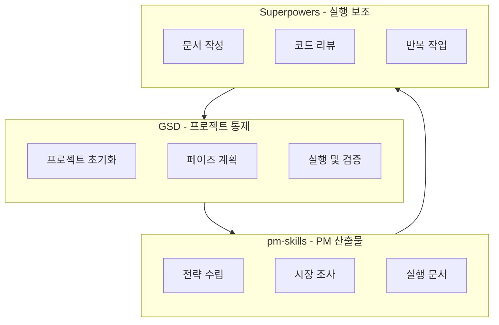
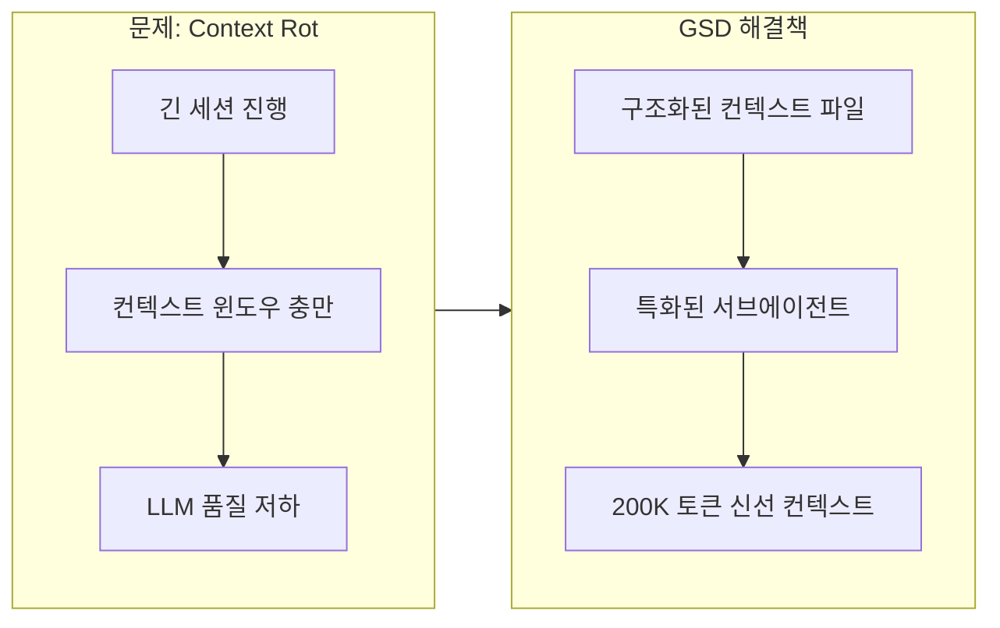
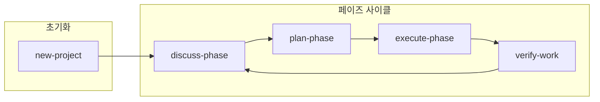
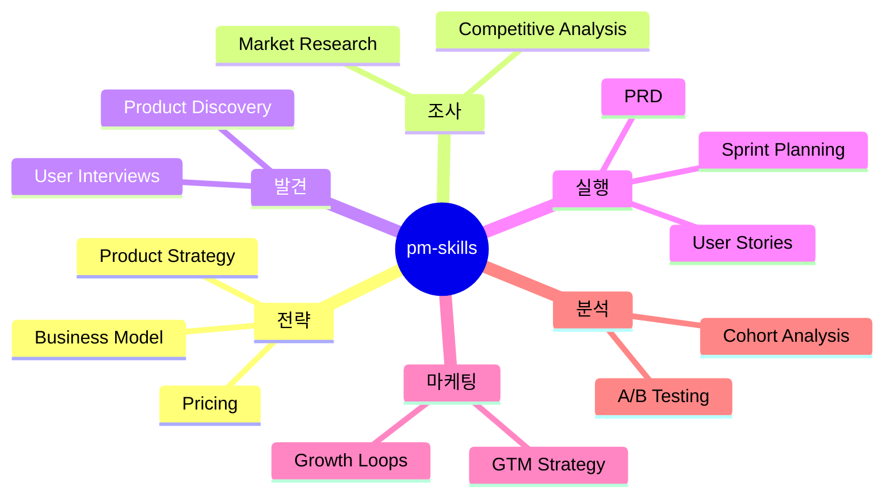
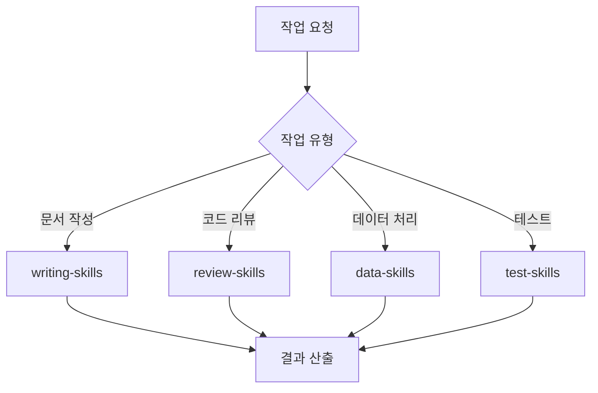
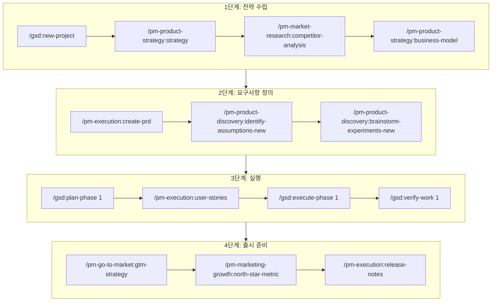
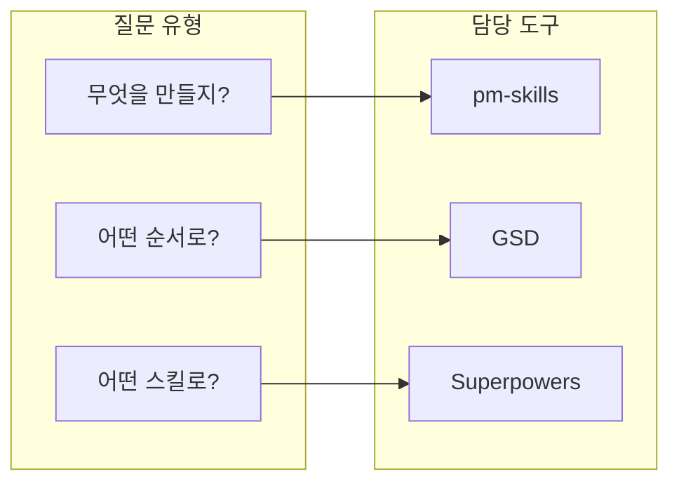

## 왜 이 조합인가

Claude Code 생태계에는 다양한 스킬과 플러그인이 존재합니다. 그중에서도 **GSD + pm-skills + Superpowers** 조합은 서로 다른 층위를 담당하기 때문에 특히 강력합니다.



각 도구의 핵심 역할:

| 도구 | 층위 | 핵심 책임 |
|------|------|----------|
| **GSD** | 상위 workflow/control | "어떤 순서로 밀지" |
| **pm-skills** | PM 산출물/의사결정 | "무엇을 만들지" |
| **Superpowers** | 실행 보조/skills marketplace | "개별 작업은 어떤 skill로" |

이렇게 역할을 분리하면 **덜 꼬입니다**. 각 도구가 자신의 영역에 집중하고, 서로를 보완하는 구조입니다.

<!--more-->

## GSD: 프로젝트 진행 방식 통제

**GSD (Get Shit Done)** 는 Claude Code를 위한 메타 프롬프팅, 컨텍스트 엔지니어링, 스펙 기반 개발 시스템입니다. 핵심은 **"무엇을 할지"가 아니라 "어떻게 진행할지"를 통제**합니다.

### GSD가 해결하는 문제: Context Rot

GSD의 핵심 철학은 **Context Rot** 문제를 해결하는 것입니다. LLM은 긴 세션이 진행되면서 컨텍스트 윈도우가 차고, 품질이 저하되는 문제가 있습니다. GSD는 이를 **구조화된 컨텍스트 파일**과 **특화된 서브에이전트**로 해결합니다.



### 설치

```bash
npx get-shit-done-cc@latest
```

**GitHub:** https://github.com/gsd-build/get-shit-done

### GSD의 핵심 컨셉

GSD는 프로젝트를 **페이즈(Phase)** 단위로 나누고, 각 페이즈를 **계획(Plan) → 실행(Execute) → 검증(Verify)** 사이클로 관리합니다.



### 주요 명령어

```bash
# 프로젝트 초기화 (질문 → 리서치 → 요구사항 → 로드맵)
/gsd:new-project

# 페이즈 계획 수립
/gsd:plan-phase 1

# 페이즈 실행
/gsd:execute-phase 1

# 진행 상황 확인
/gsd:progress

# 디버깅 세션 시작
/gsd:debug "로그인 버튼 작동 안 함"
```

### GSD의 특화된 서브에이전트

GSD는 각 작업 단계에 최적화된 **특화 서브에이전트**를 사용합니다. 각 에이전트는 신선한 200K 토큰 컨텍스트로 작동합니다.

| 에이전트 | 역할 |
|----------|------|
| **Orchestrator** | 얇은 워크플로우 코디네이터 |
| **Researcher** | 코드베이스 분석 (신선한 컨텍스트) |
| **Planner** | XML 기반 구현 계획 생성 |
| **Plan Checker** | 8차원 계획 검증 |
| **Executor** | 원자적 커밋으로 코드 구현 |
| **Verifier** | 결과 검증 |
| **Nyquist Validator** | 테스트 커버리지 매핑 |

### 모델 프로필

GSD는 비용과 품질의 균형을 위해 세 가지 프로필을 제공합니다。

| 프로필 | 설명 |
|--------|------|
| **quality** | Opus 중심, 최고 품질, 높은 비용 |
| **balanced** (기본) | 계획은 Opus, 실행은 Sonnet |
| **budget** | Sonnet/Haiku 중심, 낮은 비용, 빠른 속도 |

```bash
# 프로필 변경
/gsd:set-profile budget
```

### GSD가 생성하는 파일 구조

```
.planning/
├── PROJECT.md          # 프로젝트 비전
├── ROADMAP.md          # 페이즈 분해
├── STATE.md            # 프로젝트 메모리
├── REQUIREMENTS.md     # 요구사항 (REQ-ID)
└── phases/
    └── 01-foundation/
        ├── 01-01-PLAN.md
        └── 01-01-SUMMARY.md
```

### GSD 단독 사용 시나리오

```bash
# 새 프로젝트 시작
/gsd:new-project

# 컨텍스트 정리 후 첫 페이즈 계획
/clear
/gsd:plan-phase 1

# 실행
/clear
/gsd:execute-phase 1
```

## pm-skills: PM 문서와 제품 판단

**pm-skills** 는 Paweł Huryn이 만든 오픈소스 PM 스킬 마켓플레이스입니다. **8개 플러그인, 100개 이상의 스킬**로 제품 관리 전체 라이프사이클을 커버합니다.

### 핵심 철학

> "General AI gives you text, PM Skills gives you structure"

pm-skills는 단순한 텍스트 생성이 아니라, **검증된 PM 프레임워크를 실행 가능한 AI 워크플로우로 변환**합니다. Teresa Torres (OST), Marty Cagan (INSPIRED), Alberto Savoia (The Right It) 등 12명 이상의 PM 사상가들의 프레임워크를 기반으로 합니다。

### 설치

**Claude Code CLI:**

```bash
# 마켓플레이스 추가
claude plugin marketplace add phuryn/pm-skills

# 개별 플러그인 설치
claude plugin install pm-toolkit@pm-skills
claude plugin install pm-product-strategy@pm-skills
claude plugin install pm-product-discovery@pm-skills
claude plugin install pm-market-research@pm-skills
claude plugin install pm-data-analytics@pm-skills
claude plugin install pm-marketing-growth@pm-skills
claude plugin install pm-go-to-market@pm-skills
claude plugin install pm-execution@pm-skills
```

**Claude Cowork (데스크톱 앱):**

1. Customize → Browse plugins → Personal → +
2. "Add marketplace from GitHub"
3. `phuryn/pm-skills` 입력

**한국어 버전:**

```bash
# 완전한 한국어 현지화 버전
claude plugin marketplace add lucas-flatwhite/pm-skills-ko
```

**GitHub:** https://github.com/phuryn/pm-skills

### pm-skills 모듈 구성



### 8개 모듈 상세

| 모듈 | 스킬 수 | 커맨드 | 용도 |
|------|---------|--------|------|
| **pm-product-discovery** | 13 | 5 | 아이디에이션, 실험, OST, 인터뷰, 가정 검증 |
| **pm-product-strategy** | 12 | 5 | 비전, 비즈니스 모델, 가격 책정, 경쟁 분석 |
| **pm-execution** | 15 | 10 | PRD, OKR, 로드맵, 스프린트, 회고, 이해관계자 관리 |
| **pm-market-research** | 7 | 3 | 페르소나, 세분화, 여정 맵, 시장 규모 |
| **pm-data-analytics** | 3 | 3 | SQL, 코호트 분석, A/B 테스트 |
| **pm-go-to-market** | 6 | 3 | 교두보, ICP, 성장 루프, GTM 모션, 배틀카드 |
| **pm-marketing-growth** | 5 | 2 | 마케팅 아이디어, 포지셔닝, 가치 제안, 네이밍 |
| **pm-toolkit** | 4 | 5 | 이력서 리뷰, NDA, 개인정보처리방침, 문법 검사 |

**총 65개 스킬, 36개 체인드 커맨드**

### 핵심 워크플로우 커맨드

pm-skills는 개별 스킬 외에도 **체인드 커맨드**를 제공합니다. 여러 스킬을 연결해 하나의 워크플로우로 실행합니다。

```bash
# 전체 디스커버리 사이클: 아이디어 → 가정 → 우선순위 → 실험
/discover

# 8섹션 PRD 작성 (문제 진술서에서)
/write-prd

# 9섹션 Product Strategy Canvas 생성
/strategy

# 팀 수준 OKR 브레인스토밍
/plan-okrs

# 스프린트 라이프사이클 (계획|회고|릴리스)
/sprint

# 전체 GTM 전략 (교두보 → 런칭)
/plan-launch

# North Star Metric + 입력 지표 정의
/north-star

# 경쟁 환경 분석
/competitive-analysis
```

### pm-skills 실전 사용 예시

```bash
# 제품 전략 수립
/pm-product-strategy:strategy

# 비즈니스 모델 캔버스 작성
/pm-product-strategy:business-model

# 경쟁사 분석
/pm-market-research:competitor-analysis

# PRD 작성
/pm-execution:create-prd

# 스프린트 계획
/pm-execution:sprint-plan

# A/B 테스트 분석
/pm-data-analytics:ab-test-analysis
```

## Superpowers: 실행 보조와 스킬 조합

**Superpowers** 는 Claude Code용 플러그인 마켓플레이스이자 스킬 조합 시스템입니다. 개별 작업을 처리하는 **실행 보조** 역할에 집중합니다.

### Superpowers의 핵심 가치

1. **스킬 마켓플레이스**: 다양한 전문 스킬을 검색하고 설치
2. **조합형 사용**: 여러 스킬을 연결해 복잡한 워크플로우 구축
3. **반복 작업 자동화**: 문서 작성, 리뷰, 포맷팅 등

### Superpowers 활용 패턴



## 조합 워크플로우: 실전 가이드

이제 세 도구를 조합하는 실전 워크플로우를 살펴보겠습니다.

### 시나리오: 새로운 SaaS 제품 개발



### 단계별 프롬프트 예제

#### 1단계: 프로젝트 초기화 및 전략

```bash
# GSD로 프로젝트 구조 생성
/gsd:new-project

# 제품 전략 수립
/pm-product-strategy:strategy
# 프롬프트 예시: "B2B SaaS 프로젝트 관리 도구의 제품 전략을 수립해줘"

# 시장 분석
/pm-market-research:market-sizing
# 프롬프트 예시: "한국 SME 대상 프로젝트 관리 SaaS 시장 규모를 추정해줘"
```

#### 2단계: 요구사항 및 발견

```bash
# PRD 작성
/pm-execution:create-prd
# 프롬프트 예시: "MVP 기능: 칸반 보드, 팀 관리, 기본 리포팅"

# 가정 식별
/pm-product-discovery:identify-assumptions-new
# 프롬프트 예시: "SME가 프로젝트 관리 도구에 월 5만원 이상 지불할 것이라는 가정을 검증하고 싶어"

# 사용자 인터뷰 스크립트
/pm-product-discovery:interview-script
# 프롬프트 예시: "10인 규모 스타트업 PM을 대상으로 한 인터뷰 스크립트"
```

#### 3단계: 개발 실행

```bash
# GSD로 페이즈 계획
/gsd:plan-phase 1
# 프롬프트 예시: "Phase 1: 인증 시스템과 기본 칸반 보드 구현"

# 사용자 스토리 작성
/pm-execution:user-stories
# 프롬프트 예시: "REQ-001: 사용자는 이메일로 가입할 수 있다"

# 실행
/gsd:execute-phase 1

# 검증
/gsd:verify-work 1
```

#### 4단계: 출시 준비

```bash
# GTM 전략
/pm-go-to-market:gtm-strategy
# 프롬프트 예시: "Product Hunt 런칭과 한국 스타트업 커뮤니티 타겟팅"

# North Star Metric 정의
/pm-marketing-growth:north-star-metric
# 프롬프트 예시: "주간 활성 프로젝트 수를 North Star로 설정"

# 릴리스 노트
/pm-execution:release-notes
# 프롬프트 예시: "v1.0.0 출시: 칸반 보드, 팀 관리, 기본 리포팅"
```

### 디버깅 및 문제 해결

```bash
# 개발 중 버그 발견 시
/gsd:debug "칸반 카드 드래그앤드롭이 모바일에서 작동 안 함"

# A/B 테스트 분석
/pm-data-analytics:ab-test-analysis
# 프롬프트 예시: "온보딩 A/B 테스트 결과: A안 15% 전환율, B안 22% 전환율"
```

## 역할 분담 원칙

이 조합의 핵심은 **명확한 역할 분담**입니다.



### 결정 가이드

| 질문 | 사용할 도구 | 예시 |
|------|------------|------|
| "어떤 기능을 우선 개발할까?" | pm-skills | `/pm-product-discovery:prioritize-features` |
| "이번 스프린트에 뭘 넣을까?" | pm-skills + GSD | `/pm-execution:sprint-plan` → `/gsd:plan-phase` |
| "이 버그 어떻게 추적할까?" | GSD | `/gsd:debug "..."` |
| "PRD 초안이 필요해" | pm-skills | `/pm-execution:create-prd` |
| "이 코드 리뷰해줘" | Superpowers | 코드 리뷰 스킬 |

## 팁과 모범 사례

### 1. 컨텍스트 관리

```bash
# 큰 작업 전에는 컨텍스트 정리
/clear

# 작업 재개 시
/gsd:resume-work
```

### 2. 점진적 적용

모든 도구를 한 번에 도입하지 마세요. 순서대로:

1. **GSD만 먼저**: 기본 워크플로우 익히기
2. **pm-skills 추가**: PM 산출물 자동화
3. **Superpowers로 확장**: 실행 보조 강화

### 3. 문서화 습관

```bash
# 아이디어가 떠오르면 즉시 기록
/gsd:note "다음 버전에 다크모드 지원 고려"

# 나중에 확인
/gsd:check-todos
```

### 4. 주기적 진행 확인

```bash
# 하루 시작할 때
/gsd:progress

# 주말 회고
/pm-execution:retro
```

## 마무리

GSD + pm-skills + Superpowers 조합의 핵심은 **층위 분리**입니다:

- **GSD**: 프로젝트의 **맥락과 흐름** 관리
- **pm-skills**: **PM의사결정과 산출물** 지원
- **Superpowers**: **개별 작업의 실행** 보조

이렇게 분리하면 각 도구가 자신의 영역에 집중하고, 서로 간섭하지 않습니다. 결과적으로 더 **덜 꼬이고**, 더 **빠르고**, 더 **체계적인** 프로젝트 진행이 가능해집니다.

---

**참고 자료:**

- **GSD (Get Shit Done):**
  - 설치: `npx get-shit-done-cc@latest`
  - GitHub: https://github.com/gsd-build/get-shit-done
  - Discord: https://discord.gg/gsd
  - X: [@gsd_foundation](https://x.com/gsd_foundation)

- **pm-skills:**
  - GitHub: https://github.com/phuryn/pm-skills
  - 한국어 버전: https://github.com/lucas-flatwhite/pm-skills-ko
  - 뉴스레터: [The Product Compass](https://www.productcompass.pm)
  - 라이선스: MIT

- **Superpowers:**
  - Claude Code 스킬 마켓플레이스
  - 다양한 커뮤니티 스킬 검색 가능
