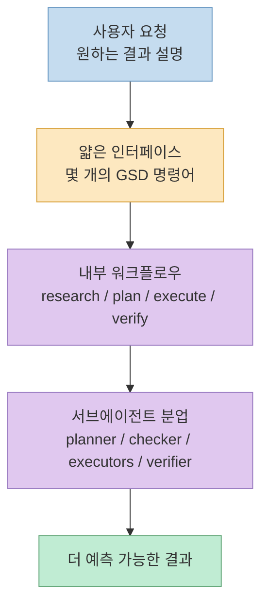
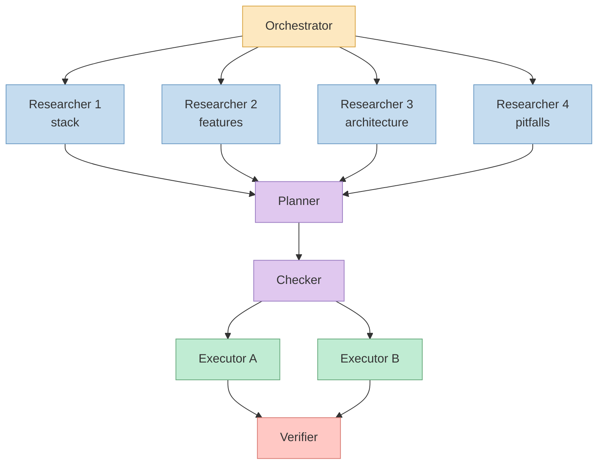
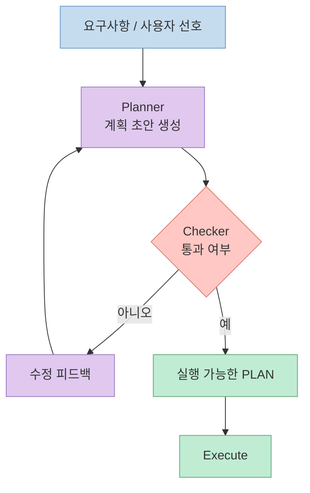
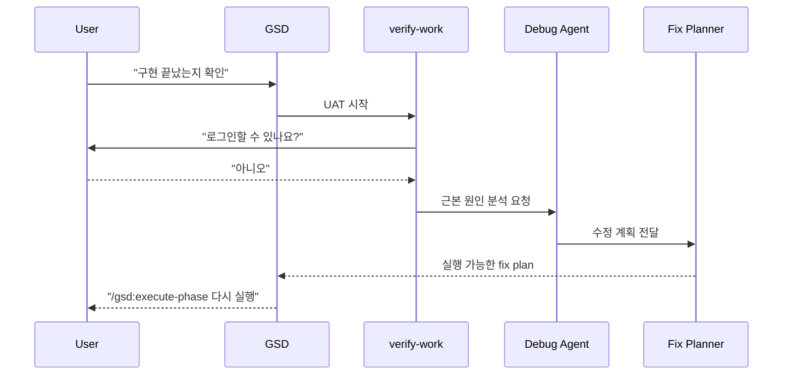
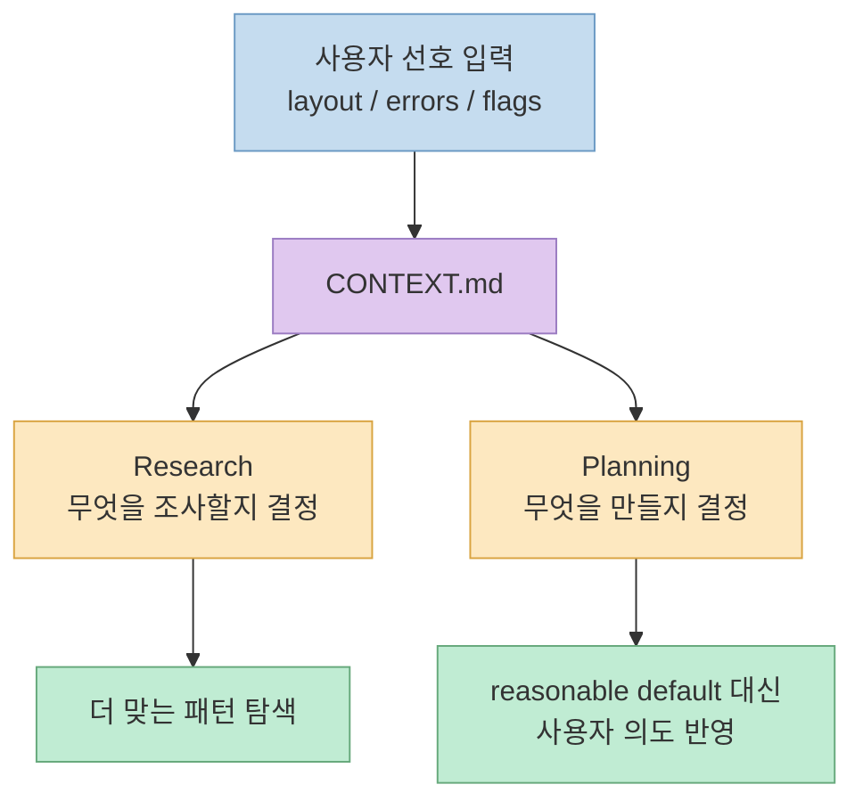
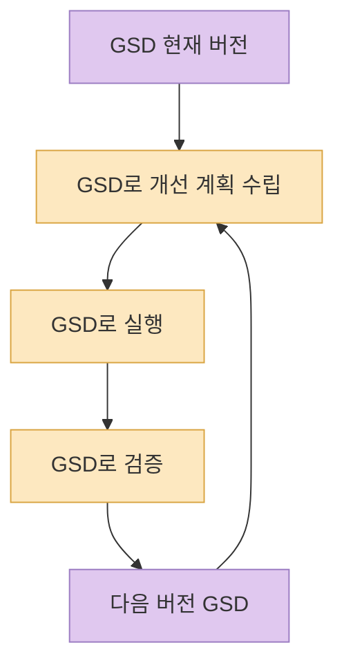

최근 Reddit의 `r/ClaudeAI`에 올라온 GSD(Get Shit Done) 업데이트 글은 단순한 "기능 추가 안내"에 가깝지 않습니다. 오히려 AI 코딩 워크플로우가 어디에서 무너지기 쉬운지, 그리고 GSD가 그 지점을 어떤 구조로 다루려는지를 짧은 글 안에 압축해서 보여줍니다. 핵심은 같습니다. **사용자가 보는 인터페이스는 더 단순하게 유지하면서, 내부에서는 연구-계획-실행-검증-디버깅을 더 강하게 분리한다** 는 점입니다.

<!--more-->

## Sources

- https://www.reddit.com/r/ClaudeAI/comments/1qf6u3f/ive_massively_improved_gsd_get_shit_done/?tl=ko
- https://www.reddit.com/r/ClaudeAI/comments/1qf6u3f/ive_massively_improved_gsd_get_shit_done/?show=original
- https://github.com/gsd-build/get-shit-done
- https://raw.githubusercontent.com/gsd-build/get-shit-done/main/README.md
- https://raw.githubusercontent.com/gsd-build/get-shit-done/main/docs/USER-GUIDE.md

## 이번 업데이트를 한 문장으로 요약하면

이 업데이트는 GSD를 단순한 "좋은 프롬프트 묶음"에서 한 단계 더 밀어 올립니다. Reddit 글에서 작성자 Lex는 멀티 에이전트 병렬 실행, 실행 전 계획 검증, `/gsd:verify-work` 기반 자동 디버깅, 그리고 discuss-phase 강화가 핵심 변화라고 설명합니다. 공식 README도 같은 방향을 반복합니다. 사용자는 몇 개의 명령어만 보지만, 내부에서는 컨텍스트 엔지니어링, XML 기반 계획, 상태 관리, 서브에이전트 오케스트레이션이 함께 돌아가도록 설계되어 있습니다.

이 구조가 중요한 이유는, 이번 업데이트가 AI 코딩에서 자주 문제로 지적되는 역할 혼재와 컨텍스트 누적을 줄이려는 방향을 분명하게 드러내기 때문입니다. GSD는 이번 글에서 바로 그 병목을 더 직접적으로 다루려는 듯한 모습을 보입니다.

## 멀티 에이전트 오케스트레이션은 왜 체감 품질을 바꾸는가

Reddit 글에서 가장 먼저 나온 변화는 "실제로 작동하는 멀티 에이전트 오케스트레이션"입니다. 작성자는 예전에는 실행이 single-threaded였지만, 이제는 4명의 researcher, 여러 executor, 그리고 전담 verifier가 병렬로 돌아간다고 설명합니다. 공식 문서도 같은 패턴을 보여줍니다. 오케스트레이터는 직접 무거운 일을 하지 않고, 단계별 전문 에이전트를 생성하고 결과를 모아서 다음 단계로 넘깁니다.

여기서 진짜 포인트는 병렬성 자체보다 **컨텍스트 분리** 입니다. 작성자는 깊은 리서치나 수천 줄의 코드 작성 이후에도 메인 컨텍스트 창이 30~40% 수준에 머문다고 강조합니다. 공식 README 역시 heavy lifting은 fresh 200k subagent contexts에서 일어나고, 메인 세션은 얇게 유지된다고 설명합니다. 즉, 멀티 에이전트는 단순한 속도 최적화가 아니라, 컨텍스트 오염을 줄이기 위한 품질 제어 장치에 가깝습니다.

## 계획을 먼저 검증한다는 것은 "코드 전에 사고를 디버깅"한다는 뜻이다

이번 업데이트의 두 번째 핵심은 planner -> checker -> revise 루프입니다. Reddit 글에서 Lex는 요구사항을 놓치거나 의존성이 깨진 계획을 더 이상 실행하지 않게 만들었다고 말합니다. 이건 사소한 개선처럼 보이지만, 실제로는 "잘못된 코드"보다 먼저 "잘못된 계획"을 잡아내겠다는 선언입니다.

AI 코딩에서 흔한 실패 패턴은 이렇습니다. 모델이 꽤 그럴듯한 계획을 쓰고, 사용자는 그 계획이 맞다고 착각하고, 실행 이후에야 누락된 요구사항과 깨진 의존성을 발견합니다. 그러면 디버깅 비용이 급격히 커집니다. GSD가 여기서 하는 일은 계획을 코드의 전 단계 산출물이 아니라, **검증 대상인 독립 객체** 로 취급하는 것입니다. 문서 기준으로도 `/gsd:plan-phase`는 research, plan, verify를 한 번에 묶고, checker를 통과하기 전까지 plan이 승인되지 않도록 설계되어 있습니다.

## `/gsd:verify-work`는 디버깅을 "사후 노동"이 아니라 워크플로우의 일부로 만든다

Reddit 업데이트에서 개인적으로 가장 흥미로운 부분은 `/gsd:verify-work` 입니다. 설명을 보면 이 명령은 단순히 "테스트 돌려보기"가 아니라, 사용자가 실제로 기능을 확인하는 UAT 루프를 만들어 줍니다. 예를 들어 "로그인할 수 있나요?" 같은 질문으로 결과를 확인하고, 실패하면 debug agent가 원인을 찾고, fix plan을 만들고, 그 계획을 검증한 뒤 다시 실행 경로로 연결합니다.

이 변화가 좋은 이유는 디버깅 책임을 사용자의 즉흥적인 문제 제기로만 남겨 두지 않기 때문입니다. 많은 AI 코딩 워크플로우가 구현 이후의 검증과 실패 복구를 느슨하게 다루는 반면, GSD는 "구현 -> 사용자 확인 -> 실패 시 진단 -> 수정 계획 -> 재실행"을 하나의 루프로 연결하려고 합니다. 즉, 이 업데이트는 코드 생성 이후의 검증과 실패 복구까지 워크플로우 안에 포함하려는 설계로 읽을 수 있습니다.

## discuss-phase 강화는 "reasonable defaults"를 거부하는 장치다

작성자는 이번 글에서 discuss-phase를 "best update"라고까지 말합니다. 이유는 명확합니다. 계획 전에 UI 배치, 에러 메시지, CLI 플래그 동작 같은 선호를 시스템에 먼저 입력하고, 그 컨텍스트가 research와 planning으로 흘러가게 했기 때문입니다. 공식 문서 역시 `/gsd:discuss-phase`를 구현 전 gray area를 잠그는 단계로 설명합니다. 즉, 계획 전에 미적/행동적/제품적 결정을 확정하지 않으면, 결국 모델은 그럴듯한 기본값을 고르게 됩니다.

이건 결국 AI 코딩의 가장 큰 함정을 정확히 겨냥합니다. 모델은 모호한 요구사항을 싫어하지 않습니다. 오히려 너무 자연스럽게 메워 버립니다. 문제는 그 메움이 사용자가 원한 방향과 다를 가능성이 높다는 점입니다. discuss-phase는 이 빈칸 메우기를 사전에 통제하는 장치입니다. 그래서 이번 업데이트는 단순히 질문 단계가 추가된 것이 아니라, 리서치와 계획의 입력 품질을 바꾸는 구조적 업데이트라고 보는 편이 맞습니다.

## "메타 빌딩"이 말해 주는 것

Reddit 글에서 Lex는 GSD가 스스로를 GSD로 구축한다고 말합니다. 이른바 meta building입니다. 이 문장은 마케팅처럼 보일 수도 있지만, 실제로는 중요한 신호입니다. 자기 자신을 같은 워크플로우로 계속 개선할 수 있다는 뜻은, 이 시스템이 단발성 데모가 아니라 반복 가능한 운영 루프를 갖추고 있다는 의미이기 때문입니다.

물론 이런 자기 적용은 항상 장점만 있는 것은 아닙니다. 내부 가정이 고착될 위험도 있고, 자기 강화 루프가 잘못된 패턴을 증폭할 수도 있습니다. 하지만 적어도 이번 글은, GSD를 단순한 "명령어 모음"보다 **자기 개선 루프를 실험하는 워크플로우 시스템** 으로 읽게 만듭니다.

## 이 업데이트를 어떻게 읽어야 하나

이 Reddit 글을 읽고 나면 GSD의 핵심 철학은 오히려 예전과 크게 다르지 않다는 점이 더 또렷해집니다. 작성자도 직접 말합니다. 여전히 enterprise theater를 하고 싶지 않고, 그냥 원하는 것을 설명하면 제대로 만들어지길 바란다고요. 달라진 것은 철학이 아니라 **그 철학을 지탱하는 내부 구조의 밀도** 입니다. Research before planning. Verification before execution. Debugging when things break. Fresh context for every heavy operation. 이 네 줄이 이번 업데이트의 핵심을 거의 다 설명합니다.

공식 저장소 관점에서 보면, 이번 업데이트는 GSD를 "context rot를 다루는 도구"에서 한 걸음 더 나아가, 요구사항 정리, 계획 검증, 실행, 사용자 확인, 실패 복구를 더 촘촘히 연결하려는 방향으로 읽게 만듭니다. Reddit 작성자는 당시 3,300 stars와 15,000 installs를 언급했는데, 여기서 중요한 것은 성장 수치 자체보다도 사용자가 늘어난 뒤 어떤 부분을 시스템적으로 보강했는지를 설명하고 있다는 점입니다. 즉, 이번 글은 단순한 성장 보고라기보다 아키텍처 업데이트에 가깝습니다.

## 핵심 요약

1. 이번 업데이트의 핵심은 **멀티 에이전트 병렬 실행** 자체보다, 메인 세션을 얇게 유지하고 무거운 작업을 fresh context로 분리하는 구조에 있습니다.
2. **planner -> checker -> revise** 루프는 코드 작성 전에 계획의 결함부터 잡아내는 장치입니다.
3. **`/gsd:verify-work`** 는 사용자 확인, 자동 디버깅, 수정 계획 생성을 하나의 루프로 묶어 줍니다.
4. 강화된 **discuss-phase** 는 모델의 "reasonable defaults"를 줄이고, 사용자의 실제 선호를 research와 planning에 밀어 넣습니다.
5. GSD는 여전히 "복잡한 기업식 의식"을 거부하지만, 그 대신 내부 시스템은 훨씬 더 정교해졌습니다.

## 결론

이 업데이트는 GSD가 더 많은 명령어를 추가했다는 이야기가 아닙니다. 오히려 AI 코딩에서 반복적으로 터지는 실패 지점을 어디에 배치하고, 어떤 순서로 차단해야 하는지를 더 분명하게 드러낸 업데이트입니다. 그래서 이 글의 진짜 메시지는 "GSD가 또 좋아졌다"보다도, **좋은 AI 코딩 워크플로우는 결국 컨텍스트 분리, 계획 검증, 사용자 확인, 실패 복구를 한 시스템 안에 묶어야 한다** 는 데 있습니다.
