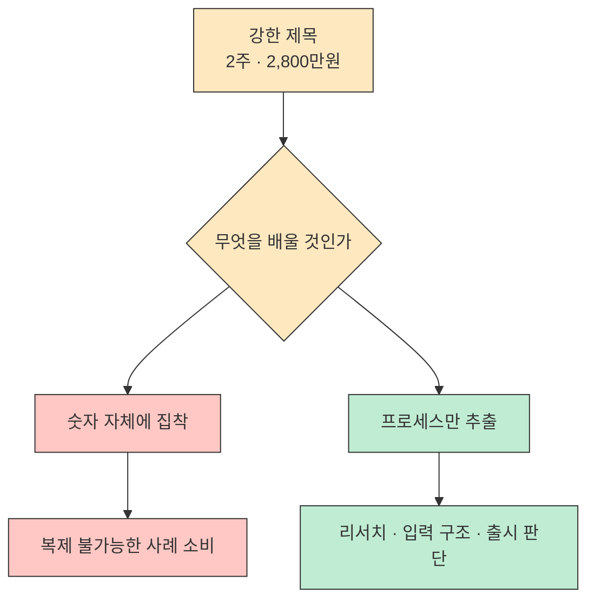
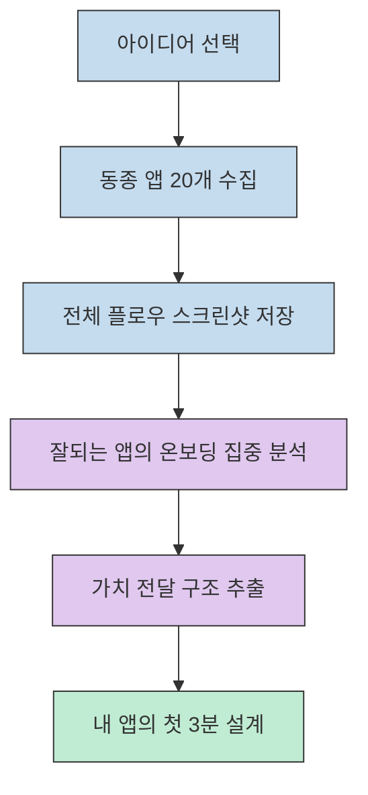
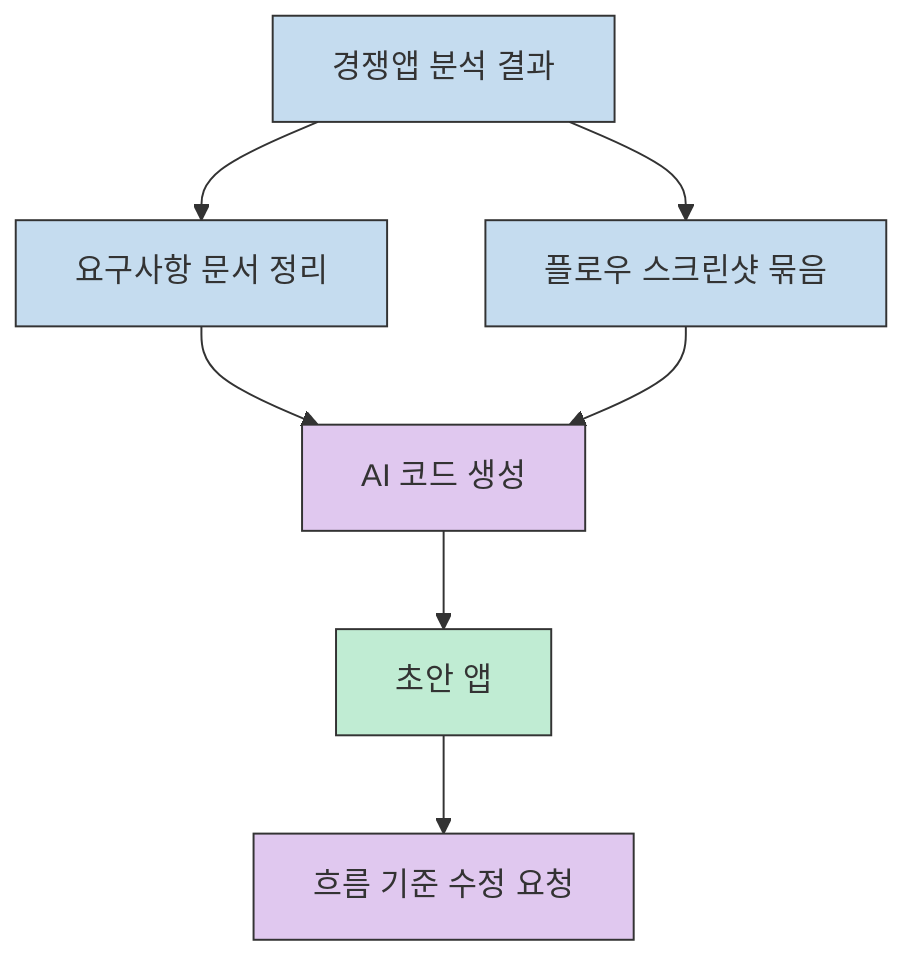
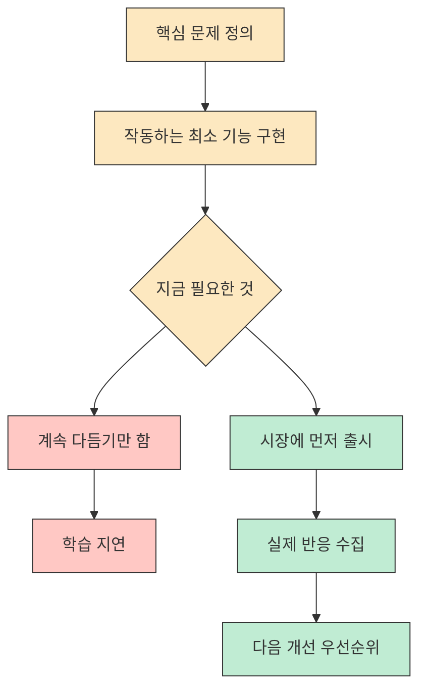
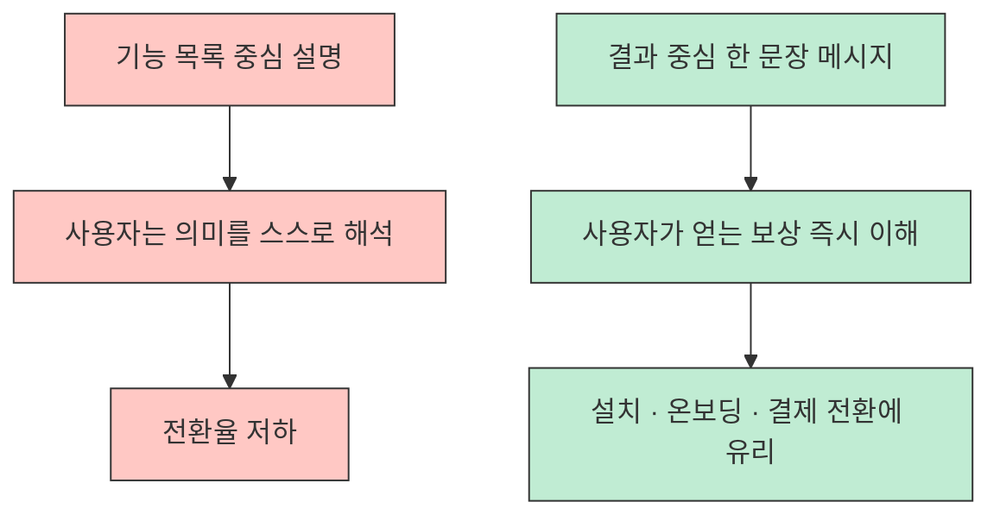

이 영상이 흥미로운 이유는 "2주 만에 앱으로 2,800만원" 이라는 숫자보다, **비개발자형 바이브코딩을 어떤 프로세스로 해석하고 있는지** 를 꽤 선명하게 보여주기 때문입니다. 공개된 설명과 공유 요약을 기준으로 보면, 코딩 자체보다 앞단의 시장 조사, 온보딩 해석, AI에게 넣는 입력 구조, 그리고 너무 늦지 않게 출시하는 판단이 더 중요하다는 방향이 두드러집니다.[^1][^2]
<!--more-->

다만 먼저 선을 그어야 할 부분이 있습니다. 이 글은 영상 제목과 설명, 공개 공유 요약, 연결된 외부 페이지를 바탕으로 재구성한 글입니다. 공개 자막을 안정적으로 회수하지 못해 분 단위 재현은 하지 않았고, 대신 **여러 공개 소스에서 겹쳐 확인되는 재사용 가능한 원칙만** 추렸습니다.[^1][^2]

## Sources

- [https://www.youtube.com/watch?v=SI98_SyiVLk](https://www.youtube.com/watch?v=SI98_SyiVLk)
- [https://www.facebook.com/sungchi/posts/%EA%B0%9C%EB%B0%9C%EA%B2%BD%ED%97%98%EC%97%86%EC%9D%B4-%EC%9C%A0%ED%8A%9C%EB%B8%8C%EB%A1%9C-%EB%8F%85%ED%95%99%ED%95%98%EA%B3%A0-ai%EB%A1%9C-%EC%95%B1-%EB%A7%8C%EB%93%A4%EC%96%B4-%EB%8F%88-%EB%B2%84%EB%8A%94-%EC%82%AC%EB%A1%80-1-%EB%A7%8C%EB%93%9C%EB%A0%A4%EB%8A%94-%EB%B6%84%EC%95%BC%EC%9D%98-%EC%95%B1-20%EA%B0%9C%EB%A5%BC-%EB%8B%A4%EC%9A%B4%EB%B0%9B%EC%95%84-%EC%A0%84%EC%B2%B4-%EB%8B%A8%EA%B3%84%EC%9D%98-%EC%8A%A4%ED%81%AC%EB%A6%B0%EC%83%B7%EC%9D%84-%EC%B0%8D%EC%96%B4%EC%84%9C-%EB%B6%84%EC%84%9D-%ED%8A%B9%ED%9E%88/10240426120894359/](https://www.facebook.com/sungchi/posts/%EA%B0%9C%EB%B0%9C%EA%B2%BD%ED%97%98%EC%97%86%EC%9D%B4-%EC%9C%A0%ED%8A%9C%EB%B8%8C%EB%A1%9C-%EB%8F%85%ED%95%99%ED%95%98%EA%B3%A0-ai%EB%A1%9C-%EC%95%B1-%EB%A7%8C%EB%93%A4%EC%96%B4-%EB%8F%88-%EB%B2%84%EB%8A%94-%EC%82%AC%EB%A1%80-1-%EB%A7%8C%EB%93%9C%EB%A0%A4%EB%8A%94-%EB%B6%84%EC%95%BC%EC%9D%98-%EC%95%B1-20%EA%B0%9C%EB%A5%BC-%EB%8B%A4%EC%9A%B4%EB%B0%9B%EC%95%84-%EC%A0%84%EC%B2%B4-%EB%8B%A8%EA%B3%84%EC%9D%98-%EC%8A%A4%ED%81%AC%EB%A6%B0%EC%83%B7%EC%9D%84-%EC%B0%8D%EC%96%B4%EC%84%9C-%EB%B6%84%EC%84%9D-%ED%8A%B9%ED%9E%88/10240426120894359/)
- [https://www.thehiddenrich.com/](https://www.thehiddenrich.com/)
- [https://motivationklass.oopy.io/](https://motivationklass.oopy.io/)

## 1) 이 사례에서 먼저 분리해야 할 것은 "수익 주장" 과 "재현 가능한 프로세스" 다

영상 제목은 매우 강합니다. 23살 청년, 2주, 앱, 2,800만원이라는 조합은 당연히 시선을 끕니다. 하지만 실전 관점에서 더 중요한 것은 그 숫자가 아니라, **어떤 입력과 어떤 의사결정이 그 결과를 가능하게 했다고 설명하는가** 입니다. 이 글은 수익 수치 자체를 검증하려는 글이 아니라, 제목 뒤에 붙어 있는 작업 방식의 구조를 읽는 글로 보는 편이 정확합니다.[^1]

공개 공유 요약에서도 핵심은 돈의 액수보다 세 가지 행동으로 정리됩니다. 경쟁 앱을 대량으로 분석하고, 그 결과를 구조화해서 AI에 넣고, 주요 기능이 돌아가면 빨리 출시해 반응을 보라는 것입니다. 다시 말해 이 영상은 "AI가 알아서 앱을 만들어 준다" 는 환상을 팔기보다, **AI가 잘 일하게 만들기 위한 기획 입력과 제품 판단** 을 강조하는 쪽에 가깝습니다.[^2]

## 2) 시작점은 코딩이 아니라 경쟁 앱 20개를 뜯어보는 리서치다

공개 요약에서 가장 실전적인 대목은 "만드려는 분야의 앱 20개를 다운받아 전체 단계의 스크린샷을 찍어서 분석하라" 는 부분입니다. 특히 잘되는 앱의 **온보딩 과정** 에 집중하라고 말하는데, 이 포인트가 중요합니다. 많은 사람이 바이브코딩을 "어떤 프롬프트를 쓰면 예쁜 앱이 나오느냐" 로 이해하지만, 실제로는 사용자가 처음 앱을 열고 가치를 이해하는 몇 분이 훨씬 더 중요합니다.[^2]

요약에 따르면 온보딩에서 해줘야 하는 일은 단순한 기능 소개가 아닙니다. 그 앱이 사용자의 삶을 어떻게 바꿔 주는지, 왜 지금 써야 하는지, 무엇이 달라지는지를 쉽게 이해시키는 것입니다. 여기서 이미 코딩보다 앞선 제품 설계가 시작됩니다. 이 관점을 따르면 온보딩은 단순 첫 화면이 아니라, 사용자가 계속 써 볼 이유를 이해하는 구간으로 해석할 수 있습니다.[^2]

이 관점은 제품을 만드는 순서를 완전히 바꿉니다. 보통 초보자는 "로그인부터 만들까, 결제부터 붙일까" 같은 구현 순서로 생각합니다. 하지만 이 영상이 던지는 힌트는 다릅니다. 먼저 **사용자가 가치를 이해하는 흐름** 을 분석하고, 그다음에야 구현을 붙이라는 것입니다. 바이브코딩이 강력한 이유도 여기에 있습니다. AI는 온보딩 화면을 빠르게 복제할 수 있지만, 어떤 순서로 어떤 감정과 보상을 보여줘야 하는지는 결국 사람이 정해야 하기 때문입니다.[^1][^2]

## 3) AI는 빈 프롬프트보다 "구조화된 입력" 에서 훨씬 강해진다

공개 요약의 두 번째 포인트는 AI에게 명확한 구조를 담은 문서와 스크린샷을 함께 넣어 코드 생성을 시킨다는 것입니다. 이 문장은 짧지만 함의가 큽니다. 많은 사람이 바이브코딩을 "채팅창에 한 줄 쓰기" 로 생각하지만, 실제 고수들은 AI를 **빈 캔버스 위의 천재** 로 다루지 않습니다. 오히려 리서치 문서, 플로우 스크린샷, 요구사항 구조, 화면 기대치를 먼저 고정한 뒤 그 안에서 생성하게 만듭니다.[^2]

이 방식이 실전에서 자주 추천되는 이유도 이해할 수 있습니다. 첫째, AI가 뭘 만들어야 하는지 모호하게 상상할 여지를 줄여 줍니다. 둘째, 나중에 "내가 원한 건 이게 아니야" 라는 수정 비용을 낮추는 데 도움이 됩니다. 셋째, 수정 요청도 기능 단위가 아니라 화면 단계와 사용자 흐름 단위로 줄 수 있게 됩니다. 이런 맥락에서 보면 바이브코딩의 성패는 감각보다 **컨텍스트 패키징 능력** 에 더 가깝다고 볼 수 있습니다.[^2]

여기서 연결되는 외부 링크도 맥락상 흥미롭습니다. 영상 설명에는 `The Hidden Riches` 와 `MVP 역설계 온라인 사업 2주 론칭 과정` 이 함께 달려 있습니다. 즉 이 콘텐츠는 단순한 개발 튜토리얼이 아니라, **비즈니스 아이디어를 빠르게 MVP로 만들고 검증하는 교육/큐레이션 문맥** 안에서 소비되는 영상으로 보는 편이 맞습니다.[^1][^3][^4]

## 4) 기다리는 페이지보다 빠른 출시가 더 중요한 전략일 수 있다

공개 요약의 세 번째 포인트는 꽤 공격적입니다. 이제 앱 만드는 속도가 너무 빨라졌기 때문에 예약 단계 없이 바로 출시하고 반응을 보는 쪽이 낫다는 주장입니다. 이 말은 모든 제품에 그대로 적용되는 정답은 아니지만, 적어도 바이브코딩 시대의 MVP 전략이 어디로 이동하는지는 잘 보여줍니다. **개발이 병목이던 시대에는 출시 전 준비가 길었고, 개발이 압축된 시대에는 출시 후 학습이 더 중요해진다** 는 방향입니다.[^2]

물론 이 조언을 너무 단순하게 받아들이면 위험합니다. 아무거나 빨리 내놓으라는 말이 아니라, 핵심 기능이 사용자의 문제를 해결하기 시작했다면 과도한 polishing 때문에 시장 반응 확인이 늦어질 수 있다는 뜻에 가깝습니다. 이 관점에서는 완벽한 준비보다 실제 반응을 더 빨리 확인하는 편이 낫다고 해석할 수 있습니다.[^2]

여기서 중요한 건 "빠른 출시" 와 "무계획" 을 구분하는 일입니다. 앞에서 경쟁 앱 20개를 분석하고, 온보딩을 뜯어보고, AI에 넣을 문서를 구조화한 이유가 바로 이것입니다. 앞단의 해상도가 충분히 높다면 출시를 앞당길 수 있고, 앞단이 빈약하면 빠른 출시는 그냥 빠른 실패가 됩니다.[^2]

## 5) 결국 앱이 팔리는 이유는 기능이 아니라 한 문장 가치 제안이다

공개 요약에서 예시로 든 앱의 메시지는 매우 직접적입니다. "이 앱을 받으면 참여할 수 있는 집단소송을 찾고 참여해 돈을 받을 수 있다" 는 식입니다. 제품 관점에서 보면 이것은 기능 설명이 아니라 **결과 설명** 입니다. 사용자가 얻는 최종 보상을 한 문장으로 압축해 버린 것이죠.[^2]

이게 왜 중요할까요. 대부분의 초보 앱은 홈 화면부터 기능 목록으로 시작합니다. 하지만 사용자는 기능의 존재보다 "그래서 나한테 무슨 이득이 생기는데?" 를 먼저 묻습니다. 영상에서 읽을 수 있는 핵심도 바로 여기에 있습니다. 바이브코딩이 코드를 빠르게 만들어 준다고 해도, **한 줄 가치 제안이 흐리면 사용자가 앱의 필요성을 즉시 이해하기 어려울 수 있다** 는 해석이 가능합니다.[^1][^2]

그래서 이 영상을 "AI로 앱 만들기" 영상으로만 보면 절반만 본 셈입니다. 더 정확히는 **가치 제안이 분명한 앱을 AI로 빠르게 구현하고, 사용자의 첫 경험을 다듬고, 시장 반응으로 배우는 법** 에 가까운 콘텐츠입니다.[^1][^2]

## 6) 이 사례를 그대로 따라 하기보다, 자신의 제품 언어로 번역해야 한다

영상 설명에 연결된 외부 사이트들은 비즈니스 인사이트 플랫폼과 MVP 론칭 과정 안내로 이어집니다. 즉 이 사례는 특정 앱 하나의 기술 구현을 뜯어보는 사례라기보다, 아이디어를 온라인 사업 모델로 바꾸는 방법론 안에서 제시된 예시로 보는 편이 자연스럽습니다.[^3][^4]

따라서 실전에서는 "똑같이 집단소송 앱을 만들자" 가 아니라, 내 분야에서 사용자가 즉시 이해할 수 있는 보상 구조가 무엇인지부터 다시 써야 합니다. 예를 들어 건강, 금융, 교육, 생산성 모두 사용자의 문장은 다릅니다. 바이브코딩이 열어 주는 것은 구현 속도이지, 문제 선택의 책임을 대신 져 주는 마법이 아닙니다.[^1][^2]

## 실전 적용 포인트

1. 만들고 싶은 앱이 있으면 바로 프롬프트부터 치지 말고, **동종 앱 20개를 실제로 써 보며 첫 화면부터 결제 직전까지 스크린샷** 을 모으세요.[^2]
2. 온보딩에서 사용자가 이해해야 할 변화를 한 문장으로 먼저 적으세요. 기능 문장이 아니라 결과 문장이어야 합니다.[^2]
3. AI에는 막연한 요청 대신 `요구사항 문서 + 화면 흐름 + 참고 스크린샷` 을 같이 넣으세요. 적어도 이 사례가 전달하는 방향은, 이런 구조화가 결과 품질을 끌어올리는 데 도움이 된다는 쪽입니다.[^2]
4. 핵심 기능이 돌아가면 예약 페이지만 오래 붙잡지 말고, 빠르게 출시해 실제 사용자의 반응을 받으세요.[^2]
5. 수익 숫자보다 더 중요한 것은 **사용자가 왜 설치하고 왜 남는지** 를 설명하는 구조라는 점을 잊지 마세요.[^1][^2]

## 핵심 요약

- 이 영상의 진짜 포인트는 "AI가 코드를 짜 준다" 가 아니라, 리서치와 온보딩과 가치 제안을 먼저 설계해야 한다는 점입니다.[^1][^2]
- 경쟁 앱 20개 분석은 단순 벤치마킹이 아니라, 사용자가 첫 3분 안에 무엇을 이해해야 하는지 찾는 과정입니다.[^2]
- 바이브코딩의 성패는 프롬프트 재능보다 구조화된 입력 문서를 얼마나 잘 만들었는지에 더 가깝습니다.[^2]
- 빠른 MVP 출시는 무계획이 아니라, 앞단의 제품 가설을 빨리 검증하기 위한 속도 전략으로 읽어야 합니다.[^2]
- 결국 앱을 팔게 만드는 것은 기술 스택이 아니라 사용자가 즉시 이해하는 한 문장 가치 제안입니다.[^2]

## 결론

이 사례가 주는 가장 큰 교훈은 바이브코딩의 주인공이 AI가 아니라는 점입니다. AI는 리서치 결과를 바탕으로 화면과 기능을 빠르게 만드는 엔진일 뿐이고, 무엇을 만들지, 어떤 온보딩으로 풀지, 언제 시장에 내보낼지 결정하는 사람은 여전히 창업자 자신입니다.[^1][^2]

그래서 "2주 만에 앱을 만들었다" 는 말에서 진짜 배워야 할 것은 속도 그 자체가 아닙니다. **리서치 → 가치 제안 정리 → 구조화된 입력 → 빠른 출시 → 반응 학습** 으로 이어지는 짧은 루프를 만들 수 있느냐가 핵심입니다. 바이브코딩은 코딩을 없애는 기술이라기보다, 제품 가설을 훨씬 더 짧은 주기로 검증하게 만드는 운영 방식에 가깝습니다.[^1][^2]

[^1]: [https://youtu.be/SI98_SyiVLk?t=0](https://youtu.be/SI98_SyiVLk?t=0)
[^2]: [https://www.facebook.com/sungchi/posts/%EA%B0%9C%EB%B0%9C%EA%B2%BD%ED%97%98%EC%97%86%EC%9D%B4-%EC%9C%A0%ED%8A%9C%EB%B8%8C%EB%A1%9C-%EB%8F%85%ED%95%99%ED%95%98%EA%B3%A0-ai%EB%A1%9C-%EC%95%B1-%EB%A7%8C%EB%93%A4%EC%96%B4-%EB%8F%88-%EB%B2%84%EB%8A%94-%EC%82%AC%EB%A1%80-1-%EB%A7%8C%EB%93%9C%EB%A0%A4%EB%8A%94-%EB%B6%84%EC%95%BC%EC%9D%98-%EC%95%B1-20%EA%B0%9C%EB%A5%BC-%EB%8B%A4%EC%9A%B4%EB%B0%9B%EC%95%84-%EC%A0%84%EC%B2%B4-%EB%8B%A8%EA%B3%84%EC%9D%98-%EC%8A%A4%ED%81%AC%EB%A6%B0%EC%83%B7%EC%9D%84-%EC%B0%8D%EC%96%B4%EC%84%9C-%EB%B6%84%EC%84%9D-%ED%8A%B9%ED%9E%88/10240426120894359/](https://www.facebook.com/sungchi/posts/%EA%B0%9C%EB%B0%9C%EA%B2%BD%ED%97%98%EC%97%86%EC%9D%B4-%EC%9C%A0%ED%8A%9C%EB%B8%8C%EB%A1%9C-%EB%8F%85%ED%95%99%ED%95%98%EA%B3%A0-ai%EB%A1%9C-%EC%95%B1-%EB%A7%8C%EB%93%A4%EC%96%B4-%EB%8F%88-%EB%B2%84%EB%8A%94-%EC%82%AC%EB%A1%80-1-%EB%A7%8C%EB%93%9C%EB%A0%A4%EB%8A%94-%EB%B6%84%EC%95%BC%EC%9D%98-%EC%95%B1-20%EA%B0%9C%EB%A5%BC-%EB%8B%A4%EC%9A%B4%EB%B0%9B%EC%95%84-%EC%A0%84%EC%B2%B4-%EB%8B%A8%EA%B3%84%EC%9D%98-%EC%8A%A4%ED%81%AC%EB%A6%B0%EC%83%B7%EC%9D%84-%EC%B0%8D%EC%96%B4%EC%84%9C-%EB%B6%84%EC%84%9D-%ED%8A%B9%ED%9E%88/10240426120894359/)
[^3]: [https://www.thehiddenrich.com/](https://www.thehiddenrich.com/)
[^4]: [https://motivationklass.oopy.io/](https://motivationklass.oopy.io/)
