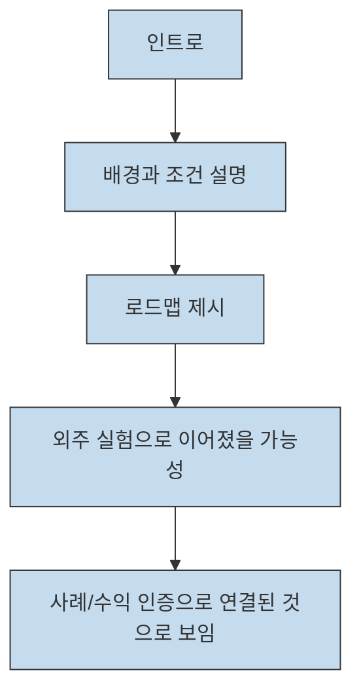
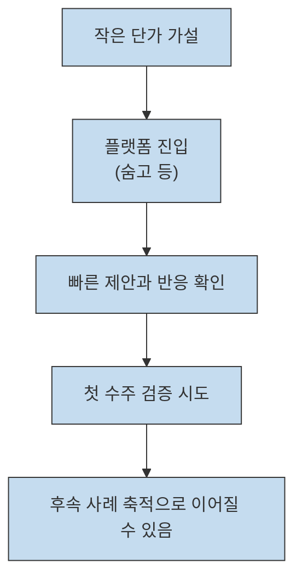
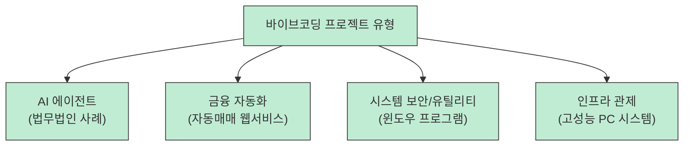
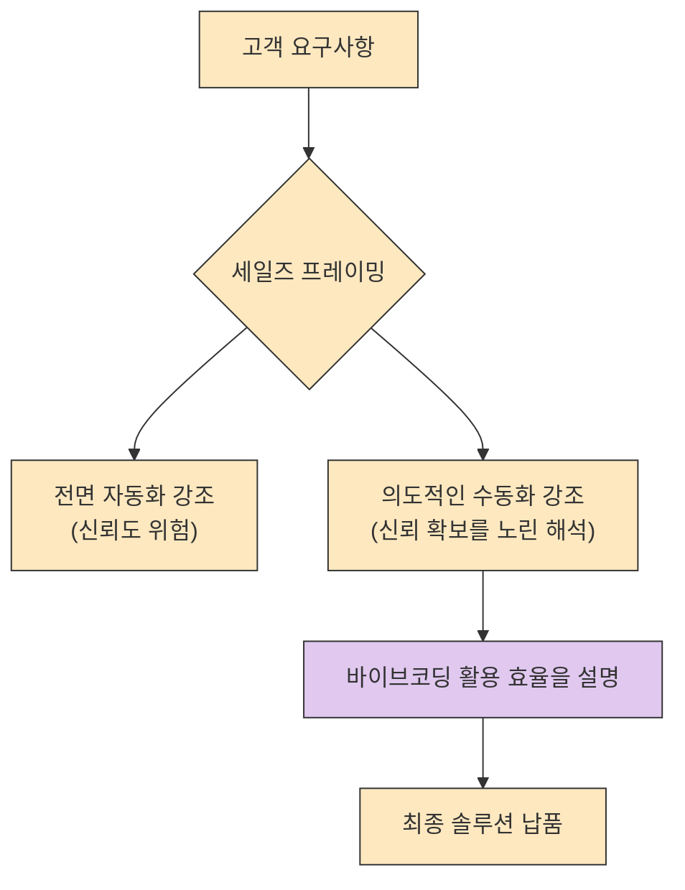

바이브코딩(Vibe Coding) 관련 콘텐츠는 많지만, 실제로 돈을 받고 무엇을 만들었는지까지 공개하는 사례는 생각보다 드뭅니다. 이번 영상이 흥미로운 이유는 "두달만에 3500" 이라는 강한 문구 자체보다, 최소한 공개 페이지와 댓글만 봐도 외주 실험의 방향, 숨고 같은 유입 채널, 그리고 실제로 언급된 프로젝트 종류가 제법 구체적으로 드러난다는 점에 있습니다.[^1][^4]
<!--more-->

다만 이 글은 전체 트랜스크립트를 확보한 뒤 줄거리처럼 재구성한 글이 아닙니다. 공개된 설명란 일부, 확인 가능한 목차 조각, 댓글 스레드, 그리고 숨고 활동 기록만으로 검증되는 범위만 정리합니다. 그래서 무엇이 확인되고 무엇이 아직 확인되지 않는지까지 함께 적어 두겠습니다.[^1][^2][^3][^4][^5]

## Sources

- [https://youtube.com/watch?v=zMhuUyDo_1E&si=Pihdh68XGUiMRAuM](https://youtube.com/watch?v=zMhuUyDo_1E&si=Pihdh68XGUiMRAuM) - 두달만에 3500 벌어다준 바이브코딩 외주 전략/툴/과정 20분만에 다 알려드립니다 (+수익 인증)
- [https://soomgo.com/review/detail/68f4cce75eff349d253f7957](https://soomgo.com/review/detail/68f4cce75eff349d253f7957) - 숨고 양군이 자동화 리뷰 페이지

## 공개 페이지 기준으로 확인되는 최소 로드맵

유튜브 페이지에서 직접 확인되는 정보는 생각보다 제한적이지만, 완전히 빈약하지는 않습니다. 설명란에는 이 실험을 "바이브코딩의 물결을 프리랜싱으로 타본" 도전으로 소개하고 있고, 최소한 `00:00 인트로`, `00:42 나의 배경과 조건 설명`, `01:15 로드맵` 이라는 초반 구조는 공개되어 있습니다.[^1][^2][^3] 공개된 챕터만 기준으로 보면, 이 영상은 적어도 자신의 조건을 먼저 설명하고 그 뒤에 외주 진입 로드맵을 붙이는 형식으로 읽을 수 있습니다.

이 흐름은 바이브코딩 외주를 바라보는 관점을 조금 바꿉니다. 보통은 어떤 AI 도구를 썼는지부터 궁금해지지만, 공개된 챕터만 기준으로 보면 이 영상의 앞부분은 오히려 **"내가 어떤 조건에서 이 시장에 들어갔는가" 와 "어떤 로드맵을 제시하는가"** 에 더 가깝습니다. 실제 도구명이나 구현 세부는 아직 확인되지 않았고, 가설 설정 여부도 댓글 등 다른 공개 단서와 함께 봐야 합니다.[^2][^3][^4]

## 숨고 유입과 작은 단가 가설이 보여 주는 진입 전략

이 영상에서 가장 실무적인 힌트는 댓글 스레드에서 나옵니다. 채널 운영자는 초기에 "**30만원 안에 하나 수주 가능**" 이라는 가설로 접근했다고 직접 남겼고, 별도의 공개 페이지에서는 `양군이 자동화` 라는 이름으로 숨고 활동 흔적도 확인됩니다.[^4][^5] 이 두 조각을 합치면, 적어도 작성자 해석으로는 거창한 브랜딩보다 **낮은 진입 장벽의 첫 수주 가설을 세우고 마켓플레이스에서 빠르게 검증하는 방식** 이 핵심 축으로 읽힙니다.

이 전략이 중요한 이유는 바이브코딩 외주를 "처음부터 고가 프로젝트를 따내는 게임" 으로 보지 않게 만들기 때문입니다. 작은 단가 가설은 시장성 검증, 제안 메시지 점검, 고객 반응 확인을 한 번에 수행하게 해 줍니다. 다만 여기서 **정확한 전환율, 실제 광고비, 고객 획득 비용** 까지는 공개 자료만으로는 확인되지 않습니다. 그래서 이 영상을 따라 할 때도 숫자를 그대로 복제하기보다, **작게 시작해 빠르게 검증한다는 운영 원리** 를 가져가는 편이 맞습니다.[^4][^5]

## 댓글에서 확인되는 실제 프로젝트 범위

영상 본문을 전부 읽을 수는 없었지만, 채널 운영자가 직접 남긴 댓글 하나는 매우 구체적입니다. 그 댓글에는 다음 네 가지 프로젝트가 순서대로 적혀 있습니다.[^4]

1. **법무법인 사내 에이전트**
2. **자동매매 웹서비스** - 현재 테스트 진행 중
3. **보안 관련 윈도우 프로그램**
4. **고성능 PC 관제 시스템** - 진행 중, 가장 마지막 시작

이 리스트만으로도 중요한 사실 하나는 확인됩니다. 적어도 이 채널이 말하는 바이브코딩 외주는 예쁜 데모 사이트 제작보다 **사내 업무용 에이전트, 금융성 웹서비스, 보안 유틸리티, 관제 시스템** 처럼 업무 맥락의 프로젝트명으로 제시되고 있습니다. 반대로 여기서 더 나아가 각 프로젝트의 기능, 계약 규모, 사용한 도구, 납품 범위까지 말하는 순간 그건 공개 근거를 벗어난 추정이 됩니다.

또 하나 볼 만한 부분은 공개 가능 범위입니다. 같은 댓글에서 운영자는 2번 자동매매 웹서비스 정도만 나중에 공개할 수 있을 것 같다고 적었습니다.[^4] 이것은 적어도 일부 프로젝트가 대외비 또는 비공개 성격을 띨 수 있음을 시사합니다. 그래서 포트폴리오를 공개 링크 중심으로만 쌓기 어려울 수 있고, 대신 문제 유형과 성과 방식으로 사례를 설명하는 능력이 더 중요해질 수 있습니다.

## '의도적인 수동화'가 세일즈 문구로 먹히는 이유

댓글 반응에서 특히 눈에 띄는 표현은 "**의도적인 수동화**" 입니다. 이것이 영상 속에서 어떻게 정의되었는지는 전체 트랜스크립트 없이는 단정할 수 없지만, 적어도 시청자 한 명이 이 표현을 강하게 인상적으로 받아들였고 운영자도 그 반응에 직접 호응했습니다.[^4] 이 반응만 놓고 해석하면, 고객 앞에서 "AI가 다 해줍니다" 라고 말하는 대신 **사람이 통제하고 검수하는 구조를 유지하면서 AI를 생산성 레버리지로 쓴다** 고 설명하는 방식이 더 설득력 있게 들렸을 가능성이 있습니다.

이 지점은 바이브코딩 외주에서 자주 부딪히는 설명 방식의 차이를 떠올리게 합니다. 개발자 입장에서는 모델 속도, 코드 생성량, 자동화 범위를 자랑하고 싶지만, 구매자 입장에서는 오히려 **책임 소재, 품질 보증, 요구사항 반영 방식** 이 더 중요할 수 있습니다. 그래서 이 사례에 한정해 보면 "의도적인 수동화" 는 기술 후퇴라기보다 신뢰 설계에 가깝게 읽힙니다. 자동화는 내부 효율을 올리고, 바깥에는 통제 가능성과 결과 책임을 보여 주는 식입니다.[^4]

## 실전 적용 포인트

이 사례에서 읽을 수 있는 실전 포인트를 정리하면 다음과 같습니다.

1. **작은 가설로 시작하기**: 공개 댓글에서 확인되는 30만원 가설처럼, 처음부터 큰 계약을 상정하기보다 빠르게 검증 가능한 단위를 먼저 설정하는 편이 현실적입니다.[^4]
2. **문제 유형으로 포트폴리오 설명하기**: 공개 가능한 결과물이 적더라도 법무, 금융, 보안, 관제처럼 어떤 문제를 다뤘는지 설명하는 것만으로도 전문성 신호를 만들 수 있습니다.[^4]
3. **자동화보다 통제를 먼저 설명하기**: 이 댓글 반응만 놓고 보면, 고객은 화려한 AI 용어보다 사람이 어떻게 책임지고 검수하는지에 더 안심할 수 있습니다. "의도적인 수동화" 가 인상적으로 받아들여진 배경도 그 맥락에서 해석할 수 있습니다.[^4]
4. **확인된 사실과 추정을 분리하기**: 이 영상처럼 공개 정보가 일부만 있을 때는 수익 단위, 툴 스택, 계약 규모를 함부로 일반화하지 않는 태도 자체가 실전 감각입니다.[^1][^4]

## 핵심 요약

- 공개 메타데이터 기준으로 이 영상은 `인트로 -> 배경과 조건 설명 -> 로드맵` 순서로 외주 실험을 소개하는 구조를 갖고 있습니다.[^1][^2][^3]
- 댓글과 외부 활동 기록을 합치면, 숨고 같은 마켓플레이스에서 작은 단가 가설로 시장을 검증하는 접근이 핵심 전략으로 읽힙니다.[^4][^5]
- 실제로 언급된 프로젝트 범위는 법무법인 사내 에이전트, 자동매매 웹서비스, 보안용 윈도우 프로그램, PC 관제 시스템까지 퍼져 있어 결과물 스펙트럼이 넓습니다.[^4]
- 반대로 수익 단위의 정확한 의미, 사용한 툴 이름, 각 프로젝트의 계약 규모와 기능 상세는 아직 공개 근거만으로 확정할 수 없습니다.[^1][^4]

## 결론

공개 근거만으로 보면, 이 영상이 주는 가장 큰 메시지는 "바이브코딩으로 빨리 만든다" 보다 "어떤 문제를 어떤 방식으로 팔 것인가" 에 더 가깝습니다. 적어도 이 채널은 외주를 설명할 때 배경과 조건을 먼저 꺼내고, 작은 가설을 언급하고, 실제 프로젝트명을 사례로 제시하는 방향으로 말하고 있다는 점은 확인됩니다.[^2][^3][^4]

따라서 이 영상을 따라 읽을 때도 핵심은 수익 숫자에만 매달리는 것이 아니라, **낮은 리스크로 첫 수주를 검증하는 방식**, **공개 가능한 사례가 적은 환경에서 신뢰를 쌓는 법**, 그리고 **자동화를 고객 신뢰와 충돌하지 않게 설명하는 법** 을 이 사례에서 어떻게 읽어낼 수 있는지 보는 데 있습니다. 이 세 가지는 적어도 공개 근거 안에서 건질 수 있는 가장 실용적인 포인트입니다.

[^1]: [https://youtu.be/zMhuUyDo_1E?t=0](https://youtu.be/zMhuUyDo_1E?t=0)
[^2]: [https://youtu.be/zMhuUyDo_1E?t=42](https://youtu.be/zMhuUyDo_1E?t=42)
[^3]: [https://youtu.be/zMhuUyDo_1E?t=75](https://youtu.be/zMhuUyDo_1E?t=75)
[^4]: [https://youtube.com/watch?v=zMhuUyDo_1E&si=Pihdh68XGUiMRAuM](https://youtube.com/watch?v=zMhuUyDo_1E&si=Pihdh68XGUiMRAuM)
[^5]: [https://soomgo.com/review/detail/68f4cce75eff349d253f7957](https://soomgo.com/review/detail/68f4cce75eff349d253f7957)
