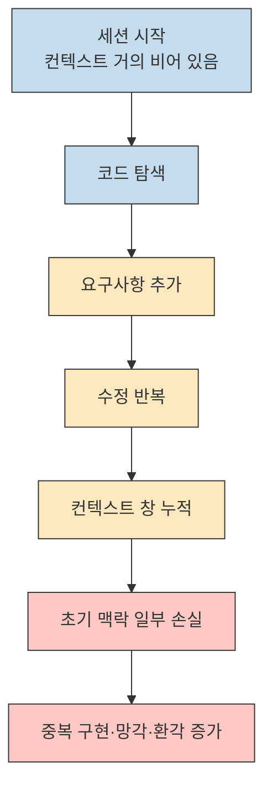
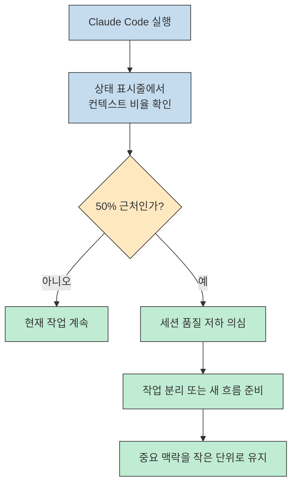
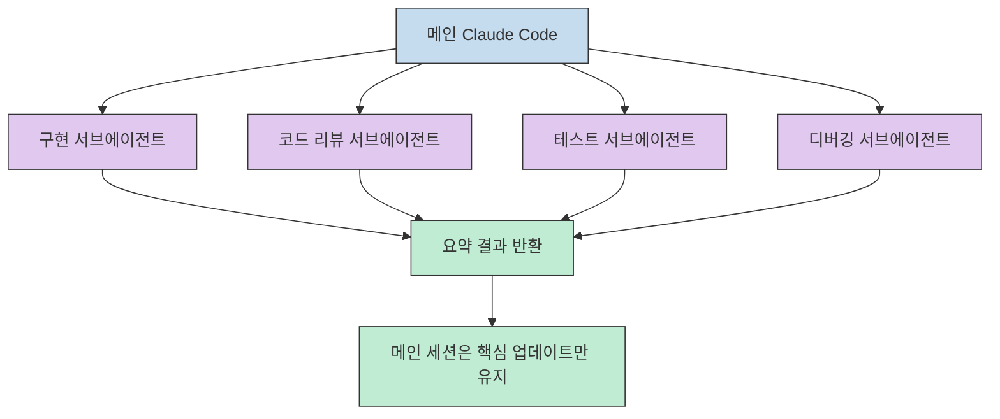
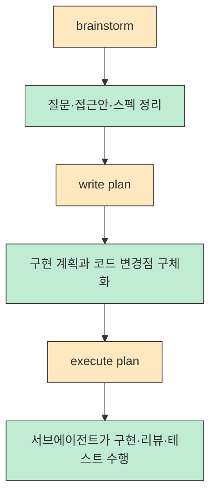
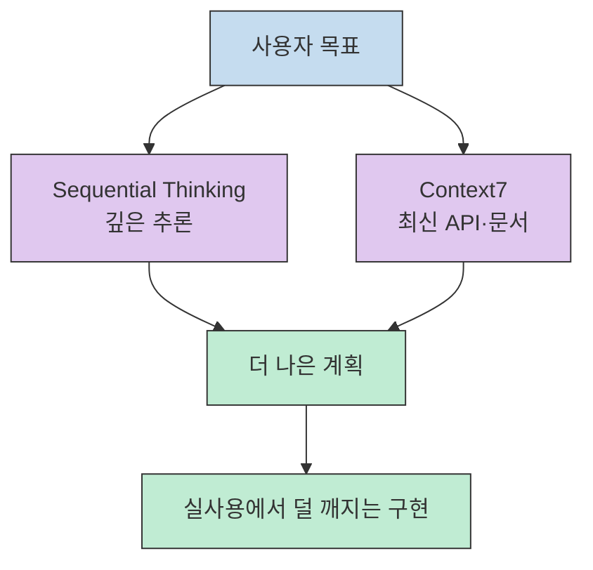
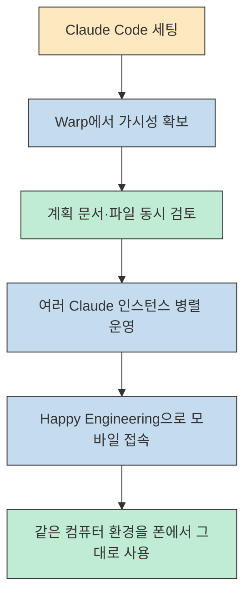

Claude Code를 오래 붙잡고 있으면 어느 순간부터 똑똑한 페어 프로그래머가 아니라 방금 본 코드도 잊어버리는 인턴처럼 느껴질 때가 있습니다. 이 영상은 그 현상을 모델 품질 저하가 아니라 **컨텍스트 관리 실패** 로 해석하고, 상태 표시줄, 서브에이전트 오케스트레이션, 사고 확장 도구, 최신 문서 소스, 그리고 모바일 원격 터미널까지 한 번에 묶은 작업 환경을 제안합니다.[^1][^2]
<!--more-->

좋은 점은 팁을 나열하는 데서 끝나지 않는다는 것입니다. 영상의 흐름은 왜 Claude Code가 중간에 멍청해지는지 설명한 다음, 그 문제를 줄이기 위해 무엇을 먼저 보고, 어떤 플러그인을 깔고, 어떤 순서로 작업을 분해해야 하는지까지 한 단계씩 이어집니다. 그래서 이 글은 영상을 단순 툴 추천이 아니라 **Claude Code를 운영 체계처럼 다루는 법** 으로 재구성해 봅니다.[^1][^3]

## Sources

- [https://youtube.com/watch?v=-O6MEtleOdA&si=s7yTBZrwnxnvH1Ee](https://youtube.com/watch?v=-O6MEtleOdA&si=s7yTBZrwnxnvH1Ee) - How to make Claude Code less dumb

## 왜 Claude Code는 세션 중간부터 멍청해지는가: 문제는 모델보다 컨텍스트 창이다

영상의 출발점은 분명합니다. Claude Code가 세션 초반에는 잘하다가 중간부터 엉뚱한 코드를 쓰고, 방금 한 지시를 잊고, 중복 구현을 만들기 시작하는 현상은, Anthropic이 모델을 일부러 멍청하게 만든다기보다 **컨텍스트 창이 계속 차오르면서 앞부분 맥락을 밀어내는 구조적 한계** 에 더 가깝다는 설명입니다.[^1] 화자는 이를 숫자를 계속 외우게 하는 비유로 설명하는데, 처음엔 기억하던 정보도 새 입력이 누적되면 오래된 정보부터 흐려진다는 점에서 LLM의 세션 동작과 비슷하다고 봅니다.[^1]

이 설명이 실전에서 중요한 이유는, 많은 사용자가 문제가 생기면 프롬프트를 더 길게 쓰거나 한 세션 안에서 계속 덧붙이는 방식으로 대응하기 때문입니다. 하지만 영상의 논리대로라면 그 방식은 오히려 상황을 악화시킬 수 있습니다. 세션이 길어질수록 Claude는 방금 본 코드나 직전에 준 지시를 안정적으로 붙잡아 두기 어려워지고, 결국 중복 코드 작성이나 이전 규칙 위반처럼 체감되는 오류가 늘어나기 때문입니다.[^1][^2]

## 첫 번째 방어선: 상태 표시줄로 컨텍스트 비율을 계속 보고 50% 근처에서 의심하라

화자가 가장 먼저 권하는 실전 도구는 `npx cc status line@latest` 로 설치하는 커스텀 상태 표시줄입니다. 여기서 핵심은 예쁜 UI가 아니라 **컨텍스트 점유율을 계속 눈으로 확인하는 것** 입니다. 영상에서는 모델, 컨텍스트 퍼센트, 세션 비용, 시간, Git 브랜치, 워크트리 같은 정보를 두 줄에 배치한 예시를 보여 주며, 특히 컨텍스트 퍼센트가 가장 중요하다고 강조합니다.[^2]

이 영상에서 제시하는 경험칙은 꽤 보수적입니다. 100%가 되기 전에 이미 망각이 시작되므로, 대략 50% 근처부터는 Claude가 앞서 준 지시를 잊고 있다고 의심해야 한다는 것입니다.[^2] 더 흥미로운 부분은 `compact` 계열 명령에 대한 태도입니다. 화자는 이를 추천하지 않으며, 일부만 기억한 채 이전 세션의 오염된 맥락은 남을 수 있어서 "최악의 양쪽" 이 될 수 있다고 말합니다.[^3] 즉 이 영상의 철학은 **꽉 찬 세션을 억지로 압축하는 것보다, 컨텍스트가 덜 찬 상태에서 작업을 쪼개는 방향** 에 가깝습니다.[^2][^3]

## 두 번째 방어선: 서브에이전트로 일을 분산해 메인 세션을 오케스트레이터로 바꿔라

영상의 핵심 전환점은 여기입니다. 컨텍스트를 아끼는 가장 좋은 방법은 한 세션에 모든 일을 집어넣는 것이 아니라, 메인 Claude가 **오케스트레이터** 가 되고 실제 구현, 리뷰, 테스트, 디버깅은 각각 별도 컨텍스트를 가진 서브에이전트에게 나누는 것이라는 주장입니다.[^3] 이렇게 하면 메인 세션은 세부 구현 전체를 기억할 필요 없이, "무슨 일을 시켰고 어떤 결과가 돌아왔는가" 같은 요약 정보만 유지하면 되므로 상대적으로 덜 망가진다는 설명입니다.[^3]

이 구성을 사람이 손으로 직접 운영하기는 번거롭기 때문에, 영상은 `Superpowers` 플러그인을 사실상 핵심 운영 레이어로 제시합니다. 화자는 이 플러그인이 서브에이전트 기반 개발, 코드 리뷰, 디버깅 같은 흐름을 내장해 준다고 설명하고, 실제 사용법도 `brainstorm -> write plan -> execute plan` 의 3단계로 단순화합니다.[^4][^5] 중요한 점은 여기서 Claude에게 막연히 "멋진 페이지 만들어 줘"라고 맡기고 끝내는 것이 아니라, 먼저 아이디어를 구조화하고, 그다음 구현 계획을 만들고, 마지막으로 실행 단계에서 여러 에이전트를 투입한다는 순서입니다.[^5][^6]

또 하나 놓치면 안 되는 메시지는 **사람이 여전히 운전석에 있어야 한다** 는 점입니다. 영상 데모에서도 화자는 브레인스토밍 결과를 그대로 승인하지 말고, 홈/포트폴리오/어바웃/컨택트 같은 정보 구조가 맞는지 직접 검토하라고 분명히 말합니다.[^6] 즉 이 세팅은 AI에게 판단권을 넘기는 방법이 아니라, 사람의 검토 포인트를 더 앞단으로 끌어오고 구현 세부는 병렬화하는 방식으로 읽는 편이 정확합니다.[^6]

## 세 번째 방어선: 생각은 Sequential Thinking으로, 최신 지식은 Context7으로 보강하라

영상은 서브에이전트만으로 충분하다고 말하지 않습니다. 계획 품질 자체를 올리려면 더 깊게 생각하는 도구가 필요하고, 그래서 `Sequential Thinking` MCP를 설치해 Claude가 더 길고 구조화된 사고를 하게 만든다고 설명합니다.[^7] 화자의 표현을 그대로 따르면, 브레인스토밍과 설계 단계에서 생각의 깊이가 좋아질수록 최종 결과물의 질도 올라가기 때문에, 이 도구는 단순한 부가 기능이 아니라 상위 계획 레이어를 보강하는 장치입니다.[^7]

하지만 사고를 오래 한다고 해서 최신 사실을 자동으로 알게 되는 것은 아닙니다. 영상은 바로 이 지점에서 `Context7` 을 붙입니다. 이유는 명확합니다. Claude Code는 메모리 기반 지식이 6개월에서 12개월 정도 뒤처질 수 있고, 그 상태에서는 오래된 API나 문서를 근거로 코드를 짤 위험이 있기 때문입니다.[^8] 그래서 이 영상에서 Context7은 "더 많이 생각하게 하는 도구" 가 아니라 **무엇을 생각해야 하는지 최신 근거를 공급하는 도구** 로 배치됩니다.[^8]

이 두 도구를 같이 놓고 보면 구조가 훨씬 선명해집니다. Sequential Thinking은 추론의 깊이를 늘리고, Context7은 추론의 재료를 최신화합니다. 즉 하나는 **사고 품질**, 다른 하나는 **지식 신선도** 를 담당합니다. 영상이 이 둘을 연달아 소개하는 이유도, 잘 생각하는 것과 최신 사실을 아는 것이 서로 대체 관계가 아니라 보완 관계라는 점을 강조하기 위해서로 읽을 수 있습니다.[^7][^8]

## 가시성과 이동성을 더하는 마지막 층: Warp와 Happy Engineering

영상 후반부는 Claude Code 자체보다 **운영 인터페이스** 에 더 가깝습니다. 화자는 일반 터미널만으로는 Claude가 실제로 어떤 파일을 쓰고 어떤 계획 문서를 만들고 있는지 보기가 답답하다고 지적하면서, `Warp` 를 Claude를 담는 AI 네이티브 터미널로 제안합니다.[^9] 여기서 강조되는 기능은 내장 AI가 아니라, 같은 화면에서 저장소 파일과 계획 문서를 열어 두고 Claude와 대화할 수 있는 패널, 그리고 여러 Claude 인스턴스를 쉽게 띄우는 분할/탭 구조입니다.[^9][^10]

이 메시지는 앞의 서브에이전트 전략과도 연결됩니다. 워크플로우를 병렬화할수록 "에이전트가 뭘 하고 있는지 내가 볼 수 있느냐" 가 중요해지기 때문입니다. 영상은 Warp를 통해 구현 계획 문서와 스펙 문서를 직접 검토하라고 보여 주는데, 이것은 결국 서브에이전트를 많이 돌릴수록 **가시성 도구도 같이 필요하다** 는 뜻입니다.[^9]

마지막으로 `Happy Engineering` 은 Claude Code를 외출 중에도 실제 데스크톱 환경과 이어 주는 원격 터미널 계층으로 제시됩니다. 화자는 공식 모바일 앱이 로컬 파일 접근과 웹 탐색 측면에서 제약이 커서 전체 능력의 일부만 제공한다고 보고, 대신 휴대폰에서 내 컴퓨터의 실제 터미널을 여는 방식이 더 강력하다고 설명합니다.[^11] 이 경우 휴대폰에서 여는 터미널은 집 컴퓨터에서 돌아가는 동일한 환경이므로, Superpowers, Sequential Thinking, Context7 같은 세팅을 그대로 이어 쓸 수 있고, 나중에 집에 돌아와 노트북에서 바로 이어서 작업할 수 있다는 점이 핵심입니다.[^11]

## 실전 적용 포인트

첫째, 이 영상을 그대로 따라 할 때 가장 먼저 가져가야 할 것은 플러그인 목록이 아니라 **세션을 길게 끌지 않겠다는 운영 원칙** 입니다. 컨텍스트가 쌓이는 것을 실시간으로 보고, 50% 근처에서 이미 품질 저하를 의심하는 습관이 먼저 자리 잡아야 그 뒤의 도구들이 의미가 생깁니다.[^2]

둘째, Claude Code를 단일 만능 에이전트로 쓰기보다 `오케스트레이터 + 서브에이전트` 구조로 보는 관점 전환이 중요합니다. 영상의 메시지를 실전에 옮기면, 구현/리뷰/테스트/디버깅을 한 세션에 몰아넣지 말고 서로 다른 작업 단위로 분리해 메인 세션에는 요약만 남기는 방향이 더 안정적입니다.[^3][^5]

셋째, 잘 생각하는 것과 최신 사실을 아는 것을 분리해서 관리해야 합니다. Sequential Thinking은 설계와 추론을 보강하고, Context7은 실제 API와 라이브러리 지식을 최신 상태로 공급한다는 역할 차이를 이해해야 영상의 세팅이 서로 겹치지 않고 맞물립니다.[^7][^8]

넷째, 병렬 작업이 많아질수록 인터페이스 품질도 중요해집니다. Warp처럼 파일과 계획을 곁눈질할 수 있는 화면, Happy Engineering처럼 같은 터미널 환경을 폰으로 이어 쓰는 도구는 부가 기능이 아니라 **검토와 연속성** 을 보장하는 운영 장치로 보는 편이 맞습니다.[^9][^11]

## 핵심 요약

- 이 영상은 Claude Code의 성능 저하를 모델 문제보다 **컨텍스트 창 포화 문제** 로 설명합니다.[^1]
- 상태 표시줄의 컨텍스트 비율을 계속 보고, 50% 근처부터 품질 저하를 의심하라는 경험칙이 제시됩니다.[^2]
- `compact` 로 억지로 버티기보다, 메인 세션을 오케스트레이터로 두고 서브에이전트에게 구현·리뷰·테스트를 분산하는 쪽이 더 낫다는 메시지가 핵심입니다.[^3][^5]
- `Sequential Thinking` 은 추론 깊이를, `Context7` 은 최신 문서 지식을 보강하는 역할로 분리되어 소개됩니다.[^7][^8]
- `Warp` 와 `Happy Engineering` 은 각각 가시성과 이동성을 높여, Claude Code를 단순 채팅 도구가 아니라 지속 가능한 작업 환경으로 바꾸는 마지막 층으로 제안됩니다.[^9][^11]

## 결론

이 영상이 인상적인 이유는 "Claude Code를 더 잘 쓰는 비법" 을 말하면서도 결국 프롬프트 묘수보다 **운영 구조** 를 강조하기 때문입니다. 세션 품질을 계측하고, 작업을 분산하고, 계획과 최신 문서를 붙들고, 어디서든 같은 환경으로 이어서 일하는 구조를 갖춰야 Claude Code가 덜 멍청해진다는 것이 이 영상의 핵심 메시지입니다.[^2][^5][^8][^11]

즉 더 좋은 결과를 얻는 가장 현실적인 길은 Claude에게 한 번에 더 많은 일을 시키는 것이 아니라, Claude가 잊어버리기 쉬운 구조를 먼저 인정하고 그 약점을 우회하는 작업 환경을 만드는 것입니다. 영상의 세팅을 있는 그대로 복제하지 않더라도, **컨텍스트 관리 -> 서브에이전트 분리 -> 깊은 추론 -> 최신 문서 보강 -> 가시성과 이동성 확보** 라는 순서만 이해해도 Claude Code 활용 수준은 꽤 달라질 수 있습니다.[^1][^3][^7][^11]

[^1]: [https://youtu.be/-O6MEtleOdA?t=0](https://youtu.be/-O6MEtleOdA?t=0)
[^2]: [https://youtu.be/-O6MEtleOdA?t=121](https://youtu.be/-O6MEtleOdA?t=121)
[^3]: [https://youtu.be/-O6MEtleOdA?t=230](https://youtu.be/-O6MEtleOdA?t=230)
[^4]: [https://youtu.be/-O6MEtleOdA?t=272](https://youtu.be/-O6MEtleOdA?t=272)
[^5]: [https://youtu.be/-O6MEtleOdA?t=480](https://youtu.be/-O6MEtleOdA?t=480)
[^6]: [https://youtu.be/-O6MEtleOdA?t=360](https://youtu.be/-O6MEtleOdA?t=360)
[^7]: [https://youtu.be/-O6MEtleOdA?t=540](https://youtu.be/-O6MEtleOdA?t=540)
[^8]: [https://youtu.be/-O6MEtleOdA?t=600](https://youtu.be/-O6MEtleOdA?t=600)
[^9]: [https://youtu.be/-O6MEtleOdA?t=682](https://youtu.be/-O6MEtleOdA?t=682)
[^10]: [https://youtu.be/-O6MEtleOdA?t=761](https://youtu.be/-O6MEtleOdA?t=761)
[^11]: [https://youtu.be/-O6MEtleOdA?t=851](https://youtu.be/-O6MEtleOdA?t=851)
