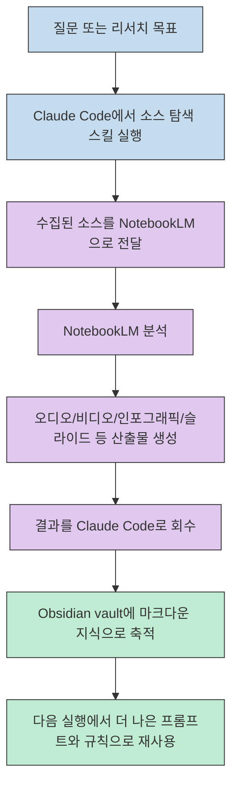
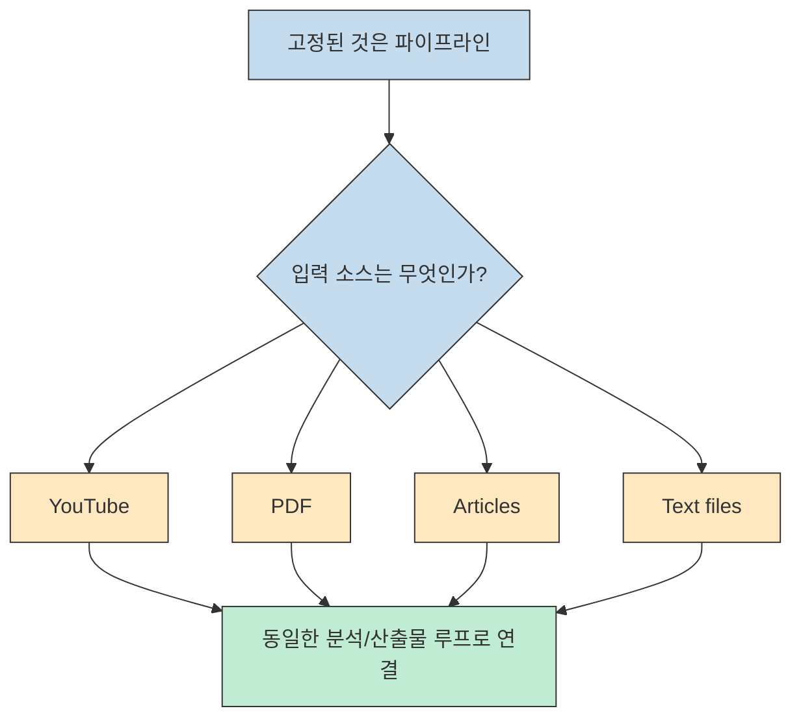
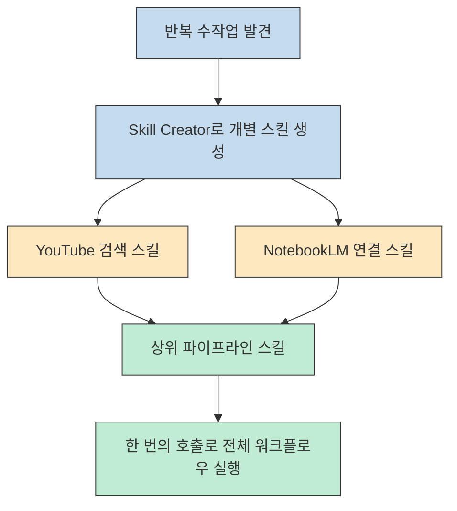
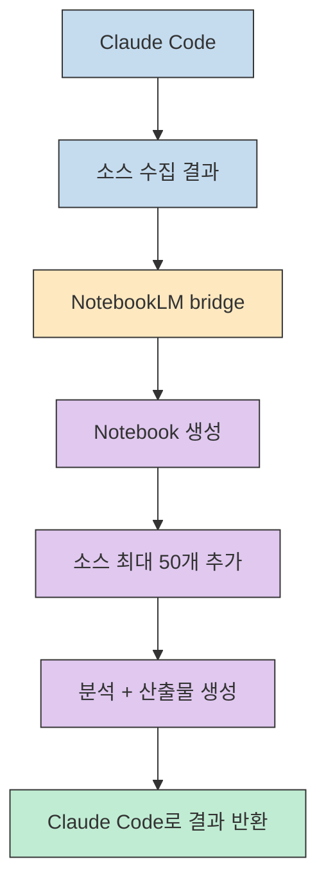
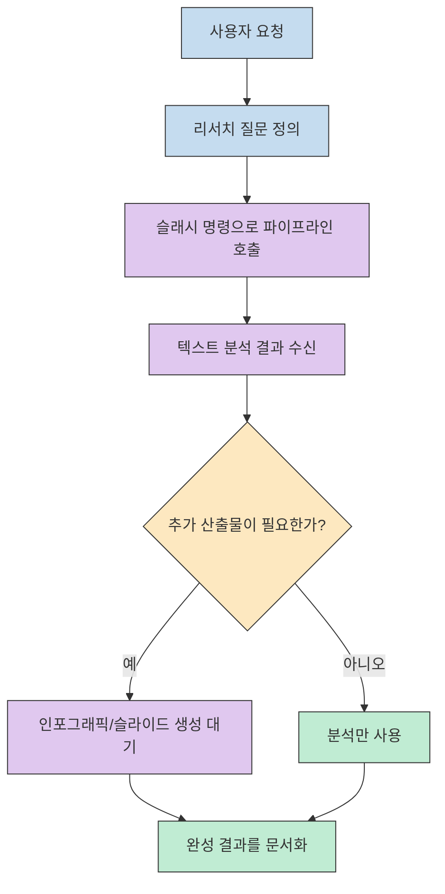
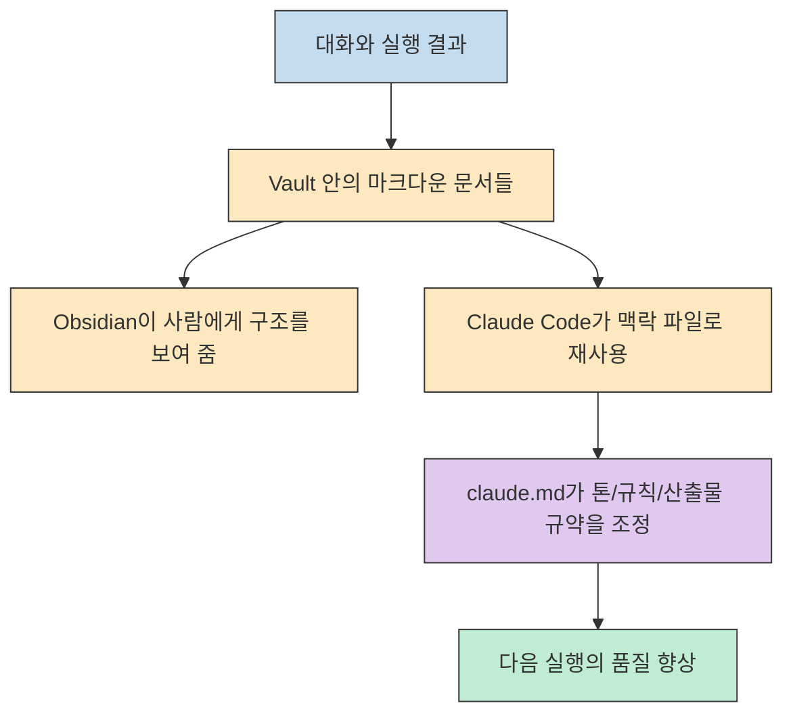
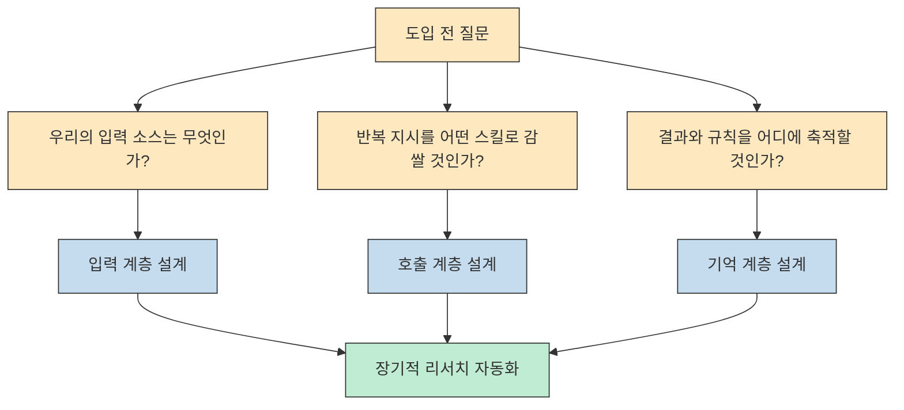

이 영상이 흥미로운 이유는 단순히 "툴 3개를 같이 쓰면 좋다"는 수준에서 멈추지 않기 때문입니다. 핵심은 Claude Code를 중심 허브로 두고, 소스 수집은 스킬로, 분석과 산출물 생성은 NotebookLM으로, 장기 기억과 작업 습관 축적은 Obsidian과 `claude.md` 로 맡기면서 하나의 반복 가능한 루프를 만든다는 점입니다.[^1][^2]

영상 제목은 다소 자극적이지만, 실제 내용은 의외로 실무적입니다. 발표자는 자신의 유튜브 리서치 흐름을 예시로 보여 주면서도, 진짜 포인트는 YouTube 검색 자체가 아니라 그 검색 단계를 PDF, 아티클, 텍스트 파일 같은 다른 정보원으로 쉽게 치환할 수 있는 템플릿이라는 점을 계속 강조합니다.[^3]

<!--more-->

## Sources

- [https://youtube.com/watch?v=kU3qYQ7ACMA&si=EnQi9Xa8vwxr4Igz](https://youtube.com/watch?v=kU3qYQ7ACMA&si=EnQi9Xa8vwxr4Igz)

## 이 워크플로우가 실제로 하는 일

영상의 구조를 가장 짧게 요약하면 이렇습니다. Claude Code가 먼저 특정 소스를 찾는 스킬을 실행하고, 그 결과를 NotebookLM으로 넘겨 분석과 2차 산출물을 만든 뒤, 다시 그 결과를 Claude Code와 Obsidian 쪽으로 되돌려 장기적으로 재사용 가능한 작업 자산으로 남깁니다. 발표자는 이 흐름을 "research monster"라고 표현하지만, 더 정확히는 **수집 - 분석 - 산출물 생성 - 축적**이 한 경로로 이어지는 자동화 파이프라인입니다.[^4][^5]

중요한 건 이 파이프라인이 특정 도메인에 묶여 있지 않다는 점입니다. 영상 속 데모는 YouTube 리서치를 대상으로 하지만, 발표자는 초반부터 "YouTube search"를 다른 정보원으로 바꿔 끼우는 방식으로 자기 일에 맞춰 쓰라고 설명합니다. 그래서 이 글을 볼 때는 "유튜브 분석 튜토리얼"로 읽기보다, **Claude Code에 업무용 리서치 루프를 어떻게 심을 것인가**로 읽는 편이 더 정확합니다.[^3]

## 설정의 핵심은 "개별 스킬"보다 "스킬을 묶는 방식"이다

영상에서 첫 단계는 Skill Creator 플러그인을 설치하는 것입니다. 설명은 매우 단순합니다. `/plugin` 으로 들어가 Skill Creator를 설치하고, Claude Code를 재시작한 다음, Skill Creator를 명시적으로 호출해 원하는 스킬의 역할을 자연어로 설명하면 됩니다. 발표자가 직접 든 예시는 `yt-dlp` 를 사용해 YouTube를 검색하고 구조화된 결과를 돌려주는 스킬입니다.[^6][^7]

여기서 실무적으로 중요한 포인트는 "스킬 하나를 잘 만드는 법"보다 **반복하던 수작업을 스킬 인터페이스로 감싸는 법**입니다. 영상에서도 YouTube 검색 스킬과 NotebookLM 연결 스킬을 따로 만든 다음, 마지막에는 이 둘을 하나의 상위 파이프라인 스킬로 다시 묶습니다. 결국 사용자는 세세한 하위 단계를 매번 지시하는 대신, 하나의 슬래시 명령으로 전체 작업 흐름을 호출할 수 있게 됩니다.[^8]

이 방식이 좋은 이유는 Claude Code의 역할이 바뀌기 때문입니다. 단순한 챗 인터페이스가 아니라, 여러 도구를 호출하고 결과를 연결하는 오케스트레이터가 됩니다. 발표자가 슬래시 명령을 선호하는 이유도 여기 있습니다. 자연어도 가능하지만, 발표자 경험상 슬래시 명령은 어떤 스킬을 호출할지 명시적으로 고정해 주므로 실행 재현성이 더 높다고 보는 것입니다.[^9]

## NotebookLM은 "결과물 공장"로 쓰고, Claude Code는 그 앞뒤를 조립한다

영상에서 NotebookLM은 단순 요약기가 아니라 중간 처리 엔진처럼 다뤄집니다. Claude Code가 수집한 소스를 NotebookLM에 넣고, NotebookLM은 그 소스를 분석한 뒤 오디오 리뷰, 마인드맵, 플래시카드, 인포그래픽 같은 결과물을 만들어 냅니다. 발표자는 이 처리의 상당 부분이 Google 쪽으로 오프로드되기 때문에 Claude Code 토큰을 아낄 수 있다고 설명합니다.[^5][^10]

여기서 알아둘 점은, 발표자 기준으로 NotebookLM에는 공개 API가 없다고 보고 `NotebookLM-PI` 라는 GitHub 리포지토리를 연결 브리지로 사용한다는 것입니다. 즉, 워크플로우의 설계는 "Claude Code가 직접 모든 분석을 한다"가 아니라, **Claude Code가 외부 분석기를 호출하고 그 결과를 다시 자기 작업 문맥으로 가져온다**에 가깝습니다.[^11]

실무적인 함의는 분명합니다. Claude Code를 모든 일의 처리 엔진으로 쓰기보다, **강한 도구를 잘 부르는 도구**로 쓰는 편이 더 효율적이라는 것입니다. NotebookLM이 잘하는 것은 다량 소스 흡수와 멀티포맷 산출물 생성이고, Claude Code가 잘하는 것은 그 앞뒤의 조합, 지시, 후처리, 저장 규칙화입니다. 영상은 바로 그 역할 분담을 보여 줍니다.[^5][^10][^12]

## 실행 단계에서는 "무엇을 물을지"보다 "어떻게 호출할지"가 중요하다

데모에서 발표자는 Claude Code와 MCP 관련 영상을 조사한 뒤, 상위 MCP 서버가 무엇인지, 조회 수를 끄는 포인트가 무엇인지, 빈틈이 어디 있는지까지 분석하게 하고, 마지막에는 인포그래픽 생성도 함께 요청합니다. 즉, 이 파이프라인은 단순 요약용이 아니라 **리서치 질문 + 경쟁 분석 + 산출물 생성**을 한 번에 묶는 데 초점이 있습니다.[^13]

실행 시간에 대한 설명도 현실적입니다. 영상 기준으로 텍스트 분석 결과는 약 6분 정도면 돌아오지만, 슬라이드 덱처럼 이미지가 여러 장 필요한 결과물은 15분 가까이 걸릴 수 있다고 말합니다. 반대로 인포그래픽처럼 상대적으로 가벼운 결과물은 몇 분 수준으로 설명합니다. 이 말은 곧, 파이프라인을 설계할 때 "지능형 처리"와 "시각 결과물 생성"의 대기 시간을 분리해서 기대해야 한다는 뜻입니다.[^10]

이 구간에서 특히 눈에 띄는 건 발표자가 슬래시 명령을 사실상 가장 신뢰하는 호출 방식으로 인식한다는 점입니다. 물론 이건 공식 보장이라기보다 발표자의 운용 경험에 가깝지만, 적어도 이 영상의 메시지는 분명합니다. 워크플로우가 복잡할수록 자유형 자연어보다 **명시적으로 묶인 스킬 인터페이스**가 더 안정적이라는 것입니다.[^9]

## Obsidian과 `claude.md` 는 기억 저장소가 아니라 학습 루프의 조정판이다

이 영상의 진짜 차별점은 NotebookLM보다 Obsidian 쪽에 있습니다. 발표자는 분석 방식, 원하는 산출물 형태, 사고 방식까지 Claude Code가 마크다운 파일들로 기록하게 만들고, 그 파일들을 Obsidian vault 안에 쌓습니다. 사람이 보기에는 링크드 노트와 그래프가 장점이지만, Claude Code 입장에서는 이 파일들이 모두 투명한 텍스트 자산이어서 필요한 맥락을 찾기 쉬워진다고 설명합니다.[^2][^14]

그리고 `claude.md` 를 단순 설정 파일이 아니라 "brain within a brain"이라고 부릅니다. Obsidian vault가 사람의 두 번째 뇌라면, `claude.md` 는 그 안에서 Claude에게 어떤 톤으로 말하고 어떤 형식으로 결과를 내야 하는지, 어떤 관습을 따라야 하는지 해석해 주는 운영 레이어라는 뜻입니다. 이 비유가 과장처럼 들릴 수는 있지만, 장기적으로는 **파일이 쌓일수록 작업 규칙도 함께 정교해지는 구조**를 잘 설명합니다.[^15]

또 하나 중요한 문장은, 이 관계가 하루 이틀로 끝나지 않는다는 점입니다. 발표자는 vault가 시간이 갈수록 커지고, `claude.md` 도 그와 함께 성장하면서, 장기적으로는 작업 선호와 분석 취향을 더 많이 반영하는 실행 환경이 될 수 있다고 설명합니다. 짧게 말하면, 이 워크플로우의 진짜 가치는 한 번의 인포그래픽 생성보다 **반복할수록 더 나아지도록 설계된 구조**에 있습니다.[^15][^16]

## 이 영상을 실무에 옮길 때 바로 가져갈 포인트

첫째, 이 구조의 본질은 특정 툴 조합이 아니라 파이프라인 설계입니다. YouTube를 검색하는 대신 팀 위키, PDF, 논문, 법률 문서, 고객 인터뷰 노트 등으로 입력을 바꿔도 구조는 유지됩니다. 그래서 도입할 때는 "NotebookLM을 써야 하나"보다 "우리 팀의 리서치 병목이 어디인가"를 먼저 보는 편이 낫습니다.[^3][^4]

둘째, Skill Creator의 가치는 스킬 숫자를 늘리는 데 있지 않습니다. 반복 지시를 없애고, 자주 쓰는 흐름을 한 번의 호출 단위로 묶는 데 있습니다. 셋째, Obsidian은 선택 사항처럼 보여도 장기 운영을 생각하면 중요합니다. 분석 결과뿐 아니라 프롬프트 습관, 산출물 취향, 대화 규칙까지 축적해야 개인화 효과가 생기기 때문입니다.[^8][^14][^16]

## 핵심 요약

- 이 영상의 핵심은 Claude Code, NotebookLM, Obsidian을 나열하는 것이 아니라 **수집 - 분석 - 산출물 - 축적**을 하나의 루프로 묶는 데 있습니다.[^4][^5]
- Skill Creator의 진짜 가치는 새 기능 추가보다, 반복 수작업을 스킬 인터페이스로 감싸고 다시 상위 파이프라인 스킬로 묶는 데 있습니다.[^6][^8]
- NotebookLM은 분석과 멀티포맷 산출물 생성 엔진으로 쓰고, Claude Code는 그 앞뒤를 조립하는 오케스트레이터로 두는 구성이 핵심입니다.[^5][^10][^11]
- Obsidian vault와 `claude.md` 는 결과 저장소를 넘어, 작업 습관과 산출물 규칙을 장기적으로 학습시키는 메모리 계층으로 제시됩니다.[^14][^15][^16]
- 따라서 이 영상의 교훈은 "이 조합이 최고다"보다, **자기 업무의 입력 소스와 분석 규칙을 하나의 반복 가능한 스킬 파이프라인으로 정리하라**에 가깝습니다.[^3][^16]

## 결론

이 영상이 말하는 "GOD MODE"는 더 똑똑한 모델 하나를 찾는 이야기가 아닙니다. 잘하는 도구를 서로 연결하고, 그 연결 방식 자체를 스킬로 고정하고, 그 결과를 다시 기억 계층에 누적해 다음 실행을 더 좋아지게 만드는 운영 방식입니다.[^5][^15][^16]

그래서 이 워크플로우를 그대로 복제할 필요는 없습니다. 오히려 자기 일에 맞는 입력 소스와 산출물 형식, 기억 저장소를 정한 뒤 그 사이를 Claude Code가 오케스트레이션하게 만드는 것이 핵심입니다. 그 관점에서 보면 이 영상의 진짜 메시지는 "Claude Code + NotebookLM + Obsidian"이 아니라, **반복 가능한 지식 작업 루프를 어떻게 설계할 것인가**입니다.[^3][^16]

[^1]: [https://youtu.be/kU3qYQ7ACMA?t=19](https://youtu.be/kU3qYQ7ACMA?t=19)
[^2]: [https://youtu.be/kU3qYQ7ACMA?t=172](https://youtu.be/kU3qYQ7ACMA?t=172)
[^3]: [https://youtu.be/kU3qYQ7ACMA?t=70](https://youtu.be/kU3qYQ7ACMA?t=70)
[^4]: [https://youtu.be/kU3qYQ7ACMA?t=28](https://youtu.be/kU3qYQ7ACMA?t=28)
[^5]: [https://youtu.be/kU3qYQ7ACMA?t=112](https://youtu.be/kU3qYQ7ACMA?t=112)
[^6]: [https://youtu.be/kU3qYQ7ACMA?t=339](https://youtu.be/kU3qYQ7ACMA?t=339)
[^7]: [https://youtu.be/kU3qYQ7ACMA?t=353](https://youtu.be/kU3qYQ7ACMA?t=353)
[^8]: [https://youtu.be/kU3qYQ7ACMA?t=525](https://youtu.be/kU3qYQ7ACMA?t=525)
[^9]: [https://youtu.be/kU3qYQ7ACMA?t=620](https://youtu.be/kU3qYQ7ACMA?t=620)
[^10]: [https://youtu.be/kU3qYQ7ACMA?t=649](https://youtu.be/kU3qYQ7ACMA?t=649)
[^11]: [https://youtu.be/kU3qYQ7ACMA?t=399](https://youtu.be/kU3qYQ7ACMA?t=399)
[^12]: [https://youtu.be/kU3qYQ7ACMA?t=507](https://youtu.be/kU3qYQ7ACMA?t=507)
[^13]: [https://youtu.be/kU3qYQ7ACMA?t=608](https://youtu.be/kU3qYQ7ACMA?t=608)
[^14]: [https://youtu.be/kU3qYQ7ACMA?t=194](https://youtu.be/kU3qYQ7ACMA?t=194)
[^15]: [https://youtu.be/kU3qYQ7ACMA?t=742](https://youtu.be/kU3qYQ7ACMA?t=742)
[^16]: [https://youtu.be/kU3qYQ7ACMA?t=804](https://youtu.be/kU3qYQ7ACMA?t=804)
[^17]: [https://youtu.be/kU3qYQ7ACMA?t=253](https://youtu.be/kU3qYQ7ACMA?t=253)
