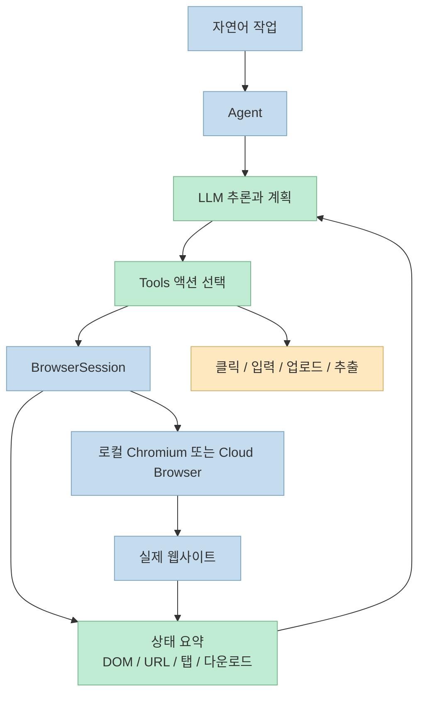
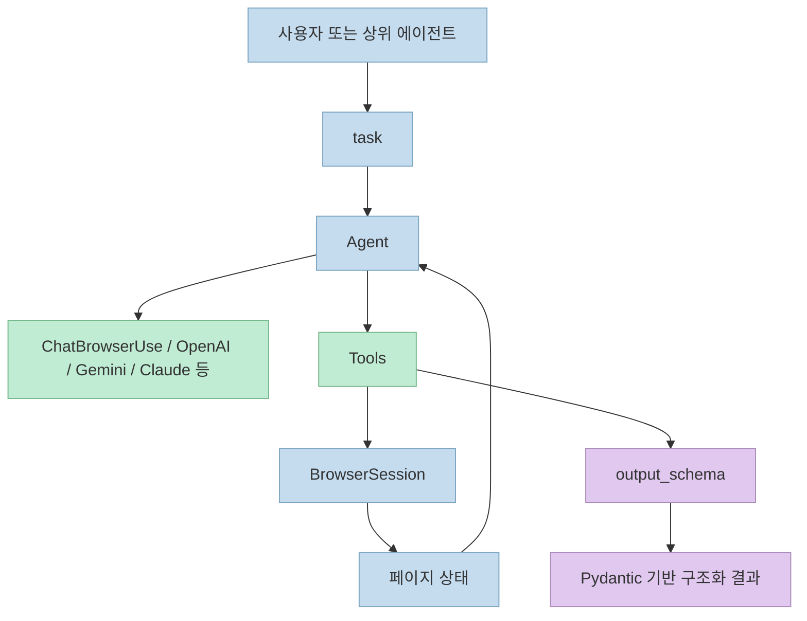
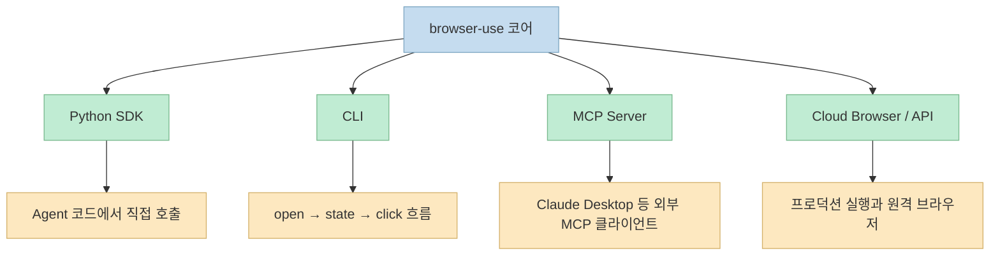
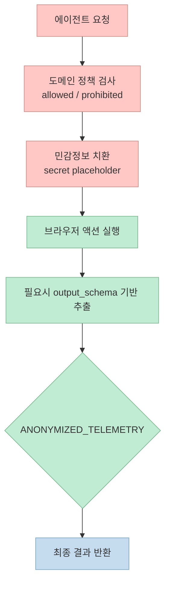

2026년 3월 21일 기준으로 `browser-use` 의 GitHub 저장소 페이지는 **81.6k stars** 를 보여 주고, `pyproject.toml` 과 PyPI 메타데이터는 최신 공개 버전을 **0.12.2**, 지원 Python 범위를 **>=3.11,<4.0** 으로 적고 있습니다. README가 이 프로젝트를 짧게 설명하는 문장은 `"Make websites accessible for AI agents"` 인데, 이 한 줄이 의외로 정확합니다.<br>
`browser-use` 는 단순한 브라우저 매크로나 Playwright 래퍼가 아니라, **웹페이지의 상태를 LLM이 판단할 수 있는 작업 공간으로 바꾸고, 그 판단을 다시 브라우저 액션으로 연결하는 계층** 을 만들려는 프로젝트입니다.

<!--more-->

## Sources

- Input: [https://github.com/browser-use/browser-use](https://github.com/browser-use/browser-use)
- Verified: [README.md](https://github.com/browser-use/browser-use/blob/main/README.md)
- Verified: [pyproject.toml](https://github.com/browser-use/browser-use/blob/main/pyproject.toml)
- Verified: [Browser Use Open Source Introduction](https://docs.browser-use.com/open-source/introduction)
- Verified: [Human Quickstart](https://docs.browser-use.com/open-source/quickstart)
- Verified: [Supported Models](https://docs.browser-use.com/open-source/supported-models)
- Verified: [Browser Use CLI](https://docs.browser-use.com/open-source/browser-use-cli)
- Verified: [PyPI `browser-use`](https://pypi.org/project/browser-use/)
- Verified: [browser_use/__init__.py](https://github.com/browser-use/browser-use/blob/main/browser_use/__init__.py)
- Verified: [browser_use/browser/session.py](https://github.com/browser-use/browser-use/blob/main/browser_use/browser/session.py)
- Verified: [browser_use/tools/service.py](https://github.com/browser-use/browser-use/blob/main/browser_use/tools/service.py)
- Verified: [browser_use/mcp/server.py](https://github.com/browser-use/browser-use/blob/main/browser_use/mcp/server.py)
- Verified: [browser_use/telemetry/service.py](https://github.com/browser-use/browser-use/blob/main/browser_use/telemetry/service.py)
- Verified: [tests/ci/security/test_domain_filtering.py](https://github.com/browser-use/browser-use/blob/main/tests/ci/security/test_domain_filtering.py)
- Verified: [tests/ci/security/test_sensitive_data.py](https://github.com/browser-use/browser-use/blob/main/tests/ci/security/test_sensitive_data.py)
- Verified: [tests/ci/test_structured_extraction.py](https://github.com/browser-use/browser-use/blob/main/tests/ci/test_structured_extraction.py)

## browser-use가 추상화하는 것은 브라우저가 아니라 웹 작업이다

README와 Open Source Introduction을 같이 보면 `browser-use` 의 핵심 포지션은 명확합니다. 이 프로젝트는 브라우저를 직접 조작하는 저수준 자동화 도구에 LLM을 억지로 붙이는 대신, **에이전트가 웹을 탐색하고 상태를 읽고 액션을 선택하는 루프 자체를 하나의 라이브러리로 묶습니다**. 소개 페이지는 "Connect any LLM and run locally or self-hosted"라고 설명하고, 코드의 `BrowserSession` 문서 문자열은 이를 "event-driven browser session"과 "2-layer architecture"로 정의합니다.

이 2계층 구조가 중요한 이유는, 웹 자동화에서 가장 어려운 지점이 브라우저를 여는 행위가 아니라 **현재 페이지에서 무엇을 볼 수 있고, 무엇을 눌러야 하며, 다음에 무엇을 해야 하는지 상태를 안정적으로 요약하는 일** 이기 때문입니다. `browser_use.__init__` 는 `Agent`, `Browser`, `BrowserSession`, `Tools`, 다양한 `Chat*` 모델 어댑터를 한 번에 export합니다. 즉, 이 프로젝트의 최소 단위는 브라우저 객체 하나가 아니라 **LLM 판단 계층 + 브라우저 세션 계층 + 액션 계층** 의 조합입니다.



`browser_use/browser/session.py` 가 말하는 `BrowserSession` 은 로컬 브라우저 모드와 클라우드 브라우저 모드를 모두 받도록 설계돼 있고, `allowed_domains`, `prohibited_domains`, `cookie_whitelist_domains`, `captcha_solver`, `cloud_profile_id` 같은 운영 파라미터를 한곳에 모읍니다. 이건 단순 편의 기능이 아니라, 브라우저 자동화가 곧바로 **보안 정책, 인증 상태, 실행 환경, 세션 지속성** 문제와 맞닿는다는 것을 보여 줍니다.

## 핵심 구성요소는 Agent, BrowserSession, Tools, 모델 어댑터다

실제로 `browser-use` 를 읽을 때 가장 먼저 봐야 하는 클래스는 `Agent` 입니다. `browser_use/agent/service.py` 의 생성자를 보면 이 에이전트는 생각보다 훨씬 많은 실무 옵션을 품고 있습니다. `tools` 또는 `controller`, `skills`, `sensitive_data`, `output_model_schema`, `fallback_llm`, `judge_llm`, `enable_planning`, `loop_detection_enabled` 같은 인자가 모두 한곳에 모여 있습니다. 즉, 이 프로젝트의 중심은 "LLM이 브라우저를 클릭한다"가 아니라 **브라우저 자동화용 에이전트 런타임** 입니다.

여기서 흥미로운 점은 기본값입니다. `llm` 을 넘기지 않으면 `Agent` 는 내부적으로 `ChatBrowserUse()` 를 기본 모델로 잡습니다. 반면 공식 Supported Models 문서는 Google Gemini, OpenAI, Anthropic, AWS Bedrock, Groq, Ollama, LangChain, Qwen, Vercel AI Gateway 등 꽤 넓은 모델 조합을 예제로 제공합니다. 다시 말해 `browser-use` 는 특정 모델에 잠긴 프레임워크라기보다, **브라우저 작업에 최적화된 자체 모델을 기본값으로 두되 여러 공급자에 열어 둔 어댑터 레이어** 에 가깝습니다.

또 하나 중요한 축은 `Tools` 입니다. `browser_use/tools/service.py` 를 보면 표준 액션으로 `navigate`, `click`, `input`, `scroll`, `upload`, `screenshot`, `extract`, `search_page`, `find_elements`, `switch_tab`, `close_tab` 등이 등록됩니다. 특히 `extract` 액션은 free-text 모드만 있는 것이 아니라, `output_schema` 또는 `extraction_schema` 가 들어오면 JSON Schema를 Pydantic 모델로 바꿔 **구조화 추출** 로 전환합니다. 테스트 파일 `tests/ci/test_structured_extraction.py` 도 이 경로를 별도 스위트로 검증하고 있습니다.



이 구성은 `browser-use` 가 단순히 "브라우저를 대신 눌러 주는 도구"가 아니라는 점을 분명하게 보여 줍니다. 중요한 건 클릭 그 자체보다, **현재 상태를 읽고 적절한 액션 집합으로 번역하며, 가능하면 결과를 구조화된 형태로 되돌리는 파이프라인** 이기 때문입니다.

## 진입점은 Python SDK, CLI, MCP 세 갈래로 나뉜다

공식 Quickstart를 보면 가장 익숙한 진입점은 Python SDK입니다. 설치 흐름은 `uv venv`, `uv pip install browser-use`, `uvx browser-use install` 순서이고, 첫 예제는 `Agent(task=..., llm=ChatBrowserUse())` 형태입니다. 시작 장벽은 생각보다 낮습니다. 비동기 Python 코드 한 파일만 있어도 첫 에이전트를 바로 실행할 수 있습니다.

```python
from browser_use import Agent, ChatBrowserUse
from dotenv import load_dotenv
import asyncio

load_dotenv()

async def main():
    agent = Agent(
        task="Find the number 1 post on Show HN",
        llm=ChatBrowserUse(),
    )
    await agent.run()

if __name__ == "__main__":
    asyncio.run(main())
```

하지만 `browser-use` 의 진짜 성격을 잘 보여 주는 쪽은 CLI입니다. 공식 CLI 문서는 이 인터페이스를 "Fast, persistent browser automation from the command line"이라고 설명하고, **persistent background daemon** 이 브라우저를 살아 있게 유지해 약 50ms 수준의 빠른 반복 제어를 노린다고 적습니다. 그래서 사용 흐름도 단순합니다. `browser-use open` 으로 페이지를 열고, `browser-use state` 로 요소 인덱스를 보고, `click`, `input`, `keys`, `screenshot` 같은 명령을 이어 붙입니다.

```bash
browser-use open https://example.com
browser-use state
browser-use click 5
browser-use input 3 "john@example.com"
browser-use screenshot output.png
browser-use close
```

세 번째 진입점은 MCP입니다. `browser_use/mcp/server.py` 의 첫 문단은 이 서버가 Model Context Protocol 위로 **autonomous browser tasks, direct browser control, content extraction, file system operations** 를 노출한다고 설명합니다. 실행 예시는 `uvx browser-use --mcp` 이고, Claude Desktop 같은 MCP 클라이언트 설정 예시도 같이 들어 있습니다. 즉 `browser-use` 는 독립 실행형 SDK이면서, 동시에 **다른 AI 런타임에 끼워 넣을 수 있는 브라우저 도구 서버** 로도 쓰일 수 있습니다.



이 3갈래 구조는 실무적으로 중요합니다. 빠른 프로토타입은 Python에서 시작하고, 디버깅이나 반복 조작은 CLI로 옮기고, 팀 차원 자동화는 MCP나 Cloud 쪽으로 확장하는 식의 **점진적 도입 경로** 가 자연스럽게 열리기 때문입니다.

## 실전에서는 클라우드 선택, 가드레일, 데이터 경계가 더 중요하다

README와 Quickstart는 로컬 실행만 강조하지 않습니다. README는 Browser Use Cloud를 "faster, scalable, stealth-enabled browser automation"으로 소개하고, CAPTCHA 대응이 필요할 때도 Cloud 사용을 권합니다. Quickstart는 더 직접적으로 `@sandbox` 를 붙인 프로덕션 예제를 제시하면서, 에이전트와 브라우저, persistence, auth, cookies, LLMs를 함께 다룬다고 설명합니다. 즉, `browser-use` 의 오픈소스 레이어만 읽으면 가볍게 보이지만, 운영 관점에서는 이미 **원격 브라우저 인프라와 인증 상태 동기화** 까지 스코프에 넣고 있습니다.

보안 가드레일도 생각보다 구체적입니다. `BrowserSession` 시그니처에는 `allowed_domains` 와 `prohibited_domains` 가 있고, 실제 보안 테스트는 `https://example.com@malicious.com` 처럼 흔한 우회 패턴을 명시적으로 막습니다. 이는 "허용 도메인만 열어라"가 문서 문장에 머무르는 것이 아니라, **테스트로 굳어진 제약** 이라는 뜻입니다.

민감 정보 처리도 비슷합니다. `tests/ci/security/test_sensitive_data.py` 는 `<secret>username</secret>` 같은 placeholder가 URL 문맥 없이 임의로 치환되지 않고, **도메인이 맞을 때만 노출되도록** 검증합니다. 에이전트 자동화에서 비밀번호와 세션 쿠키가 가장 위험한 이유를 생각하면, 이런 설계는 단순 편의 기능이 아니라 필수 안전장치에 가깝습니다.

운영 데이터 경계에 대한 단서도 있습니다. `browser_use/telemetry/service.py` 는 기본적으로 anonymized telemetry를 전송할 수 있고, `ANONYMIZED_TELEMETRY=False` 환경 변수로 비활성화할 수 있다고 명시합니다. 이건 나쁜 기능이라는 뜻이 아니라, 도입 전에 **무엇이 기본값이고, 어떤 환경 변수로 꺼지는지** 확인해야 한다는 뜻입니다.



정리하면 `browser-use` 를 제대로 쓰려면 기능 목록보다 먼저 세 가지를 정해야 합니다.<br>
첫째, 로컬 브라우저와 클라우드 브라우저 중 어디까지 가져갈지.<br>
둘째, 허용 도메인과 민감정보 정책을 어디까지 강제할지.<br>
셋째, 결과를 자유 텍스트로 받을지, 구조화 스키마로 고정할지.<br>
이 세 가지가 정리돼야 `browser-use` 는 데모를 넘어 운영 가능한 도구가 됩니다.

## 실전 적용 포인트

- 처음에는 Cloud보다 로컬 SDK나 CLI로 시작하는 편이 좋습니다. 페이지 상태와 액션 루프를 이해한 뒤에 원격 브라우저로 올리는 것이 훨씬 안전합니다.
- 사람이 읽는 자동화보다 시스템이 소비하는 자동화를 만들고 싶다면 `output_schema` 기반 추출을 먼저 검토하는 편이 낫습니다.
- 사내 도구나 운영 콘솔에 붙일 때는 `allowed_domains`, `prohibited_domains`, `sensitive_data` 를 기본값으로 두는 편이 좋습니다.
- 반복 디버깅에는 CLI가 강합니다. `open`, `state`, `click`, `input` 흐름만 익혀도 페이지별 문제를 빠르게 재현할 수 있습니다.
- 다른 에이전트 런타임과 연결할 계획이면 처음부터 MCP 모드를 염두에 두는 편이 구조적으로 깔끔합니다.

## 핵심 요약

- `browser-use` 는 브라우저를 대신 눌러 주는 도구라기보다, 웹 작업을 위한 **에이전트 런타임** 에 가깝습니다.
- 코어 구성은 `Agent`, `BrowserSession`, `Tools`, 다양한 `Chat*` 모델 어댑터의 조합입니다.
- 진입점은 Python SDK, CLI, MCP로 나뉘며, 각각 프로토타입, 디버깅, 외부 런타임 연동에 강점이 있습니다.
- 구조화 추출, 도메인 가드레일, 민감정보 placeholder, telemetry 토글 같은 운영 기능이 이미 코드와 테스트에 녹아 있습니다.
- 그래서 이 프로젝트의 진짜 가치는 "웹을 자동화한다"보다 "웹 자동화를 에이전트 시스템으로 포장한다"는 데 있습니다.

## 결론

`browser-use` 를 흥미롭게 만드는 지점은 브라우저를 제어할 수 있다는 사실 자체가 아닙니다. 그보다 중요한 것은, 웹페이지를 에이전트가 다룰 수 있는 **상태 공간과 액션 공간** 으로 정리해 놓았다는 점입니다.<br>
웹 브라우저가 여전히 가장 넓은 범용 인터페이스라면, 앞으로 많은 에이전트 시스템은 결국 이런 계층을 필요로 하게 됩니다. `browser-use` 는 그 계층을 Python SDK, CLI, MCP, Cloud까지 이어지는 하나의 제품 구조로 묶으려는 시도라고 보는 편이 정확합니다.
