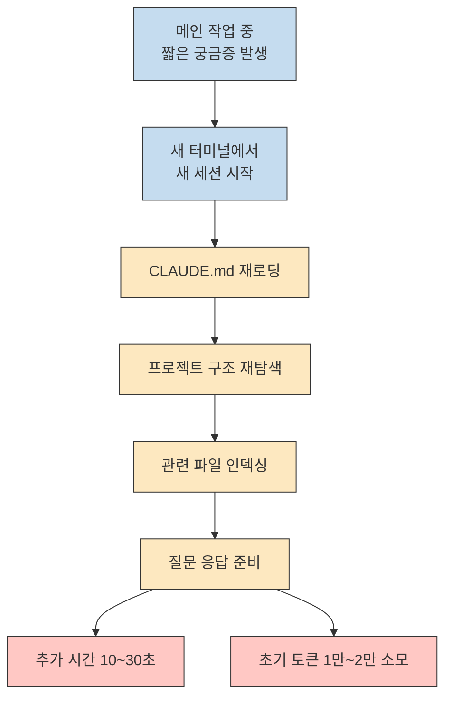
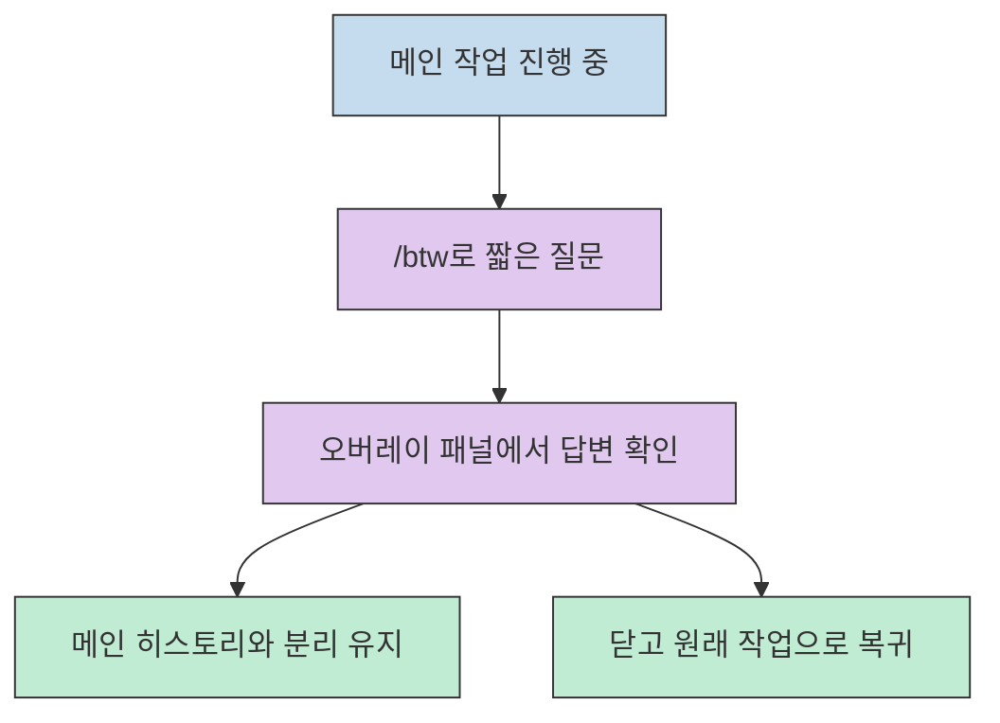
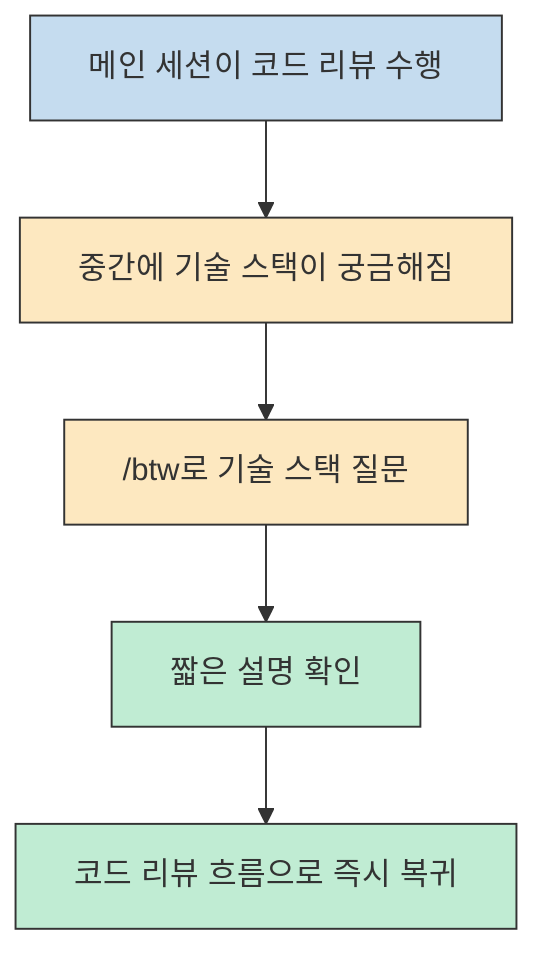
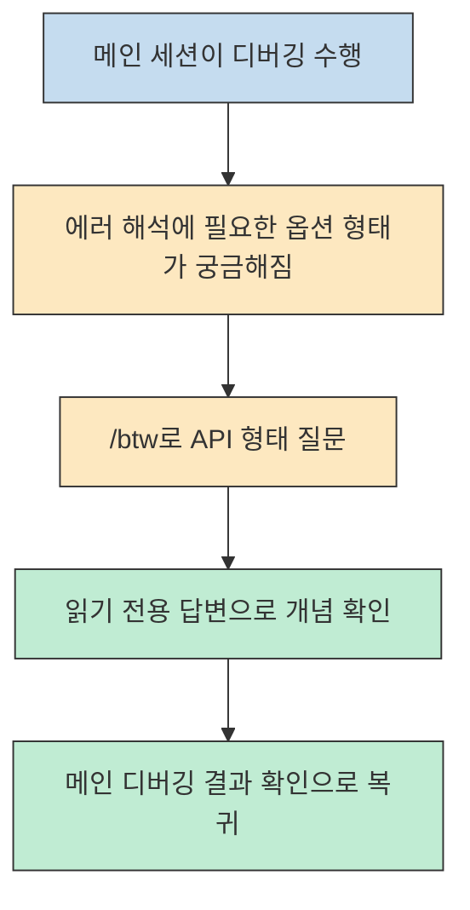
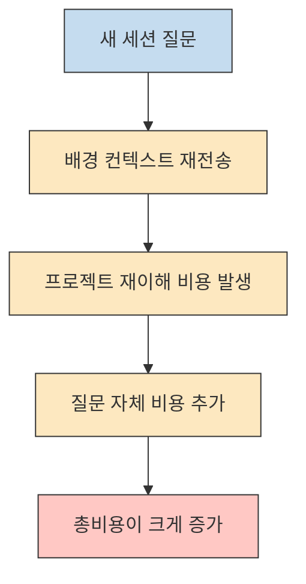
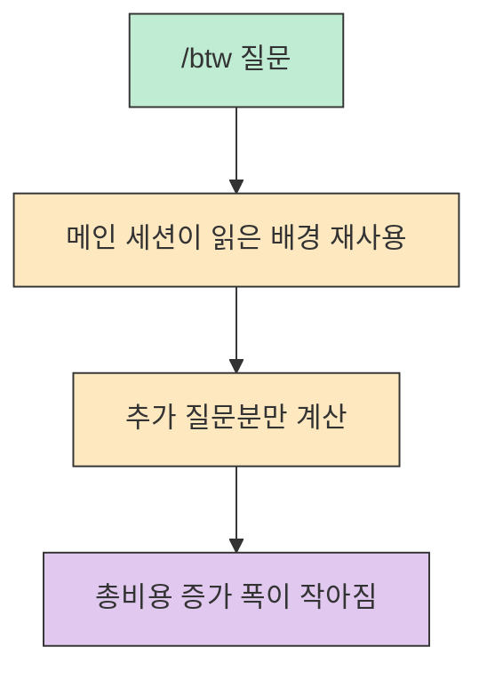
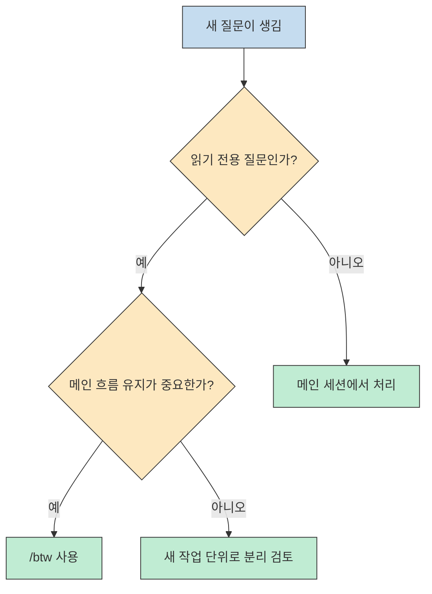

Claude Code를 쓰다 보면 큰 작업을 진행하는 중간에 "이 함수 어디서 더 쓰이지?", "이 옵션 타입이 정확히 뭐였지?" 같은 옆길 질문이 자꾸 생깁니다. 많은 사람이 이때 새 터미널을 열어 별도 세션을 띄우는데, 이 영상이 지적하는 문제는 바로 그 습관 자체가 생각보다 비싸다는 점입니다. `/btw` 는 이 작은 옆길 질문을 위해 메인 흐름을 버리지 말라고 제안하는 기능입니다.[^1][^2]
<!--more-->

영상의 핵심은 단순합니다. `/btw` 는 거창한 자동화 기능이 아니라, **이미 읽어 둔 프로젝트 컨텍스트를 다시 활용해 짧은 읽기 전용 질문을 처리하는 오버레이** 에 가깝습니다. 그래서 이 글도 "`/btw` 가 무슨 명령인가"보다 "왜 이 명령이 토큰 비용과 작업 흐름에 영향을 주는가"를 중심으로 정리하겠습니다.[^3][^6]

## Sources

- [https://www.youtube.com/watch?v=TCJJJDw3-vk](https://www.youtube.com/watch?v=TCJJJDw3-vk) - 텐빌더, "클로드 코드에서 새로 나온 btw로 토큰 비용 50% 줄였습니다"
- [Anthropic Pricing: Prompt caching](https://docs.anthropic.com/en/docs/about-claude/pricing)
- [Anthropic Claude Code CHANGELOG](https://github.com/anthropics/claude-code/blob/main/CHANGELOG.md)

## 왜 새 세션 하나가 생각보다 비싼가

영상이 먼저 짚는 것은 "사이드 질문 하나 하려고 새 세션을 여는 비용"입니다. 설명에 따르면 새 세션은 단순히 빈 채팅창을 하나 더 여는 일이 아니라, `CLAUDE.md` 를 다시 읽고, 프로젝트 구조를 훑고, 관련 파일을 다시 인덱싱한 뒤에야 질문에 답할 준비가 됩니다. 그 과정이 대략 10초에서 30초 정도의 체감 지연을 만들고, 입력 토큰도 1만에서 2만 수준으로 추가로 들어간다는 것이 영상의 주장입니다.[^1][^2]

이 지점이 중요한 이유는, 사용자가 낭비라고 느끼는 대상이 보통 "긴 리팩터링 프롬프트"라고 생각하기 쉽기 때문입니다. 하지만 영상은 오히려 **짧은 옆길 질문을 처리하기 위해 매번 콜드 스타트를 반복하는 것** 이 누적 비용의 큰 원인이 될 수 있다고 봅니다. 하루에 열 번만 이런 우회 세션을 열어도 초기 로딩에만 수십만 토큰이 들어갈 수 있다는 설명은, Claude Code를 오래 붙잡고 일하는 사람에게 꽤 실감나는 경고입니다.[^2]

## `/btw`는 무엇을 바꾸는가

영상에서 `/btw` 는 메인 작업을 멈추고 다른 세션으로 이동하는 기능이 아니라, **메인 작업 위에 잠깐 올라오는 사이드 질문 창** 으로 소개됩니다. 작업 도중 `/btw` 를 입력해 질문하면 오버레이 패널이 뜨고, 여기서 받은 답변은 메인 대화 히스토리에 섞이지 않으며, 닫으면 원래 하던 흐름으로 바로 돌아옵니다. 영상은 이 성질을 "포스트잇"에 비유하는데, 본문 내용을 바꾸지 않고 옆에 참고 메모만 붙이는 느낌에 가깝습니다.[^3]

이 특성이 실무적으로 큰 이유는 두 가지입니다. 첫째, 메인 작업의 컨텍스트를 흐리지 않습니다. 코드 리뷰를 시키던 중간에 기술 스택을 물어봤다고 해서, 메인 작업이 갑자기 기술 스택 설명 세션으로 오염되지 않는다는 뜻입니다. 둘째, 사용자가 "짧은 확인 질문을 하려면 새 세션을 열어야 한다"는 심리적 마찰을 줄입니다. 결국 `/btw` 의 가치는 정답 품질보다도 **질문의 진입 비용을 낮추는 데** 있습니다.[^3]

## 실전 데모에서 드러난 적합한 사용처

영상 데모의 첫 번째 예시는 코드 리뷰입니다. 메인 세션은 프로젝트를 읽으며 상세 코드 리뷰를 진행하고 있고, 사용자는 그 와중에 프로젝트 기술 스택이 궁금해집니다. 이런 질문은 리뷰 작업과 완전히 별도 작업을 만들 정도로 크지는 않지만, 지금 당장 알아 두면 메인 결과를 더 잘 읽는 데 도움이 됩니다. 영상은 바로 이런 종류의 "작지만 현재 작업에 붙어 있는 읽기 질문"에 `/btw` 가 잘 맞는다고 보여 줍니다.[^4]

두 번째 예시는 디버깅입니다. 사용자가 타입 에러를 추적하는 중간에 `readFile` 관련 파라미터 형태가 궁금해져 별도 확인 질문을 던집니다. 이 데모가 보여 주는 포인트는 `/btw` 가 단순 FAQ용 기능이 아니라, **현재 디버깅 중인 문제를 더 빨리 해석하기 위한 주변 지식 확인 창** 으로도 쓸 수 있다는 점입니다. 함수 시그니처, 옵션 형태, 현재 파일이 아닌 주변 개념 확인처럼 "읽고 이해하면 충분한 질문"이 대표적인 적합 사례입니다.[^5]

즉 `/btw` 를 잘 쓰는 핵심은 질문의 크기가 아니라 성격입니다. "이 파일을 수정해 줘", "테스트를 돌려 줘", "새 브랜치에서 실험해 줘"처럼 상태를 바꾸는 요청은 메인 작업으로 가야 합니다. 반대로 "이 개념만 확인하자", "이 타입만 짚고 가자", "이 함수가 어느 레이어에서 쓰이는지 읽어 보자" 같은 읽기 중심 질문은 `/btw` 로 빼는 편이 훨씬 자연스럽습니다.[^4][^5][^8]

## 왜 비용이 줄어드는가: 핵심은 캐시 재사용이다

영상은 `/btw` 의 비용 절감 원리를 아주 직관적으로 설명합니다. 새 세션은 프로젝트를 처음부터 다시 읽어야 하지만, `/btw` 는 이미 메인 세션이 읽어 둔 `CLAUDE.md`, 프로젝트 구조, 관련 파일 맥락을 활용하므로 같은 준비 과정을 반복하지 않아도 된다는 것입니다. 그래서 사용자는 전체 재초기화 비용이 아니라 **추가 질문에 필요한 작은 입력분만 더 내는 구조** 에 가까워진다고 설명합니다.[^6]

여기서 영상은 이를 Anthropic의 프롬프트 캐싱 개념과 연결해 설명합니다. 이 부분은 공식 문서로도 어느 정도 배경을 보강할 수 있습니다. Anthropic 가격 문서에 따르면 prompt caching의 cache read hit는 기본 입력 가격의 `0.1x`, 즉 표준 입력 비용의 10%로 책정됩니다. 따라서 이미 캐시된 큰 컨텍스트를 재사용할 수 있다면, 동일한 배경 문맥을 매번 새로 보내는 것보다 비용 구조가 크게 유리해지는 것은 공식 가격표만 봐도 이해할 수 있습니다.[^7]

다만 여기서 한 가지는 선을 그어야 합니다. `/btw` 의 내부 구현 세부를 Anthropic 공식 문서가 상세히 공개한 것은 아니므로, "항상 정확히 50% 절감" 같은 식으로 일반화하면 과장될 수 있습니다. 더 안전한 표현은 이렇습니다. **영상은 절반 이상 저렴해질 수 있다고 경험적으로 설명하고, Anthropic 공식 가격 문서는 캐시 재사용이 실제로 큰 비용 차이를 만들 수 있는 구조임을 뒷받침한다. 하지만 최종 절감률은 질문 길이, 세션 상태, 캐시 적중 범위에 따라 달라질 가능성이 있다** 는 정도가 가장 정확합니다.[^6][^7]

## 실전 적용 포인트

영상 기준으로 `/btw` 는 명확한 제약이 있습니다. 첫째, 읽기 전용입니다. 파일 수정이나 터미널 명령 실행은 메인 작업에서 해야 하고, `/btw` 에 기대할 수 있는 것은 어디까지나 짧은 질의응답입니다. 둘째, `VS Code` 에서 쓰려면 terminal mode를 활성화해야 한다고 영상은 설명합니다. 셋째, 영상 기준 권장 버전은 `2.1.72` 이상입니다.[^8]

흥미로운 점은 공식 Claude Code changelog에서도 `/btw` 관련 수정이 반복적으로 등장한다는 것입니다. 2026년 3월 21일 기준 공개 changelog에는 `/btw` 가 활성 응답 중에 잘못된 출력을 돌려주거나, 붙여넣은 텍스트를 포함하지 못하는 문제를 고친 내역이 보입니다. 이것은 적어도 `/btw` 가 일회성 데모 기능이 아니라 **실사용 기능으로 계속 다듬어지고 있는 경로** 라는 뜻으로 읽을 수 있습니다.[^9]

실제로 적용할 때는 아래 기준으로 나누면 됩니다.

- 메인 흐름을 끊고 싶지 않은 짧은 읽기 질문이면 `/btw`
- 답변이 메인 히스토리를 더럽히지 않았으면 좋겠다면 `/btw`
- 수정, 실행, 검증, 파일 쓰기가 필요한 작업이면 메인 세션
- 질문이 너무 커서 사실상 새로운 작업 단위라면 새 작업으로 분리

## 핵심 요약

- `/btw` 의 본질은 새 기능 추가보다 **새 세션 초기화 비용을 우회하는 읽기 전용 사이드 채널** 에 가깝습니다.[^3][^6]
- 영상은 새 세션 진입 시 1만에서 2만 토큰과 10초에서 30초의 준비 비용이 들어갈 수 있다고 설명합니다.[^1][^2]
- 코드 리뷰 중 기술 스택 확인, 디버깅 중 옵션 형태 확인처럼 현재 흐름에 붙은 작은 질문이 `/btw` 에 가장 잘 맞습니다.[^4][^5]
- 비용 절감 논리는 기존 세션이 읽어 둔 배경을 재사용하는 데 있고, Anthropic 공식 가격표도 cache read hit가 기본 입력 가격의 10%라는 점에서 캐시 재사용의 경제성을 뒷받침합니다.[^6][^7]
- 다만 "절반 절감"은 영상의 경험적 수치로 받아들이는 편이 안전하며, 실제 절감률은 세션 상태와 질문 크기에 따라 달라질 수 있습니다.[^6][^7]

## 결론

`/btw` 가 좋은 이유는 마법처럼 더 똑똑한 답을 주기 때문이 아닙니다. 오히려 반대입니다. 짧은 질문을 위해 굳이 새 세션을 열지 않아도 되게 만들어, 사용자가 **질문의 비용 구조 자체를 바꿀 수 있게 해 준다** 는 점이 핵심입니다. Claude Code를 오래 쓰는 사람일수록, 이런 작은 우회 비용 절감이 체감 차이를 크게 만듭니다.[^2][^6]

그래서 `/btw` 를 배울 때는 명령어 문법보다 먼저 경계부터 기억하는 편이 좋습니다. 읽기 전용 짧은 확인 질문은 `/btw`, 상태를 바꾸는 실작업은 메인 세션. 이 구분만 명확해도 토큰 비용, 작업 흐름, 대화 히스토리 정리 세 가지를 한 번에 개선할 수 있습니다.[^3][^8]

[^1]: [새 세션 초기화 비용과 `/btw` 소개](https://youtu.be/TCJJJDw3-vk?t=6)
[^2]: [새 세션 진입 예시와 누적 비용 설명](https://youtu.be/TCJJJDw3-vk?t=24)
[^3]: [`/btw` 오버레이 동작과 메인 히스토리 분리](https://youtu.be/TCJJJDw3-vk?t=76)
[^4]: [코드 리뷰 중 기술 스택 확인 데모](https://youtu.be/TCJJJDw3-vk?t=132)
[^5]: [디버깅 중 옵션 형태 확인 데모](https://youtu.be/TCJJJDw3-vk?t=224)
[^6]: [`/btw` 비용 절감 원리 설명](https://youtu.be/TCJJJDw3-vk?t=287)
[^7]: [Anthropic Pricing, prompt caching multipliers](https://docs.anthropic.com/en/docs/about-claude/pricing)
[^8]: [읽기 전용 제약, `VS Code` terminal mode, `2.1.72+` 안내](https://youtu.be/TCJJJDw3-vk?t=360)
[^9]: [Anthropic Claude Code CHANGELOG](https://github.com/anthropics/claude-code/blob/main/CHANGELOG.md)
