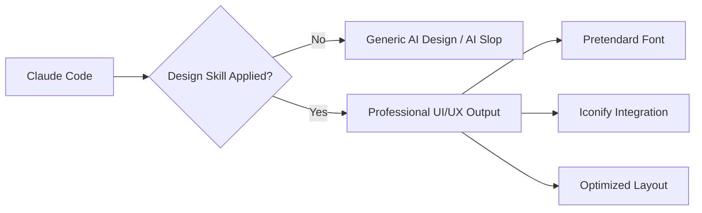
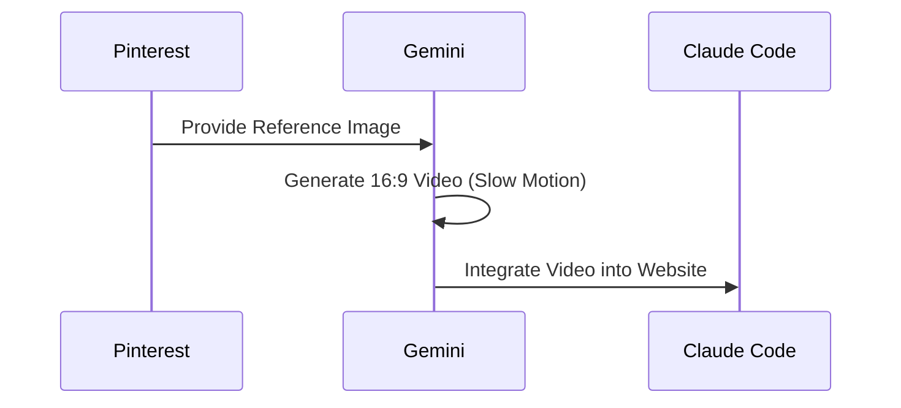

AI가 만든 웹사이트 디자인을 보면 왠지 모를 'AI스러운' 느낌을 받을 때가 많습니다. 어색한 폰트, 보라색 그라데이션, 정돈되지 않은 레이아웃 등 이른바 **AI 슬롭(AI Slop)**이라 불리는 현상인데요. 이번 포스트에서는 클로드 코드(Claude Code)의 잠재력을 200% 끌어올려 전문가 수준의 웹사이트를 제작하는 혁신적인 스킬과 워크플로우를 소개합니다.

<!--more-->

## Sources

*   [클로드 코드로 디자인 뽑아내는 역대급 스킬 발견했습니다. 무료로 배포합니다.](https://youtube.com/watch?v=2sNQ0Nvngdc)

---

## 1. AI 슬롭(AI Slop)이란 무엇인가?

AI가 생성한 디자인이 'AI스럽게' 보이는 현상을 **AI 슬롭(AI Slop)**이라고 합니다. [52.48](https://youtu.be/2sNQ0Nvngdc?t=52)초 부근에서 설명하듯, 보라색 그라데이션이나 못생긴 폰트 조합 등 디자인 퀄리티가 떨어지는 결과물을 의미합니다.

클로드 코드는 강력한 코딩 능력을 갖췄지만, 기본 설정만으로는 시각적으로 뛰어난 결과물을 내는 데 한계가 있었습니다. 이를 해결하기 위해 최근에는 '디자인 지능'을 높여주는 전용 스킬(Skill.md)들이 등장하고 있습니다.

## 2. 수파노바 디자인 스킬(Suphanova Design Skill)

해외 유저들 사이에서 화제가 된 **테이스트 스킬(Taste Skill)**을 기반으로, 한국 현지 상황에 맞춰 커스터마이징된 **수파노바 디자인 스킬**이 핵심 도구입니다. [109.36](https://youtu.be/2sNQ0Nvngdc?t=109)초부터 소개되는 이 스킬의 특징은 다음과 같습니다.

*   **한국어 최적화**: 한글 텍스트가 자연스럽게 배치되도록 조정되었습니다.
*   **프리텐다드(Pretendard) 폰트**: 현대적이고 깔끔한 한국어 폰트를 기본 적용합니다.
*   **아이코니파이(Iconify)**: 디자인 완성도를 높여주는 세련된 아이콘 세트를 활용합니다.
*   **지침(Instructions) 강화**: 클로드 코드가 디자인 최적화된 코드를 짜도록 구체적인 가이드를 제공합니다.

## 3. 웹사이트 제작 워크플로우: 5단계 마스터 플랜

빌더 조쉬가 제안하는 고퀄리티 웹사이트 제작 단계는 다음과 같습니다. [103.52](https://youtu.be/2sNQ0Nvngdc?t=103)초부터 상세한 순서가 나옵니다.

### 1단계: 스킬 파일 준비 및 클로드 코드 실행
먼저 깃허브 등에서 공유된 `Skill.md` 파일 주소를 클로드 코드에 전달합니다. [270.48](https://youtu.be/2sNQ0Nvngdc?t=270)초를 보면, 클로드 코드가 해당 스킬을 학습한 후 "인테리어 업체 웹사이트를 만들어줘"와 같은 요청을 수행하기 시작합니다.

### 2단계: 제미나이(Gemini)를 활용한 영상 소스 생성
디자인의 완성도는 강력한 '히어로 섹션'에서 결정됩니다. 핀터레스트 등에서 마음에 드는 인테리어 레퍼런스 이미지를 찾아 제미나이에게 전달합니다. [343.76](https://youtu.be/2sNQ0Nvngdc?t=343)초에서는 제미나이의 동영상 만들기 도구를 이용해 16:9 비율의 부드러운 화면 이동 영상을 생성하는 과정을 보여줍니다.

### 3단계: 스크롤 애니메이션 구현
생성된 영상을 웹사이트 폴더에 넣고 클로드 코드에게 **"스크롤 애니메이션이 적용되게 해줘"**라고 요청합니다. [471.60](https://youtu.be/2sNQ0Nvngdc?t=471)초를 보면, 영상을 WebP 포맷으로 변환하여 스크롤 방향에 따라 부드럽게 재생되는 인터랙션이 구현되는 것을 확인할 수 있습니다.

### 4단계: 템플릿 및 이미지 교체
기본 구조가 완성되면, 언스플래시(Unsplash) 등의 고해상도 이미지를 배치하고 텍스트를 수정합니다. 필요하다면 수파노바(Suphanova) 등에서 제공하는 전문 템플릿의 HTML 코드를 복사해 클로드 코드에게 전달하여 스타일을 병합할 수도 있습니다. [657.52](https://youtu.be/2sNQ0Nvngdc?t=657)초에서 이를 이용한 다크 모드 전환 예시를 보여줍니다.

### 5단계: 초고속 배포 (Netlify Drop)
완성된 결과물은 클로드 코드에게 **"모든 파일을 Zip 파일로 압축해줘"**라고 명령한 뒤, 생성된 압축 파일을 **Netlify Drop**에 드래그 앤 드롭하기만 하면 즉시 라이브 웹사이트가 됩니다. [764.88](https://youtu.be/2sNQ0Nvngdc?t=764)초부터 배포 과정이 상세히 설명됩니다.

## 핵심 요약

| 단계 | 도구 | 주요 역할 |
| :--- | :--- | :--- |
| **기획 & 코딩** | Claude Code | 웹사이트 구조 및 로직 생성 |
| **디자인 지능** | Suphanova Skill | 디자인 최적화 지침(Pretendard, Iconify 등) 제공 |
| **비주얼 에셋** | Google Gemini | 고품질 비디오 및 이미지 소스 생성 |
| **인터랙션** | WebP Scroll | 스크롤 기반의 부드러운 애니메이션 구현 |
| **배포** | Netlify Drop | Zip 파일 업로드로 즉시 라이브 배포 |

## 결론

클로드 코드라는 강력한 엔진에 **전문가급 디자인 스킬**이라는 날개를 달고, **제미나이**를 통해 고품질 비주얼 에셋을 수급하는 방식은 1인 개발자나 디자이너 없는 팀에게 엄청난 생산성을 제공합니다. 이제 코딩 실력보다 더 중요한 것은 '좋은 결과물을 알아보고 조합하는 안목'이 아닐까요? [903.56](https://youtu.be/2sNQ0Nvngdc?t=903)초에서 언급하듯, 이 모든 과정은 누구나 무료로 시도해 볼 수 있습니다. 지금 바로 여러분만의 전문적인 랜딩 페이지를 만들어 보세요!
