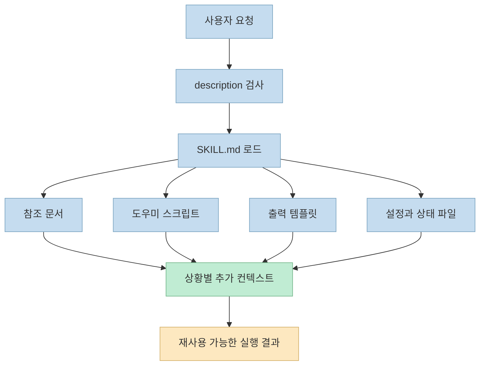
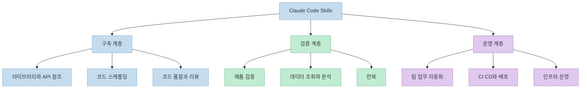
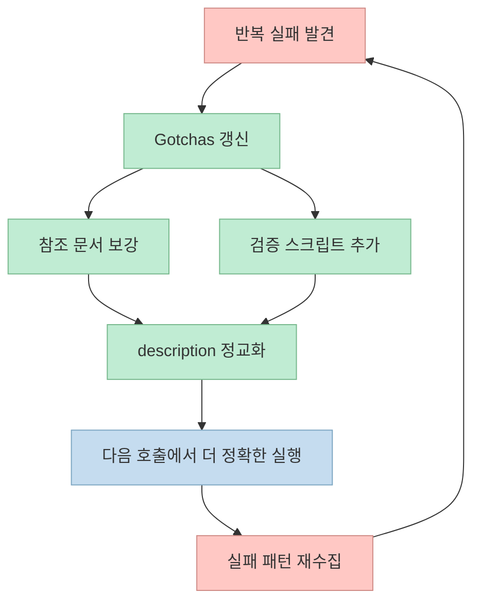
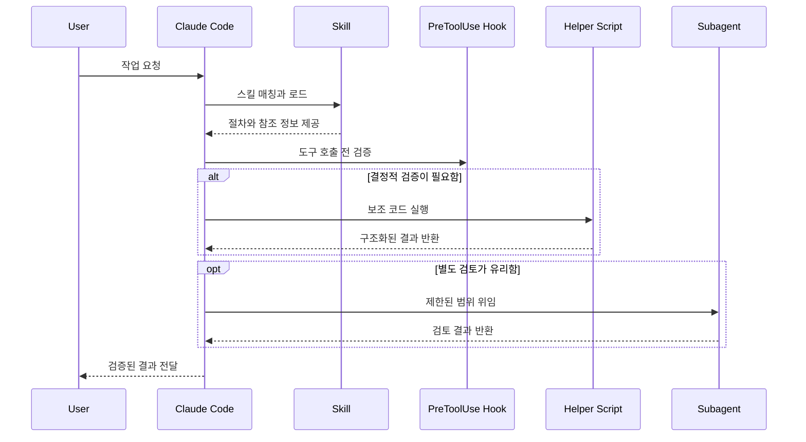

2026년 3월 18일 KST, Anthropic의 Thariq는 X Article "Lessons from Building Claude Code: How We Use Skills"를 공개했습니다. 이 글이 흥미로운 이유는 스킬을 단순한 프롬프트 묶음이나 `SKILL.md` 파일 하나로 설명하지 않고, **지식 배포, 검증 자동화, 컨텍스트 절약, 팀 운영** 을 한데 묶는 계층으로 다루기 때문입니다. 
공식 가이드와 함께 읽어보면 더 선명해집니다. Claude Code에서 스킬은 "좋은 지침"이 아니라, 폴더 구조와 훅, 스크립트, 참조 문서, 상태 저장, 배포 방식까지 포함하는 작은 운영 시스템에 가깝습니다.

<!--more-->

## Sources

- [Thariq, "Lessons from Building Claude Code: How We Use Skills"](https://x.com/trq212/status/2033949937936085378)
- [Anthropic, "The Complete Guide to Building Skills for Claude"](https://resources.anthropic.com/hubfs/The-Complete-Guide-to-Building-Skill-for-Claude.pdf)
- [Anthropic, "Automate workflows with hooks"](https://code.claude.com/docs/en/hooks-guide)
- [Anthropic, "Hooks reference"](https://code.claude.com/docs/en/hooks)
- [Anthropic, "Create custom subagents"](https://code.claude.com/docs/en/sub-agents)

## 스킬은 Markdown 파일이 아니라 실행 가능한 폴더다

Thariq의 글에서 가장 중요한 문장은 스킬이 "just markdown files"가 아니라는 지점입니다. 그는 스킬을 **스크립트, 에셋, 데이터, 훅을 포함할 수 있는 폴더** 로 설명합니다. 이 관점은 Anthropic의 공식 PDF와도 정확히 맞아떨어집니다. 공식 가이드는 스킬의 기본 단위를 `SKILL.md`, `scripts/`, `references/`, `assets/`로 설명하고, 여기에 "progressive disclosure"라는 개념을 붙입니다. 즉, 모든 정보를 한 번에 프롬프트로 밀어 넣는 것이 아니라, 모델이 필요할 때 필요한 파일만 찾아가게 설계하라는 뜻입니다.

이 구조가 중요한 이유는 단순합니다. 프롬프트 한 덩어리는 설명은 할 수 있어도 **검증, 재사용, 상태 유지, 세부 문서 탐색** 을 잘 못합니다. 반대로 폴더는 그 자체로 작은 런타임이 됩니다. 설명은 `SKILL.md`에 두고, 세부 API는 참조 파일로 분리하고, 반복 계산은 스크립트로 위임하고, 출력 템플릿은 에셋으로 고정할 수 있기 때문입니다.

여기서 중요한 설계 포인트는 두 가지입니다. 
첫째, **항상 로드되는 정보와 필요할 때만 읽는 정보를 분리** 해야 합니다. 공식 가이드가 말하는 3단계 구조도 바로 이것입니다. 프런트매터 설명은 "언제 이 스킬을 써야 하는지"만 알려주고, 본문은 실제 절차를 담고, 링크된 파일은 세부 사항을 맡습니다. 
둘째, 스킬은 Claude를 묶어두는 족쇄가 아니라 **Claude가 더 정확하게 움직이게 만드는 환경** 이어야 합니다. 그래서 뒤에서 다시 보겠지만, 좋은 스킬은 대개 "정답 문장"보다 "실패하기 쉬운 지점"과 "검증 방법"을 더 많이 담습니다.

## Anthropic이 실사용에서 정리한 9가지 스킬 유형

Thariq는 Anthropic 내부에서 스킬을 카탈로그화해 보니 반복적으로 등장하는 아홉 가지 유형이 있었다고 정리합니다. "수백 개가 활발히 쓰이고 있다"는 수치 자체는 원문 글의 단일 진술이지만, 어떤 유형이 고가치인지에 대한 분류는 상당히 설득력이 있습니다. 공통점은 모두 **팀의 반복 비용을 줄이거나 실패 비용을 줄이는 방향** 으로 설계된다는 점입니다.

이 아홉 가지를 실제 팀 관점으로 번역하면 다음과 같습니다.

1. 라이브러리와 API 참조: Claude가 자주 틀리는 내부 SDK, CLI, 디자인 시스템 사용법을 고정합니다.
2. 제품 검증: Playwright, tmux 같은 도구를 붙여 "작동한다"를 실제로 확인하게 합니다.
3. 데이터 조회와 분석: 대시보드 ID, 조인 키, 데이터 소스 위치처럼 모델이 외우기 어려운 운영 지식을 묶습니다.
4. 팀 업무 자동화: 스탠드업, 티켓 생성, 주간 요약처럼 사람마다 다르게 하던 반복 업무를 표준화합니다.
5. 코드 스캐폴딩: 보일러플레이트와 자연어 요구사항이 섞인 생성 작업을 안정화합니다.
6. 코드 품질과 리뷰: 리뷰 기준, 테스트 습관, 스타일 강제를 자동화합니다.
7. CI/CD와 배포: flaky CI 재시도, smoke test, 롤백 판단처럼 절차가 긴 작업을 묶습니다.
8. 런북: 장애 증상에서 조사 순서와 보고 형식까지 연결합니다.
9. 인프라 운영: 삭제나 정리 같은 파괴적 작업에 가드레일을 씌웁니다.

여기서 핵심은 "스킬 = 기능 추가"가 아니라는 점입니다. Anthropic이 제안하는 스킬은 대부분 새 능력을 만드는 것이 아니라, **이미 있는 도구를 조직 맥락에 맞게 안전하고 일관되게 쓰게 만드는 것** 입니다. 그래서 고가치 스킬의 중심에는 거의 항상 검증, 가드레일, 템플릿, 참조 지식이 들어갑니다.

## 좋은 스킬은 Gotchas와 점진적 공개로 품질을 만든다

원문에서 가장 실무적인 조언은 "Don’t State the Obvious"와 "Build a Gotchas Section"입니다. Claude Code는 이미 일반적인 코딩 상식과 흔한 도구 사용법을 많이 알고 있습니다. 따라서 스킬에 상식만 복붙하면 토큰만 늘고 행동은 거의 달라지지 않습니다. 반대로 조직 안에서 자주 터지는 실수, 내부 규칙, 실패 패턴, 엣지 케이스를 넣으면 모델의 기본 행동이 실제로 바뀝니다.

공식 가이드도 같은 방향을 강조합니다. `description`은 요약문이 아니라 **언제 이 스킬을 트리거해야 하는지 모델에게 알려주는 조건문** 에 가깝고, 세부 문서는 `references/`로 빼서 과적재를 피하라고 설명합니다. 다시 말해, 좋은 스킬은 "무엇을 할지"만 지시하지 않고 "언제 켜질지", "어디를 더 읽을지", "무엇에서 자주 실패하는지"를 함께 설계합니다.

이 관점에서 보면 원문이 말하는 "Avoid Railroading Claude"도 자연스럽게 이해됩니다. 스킬은 Claude를 수동 스크립트 엔진으로 만들면 안 됩니다. 너무 빡빡하게 고정하면 예외 상황에서 오히려 품질이 떨어집니다. 따라서 좋은 스킬은 다음 균형을 잡습니다.

- 규칙은 강하게, 경로는 유연하게 둡니다.
- 검증은 결정적으로, 생성은 적응적으로 둡니다.
- 공통 절차는 템플릿으로, 상황 판단은 모델에 맡깁니다.

이 균형이 무너지면 두 가지 실패가 나옵니다. 하나는 under-triggering입니다. 스킬이 필요한데 안 켜지는 경우입니다. 다른 하나는 over-triggering입니다. 상관없는 요청에도 스킬이 끼어드는 경우입니다. 공식 가이드가 description 개선, 부정 트리거 추가, 테스트 시나리오 설계를 반복해서 강조하는 이유가 바로 여기 있습니다.

## 운영 레이어는 스크립트, 훅, 서브에이전트가 함께 만든다

원문은 좋은 스킬이 단순한 설명서를 넘어 **실행 코드와 검증 루프를 같이 제공** 해야 한다고 봅니다. 데이터 분석 스킬에 helper function을 넣어두고, Claude가 그 함수를 조합해 추가 스크립트를 생성하게 하라는 대목이 대표적입니다. 이것은 모델에게 모든 것을 매번 재구성시키지 말고, 반복되는 계산과 검증을 코드로 밀어 넣으라는 뜻입니다.

Hooks도 같은 맥락입니다. 원문은 on-demand hooks를 예로 들며 `/careful`, `/freeze` 같은 스킬을 소개합니다. 공식 hooks 문서는 `PreToolUse` 훅이 실제로 도구 호출을 allow, deny, ask 하거나 입력을 수정할 수 있다고 설명합니다. 즉, 스킬이 단순히 "rm -rf를 조심해"라고 말하는 수준을 넘어서, **실제로 위험한 호출을 막는 계층** 이 될 수 있다는 뜻입니다.

또 하나 흥미로운 지점은 코드 리뷰 유형 스킬에서 fresh-eyes subagent를 호출한다는 예시입니다. 공식 subagents 문서도 서브에이전트를 별도 컨텍스트 창과 독립 권한을 가진 전문 도우미로 설명합니다. 이 조합은 중요합니다. 스킬이 "이런 상황에서는 별도 리뷰 에이전트를 부르라"는 운영 절차를 제공하고, 서브에이전트는 그 절차를 실행하는 역할을 맡을 수 있기 때문입니다.

원문이 `${CLAUDE_PLUGIN_DATA}` 같은 안정적 저장 위치를 언급하는 것도 같은 흐름입니다. 스킬에 로그, JSON, SQLite 같은 형태의 메모리를 둘 수 있지만, 업그레이드 시 스킬 폴더 자체는 교체될 수 있으니 **지속 상태는 별도 안정 경로에 저장** 하라는 조언입니다. 이 부분은 이번 글의 단일 출처 주장으로 봐야 하지만, 방향 자체는 타당합니다. 상태와 버전을 분리하지 않으면 스킬은 점점 "반복 실행 가능한 도구"가 아니라 "한 번 쓰고 사라지는 텍스트"가 되기 쉽습니다.

## 배포 모델은 리포지토리 공유에서 조직 단위 배포로 확장된다

원문은 스킬 배포를 두 갈래로 설명합니다. 작은 팀은 저장소 안에 스킬을 체크인하는 방식이 잘 맞고, 팀과 저장소 수가 커질수록 마켓플레이스 형태가 유리하다는 것입니다. 이유도 현실적입니다. 저장소에 체크인된 스킬은 공유는 쉽지만, 설치된 스킬이 많아질수록 모델 컨텍스트에 부담을 줍니다.

공식 PDF는 이 그림을 더 구체화합니다. 2026년 1월 기준 배포 모델로 개인 사용자는 스킬 폴더를 다운로드해 Claude.ai에 업로드하거나 Claude Code 스킬 디렉터리에 둘 수 있고, 조직 단위로는 2025년 12월 18일에 workspace-wide 배포가 출시됐다고 적고 있습니다. 같은 문서에서 Skills를 오픈 표준으로 설명하고, API 경로와 `container.skills` 같은 프로그램적 사용 경로도 안내합니다.

정리하면 배포 모델은 이렇게 읽는 것이 좋습니다.

1. 초기 단계: 저장소 내부 공유로 빠르게 실험합니다.
2. 검증 단계: 샌드박스나 팀 내부에서 traction을 봅니다.
3. 확산 단계: 조직 배포나 마켓플레이스 형태로 승격합니다.
4. 자동화 단계: API, hooks, 서브에이전트와 결합해 운영 시스템으로 붙입니다.

즉, 스킬은 개인 생산성 팁으로 출발할 수 있지만, 잘 다듬으면 팀 표준과 운영 플랫폼의 일부가 됩니다.

## 실전 적용 포인트

- 첫 스킬은 "새 능력"보다 "반복 실패가 많은 업무"에서 고르세요. 검증, 런북, 내부 CLI, 데이터 조회가 가장 빠르게 효과가 납니다.
- `SKILL.md`에 모든 것을 쓰지 말고, 설명과 절차만 남기고 세부 문서는 참조 파일로 빼세요. 컨텍스트 비용이 바로 줄어듭니다.
- 스킬의 핵심 섹션은 사용법보다 Gotchas입니다. 모델이 실제로 틀렸던 사례를 계속 누적해야 품질이 오릅니다.
- 가능하면 자연어 지시 대신 스크립트와 훅으로 결정적 검증을 넣으세요. 특히 `PreToolUse`는 가드레일을 코드로 강제하기 좋습니다.
- 측정 없이는 스킬 품질을 판단하기 어렵습니다. under-triggering, over-triggering, 인기 없는 스킬, 실패율을 로그로 남겨야 합니다.

## 핵심 요약

- Anthropic의 현장 글이 보여주는 핵심은 `skills = prompt pack`이 아니라 `skills = operating layer`라는 점입니다.
- 고가치 스킬은 대개 참조 지식, 검증 절차, 가드레일, 템플릿, 운영 로그를 함께 가집니다.
- 좋은 스킬의 품질은 화려한 설명보다 Gotchas, progressive disclosure, trigger description에서 결정됩니다.
- hooks와 subagents를 붙이면 스킬은 문서가 아니라 실제 실행 정책이 됩니다.
- 배포는 저장소 공유에서 시작해 조직 단위 배포와 API 사용으로 확장될 수 있습니다.

## 결론

Claude Code Skills를 제대로 이해하려면 "프롬프트를 잘 쓰는 법"이 아니라 "팀의 지식과 절차를 어떤 단위로 운영 체계화할 것인가"를 질문해야 합니다. Thariq의 글은 바로 그 전환점을 보여줍니다. 
작게 시작하는 방법도 명확합니다. 가장 자주 실패하는 작업 하나를 고르고, Gotchas를 적고, 참조 파일을 분리하고, 검증 스크립트 하나를 붙이세요. 그 순간부터 스킬은 문서가 아니라 팀의 실행 품질을 올리는 인프라가 됩니다.
