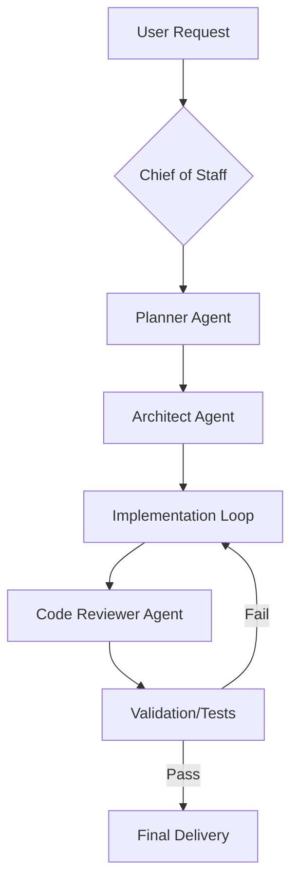
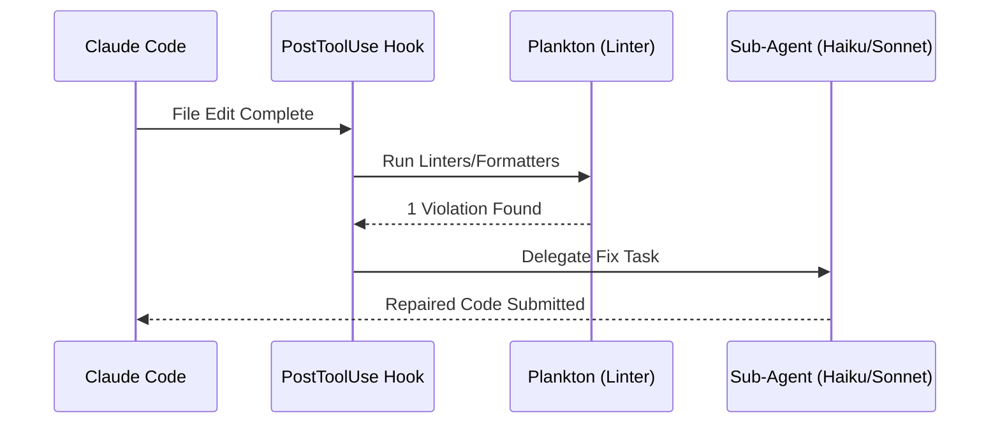

Anthropic의 CLI 에이전트인 **Claude Code**는 그 자체로도 강력하지만, 이를 실제 프로덕션 수준의 개발 워크플로우에 통합하기 위해서는 정교한 설정과 관리가 필요합니다. 오늘 소개할 **Everything Claude Code (ECC)**는 단순한 설정 모음을 넘어, AI 에이전트를 고성능 자율 개발팀으로 변모시키는 포괄적인 최적화 시스템입니다.

<!--more-->

### Sources
*   [GitHub - affaan-m/everything-claude-code](https://github.com/affaan-m/everything-claude-code) (Primary Source)

---

### 1. Anthropic 해커톤 우승의 주역, Everything Claude Code (ECC)

**Everything Claude Code (ECC)**는 2025년 9월에 열린 'Anthropic x Forum Ventures 해커톤'의 우승자인 Affaan Mustafa(@affaan-m)가 공개한 오픈소스 프로젝트입니다. 그는 이 시스템을 사용하여 단 8시간 만에 완제품인 `zenith.chat`을 빌드하며 1위를 차지했습니다.

이 프로젝트의 핵심은 Claude Code를 단순히 '채팅하는 AI'가 아닌, **'작업을 이해하고 스스로 검증하며 진화하는 시스템'**으로 대하는 데 있습니다. 실제 데이터에 따르면 ECC 시스템을 적용했을 때 다음과 같은 놀라운 생산성 향상을 보였습니다.

*   **기능 완성 속도 65% 향상** (Baseline 대비)
*   **코드 리뷰 이슈 75% 감소** (PR당 평균 12.3개 -> 3.1개)
*   **테스트 커버리지 34% 증가** (평균 82% 달성)

---

### 2. ECC의 3대 핵심 기둥: 에이전트, 스킬, 그리고 훅(Hooks)

ECC는 복잡한 개발 작업을 처리하기 위해 계층화된 아키텍처를 채택하고 있습니다.

#### 2.1 28개의 전문 서브 에이전트 (Specialized Agents)
ECC는 하나의 거대한 컨텍스트를 유지하는 대신, 특정 도메인에 특화된 **28개의 서브 에이전트**에게 작업을 위임합니다. 이는 '컨텍스트 부패(Context Rot)'를 방지하고 정확도를 높이는 핵심 전략입니다.

*   `planner.md`: 기능 구현을 위한 청사진 설계
*   `architect.md`: 시스템 설계 및 아키텍처 결정
*   `code-reviewer.md`: 품질 및 보안 리뷰 전문
*   `build-error-resolver.md`: 컴파일 및 빌드 에러 해결 전담

#### 2.2 116개 이상의 도메인 스킬 (Skills)
스킬은 에이전트가 실행할 수 있는 **정의된 워크플로우**입니다. 단순한 텍스트 가이드가 아니라, 특정 도구(Tool)를 어떻게 조합하여 목표를 달성할지에 대한 구체적인 '행동 지침'입니다.
*   **TDD 워크플로우**: 실패하는 테스트 작성 -> 최소 구현 -> 리팩토링 -> 검증
*   **보안 체크리스트**: OWASP Top 10 기반의 자동화된 보안 검사
*   **연속 학습(Continuous Learning)**: 세션 중 발견된 패턴을 자동으로 추출하여 새로운 스킬로 진화

#### 2.3 자동화의 심장: Lifecycle Hooks
ECC의 가장 강력한 기능 중 하나는 **훅(Hooks)** 시스템입니다. 사용자가 직접 명령하지 않아도 특정 시점에 자동으로 실행되는 스크립트입니다.
*   `PreToolUse`: AI가 도구를 사용하기 전에 보안 위반이나 금지된 패턴(예: `.env` 파일 접근)을 검사
*   `PostToolUse`: 코드가 수정된 직후 자동으로 린팅(Linting)과 타입 체크 실행
*   `Stop`: 세션이 종료될 때 세션 요약 및 학습된 패턴을 저장

---

### 3. 보안과 품질의 수호자: AgentShield & Plankton

에이전트가 코드를 직접 수정하는 환경에서는 보안과 품질 관리가 매우 중요합니다. ECC는 이를 위해 두 가지 전용 도구를 통합했습니다.

#### AgentShield: 에이전틱 취약점 스캐너
Affaan Mustafa가 직접 개발한 **AgentShield**는 AI 에이전트의 설정을 스캔하여 보안 허점을 찾아냅니다. 1,282개의 테스트와 102개의 규칙을 기반으로 프롬프트 인젝션 위험, 위험한 도구 권한, 비밀번호 노출 등을 감시합니다.

#### Plankton: 쓰기 시점(Write-time) 품질 강제
Alex Fazio(@alxfazio)가 개발한 **Plankton**은 AI가 파일을 저장하는 순간 Ruff나 Biome 같은 초고속 린터를 실행합니다. AI가 실수를 하면 즉시 하위 프로세스를 실행하여 코드를 수정하도록 강제함으로써, 메인 에이전트의 컨텍스트를 품질 유지에 소모하지 않게 합니다.

---

### 4. 크로스 플랫폼 지원 및 토큰 최적화

ECC는 단순한 Claude Code용 설정을 넘어 **Cursor, Codex, OpenCode, Antigravity** 등 현존하는 거의 모든 주요 AI 코딩 harness를 지원합니다.

특히 비용 효율성을 위해 다음과 같은 **토큰 최적화 전략**을 제공합니다.

1.  **지능형 모델 라우팅**: 기본 작업은 Sonnet 3.5/3.7로 처리하고, 깊은 아키텍처 설계나 디버깅에만 Opus를 호출합니다.
2.  **전략적 압축 (Strategic Compaction)**: 단순한 자동 압축이 아닌, '리서치 완료 시점', '마일스톤 달성 시점' 등 논리적인 단계에서 컨텍스트를 압축하여 품질 저하를 막습니다.
3.  **Haiku 서브에이전트**: 린트 수정이나 문서 업데이트 같은 단순 반복 작업은 저렴한 Haiku 모델에게 위임합니다.

---

### 핵심 요약 (Key Summary)

1.  **검증된 시스템**: Anthropic 해커톤 우승자가 10개월간 실무에서 다듬은 성능 최적화 프레임워크입니다.
2.  **자율성 극대화**: 28개의 전문 에이전트와 훅 시스템을 통해 AI가 스스로 품질을 검증하고 보안을 지킵니다.
3.  **전방위적 지원**: Claude Code뿐만 아니라 Cursor, Codex 등 다양한 AI 도구에서 동일한 고성능 워크플로우를 사용할 수 있습니다.
4.  **효율적 운영**: 토큰 소모를 최소화하면서도 생산성을 65% 이상 향상시키는 최적의 모델 운영 전략을 포함합니다.

---

### 결론 (Conclusion)

Everything Claude Code는 AI 에이전트를 사용하는 방식의 패러다임을 바꿉니다. 더 이상 AI에게 "이거 해줘"라고 말하는 것이 아니라, AI 에이전트들이 유기적으로 협력하고 자동화된 가드레일 내에서 안전하게 작동하는 **'에이전틱 OS'**를 구축하는 것입니다.

Claude Code를 통해 진정한 생산성 혁명을 경험하고 싶다면, ECC는 선택이 아닌 필수적인 도구입니다. 지금 바로 GitHub에서 ECC를 경험해 보세요.
