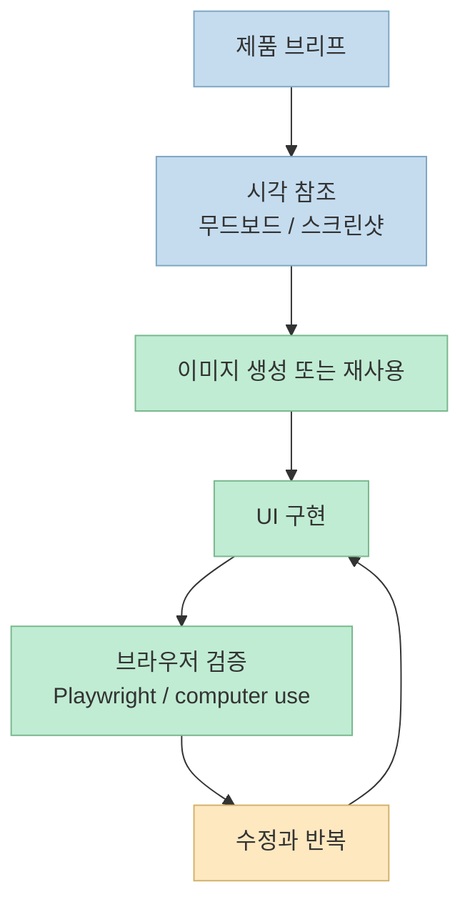
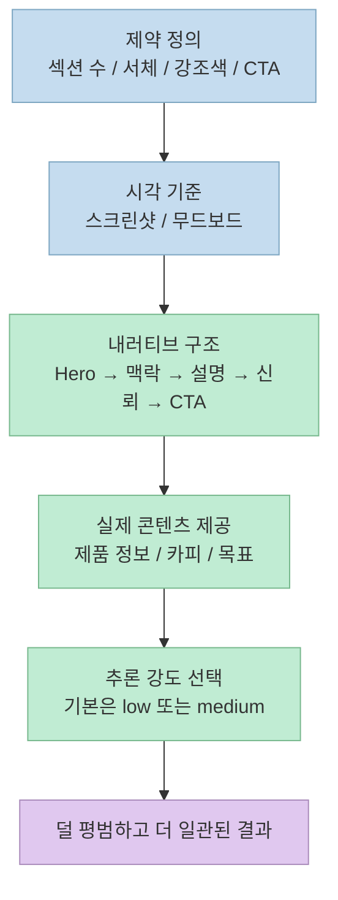
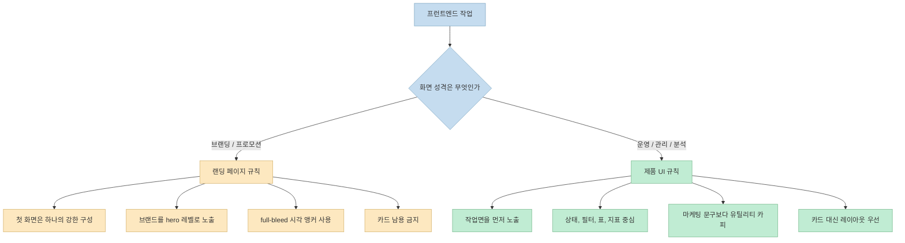
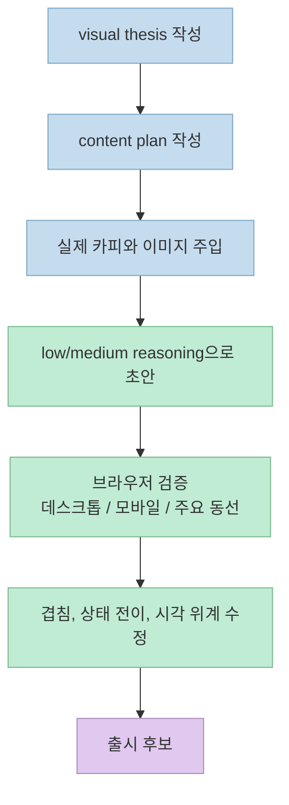

2026년 3월 20일 OpenAI Developers에 올라온 `Designing delightful frontends with GPT-5.4` 의 핵심은 단순히 "GPT-5.4가 더 예쁜 화면을 만든다"가 아닙니다. 더 정확히는, GPT-5.4는 **이미지를 보고 판단하고, UI를 구현하고, 다시 실행해 검증하는 루프** 가 이전보다 훨씬 자연스러워졌고, 그 루프를 살리는 프롬프트 구조가 따로 있다는 이야기입니다.

이 글은 같은 달 3월 5일 공개된 `Introducing GPT-5.4` 와 함께 읽으면서, OpenAI가 왜 시각 참조, 디자인 제약, 낮은 reasoning, 실제 콘텐츠, Playwright 검증을 한 세트로 묶어 이야기하는지 정리합니다. 포인트는 "길게 지시하면 잘 만든다"가 아니라, **좋은 프런트엔드가 나오도록 작업면 자체를 설계하는 것** 입니다.

<!--more-->

## Sources

- Input: [Designing delightful frontends with GPT-5.4 - OpenAI Developers (2026.03.20)](https://developers.openai.com/blog/designing-delightful-frontends-with-gpt-5-4)
- Verified: [Introducing GPT-5.4 - OpenAI (2026.03.05)](https://openai.com/index/introducing-gpt-5-4/)

## GPT-5.4가 프런트엔드에서 달라진 세 가지 축

OpenAI의 디자인 글은 GPT-5.4를 이전 모델보다 더 나은 웹 개발자로 설명합니다. 근거는 세 가지입니다. 첫째, 이미지 이해가 좋아졌고, 둘째, 앱과 웹사이트를 더 완결된 형태로 만들며, 셋째, 자기 결과물을 검사하고 고치는 도구 사용이 강해졌다는 점입니다. 이 셋이 함께 올라가야 프런트엔드 산출물이 "그럴듯한 스크린샷"에서 "실제로 동작하는 화면" 쪽으로 이동합니다.

공식 출시 글을 같이 보면 이 설명은 감상 수준이 아닙니다. OpenAI는 GPT-5.4를 범용 계열에서 처음으로 네이티브 컴퓨터 사용 능력을 갖춘 모델로 소개했고, OSWorld-Verified 75.0%, WebArena-Verified 67.3%, MMMU-Pro 81.2% 같은 수치를 함께 제시했습니다. 즉 스크린샷 기반 인식, 브라우저 상호작용, 시각적 판단이 모두 프런트엔드 작업과 직접 연결되는 수준으로 올라왔다는 뜻입니다.



디자인 글이 이미지 도구를 강조하는 이유도 여기에 있습니다. 모델이 처음부터 정답 이미지를 알고 있는 것이 아니라, 무드보드나 레퍼런스를 통해 분위기, 색감, 구도, 타이포 리듬을 잡고, 필요하면 이미지를 새로 만들거나 기존 이미지를 재사용하면서 화면을 구체화해야 하기 때문입니다. 시각적으로 판단할 수 있는 능력과 그 판단을 다시 구현으로 연결하는 능력이 같이 있어야 결과가 좋아집니다.

Playwright가 유독 자주 언급되는 것도 같은 맥락입니다. OpenAI는 GPT-5.4가 화면을 직접 살펴보고 여러 뷰포트를 확인하며 상태나 내비게이션 문제를 찾아낼 수 있을 때 더 polished한 결과가 나온다고 설명합니다. 프런트엔드에서 마지막 20% 품질은 코드 생성보다 검증에서 갈리는 경우가 많기 때문에, 이건 부가 기능이 아니라 핵심 작업 루프에 가깝습니다.

## 긴 프롬프트보다 먼저 필요한 것은 제약과 기준이다

이 글에서 가장 중요한 문제 정의는 따로 있습니다. 프롬프트가 모호하면 모델은 학습 데이터에서 많이 본 패턴으로 돌아간다는 점입니다. 그 패턴에는 검증된 관습도 있지만, 너무 자주 노출된 탓에 식상해진 구조도 많습니다. 그래서 결과는 기능적으로 그럴듯해 보여도, 시각 위계가 약하고 브랜드 존재감이 흐리며, 섹션마다 비슷한 카드가 반복되는 평범한 화면으로 떨어지기 쉽습니다.

그래서 OpenAI가 먼저 넣으라고 하는 것은 추상적인 미감 표현이 아니라 **제약값** 입니다. 예를 들어 H1은 하나, 섹션 수는 여섯 개 이하, 서체는 최대 두 종류, 강조색은 하나, fold 위의 주요 CTA는 하나처럼 화면의 예산부터 고정합니다. 이렇게 해야 모델이 컴포넌트를 계속 늘리는 대신, 첫 화면에서 무엇을 가장 크게 보여 줄지 먼저 결정하게 됩니다.



시각 참조를 붙이라는 조언도 같은 이유로 실무적입니다. 스크린샷이나 무드보드는 "예쁘게 해 줘"보다 훨씬 강한 가드레일입니다. 모델은 여기서 레이아웃 리듬, 타이포 스케일, 간격 체계, 이미지 처리 방식을 읽어 냅니다. 그래서 바로 구현으로 들어가기보다, 먼저 시각 방향 2~3개나 무드보드를 제안하게 한 뒤 하나를 선택하는 과정이 오히려 시간을 아껴 줍니다.

또 하나 흥미로운 포인트는 reasoning을 무조건 올리지 말라는 조언입니다. OpenAI는 단순한 웹사이트라면 low나 medium reasoning이 오히려 더 강한 결과를 내는 경우가 많다고 적습니다. 추론이 길어질수록 더 깊어지는 것이 아니라, 불필요한 장식과 과설계가 늘어나는 경우가 있기 때문입니다. 즉 프런트엔드는 "더 많이 생각하기"보다 "더 일관된 제약 안에서 생각하기"가 중요합니다.

디자인 시스템을 초반에 선언하라는 조언도 눈여겨볼 만합니다. 배경, 표면, 본문 텍스트, 약한 텍스트, 강조색 같은 토큰과 display/headline/body/caption 역할을 먼저 정해 두면, 모델이 섹션을 늘리더라도 같은 문법 안에서 움직이게 됩니다. 글에서는 React와 Tailwind 조합을 실전 기본값으로 권장하지만, 핵심은 특정 스택보다도 **토큰과 역할을 먼저 정의하는 운영 방식** 입니다.

아래 템플릿은 글의 내용을 한국어 실무형으로 다시 묶은 것입니다.

```text
당신은 프런트엔드 디자이너이자 구현자다.
목표는 화려한 데모가 아니라 실제로 읽히고 동작하는 화면이다.

제약:
- 첫 화면은 한 장의 포스터처럼 읽히게 할 것
- 브랜드나 제품 이름이 첫 시선에 들어오게 할 것
- 서체는 2종 이하, 강조색은 1개만 쓸 것
- 첫 화면에는 핵심 문장 1개, 보조 문장 1개, CTA 1묶음만 둘 것
- 데스크톱과 모바일에서 겹치는 고정 요소를 만들지 말 것

입력 자료:
- 제품 설명
- 실제 카피
- 참고 스크린샷 또는 무드보드

작업 순서:
1. 시각 방향 2~3개 제안
2. 선택된 방향으로 디자인 토큰 정의
3. 화면 구현
4. 여러 뷰포트에서 검증 후 수정
```

## Frontend Skill이 강제하는 것은 화려함이 아니라 구조적 취향이다

글 후반부의 실질적인 결론은 OpenAI가 공개한 `frontend-skill` 에 있습니다. 이 스킬의 목적은 모델이 더 많은 컴포넌트를 만들게 하는 것이 아니라, art direction, hierarchy, restraint, imagery, motion 같은 기준을 모델 내부의 기본 습관으로 밀어 넣는 데 있습니다. 쉽게 말해 "멋져 보여라"가 아니라 "왜 이 화면이 지금 이런 구조여야 하는지"를 먼저 강제하는 규칙집입니다.

마케팅 랜딩 페이지와 운영용 제품 UI를 같은 규칙으로 만들면 결과가 금방 어긋납니다. 그래서 이 스킬은 두 경우를 분리합니다. 랜딩 페이지에서는 첫 화면을 한 장의 강한 구성으로 보고, 브랜드 존재감과 큰 시각 앵커, 넓게 쓰는 히어로 영역, 짧은 카피를 요구합니다. 반대로 대시보드나 관리 도구에서는 영웅적인 카피를 줄이고, 지표, 상태, 필터, 표 같은 실제 작업면을 먼저 보여 주라고 합니다.



여기서 특히 실무적인 규칙은 카드를 기본값으로 두지 말라는 부분입니다. 이건 카드 자체가 나쁘다는 뜻이 아니라, border, shadow, radius를 걷어내도 상호작용과 이해가 유지되는 요소라면 굳이 카드일 필요가 없다는 뜻입니다. 많은 AI 산출물이 섹션마다 카드 하나씩 놓는 방식으로 급속히 평범해지는 이유를 정확히 찌르는 규칙입니다.

이미지와 모션에 대한 기준도 의외로 절제되어 있습니다. 이미지는 장식이 아니라 서사를 밀어 주는 역할을 해야 하고, 텍스트와 경쟁하지 않아야 합니다. 모션도 화면 전체를 흔드는 효과보다, 진입 애니메이션 하나, 스크롤 기반 깊이 변화 하나, hover나 reveal 하나처럼 존재감과 위계를 살리는 2~3개의 움직임이면 충분하다고 봅니다. 즉 이 스킬은 화려함의 증폭기가 아니라, 과잉을 깎아 내는 편집기 쪽에 가깝습니다.

다만 이것은 보편적인 UI 교과서라기보다 OpenAI가 GPT-5.4를 더 안정적으로 다루기 위해 정리한 single-source guidance라는 점도 같이 봐야 합니다. 그럼에도 모델이 흔한 카드 그리드, 약한 브랜딩, 바쁜 히어로, 목적이 겹치는 섹션으로 미끄러지는 패턴을 줄이는 데는 꽤 유용한 기준입니다.

## 실전 적용 포인트

OpenAI의 두 글을 같이 읽고 나면, GPT-5.4 프런트엔드 작업은 결국 "프롬프트를 길게 쓰는 기술"보다 **작업 루프를 설계하는 기술** 이라는 점이 선명해집니다. 실무에서는 아래 흐름이 가장 재현성이 높습니다.



먼저 한 문장짜리 `visual thesis` 를 씁니다. 이 단계는 그냥 분위기 메모가 아니라, 재질감, 에너지, 무드, 밀도를 한 줄로 고정하는 일입니다. 그 다음 `content plan` 으로 Hero, 맥락, 설명, 신뢰, 마지막 CTA를 먼저 배치합니다. 이렇게 해야 모델이 섹션을 이유 없이 늘리거나, 첫 화면에 너무 많은 정보를 욱여넣지 않습니다.

세 번째는 실제 카피와 실제 이미지입니다. 글에서도 실제 제품 설명이나 프로젝트 목표를 주면 모델이 더 그럴듯한 구조와 문장을 고른다고 설명하는데, 이 조언은 특히 중요합니다. placeholder 텍스트가 많을수록 모델은 페이지의 목적보다 형식을 더 많이 모방하게 됩니다.

네 번째는 reasoning 기본값입니다. 간단한 브랜딩 페이지나 홍보 페이지는 low나 medium에서 시작하고, 복잡한 상호작용이나 게임성, 긴 작업 흐름이 있을 때만 reasoning을 올리는 편이 낫습니다. 복잡도를 필요 이상으로 먼저 올리면, 모델은 종종 레이아웃보다 장식과 요소 수를 늘리는 방식으로 "열심히 한 티"를 냅니다.

마지막은 브라우저 검증입니다. Playwright 같은 도구를 붙여 데스크톱, 모바일, 주요 동선, 상태 변화, 고정 요소 겹침을 직접 확인하게 해야 합니다. 이 단계가 없으면 산출물은 디자인 목업처럼 보일 수는 있어도, 실제 사용 환경에서 금방 허점이 드러납니다.

## 핵심 요약

- GPT-5.4의 프런트엔드 품질 향상은 이미지 이해, 더 완결된 기능 구현, 자기검증 도구 사용이 함께 올라간 결과로 보는 편이 정확합니다.
- 좋은 결과는 긴 프롬프트보다도 명확한 제약, 시각 참조, 실제 콘텐츠, 낮은 reasoning 기본값에서 더 자주 나옵니다.
- OpenAI가 공개한 `frontend-skill` 의 핵심은 화려함이 아니라 구조적 취향과 절제된 화면 문법을 강제하는 데 있습니다.
- 랜딩 페이지와 운영용 제품 UI는 같은 미학으로 만들면 안 되며, 특히 후자는 유틸리티 카피와 작업면 중심 구조가 더 중요합니다.
- 최종 품질은 코드 생성 단계보다 검증 단계에서 갈리는 경우가 많으므로, Playwright 같은 브라우저 확인 도구를 반드시 붙이는 편이 좋습니다.

## 결론

2026년 3월 20일 OpenAI Developers 글은 GPT-5.4를 "더 예쁜 UI를 그리는 모델"로 소개하지만, 실제 메시지는 더 실무적입니다. **좋은 프런트엔드는 모델의 취향이 아니라 작업 루프의 설계에서 나온다** 는 것입니다.<br>
시각 참조를 먼저 주고, 제약을 분명히 하고, 실제 콘텐츠를 넣고, 낮은 reasoning에서 시작하고, 마지막에 브라우저로 검증하는 흐름을 만들 수 있다면 GPT-5.4는 확실히 이전보다 강한 프런트엔드 파트너가 됩니다.
