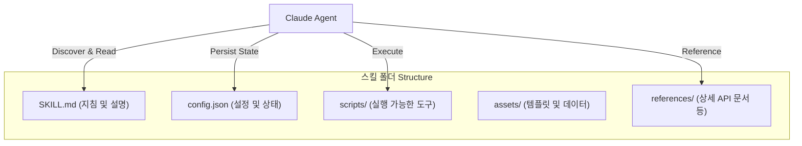
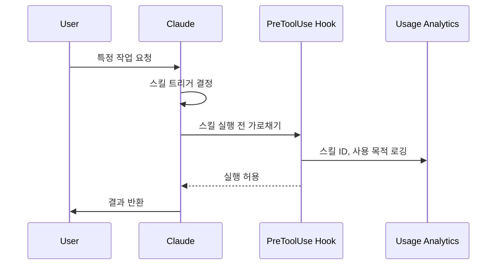

Claude Code에서 '스킬(Skills)'은 가장 강력한 확장 포인트 중 하나입니다. Anthropic 내부에서는 이미 수백 개의 스킬이 활발하게 사용되고 있으며, 이를 통해 개발 속도를 획기적으로 가속화하고 있습니다. 하지만 스킬의 유연성이 높다 보니, 어떤 종류의 스킬을 만들어야 할지, 어떻게 작성하는 것이 가장 효과적일지 파악하기 어려울 때가 많습니다.
<!--more-->

이 글에서는 Anthropic의 Thariq(@trq212)이 공유한 Claude Code 구축 레슨을 바탕으로, 스킬을 설계하고 배포하며 관리하는 최선의 방법들을 상세히 살펴봅니다.

## Sources

* https://x.com/i/status/2033949937936085378

## 스킬(Skills)이란 무엇인가?

많은 사용자가 스킬을 "단순한 마크다운 파일"로 오해하곤 합니다. 하지만 스킬의 진정한 가치는 그것이 **폴더 구조**라는 점에 있습니다.

스킬 폴더에는 마크다운 설명 파일뿐만 아니라 스크립트, 자산(Assets), 데이터 파일 등이 포함될 수 있으며, 에이전트(Claude)는 이 구조를 스스로 탐색하고 조작할 수 있습니다. 또한, 동적 훅(Dynamic Hooks) 등록을 포함한 다양한 설정 옵션을 통해 에이전트의 동작을 정교하게 제어할 수 있습니다.

## 스킬의 9가지 주요 카테고리

Anthropic 팀은 내부적으로 사용되는 수많은 스킬을 분석하여 다음과 같은 9가지 카테고리로 분류했습니다.

### 1. 라이브러리 및 API 참조 (Library & API Reference)
내부 라이브러리나 CLI, SDK 사용법을 설명합니다. Claude가 실수하기 쉬운 'Gotchas(주의사항)'와 참조 코드 스니펫을 포함하여 코드 작성의 정확도를 높입니다.
*   **예시**: 내부 결제 라이브러리(billing-lib), 디자인 시스템 가이드.

### 2. 제품 검증 (Product Verification)
작성한 코드가 실제로 작동하는지 테스트하고 검증하는 방법을 정의합니다. Playwright나 tmux 같은 외부 도구와 결합하여 사용됩니다.
*   **예시**: 회원가입 플로우 드라이버, Stripe 테스트 카드를 활용한 결제 검증기.

### 3. 데이터 수집 및 분석 (Data Fetching & Analysis)
데이터 및 모니터링 스택에 연결하여 대시보드 ID 조회, 로그 분석 등을 수행합니다.
*   **예시**: 전환율 쿼리(funnel-query), 코호트 비교, Grafana 연동.

### 4. 비즈니스 프로세스 및 팀 자동화 (Business Process & Team Automation)
반복적인 워크플로우를 하나의 명령어로 자동화합니다. 실행 로그를 저장하여 모델이 이전 실행 결과를 일관되게 반영하도록 돕습니다.
*   **예시**: 데일리 스탠업 포스팅, 티켓 시스템 연동, 주간 요약 보고서 생성.

### 5. 코드 스캐폴딩 및 템플릿 (Code Scaffolding & Templates)
특정 프레임워크의 보일러플레이트 코드를 생성합니다. 자연어 요구사항을 반영해야 하는 복잡한 스캐폴딩에 유용합니다.
*   **예시**: 새 마이그레이션 파일 생성, 특정 프레임워크 기반 서비스 스캐폴딩.

### 6. 코드 품질 및 리뷰 (Code Quality & Review)
조직 내 코드 품질 기준을 강제하고 리뷰를 돕습니다. GitHub Actions와 연동하여 자동화할 수 있습니다.
*   **예시**: 적대적 리뷰(Adversarial Review) 서브에이전트, 코딩 스타일 강제.

### 7. CI/CD 및 배포 (CI/CD & Deployment)
코드의 페치, 푸시, 배포 과정을 돕습니다. CI 실패 시 재시도나 병합 충돌 해결 등을 포함할 수 있습니다.
*   **예시**: PR 관리(babysit-pr), 서비스 배포 워크플로우.

### 8. 런북 (Runbooks)
증상(Alert, 에러 시그니처 등)을 입력받아 멀티 툴 조사를 수행하고 구조화된 보고서를 생성합니다.
*   **예시**: 서비스 디버깅 가이드, 온콜(On-call) 분석기.

### 9. 인프라 운영 (Infrastructure Operations)
정기적인 유지보수 및 운영 절차를 수행합니다. 특히 파괴적인 작업에 대해 가드레일을 제공하여 안전한 운영을 돕습니다.
*   **예시**: 고아 리소스 정리, 의존성 관리 워크플로우.

## 효과적인 스킬 제작을 위한 7가지 팁

### 1. 뻔한 내용 지양하기 (Don't State the Obvious)
Claude는 이미 코딩과 코드베이스에 대해 많은 것을 알고 있습니다. 스킬에는 Claude의 기본 사고방식을 보완하거나 특정 조직만의 독특한 지식을 주입하는 데 집중해야 합니다.

### 2. 'Gotchas(주의사항)' 섹션 구축
스킬에서 가장 신호 대 잡음비(Signal-to-Noise)가 높은 부분은 바로 Gotchas 섹션입니다. Claude가 해당 스킬을 사용하면서 겪는 공통적인 실패 지점을 지속적으로 업데이트하여 기록하세요.

### 3. 파일 시스템과 점진적 노출 활용
스킬은 폴더이므로, 모든 내용을 한 파일에 넣지 마세요. 상세 API 사양은 `references/api.md`로 분리하고, 템플릿은 `assets/` 폴더에 두는 등 **점진적 노출(Progressive Disclosure)** 전략을 사용하면 에이전트가 필요할 때만 관련 정보를 읽어 Context를 효율적으로 사용합니다.

### 4. Claude에게 유연성 부여하기 (Avoid Railroading)
스킬이 너무 경직된 지침을 제공하면 Claude가 상황에 맞게 적응하는 능력을 방해할 수 있습니다. 정보를 제공하되, 해결 방법은 Claude가 유연하게 선택할 수 있도록 설계하세요.

### 5. 설정(Setup) 및 초기화 고려
스킬 실행에 사용자 입력(예: Slack 채널 ID)이 필요한 경우, `config.json` 파일에 저장하거나 `AskUserQuestion` 도구를 사용해 구조화된 질문을 던지도록 지시하세요.

### 6. 모델을 위한 '설명(Description)' 필드 최적화
스킬의 `description` 필드는 사용자를 위한 요약이 아니라, **모델이 이 스킬을 호출할지 결정하는 트리거 로직**입니다. 어떤 상황에서 이 스킬이 필요한지 명확하게 기술하세요.

### 7. 메모리와 데이터 저장
`${CLAUDE_PLUGIN_DATA}`와 같은 안정적인 폴더를 활용해 실행 로그나 상태를 저장하세요. 이를 통해 Claude가 어제의 작업 내용을 기억하고 오늘 이어서 작업할 수 있는 '연속성'을 확보할 수 있습니다.

## 스킬 배포 및 관리

스킬은 리포지토리에 직접 체크인(`./.claude/skills`)하거나, 플러그인 마켓플레이스를 통해 배포할 수 있습니다. 소규모 팀은 리포지토리 체크인이 간편하지만, 규모가 커지면 필요한 스킬만 골라 설치할 수 있는 내부 마켓플레이스 방식이 유리합니다.

Anthropic은 중앙 집중식 통제 대신, 유용한 스킬이 유기적으로 발견되고 공유되는 방식을 선호합니다. 샌드박스에서 검증된 스킬이 충분한 호응을 얻으면 정식 마켓플레이스로 이동하는 큐레이션 과정을 거칩니다.

## 스킬 성능 측정

스킬이 얼마나 잘 작동하는지 파악하기 위해 `PreToolUse` 훅을 사용하여 회사 내 스킬 사용량을 로깅할 수 있습니다. 이를 통해 어떤 스킬이 인기가 있는지, 혹은 기대보다 적게 사용되고 있는지 분석하고 개선할 수 있습니다.

## 핵심 요약

| 항목 | 핵심 전략 |
| :--- | :--- |
| **구조** | 단순 문서가 아닌 폴더(스크립트, 자산 포함)로 설계 |
| **카테고리** | 9가지 유형(검증, 자동화, 런북 등) 중 적합한 것 선택 |
| **작성 팁** | Gotchas 집중, 점진적 노출, 모델 트리거용 설명 최적화 |
| **데이터** | `${CLAUDE_PLUGIN_DATA}`를 활용한 상태 유지 및 메모리 구현 |
| **배포** | 리포지토리 기반 공유에서 내부 마켓플레이스로 확장 |

## 결론

Claude Code의 스킬은 에이전트를 위한 강력하고 유연한 도구입니다. 하지만 처음부터 완벽한 가이드를 만들려 하기보다는, 몇 줄의 지침과 단 하나의 'Gotcha'로 시작해 보세요. Claude가 새로운 엣지 케이스를 만날 때마다 조금씩 보완해 나가는 과정이 가장 훌륭한 스킬을 만드는 지름길입니다.
