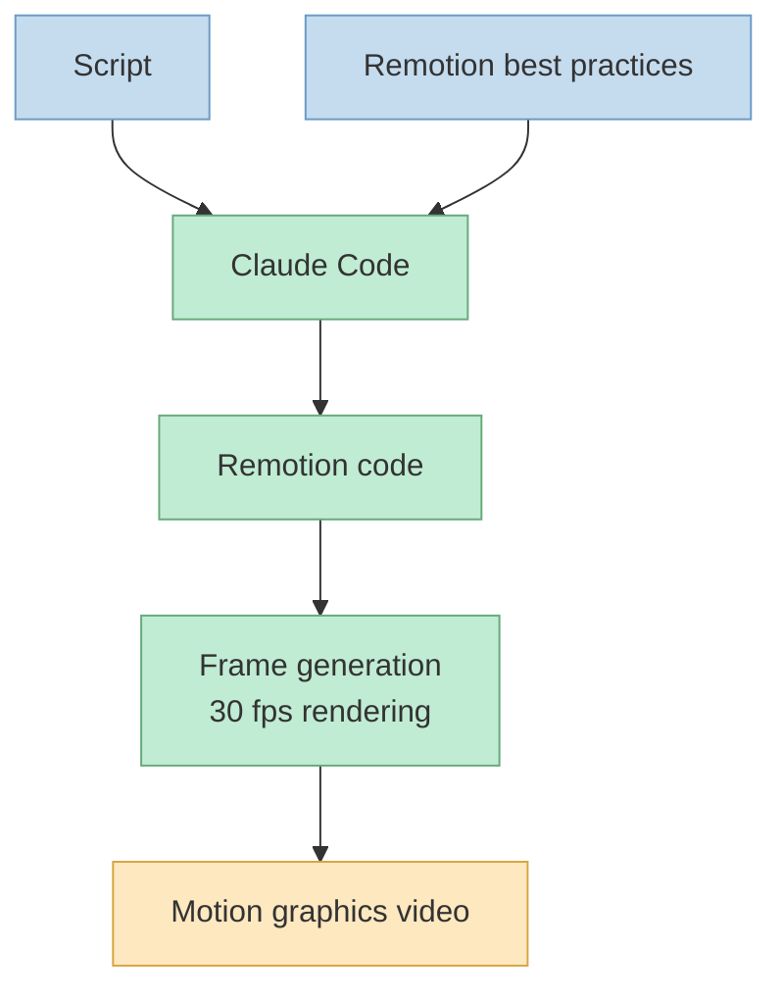
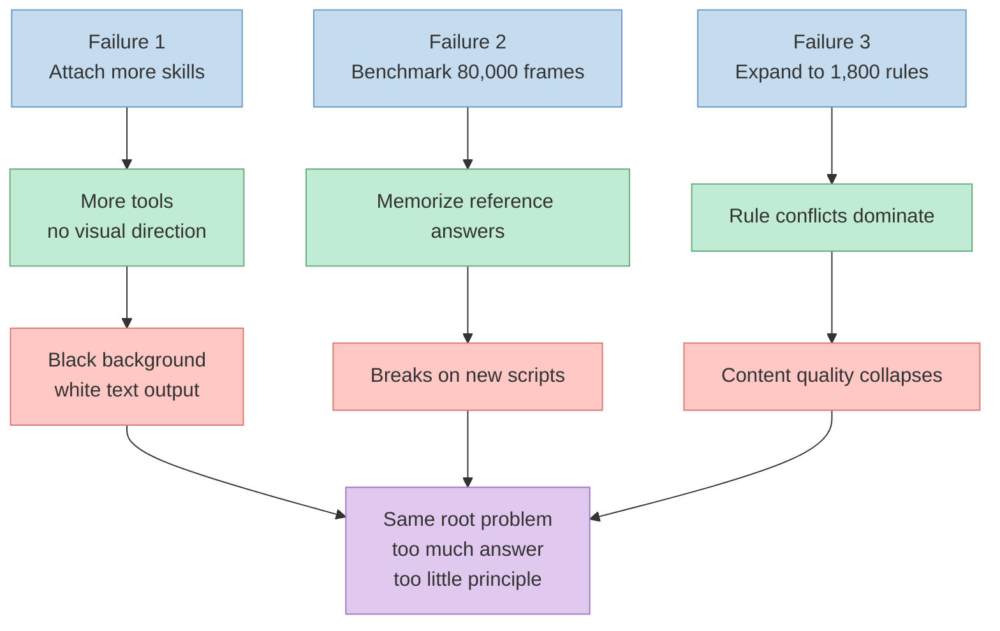
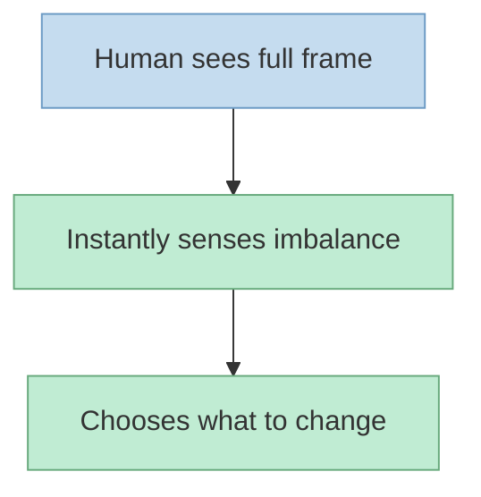
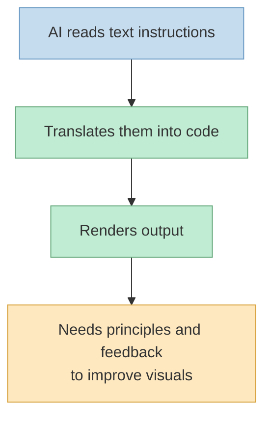
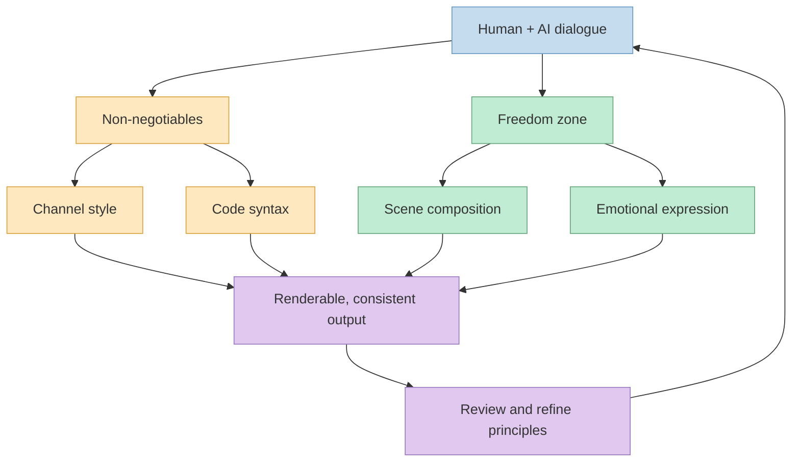
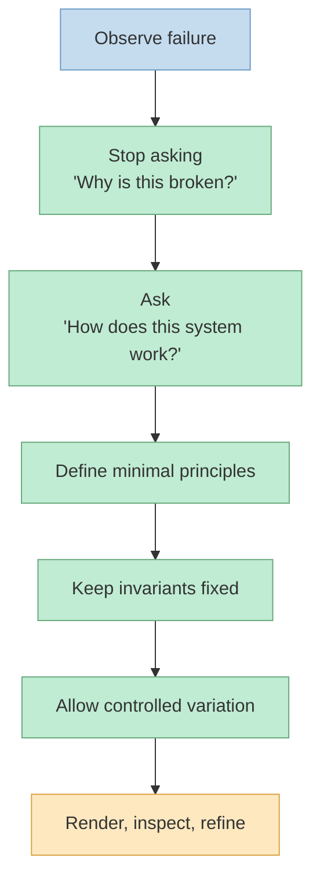

이 영상이 흥미로운 이유는 "대본만 넣으면 20분 만에 영상이 나온다" 는 선언 자체보다, 그 결과에 도달하기까지 30일 동안 어떤 시행착오가 있었는지를 꽤 투명하게 공개한다는 데 있습니다. 발표자는 이 영상 자체도 자신이 대본만 쓰고 나머지는 AI가 처리했다고 설명하면서, 프리미어 프로나 애프터이펙트, 캡컷 같은 편집 툴을 열지 않고도 모션 그래픽 영상을 자동 생성할 수 있다고 말합니다. 하지만 동시에 여기까지 오는 데 30일이 걸렸고, 오늘의 목적은 마법 같은 프롬프트를 자랑하는 것이 아니라 그 30일에서 건진 핵심 인사이트를 압축해서 공유하는 것이라고 못 박습니다 (근거: [t=0](https://youtu.be/gmRK1LZ7xos?t=0), [t=7](https://youtu.be/gmRK1LZ7xos?t=7), [t=17](https://youtu.be/gmRK1LZ7xos?t=17), [t=22](https://youtu.be/gmRK1LZ7xos?t=22), [t=26](https://youtu.be/gmRK1LZ7xos?t=26), [t=61](https://youtu.be/gmRK1LZ7xos?t=61)).

<!--more-->

## Sources

- https://www.youtube.com/watch?v=gmRK1LZ7xos

## 1) Remotion은 편집 툴이 아니라 "영상 설계도" 를 실행하는 엔진이다

발표자가 Remotion을 설명하는 방식은 꽤 명확합니다. Remotion은 타임라인을 손으로 만지는 전통적인 편집 툴이 아니라, 코드를 적으면 그것이 곧 영상이 되는 도구라는 것입니다. 그래서 그는 프리미어 프로를 "직접 벽돌을 쌓는 일" 에, Remotion을 "설계도를 그리는 일" 에 비유합니다. 사람이 손으로 움직임을 하나씩 잡는 대신, 설계도만 정확하면 동일한 구조를 반복해서 뽑아낼 수 있고, AI는 그 설계도를 코드 형태로 빠르게 작성하는 역할을 맡는다는 설명입니다 (근거: [t=84](https://youtu.be/gmRK1LZ7xos?t=84), [t=89](https://youtu.be/gmRK1LZ7xos?t=89), [t=99](https://youtu.be/gmRK1LZ7xos?t=99), [t=117](https://youtu.be/gmRK1LZ7xos?t=117), [t=124](https://youtu.be/gmRK1LZ7xos?t=124), [t=129](https://youtu.be/gmRK1LZ7xos?t=129), [t=132](https://youtu.be/gmRK1LZ7xos?t=132)).

이 설명에서 중요한 포인트는 "마법은 Remotion 자체가 아니라 AI와의 조합에서 일어난다" 는 점입니다. 발표자는 Claude Code에 대본을 주면 Claude가 Remotion 코드를 짜고, Remotion이 그 코드를 프레임과 애니메이션으로 바꿔 영상으로 렌더링한다고 정리합니다. 즉 이 워크플로의 실체는 `대본 -> 코드 생성 -> 렌더링` 이고, 여기서 필요한 것은 Remotion 자체보다도 AI가 어떤 기준으로 장면을 구성해야 하는지를 이해할 수 있게 해 주는 운영 원칙입니다 (근거: [t=156](https://youtu.be/gmRK1LZ7xos?t=156), [t=181](https://youtu.be/gmRK1LZ7xos?t=181), [t=193](https://youtu.be/gmRK1LZ7xos?t=193), [t=211](https://youtu.be/gmRK1LZ7xos?t=211), [t=216](https://youtu.be/gmRK1LZ7xos?t=216), [t=219](https://youtu.be/gmRK1LZ7xos?t=219), [t=240](https://youtu.be/gmRK1LZ7xos?t=240), [t=245](https://youtu.be/gmRK1LZ7xos?t=245)).

## 2) 세 번의 실패는 모두 "정답을 더 많이 주면 더 잘하겠지" 라는 착각에서 나왔다

첫 번째 실패는 리모션 관련 스킬을 과하게 붙이는 방식이었습니다. 발표자는 애니메이션, 차트, 장면 전환, 사운드 등 리모션 관련 보조 자료를 닥치는 대로 붙였다고 말합니다. 하지만 결과는 검은 배경 위에 흰 글자만 뜨는, 파워포인트를 영상으로 녹화한 수준의 산출물이었다고 설명합니다. 도구와 자료는 늘어났지만 "무엇을 어떤 방향으로 만들어야 하는지" 에 대한 압축된 원칙은 빠져 있었기 때문에, AI는 재료만 많고 목표는 흐린 상태에 빠진 셈입니다 (근거: [t=282](https://youtu.be/gmRK1LZ7xos?t=282), [t=290](https://youtu.be/gmRK1LZ7xos?t=290), [t=301](https://youtu.be/gmRK1LZ7xos?t=301), [t=304](https://youtu.be/gmRK1LZ7xos?t=304), [t=308](https://youtu.be/gmRK1LZ7xos?t=308), [t=313](https://youtu.be/gmRK1LZ7xos?t=313), [t=316](https://youtu.be/gmRK1LZ7xos?t=316)).

두 번째 실패는 반대로 정답지를 너무 정교하게 만드는 방식이었습니다. 그는 참고하고 싶은 크리에이터의 영상을 파이널 컷의 시퀀스 다운로드 기능으로 1프레임씩 뽑아 총 8만 장 정도의 이미지를 만들고, 그 폴더 전체를 Claude Code에게 분석하게 했다고 말합니다. 이렇게 하면 타이밍 변화, 텍스트 교체, 그래프 등장, 아이콘 전환 같은 패턴을 통째로 벤치마킹할 수 있다고 본 것입니다. 그런데 새로운 대본이 들어가자 AI는 레퍼런스에 없는 문제를 만나 멘붕이 왔고, 결국 이상한 조합을 내기 시작했다고 설명합니다. 발표자가 "레퍼런스는 영감을 얻는 용도지 복사하는 용도가 아니다" 라고 정리하는 이유가 여기 있습니다. 응용력을 키우지 않고 정답을 외우게 만들면, 익숙한 문제만 풀 수 있는 시스템이 되기 때문입니다 (근거: [t=330](https://youtu.be/gmRK1LZ7xos?t=330), [t=341](https://youtu.be/gmRK1LZ7xos?t=341), [t=362](https://youtu.be/gmRK1LZ7xos?t=362), [t=369](https://youtu.be/gmRK1LZ7xos?t=369), [t=390](https://youtu.be/gmRK1LZ7xos?t=390), [t=397](https://youtu.be/gmRK1LZ7xos?t=397), [t=405](https://youtu.be/gmRK1LZ7xos?t=405), [t=426](https://youtu.be/gmRK1LZ7xos?t=426), [t=431](https://youtu.be/gmRK1LZ7xos?t=431)).

세 번째 실패는 AI와 대화를 계속 이어 가며 규칙을 정교하게 만든 끝에, 그 규칙이 1800줄로 불어난 경우였습니다. 색상, 글자 크기, 움직임, 금지 항목까지 세세하게 적다 보니, AI는 정작 영상 내용을 구성하는 대신 규칙 충돌을 해소하는 데 정신을 빼앗겼다고 발표자는 말합니다. 그래서 그는 이 상태를 "운전 학원 교재 1000페이지를 외우게 하고 운전해 보라고 시키는 것" 에 비유합니다. 규칙이 너무 많아지면 실행 지능이 좋아지는 것이 아니라, 오히려 맥락 판단이 마비된다는 뜻입니다 (근거: [t=450](https://youtu.be/gmRK1LZ7xos?t=450), [t=458](https://youtu.be/gmRK1LZ7xos?t=458), [t=460](https://youtu.be/gmRK1LZ7xos?t=460), [t=463](https://youtu.be/gmRK1LZ7xos?t=463), [t=480](https://youtu.be/gmRK1LZ7xos?t=480), [t=490](https://youtu.be/gmRK1LZ7xos?t=490), [t=498](https://youtu.be/gmRK1LZ7xos?t=498), [t=507](https://youtu.be/gmRK1LZ7xos?t=507), [t=510](https://youtu.be/gmRK1LZ7xos?t=510)).

## 3) 전환점은 "왜 안 되지?" 가 아니라 "AI는 원래 어떻게 작동하지?" 였다

발표자는 여기까지 190시간 이상을 쓰고 500개가 넘는 파일을 수정했지만 전부 실패했다고 말합니다. 그러다 어느 날, 사람은 화면 한 장만 봐도 무엇이 답답하고 무엇을 바꿔야 할지 대번에 느끼는데 왜 AI는 그걸 못 하느냐는 질문을 Claude에게 그대로 던졌다고 설명합니다. Claude의 답은 단순합니다. 사람처럼 장면 전체를 직관적으로 느끼는 것이 아니라, 글자로 된 지시 사항을 한 줄씩 읽어 가며 코드를 짜기 때문에 화면 밀도나 분위기, 균형을 스스로 "감각적으로" 파악하기 어렵다는 것입니다. 이 답변을 통해 발표자는 지금까지 자신이 한 일이 사실상 "눈을 감은 사람에게 풍경화를 그리라고 한 것" 과 비슷했다는 점을 깨닫습니다 (근거: [t=521](https://youtu.be/gmRK1LZ7xos?t=521), [t=525](https://youtu.be/gmRK1LZ7xos?t=525), [t=529](https://youtu.be/gmRK1LZ7xos?t=529), [t=534](https://youtu.be/gmRK1LZ7xos?t=534), [t=552](https://youtu.be/gmRK1LZ7xos?t=552), [t=557](https://youtu.be/gmRK1LZ7xos?t=557), [t=562](https://youtu.be/gmRK1LZ7xos?t=562), [t=567](https://youtu.be/gmRK1LZ7xos?t=567), [t=579](https://youtu.be/gmRK1LZ7xos?t=579), [t=586](https://youtu.be/gmRK1LZ7xos?t=586)).

그래서 이후의 질문은 "규칙을 더 추가할까?", "레퍼런스를 더 줄까?" 같은 증상 치료가 아니라, AI가 어떤 방식으로 입력을 해석하고 어디까지는 강하게 고정해야 하며 어디부터는 자유를 줘야 잘 작동하는가를 묻는 방향으로 바뀝니다. 이 영상에서 가장 일반화 가능한 부분도 바로 여기에 있습니다. 발표자는 영상 자동화뿐 아니라 글쓰기, 코딩, 분석 같은 다른 작업에서도 "왜 안 돼?" 를 반복하지 말고 "이게 원래 어떻게 작동하지?" 를 물어야 근본적인 답에 닿는다고 정리합니다 (근거: [t=591](https://youtu.be/gmRK1LZ7xos?t=591), [t=595](https://youtu.be/gmRK1LZ7xos?t=595), [t=600](https://youtu.be/gmRK1LZ7xos?t=600), [t=742](https://youtu.be/gmRK1LZ7xos?t=742), [t=747](https://youtu.be/gmRK1LZ7xos?t=747), [t=755](https://youtu.be/gmRK1LZ7xos?t=755), [t=757](https://youtu.be/gmRK1LZ7xos?t=757), [t=781](https://youtu.be/gmRK1LZ7xos?t=781), [t=796](https://youtu.be/gmRK1LZ7xos?t=796), [t=801](https://youtu.be/gmRK1LZ7xos?t=801)).

## 4) 다섯 개 원칙의 핵심은 "엄격하게 고정할 것" 과 "AI에게 맡길 것" 을 분리하는 데 있다

전환 이후 발표자가 한 일은 1800줄의 규칙을 버리고 다섯 개 원칙으로 줄이는 것이었습니다. 여기서 그는 다섯 개 원칙이 사실 두 영역으로 나뉜다고 설명합니다. 하나는 채널 스타일이나 코드 문법처럼 반드시 지켜야 하는 비가역적 제약이고, 다른 하나는 장면 구성이나 감정 표현처럼 AI가 다양한 변형을 만들어 낼 수 있도록 자유를 줘야 하는 영역입니다. 즉 시스템의 품질은 "규칙을 많이 쓰는가" 보다 "무엇을 고정하고 무엇을 위임하는가" 를 얼마나 분명하게 나누느냐에 달려 있다는 뜻입니다 (근거: [t=591](https://youtu.be/gmRK1LZ7xos?t=591), [t=598](https://youtu.be/gmRK1LZ7xos?t=598), [t=600](https://youtu.be/gmRK1LZ7xos?t=600), [t=606](https://youtu.be/gmRK1LZ7xos?t=606), [t=610](https://youtu.be/gmRK1LZ7xos?t=610), [t=614](https://youtu.be/gmRK1LZ7xos?t=614), [t=620](https://youtu.be/gmRK1LZ7xos?t=620), [t=623](https://youtu.be/gmRK1LZ7xos?t=623), [t=625](https://youtu.be/gmRK1LZ7xos?t=625)).

더 흥미로운 점은 이 원칙 세트를 사람이 혼자 설계하지 않았다는 것입니다. 발표자는 AI에게 직접 "어떤 규칙을 주면 가장 잘 만들 수 있느냐", "어디까지 자유를 줘야 하느냐" 를 물었고, AI가 제안하고 사람이 확인하는 반복 끝에 다섯 개 원칙이 완성됐다고 말합니다. 이 대목은 프롬프트 엔지니어링을 넘어서, 모델 자체를 설계 파트너로 다루는 접근으로 읽을 수 있습니다. 다시 말해 시스템 프롬프트는 사람이 일방적으로 써내려가는 문서가 아니라, 모델의 작동 한계를 이해한 뒤 모델과 함께 조정해 가는 인터페이스라는 것입니다 (근거: [t=632](https://youtu.be/gmRK1LZ7xos?t=632), [t=634](https://youtu.be/gmRK1LZ7xos?t=634), [t=637](https://youtu.be/gmRK1LZ7xos?t=637), [t=639](https://youtu.be/gmRK1LZ7xos?t=639), [t=642](https://youtu.be/gmRK1LZ7xos?t=642), [t=645](https://youtu.be/gmRK1LZ7xos?t=645), [t=647](https://youtu.be/gmRK1LZ7xos?t=647), [t=650](https://youtu.be/gmRK1LZ7xos?t=650)).

발표자는 결과 차이도 꽤 분명하게 설명합니다. 1800줄 규칙을 들고 있을 때는 검은 배경에 흰 글자만 나왔지만, 다섯 개 원칙으로 줄였을 때는 장면마다 서로 다른 그림이 나왔고, 지금 보고 있는 이 영상 자체도 같은 방식으로 만들어졌다고 말합니다. 결국 출력 품질을 끌어올린 것은 더 큰 컨텍스트나 더 많은 예제가 아니라, 압축된 원칙과 적절한 자유도의 조합이었다는 해석이 가능합니다 (근거: [t=650](https://youtu.be/gmRK1LZ7xos?t=650), [t=655](https://youtu.be/gmRK1LZ7xos?t=655), [t=659](https://youtu.be/gmRK1LZ7xos?t=659), [t=664](https://youtu.be/gmRK1LZ7xos?t=664), [t=670](https://youtu.be/gmRK1LZ7xos?t=670), [t=672](https://youtu.be/gmRK1LZ7xos?t=672), [t=675](https://youtu.be/gmRK1LZ7xos?t=675), [t=677](https://youtu.be/gmRK1LZ7xos?t=677)).

## 5) 이 영상의 진짜 교훈은 영상 제작보다 "AI 운영 방식" 에 있다

후반부에서 발표자가 직접 정리하는 메시지는 네 가지로 압축됩니다. AI에게는 많은 규칙보다 적은 원칙이 낫고, AI는 사람과 다르게 세상을 보며, 실패가 가장 빠른 길이고, 막혔을 때는 "왜 안 되지?" 대신 "이게 원래 어떻게 작동하지?" 를 물어야 한다는 것입니다. 이 네 문장은 모두 영상 자동화라는 구체적 사례에서 나왔지만, 사실상 에이전트형 도구를 다루는 보편 규칙에 가깝습니다. 규칙 수를 늘리는 방식은 모델을 경직시키고, 작동 메커니즘을 이해한 뒤 최소 원칙으로 압축하는 방식은 모델이 강한 변형 능력을 발휘하게 만든다는 점이 핵심입니다 (근거: [t=685](https://youtu.be/gmRK1LZ7xos?t=685), [t=696](https://youtu.be/gmRK1LZ7xos?t=696), [t=702](https://youtu.be/gmRK1LZ7xos?t=702), [t=709](https://youtu.be/gmRK1LZ7xos?t=709), [t=722](https://youtu.be/gmRK1LZ7xos?t=722), [t=735](https://youtu.be/gmRK1LZ7xos?t=735), [t=742](https://youtu.be/gmRK1LZ7xos?t=742), [t=757](https://youtu.be/gmRK1LZ7xos?t=757), [t=776](https://youtu.be/gmRK1LZ7xos?t=776), [t=783](https://youtu.be/gmRK1LZ7xos?t=783), [t=791](https://youtu.be/gmRK1LZ7xos?t=791)).

또 하나 흥미로운 지점은 발표자가 정확한 시스템 프롬프트를 그대로 공개하지는 않지만, 그 대신 방향성은 충분히 전달하고 있다는 점입니다. 그는 오늘 설명한 내용이 결국 그 시스템 프롬프트의 핵심 방향성이고, 이를 이해하면 각자 자신만의 시스템을 만들 수 있다고 말합니다. 이어서 이런 영상 자동화를 더 쉽게 쓰게 해 줄 앱도 준비 중이며, 현재의 비싼 AI 영상 도구보다 훨씬 낮은 진입 가격을 목표로 한다고 설명합니다. 즉 이 영상은 개인 시행착오 회고에 그치지 않고, 장기적으로는 `스크립트 -> 영상` 파이프라인을 더 많은 사용자에게 제품화하려는 방향까지 함께 보여 줍니다 (근거: [t=805](https://youtu.be/gmRK1LZ7xos?t=805), [t=812](https://youtu.be/gmRK1LZ7xos?t=812), [t=819](https://youtu.be/gmRK1LZ7xos?t=819), [t=824](https://youtu.be/gmRK1LZ7xos?t=824), [t=832](https://youtu.be/gmRK1LZ7xos?t=832), [t=846](https://youtu.be/gmRK1LZ7xos?t=846), [t=849](https://youtu.be/gmRK1LZ7xos?t=849), [t=882](https://youtu.be/gmRK1LZ7xos?t=882), [t=886](https://youtu.be/gmRK1LZ7xos?t=886), [t=900](https://youtu.be/gmRK1LZ7xos?t=900), [t=903](https://youtu.be/gmRK1LZ7xos?t=903)).

## 핵심 요약

- 이 영상이 보여 주는 기본 구조는 `대본 -> Claude Code -> Remotion -> 렌더링` 이며, 핵심은 대본을 곧바로 영상으로 바꾸는 도구 조합보다도 그 조합이 따를 설계 원칙을 만드는 데 있습니다 (근거: [t=84](https://youtu.be/gmRK1LZ7xos?t=84), [t=124](https://youtu.be/gmRK1LZ7xos?t=124), [t=216](https://youtu.be/gmRK1LZ7xos?t=216), [t=222](https://youtu.be/gmRK1LZ7xos?t=222)).
- 스킬을 잔뜩 붙이거나, 8만 장의 레퍼런스를 외우게 하거나, 규칙을 1800줄까지 늘리는 세 접근은 모두 "정답을 더 많이 주면 성능이 오른다" 는 가정에서 출발했고, 실제로는 응용력과 내용 구성 능력을 망가뜨렸습니다 (근거: [t=301](https://youtu.be/gmRK1LZ7xos?t=301), [t=390](https://youtu.be/gmRK1LZ7xos?t=390), [t=426](https://youtu.be/gmRK1LZ7xos?t=426), [t=460](https://youtu.be/gmRK1LZ7xos?t=460), [t=507](https://youtu.be/gmRK1LZ7xos?t=507)).
- 진짜 전환점은 "왜 안 되지?" 가 아니라 "AI는 왜 사람처럼 한 화면을 직관적으로 못 보지?" 라는 질문이었고, 이 질문이 AI의 작동 방식을 이해하는 방향으로 문제 정의를 바꿨습니다 (근거: [t=552](https://youtu.be/gmRK1LZ7xos?t=552), [t=557](https://youtu.be/gmRK1LZ7xos?t=557), [t=562](https://youtu.be/gmRK1LZ7xos?t=562), [t=757](https://youtu.be/gmRK1LZ7xos?t=757), [t=776](https://youtu.be/gmRK1LZ7xos?t=776)).
- 다섯 개 원칙의 실체는 모든 것을 세세하게 통제하는 문서가 아니라, 채널 스타일과 코드 문법처럼 반드시 고정할 요소와 장면 연출처럼 AI에게 맡길 요소를 분리한 운영 모델입니다 (근거: [t=606](https://youtu.be/gmRK1LZ7xos?t=606), [t=614](https://youtu.be/gmRK1LZ7xos?t=614), [t=623](https://youtu.be/gmRK1LZ7xos?t=623), [t=634](https://youtu.be/gmRK1LZ7xos?t=634), [t=647](https://youtu.be/gmRK1LZ7xos?t=647)).
- 이 영상의 가장 큰 가치는 영상 자동화 팁 자체보다, 에이전트를 다룰 때 실패를 통해 메커니즘을 이해하고 원칙을 최소화하는 방식이 글쓰기, 코딩, 분석 같은 다른 작업에도 그대로 통한다는 점에 있습니다 (근거: [t=685](https://youtu.be/gmRK1LZ7xos?t=685), [t=702](https://youtu.be/gmRK1LZ7xos?t=702), [t=722](https://youtu.be/gmRK1LZ7xos?t=722), [t=791](https://youtu.be/gmRK1LZ7xos?t=791), [t=824](https://youtu.be/gmRK1LZ7xos?t=824)).

## 결론

이 영상을 "대본만 넣으면 영상이 나온다" 는 성공담으로만 읽으면 핵심을 놓치기 쉽습니다. 실제로 발표자가 보여 주는 더 중요한 장면은 스킬을 더 붙이고, 레퍼런스를 더 모으고, 규칙을 더 늘리는 방식이 어떻게 계속 실패로 돌아왔는지, 그리고 그 실패가 결국 시스템의 작동 방식을 다시 묻게 만들었다는 과정 자체입니다 (근거: [t=22](https://youtu.be/gmRK1LZ7xos?t=22), [t=282](https://youtu.be/gmRK1LZ7xos?t=282), [t=390](https://youtu.be/gmRK1LZ7xos?t=390), [t=495](https://youtu.be/gmRK1LZ7xos?t=495), [t=757](https://youtu.be/gmRK1LZ7xos?t=757)).

그래서 이 영상이 남기는 가장 실용적인 교훈은 프롬프트를 더 길게 쓰는 법이 아니라, 시스템이 원래 어떻게 작동하는지 이해하고 그 시스템이 잘할 수 있는 자유도와 반드시 지켜야 하는 불변 조건을 분리하는 법입니다. 영상 자동화는 그 한 사례일 뿐이고, 이 관점은 앞으로 에이전트와 함께 글을 쓰고, 코드를 만들고, 분석을 맡기는 거의 모든 작업에 그대로 적용될 수 있습니다 (근거: [t=591](https://youtu.be/gmRK1LZ7xos?t=591), [t=610](https://youtu.be/gmRK1LZ7xos?t=610), [t=685](https://youtu.be/gmRK1LZ7xos?t=685), [t=783](https://youtu.be/gmRK1LZ7xos?t=783), [t=801](https://youtu.be/gmRK1LZ7xos?t=801)).
