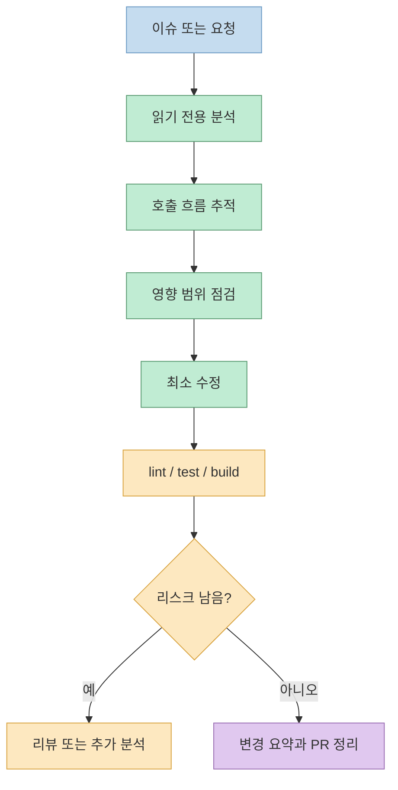
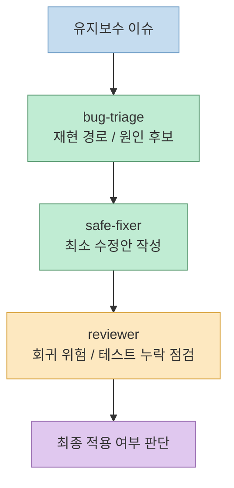
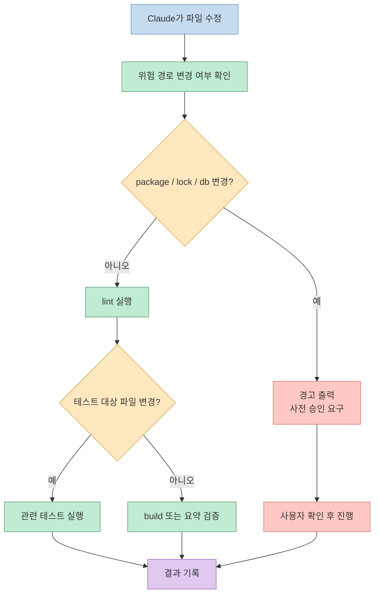
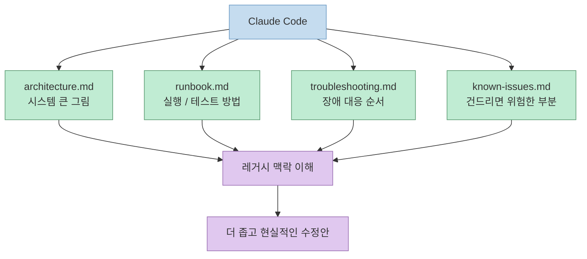

기존 프로젝트 유지보수에서 Claude Code를 쓸 때 가장 중요한 건 "얼마나 똑똑한 프롬프트를 쓰느냐"가 아닙니다. 더 중요한 건 **Claude Code가 실수하기 어려운 작업 흐름** 을 먼저 고정하는 것입니다.<br>기존 서비스는 새 기능을 밀어 넣는 속도보다, 현재 동작을 안전하게 읽고, 필요한 부분만 좁게 바꾸고, 바로 검증하는 리듬이 훨씬 중요합니다.

Claude Code는 `CLAUDE.md` 기반 프로젝트 메모리, 커스텀 서브에이전트, 스킬, 훅, 프로젝트 설정을 모두 지원합니다. 그래서 유지보수용 환경을 만들 때도 "AI가 알아서 잘하겠지"에 기대기보다, **분석 → 최소 수정 → 검증 → 리뷰** 순서를 문서와 자동화로 고정하는 편이 훨씬 안정적입니다.

<!--more-->

## Sources

- https://code.claude.com/docs/en/memory
- https://code.claude.com/docs/en/sub-agents
- https://code.claude.com/docs/en/skills
- https://code.claude.com/docs/en/hooks
- https://code.claude.com/docs/en/settings
- https://code.claude.com/docs/en/common-workflows

## 1) 유지보수용 환경은 왜 따로 설계해야 할까

신규 개발용 워크플로우는 보통 "빠르게 만들고 넓게 바꾸는 것"에 더 관대합니다. 반대로 유지보수는 다릅니다. 이미 운영 중인 코드베이스에서는 한 파일만 잘못 건드려도 UI, API, 상태관리, 배포 흐름이 같이 흔들릴 수 있습니다.

그래서 유지보수용 Claude Code 환경은 처음부터 아래 흐름을 강제하는 편이 좋습니다.



공식 메모리 문서도 `CLAUDE.md` 를 행동 지침으로 쓰고, 공통 워크플로우 문서도 새로운 코드베이스 이해, 버그 수정, 테스트 같은 단계를 따로 다룹니다. 즉 유지보수용 세팅은 Claude Code의 기능을 더 많이 켜는 문제가 아니라, **순서를 더 엄격하게 만드는 문제** 에 가깝습니다.

## 2) 시작점은 루트 `CLAUDE.md` 다

유지보수 세팅의 첫 파일은 루트 `CLAUDE.md` 입니다. 공식 문서 기준으로 `CLAUDE.md` 는 세션 시작 시 읽히는 프로젝트 메모리 파일이고, 프로젝트 규칙과 공통 워크플로우를 담는 용도입니다. 다만 여기서 중요한 구분이 하나 있습니다.

- `CLAUDE.md`: Claude의 행동을 유도하는 프로젝트 지침
- `settings.json`: 권한, 도구, 경로 같은 것을 실제로 강제하는 설정

즉 `CLAUDE.md` 만으로는 "절대 금지"가 보장되지 않습니다. 유지보수에서는 이 점을 분명히 이해해야 합니다. `CLAUDE.md` 에는 방향과 절차를 담고, 진짜 강제는 훅과 설정으로 받쳐야 합니다.

유지보수용 `CLAUDE.md` 는 길게 쓰기보다, Claude가 매번 떠올려야 할 판단 기준만 짧고 선명하게 적는 편이 좋습니다.

```md
# CLAUDE.md

## 프로젝트 목적
이 프로젝트는 운영 중인 기존 서비스 유지보수가 목적이다.
새 아키텍처 도입보다 기존 패턴 준수를 우선한다.

## 작업 원칙
- 먼저 원인 분석 후 수정
- 관련 파일만 최소 범위로 수정
- 기존 코딩 스타일 유지
- 리팩터링은 요청이 있을 때만 수행
- 불필요한 파일 이동/이름변경 금지
- DB 스키마 변경, API 계약 변경, 의존성 업그레이드는 사전 승인 필요

## 항상 먼저 할 일
1. 관련 에러/증상 정리
2. 호출 흐름 추적
3. 영향 범위 요약
4. 수정 계획 제시
5. 수정 후 테스트/린트 실행

## 자주 쓰는 명령
- 설치: pnpm install
- 개발 서버: pnpm dev
- 린트: pnpm lint
- 테스트: pnpm test
- 특정 테스트: pnpm test -- <pattern>
- 빌드: pnpm build
```

공식 문서는 `CLAUDE.md` 를 200줄 이하로 유지하고, 길어지면 `@path/to/import` 또는 `.claude/rules/` 로 분리하라고 권장합니다. 유지보수용 환경도 마찬가지입니다. 공통 규칙만 루트에 두고, 하위 영역 규칙은 파일 경로 기준으로 분리하는 편이 장기적으로 더 안정적입니다.

## 3) 서브에이전트는 "분석, 수정, 리뷰"로 나누는 편이 낫다

유지보수에서 가장 흔한 실패는 하나의 에이전트가 원인 분석, 수정, 리뷰를 한 번에 처리하면서 스스로의 판단을 검증하지 못하는 것입니다. 공식 서브에이전트 문서도 서브에이전트를 "특정 작업에 집중하는 전문 보조 에이전트"로 설명합니다.

이럴 때 가장 실용적인 기본 조합은 아래 세 가지입니다.

| 역할 | 책임 | Claude에게 시킬 질문 |
|------|------|------------------------|
| `bug-triage` | 재현 경로와 원인 후보 정리 | 이 버그의 재현 경로와 원인 후보 3개만 찾아 |
| `safe-fixer` | 기존 패턴 유지 + 최소 수정 | 기존 구조 유지하면서 가장 작은 수정으로 고쳐 |
| `reviewer` | 회귀 위험과 테스트 누락 점검 | 이 수정이 다른 화면/API에 미칠 영향 점검해 |



서브에이전트를 이렇게 나누면 좋은 이유는 단순합니다. 분석 단계에서는 수정 욕심을 줄이고, 수정 단계에서는 범위 확장을 막고, 리뷰 단계에서는 "정말 이것만 바뀌었는가"를 따로 볼 수 있기 때문입니다.

프로젝트에 체크인해 둘 서브에이전트는 `.claude/agents/` 아래 두면 됩니다. 공식 문서도 프로젝트 전용 서브에이전트는 버전 관리에 포함해 팀이 함께 개선하는 방식을 권장합니다.

## 4) 반복 작업은 `.claude/commands` 보다 스킬 기준으로 고정하는 편이 유리하다

예전에는 slash command 파일을 따로 두는 패턴이 많이 쓰였지만, 현재 공식 문서 기준으로는 커스텀 명령과 스킬이 사실상 같은 체계로 수렴되어 있습니다. `.claude/commands/deploy.md` 도 동작하지만, `.claude/skills/deploy/SKILL.md` 와 같은 효과를 만들 수 있고 스킬 쪽이 보조 파일과 세부 제어가 더 좋습니다.

유지보수에서 자주 반복되는 작업은 아래 세 개만 먼저 고정해도 체감이 큽니다.

### `/analyze-bug`

```md
현재 이슈를 유지보수 관점에서 분석해 줘.

반드시 아래 순서로:
1. 증상 요약
2. 재현 경로 추정
3. 관련 파일 후보
4. 원인 가설 3개
5. 가장 작은 수정안 제안
6. 필요한 테스트 목록
```

### `/safe-fix`

```md
수정 시 아래 규칙을 지켜라.
- 최소 수정만 수행
- 기존 구조와 네이밍 유지
- 관련 없는 리팩터링 금지
- 수정 후 lint/test 명령 제안
- 변경 파일별 이유를 1줄씩 설명
```

### `/review-maintenance`

```md
이번 변경을 유지보수 리뷰 관점으로 검토해 줘.
- 회귀 위험
- 누락된 테스트
- 성능/보안 영향
- 운영 장애 가능성
- 되돌리기 쉬운지 평가
```

핵심은 프롬프트를 길게 쓰는 것이 아니라, **항상 같은 질문 순서를 강제하는 것** 입니다. 유지보수에서는 일관성이 곧 품질입니다.

## 5) 훅은 "수정 후 자동 검증"을 기계적으로 강제하는 층이다

공식 훅 문서에 따르면 Claude Code의 훅은 shell command, HTTP endpoint, LLM prompt 형태로 특정 라이프사이클 시점에 자동 실행할 수 있습니다. 유지보수에서 이 기능이 중요한 이유는, 사람이 매번 빠뜨리는 검증을 기계적으로 반복하게 만들 수 있기 때문입니다.



유지보수에서 특히 유용한 훅은 아래 정도입니다.

| 감지 대상 | 자동 동작 |
|-----------|-----------|
| `package.json`, lockfile | 의존성 변경 경고 |
| `db/`, `migrations/` | 스키마 변경 경고 |
| `src/` 수정 | `lint` 실행 |
| `api/` 수정 | 관련 테스트 실행 |
| 커밋 직전 | 체크리스트 출력 |

예를 들면 아래처럼 아주 단순한 훅 스크립트만 있어도 사고를 꽤 줄일 수 있습니다.

```bash
#!/usr/bin/env bash
set -euo pipefail

changed_files="${1:-}"

if echo "$changed_files" | rg -q '(^|/)(package.json|pnpm-lock.yaml)$'; then
  echo "[warn] dependency change detected: approval required"
fi

if echo "$changed_files" | rg -q '(^|/)(db|migrations)/'; then
  echo "[warn] schema-related files changed: review impact before applying"
fi
```

여기서 포인트는 "Claude가 똑똑해서 스스로 조심하게 만드는 것"이 아니라, **실수해도 바로 걸리는 울타리** 를 만드는 것입니다.

## 6) 설정은 전역보다 프로젝트 단위가 더 중요하다

공식 설정 문서 기준으로 Claude Code는 사용자 설정, 프로젝트 설정, 로컬 프로젝트 설정, 관리 설정을 계층적으로 가집니다. 유지보수 프로젝트에서는 이 중 `.claude/settings.json` 과 `.claude/settings.local.json` 의 역할 분리를 명확히 하는 편이 좋습니다.

- `~/.claude/settings.json`: 모든 프로젝트에 공통인 개인 기본값
- `.claude/settings.json`: 팀이 공유해야 하는 프로젝트 공통 규칙
- `.claude/settings.local.json`: 개인 실험용 설정, 로컬 예외, 체크인 금지 값

프로젝트 설정에 넣으면 좋은 항목은 대체로 아래와 같습니다.

- 허용할 패키지 매니저
- 자주 쓰는 테스트와 빌드 명령
- 위험 경로 목록
- 승인 없이 하면 안 되는 작업
- 로컬에서만 허용할 예외 규칙

유지보수에서는 특히 "프로젝트 규칙을 팀이 공유하게 만드는 것"이 중요합니다. 그래야 누가 Claude Code를 써도 비슷한 결과가 나옵니다.

## 7) 문서 4종을 같이 두면 레거시 추론이 쉬워진다

코드만 던져 주면 Claude Code는 자꾸 "이상적인 구조"를 상상하려고 듭니다. 레거시 유지보수에서 더 필요한 건 현재 시스템의 현실입니다. 그래서 아래 네 문서를 같이 두는 편이 효율이 좋습니다.

| 문서 | 왜 필요한가 |
|------|--------------|
| `docs/architecture.md` | 핵심 모듈과 데이터 흐름 설명 |
| `docs/runbook.md` | 실행, 테스트, 운영 명령 정리 |
| `docs/troubleshooting.md` | 자주 나는 장애와 확인 순서 정리 |
| `docs/known-issues.md` | 아직 안 고친 문제와 위험 구간 기록 |



공식 메모리 문서도 상세한 학습 내용은 주제별 파일로 나누고, 항상 필요한 내용은 인덱스나 진입 문서로 유지하는 방식을 설명합니다. 유지보수용 문서 4종은 바로 그 역할을 합니다.

아래처럼 각 문서의 역할과 예시를 함께 만들어 두면, Claude Code가 레거시 시스템을 "추측"하지 않고 "참조"하게 만들 수 있습니다.

### `docs/architecture.md`

이 문서는 시스템의 큰 그림을 설명하는 문서입니다. 유지보수에서 특히 중요한 이유는, 버그 하나를 볼 때도 Claude Code가 "이 함수가 어디서 호출되고, 어느 계층에서 멈춰야 하는지"를 먼저 이해하게 만들 수 있기 때문입니다.<br>여기에는 이상적인 미래 구조보다, **지금 실제로 돌아가는 모듈 경계와 데이터 흐름** 을 적는 편이 좋습니다.

예를 들면 이런 식입니다.

```md
# Architecture

## 시스템 개요
- Web: Next.js
- API: Fastify
- DB: PostgreSQL
- Queue: Redis + BullMQ

## 요청 흐름
1. 사용자가 `/dashboard` 진입
2. `apps/web` 에서 세션 확인
3. `apps/api` 의 `/me` 호출
4. `services/user-service.ts` 에서 사용자 상태 조회
5. inactive 상태면 빈 위젯 목록 반환

## 모듈 경계
- `apps/web`: 화면 렌더링과 사용자 상호작용
- `apps/api`: 요청 검증과 응답 조합
- `packages/domain`: 순수 비즈니스 규칙
- `packages/db`: SQL과 repository 계층

## 유지보수 시 주의점
- 대시보드 위젯 기본값은 `packages/domain/dashboard.ts` 에서 결정된다.
- 권한 체크는 프론트가 아니라 API에서 최종 확정한다.
- 캐시 무효화 없이 사용자 상태만 바꾸면 화면과 API 결과가 잠깐 어긋날 수 있다.
```

핵심은 모든 디렉터리를 설명하는 것이 아니라, **문제가 자주 나는 경계와 절대 넘으면 안 되는 책임선** 을 적는 것입니다.

### `docs/runbook.md`

이 문서는 "이 프로젝트를 실제로 어떻게 실행하고 확인하는가"를 정리하는 운영 메모입니다. 유지보수에서 Claude Code가 흔히 헷갈리는 부분이 바로 실행 순서, 필요한 환경변수, 어떤 테스트를 먼저 돌려야 하는가 같은 현실적인 절차입니다.<br>`README.md` 가 온보딩 문서라면, `runbook.md` 는 장애 대응과 수정 검증을 위한 실전 문서에 가깝습니다.

예시는 아래 정도면 충분합니다.

```md
# Runbook

## 로컬 실행
1. `pnpm install`
2. `docker compose up -d postgres redis`
3. `pnpm db:migrate`
4. `pnpm dev`

## 자주 쓰는 검증 명령
- 전체 린트: `pnpm lint`
- 전체 테스트: `pnpm test`
- API 테스트: `pnpm test -- api`
- 대시보드 E2E: `pnpm test:e2e -- dashboard`
- 프로덕션 빌드: `pnpm build`

## 유지보수 기본 순서
1. 증상 재현
2. 서버 로그 확인
3. 관련 테스트 실행
4. 최소 수정 적용
5. 린트 / 테스트 / 빌드 확인

## 운영 확인 포인트
- 로그인 이슈는 `AUTH_SECRET`, `REDIS_URL` 이 빠지면 재현 방식이 달라진다.
- 메일 발송은 로컬에서 mock provider를 사용한다.
- 배치 작업 확인은 `bull-board` 대신 `pnpm queue:inspect` 로 본다.
```

유지보수에서 이 문서의 가치는 "정답 명령 목록"을 만드는 데 있습니다. Claude Code가 빌드 명령을 추측하지 않게 해야 합니다.

### `docs/troubleshooting.md`

이 문서는 자주 발생하는 장애 패턴과 확인 순서를 정리하는 문서입니다. Claude Code는 코드를 잘 읽어도, 운영 중에 반복되는 "증상-원인-확인 명령" 패턴은 별도 문서가 없으면 매번 새로 추론하려고 합니다.<br>그래서 이 문서는 버그 데이터베이스라기보다, **반복 장애에 대한 진단 플레이북** 으로 쓰는 편이 좋습니다.

예시는 이렇게 만들 수 있습니다.

```md
# Troubleshooting

## 증상: 로그인 후 대시보드가 빈 화면으로 보임

### 가장 흔한 원인
- `/me` 응답은 성공하지만 위젯 목록이 빈 배열로 내려옴
- 사용자 상태 캐시가 오래돼 inactive로 판단됨
- 프론트에서 권한 에러를 빈 상태로 삼켜 버림

### 확인 순서
1. 브라우저 네트워크 탭에서 `/api/me` 응답 확인
2. API 로그에서 사용자 상태 조회 결과 확인
3. Redis 캐시 키 `user:{id}:status` 확인
4. `dashboard.ts` 의 fallback 로직 확인

### 확인 명령
- `pnpm test -- dashboard`
- `pnpm tsx scripts/debug-user.ts --id <user-id>`
- `redis-cli GET user:<id>:status`

### 우회 방법
- 운영에서 긴급 복구가 필요하면 캐시를 삭제한 뒤 재로그인 유도

### 수정 시 주의점
- 프론트 fallback만 고치면 API와 UI 상태가 다시 어긋날 수 있다.
```

이 문서가 있으면 Claude Code에게 "이 증상이 이미 알려진 패턴인지 먼저 확인해라"라고 시키기 쉬워집니다.

### `docs/known-issues.md`

이 문서는 아직 해결하지 못한 문제, 위험하지만 건드리지 못한 부분, 임시 우회책을 기록하는 곳입니다. 유지보수에서 이 문서가 중요한 이유는, Claude Code가 "왜 이 이상한 코드가 남아 있는지"를 모르면 쉽게 불필요한 정리를 시도하기 때문입니다.<br>즉 이 문서는 기술 부채 목록이라기보다, **현재 건드리면 위험한 현실 제약 목록** 입니다.

예시는 아래처럼 짧고 솔직하면 됩니다.

```md
# Known Issues

## 1. 대시보드 권한 로직이 프론트와 API에 중복돼 있음
- 상태: 미해결
- 영향 범위: dashboard, admin-summary
- 이유: 레거시 고객사 호환성 때문에 API 단일화 작업 보류
- 임시 원칙: 권한 판단 수정 시 프론트와 API를 같이 확인할 것

## 2. 사용자 상태 캐시 TTL이 너무 김
- 상태: 부분 우회 중
- 영향 범위: 로그인 직후 화면, 관리자 변경 직후 반영
- 이유: 트래픽 급증 시 DB 부하를 줄이기 위해 임시 확대
- 임시 원칙: 상태 불일치 버그를 볼 때 캐시를 먼저 의심할 것

## 3. 배치 실패 알림이 간헐적으로 누락됨
- 상태: 재현 조건 불명확
- 영향 범위: 야간 정산
- 이유: 외부 메일 provider 타임아웃과 내부 retry 조건이 섞여 있음
- 임시 원칙: 알림 문제를 고칠 때는 배치 성공/실패 로직과 분리해서 볼 것
```

이 문서의 핵심은 완성도가 아니라 정직함입니다. 잘 모르는 것은 모른다고 써 두는 편이, Claude Code가 근거 없는 가설로 구조를 바꾸는 것보다 훨씬 낫습니다.

## 8) 추천 폴더 구조

정리하면 유지보수용 Claude Code 스타터 구조는 아래 정도가 가장 실용적입니다.

```text
project/
├─ CLAUDE.md
├─ .claude/
│  ├─ settings.json
│  ├─ skills/
│  │  ├─ analyze-bug/
│  │  │  └─ SKILL.md
│  │  ├─ safe-fix/
│  │  │  └─ SKILL.md
│  │  └─ review-maintenance/
│  │     └─ SKILL.md
│  ├─ agents/
│  │  ├─ bug-triage.md
│  │  ├─ safe-fixer.md
│  │  └─ reviewer.md
│  └─ hooks/
│     ├─ post-edit-lint.sh
│     ├─ changed-api-test.sh
│     └─ warn-dangerous-files.sh
├─ docs/
│  ├─ architecture.md
│  ├─ runbook.md
│  ├─ troubleshooting.md
│  └─ known-issues.md
└─ src/
```

지금 시점의 공식 문서 흐름에 맞춰 조금 더 정리하면, `.claude/commands/` 로 시작해도 되지만 장기적으로는 `.claude/skills/` 구조로 옮겨 가는 편이 좋습니다. 다만 중요한 건 폴더 이름보다 **유지보수용 작업 순서를 재사용 가능한 형태로 고정해 두는 것** 입니다.

## 9) 실제 운영 순서는 "읽기 전용 분석 → 최소 수정 → 검증"으로 고정한다

공식 common workflows 문서가 유용한 이유도 바로 여기에 있습니다. Claude Code는 코드베이스 이해, 버그 수정, 테스트, PR 작성 같은 흐름을 단계적으로 쓰는 편이 훨씬 안정적입니다.

유지보수용 프롬프트는 아래처럼 짧고 단호할수록 좋습니다.

### 분석만 시킬 때

```text
이 프로젝트는 운영 중인 기존 서비스다.
먼저 관련 코드 흐름만 파악하고 수정은 하지 말아라.
다음 형식으로 답해라:
1. 원인 후보
2. 수정이 필요한 최소 파일
3. 예상 부작용
4. 검증 방법
```

### 최소 수정만 시킬 때

```text
위 분석을 바탕으로 최소 수정만 적용해라.
리팩터링 금지.
변경 파일마다 수정 이유를 1줄씩 붙여라.
수정 후 실행할 테스트 명령도 제시해라.
```

### 영향 범위를 먼저 보게 할 때

```text
이 이슈를 고치기 전에
- 어떤 모듈이 영향을 받을 수 있는지
- API 계약이 바뀌는지
- UI/상태관리/DB에 파급이 있는지
먼저 점검해라.
```

### PR 설명까지 마무리할 때

```text
현재 변경사항 기준으로 PR 설명을 작성해라.
포함 항목:
- 문제 원인
- 수정 방법
- 영향 범위
- 테스트 결과
- 롤백 방법
```

이 순서를 습관으로 만들면, Claude Code는 유지보수에서 특히 강해집니다. 분석 없이 바로 수정하고, 검증 없이 바로 정리하는 흐름만 피하면 됩니다.

## 핵심 요약

- 유지보수용 Claude Code 환경의 핵심은 새 기능 개발 속도가 아니라 안전한 수정 흐름 고정이다.
- 루트 `CLAUDE.md` 에는 공통 원칙만 두고, 길어지면 import나 규칙 파일로 분리하는 편이 낫다.
- 서브에이전트는 `bug-triage`, `safe-fixer`, `reviewer`처럼 역할을 분리할수록 안정적이다.
- 반복 작업은 스킬 또는 명령으로 고정하고, 유지보수에서는 질문 순서를 표준화하는 것이 중요하다.
- 훅과 설정은 검증을 자동화하고 위험 작업을 경고하는 기계적 안전장치다.
- `architecture`, `runbook`, `troubleshooting`, `known-issues` 문서를 같이 두면 레거시 코드 추론 품질이 올라간다.

## 결론

기존 프로젝트 유지보수에서 Claude Code를 잘 쓰는 방법은 생각보다 단순합니다. 더 좋은 프롬프트를 찾기 전에, Claude가 따라야 할 규칙과 검증 흐름을 먼저 고정하면 됩니다.

한 줄로 줄이면 이렇습니다. **Claude를 더 똑똑하게 만드는 것보다, Claude가 실수하기 어렵게 환경을 설계하는 것이 먼저** 입니다.<br>루트 `CLAUDE.md`, 유지보수용 서브에이전트, 반복 작업 스킬, 자동 검증 훅, 문서 4종만 갖춰도 기존 프로젝트 유지보수 품질은 눈에 띄게 안정됩니다.
