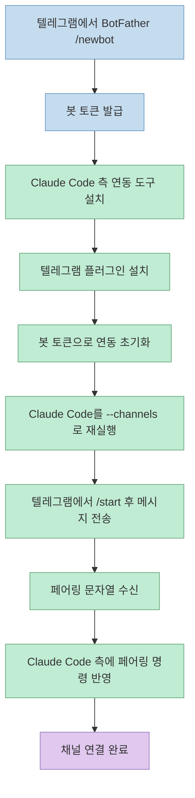
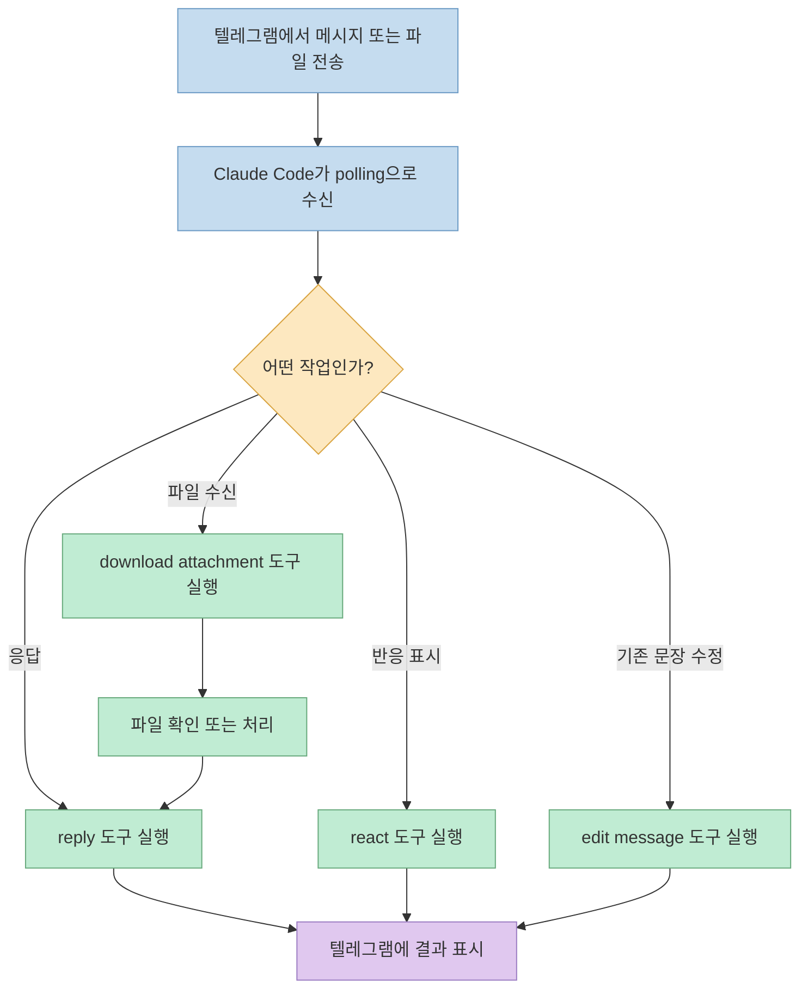
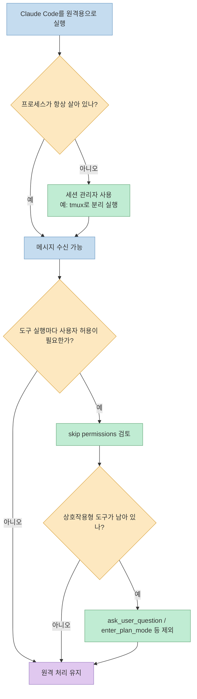

이 영상의 핵심은 단순히 "텔레그램에서도 Claude Code를 쓸 수 있다" 는 소개가 아닙니다. 발표자는 Claude Code 2.1.80부터 들어온 `channels` 기능을 실제로 텔레그램과 연결해 보고, 봇 생성부터 페어링, 응답 흐름, 파일 전달, 권한 프롬프트 문제까지 한 번에 보여 줍니다. 그래서 이 영상은 기능 발표보다 **원격 사용이 실제로 어디서 막히는지** 를 이해하는 데 더 가치가 있습니다 ([t=0](https://youtu.be/m2DdbzLlq0s?t=0), [t=4](https://youtu.be/m2DdbzLlq0s?t=4), [t=8](https://youtu.be/m2DdbzLlq0s?t=8), [t=124](https://youtu.be/m2DdbzLlq0s?t=124), [t=446](https://youtu.be/m2DdbzLlq0s?t=446)).

다만 영상에 나오는 몇몇 셸 명령은 화면으로는 보이지만 자동 생성 자막에서는 대부분 "이 명령어" 수준으로만 남습니다. 그래서 이 글은 복붙용 명령 모음보다, 초보자가 헷갈리기 쉬운 **구성 요소의 역할과 실행 순서** 를 정확히 이해하는 데 초점을 맞춥니다 ([t=37](https://youtu.be/m2DdbzLlq0s?t=37), [t=50](https://youtu.be/m2DdbzLlq0s?t=50), [t=61](https://youtu.be/m2DdbzLlq0s?t=61)).

<!--more-->

## Sources

- https://www.youtube.com/watch?v=m2DdbzLlq0s

## 1) 시작은 "텔레그램 봇 + Claude Code 플러그인 + channels 실행" 의 3단 분리다

영상이 가장 먼저 보여 주는 것은 아키텍처입니다. 텔레그램과 Claude Code가 바로 붙는 것이 아니라, 중간에 텔레그램 봇이 있고, Claude Code 쪽에는 이를 연결하는 플러그인과 채널 실행 옵션이 따로 있습니다. 즉 초보자가 이해해야 할 최소 구성은 `텔레그램 봇`, `Claude Code 측 연동 플러그인`, `channels 모드로 실행된 Claude Code 프로세스` 세 가지입니다 ([t=17](https://youtu.be/m2DdbzLlq0s?t=17), [t=28](https://youtu.be/m2DdbzLlq0s?t=28), [t=31](https://youtu.be/m2DdbzLlq0s?t=31), [t=71](https://youtu.be/m2DdbzLlq0s?t=71), [t=82](https://youtu.be/m2DdbzLlq0s?t=82), [t=89](https://youtu.be/m2DdbzLlq0s?t=89)).

설정 순서도 이 구조를 그대로 따릅니다. 먼저 텔레그램의 `BotFather` 에서 `/newbot` 으로 새 봇을 만들고, 그다음 Claude Code 쪽에서 연동에 필요한 선행 도구와 텔레그램 플러그인을 설치합니다. 이후 봇 토큰을 넣어 연동 초기화를 한 번 수행하고, Claude Code를 다시 시작한 뒤 `--channels` 옵션으로 실행해야 텔레그램 메시지를 실제로 수신할 수 있게 됩니다 ([t=21](https://youtu.be/m2DdbzLlq0s?t=21), [t=23](https://youtu.be/m2DdbzLlq0s?t=23), [t=34](https://youtu.be/m2DdbzLlq0s?t=34), [t=50](https://youtu.be/m2DdbzLlq0s?t=50), [t=61](https://youtu.be/m2DdbzLlq0s?t=61), [t=65](https://youtu.be/m2DdbzLlq0s?t=65), [t=80](https://youtu.be/m2DdbzLlq0s?t=80), [t=82](https://youtu.be/m2DdbzLlq0s?t=82)).

페어링도 자동으로 끝나지 않습니다. 영상에서는 텔레그램 봇에서 `/start` 를 누른 뒤 아무 메시지나 보내면 Claude Code가 여섯 글자 정도의 문자열을 돌려주고, 그 문자열이 들어간 명령 전체를 다시 Claude Code 쪽에 붙여 넣어 권한 설정까지 마무리합니다. 즉 "봇을 만들었으니 끝" 이 아니라, `봇 생성 -> 연동 초기화 -> channels 실행 -> 사용자 메시지 -> 페어링 명령 반영` 까지가 하나의 설정 절차입니다 ([t=95](https://youtu.be/m2DdbzLlq0s?t=95), [t=97](https://youtu.be/m2DdbzLlq0s?t=97), [t=104](https://youtu.be/m2DdbzLlq0s?t=104), [t=106](https://youtu.be/m2DdbzLlq0s?t=106), [t=110](https://youtu.be/m2DdbzLlq0s?t=110), [t=114](https://youtu.be/m2DdbzLlq0s?t=114), [t=117](https://youtu.be/m2DdbzLlq0s?t=117), [t=120](https://youtu.be/m2DdbzLlq0s?t=120)).

## 2) 연결 뒤에는 "텔레그램 메시지 -> Claude Code polling -> MCP 도구 실행" 루프가 돈다

연결이 끝난 뒤의 동작도 꽤 명확하게 설명됩니다. 사용자가 텔레그램에서 메시지를 보내면 Claude Code가 그것을 받아 처리하고, 그 응답은 텔레그램 플러그인의 MCP 서버 안에 있는 `reply` 도구 실행으로 다시 전달됩니다. 여기서 중요한 점은 Claude Code가 푸시 알림을 받는 식이 아니라, 텔레그램 서버에 새로운 메시지가 있는지 계속 확인하는 polling 방식으로 수신한다는 설명이 영상에 직접 나온다는 점입니다 ([t=128](https://youtu.be/m2DdbzLlq0s?t=128), [t=133](https://youtu.be/m2DdbzLlq0s?t=133), [t=141](https://youtu.be/m2DdbzLlq0s?t=141), [t=146](https://youtu.be/m2DdbzLlq0s?t=146), [t=163](https://youtu.be/m2DdbzLlq0s?t=163), [t=171](https://youtu.be/m2DdbzLlq0s?t=171), [t=175](https://youtu.be/m2DdbzLlq0s?t=175)).

영상에서 확인되는 도구는 네 가지입니다. `reply` 는 응답 전송, `react` 는 텔레그램 메시지에 반응 표시 추가, `edit message` 는 이미 보낸 메시지 내용 수정, `download attachment` 는 사용자가 올린 파일 다운로드를 담당합니다. 발표자는 `react` 는 크게 실용적으로 보이지 않는다고 평가하고, 대신 `edit message` 와 `download attachment` 가 실제 작업 흐름에서 더 의미 있다고 보여 줍니다. 특히 파일 업로드는 `download attachment` 로 받고, 확인 결과는 다시 `reply` 로 돌려주는 구조가 드러납니다 ([t=225](https://youtu.be/m2DdbzLlq0s?t=225), [t=232](https://youtu.be/m2DdbzLlq0s?t=232), [t=240](https://youtu.be/m2DdbzLlq0s?t=240), [t=247](https://youtu.be/m2DdbzLlq0s?t=247), [t=262](https://youtu.be/m2DdbzLlq0s?t=262), [t=266](https://youtu.be/m2DdbzLlq0s?t=266), [t=273](https://youtu.be/m2DdbzLlq0s?t=273), [t=286](https://youtu.be/m2DdbzLlq0s?t=286)).

이 설명이 중요한 이유는 채널 기능을 단순히 "휴대폰에서 채팅하듯 Claude Code를 쓴다" 로 이해하면 실제 제약을 놓치기 쉽기 때문입니다. 실체는 모바일 메신저 UI 뒤에서 `MCP tool invocation` 이 돌아가는 구조입니다. 그래서 메시지 응답, 메시지 수정, 파일 송수신 같은 동작은 결국 각각의 도구 권한과 실행 정책 문제로 이어집니다 ([t=137](https://youtu.be/m2DdbzLlq0s?t=137), [t=143](https://youtu.be/m2DdbzLlq0s?t=143), [t=185](https://youtu.be/m2DdbzLlq0s?t=185), [t=190](https://youtu.be/m2DdbzLlq0s?t=190), [t=280](https://youtu.be/m2DdbzLlq0s?t=280), [t=292](https://youtu.be/m2DdbzLlq0s?t=292)).

## 3) 원격 사용을 어렵게 만드는 핵심은 "프로세스 생존" 과 "권한 프롬프트" 다

영상 중반부터는 설정법보다 운영 제약이 더 중요해집니다. Claude Code를 끄면 텔레그램에서 들어온 요청은 더 이상 처리되지 않고, 나중에 Claude Code를 다시 켰을 때 밀려 있던 메시지가 그제야 처리됩니다. 발표자는 이 점을 "결국 Claude Code를 항상 터미널에 띄워 둬야 한다는 뜻" 으로 정리합니다. 즉 `channels` 는 텔레그램 인터페이스를 제공하지만, 항상 살아 있는 백엔드 프로세스까지 해결해 주지는 않습니다 ([t=295](https://youtu.be/m2DdbzLlq0s?t=295), [t=300](https://youtu.be/m2DdbzLlq0s?t=300), [t=308](https://youtu.be/m2DdbzLlq0s?t=308), [t=313](https://youtu.be/m2DdbzLlq0s?t=313), [t=317](https://youtu.be/m2DdbzLlq0s?t=317)).

그래서 영상은 이 문제를 세션 관리 도구로 우회합니다. 자막에는 프로그램 이름이 정확히 남지 않지만, 실행 후 `Ctrl-B` 를 누르고 이어서 `D` 를 눌러 화면에서 빠져나오면서도 Claude Code 프로세스는 계속 살아 있다고 설명합니다. 이 키 조합과 설명을 기준으로 보면, 백그라운드 유지 방식은 `tmux` 를 쓰는 흐름으로 해석하는 것이 가장 자연스럽습니다. 이는 영상 데모에 대한 추론이지만, 원격 운영 맥락에서는 매우 중요한 포인트입니다 ([t=336](https://youtu.be/m2DdbzLlq0s?t=336), [t=339](https://youtu.be/m2DdbzLlq0s?t=339), [t=347](https://youtu.be/m2DdbzLlq0s?t=347), [t=352](https://youtu.be/m2DdbzLlq0s?t=352), [t=355](https://youtu.be/m2DdbzLlq0s?t=355), [t=359](https://youtu.be/m2DdbzLlq0s?t=359)).

두 번째 제약은 권한 프롬프트입니다. Claude Code는 기본적으로 MCP 도구를 실행하기 전에 사용자에게 매번 허용 여부를 묻습니다. 발표자가 바로 지적하듯, 이렇게 되면 밖에서 텔레그램으로 요청을 보내도 결국 집에 있는 컴퓨터에서 엔터를 눌러야 하므로 원격 사용의 의미가 크게 줄어듭니다. 그래서 영상에서는 `--dangerously-skip-permissions` 옵션으로 일부 확인 단계를 생략하는 방법을 보여 줍니다 ([t=185](https://youtu.be/m2DdbzLlq0s?t=185), [t=190](https://youtu.be/m2DdbzLlq0s?t=190), [t=200](https://youtu.be/m2DdbzLlq0s?t=200), [t=205](https://youtu.be/m2DdbzLlq0s?t=205), [t=380](https://youtu.be/m2DdbzLlq0s?t=380), [t=383](https://youtu.be/m2DdbzLlq0s?t=383), [t=384](https://youtu.be/m2DdbzLlq0s?t=384)).

하지만 그걸로 끝나지 않는다는 점이 더 중요합니다. 발표자는 `ask_user_question` 과 `enter_plan_mode` 같은 도구는 여전히 사용자 입력을 요구할 수 있다고 설명하고, 이를 막기 위해 실행 시점에 특정 도구를 제외하는 옵션을 추가합니다. 즉 원격 운영을 진지하게 하려면 단순히 `skip permissions` 만 켜는 것이 아니라, **원격 세션에서 절대 멈추면 안 되는 상호작용형 도구 자체를 비활성화** 해야 합니다. 이건 편의성 팁이 아니라 운영 정책입니다 ([t=386](https://youtu.be/m2DdbzLlq0s?t=386), [t=390](https://youtu.be/m2DdbzLlq0s?t=390), [t=401](https://youtu.be/m2DdbzLlq0s?t=401), [t=410](https://youtu.be/m2DdbzLlq0s?t=410), [t=420](https://youtu.be/m2DdbzLlq0s?t=420), [t=423](https://youtu.be/m2DdbzLlq0s?t=423), [t=427](https://youtu.be/m2DdbzLlq0s?t=427), [t=439](https://youtu.be/m2DdbzLlq0s?t=439)).

## 4) 이 기능은 흥미롭지만, 영상 자체도 "아직 초기 버전" 이라고 선을 긋는다

후반부에서 발표자는 `channels` 가 아직 research preview 단계의 초기 버전이라 부족한 점이 많다고 직접 평가합니다. 특히 앞서 본 두 문제, 즉 프로세스를 살아 있게 유지해야 하는 문제와 상호작용형 도구 때문에 원격 흐름이 멈추는 문제는 이미 채널 기능이 나오기 전부터 "다른 방식" 으로 해결된 문제라고 말합니다. 이 대목은 채널 기능을 비난한다기보다, 현재 상태를 "공식 기능의 초기 형태" 로 보는 편이 정확하다는 뜻에 가깝습니다 ([t=446](https://youtu.be/m2DdbzLlq0s?t=446), [t=449](https://youtu.be/m2DdbzLlq0s?t=449), [t=451](https://youtu.be/m2DdbzLlq0s?t=451), [t=454](https://youtu.be/m2DdbzLlq0s?t=454), [t=457](https://youtu.be/m2DdbzLlq0s?t=457)).

영상은 대안으로 `cokacdir` 을 소개합니다. 설명에 따르면 이 방식은 설치가 더 단순하고, 첫 메시지를 보내는 순간 페어링이 자동으로 이루어지며, Claude Code뿐 아니라 Codex도 지원합니다. 즉 발표자의 결론은 "`channels` 는 재미있는 첫걸음이지만, 실제 원격 워크플로우는 이미 별도 래퍼나 운영 레이어에서 더 매끄럽게 풀리고 있다" 에 가깝습니다. 이 평가는 영상 자체의 데모와 서술에서 직접 나온 것으로, 채널 기능을 도입할 때 기대치를 조정하는 데 도움이 됩니다 ([t=466](https://youtu.be/m2DdbzLlq0s?t=466), [t=472](https://youtu.be/m2DdbzLlq0s?t=472), [t=481](https://youtu.be/m2DdbzLlq0s?t=481), [t=484](https://youtu.be/m2DdbzLlq0s?t=484), [t=486](https://youtu.be/m2DdbzLlq0s?t=486), [t=488](https://youtu.be/m2DdbzLlq0s?t=488), [t=493](https://youtu.be/m2DdbzLlq0s?t=493)).

## 5) 실전 적용 포인트

- 이 영상에서 초보자가 가장 먼저 이해해야 할 것은 "텔레그램 메신저 하나 켠다" 가 아니라 `봇 생성`, `Claude Code 측 플러그인/초기화`, `channels 모드 실행`, `페어링` 이 따로 있다는 점입니다 ([t=21](https://youtu.be/m2DdbzLlq0s?t=21), [t=31](https://youtu.be/m2DdbzLlq0s?t=31), [t=65](https://youtu.be/m2DdbzLlq0s?t=65), [t=82](https://youtu.be/m2DdbzLlq0s?t=82), [t=106](https://youtu.be/m2DdbzLlq0s?t=106)).
- 원격 채팅 UX 뒤에서는 결국 MCP 도구가 실행됩니다. 따라서 reply만 보는 것이 아니라, 어떤 도구가 언제 발동되는지 이해해야 파일 송수신이나 메시지 수정 같은 동작을 제대로 설계할 수 있습니다 ([t=141](https://youtu.be/m2DdbzLlq0s?t=141), [t=160](https://youtu.be/m2DdbzLlq0s?t=160), [t=247](https://youtu.be/m2DdbzLlq0s?t=247), [t=262](https://youtu.be/m2DdbzLlq0s?t=262), [t=280](https://youtu.be/m2DdbzLlq0s?t=280)).
- `channels` 만으로는 always-on 운영이 해결되지 않습니다. 프로세스 생존을 별도로 다뤄야 하고, 영상에서는 `Ctrl-B`, `D` 흐름상 `tmux` 로 보이는 백그라운드 세션 관리가 사실상 필수처럼 쓰입니다 ([t=300](https://youtu.be/m2DdbzLlq0s?t=300), [t=317](https://youtu.be/m2DdbzLlq0s?t=317), [t=339](https://youtu.be/m2DdbzLlq0s?t=339), [t=347](https://youtu.be/m2DdbzLlq0s?t=347), [t=355](https://youtu.be/m2DdbzLlq0s?t=355)).
- 원격 운영에서 진짜 병목은 권한 프롬프트입니다. `skip permissions` 만으로 끝나지 않고, 상호작용형 도구를 제외하는 정책까지 세워야 스마트폰 기반 원격 사용이 멈추지 않습니다 ([t=190](https://youtu.be/m2DdbzLlq0s?t=190), [t=200](https://youtu.be/m2DdbzLlq0s?t=200), [t=380](https://youtu.be/m2DdbzLlq0s?t=380), [t=390](https://youtu.be/m2DdbzLlq0s?t=390), [t=420](https://youtu.be/m2DdbzLlq0s?t=420)).
- 발표자 본인도 최종 평가는 신중합니다. 채널 기능은 분명 흥미롭지만, research preview 특성상 운영 완성도는 아직 낮고, 실전 원격 사용은 별도 솔루션이 더 나을 수 있다는 메시지가 분명히 깔려 있습니다 ([t=446](https://youtu.be/m2DdbzLlq0s?t=446), [t=451](https://youtu.be/m2DdbzLlq0s?t=451), [t=457](https://youtu.be/m2DdbzLlq0s?t=457), [t=486](https://youtu.be/m2DdbzLlq0s?t=486), [t=493](https://youtu.be/m2DdbzLlq0s?t=493)).

## 핵심 요약

- 이 영상은 Claude Code `channels` 를 텔레그램과 연결하는 기능 소개이면서 동시에, 실제 원격 사용에 필요한 운영 조건을 드러내는 데모입니다 ([t=0](https://youtu.be/m2DdbzLlq0s?t=0), [t=8](https://youtu.be/m2DdbzLlq0s?t=8), [t=124](https://youtu.be/m2DdbzLlq0s?t=124)).
- 설정은 `봇 생성 -> 플러그인/연동 초기화 -> channels 실행 -> 페어링` 순서로 이해해야 헷갈리지 않습니다 ([t=23](https://youtu.be/m2DdbzLlq0s?t=23), [t=50](https://youtu.be/m2DdbzLlq0s?t=50), [t=82](https://youtu.be/m2DdbzLlq0s?t=82), [t=114](https://youtu.be/m2DdbzLlq0s?t=114)).
- 런타임의 본질은 채팅이 아니라 MCP 도구 호출 루프입니다. `reply`, `react`, `edit message`, `download attachment` 가 각각 다른 역할을 맡습니다 ([t=141](https://youtu.be/m2DdbzLlq0s?t=141), [t=225](https://youtu.be/m2DdbzLlq0s?t=225), [t=247](https://youtu.be/m2DdbzLlq0s?t=247), [t=262](https://youtu.be/m2DdbzLlq0s?t=262)).
- 실전에서는 프로세스를 항상 살려 둘 세션 관리와, 상호작용형 도구를 막는 권한 정책이 핵심 운영 레이어가 됩니다 ([t=317](https://youtu.be/m2DdbzLlq0s?t=317), [t=347](https://youtu.be/m2DdbzLlq0s?t=347), [t=380](https://youtu.be/m2DdbzLlq0s?t=380), [t=420](https://youtu.be/m2DdbzLlq0s?t=420)).
- 발표자의 최종 메시지는 낙관과 경계가 함께 있습니다. 기능은 흥미롭지만, 아직은 research preview로 보고 별도 원격 운영 솔루션과 비교하며 선택하는 편이 현실적입니다 ([t=449](https://youtu.be/m2DdbzLlq0s?t=449), [t=457](https://youtu.be/m2DdbzLlq0s?t=457), [t=486](https://youtu.be/m2DdbzLlq0s?t=486), [t=503](https://youtu.be/m2DdbzLlq0s?t=503)).

## 결론

이 영상을 보고 바로 가져가야 할 교훈은 "텔레그램으로 Claude Code를 쓸 수 있다" 보다 더 구체적입니다. 공식 채널 기능만 붙이면 끝나는 것이 아니라, 봇 생성과 페어링, 살아 있는 세션 유지, 권한 프롬프트 우회, 상호작용형 도구 제외까지 포함해 하나의 운영 체계를 만들어야 비로소 원격 사용이 성립합니다 ([t=106](https://youtu.be/m2DdbzLlq0s?t=106), [t=171](https://youtu.be/m2DdbzLlq0s?t=171), [t=317](https://youtu.be/m2DdbzLlq0s?t=317), [t=420](https://youtu.be/m2DdbzLlq0s?t=420)).

그래서 초보자 입장에서는 이 영상을 "설치 튜토리얼" 로만 보기보다, Claude Code channels가 실제로 어떤 운영 가정을 필요로 하는지 보여 주는 짧은 아키텍처 데모로 읽는 편이 더 정확합니다. 반대로 이미 원격 사용 경험이 있다면, 발표자가 왜 후반에 별도 솔루션을 더 높게 평가했는지도 자연스럽게 이해하게 됩니다 ([t=446](https://youtu.be/m2DdbzLlq0s?t=446), [t=457](https://youtu.be/m2DdbzLlq0s?t=457), [t=481](https://youtu.be/m2DdbzLlq0s?t=481), [t=493](https://youtu.be/m2DdbzLlq0s?t=493)).
