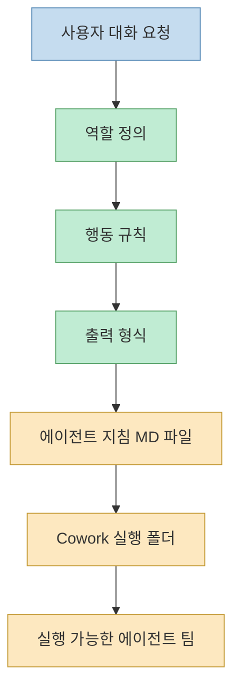
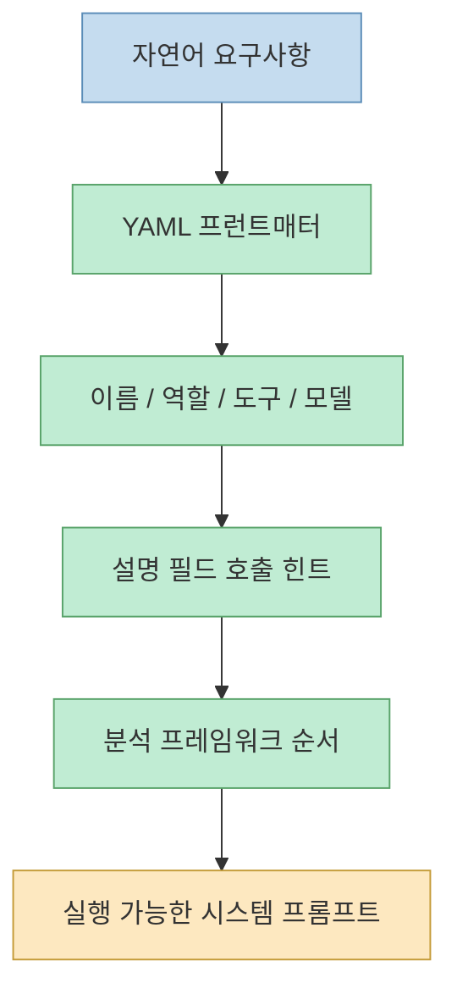
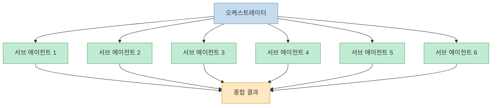
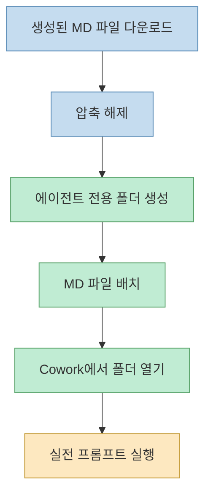
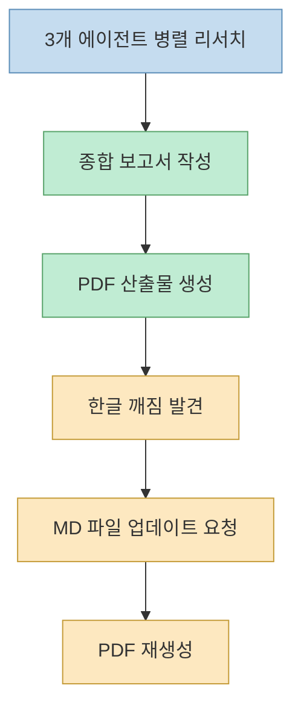
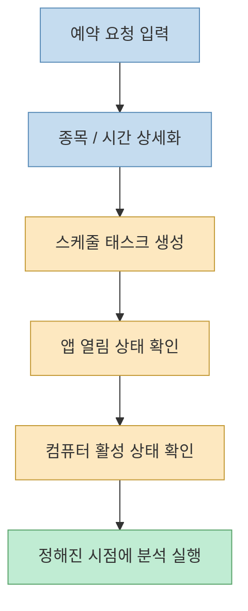

이 영상의 제목은 "코딩 배우지 마세요" 이지만, 실제로 보여 주는 내용은 코딩이 완전히 필요 없다는 선언에 가깝지 않습니다. 더 정확히 말하면 발표자는 SDK 설치나 Claude Code 문법부터 배우는 대신, Claude 데스크톱 대화창에서 에이전트가 따라야 할 역할 정의, 행동 규칙, 출력 형식을 먼저 말로 설명하고, 그 설명을 실행 가능한 지침 파일로 굳히는 흐름을 보여 줍니다. 즉 핵심은 "코드를 안 쳐도 된다" 가 아니라 "에이전트 명세를 자연어로 먼저 외주화할 수 있다" 에 있습니다 (근거: [t=2](https://youtu.be/jKjbXXBahiY?t=2), [t=10](https://youtu.be/jKjbXXBahiY?t=10), [t=12](https://youtu.be/jKjbXXBahiY?t=12), [t=49](https://youtu.be/jKjbXXBahiY?t=49), [t=52](https://youtu.be/jKjbXXBahiY?t=52), [t=57](https://youtu.be/jKjbXXBahiY?t=57)).

그래서 이 글은 이 영상을 "주식 추천 프롬프트" 로 읽지 않고, 자연어 요청이 어떻게 `MD` 지침 파일, 에이전트 팀, 코워크(Cowork) 실행 컨텍스트, 병렬 리서치, PDF 보고서, 예약 작업으로 이어지는지 정리하는 워크플로 문서로 읽습니다. 영상 후반으로 갈수록 진짜 포인트는 종목명보다 운영 루프에 있습니다. `에이전트 명세 생성 -> 폴더 적재 -> Cowork 실행 -> 병렬 분석 -> 산출물 수정 -> 예약 실행` 이라는 루프가 이 영상의 실전 가치입니다 (근거: [t=68](https://youtu.be/jKjbXXBahiY?t=68), [t=146](https://youtu.be/jKjbXXBahiY?t=146), [t=217](https://youtu.be/jKjbXXBahiY?t=217), [t=263](https://youtu.be/jKjbXXBahiY?t=263), [t=347](https://youtu.be/jKjbXXBahiY?t=347), [t=465](https://youtu.be/jKjbXXBahiY?t=465)).

<!--more-->

## Sources

- https://www.youtube.com/watch?v=jKjbXXBahiY

## 1) 출발점은 코드가 아니라 역할 정의, 행동 규칙, 출력 형식이다

발표자는 초반부터 에이전트를 "잘 짜여진 역할 정의와 행동 규칙과 출력 형식을 바탕으로 자동으로 일을 해 주는 것" 으로 설명합니다. 이 정의가 중요한 이유는, 영상의 나머지 단계가 전부 여기서 파생되기 때문입니다. 다시 말해 이 데모는 모델에게 종목 코드만 던지고 결과를 받는 흐름이 아니라, 먼저 어떤 직무를 수행해야 하는지와 어떤 방식으로 답해야 하는지를 문서화하고, 그 문서를 실행 컨텍스트로 삼는 구조입니다. 데스크톱 앱을 먼저 설치하라고 안내하는 것도 결국 이 명세를 대화에서 만들고 바로 실행 환경으로 넘기기 위해서입니다 (근거: [t=32](https://youtu.be/jKjbXXBahiY?t=32), [t=41](https://youtu.be/jKjbXXBahiY?t=41), [t=49](https://youtu.be/jKjbXXBahiY?t=49), [t=52](https://youtu.be/jKjbXXBahiY?t=52), [t=57](https://youtu.be/jKjbXXBahiY?t=57), [t=59](https://youtu.be/jKjbXXBahiY?t=59)).

이 관점에서 보면 "코딩을 배우지 마세요" 라는 문장은 실제로는 "처음부터 코드 구현 세부보다 에이전트 직무 정의를 먼저 하세요" 에 더 가깝습니다. 발표자가 데모 대상으로 방산주 급등 상황을 잡고, 어떤 주식을 사야 하는지 AI 에이전트 팀으로 분석해 보자고 말하는 장면도 같은 맥락입니다. 바로 분석을 시작하는 것이 아니라, 먼저 에이전트 팀이 어떤 문제를 풀고 어떤 산출물을 내야 하는지부터 정하는 것입니다 (근거: [t=21](https://youtu.be/jKjbXXBahiY?t=21), [t=25](https://youtu.be/jKjbXXBahiY?t=25), [t=27](https://youtu.be/jKjbXXBahiY?t=27), [t=30](https://youtu.be/jKjbXXBahiY?t=30), [t=68](https://youtu.be/jKjbXXBahiY?t=68), [t=75](https://youtu.be/jKjbXXBahiY?t=75)).

## 2) 핵심 산출물은 YAML 프런트매터가 붙은 MD 지침 파일이다

영상에서 발표자가 직접 입력하는 프롬프트의 핵심은 꽤 분명합니다. "나는 주식 종목을 분석하는 AI 에이전트를 만들고 싶다", "증권사 애널리스트처럼 종목 분석하고 추천픽도 골라주는 에이전트다", "엔트로픽 공식 에이전트 가이드에 따라서 만들어라", 그리고 "YAML 프런트를 마크다운 시스템 프롬프트로 만들어 달라" 는 요청이 연달아 나옵니다. 이어서 그는 YAML을 어렵게 생각할 필요 없이 이름, 역할, 사용할 도구, 모델 같은 기본 정보를 적는 헤더 정도로 이해하면 된다고 설명합니다. 즉 이 영상이 보여 주는 첫 번째 자동화는 코드 생성이 아니라, 에이전트 시스템 프롬프트의 구조화입니다 (근거: [t=68](https://youtu.be/jKjbXXBahiY?t=68), [t=72](https://youtu.be/jKjbXXBahiY?t=72), [t=79](https://youtu.be/jKjbXXBahiY?t=79), [t=84](https://youtu.be/jKjbXXBahiY?t=84), [t=87](https://youtu.be/jKjbXXBahiY?t=87), [t=96](https://youtu.be/jKjbXXBahiY?t=96), [t=101](https://youtu.be/jKjbXXBahiY?t=101), [t=106](https://youtu.be/jKjbXXBahiY?t=106)).

그다음 설명이 더 흥미롭습니다. 발표자는 `description` 쪽에 적절한 호출 힌트를 넣으면 에이전트가 적절한 서브 에이전트를 더 잘 불러오고, 분석 프레임워크를 순서대로 지정하면 그 흐름에 맞는 세부 역할들이 생성된다고 설명합니다. 자동화 포인트는 여기서 한 단계 더 올라갑니다. 에이전트 하나의 목적만 말하는 것이 아니라, 언제 어떤 하위 분석 흐름을 호출해야 하는지까지 명세로 밀어 넣는 것입니다. 이 때문에 이 영상에서 `MD` 파일은 단순한 메모가 아니라, 호출 규칙과 분석 순서를 품은 실행 계약서에 가깝습니다 (근거: [t=109](https://youtu.be/jKjbXXBahiY?t=109), [t=116](https://youtu.be/jKjbXXBahiY?t=116), [t=120](https://youtu.be/jKjbXXBahiY?t=120), [t=122](https://youtu.be/jKjbXXBahiY?t=122), [t=126](https://youtu.be/jKjbXXBahiY?t=126), [t=128](https://youtu.be/jKjbXXBahiY?t=128), [t=134](https://youtu.be/jKjbXXBahiY?t=134), [t=142](https://youtu.be/jKjbXXBahiY?t=142)).

## 3) 발표자가 권하는 구조는 단일 에이전트보다 오케스트레이터 + 다중 MD 파일 팀이다

발표자는 하나의 `MD` 파일로 끝내는 방식보다 여러 개의 `MD` 파일을 만들어 한 명의 팀장이 팀원들을 돌리는 구조가 더 효율적이고 더 좋은 방식으로 정답을 가져올 수 있다고 말합니다. 이어서 오케스트레이션 구조를 기준으로 파일을 만들라고 요청했고, 결과적으로 오케스트레이터를 포함해 일곱 개의 에이전트 파일이 만들어졌으며, 여섯 개의 서브 에이전트를 순차 호출하고 결과를 종합한다고 설명합니다. 또 이런 서브 에이전트 마크다운 파일을 만들 때는 `Opus 4.6` 과 확장 사고를 활용하는 편이 더 잘 만들어 준다고 덧붙입니다. 이 장면이 중요한 이유는 "에이전트" 를 단수 도우미로 보지 않고, 역할이 분리된 분석 조직으로 보는 시선을 노출하기 때문입니다 (근거: [t=146](https://youtu.be/jKjbXXBahiY?t=146), [t=151](https://youtu.be/jKjbXXBahiY?t=151), [t=155](https://youtu.be/jKjbXXBahiY?t=155), [t=161](https://youtu.be/jKjbXXBahiY?t=161), [t=168](https://youtu.be/jKjbXXBahiY?t=168), [t=172](https://youtu.be/jKjbXXBahiY?t=172), [t=178](https://youtu.be/jKjbXXBahiY?t=178), [t=185](https://youtu.be/jKjbXXBahiY?t=185), [t=190](https://youtu.be/jKjbXXBahiY?t=190), [t=195](https://youtu.be/jKjbXXBahiY?t=195)).

영상 중간 설명을 보면 발표자는 기업 개요 분석, 재무 분석, 산업 모델 분석처럼 서로 다른 관점을 맡는 하위 분석가들을 예로 듭니다. 물론 자동 생성 자막 특성상 각 파일 이름이 모두 정확히 복원되지는 않지만, 구조의 방향은 분명합니다. 오케스트레이터는 종합과 순서 제어를 담당하고, 나머지 파일들은 서로 다른 분석 역할을 담당합니다. 이 글의 해석으로는, 여기서 중요한 것은 파일 수 자체가 아니라 "문제를 쪼개고 마지막에 다시 합치는 방식" 을 처음부터 명세에 심는 점입니다 (근거: [t=134](https://youtu.be/jKjbXXBahiY?t=134), [t=137](https://youtu.be/jKjbXXBahiY?t=137), [t=141](https://youtu.be/jKjbXXBahiY?t=141), [t=146](https://youtu.be/jKjbXXBahiY?t=146), [t=155](https://youtu.be/jKjbXXBahiY?t=155), [t=197](https://youtu.be/jKjbXXBahiY?t=197), [t=200](https://youtu.be/jKjbXXBahiY?t=200)).

## 4) Cowork에서는 폴더 하나가 곧 에이전트 팀의 실행 단위가 된다

에이전트 파일을 만든 뒤의 흐름도 단순합니다. 발표자는 생성된 `MD` 파일들을 모두 다운로드하고, 압축을 풀고, `stock agent` 폴더를 만든 다음 그 안에 파일들을 넣으라고 설명합니다. 그리고 바로 이어서 "이 파일에 있는 MD 파일이 마치 팀원들을 여기 앉혀 놓은 것" 이라고 비유합니다. 이 표현이 정확합니다. Cowork에 연결되는 것은 추상적 에이전트 개념이 아니라, 실제로 폴더 안에 배치된 역할 문서 묶음이기 때문입니다 (근거: [t=217](https://youtu.be/jKjbXXBahiY?t=217), [t=225](https://youtu.be/jKjbXXBahiY?t=225), [t=231](https://youtu.be/jKjbXXBahiY?t=231), [t=235](https://youtu.be/jKjbXXBahiY?t=235), [t=241](https://youtu.be/jKjbXXBahiY?t=241), [t=248](https://youtu.be/jKjbXXBahiY?t=248), [t=253](https://youtu.be/jKjbXXBahiY?t=253), [t=257](https://youtu.be/jKjbXXBahiY?t=257)).

이후 Cowork에서 해야 할 일은 그 폴더를 열고 프롬프트를 넣는 것입니다. 데모에서는 이란 전쟁 발발로 방산주가 급등하는 상황을 가정해 미국 주식 추천을 요청하고, "에이전트 가이드에 따라서 진행해" 라고 지시합니다. 그러자 화면에는 다섯 단계 진행 상황이 보이고, 발표자는 이것이 가능한 이유가 지침 `MD` 파일이 이미 들어가 있기 때문이라고 설명합니다. 또 발표자는 Cowork의 장점으로 이전 대화와 맥락을 채팅형으로 다시 보며 이어서 작업할 수 있다는 점을 강조합니다. 즉 Cowork는 파일만 읽는 실행기라기보다, 폴더 기반 팀 컨텍스트와 대화형 실행 상태를 함께 붙들고 가는 인터페이스로 등장합니다 (근거: [t=263](https://youtu.be/jKjbXXBahiY?t=263), [t=267](https://youtu.be/jKjbXXBahiY?t=267), [t=283](https://youtu.be/jKjbXXBahiY?t=283), [t=287](https://youtu.be/jKjbXXBahiY?t=287), [t=297](https://youtu.be/jKjbXXBahiY?t=297), [t=304](https://youtu.be/jKjbXXBahiY?t=304), [t=313](https://youtu.be/jKjbXXBahiY?t=313), [t=341](https://youtu.be/jKjbXXBahiY?t=341)).

## 5) 실전 가치가 드러나는 지점은 병렬 리서치와 결과물 재생성이다

영상에서 가장 실무적으로 흥미로운 대목은 Cowork가 에이전트 세 개를 병렬로 투입해 시장 리서치를 진행하고, 그 결과를 하나의 종합 보고서로 정리해 `PDF` 파일로 남긴다고 설명하는 구간입니다. 발표자는 이 병렬 투입이 하나씩 서브 에이전트를 돌리는 것보다 훨씬 빠르다고 말하고, 실제로 최종 종합 보고서가 앞에서 만든 스톡 에이전트 폴더 안으로 들어온다고 보여 줍니다. 이 대목에서 에이전트 팀은 더 이상 아이디어 생성 도구가 아니라, 폴더 안에 결과물을 남기는 분석 생산 라인처럼 보입니다 (근거: [t=347](https://youtu.be/jKjbXXBahiY?t=347), [t=350](https://youtu.be/jKjbXXBahiY?t=350), [t=354](https://youtu.be/jKjbXXBahiY?t=354), [t=365](https://youtu.be/jKjbXXBahiY?t=365), [t=367](https://youtu.be/jKjbXXBahiY?t=367), [t=372](https://youtu.be/jKjbXXBahiY?t=372), [t=374](https://youtu.be/jKjbXXBahiY?t=374), [t=379](https://youtu.be/jKjbXXBahiY?t=379)).

그 다음 장면은 더 현실적입니다. 생성된 `PDF` 에 한글 깨짐이 생기자 발표자는 "MD 파일 업데이트하고 수정해서 PDF 파일까지 다시 만들어" 라고 요청하면 깨진 현상을 고치고 `MD` 파일도 자동으로 업데이트한다고 설명합니다. 이어서 보고서에는 한국 방산주와 미국 주요 방산주 분석, 급등 상황, 리스크, 추가로 보면 좋을 것들이 정리된다고 말합니다. 다만 발표자는 매수·매도 추천은 다소 막히는 편이며 프롬프트를 더 강하게 써서 풀 수 있다고 언급합니다. 이 부분은 영상 속 발화 그대로는 맞지만, 이 글의 해석으로는 우회 대상이라기보다 안전 경계로 보는 편이 낫습니다. 보고서 자동화와 투자 실행 자동화는 같은 단계가 아니기 때문입니다 (근거: [t=391](https://youtu.be/jKjbXXBahiY?t=391), [t=394](https://youtu.be/jKjbXXBahiY?t=394), [t=401](https://youtu.be/jKjbXXBahiY?t=401), [t=409](https://youtu.be/jKjbXXBahiY?t=409), [t=415](https://youtu.be/jKjbXXBahiY?t=415), [t=424](https://youtu.be/jKjbXXBahiY?t=424), [t=448](https://youtu.be/jKjbXXBahiY?t=448), [t=452](https://youtu.be/jKjbXXBahiY?t=452), [t=455](https://youtu.be/jKjbXXBahiY?t=455)).

## 6) 예약 실행은 강력하지만 "앱이 열려 있을 때만 동작" 하는 반자동화다

후반부에서 발표자는 코워크의 또 다른 장점으로 예약 작업을 걸어 둘 수 있다는 점을 소개합니다. 예시는 "매주 월요일 장 시작 전 방산주 네 개 종목 분석을 돌려 줘" 같은 형태이며, 관련 미국 주식도 함께 분석하도록 요청합니다. 이후 Cowork는 더 정확히 어떤 종목을 원하는지 되묻고, 시간을 정하면 예정된 스케줄 태스크를 만들어 줍니다. 즉 이 영상이 보여 주는 자동화는 일회성 리서치에 그치지 않고, 정기 실행 가능한 관찰 루틴으로 넘어갑니다 (근거: [t=463](https://youtu.be/jKjbXXBahiY?t=463), [t=467](https://youtu.be/jKjbXXBahiY?t=467), [t=479](https://youtu.be/jKjbXXBahiY?t=479), [t=482](https://youtu.be/jKjbXXBahiY?t=482), [t=494](https://youtu.be/jKjbXXBahiY?t=494), [t=504](https://youtu.be/jKjbXXBahiY?t=504), [t=511](https://youtu.be/jKjbXXBahiY?t=511), [t=521](https://youtu.be/jKjbXXBahiY?t=521)).

하지만 동시에 영상은 중요한 제약도 분명하게 말합니다. 이 예약 작업은 컴퓨터가 깨어 있고, 무엇보다 Claude 데스크톱 앱이 열려 있을 때만 실행됩니다. 그래서 이 스케줄 기능은 서버 사이드 크론잡처럼 완전 무인 백그라운드 자동화라기보다, 데스크톱을 실행 상태로 유지하는 개인 워크스테이션형 자동화에 가깝습니다. 이 차이를 이해해야 기대치가 맞습니다. 영상의 핵심은 "항상 돌아가는 투자 봇" 이 아니라 "내 컴퓨터 위에서 반복 분석 루틴을 붙여 두는 법" 입니다 (근거: [t=470](https://youtu.be/jKjbXXBahiY?t=470), [t=472](https://youtu.be/jKjbXXBahiY?t=472), [t=477](https://youtu.be/jKjbXXBahiY?t=477), [t=518](https://youtu.be/jKjbXXBahiY?t=518), [t=526](https://youtu.be/jKjbXXBahiY?t=526), [t=528](https://youtu.be/jKjbXXBahiY?t=528), [t=530](https://youtu.be/jKjbXXBahiY?t=530)).

## 실전 적용 포인트

- 이 영상에서 가장 먼저 가져갈 것은 종목 추천 문구가 아니라 `역할`, `규칙`, `출력 형식` 을 먼저 명세하는 습관입니다. 발표자도 에이전트를 그렇게 정의한 뒤에야 실제 주식 분석 데모로 넘어갑니다 (근거: [t=49](https://youtu.be/jKjbXXBahiY?t=49), [t=52](https://youtu.be/jKjbXXBahiY?t=52), [t=57](https://youtu.be/jKjbXXBahiY?t=57), [t=68](https://youtu.be/jKjbXXBahiY?t=68)).
- 단일 프롬프트보다 `YAML 프런트매터 + MD 시스템 프롬프트` 구조로 바꾸면 에이전트의 이름, 도구, 모델, 호출 힌트를 더 안정적으로 고정할 수 있습니다. 영상은 바로 이 구조화를 첫 번째 산출물로 삼습니다 (근거: [t=79](https://youtu.be/jKjbXXBahiY?t=79), [t=84](https://youtu.be/jKjbXXBahiY?t=84), [t=87](https://youtu.be/jKjbXXBahiY?t=87), [t=96](https://youtu.be/jKjbXXBahiY?t=96), [t=101](https://youtu.be/jKjbXXBahiY?t=101)).
- 문제를 쪼개야 할 때는 에이전트 하나를 키우는 것보다 오케스트레이터와 다중 `MD` 파일 팀으로 분리하는 편이 낫다는 것이 발표자의 주장입니다. 적어도 영상 기준으로는 여섯 개 서브 에이전트와 종합자 구조가 핵심 패턴으로 제시됩니다 (근거: [t=146](https://youtu.be/jKjbXXBahiY?t=146), [t=155](https://youtu.be/jKjbXXBahiY?t=155), [t=185](https://youtu.be/jKjbXXBahiY?t=185), [t=195](https://youtu.be/jKjbXXBahiY?t=195)).
- Cowork에서 폴더를 여는 행위는 단순 파일 선택이 아니라, 에이전트 팀의 실행 컨텍스트를 통째로 불러오는 단계입니다. 폴더 구조를 깔끔하게 유지해야 하는 이유도 여기에 있습니다 (근거: [t=235](https://youtu.be/jKjbXXBahiY?t=235), [t=241](https://youtu.be/jKjbXXBahiY?t=241), [t=248](https://youtu.be/jKjbXXBahiY?t=248), [t=267](https://youtu.be/jKjbXXBahiY?t=267)).
- 병렬 리서치와 PDF 재생성은 실제로 유용하지만, 매수·매도 추천 자동화까지 바로 밀어붙이는 것은 다른 문제입니다. 영상은 가능성을 언급하지만, 실무적으로는 분석 보고서 자동화와 실행 의사결정 자동화를 분리해서 보는 편이 안전합니다 (근거: [t=347](https://youtu.be/jKjbXXBahiY?t=347), [t=372](https://youtu.be/jKjbXXBahiY?t=372), [t=391](https://youtu.be/jKjbXXBahiY?t=391), [t=452](https://youtu.be/jKjbXXBahiY?t=452), [t=455](https://youtu.be/jKjbXXBahiY?t=455)).
- 예약 실행은 유용하지만 데스크톱 앱이 열려 있고 컴퓨터가 깨어 있어야 하므로, 서버형 무인 자동화로 오해하면 안 됩니다. 개인 분석 루틴 자동화 정도의 기대치가 더 맞습니다 (근거: [t=470](https://youtu.be/jKjbXXBahiY?t=470), [t=479](https://youtu.be/jKjbXXBahiY?t=479), [t=504](https://youtu.be/jKjbXXBahiY?t=504), [t=528](https://youtu.be/jKjbXXBahiY?t=528)).

## 핵심 요약

- 이 영상의 본질은 "코딩 불필요" 보다 "자연어로 에이전트 명세를 먼저 만든다" 에 있습니다 (근거: [t=10](https://youtu.be/jKjbXXBahiY?t=10), [t=49](https://youtu.be/jKjbXXBahiY?t=49), [t=57](https://youtu.be/jKjbXXBahiY?t=57)).
- 첫 번째 핵심 산출물은 코드가 아니라 `YAML 프런트매터` 가 붙은 `MD` 지침 파일이며, 이 파일이 역할과 도구와 호출 규칙을 고정합니다 (근거: [t=79](https://youtu.be/jKjbXXBahiY?t=79), [t=84](https://youtu.be/jKjbXXBahiY?t=84), [t=109](https://youtu.be/jKjbXXBahiY?t=109), [t=120](https://youtu.be/jKjbXXBahiY?t=120)).
- 발표자가 추천하는 구조는 단일 에이전트가 아니라 오케스트레이터와 여러 서브 에이전트가 분업하는 팀 구조입니다 (근거: [t=146](https://youtu.be/jKjbXXBahiY?t=146), [t=155](https://youtu.be/jKjbXXBahiY?t=155), [t=190](https://youtu.be/jKjbXXBahiY?t=190), [t=195](https://youtu.be/jKjbXXBahiY?t=195)).
- Cowork의 실전 가치는 폴더 기반 실행 컨텍스트, 병렬 리서치, 결과물 생성, 오류 수정, 예약 작업이 한 흐름으로 이어진다는 점입니다 (근거: [t=263](https://youtu.be/jKjbXXBahiY?t=263), [t=347](https://youtu.be/jKjbXXBahiY?t=347), [t=391](https://youtu.be/jKjbXXBahiY?t=391), [t=465](https://youtu.be/jKjbXXBahiY?t=465)).
- 다만 이 자동화는 서버형 무인 파이프라인이 아니라 데스크톱 앱이 열린 상태를 전제로 하는 개인 워크스테이션형 자동화입니다 (근거: [t=470](https://youtu.be/jKjbXXBahiY?t=470), [t=528](https://youtu.be/jKjbXXBahiY?t=528), [t=530](https://youtu.be/jKjbXXBahiY?t=530)).

## 결론

이 영상이 설득력 있는 이유는 "말 한마디면 다 된다" 는 식의 마법을 보여 줘서가 아닙니다. 오히려 에이전트 팀이 작동하려면 어떤 명세가 필요하고, 그 명세를 어떤 파일 구조로 저장하고, 어떤 폴더를 실행 컨텍스트로 연결하고, 결과물이 깨졌을 때 어떻게 다시 수정 루프로 넣는지를 짧은 데모 안에 압축해 보여 준다는 점이 더 중요합니다 (근거: [t=68](https://youtu.be/jKjbXXBahiY?t=68), [t=146](https://youtu.be/jKjbXXBahiY?t=146), [t=235](https://youtu.be/jKjbXXBahiY?t=235), [t=391](https://youtu.be/jKjbXXBahiY?t=391)).

그래서 이 영상을 보고 바로 가져갈 만한 실전 교훈은 단순합니다. 먼저 문제를 역할과 규칙과 출력 형식으로 분해하고, 그 명세를 파일로 굳히고, 실행 컨텍스트를 폴더 단위로 관리하고, 반복 실행이 필요하면 예약 작업으로 넘기되 데스크톱형 제약을 함께 이해하는 것입니다. 주식 에이전트는 그 예시일 뿐이고, 더 큰 핵심은 자연어에서 운영 가능한 에이전트 팀으로 넘어가는 이 번역 과정을 익히는 데 있습니다 (근거: [t=52](https://youtu.be/jKjbXXBahiY?t=52), [t=84](https://youtu.be/jKjbXXBahiY?t=84), [t=248](https://youtu.be/jKjbXXBahiY?t=248), [t=504](https://youtu.be/jKjbXXBahiY?t=504), [t=541](https://youtu.be/jKjbXXBahiY?t=541), [t=557](https://youtu.be/jKjbXXBahiY?t=557)).
