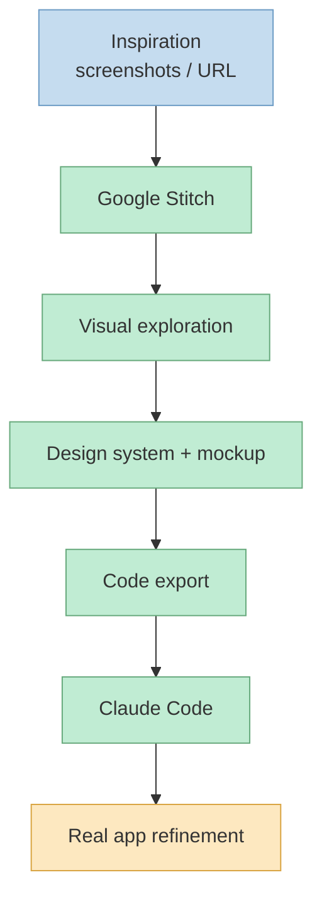
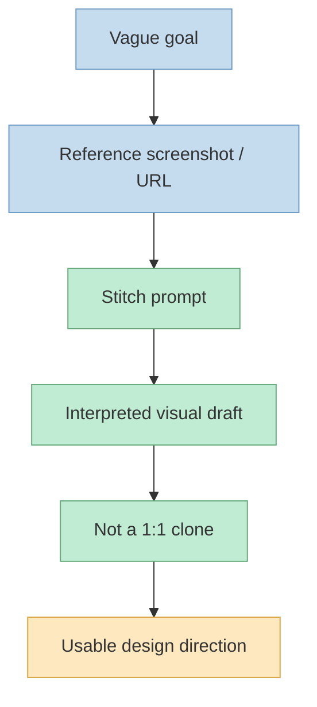
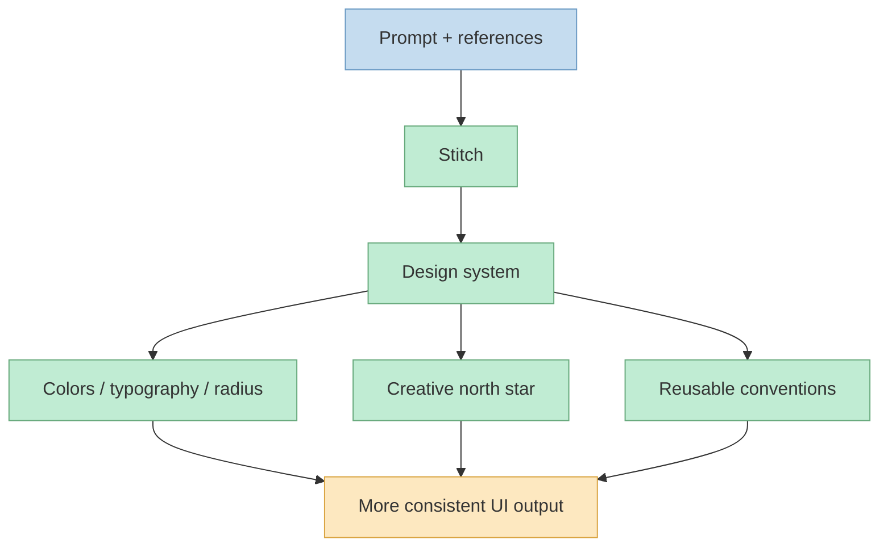
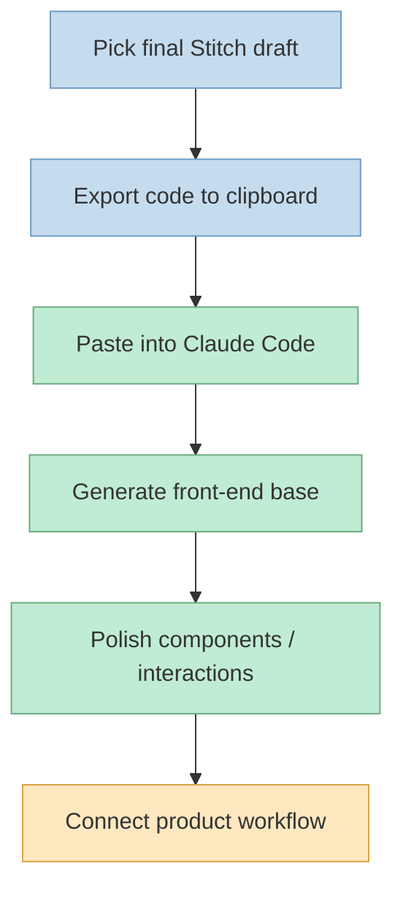

이 영상이 흥미로운 이유는 Google Stitch를 "Claude Code의 대체품" 으로 소개하지 않는다는 데 있습니다. 발표자는 오히려 Claude Code의 약점으로 느끼는 프런트엔드 디자인 구간만 Stitch로 먼저 처리하고, 그다음 코드를 Claude Code로 넘겨 제품화하는 식으로 역할을 나눠야 한다고 설명합니다. 즉 핵심은 모델 하나를 바꾸는 것이 아니라, 시작점을 어디에 두느냐를 바꾸는 데 있습니다 (근거: [t=24](https://youtu.be/qqcpiDXPCvY?t=24), [t=45](https://youtu.be/qqcpiDXPCvY?t=45), [t=83](https://youtu.be/qqcpiDXPCvY?t=83), [t=117](https://youtu.be/qqcpiDXPCvY?t=117), [t=138](https://youtu.be/qqcpiDXPCvY?t=138)).

그래서 이 글은 이 영상을 단순한 툴 소개가 아니라 `영감 수집 -> Stitch에서 시안과 디자인 시스템 생성 -> 반복 탐색 -> 코드 내보내기 -> Claude Code에서 마무리` 라는 워크플로 문서로 읽습니다. 발표자가 계속 강조하는 것도 "완제품을 한 번에 뽑는다" 가 아니라, 시각적 품질이 중요한 초반 탐색을 더 싼 비용과 더 빠른 반복으로 처리한 뒤 Claude Code에서 실제 앱으로 이어 가는 방식입니다 (근거: [t=97](https://youtu.be/qqcpiDXPCvY?t=97), [t=117](https://youtu.be/qqcpiDXPCvY?t=117), [t=138](https://youtu.be/qqcpiDXPCvY?t=138), [t=653](https://youtu.be/qqcpiDXPCvY?t=653), [t=699](https://youtu.be/qqcpiDXPCvY?t=699), [t=725](https://youtu.be/qqcpiDXPCvY?t=725)).

<!--more-->

## Sources

- https://www.youtube.com/watch?v=qqcpiDXPCvY

## 1) 핵심은 "Claude Code를 버리기" 가 아니라 "시작점을 바꾸기" 다

발표자의 문제의식은 꽤 분명합니다. Claude Code가 코딩 에이전트로는 강력하지만, 화면을 예쁘게 잡고 여러 시안을 비교해 가며 시각적 결정을 내리는 과정에서는 답답함이 남는다는 것입니다. 그래서 그는 Stitch를 Claude Code의 경쟁자로 놓지 않고, 프런트엔드 시안 작업을 먼저 맡기는 전처리 도구로 둡니다. 여기서 중요한 포인트는 "무엇을 잘 못하느냐" 보다 "어느 구간에서 반복 비용이 크냐" 를 기준으로 툴을 배치한다는 점입니다 (근거: [t=17](https://youtu.be/qqcpiDXPCvY?t=17), [t=58](https://youtu.be/qqcpiDXPCvY?t=58), [t=72](https://youtu.be/qqcpiDXPCvY?t=72), [t=83](https://youtu.be/qqcpiDXPCvY?t=83), [t=117](https://youtu.be/qqcpiDXPCvY?t=117)).

이 관점에서 보면 Stitch의 장점은 결과물 하나보다 작업 표면 자체에 있습니다. 발표자는 넓은 캔버스에서 시안을 한눈에 보고, 개별 컴포넌트를 클릭해 수정하고, 레이아웃을 여러 번 다시 뽑아 보면서 시각적 판단을 빨리 내릴 수 있다고 말합니다. 반대로 같은 탐색을 Claude Code 안에서 하려면 스크린샷을 넣고, 개발 서버를 띄우고, 탭을 오가며 확인하는 식으로 비용이 더 커집니다. 결국 Stitch는 "더 좋은 최종 코드 생성기" 라기보다 "더 빠른 시각 탐색기" 로 읽는 편이 정확합니다 (근거: [t=72](https://youtu.be/qqcpiDXPCvY?t=72), [t=83](https://youtu.be/qqcpiDXPCvY?t=83), [t=97](https://youtu.be/qqcpiDXPCvY?t=97), [t=117](https://youtu.be/qqcpiDXPCvY?t=117), [t=138](https://youtu.be/qqcpiDXPCvY?t=138)).

## 2) Stitch 입력 품질은 긴 프롬프트보다 참고 이미지와 URL에 더 크게 좌우된다

영상에서 발표자가 보여 주는 입력 전략은 의외로 단순합니다. 먼저 웹인지 앱인지 유형을 고르고, 필요하면 파일이나 URL을 넣고, 무엇보다 참고하고 싶은 사이트를 찾아 스크린샷이나 웹 주소를 함께 줍니다. 그는 영감을 찾는 장소로 Dribbble, Godly, Pinterest 같은 곳을 언급하면서, 그냥 막연한 설명만 던지기보다 "내가 원하는 분위기" 를 먼저 시각 자료로 확보하는 편이 낫다고 설명합니다. 즉 프롬프트 엔지니어링보다 레퍼런스 엔지니어링에 더 가깝습니다 (근거: [t=183](https://youtu.be/qqcpiDXPCvY?t=183), [t=214](https://youtu.be/qqcpiDXPCvY?t=214), [t=234](https://youtu.be/qqcpiDXPCvY?t=234), [t=253](https://youtu.be/qqcpiDXPCvY?t=253), [t=282](https://youtu.be/qqcpiDXPCvY?t=282)).

그다음이 더 중요합니다. 발표자는 AI 에이전시용 랜딩 페이지를 만들면서 "스크린샷과 같은 스타일로, 같은 히어로 구성을 원한다" 정도의 비교적 짧은 요청만 넣고 결과를 봅니다. 그리고 이때 Stitch가 스크린샷을 1:1 복사하는 것이 아니라, 참고 이미지를 읽어 자기 식으로 재구성한 시안을 내놓는다고 설명합니다. 이 말은 곧 Stitch를 "복사기" 가 아니라 "시각적 브리프를 해석하는 디자이너" 처럼 다뤄야 한다는 뜻입니다. 레퍼런스는 정확할수록 좋지만, 기대값은 복제가 아니라 재해석이어야 합니다 (근거: [t=282](https://youtu.be/qqcpiDXPCvY?t=282), [t=295](https://youtu.be/qqcpiDXPCvY?t=295), [t=300](https://youtu.be/qqcpiDXPCvY?t=300), [t=316](https://youtu.be/qqcpiDXPCvY?t=316)).

## 3) Stitch의 진짜 산출물은 첫 화면보다 "디자인 시스템 문서" 다

영상 중반에서 발표자가 가장 강조하는 장면은 완성 화면 자체보다 디자인 시스템 영역입니다. 그는 이 영역을 보면서 색상 체계, 버튼과 텍스트 규칙, 검색 바, 라벨, 코너 반경 같은 프런트엔드 관례가 한곳에 모여 있다고 설명합니다. 즉 Stitch가 만드는 것은 단지 예쁜 스크린샷이 아니라, 왜 그 화면이 그렇게 생겼는지를 다시 생성 가능한 규칙 집합으로 정리한 문서와 테마 세트입니다. 프런트엔드 작업을 반복 가능하게 만드는 건 결국 이 계층입니다 (근거: [t=336](https://youtu.be/qqcpiDXPCvY?t=336), [t=349](https://youtu.be/qqcpiDXPCvY?t=349), [t=370](https://youtu.be/qqcpiDXPCvY?t=370), [t=381](https://youtu.be/qqcpiDXPCvY?t=381)).

더 흥미로운 지점은 이 디자인 문서가 별도로 길게 지시하지 않아도 생성된다는 점입니다. 발표자는 Stitch가 프롬프트와 레퍼런스를 받아 `overview`, `creative north star`, 색 전략, 타이포그래피 같은 항목을 갖춘 가이드 문서를 자동으로 만들고, 이것이 AI 티가 강한 전형적 템플릿에서 벗어나는 데 도움을 준다고 말합니다. 여기서 실무적으로 배울 점은 분명합니다. 좋은 결과물은 화면 한 장에서 끝나지 않고, 이후 편집과 구현이 따라갈 수 있는 언어적 설계 문서까지 함께 있어야 한다는 것입니다 (근거: [t=406](https://youtu.be/qqcpiDXPCvY?t=406), [t=417](https://youtu.be/qqcpiDXPCvY?t=417), [t=428](https://youtu.be/qqcpiDXPCvY?t=428), [t=436](https://youtu.be/qqcpiDXPCvY?t=436)).

## 4) Variants와 편집 도구의 가치는 "정답 생성" 이 아니라 "빠른 취향 수렴" 에 있다

초기 시안이 나온 뒤 발표자가 하는 행동은 명확합니다. 마음에 들지 않으면 바로 regenerate를 누르고, 레이아웃과 색상, 이미지에 대한 variants를 여러 개 뽑고, custom 옵션으로 창의 범위를 조절합니다. 그리고 개별 컴포넌트를 직접 찍어 수정하거나, 미리보기로 전체 화면을 열어 감각을 다시 확인합니다. 이 과정에서 Stitch의 진짜 장점은 한 번에 정답을 뽑는 능력이 아니라, "내가 뭘 좋아하는지" 를 짧은 루프 안에서 빠르게 좁혀 간다는 데 있습니다 (근거: [t=475](https://youtu.be/qqcpiDXPCvY?t=475), [t=485](https://youtu.be/qqcpiDXPCvY?t=485), [t=499](https://youtu.be/qqcpiDXPCvY?t=499), [t=519](https://youtu.be/qqcpiDXPCvY?t=519), [t=538](https://youtu.be/qqcpiDXPCvY?t=538)).

후반에 잠깐 보여 주는 live mode도 같은 맥락에서 보는 편이 좋습니다. 발표자는 화면을 보며 음성으로 "배경에 모션을 넣어 달라" 고 말하고, Stitch가 커서 반응형 배경 효과를 제안하는 모습을 보여 줍니다. 다만 그는 동시에 이 기능이 실제로 얼마나 강한지, 어떤 모델이 도는지 자신도 확신하지 못한다고 말합니다. 그래서 이 글의 해석으로는 live mode는 핵심 축이라기보다 보너스 기능입니다. 이 워크플로의 본체는 어디까지나 variants, 편집, 미리보기, 재생성으로 이루어진 반복 루프입니다 (근거: [t=589](https://youtu.be/qqcpiDXPCvY?t=589), [t=600](https://youtu.be/qqcpiDXPCvY?t=600), [t=618](https://youtu.be/qqcpiDXPCvY?t=618), [t=632](https://youtu.be/qqcpiDXPCvY?t=632), [t=653](https://youtu.be/qqcpiDXPCvY?t=653)).

## 5) 마지막 단계는 Code to Clipboard로 Claude Code에 넘기고, 거기서 제품으로 완성하는 것이다

발표자가 정리하는 최종 핸드오프는 단순합니다. Stitch에서 마음에 드는 시안을 고른 뒤 `More -> Export -> Code to clipboard` 를 누르고, 그 프런트엔드 코드를 Claude Code에 붙여 넣어 랜딩 페이지 생성을 요청합니다. 그러면 Claude Code가 그 초안을 바탕으로 빠르게 결과를 뽑아 주고, 발표자는 이를 "백엔드에 연결되지는 않았지만 출발점으로 충분히 좋은 베이스" 라고 평가합니다. 즉 Stitch가 담당하는 것은 시각적 초안과 구조이고, Claude Code가 이어받는 것은 그 초안을 실제 애플리케이션 작업 흐름으로 가져가는 단계입니다 (근거: [t=653](https://youtu.be/qqcpiDXPCvY?t=653), [t=662](https://youtu.be/qqcpiDXPCvY?t=662), [t=673](https://youtu.be/qqcpiDXPCvY?t=673), [t=699](https://youtu.be/qqcpiDXPCvY?t=699)).

이렇게 하면 얻는 이점도 분명합니다. 디자인 탐색에서 많은 토큰과 반복을 Claude Code 안에서 태우지 않아도 되고, Claude Code는 이미 잡혀 있는 프런트엔드 방향 위에서 구현과 세부 다듬기로 집중할 수 있습니다. 발표자가 이후 21st.dev 같은 리소스로 버튼이나 인터랙션을 더 고급스럽게 손볼 수 있다고 말하는 것도 같은 맥락입니다. 다시 말해 Stitch에서 80~90%짜리 시각 초안을 만들고 Claude Code에서 제품화하는 구조는, 하나의 도구로 모든 문제를 풀려는 접근보다 현실적인 분업 모델입니다 (근거: [t=699](https://youtu.be/qqcpiDXPCvY?t=699), [t=714](https://youtu.be/qqcpiDXPCvY?t=714), [t=721](https://youtu.be/qqcpiDXPCvY?t=721), [t=739](https://youtu.be/qqcpiDXPCvY?t=739), [t=772](https://youtu.be/qqcpiDXPCvY?t=772)).

## 실전 적용 포인트

- 프런트엔드 감도가 중요한 작업이라면 Claude Code를 바로 여는 대신, 먼저 원하는 분위기의 스크린샷이나 URL을 모아 Stitch에 넣는 편이 낫습니다. 영상에서 발표자도 긴 설명보다 레퍼런스 확보를 먼저 권합니다 (근거: [t=214](https://youtu.be/qqcpiDXPCvY?t=214), [t=234](https://youtu.be/qqcpiDXPCvY?t=234), [t=253](https://youtu.be/qqcpiDXPCvY?t=253), [t=282](https://youtu.be/qqcpiDXPCvY?t=282)).
- Stitch는 완성품 생성기보다 80~90%짜리 프런트엔드 초안을 만드는 도구로 보는 편이 현실적입니다. 발표자도 이 정도 수준의 초안만 확보해도 충분히 가치가 있다고 설명합니다 (근거: [t=117](https://youtu.be/qqcpiDXPCvY?t=117), [t=699](https://youtu.be/qqcpiDXPCvY?t=699), [t=721](https://youtu.be/qqcpiDXPCvY?t=721)).
- 첫 화면만 보고 끝내지 말고, Stitch가 뽑아 준 디자인 시스템 문서를 다음 단계의 기준 문서로 활용하는 것이 좋습니다. 색상, 타이포그래피, 코너 반경, 톤 방향이 모두 여기에 모여 있기 때문입니다 (근거: [t=336](https://youtu.be/qqcpiDXPCvY?t=336), [t=370](https://youtu.be/qqcpiDXPCvY?t=370), [t=406](https://youtu.be/qqcpiDXPCvY?t=406), [t=436](https://youtu.be/qqcpiDXPCvY?t=436)).
- 시안 선택 단계에서는 variants와 regenerate를 적극적으로 써서 취향을 좁히고, Claude Code는 그다음 구현과 정리에 집중시키는 편이 역할 분담이 분명합니다 (근거: [t=475](https://youtu.be/qqcpiDXPCvY?t=475), [t=499](https://youtu.be/qqcpiDXPCvY?t=499), [t=653](https://youtu.be/qqcpiDXPCvY?t=653), [t=699](https://youtu.be/qqcpiDXPCvY?t=699)).
- live mode 같은 기능은 흥미롭지만 영상 속 발표자 본인도 품질을 단정하지 않습니다. 따라서 핵심 파이프라인은 실험 기능이 아니라 검증된 export 흐름에 두는 편이 안전합니다 (근거: [t=600](https://youtu.be/qqcpiDXPCvY?t=600), [t=632](https://youtu.be/qqcpiDXPCvY?t=632), [t=653](https://youtu.be/qqcpiDXPCvY?t=653)).

## 핵심 요약

- 이 영상의 요지는 "Claude Code를 버려라" 가 아니라 "시각 탐색은 Stitch에서 먼저 하라" 입니다 (근거: [t=24](https://youtu.be/qqcpiDXPCvY?t=24), [t=83](https://youtu.be/qqcpiDXPCvY?t=83), [t=117](https://youtu.be/qqcpiDXPCvY?t=117)).
- Stitch 입력의 성패는 긴 프롬프트보다 참고 스크린샷과 URL 같은 시각적 레퍼런스 품질에 더 크게 좌우됩니다 (근거: [t=214](https://youtu.be/qqcpiDXPCvY?t=214), [t=253](https://youtu.be/qqcpiDXPCvY?t=253), [t=282](https://youtu.be/qqcpiDXPCvY?t=282)).
- Stitch의 진짜 강점은 예쁜 한 장보다, 이후 생성과 수정의 기준이 되는 디자인 시스템 문서를 자동으로 세운다는 데 있습니다 (근거: [t=336](https://youtu.be/qqcpiDXPCvY?t=336), [t=406](https://youtu.be/qqcpiDXPCvY?t=406), [t=436](https://youtu.be/qqcpiDXPCvY?t=436)).
- variants와 regenerate는 "정답 한 번에 뽑기" 용도가 아니라 빠르게 취향을 수렴하고 방향을 고정하는 반복 루프입니다 (근거: [t=475](https://youtu.be/qqcpiDXPCvY?t=475), [t=519](https://youtu.be/qqcpiDXPCvY?t=519), [t=538](https://youtu.be/qqcpiDXPCvY?t=538)).
- 최종 구조는 `Stitch로 초안 확보 -> Claude Code로 구현과 마감` 이며, 이 분업이 영상 전체의 실전 핵심입니다 (근거: [t=653](https://youtu.be/qqcpiDXPCvY?t=653), [t=699](https://youtu.be/qqcpiDXPCvY?t=699), [t=714](https://youtu.be/qqcpiDXPCvY?t=714), [t=772](https://youtu.be/qqcpiDXPCvY?t=772)).

## 결론

이 영상을 보고 얻을 수 있는 가장 현실적인 교훈은 하나입니다. 프런트엔드 품질이 중요한 구간에서 코딩 에이전트 하나에게 브리프, 시안 탐색, 디자인 시스템 정의, 구현까지 전부 떠넘기면 반복 비용이 커집니다. 반대로 시각 탐색과 레퍼런스 해석은 Stitch 같은 캔버스형 도구에 맡기고, 그 결과를 Claude Code로 넘겨 제품화하면 각 도구가 잘하는 일을 더 자연스럽게 분담하게 됩니다 (근거: [t=72](https://youtu.be/qqcpiDXPCvY?t=72), [t=117](https://youtu.be/qqcpiDXPCvY?t=117), [t=336](https://youtu.be/qqcpiDXPCvY?t=336), [t=699](https://youtu.be/qqcpiDXPCvY?t=699)).

그래서 이 워크플로의 핵심은 툴 이름이 아니라 순서입니다. 먼저 시각적 영감을 모으고, Stitch에서 디자인 언어와 초안을 고정하고, variants로 방향을 좁힌 뒤, 최종 코드를 Claude Code로 넘겨 실제 앱 작업으로 연결하는 것. 발표자가 보여 준 데모는 짧지만, 이 순서 자체는 앞으로 다른 랜딩 페이지나 마케팅 사이트, 심지어 초기 제품 UI를 잡을 때도 그대로 재사용할 수 있는 운영 패턴으로 읽힙니다 (근거: [t=214](https://youtu.be/qqcpiDXPCvY?t=214), [t=282](https://youtu.be/qqcpiDXPCvY?t=282), [t=475](https://youtu.be/qqcpiDXPCvY?t=475), [t=653](https://youtu.be/qqcpiDXPCvY?t=653), [t=725](https://youtu.be/qqcpiDXPCvY?t=725)).
