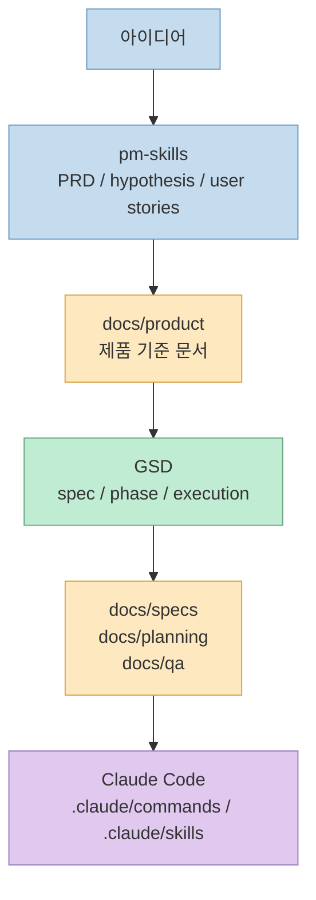
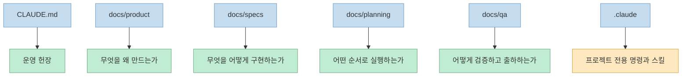
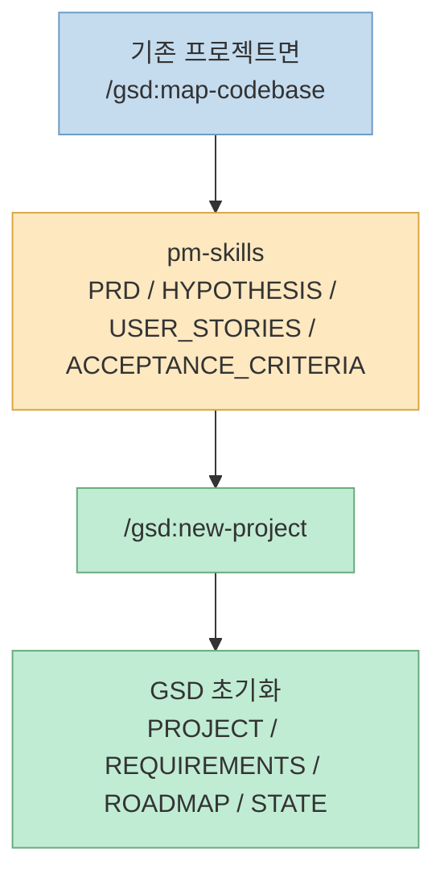
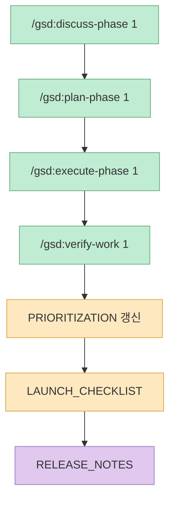
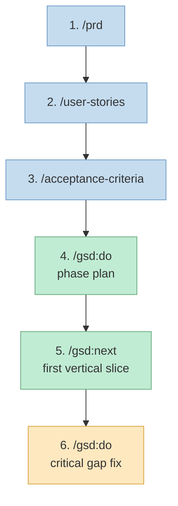

에이전트 기반 개발에서 가장 흔한 실패는 기획 문서와 구현 흐름이 한 덩어리로 섞이는 순간 시작됩니다. 제품 판단이 흔들리면 구현 속도가 빨라질수록 더 멀리 돌아가고, 반대로 구현 규율이 약하면 좋은 PRD가 있어도 프로젝트는 중간에 흐트러집니다.

이럴 때 가장 실전적으로 잘 맞는 조합이 `pm-skills` 와 `GSD` 입니다. `pm-skills` 는 `PRD`, `hypothesis`, `user stories`, `acceptance criteria` 같은 PM 산출물을 구조화하는 쪽이 강하고, `GSD` 는 spec-driven 개발, phase 운영, 컨텍스트 관리, `/gsd:do`, `/gsd:next`, `/gsd:ship` 같은 실행 루프에 강합니다. 그리고 Claude Code는 공식적으로 `skills` 확장 구조를 지원합니다. 그래서 가장 실전적인 운영은 아주 단순하게 정리됩니다.<br>**제품 정의는 pm-skills로 먼저 고정하고, GSD는 그 산출물을 받아 프로젝트 구조와 phase 실행을 관리하는 구조** 입니다.

<!--more-->

## Sources

- [GSD GitHub](https://github.com/gsd-build/get-shit-done)
- [pm-skills GitHub](https://github.com/product-on-purpose/pm-skills)
- [Claude Code Skills Docs](https://code.claude.com/docs/en/skills)

## 먼저 전제만 짚고 가자

- `GSD` 는 spec-driven 개발, 컨텍스트 관리, phase 진행, `/gsd:do`, `/gsd:next`, `/gsd:ship` 같은 실행 흐름이 강합니다.
- `pm-skills` 는 `PRD`, `hypothesis`, `user stories` 같은 원자적 PM 산출물과 여러 skill을 잇는 bundle, workflow 구성이 강합니다.
- Claude Code는 공식적으로 `skills` 와 커스텀 커맨드 확장 구조를 지원합니다.

그래서 이 셋을 한 줄로 정리하면 이렇게 됩니다.<br>`pm-skills` 가 "무엇을 왜 만들지"를 고정하고, `GSD` 가 "현재 코드베이스를 어떻게 이해하고 어떤 phase로 끝낼지"를 실행합니다.



## 1) 추천 폴더 구조

아래 구조는 `pm-skills` 와 `GSD` 를 함께 쓰는 팀이 가장 무리 없이 운영하기 좋은 형태입니다.

```text
project-root/
├─ CLAUDE.md
├─ README.md
├─ docs/
│  ├─ product/
│  │  ├─ PRD.md
│  │  ├─ HYPOTHESIS.md
│  │  ├─ USER_STORIES.md
│  │  ├─ ACCEPTANCE_CRITERIA.md
│  │  ├─ PRIORITIZATION.md
│  │  └─ LAUNCH_CHECKLIST.md
│  ├─ specs/
│  │  ├─ SYSTEM_OVERVIEW.md
│  │  ├─ TECH_SPEC.md
│  │  ├─ API_SPEC.md
│  │  ├─ DATA_MODEL.md
│  │  └─ UI_SPEC.md
│  ├─ planning/
│  │  ├─ PHASE_PLAN.md
│  │  ├─ MILESTONES.md
│  │  ├─ RISKS.md
│  │  └─ DECISIONS.md
│  ├─ qa/
│  │  ├─ TEST_PLAN.md
│  │  ├─ TEST_CASES.md
│  │  └─ RELEASE_NOTES.md
│  └─ archive/
├─ src/
├─ app/
├─ components/
├─ lib/
├─ tests/
├─ scripts/
├─ .planning/
│  ├─ config.json
│  ├─ research/
│  ├─ quick/
│  ├─ todos/
│  └─ threads/
└─ .claude/
   ├─ commands/
   └─ skills/
```

핵심은 이 구조가 예쁘기 때문이 아니라, **문서 책임과 실행 책임을 분리하기 쉽기 때문** 입니다. `docs/product/` 는 PM 산출물의 기준면이고, `docs/specs/`, `docs/planning/`, `docs/qa/` 는 사람이 읽는 구현/검증 문서 레이어입니다. 여기에 `GSD` 의 실행 메모리인 `.planning/` 을 따로 두면, `pm-skills` 의 제품 문서와 `GSD` 의 상태 관리가 서로 덮어쓰지 않습니다.



## 2) 각 폴더 역할

### `CLAUDE.md`

여기에는 프로젝트 운영 원칙을 둡니다. 다시 말해, `GSD` 와 Claude Code가 계속 참조할 운영 헌장입니다.

여기에 들어가야 할 내용은 대체로 아래와 같습니다.

- 이 프로젝트의 source of truth는 `docs/product/*.md`
- 구현 전에는 반드시 `PRD` 와 `user stories` 를 참고
- scope creep 금지
- phase 단위로만 진행
- 테스트 없는 기능 완료 처리 금지

예시 내용은 다음처럼 두면 됩니다.

```md
# Project Rules

## Source of Truth
- docs/product/PRD.md
- docs/product/USER_STORIES.md
- docs/product/ACCEPTANCE_CRITERIA.md

## Working Rules
- Always prefer the thinnest vertical slice first.
- Do not add features outside the PRD unless explicitly approved.
- Every implemented feature must map to at least one user story.
- Before shipping, run test, lint, and typecheck.
```

### `docs/product/`

이 폴더는 **pm-skills 산출물 전용 폴더** 입니다. 즉, 무엇을 왜 만드는지를 담는 곳입니다.

권장 파일은 아래 여섯 개입니다.

- `PRD.md`: 문제 정의, 목표, 범위, 성공 기준을 정리하는 기준 문서
- `HYPOTHESIS.md`: 어떤 가설을 검증할지와 기대 효과를 정리하는 문서
- `USER_STORIES.md`: 사용자 관점의 핵심 시나리오와 요구를 적는 문서
- `ACCEPTANCE_CRITERIA.md`: 기능이 완료됐다고 볼 조건을 명확히 적는 문서
- `PRIORITIZATION.md`: 무엇을 먼저 만들지와 그 우선순위 이유를 정리하는 문서
- `LAUNCH_CHECKLIST.md`: 출시 직전 반드시 확인할 항목을 점검하는 문서

프로젝트가 흔들릴 때 다시 돌아와야 하는 첫 번째 폴더도 여기입니다. 구현이 빨라질수록 이 폴더의 중요성은 더 커집니다.

### `docs/specs/`

여기는 제품 문서를 개발 명세로 번역한 결과를 두는 곳입니다.

예를 들면 아래와 같습니다.

- 시스템 구조
- API 계약
- 데이터 모델
- UI 상태 정의
- 비기능 요구사항

즉, `docs/product/` 가 제품 언어라면 `docs/specs/` 는 구현 언어입니다. 같은 내용을 반복하는 것이 아니라, 제품 결정을 구현 가능한 문서로 변환하는 레이어라고 이해하면 됩니다.

### `docs/planning/`

이 폴더는 **사람이 읽고 관리하기 좋은 실행 문서 폴더** 로 두는 편이 좋습니다.

예를 들면 아래와 같습니다.

- `PHASE_PLAN.md`
- `MILESTONES.md`
- `RISKS.md`
- `DECISIONS.md`

이번 스프린트, 현재 phase, 보류 이슈, 결정 이유 같은 내용이 여기에 쌓이면 팀 커뮤니케이션과 회고에 아주 잘 맞습니다. 다만 `GSD` 의 공식 실행 흐름은 별도의 상태 파일과 `.planning/` 메모리를 함께 사용하므로, 이 폴더를 GSD의 내부 런타임 저장소로 간주하기보다는 사람이 읽는 운영 문서 레이어로 두는 편이 덜 꼬입니다.

### `docs/qa/`

여기는 출시 전 점검용입니다.

예를 들면 아래와 같습니다.

- 테스트 전략
- 핵심 테스트 케이스
- 릴리즈 노트
- known issues

`/gsd:ship` 직전에 이 폴더가 정리돼 있으면 실제 출하 판단이 훨씬 쉬워집니다. 제품이 "대충 동작한다" 와 "내보낼 수 있다" 는 전혀 다르기 때문입니다.

### `.planning/` 과 GSD 상태 파일

여기는 **GSD가 실제로 굴러갈 때 쓰는 실행 메모리 레이어** 입니다. 공식 흐름에서는 브라운필드 프로젝트면 먼저 `/gsd:map-codebase` 로 현재 코드베이스를 분석하고, 그 다음 `/gsd:new-project` 로 프로젝트 컨텍스트를 초기화합니다.

이 과정에서 핵심적으로 관리되는 것은 대체로 아래 계열입니다.

- `PROJECT.md`: 프로젝트 비전, 기술 맥락, 큰 방향을 잡는 문서
- `REQUIREMENTS.md`: v1, v2, out-of-scope 범위를 정리하는 문서
- `ROADMAP.md`: 요구사항을 phase로 나눈 실행 문서
- `STATE.md`: 현재 위치, 결정 사항, blocker를 남기는 문서
- `.planning/research/`: 조사 결과를 쌓는 폴더
- `.planning/quick/`: 가벼운 ad-hoc 작업을 분리해 두는 폴더

실전에서는 `docs/product/` 를 source of truth로 두고, GSD는 그 내용을 읽어 이 레이어를 갱신하게 두는 방식이 가장 안정적입니다.

### `.claude/commands`, `.claude/skills`

Claude Code는 공식적으로 프로젝트 로컬 skill과 커맨드 확장 구조를 지원합니다. 이 폴더에는 팀이 자주 쓰는 프로젝트 전용 워크플로를 넣으면 됩니다.

예를 들면 아래 같은 것들입니다.

- feature kickoff 템플릿
- PRD 검토 프롬프트
- review 프롬프트
- ship 체크 프롬프트
- 팀 공통 slash command

이 폴더를 두면 반복 프롬프트가 문서화되고, 개인 습관이 아니라 팀 자산으로 남습니다.

## 3) 가장 추천하는 문서 흐름

공식 GSD는 `new-project` 와 `map-codebase` 를 중심으로 프로젝트를 초기화합니다. 하지만 `pm-skills` 와 함께 쓸 때는 제품 정의를 먼저 `pm-skills` 로 고정하고, 그 결과를 GSD에 먹여 phase 실행으로 넘기는 방식이 가장 덜 중복됩니다.

실전에서는 아래 순서가 가장 안정적입니다.

1. 기존 코드베이스라면 `/gsd:map-codebase`
2. `docs/product/PRD.md`
3. `docs/product/HYPOTHESIS.md`
4. `docs/product/USER_STORIES.md`
5. `docs/product/ACCEPTANCE_CRITERIA.md`
6. 제품 문서를 기준으로 `/gsd:new-project`
7. `GSD` 가 `PROJECT.md`, `REQUIREMENTS.md`, `ROADMAP.md`, `STATE.md` 를 초기화
8. `/gsd:discuss-phase 1`
9. `/gsd:plan-phase 1`
10. `/gsd:execute-phase 1`
11. `/gsd:verify-work 1`
12. 구현 중 판단 변경 시 `docs/product/PRIORITIZATION.md` 갱신
13. 출시 전 `docs/product/LAUNCH_CHECKLIST.md`
14. 마무리 `docs/qa/RELEASE_NOTES.md`

그린필드 프로젝트라면 1번의 `/gsd:map-codebase` 는 생략하면 됩니다.

즉, 흐름은 이렇게 정리됩니다.

- `pm-skills` → product docs 작성
- `GSD` → 코드베이스 이해, 프로젝트 초기화, phase 실행





이 순서의 장점은 분명합니다. `pm-skills` 와 `GSD` 가 둘 다 요구사항을 중복 작성하지 않게 되고, 브라운필드에서는 `map-codebase` 로 현재 코드베이스를 먼저 읽힌 뒤 제품 문서를 반영할 수 있습니다. 즉, 제품 판단은 `pm-skills` 가 고정하고, GSD는 그 판단을 자기 상태 파일과 phase 계획으로 번역해 실행하는 구조가 됩니다. 구현 중에 다시 판단이 필요하면 `PRIORITIZATION.md` 를 갱신하면 되고, 출시 전에는 `LAUNCH_CHECKLIST.md` 와 `RELEASE_NOTES.md` 가 출하 판단의 기준이 됩니다.

## 4) 바로 복붙해서 쓰는 한글 프롬프트 20개

아래 프롬프트는 실전용입니다. 원래 영어로 많이 공유되지만, 팀 내 반복 사용을 생각하면 한글 프롬프트로 통일해 두는 편이 운영상 더 편합니다.

### A. pm-skills용 프롬프트 1~8

#### 1. PRD 작성

```text
/prd
이 프로젝트의 MVP PRD를 작성해 주세요.

제품 아이디어:
[여기에 아이디어]

타깃 사용자:
[여기에 사용자]

해결하려는 문제:
[여기에 문제]

제약 조건:
[여기에 일정/인력/예산/기술 제약]

출력 요구사항:
- 목표
- 비목표
- 사용자 흐름
- 기능 요구사항
- 성공 지표
- MVP 범위만 포함

결과는 docs/product/PRD.md에 저장해 주세요.
```

#### 2. Hypothesis 작성

```text
/hypothesis
이 프로젝트 아이디어를 바탕으로 가설 문서를 작성해 주세요.

컨텍스트:
- 제품: [제품명]
- 사용자: [타깃 유저]
- 핵심 가치: [핵심 가치]

출력 항목:
- 핵심 가설
- 가정
- 주요 리스크
- MVP에서 검증하는 방법
- 어떤 결과가 나오면 가설이 틀렸다고 볼지

결과는 docs/product/HYPOTHESIS.md에 저장해 주세요.
```

#### 3. User Stories 작성

```text
/user-stories
docs/product/PRD.md를 바탕으로 MVP user stories를 작성해 주세요.

요구사항:
- P0, P1, P2로 우선순위를 나눠 주세요.
- 명확한 user story 형식을 사용해 주세요.
- 각 story마다 acceptance criteria를 포함해 주세요.
- MVP 범위만 남겨 주세요.

결과는 docs/product/USER_STORIES.md에 저장해 주세요.
```

#### 4. Acceptance Criteria 강화

```text
/acceptance-criteria
docs/product/PRD.md와 docs/product/USER_STORIES.md를 읽고
엄격하고 테스트 가능한 acceptance criteria를 작성해 주세요.

요구사항:
- 모호한 표현을 피할 것
- 각 기준이 관찰 가능하도록 쓸 것
- user story와 criteria를 서로 매핑할 것

결과는 docs/product/ACCEPTANCE_CRITERIA.md에 저장해 주세요.
```

#### 5. Prioritization 재정리

```text
/prioritization
docs/product/PRD.md와 docs/product/USER_STORIES.md를 검토해 주세요.

다음 기준으로 backlog 우선순위를 다시 매겨 주세요.
- 영향도
- 리스크
- 구현 비용
- MVP 긴급도

출력 형식:
- 유지할 것
- 제거할 것
- 뒤로 미룰 것
- 판단 근거

결과는 docs/product/PRIORITIZATION.md에 저장해 주세요.
```

#### 6. Launch Checklist 작성

```text
/launch-checklist
MVP 범위를 기준으로 최소 출시 체크리스트를 작성해 주세요.

반드시 포함할 항목:
- QA
- 분석 도구
- 지원 리스크
- 롤아웃 체크리스트
- 알려진 주의사항
- 출시 후 1주 차 성공 지표

결과는 docs/product/LAUNCH_CHECKLIST.md에 저장해 주세요.
```

#### 7. 문제 정의 다시 다듬기

```text
/problem-statement
이 제품의 핵심 문제 정의를 다시 써 주세요.

컨텍스트:
- 현재 PRD: docs/product/PRD.md
- 가설 문서: docs/product/HYPOTHESIS.md

요구사항:
- 문제를 더 날카롭게 만들 것
- 현재 사용자의 고통을 더 분명히 설명할 것
- 기존 대안이 왜 충분히 해결하지 못하는지 설명할 것
- 짧고 의사결정에 바로 쓸 수 있게 쓸 것
```

#### 8. Feature scope 잘라내기

```text
/prioritization
우리는 지금 범위를 공격적으로 줄여야 합니다.

다음 문서를 읽어 주세요.
- docs/product/PRD.md
- docs/product/USER_STORIES.md
- docs/product/ACCEPTANCE_CRITERIA.md

반환 형식:
- 정말 최소한의 MVP
- 뒤로 미룰 것
- 지금 완전히 제거할 것
- 너무 많이 잘랐을 때의 리스크
```

### B. GSD용 프롬프트 9~16

#### 9. 프로젝트 실행 시작

```text
/gsd:do
다음 파일을 이 프로젝트의 source of truth로 사용해 주세요.
- docs/product/PRD.md
- docs/product/USER_STORIES.md
- docs/product/ACCEPTANCE_CRITERIA.md

검증 체크포인트가 있는 실용적인 구현 계획을 phase 단위로 만들어 주세요.
planning 문서는 docs/planning/ 아래에 저장해 주세요.
```

#### 10. 첫 vertical slice 만들기

```text
/gsd:next
가장 작지만 가치가 높은 vertical slice부터 시작해 주세요.

요구사항:
- 가장 얇지만 실제로 쓸 수 있는 end-to-end 경로만 만들 것
- 불필요한 추가 기능은 넣지 말 것
- 무엇을 의도적으로 미루는지 설명할 것
- 모든 결정은 docs/product/PRD.md와 정렬될 것
```

#### 11. 기술 명세 생성

```text
/gsd:do
제품 문서를 기술 명세로 번역해 주세요.

다음 문서를 읽어 주세요.
- docs/product/PRD.md
- docs/product/USER_STORIES.md
- docs/product/ACCEPTANCE_CRITERIA.md

다음 파일을 생성해 주세요.
- docs/specs/SYSTEM_OVERVIEW.md
- docs/specs/TECH_SPEC.md
- docs/specs/API_SPEC.md
- docs/specs/DATA_MODEL.md
```

#### 12. 현재 phase 실행

```text
/gsd:do
docs/planning/PHASE_PLAN.md에 정의된 현재 phase를 실행해 주세요.

규칙:
- 변경은 최소 범위로 유지할 것
- 테스트 가능하게 만들 것
- 범위를 넓히지 말 것
- 구현 결정이 바뀌면 문서도 함께 갱신할 것
- 무엇을 끝냈고 무엇이 남았는지 요약할 것
```

#### 13. 다음 단계 자동 진행

```text
/gsd:next
현재 구현 상태를 검토하고 다음 논리적 단계를 진행해 주세요.

규칙:
- 아직 끝나지 않은 MVP 작업 중 가장 가치가 높은 것을 우선할 것
- 있으면 좋은 수준의 작업은 무시할 것
- 빠르게 검증 가능한 작은 단위로 유지할 것
```

#### 14. 구현 vs PRD 감사

```text
/gsd:do
코드베이스를 다음 문서와 대조해 감사해 주세요.
- docs/product/PRD.md
- docs/product/USER_STORIES.md
- docs/product/ACCEPTANCE_CRITERIA.md

반환 형식:
- 올바르게 구현된 것
- 빠진 것
- 일부만 구현된 것
- 범위를 벗어난 추가 구현

그다음 MVP에서 치명적인 빈틈만 수정해 주세요.
```

#### 15. 테스트, 린트, 타입체크 점검

```text
/gsd:do
출시 전 엔지니어링 감사를 실행해 주세요.

점검 항목:
- 테스트
- 린트
- 타입체크
- 눈에 띄는 UX 불일치
- 취약한 에러 케이스

MVP 출시를 실질적으로 막는 이슈만 보고해 주세요.
요약은 상황에 따라 docs/qa/TEST_PLAN.md 또는 docs/qa/RELEASE_NOTES.md에 저장해 주세요.
```

#### 16. 출하 준비

```text
/gsd:ship
이 프로젝트를 출하 가능한 상태로 준비해 주세요.

요구사항:
- 완료된 작업을 요약할 것
- 주의사항을 남길 것
- 깔끔한 PR 요약을 만들 것
- 알려진 리스크를 강조할 것
- docs/product/LAUNCH_CHECKLIST.md와 정렬될 것
```

### C. 혼합 프롬프트 17~20

#### 17. feature kickoff

```text
다음 문서를 읽어 주세요.
- docs/product/PRD.md
- docs/product/USER_STORIES.md
- docs/product/ACCEPTANCE_CRITERIA.md

지금 시작할 새 기능:
[기능명]

1단계: PM 관점에서 기능 범위를 다시 다듬어 주세요.
2단계: acceptance criteria를 정의해 주세요.
3단계: 구현 phase 계획으로 변환해 주세요.
4단계: 가장 작은 동작 버전만 구현해 주세요.
```

#### 18. scope creep 차단

```text
다음 내용을 읽어 주세요.
- docs/product/PRD.md
- docs/product/PRIORITIZATION.md
- 현재 코드 변경 사항

scope creep로 보이는 항목을 식별해 주세요.
각 항목은 아래 셋 중 하나로 분류해 주세요.
- 핵심 MVP
- 유용하지만 나중으로 미룰 것
- 지금은 불필요한 것

그다음 핵심 MVP 작업만 계속 진행해 주세요.
```

#### 19. 출시 준비 종합 점검

```text
다음 내용을 읽어 주세요.
- docs/product/PRD.md
- docs/product/LAUNCH_CHECKLIST.md
- docs/qa/TEST_PLAN.md
- 현재 구현 상태

아래 질문에 답해 주세요.
1. 이 MVP는 지금 출시 가능한가?
2. 출시 리스크 상위 5개는 무엇인가?
3. 출시 전에 빠르게 고칠 수 있는 것은 무엇인가?
4. 어떤 항목은 주의사항으로 명시하고 받아들여야 하는가?
```

#### 20. 문서와 코드 동기화

```text
프로젝트 전체를 읽고 문서와 코드를 동기화해 주세요.

필요하면 아래 파일을 갱신해 주세요.
- docs/product/USER_STORIES.md
- docs/product/ACCEPTANCE_CRITERIA.md
- docs/planning/PHASE_PLAN.md
- docs/qa/RELEASE_NOTES.md

규칙:
- 새로운 범위를 만들어 내지 말 것
- 실제 구현되었거나 명시적으로 계획된 내용만 반영할 것
- 불일치가 있으면 분명하게 표시할 것
```

## 5) 가장 실전적인 운영 규칙

이 조합은 아래 규칙으로 굴리면 가장 안정적입니다.

### 규칙 1

**pm-skills는 product 문서 생성 전용으로 사용** 합니다.

대표 산출물은 아래와 같습니다.

- `PRD`
- `hypothesis`
- `user stories`
- `launch checklist`

### 규칙 2

**GSD는 execution 전용으로 사용** 합니다.

대표 책임은 아래와 같습니다.

- phase 계획
- 구현
- 검증
- ship

### 규칙 3

문서는 항상 아래 세 파일을 핵심 기준으로 유지합니다.

- `docs/product/PRD.md`
- `docs/product/USER_STORIES.md`
- `docs/product/ACCEPTANCE_CRITERIA.md`

### 규칙 4

새 기능을 시작하기 전에는 항상 아래 질문을 던집니다.

- 이 기능이 PRD 범위 안에 있는가
- 어떤 user story와 연결되는가
- acceptance criteria가 이미 있는가

이 네 가지 규칙만 지켜도, `pm-skills` 와 `GSD` 가 서로 충돌하지 않고 같은 프로젝트를 밀어 주는 구조가 됩니다.

## 6) 바로 시작할 때의 추천 순서

실제로는 아래 여섯 단계만 먼저 돌리면 됩니다.

1. `PRD` 작성
2. `USER_STORIES` 작성
3. `ACCEPTANCE_CRITERIA` 작성
4. `GSD` 로 phase plan 생성
5. `GSD` 로 첫 vertical slice 시작
6. 구현을 PRD와 대조해 critical gap만 수정

바로 복붙해서 시작하려면 아래 여섯 프롬프트만 먼저 쓰면 됩니다.

```text
/prd
[프로젝트 아이디어를 넣고 MVP PRD를 작성해 달라고 요청]
```

```text
/user-stories
[PRD를 바탕으로 MVP user stories를 작성해 달라고 요청]
```

```text
/acceptance-criteria
[user stories를 기준으로 테스트 가능한 acceptance criteria를 작성해 달라고 요청]
```

```text
/gsd:do
docs/product/*.md를 source of truth로 사용하고 phase plan을 만들어 주세요.
```

```text
/gsd:next
가장 얇지만 동작하는 vertical slice부터 시작해 주세요.
```

```text
/gsd:do
구현을 PRD와 대조해 MVP에 치명적인 빈틈만 수정해 주세요.
```



## 7) 제 추천 한 줄 정리

가장 좋은 구조는 아래 세 줄로 끝납니다.

- `docs/product/` = `pm-skills` 의 영역
- `docs/specs/`, `docs/planning/`, `docs/qa/` = `GSD` 의 영역
- `CLAUDE.md` = 둘을 묶는 운영 규칙

이렇게 두면 기획은 흐트러지지 않고, 구현은 계속 앞으로 나갑니다.

## 마무리

결국 중요한 것은 어느 도구가 더 강하냐가 아닙니다. **어느 순간에 어떤 역할을 맡기느냐** 가 더 중요합니다. `pm-skills` 를 구현 엔진처럼 쓰면 느려지고, `GSD` 를 PM 프레임워크처럼 쓰면 기획 품질이 들쭉날쭉해집니다.

반대로 역할을 이렇게 자르면 흐름이 단순해집니다.<br>`pm-skills` 는 product 문서를 고정하고, `GSD` 는 spec과 phase를 굴리고, `CLAUDE.md` 와 `.claude/` 가 팀 운영 규칙을 붙잡아 줍니다. 실전에서 필요한 것은 화려한 프롬프트보다 **기준 문서, 실행 phase, 출하 판단이 분리된 구조** 입니다. 이 글의 폴더 구조와 한글 프롬프트 20개는 바로 그 구조를 처음부터 흔들리지 않게 잡기 위한 최소 세트라고 보면 됩니다.
