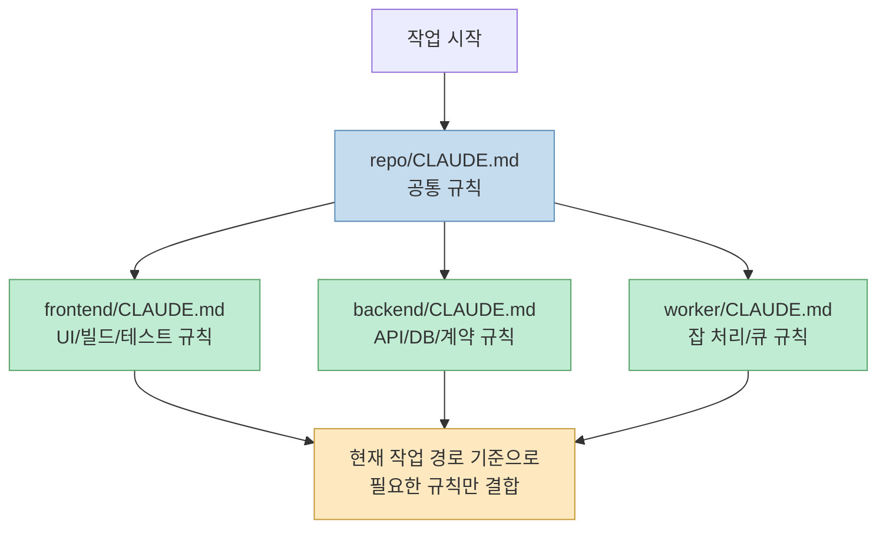
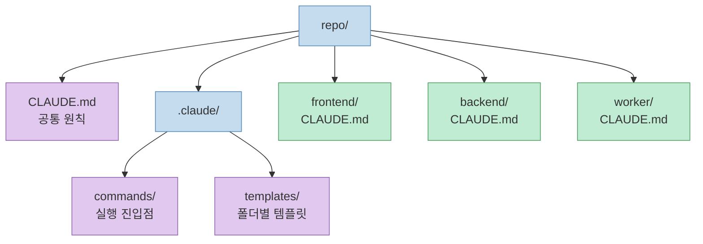
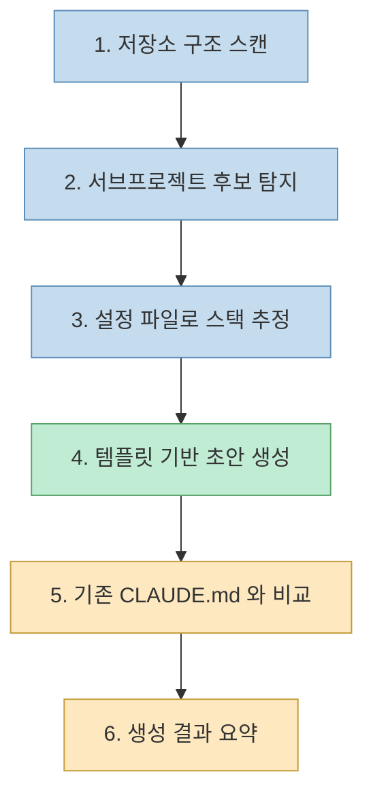
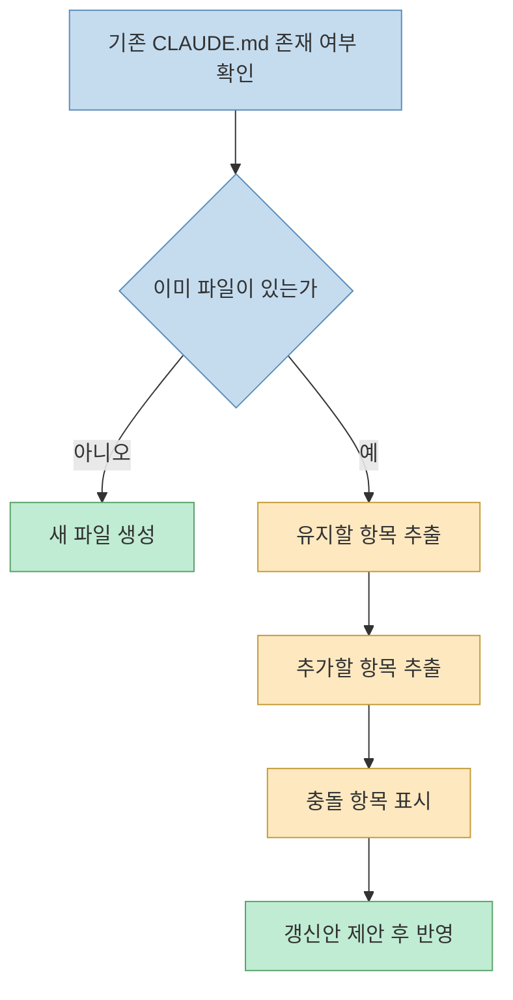

모노레포에서 `CLAUDE.md` 를 하나만 두면 금방 복잡해진다. 프런트엔드 규칙, 백엔드 테스트 명령, 워커 금지 사항이 한 파일에 섞이기 시작하면, 결국 "항상 읽히지만 대부분 지금 작업과는 무관한 지침"이 된다. 그래서 실무에서는 **루트에는 공통 규칙만**, **하위 폴더에는 그 서브프로젝트 전용 규칙만** 두는 쪽이 훨씬 잘 맞는다.

이 글은 그 구조를 어떻게 나누면 좋은지, 그리고 `frontend/`, `backend/`, `worker/`, `apps/*`, `packages/*` 같은 폴더를 스캔해서 각자에 맞는 `CLAUDE.md` 를 생성하는 `init-subproject-claude` 스킬은 어떻게 설계하면 좋은지를 한 번에 정리한 글이다.

<!--more-->

## Sources

- [How Claude remembers your project - Claude Code Docs](https://docs.anthropic.com/en/docs/claude-code/memory)
- [Extend Claude with skills - Claude Code Docs](https://docs.anthropic.com/en/docs/claude-code/slash-commands)

---

## 왜 루트 하나로는 부족한가

모노레포에서 가장 먼저 부딪히는 문제는 "규칙의 범위"다.

- 루트 규칙은 저장소 전체에 공통으로 적용되어야 한다
- 하위 규칙은 해당 폴더에서만 의미가 있어야 한다
- 서로 다른 기술 스택의 명령과 금지 사항이 섞이면 정확도가 떨어진다

핵심은 단순하다.

- 루트 `CLAUDE.md` 에는 공통 원칙만 적는다
- `frontend/CLAUDE.md`, `backend/CLAUDE.md` 같은 하위 파일에는 폴더 전용 규칙만 적는다
- 같은 저장소라도 작업 위치와 읽는 파일 위치에 따라 필요한 규칙만 더 구체적으로 쌓이게 만든다



이렇게 나누면 루트는 "항상 맞는 말"만 담고, 하위 파일은 "지금 그 폴더에서만 맞는 말"만 담게 된다. 실무에서 중요한 건 문서 양이 아니라 **작업 맥락에 맞는 규칙 밀도** 다.

---

## 추천 디렉터리 구조

처음에는 아래 정도 구조면 충분하다.

```text
repo/
├─ CLAUDE.md
├─ .claude/
│  ├─ commands/
│  │  └─ init-subproject-claude.md
│  └─ templates/
│     ├─ claude-root.md
│     ├─ claude-frontend.md
│     ├─ claude-backend.md
│     └─ claude-worker.md
├─ frontend/
│  └─ CLAUDE.md
├─ backend/
│  └─ CLAUDE.md
└─ worker/
   └─ CLAUDE.md
```

루트 `CLAUDE.md` 는 프로젝트 전체 공통 규칙만 갖고, 실제 생성 로직이나 템플릿은 `.claude/` 아래로 내려둔다. 이 구조가 좋은 이유는 명확하다.

- 문서 역할이 분리된다
- 템플릿 수정과 결과 파일 수정을 분리할 수 있다
- 나중에 `apps/*`, `packages/*`, `services/*` 구조로 확장하기 쉽다



---

## init-subproject-claude 스킬이 해야 하는 일

이 스킬의 역할은 단순 생성기가 아니다. **저장소 구조를 읽고, 서브프로젝트를 식별하고, 스택에 맞는 규칙을 최소한으로 조합해 주는 작업기** 에 가깝다.

권장 흐름은 아래와 같다.



실제로는 다음 5가지를 잘하면 된다.

1. 서브프로젝트 후보를 찾는다.
2. `package.json`, `pyproject.toml`, `go.mod`, `Cargo.toml` 같은 파일로 스택을 추정한다.
3. 역할에 맞는 템플릿을 고른다.
4. 기존 `CLAUDE.md` 가 있으면 덮어쓰지 않고 비교한다.
5. 마지막에 어떤 파일이 생성되었고, 각 파일이 무엇을 담당하는지 요약한다.

이 스킬이 반드시 지켜야 할 원칙도 있다.

- 루트 규칙과 충돌하지 않을 것
- 실제로 확인한 명령만 적을 것
- 추측이 필요한 항목은 `확인 필요` 로 표시할 것
- 과한 설명보다 실행 명령과 수정 경계가 먼저 보이게 할 것

---

## 가장 단순한 버전: 단일 SKILL.md 로 시작하기

가장 빨리 시작하는 방법은 커스텀 명령이 아니라, **템플릿 파일 없이 `SKILL.md` 하나만 가진 최소 스킬**로 만드는 것이다.

구조는 이 정도면 충분하다.

```text
.claude/
└─ skills/
   └─ init-subproject-claude/
      └─ SKILL.md
```

예를 들면 `init-subproject-claude/SKILL.md` 는 아래처럼 만들 수 있다.

```md
---
name: init-subproject-claude
description: 모노레포나 멀티패키지 저장소에서 frontend, backend, worker, apps/*, packages/* 같은 서브프로젝트를 찾아 각 폴더용 CLAUDE.md를 생성하거나 갱신한다.
---

이 스킬의 목표는 루트 CLAUDE.md에는 공통 규칙만 두고, 하위 폴더에는 해당 서브프로젝트 전용 규칙만 두도록 정리하는 것이다.

## 수행 절차
1. 저장소 구조를 스캔한다.
2. 서브프로젝트 후보 폴더를 찾는다.
3. 각 폴더에서 package.json, pyproject.toml, go.mod, Cargo.toml, requirements.txt 등을 읽고 스택을 추정한다.
4. 각 폴더에 맞는 CLAUDE.md 초안을 작성한다.
5. 기존 CLAUDE.md가 있으면 덮어쓰지 말고 비교한다.
6. 생성 또는 갱신 결과를 요약한다.

## 각 CLAUDE.md에 반드시 포함할 항목
- 이 폴더의 역할
- 실행 명령
- 테스트 명령
- 수정 원칙
- 금지 사항
- 다른 서브프로젝트와의 경계

## 작성 원칙
- 루트 CLAUDE.md의 공통 원칙과 충돌하지 않게 작성한다.
- 가능한 최소한의 지침만 작성한다.
- 추상적인 표현보다 실제 명령어를 우선한다.
- 실제 파일에서 확인한 명령만 적는다.
- 추측이 필요한 항목은 "확인 필요"라고 쓴다.
```

이 접근의 장점은 빠르다는 것이다. 폴더 하나와 `SKILL.md` 하나만 있으면 바로 시작할 수 있고, 최소 구조만으로도 꽤 실용적이다. 대신 역할별 문구 재사용이나 조직별 표준화가 필요해지면 곧 한계가 온다.

---

## 더 안정적인 버전: 스킬 + 템플릿 구조

단일 `SKILL.md` 로도 시작할 수 있지만, 반복 사용과 일관성이 중요해지면 템플릿을 스킬 내부에 함께 두는 편이 낫다.

```text
.claude/
└─ skills/
   └─ init-subproject-claude/
      ├─ SKILL.md
      ├─ templates/
      │  ├─ root.md
      │  ├─ frontend-react.md
      │  ├─ backend-node.md
      │  ├─ backend-python.md
      │  └─ generic.md
      └─ examples/
         └─ monorepo-example.md
```

이 방식의 핵심은 `SKILL.md` 에 절차를 두고, `templates/` 에는 역할별 초안을 나눠 넣는 것이다. 그러면 스택 식별과 문서 생성이 느슨하게 결합되고, 템플릿만 교체해도 다른 조직 규칙에 맞출 수 있다.

예시 `SKILL.md` 골격은 아래 정도면 충분하다.

```md
---
name: init-subproject-claude
description: 모노레포나 멀티 프로젝트 저장소에서 각 서브 프로젝트 폴더별 CLAUDE.md를 생성하거나 갱신한다.
---

## 목표
- 루트 CLAUDE.md는 공통 규칙 유지
- 하위 프로젝트 CLAUDE.md는 해당 폴더 전용 규칙만 유지
- frontend/backend/worker 등 역할별로 다른 명령과 규칙 적용

## 수행 절차
1. 현재 저장소의 루트 구조를 파악한다.
2. frontend, backend, worker, apps/*, packages/*, services/* 를 우선 후보로 본다.
3. 설정 파일을 읽고 스택을 추정한다.
4. 가장 가까운 템플릿으로 CLAUDE.md 초안을 작성한다.
5. 기존 CLAUDE.md가 있으면 유지할 항목과 충돌 항목을 먼저 비교한다.
6. 생성 결과를 요약한다.

## 작성 원칙
- 실제 파일에서 확인한 명령만 적는다.
- 추측 항목은 "확인 필요"로 표시한다.
- 루트보다 더 구체적인 하위 규칙만 적는다.
```

---

## 템플릿은 어디까지 넣어야 하나

처음부터 템플릿을 너무 많이 만들 필요는 없다. 실무 시작점으로는 보통 아래 정도면 충분하다.

- `root.md`
- `frontend-react.md`
- `backend-node.md`
- `backend-python.md`
- `worker.md`
- `generic.md`

템플릿이 많아질수록 선택 로직이 복잡해진다. 반대로 너무 적으면 생성 문서가 모호해진다. 그래서 처음엔 "대표 스택 몇 개 + generic 템플릿 하나" 조합이 가장 현실적이다. 아래에는 바로 가져다 쓸 수 있도록 예시를 모두 넣어둔다.

### 1. `templates/root.md`

루트 템플릿은 공통 규칙만 남겨야 한다. 프런트엔드 전용 빌드 명령이나 백엔드 테스트 전략까지 루트에 넣기 시작하면 다시 비대해진다.

```md
# Repository CLAUDE.md

## 목적
이 저장소는 여러 서브 프로젝트를 포함한다.
공통 규칙은 이 문서에 두고, 폴더별 세부 규칙은 각 하위 CLAUDE.md에 둔다.

## 공통 원칙
- 수정 전 관련 흐름을 먼저 파악
- 최소 수정 우선
- 관련 없는 리팩터링 금지
- 의존성 대규모 업그레이드 금지
- DB 스키마/API 계약 변경은 사전 승인 필요

## 작업 방식
- 작업 대상 폴더의 CLAUDE.md가 있으면 반드시 함께 따른다
- 루트 규칙보다 하위 폴더 규칙이 더 구체적이면 해당 규칙을 우선 참고한다
- 다른 서브 프로젝트까지 수정이 번지면 영향 범위를 먼저 보고한다
```

### 2. `templates/frontend-react.md`

React, Next.js, Vite 계열 프런트엔드에는 이 정도 템플릿이 실용적이다.

```md
# Frontend CLAUDE.md

## 역할
이 폴더는 사용자 UI와 클라이언트 상태 관리를 담당한다.

## 우선 원칙
- UI 변경은 최소 범위로 수행
- 기존 컴포넌트 패턴과 상태관리 방식을 유지
- 디자인 시스템이 있으면 재사용 우선
- 접근성 저하 금지

## 자주 쓰는 명령
- install: pnpm install
- dev: pnpm dev
- lint: pnpm lint
- test: pnpm test
- build: pnpm build

## 수정 규칙
- 새 컴포넌트 추가보다 기존 컴포넌트 확장 우선
- 공통 훅과 유틸 재사용 우선
- 기존 스타일 시스템 유지

## 금지 사항
- 전역 상태 구조 전면 개편 금지
- 라우팅 구조 대수정 금지
- 디자인 토큰 임의 변경 금지
```

### 3. `templates/backend-node.md`

Node 기반 API 서버라면 계약 안정성과 데이터 계층 수정 범위를 분명히 적는 편이 좋다.

```md
# Backend CLAUDE.md

## 역할
이 폴더는 API, 비즈니스 로직, DB 접근을 담당한다.

## 우선 원칙
- API 계약을 함부로 변경하지 않는다
- 쿼리와 트랜잭션 변경은 영향 범위를 먼저 본다
- 예외 처리와 로깅 패턴을 기존 방식에 맞춘다

## 자주 쓰는 명령
- install: pnpm install
- dev: pnpm dev
- lint: pnpm lint
- test: pnpm test
- test:integration: pnpm test:integration

## 수정 규칙
- 엔드포인트 변경 시 요청과 응답 형식 확인
- DB 접근은 기존 repository 또는 service 패턴 유지
- 성능 영향 가능성이 있으면 쿼리 영향도 점검
- 인증과 인가 코드는 보수적으로 수정

## 금지 사항
- migration 자동 생성 또는 실행 금지
- 환경변수 추가 변경은 사전 승인 필요
- API 응답 스키마 임의 변경 금지
```

### 4. `templates/backend-python.md`

FastAPI, Django, Flask 같은 Python 백엔드에는 패키지/실행 명령이 Node와 다르므로 별도 템플릿을 두는 편이 낫다.

```md
# Backend Python CLAUDE.md

## 역할
이 폴더는 Python 기반 API, 배치, 도메인 로직을 담당한다.

## 우선 원칙
- API 계약과 스키마 변경은 영향 범위를 먼저 확인
- ORM 쿼리와 트랜잭션 수정은 기존 패턴을 따른다
- 비동기 코드와 동기 코드를 혼용할 때는 호출 경계를 명확히 유지한다

## 자주 쓰는 명령
- install: uv sync
- dev: uv run uvicorn app.main:app --reload
- lint: uv run ruff check .
- format: uv run ruff format .
- test: uv run pytest

## 수정 규칙
- Pydantic 모델과 응답 모델을 함께 확인
- 설정값은 기존 env 로딩 방식을 유지
- DB 세션 수명주기는 기존 dependency 패턴을 따른다
- 배치 작업은 재시도, idempotency, 로깅을 먼저 확인한다

## 금지 사항
- 운영 DB를 직접 변경하는 스크립트 추가 금지
- 마이그레이션 생성과 적용을 임의 실행 금지
- 숨은 전역 상태 추가 금지
```

### 5. `templates/worker.md`

큐 기반 잡 처리나 비동기 워커는 API 서버와 다른 안정성 규칙이 필요하다.

```md
# Worker CLAUDE.md

## 역할
이 폴더는 비동기 작업, 큐 소비, 스케줄 잡 실행을 담당한다.

## 우선 원칙
- 재시도 가능성과 중복 실행 안전성을 먼저 고려한다
- 외부 API 호출은 타임아웃과 실패 처리를 명시적으로 유지한다
- 장시간 작업은 진행 상태 로깅을 남긴다

## 자주 쓰는 명령
- install: 확인 필요
- dev: 확인 필요
- test: 확인 필요

## 수정 규칙
- 잡 입력과 출력 스키마를 먼저 확인
- 큐 ack와 nack 처리 방식을 기존 구현에 맞춘다
- side effect가 있는 작업은 idempotency를 보장한다
- 배치 크기와 동시성 변경 시 다운스트림 영향 확인

## 금지 사항
- 무제한 재시도 루프 추가 금지
- 실패 로그 없이 예외 삼키기 금지
- 큐 이름과 라우팅 키 임의 변경 금지
```

### 6. `templates/generic.md`

스택이 모호하거나 설정 파일이 부족할 때는 generic 템플릿으로 시작하고, 확인된 정보만 채워 넣는 편이 안전하다.

```md
# Subproject CLAUDE.md

## 역할
이 폴더의 목적: 확인 필요

## 확인된 명령
- install: 확인 필요
- dev: 확인 필요
- build: 확인 필요
- test: 확인 필요

## 수정 규칙
- 실제 설정 파일과 스크립트에 있는 명령만 사용
- 다른 서브 프로젝트와의 인터페이스를 먼저 확인
- 대규모 리팩터링보다 국소 수정 우선

## 금지 사항
- 확인되지 않은 실행 명령 추정 금지
- 공통 규칙과 충돌하는 로컬 규칙 추가 금지
- 다른 폴더 계약을 암묵적으로 바꾸는 수정 금지
```

중요한 건 문장 수가 아니라 **작업자가 바로 행동할 수 있는 밀도** 다. 추상적인 "좋은 코드를 작성하라"보다 `pnpm test` 한 줄이 훨씬 가치 있다.

---

## 기존 CLAUDE.md 는 덮어쓰지 말고 비교해야 한다

실무에서 가장 위험한 부분은 이미 누군가 손으로 다듬은 `CLAUDE.md` 를 기계적으로 갈아엎는 것이다. 그래서 스킬에는 반드시 비교 단계가 들어가야 한다.



이 원칙만 지켜도 문서 자동화가 "덮어쓰기 폭탄"이 되는 걸 크게 줄일 수 있다.

비교 시에는 최소한 아래 세 가지를 구분하는 것이 좋다.

- 유지할 항목
- 추가할 항목
- 충돌 항목

이렇게 나누면 자동 생성기도 팀 문서를 존중하는 방향으로 동작하게 된다.

---

## 언제 `.claude/rules/` 로 넘어가야 하나

폴더가 2~3개일 때는 폴더별 `CLAUDE.md` 가 직관적이다. 하지만 `apps/*`, `packages/*`, `services/*`, `infra/*` 까지 늘어나기 시작하면 파일 수가 빠르게 늘어난다. 이 시점부터는 `.claude/rules/` 로 경로별 규칙을 모듈화하는 편이 더 관리하기 쉽다.

예를 들면 이렇게 갈 수 있다.

```text
.claude/rules/
├─ frontend.md
├─ backend.md
├─ worker.md
└─ testing.md
```

즉, 추천 순서는 이렇다.

1. 처음에는 폴더별 `CLAUDE.md` 로 시작한다.
2. 템플릿과 자동 생성 흐름을 안정화한다.
3. 서브프로젝트가 많아지면 `.claude/rules/` 로 재구성한다.

처음부터 거대한 규칙 시스템을 설계하려고 하기보다, **작은 구조로 시작해서 필요할 때 분해하는 방식** 이 운영 비용이 가장 낮다.

---

## 실전에서 가장 중요한 두 가지

첫째, 루트와 하위 파일이 서로 다른 레이어를 담당해야 한다.

- 루트: 공통 정책
- 하위: 해당 폴더 전용 명령, 테스트, 금지 사항

둘째, 추측으로 명령을 채우면 안 된다.

- `package.json` 이 있으면 스크립트를 읽고 적는다
- `pyproject.toml` 이 있으면 실제 실행 방식을 확인하고 적는다
- 모르면 "확인 필요"라고 남긴다

이 두 가지만 지키면 `CLAUDE.md` 는 길어지지 않고도 꽤 강력해진다.

---

## 바로 써먹을 수 있는 호출 프롬프트

실제로는 아래 정도 프롬프트면 충분하다.

```text
이 저장소를 분석해서 frontend, backend, worker 등 서브 프로젝트별로 CLAUDE.md를 생성해 줘.
규칙은 다음과 같아:
- 루트는 공통 규칙만
- 하위 폴더는 기술스택별 실제 명령만
- 기존 CLAUDE.md가 있으면 덮어쓰지 말고 비교 후 갱신
- 결과를 표처럼 요약
```

또는 `apps/*`, `packages/*` 구조가 명확하다면 더 강하게 지정할 수도 있다.

```text
init-subproject-claude 스킬을 사용해서
apps/* 와 packages/* 아래 각 프로젝트별 CLAUDE.md를 만들어 줘.
package.json과 설정 파일을 읽고 실제 명령만 적어.
추측은 확인 필요로 표시해.
```

---

## 마무리

결론은 간단하다. 모노레포에서 폴더별 `CLAUDE.md` 를 두는 방식은 가능할 뿐 아니라, 오히려 가장 자연스러운 운영 패턴에 가깝다. 루트에는 공통 규칙만 남기고, 서브프로젝트에는 그 폴더에서만 유효한 실행 명령과 경계 규칙만 두면 된다.

그리고 이 작업을 반복하게 될 게 분명하다면, 그 순간부터는 문서 수동 작성보다 `init-subproject-claude` 같은 스킬로 자동화하는 편이 낫다. 처음에는 `frontend` 와 `backend` 두 개만 만들어도 충분하다. 중요한 건 완벽한 시스템이 아니라, **충돌하지 않고 계속 유지할 수 있는 규칙 구조** 를 만드는 것이다.
