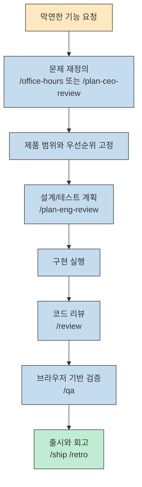
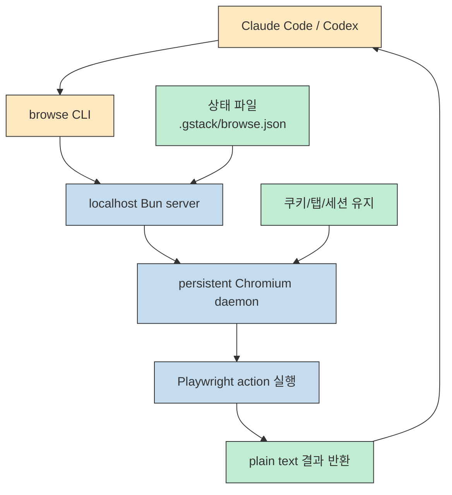
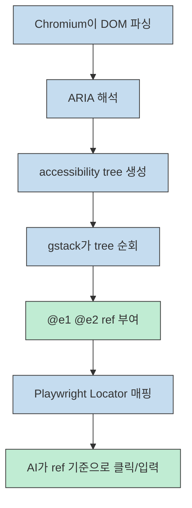
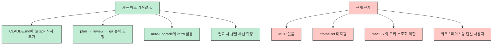

gstack가 흥미로운 이유는 "Claude Code에 좋은 프롬프트 몇 개를 얹었다" 수준이 아니기 때문입니다. 이 영상이 보여 주는 핵심은 **제품 기획, 엔지니어링 리뷰, QA, 배포, 회고를 각각 다른 역할로 분리해 AI를 한 명의 조수에서 하나의 팀처럼 운영하는 방식** 입니다. 발표자는 이를 Garry Tan의 경험과 노하우를 Markdown 스킬로 빌려 오는 느낌이라고 설명하고, 실제로 `/plan-ceo-review`부터 `/retro`까지를 하나의 개발 사이클로 묶어 보여 줍니다 (근거: [t=120](https://youtu.be/vfn_Ezu1qfk?t=120), [t=154](https://youtu.be/vfn_Ezu1qfk?t=154), [t=330](https://youtu.be/vfn_Ezu1qfk?t=330)).

날짜를 분리해서 보는 것도 중요합니다. 영상 설명란에는 업로드 시점 기준으로 "2.5만 stars" 와 "15개 skills"가 언급되지만, 제가 이 글을 쓴 **2026-03-23** 시점에 `garrytan/gstack` 저장소는 이미 4만 star를 넘겼고, 현재 README는 28개 skill을 소개하고 있습니다. 즉, 이 글은 **2026-03-19에 공개된 영상의 설명** 과 **2026-03-23에 확인한 공식 문서의 현재 상태** 를 구분해 함께 읽는 방식으로 정리합니다. [YouTube Video](https://www.youtube.com/watch?v=vfn_Ezu1qfk) [GitHub Repository](https://github.com/garrytan/gstack) [README](https://github.com/garrytan/gstack/blob/main/README.md)
<!--more-->

## Sources

- [YouTube 영상](https://www.youtube.com/watch?v=vfn_Ezu1qfk)
- [gstack 저장소](https://github.com/garrytan/gstack)
- [gstack README](https://github.com/garrytan/gstack/blob/main/README.md)
- [gstack ARCHITECTURE](https://github.com/garrytan/gstack/blob/main/ARCHITECTURE.md)
- [gstack skills docs](https://github.com/garrytan/gstack/blob/main/docs/skills.md)

## 1) gstack가 빠르게 퍼진 이유는 "더 잘 코딩하는 AI"보다 "더 잘 일하는 팀"을 만들기 때문이다

영상에서 가장 먼저 강하게 들어오는 메시지는 Garry Tan의 배경입니다. 발표자는 그가 YC CEO이면서, 초기 엔지니어이자 디자이너, PM 경험까지 가진 인물이라는 점을 강조하고, 바로 그 다중 역할 경험이 gstack 설계 철학에 반영돼 있다고 설명합니다. 그래서 gstack는 단순한 코드 생성 보조가 아니라, **CEO 관점의 범위 설정, 엔지니어링 매니저 관점의 설계 점검, QA 리드 관점의 검증** 을 분리해 호출할 수 있게 만든 도구로 소개됩니다 (근거: [t=180](https://youtu.be/vfn_Ezu1qfk?t=180), [t=210](https://youtu.be/vfn_Ezu1qfk?t=210), [t=300](https://youtu.be/vfn_Ezu1qfk?t=300)).

이 설명은 현재 README와도 잘 맞습니다. README는 gstack를 "virtual engineering team"이라고 직접 정의하고, CEO, eng manager, designer, reviewer, QA lead, release engineer 같은 역할을 모두 slash command로 제공한다고 적고 있습니다. 즉 gstack의 핵심 가치는 특정 모델 튜닝이 아니라 **범용 에이전트에게 역할과 절차를 강제하는 운영 레이어** 에 있습니다. 이 점이 사람들이 빠르게 반응한 이유라고 보는 편이 맞습니다. [README](https://github.com/garrytan/gstack/blob/main/README.md)

영상 설명란에는 업로드 시점 기준 15개 skill이라고 적혀 있지만, 현재 README는 `/office-hours`, `/plan-ceo-review`, `/plan-eng-review`, `/review`, `/qa`, `/browse`, `/retro`, `/gstack-upgrade`를 포함해 총 28개 skill을 안내합니다. 즉, **영상이 전달하는 철학은 그대로인데 실제 스킬 세트는 며칠 단위로 계속 확장되는 프로젝트** 라고 이해하면 됩니다. 이 차이를 날짜와 함께 읽어야 혼동이 없습니다. [YouTube Video](https://www.youtube.com/watch?v=vfn_Ezu1qfk) [README](https://github.com/garrytan/gstack/blob/main/README.md)

## 2) 핵심 아이디어는 Claude Code를 "역할 기반 스프린트 시스템"으로 바꾸는 것이다

영상이 요약한 gstack의 DNA는 네 가지입니다. 역할 기반 분리, "boil the lake"에 해당하는 완전성 지향, 구조화된 거버넌스, 그리고 테스트 우선 원칙입니다. 발표자는 여기서 중요한 점을 "하나의 범용 AI에게 모든 일을 맡기지 않고, CEO, 엔지니어, QA처럼 전문 역할을 담당하게 만든다"는 데 둡니다. 이 구조 덕분에 막연한 구현 요청이 **범위 정의 -> 설계 검토 -> 구현 -> 리뷰 -> QA -> 배포/회고** 로 정렬됩니다 (근거: [t=330](https://youtu.be/vfn_Ezu1qfk?t=330), [t=356](https://youtu.be/vfn_Ezu1qfk?t=356), [t=377](https://youtu.be/vfn_Ezu1qfk?t=377)).

README도 같은 메시지를 더 현재형으로 확장합니다. 지금의 gstack는 `/office-hours`로 문제를 재정의하고, `/plan-ceo-review`로 제품 비전과 범위를 검토하고, `/plan-eng-review`로 아키텍처와 테스트 플랜을 굳히고, `/review`와 `/qa`로 구현을 다듬은 뒤, `/ship`과 `/retro`로 마무리하는 **sprint-shaped workflow** 로 정리되어 있습니다. 즉, 개별 skill보다 더 중요한 것은 skill 간의 순서와 산출물 연결입니다. [README](https://github.com/garrytan/gstack/blob/main/README.md) [skills.md](https://github.com/garrytan/gstack/blob/main/docs/skills.md)

이 관점에서 보면 gstack의 진짜 가치는 "좋은 프롬프트를 제공한다"가 아니라, **어떤 순서로 어떤 결정을 먼저 내려야 하는지를 구조화한다** 는 데 있습니다. 특히 발표자가 반복해서 말하듯이, 본질적으로 판단이 많이 필요한 설계 단계에서는 계속 질문을 던지고, 보일러플레이트처럼 기계적인 작업에서는 크게 압축률을 내는 식으로 역할을 나누는 점이 실전적입니다 (근거: [t=2070](https://youtu.be/vfn_Ezu1qfk?t=2070), [t=2095](https://youtu.be/vfn_Ezu1qfk?t=2095), [t=2108](https://youtu.be/vfn_Ezu1qfk?t=2108)).

## 3) browse 아키텍처의 핵심은 Bun + daemon + plain text 입출력이다

기술적으로 가장 인상적인 부분은 `browse`입니다. 영상은 사용자의 브라우저 작업 요청이 Claude Code에서 CLI로, 다시 Bun 서버와 Playwright, Chromium으로 이어지고, 그 결과가 다시 일반 텍스트로 돌아오는 구조를 설명합니다. 여기서 강조점은 **MCP 없이, JSON schema 오버헤드 없이, 일반 텍스트 입출력으로 브라우저를 다룬다** 는 것입니다. 발표자는 이 덕분에 첫 호출 이후 왕복 시간이 100~200ms 수준으로 유지되고, 컨텍스트 토큰 오버헤드도 사실상 0이라고 설명합니다 (근거: [t=389](https://youtu.be/vfn_Ezu1qfk?t=389), [t=420](https://youtu.be/vfn_Ezu1qfk?t=420), [t=1825](https://youtu.be/vfn_Ezu1qfk?t=1825)).

공식 `ARCHITECTURE.md`는 이 설명을 더 구체화합니다. 문서는 브라우저에서 중요한 것은 "sub-second latency"와 "persistent state"라고 못박고, 그래서 gstack가 **localhost 위에서 동작하는 long-lived Chromium daemon** 을 채택했다고 설명합니다. 매 명령마다 브라우저를 새로 띄우면 2~3초가 반복적으로 들고 로그인 상태도 날아가지만, daemon 모델에서는 첫 부팅 이후 쿠키, 탭, 로컬 스토리지가 그대로 이어집니다. [ARCHITECTURE.md](https://github.com/garrytan/gstack/blob/main/ARCHITECTURE.md)

Bun 선택 이유도 영상과 공식 문서가 거의 일치합니다. 발표자는 컴파일된 단일 바이너리, 네이티브 SQLite, TypeScript 직접 실행, 내장 HTTP 서버를 장점으로 설명하고, 실제 병목은 Chromium이지 서버가 아니라고 정리합니다. 공식 문서도 같은 이유로 Bun을 택했다고 쓰며, 특히 **compiled binary** 와 **native SQLite** 를 핵심 가치로 강조합니다 (근거: [t=449](https://youtu.be/vfn_Ezu1qfk?t=449), [t=503](https://youtu.be/vfn_Ezu1qfk?t=503), [t=590](https://youtu.be/vfn_Ezu1qfk?t=590)) [ARCHITECTURE.md](https://github.com/garrytan/gstack/blob/main/ARCHITECTURE.md)

daemon 모델의 운영 감각도 중요합니다. 영상은 첫 호출만 느리고 이후는 빠르며, 30분 유휴 시 자동 종료된다고 설명합니다. `ARCHITECTURE.md`는 여기에 더해 서버 상태를 `.gstack/browse.json`에 저장하고, 바이너리 버전이 바뀌면 다음 CLI 호출 때 자동 재시작해 stale binary 문제를 없앤다고 적고 있습니다. 즉 browse는 "브라우저 자동화 기능 하나"가 아니라, **장시간 살아 있는 브라우저 프로세스를 안정적으로 관리하는 런타임 설계** 까지 포함한 컴포넌트입니다 (근거: [t=960](https://youtu.be/vfn_Ezu1qfk?t=960), [t=990](https://youtu.be/vfn_Ezu1qfk?t=990), [t=1046](https://youtu.be/vfn_Ezu1qfk?t=1046)) [ARCHITECTURE.md](https://github.com/garrytan/gstack/blob/main/ARCHITECTURE.md)

## 4) DOM 주입이 아니라 accessibility tree + ref 시스템을 택한 이유가 영리하다

영상에서 가장 "아, 그래서 이런 방식이었구나" 하고 이해되는 부분은 접근성 트리 설명입니다. 발표자는 gstack가 Playwright와 Chromium이 이미 만들어 주는 accessibility tree를 읽어 와서, 각 요소에 `@e1`, `@e2` 같은 순차 ref를 붙인다고 설명합니다. 핵심은 보이는 픽셀을 읽는 것이 아니라 **role, name, value 중심의 의미 기반 요소 식별** 을 한다는 점입니다. 그래서 CSS selector나 XPath보다 프레임워크 변화에 덜 취약하고, Shadow DOM에도 강합니다 (근거: [t=660](https://youtu.be/vfn_Ezu1qfk?t=660), [t=700](https://youtu.be/vfn_Ezu1qfk?t=700), [t=729](https://youtu.be/vfn_Ezu1qfk?t=729)).

공식 문서도 같은 선택을 더 직설적으로 설명합니다. 왜 DOM에 `data-ref`를 박지 않느냐는 질문에 대해, `ARCHITECTURE.md`는 세 가지를 듭니다. CSP 정책이 외부 주입을 막고, React/Vue/Svelte 하이드레이션이 주입 속성을 지울 수 있으며, Shadow DOM 내부는 외부 주입으로 안정적으로 다루기 어렵다는 것입니다. 반대로 Playwright Locator와 accessibility tree는 DOM 외부에서 작동하므로 이 문제들을 피해 갑니다. 즉, gstack가 accessibility tree를 택한 건 "더 우아해서"가 아니라 **현대 프런트엔드의 실제 제약을 피하려는 실용적 선택** 입니다 (근거: [t=807](https://youtu.be/vfn_Ezu1qfk?t=807), [t=839](https://youtu.be/vfn_Ezu1qfk?t=839), [t=873](https://youtu.be/vfn_Ezu1qfk?t=873)) [ARCHITECTURE.md](https://github.com/garrytan/gstack/blob/main/ARCHITECTURE.md)

여기서 끝이 아닙니다. 영상은 페이지 이동 후 ref가 무효화되고, SPA 전환에서는 URL이 안 바뀌어도 DOM이 바뀌면 stale 위험이 생긴다고 설명합니다. 그래서 gstack는 ref를 쓸 때마다 locator `count()`를 확인해 요소가 0개면 곧바로 "stale" 에러를 내고, 새 `snapshot`을 요구합니다. 이게 중요한 이유는 브라우저 자동화에서 가장 위험한 오류가 "조용히 틀린 요소를 누르는 것"인데, gstack는 오히려 **시끄럽게 실패하는 방향** 을 택했기 때문입니다 (근거: [t=900](https://youtu.be/vfn_Ezu1qfk?t=900), [t=910](https://youtu.be/vfn_Ezu1qfk?t=910), [t=923](https://youtu.be/vfn_Ezu1qfk?t=923)) [ARCHITECTURE.md](https://github.com/garrytan/gstack/blob/main/ARCHITECTURE.md)

## 5) 스킬 목록보다 더 중요한 것은 "스프린트 순서"와 역할 차이다

영상 중반부는 당시 기준 13개 skill을 카테고리별로 소개합니다. 기획/리뷰에는 `plan-ceo-review`, `plan-review`, `plan-design-review`가 있고, 코드/배포에는 `review`, `document-release`, `release`, QA/브라우저에는 `qa`, `qa-only`, `design-review`, 유틸리티에는 `browse`, `retro`, `setup-browser-cookies`, `gstack-upgrade`가 있다는 식입니다. 세부 목록은 영상 이후 더 늘어났지만, 구조는 지금도 거의 같습니다 (근거: [t=1290](https://youtu.be/vfn_Ezu1qfk?t=1290), [t=1323](https://youtu.be/vfn_Ezu1qfk?t=1323), [t=1685](https://youtu.be/vfn_Ezu1qfk?t=1685)).

특히 `/plan-ceo-review`와 엔지니어링 리뷰의 차이를 짚는 부분이 좋습니다. 발표자는 CEO 리뷰가 제품 비전과 범위를 다시 묻고 10x 아이디어를 찾는 역할이라면, 엔지니어링 리뷰는 아키텍처를 고정하고 엣지 케이스를 확장하는 실행 관점이라고 설명합니다. 즉 둘 다 "계획"이지만 질문이 다릅니다. 하나는 **무엇을 만들어야 하는가**, 다른 하나는 **그걸 어떻게 안전하게 만들 것인가** 입니다 (근거: [t=1355](https://youtu.be/vfn_Ezu1qfk?t=1355), [t=1410](https://youtu.be/vfn_Ezu1qfk?t=1410), [t=1432](https://youtu.be/vfn_Ezu1qfk?t=1432)).

`/review`와 `/qa`도 철학이 분명합니다. 영상은 `/review`를 staff engineer 수준의 코드 리뷰로 소개하며, 심각한 이슈와 정보성 이슈를 분리하고, 기계적으로 고칠 수 있는 것은 먼저 고치는 구조라고 설명합니다. `/qa`는 실제 브라우저로 테스트하고, 수정하고, 회귀 테스트까지 자동 생성하는 흐름으로 제시됩니다. 현재 공식 문서 역시 `/review`를 production bug hunting 용으로, `/qa`를 diff-aware 브라우저 검증으로 설명합니다. **즉 gstack는 "리뷰 보고서 생성기"가 아니라, 리뷰와 QA를 실제 개발 루프 안으로 넣는 운영 시스템** 에 가깝습니다 (근거: [t=1500](https://youtu.be/vfn_Ezu1qfk?t=1500), [t=1562](https://youtu.be/vfn_Ezu1qfk?t=1562), [t=1615](https://youtu.be/vfn_Ezu1qfk?t=1615)) [skills.md](https://github.com/garrytan/gstack/blob/main/docs/skills.md)

README가 "Think -> Plan -> Build -> Review -> Test -> Ship -> Reflect"를 강조하는 이유도 여기 있습니다. 영상 후반의 실전 워크플로 역시 거의 같은 순서입니다. 계획 수립에 2~3분, 리뷰 2~3분, QA, 배포까지 이어지면서 전체 개발 사이클을 압축하는 그림을 보여 줍니다. 따라서 gstack를 이해할 때는 개별 slash command보다 **그 명령들이 앞 단계 산출물을 다음 단계로 넘겨 주는 연결 구조** 를 보는 편이 훨씬 중요합니다 (근거: [t=1993](https://youtu.be/vfn_Ezu1qfk?t=1993), [t=2007](https://youtu.be/vfn_Ezu1qfk?t=2007), [t=2030](https://youtu.be/vfn_Ezu1qfk?t=2030)) [README](https://github.com/garrytan/gstack/blob/main/README.md)

## 6) 실전 적용 포인트: 지금 바로 가져갈 것과 아직 남아 있는 한계

영상 후반부에서 바로 적용할 만한 팁은 꽤 명확합니다. 첫째, `CLAUDE.md`에 gstack 관련 섹션과 스킬 사용 지시를 넣어 모델이 더 적극적으로 스킬을 쓰게 하라는 점입니다. 둘째, 플랜 -> 리뷰 -> QA 순서를 지키라는 점입니다. 셋째, auto-upgrade를 켜서 스킬 변경을 계속 따라가라는 점입니다. 넷째, 병렬 확장이 필요하면 Conductor 같은 도구와 함께 여러 세션을 독립 워크스페이스로 돌리라는 점입니다 (근거: [t=2220](https://youtu.be/vfn_Ezu1qfk?t=2220), [t=2238](https://youtu.be/vfn_Ezu1qfk?t=2238), [t=2250](https://youtu.be/vfn_Ezu1qfk?t=2250), [t=2163](https://youtu.be/vfn_Ezu1qfk?t=2163)).

실제로 README도 gstack 섹션을 `CLAUDE.md`에 추가하라고 권하고, 현재는 Codex/Gemini/Cursor용 설치 경로까지 따로 설명합니다. 그래서 gstack를 쓸 때는 "새 명령 몇 개를 배운다"보다 **에이전트가 어떤 기본 흐름을 따르도록 저장소 문맥에 규칙을 심는다** 는 관점이 더 적절합니다. 이건 스킬의 숫자보다 훨씬 재사용 가치가 높은 습관입니다. [README](https://github.com/garrytan/gstack/blob/main/README.md)

한편 의도적으로 뺀 것도 분명합니다. 영상과 `ARCHITECTURE.md` 모두 웹소켓 스트리밍이 없고, MCP 프로토콜이 없고, 다중 사용자 서버를 지원하지 않으며, Windows/Linux 쿠키 복호화도 아직 지원하지 않는다고 말합니다. iframe ref 지원도 빠져 있습니다. 이 부분은 "미완성"이라기보다, **복잡성 증가보다 단순한 런타임과 예측 가능한 실패 모드를 우선한 결과** 로 읽는 편이 맞습니다 (근거: [t=2311](https://youtu.be/vfn_Ezu1qfk?t=2311), [t=2338](https://youtu.be/vfn_Ezu1qfk?t=2338), [t=2369](https://youtu.be/vfn_Ezu1qfk?t=2369)) [ARCHITECTURE.md](https://github.com/garrytan/gstack/blob/main/ARCHITECTURE.md)

## 핵심 요약

- gstack의 본질은 좋은 프롬프트 모음이 아니라, CEO/엔지니어링 매니저/QA/릴리즈 엔지니어를 흉내 내는 **역할 기반 개발 프로세스** 입니다 (근거: [t=154](https://youtu.be/vfn_Ezu1qfk?t=154), [t=330](https://youtu.be/vfn_Ezu1qfk?t=330)).
- browse의 핵심은 Bun 기반 로컬 daemon과 plain text 입출력이라서, 브라우저 자동화를 sub-second에 가깝게 유지하면서도 세션 상태를 계속 이어 갈 수 있다는 점입니다 (근거: [t=389](https://youtu.be/vfn_Ezu1qfk?t=389), [t=960](https://youtu.be/vfn_Ezu1qfk?t=960)) [ARCHITECTURE.md](https://github.com/garrytan/gstack/blob/main/ARCHITECTURE.md)
- accessibility tree + ref 시스템은 DOM 주입보다 현대 프런트엔드 환경에서 더 안정적이며, stale ref를 조용히 무시하지 않고 크게 실패시키는 점이 오히려 안전합니다 (근거: [t=660](https://youtu.be/vfn_Ezu1qfk?t=660), [t=900](https://youtu.be/vfn_Ezu1qfk?t=900)) [ARCHITECTURE.md](https://github.com/garrytan/gstack/blob/main/ARCHITECTURE.md)
- 개별 스킬 수는 빠르게 바뀌지만, **Think -> Plan -> Build -> Review -> Test -> Ship -> Reflect** 라는 스프린트 순서는 지금도 gstack의 중심입니다. [README](https://github.com/garrytan/gstack/blob/main/README.md)
- 실제로 가져갈 만한 포인트는 gstack 자체보다, 저장소 문맥 파일과 스킬 체계로 **AI의 작업 순서와 승인 지점을 먼저 설계하는 습관** 입니다 (근거: [t=2220](https://youtu.be/vfn_Ezu1qfk?t=2220), [t=2250](https://youtu.be/vfn_Ezu1qfk?t=2250)).

## 결론

gstack를 한 문장으로 요약하면, "Claude Code를 더 똑똑하게 만드는 도구"가 아니라 **Claude Code가 팀처럼 일하게 만드는 운영체제** 에 가깝습니다. 이 프로젝트의 흥미로운 지점은 모델 성능을 자랑하기보다, 어떤 순서로 계획하고, 무엇을 먼저 검토하고, 어떤 방식으로 브라우저를 붙이고, 언제 실패를 크게 드러낼지를 설계했다는 데 있습니다. [YouTube Video](https://www.youtube.com/watch?v=vfn_Ezu1qfk) [README](https://github.com/garrytan/gstack/blob/main/README.md)

그래서 이 영상을 보고 바로 가져가야 할 것은 "gstack를 무조건 설치하라"라기보다, **나의 AI 코딩 워크플로도 역할과 절차로 쪼개야 한다** 는 교훈입니다. 제품 방향을 다시 묻는 단계, 아키텍처를 고정하는 단계, 실제 브라우저로 검증하는 단계, 끝나고 회고하는 단계를 분리해 두면, 같은 모델을 써도 결과 품질이 달라질 수밖에 없습니다. gstack는 그 아이디어를 지금 가장 공격적으로 구현해 놓은 사례 중 하나입니다. [skills.md](https://github.com/garrytan/gstack/blob/main/docs/skills.md) [ARCHITECTURE.md](https://github.com/garrytan/gstack/blob/main/ARCHITECTURE.md)

<!--
Evidence notes
- claim: gstack turns Claude Code into a virtual engineering team rather than a simple code generator | transcript/time marker: "CEO 리뷰라든지 엔지니어링 매니저 리뷰, QA 테스트 릴리즈까지 전체 소프트웨어 개발 라이프 사이클" / 02:34-02:41 | video url: https://youtu.be/vfn_Ezu1qfk?t=154 | confidence: high
- claim: Garry Tan's mixed background is presented as core to the design philosophy | transcript/time marker: "엔지니어자, 디자이너자, PM이자" / 03:00-03:30 | video url: https://youtu.be/vfn_Ezu1qfk?t=180 | confidence: high
- claim: gstack DNA includes role separation, boil the lake, structured governance, and tests first | transcript/time marker: "핵심 철학은 역할 기반의 분리" / "보일 더 레이크" / "구조화된 거버넌스" / "100% 커버리지를 목표" / 05:30-06:20 | video url: https://youtu.be/vfn_Ezu1qfk?t=330 | confidence: high
- claim: browse uses plain text IO without MCP overhead and targets ~100-200ms after cold start | transcript/time marker: "MCP 프로토콜이 없이" / "100에서 200mm" / 06:30-07:10 | video url: https://youtu.be/vfn_Ezu1qfk?t=389 | confidence: high
- claim: Bun was chosen for compiled binary, native SQLite, TypeScript execution, and built-in HTTP server | transcript/time marker: 07:29-09:54 technical analysis section | video url: https://youtu.be/vfn_Ezu1qfk?t=449 | confidence: high
- claim: daemon model keeps browser state and avoids per-command startup overhead | transcript/time marker: 16:00-17:30 daemon model explanation | video url: https://youtu.be/vfn_Ezu1qfk?t=960 | confidence: high
- claim: accessibility tree is used instead of DOM injection for stable element identification | transcript/time marker: 11:00-14:42 accessibility tree + CSP/shadow DOM explanation | video url: https://youtu.be/vfn_Ezu1qfk?t=660 | confidence: high
- claim: stale refs are detected explicitly rather than silently reused | transcript/time marker: 15:00-15:40 stale detection explanation | video url: https://youtu.be/vfn_Ezu1qfk?t=900 | confidence: high
- claim: the video groups skills into planning/review, code/release, QA, and utility categories | transcript/time marker: 21:30-22:30 skill categories overview | video url: https://youtu.be/vfn_Ezu1qfk?t=1290 | confidence: high
- claim: current README lists 28 skills whereas the video description referenced 15 at upload time | transcript/time marker: YouTube description lines; current repo README | video url: https://www.youtube.com/watch?v=vfn_Ezu1qfk | confidence: high
- claim: current practical guidance includes CLAUDE.md integration, plan-review-QA order, auto-upgrade, and parallel scaling | transcript/time marker: 37:00-37:45 best practices section | video url: https://youtu.be/vfn_Ezu1qfk?t=2220 | confidence: high
- claim: key intentional omissions include no MCP, no iframe support, and no Windows/Linux cookie decryption | transcript/time marker: 38:30-39:40 omissions section | video url: https://youtu.be/vfn_Ezu1qfk?t=2311 | confidence: high
-->
