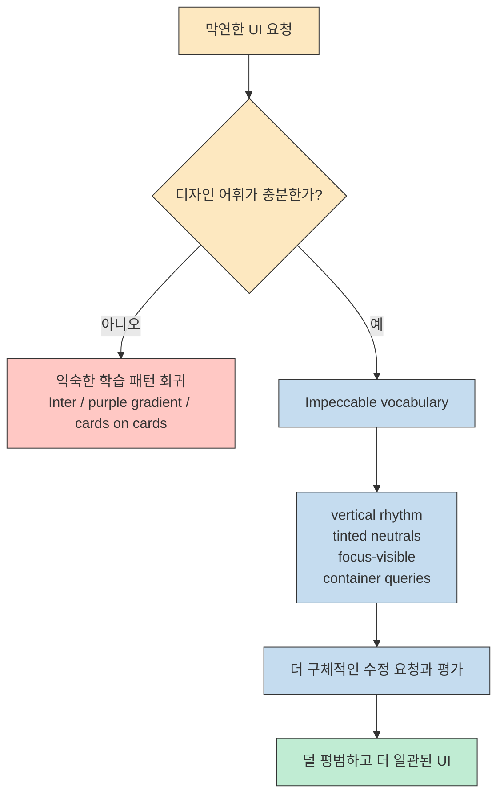
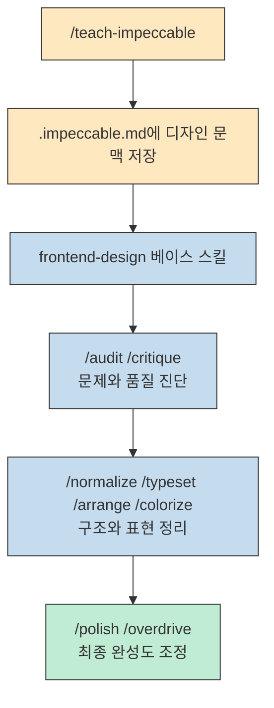
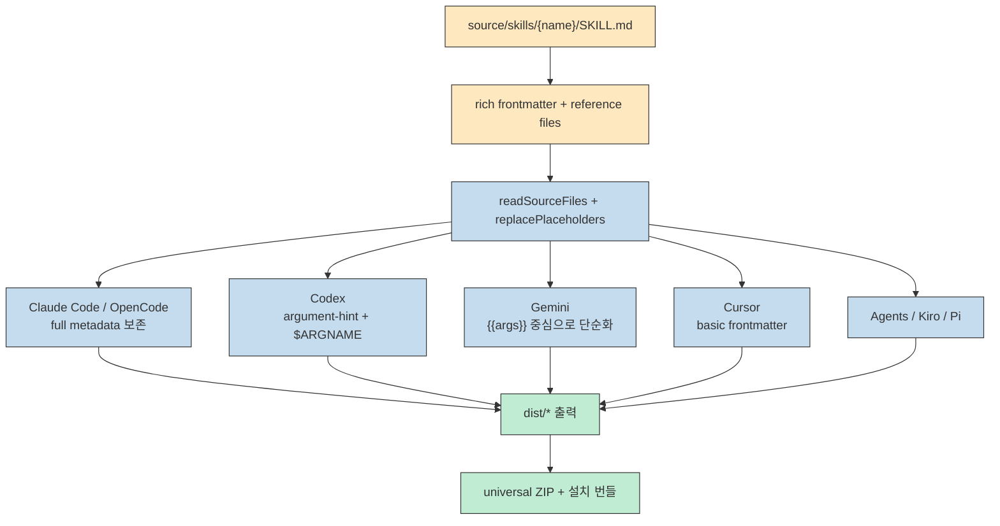
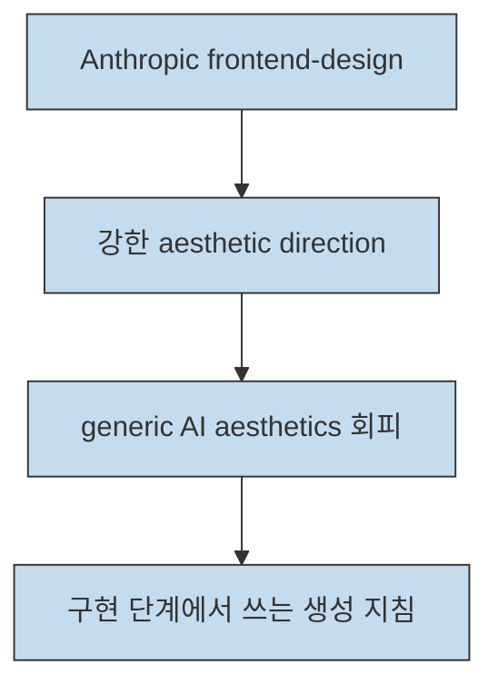
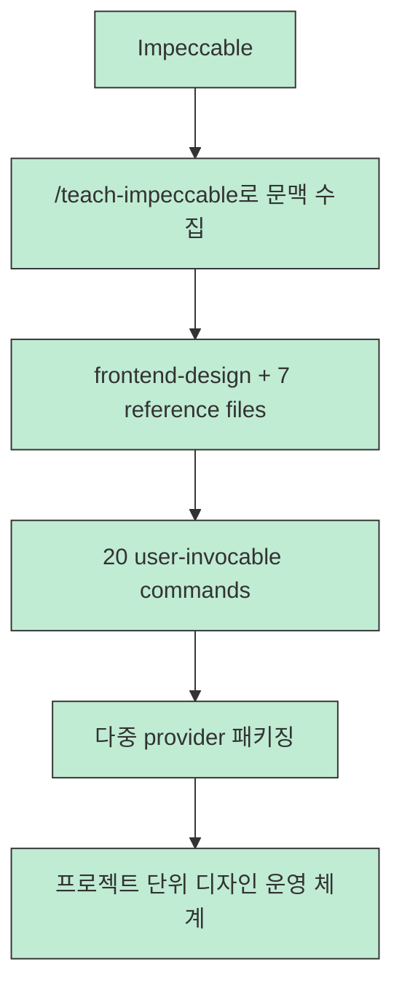

`pbakaus/impeccable` 가 흥미로운 이유는 "예쁜 프런트엔드 프롬프트 모음" 수준에서 끝나지 않기 때문입니다. 이 프로젝트는 디자인 품질 문제를 단순한 취향이나 모델 성능의 문제가 아니라, **AI에게 줄 수 있는 디자인 어휘와 평가 기준이 부족한 문제** 로 다시 정의합니다. 공식 사이트가 강조하듯, 사용자가 `vertical rhythm` 같은 말을 모르면 모델에게 그 수준의 수정을 요청하기도 어렵습니다.

그래서 Impeccable의 핵심은 "더 멋진 화면을 만들어 줘"가 아니라, **디자인 언어를 스킬과 명령으로 쪼개서 여러 AI 하네스에 이식 가능한 형태로 배포한다** 는 데 있습니다. 2026년 3월 23일 기준으로 공식 사이트는 이 프로젝트를 `1`개의 종합 스킬과 `20`개의 디자인 명령으로 소개하고 있고, 실제 저장소 소스 디렉터리도 총 `21`개 스킬 중 `20`개를 `user-invocable` 명령으로 구성하고 있습니다.

<!--more-->

## Sources

- Input: [pbakaus/impeccable](https://github.com/pbakaus/impeccable)
- Verified: [impeccable.style](https://impeccable.style)
- Verified: [README](https://github.com/pbakaus/impeccable/blob/main/README.md)
- Verified: [frontend-design skill](https://github.com/pbakaus/impeccable/blob/main/source/skills/frontend-design/SKILL.md)
- Verified: [teach-impeccable](https://github.com/pbakaus/impeccable/blob/main/source/skills/teach-impeccable/SKILL.md)
- Verified: [audit](https://github.com/pbakaus/impeccable/blob/main/source/skills/audit/SKILL.md)
- Verified: [DEVELOP](https://github.com/pbakaus/impeccable/blob/main/DEVELOP.md)
- Comparison: [Anthropic frontend-design](https://github.com/anthropics/skills/blob/main/skills/frontend-design/SKILL.md)

## 1) Impeccable는 AI Slop를 "취향 부족"이 아니라 "디자인 언어 부족"으로 본다

공식 사이트의 첫 메시지는 꽤 명확합니다. 대부분의 사용자는 "조금 더 세련되게" 정도는 말할 수 있어도, 왜 화면이 평범한지 설명할 수 있는 디자인 용어를 갖고 있지 않습니다. 그래서 모델도 가장 흔한 학습 패턴으로 되돌아가기 쉽고, 그 결과가 Inter 폰트, 보라색 그라데이션, 카드 위의 카드 같은 익숙한 AI 산출물로 굳어집니다. Impeccable는 이 지점을 정면으로 찌르며, 디자인 품질을 끌어올리는 방법을 "더 강한 모델"보다 **더 구체적인 디자인 문법** 쪽에서 찾습니다.

이 접근은 Anthropic의 원본 `frontend-design` 스킬 위에서 출발하지만, 원본보다 훨씬 운영적입니다. Anthropic 원본이 "대담한 미학 방향을 잡고, 흔한 AI 미감을 피하라"는 강한 생성 가이드를 제공한다면, Impeccable는 거기서 한 걸음 더 가서 `typography`, `color-and-contrast`, `spatial-design`, `motion-design`, `interaction-design`, `responsive-design`, `ux-writing` 같은 참조 문서를 분리해 둡니다. 즉 "센스 있게 만들어라"가 아니라, **타이포 스케일, 대비, 간격, 움직임, 반응형, UX 카피를 각각 어떤 언어로 다뤄야 하는지** 를 세분화한 것입니다.

중요한 점은 이 프로젝트가 결과물의 "스타일"보다 **판단 기준의 해상도** 를 올린다는 것입니다. 예를 들어 색상 문서에서는 HSL보다 OKLCH를 권하고, 중립색에도 브랜드 색조를 아주 미세하게 섞으라고 말합니다. 모션 문서에서는 `ease` 대신 구체적인 easing curve를 제안하고, 인터랙션 문서에서는 hover와 focus를 구분하라고 요구합니다. 결국 Impeccable는 디자인 감각을 마법처럼 주입하는 도구라기보다, **좋은 디자인 대화를 가능하게 만드는 어휘 팩** 에 가깝습니다.

## 2) 핵심 구조는 "1개 베이스 스킬"보다 "20개 명령 체계"에 있다

README와 공식 사이트는 Impeccable를 `1 skill, 20 commands` 로 설명하지만, 실제 사용감은 이 숫자 조합이 왜 중요한지에서 나옵니다. 베이스가 되는 `frontend-design` 스킬은 전체 미학 원칙과 안티 패턴을 제공하고, `teach-impeccable`, `audit`, `critique`, `normalize`, `typeset`, `arrange`, `polish`, `overdrive` 같은 명령은 그 원칙을 **워크플로 단계별 행위** 로 바꿉니다. 즉 하나의 거대한 프롬프트가 모든 일을 하게 하지 않고, 맥락 수집, 진단, 정리, 최종 마감 같은 역할을 분리합니다.

특히 `teach-impeccable` 는 단순한 설치 도우미가 아닙니다. 이 명령은 프로젝트를 먼저 훑은 다음, 아직 알 수 없는 것만 묻고, 최종적으로 사용자/브랜드/미학 방향/디자인 원칙을 `.impeccable.md` 에 저장하도록 설계돼 있습니다. 이 덕분에 이후 명령들이 매번 처음부터 취향을 추측하지 않고, 이미 저장된 디자인 문맥 위에서 작동할 수 있습니다. 디자인 지침을 일회성 채팅이 아니라 **프로젝트 메모리** 로 만든다는 점이 실전적입니다.

`audit` 도 방향이 분명합니다. 이 명령은 직접 고치지 않고, 접근성, 성능, 테마, 반응형, 그리고 Impeccable가 정의한 안티 패턴을 기준으로 보고서를 만듭니다. 다시 말해 Impeccable는 "예쁘게 만들어라"와 "무엇이 문제인지 점검하라"를 일부러 분리합니다. 이 구조 덕분에 팀은 `/audit` 으로 진단한 뒤 `/normalize`, `/typeset`, `/arrange`, `/polish` 같은 다음 행동으로 이어 갈 수 있습니다. 즉 이 프로젝트의 본질은 디자인 취향보다 **명령 가능한 운영 언어** 에 더 가깝습니다.

2026년 3월 16일과 17일 공식 사이트 changelog를 보면 이 체계가 계속 확장되고 있다는 점도 보입니다. `v1.5.0` 에서는 `typeset`, `arrange`, `overdrive` 가 추가됐고, 같은 버전에서 `.impeccable.md` 기반 문맥 수집이 도입됐습니다. 이어 `v1.5.1` 에서는 `/typeset` 이 앱 UI에는 고정 타입 스케일을, 마케팅 페이지에는 유동 타입을 권하도록 다듬어졌습니다. 즉 Impeccable는 정적인 프롬프트 파일이 아니라, **버전 관리되는 디자인 운영 체계** 로 보는 편이 맞습니다.

## 3) 진짜 기술 포인트는 "단일 소스에서 여러 AI 하네스로 변환하는 빌드 시스템"이다

이 저장소를 그냥 skill bundle 정도로 보면 가장 중요한 부분을 놓치게 됩니다. `DEVELOP.md` 가 설명하듯 Impeccable는 "기능이 풍부한 source format" 을 하나 유지하고, 각 AI 도구의 제약에 맞춰 내려보내는 방식을 택합니다. 즉 처음부터 가장 약한 도구에 맞춘 공통 분모 파일을 쓰는 대신, 소스에는 `args`, `user-invocable`, `license`, `compatibility`, `metadata`, `allowed-tools` 같은 풍부한 메타데이터를 유지하고, 변환 단계에서 provider별로 필요한 수준만 남깁니다.

이 철학이 흥미로운 이유는 AI 하네스의 현실을 아주 잘 반영하기 때문입니다. Claude Code와 OpenCode는 상대적으로 풍부한 메타데이터를 보존할 수 있지만, Codex는 `argument-hint` 형태로 변환해야 하고 본문의 인자 표기도 `$ARGNAME` 으로 바뀝니다. Gemini는 최소 frontmatter와 `{{args}}` 식의 단순화된 표현을 쓰고, Cursor는 더 기본적인 frontmatter만 유지합니다. 즉 Impeccable는 디자인 노하우만 배포하는 것이 아니라, **같은 명령 체계를 여러 도구 문법으로 컴파일하는 번역기** 를 함께 제공하는 셈입니다.

빌드 스크립트도 이 전략을 뒷받침합니다. `scripts/build.js` 는 소스 스킬을 읽고, provider transformer를 돌리고, universal ZIP을 조립하고, 동시에 정적 사이트와 API 데이터까지 만듭니다. `package.json` 은 Bun 기반 빌드, 테스트, 미리보기, 배포 스크립트를 정의하고 있고, CI는 `bun test` 와 `bun run build` 를 함께 수행합니다. 즉 이 저장소는 단순 문서 모음이 아니라 **콘텐츠 소스 + 변환 파이프라인 + 배포 웹사이트** 를 한 저장소 안에 묶은 구조입니다.

이 점이 중요한 이유는, 여러 팀이 서로 다른 AI 하네스를 쓰더라도 같은 디자인 운영 체계를 공유할 수 있기 때문입니다. 한 팀은 Claude Code plugin으로, 다른 팀은 Codex용 `.codex/skills` 로, 또 다른 팀은 `npx skills add` 로 설치하더라도 결국 동일한 원천 스킬 세트를 쓰게 됩니다. Impeccable의 진짜 경쟁력은 프롬프트 문장 몇 줄이 아니라, **디자인 지식을 공급망처럼 배포하는 아키텍처** 에 있습니다.

## 4) Anthropic 원본과 비교하면, Impeccable는 "생성 지침"을 "운영 체계"로 확장한다

Anthropic의 원본 `frontend-design` 도 이미 충분히 강한 스킬입니다. 대담한 미학 방향을 고르고, 흔한 AI 미감을 피하고, 시각적으로 잊히지 않는 결과를 만들라고 요구합니다. 즉 출발점부터 꽤 공격적인 디자인 가이드입니다.

반면 Impeccable는 같은 출발점 위에 더 많은 층을 올립니다. 첫째, 컨텍스트 수집 프로토콜을 앞단에 추가합니다. 둘째, 분야별 reference 문서를 붙여 디자인 개념을 세분화합니다. 셋째, `audit`, `normalize`, `polish`, `typeset`, `arrange` 같은 명령으로 작업 순서를 분해합니다. 넷째, 이 구조 전체를 여러 하네스에 맞춰 패키징합니다. 그래서 Impeccable는 더 예쁜 화면을 만들라는 조언이 아니라, **디자인 작업을 명령 체계와 저장 가능한 문맥으로 바꾼 프로젝트** 로 읽어야 합니다.

이 차이는 실제 사용 방식도 바꿉니다. Anthropic 원본이 "지금 이 화면을 더 잘 만들어라"에 가깝다면, Impeccable는 "이 프로젝트가 앞으로 어떤 디자인 언어로 일할지를 정하고, 그 기준으로 진단하고, 정리하고, 마감하라"에 가깝습니다. 즉 단발성 프롬프트 강화보다, **반복 가능한 디자인 워크플로** 를 원하는 팀일수록 Impeccable의 가치가 커집니다.

## 5) 실전 적용 포인트

공식 사이트 기준 현재 가장 쉬운 설치 경로는 `npx skills add pbakaus/impeccable` 입니다. Claude Code 쪽은 plugin marketplace 경로도 따로 제공하고, 수동 설치용 universal ZIP도 준비돼 있습니다. 그래서 도입 자체는 어렵지 않습니다. 오히려 중요한 것은 설치 뒤 순서입니다.

실무에서는 먼저 `/teach-impeccable` 로 프로젝트 맥락을 저장하고, 새 화면을 만들기 전 `/audit` 나 `/critique` 로 문제를 진단한 뒤, `/normalize`, `/typeset`, `/arrange`, `/colorize` 같은 명령으로 구조를 다듬고, 마지막에 `/polish` 로 마감하는 흐름이 가장 자연스럽습니다. Codex 계열에서는 문법이 `/prompts:audit`, `/prompts:polish` 처럼 달라질 수 있지만, underlying skill의 의도는 같습니다. 결국 Impeccable를 잘 쓰는 방법은 "한 번에 멋지게 만들어 줘"가 아니라, **디자인을 단계별 수정 가능한 대상으로 다루는 것** 입니다.

또 하나의 실전 포인트는 이 프로젝트를 "디자인을 대신해 주는 도구"로 과대평가하지 않는 것입니다. Impeccable는 취향을 자동 생성하는 기계라기보다, 디자인 결정을 논의하고 재현하는 언어를 제공합니다. 이미 제품과 브랜드가 있고, 여러 AI 하네스를 섞어 쓰며, 팀 안에서 일관된 UI 품질 기준이 필요한 환경일수록 효과가 큽니다. 반대로 프로젝트 문맥이 전혀 없고, 결과를 검토할 사람도 없다면 이 도구를 써도 결국 평범한 산출물로 돌아갈 가능성이 큽니다.

## 핵심 요약

- Impeccable의 출발점은 "디자인 품질은 모델만의 문제가 아니라, 사용자와 모델이 공유하는 디자인 어휘의 문제"라는 재정의입니다.
- 프로젝트의 실제 단위는 `1`개 베이스 스킬보다 `20`개 명령 체계이며, `teach-impeccable` 와 `.impeccable.md` 가 그 중심입니다.
- 기술적으로는 단일 source format을 여러 AI 하네스 형식으로 변환하는 빌드 시스템이 더 중요한 차별점입니다.
- Anthropic 원본 `frontend-design` 이 강한 생성 지침이라면, Impeccable는 그 위에 컨텍스트 수집, 참조 문서, 명령 워크플로, 멀티-provider 패키징을 얹은 운영 체계입니다.
- 여러 도구를 섞어 쓰는 팀이라면 Impeccable의 진짜 가치는 "예쁜 화면 생성"보다 **공유 가능한 디자인 운영 언어** 를 제공한다는 데 있습니다.

## 결론

Impeccable를 한 문장으로 요약하면, "프런트엔드 디자인을 더 잘하게 만드는 스킬"이 아니라 **AI 하네스가 디자인에 대해 더 정확하게 말하고, 진단하고, 반복하게 만드는 번역 레이어** 에 가깝습니다. 이 프로젝트가 주는 가장 큰 교훈은 좋은 UI 결과물이 모델의 미감만으로 나오지 않는다는 점입니다. 결국 필요한 것은 더 많은 감탄사가 아니라, 더 나은 용어와 더 나은 작업 순서입니다.

그래서 `pbakaus/impeccable` 는 단순한 스킬 저장소보다, 앞으로 AI 개발 도구 생태계가 어떻게 진화할지를 보여 주는 작은 사례로 읽을 만합니다. 좋은 프롬프트를 공유하는 시대에서, **좋은 운영 언어를 여러 하네스에 배포하는 시대** 로 넘어가고 있다는 신호이기 때문입니다.

<!--
Evidence sources
- url: https://github.com/pbakaus/impeccable | extraction: scrapling-get | evidence: repo title/description, public repo structure, visible provider folders, current star display
- url: https://impeccable.style | extraction: scrapling-get | evidence: vocabulary framing, supported tools, install commands, changelog, version 1.5.1
- url: https://github.com/pbakaus/impeccable/blob/main/README.md | extraction: http | evidence: one skill + 20 commands, anti-patterns, supported tools, installation guidance
- url: https://github.com/pbakaus/impeccable/blob/main/source/skills/frontend-design/SKILL.md | extraction: http | evidence: context gathering protocol, 7 domain references, anti-pattern guidance
- url: https://github.com/pbakaus/impeccable/blob/main/source/skills/teach-impeccable/SKILL.md | extraction: http | evidence: `.impeccable.md` writeback and UX-focused design context collection
- url: https://github.com/pbakaus/impeccable/blob/main/source/skills/audit/SKILL.md | extraction: http | evidence: audit is diagnostic, not a fix command; severity-based reporting
- url: https://github.com/pbakaus/impeccable/blob/main/DEVELOP.md | extraction: http | evidence: rich source format, provider transformations, repository architecture
- url: https://github.com/pbakaus/impeccable/blob/main/package.json | extraction: http | evidence: bun-based build/test/deploy scripts, versioned package metadata
- url: https://github.com/pbakaus/impeccable/blob/main/scripts/build.js | extraction: http | evidence: provider transforms, universal ZIP assembly, static site build
- url: https://github.com/pbakaus/impeccable/blob/main/scripts/lib/transformers/codex.js | extraction: http | evidence: Codex-specific argument-hint and placeholder conversion
- url: https://github.com/pbakaus/impeccable/blob/main/scripts/lib/transformers/gemini.js | extraction: http | evidence: Gemini-specific `{{args}}` conversion
- url: https://github.com/pbakaus/impeccable/blob/main/scripts/lib/transformers/cursor.js | extraction: http | evidence: reduced Cursor frontmatter
- url: https://github.com/anthropics/skills/blob/main/skills/frontend-design/SKILL.md | extraction: http | evidence: original frontend-design baseline focused on aesthetic direction and anti-generic output

Evidence notes
- claim: Impeccable frames design quality as a vocabulary problem and says users need design language to request better outcomes | evidence: official site explains users cannot ask for stronger layout vocabulary if they do not know the terms | url: https://impeccable.style | confidence: high
- claim: official messaging presents Impeccable as one comprehensive skill plus 20 commands | evidence: README and site both describe the bundle as one skill and 20 commands | url: https://github.com/pbakaus/impeccable/blob/main/README.md | confidence: high
- claim: the source tree contains 21 skills total and 20 user-invocable commands as of 2026-03-23 | evidence: source/skills directory count plus `user-invocable: true` count from repository inspection | url: https://github.com/pbakaus/impeccable | confidence: high
- claim: Impeccable extends Anthropic's frontend-design with deeper expertise and more control | evidence: README states it builds on Anthropic's foundation, while the source skill adds context gathering protocol and references absent from the original skill | url: https://github.com/pbakaus/impeccable/blob/main/README.md | confidence: high
- claim: Impeccable's frontend-design skill requires design context through instructions, `.impeccable.md`, or teach-impeccable before design work | evidence: the skill's Context Gathering Protocol defines that order explicitly | url: https://github.com/pbakaus/impeccable/blob/main/source/skills/frontend-design/SKILL.md | confidence: high
- claim: the seven reference files split design knowledge into typography, color, space, motion, interaction, responsive design, and UX writing | evidence: README table and repository reference directory list those domains | url: https://github.com/pbakaus/impeccable/blob/main/README.md | confidence: high
- claim: teach-impeccable persists project design context into `.impeccable.md` | evidence: teach-impeccable instructions explicitly say to synthesize design context and write it to `.impeccable.md` | url: https://github.com/pbakaus/impeccable/blob/main/source/skills/teach-impeccable/SKILL.md | confidence: high
- claim: audit is intentionally diagnostic and generates prioritized findings instead of making edits | evidence: audit instructions say "Don't fix issues" and describe structured reporting by severity | url: https://github.com/pbakaus/impeccable/blob/main/source/skills/audit/SKILL.md | confidence: high
- claim: the project deliberately keeps a rich source format and downgrades for weaker providers rather than authoring to the lowest common denominator | evidence: DEVELOP.md explicitly describes this architecture choice and why it was made | url: https://github.com/pbakaus/impeccable/blob/main/DEVELOP.md | confidence: high
- claim: provider-specific transforms differ materially across Claude Code, Codex, Gemini, Cursor, Agents, Kiro, OpenCode, and Pi | evidence: DEVELOP.md and transformer files describe metadata preservation or conversion rules for each provider | url: https://github.com/pbakaus/impeccable/blob/main/DEVELOP.md | confidence: high
- claim: Codex uses argument-hint and converts placeholders to `$ARGNAME`, while Gemini collapses placeholders to `{{args}}` | evidence: codex.js and gemini.js implement those conversions directly | url: https://github.com/pbakaus/impeccable/blob/main/scripts/lib/transformers/codex.js | confidence: high
- claim: the build pipeline assembles provider outputs, a universal ZIP, and static site assets in one repository | evidence: build.js includes provider transforms, ZIP assembly, API generation, and static site build steps | url: https://github.com/pbakaus/impeccable/blob/main/scripts/build.js | confidence: high
- claim: the official site currently promotes `npx skills add pbakaus/impeccable` and a Claude Code plugin marketplace path | evidence: install section on impeccable.style lists both installation flows | url: https://impeccable.style | confidence: high
- claim: recent versions expanded the command system and added `.impeccable.md` based context reuse | evidence: site changelog lists v1.5.0 additions and v1.5.1 typography refinement | url: https://impeccable.style | confidence: high
- claim: Anthropic's original frontend-design is a strong generation guideline, but does not itself provide Impeccable's persisted context or command workflow layer | evidence: original skill focuses on design direction and anti-generic output, while Impeccable adds separate command and context files | url: https://github.com/anthropics/skills/blob/main/skills/frontend-design/SKILL.md | confidence: medium
-->
