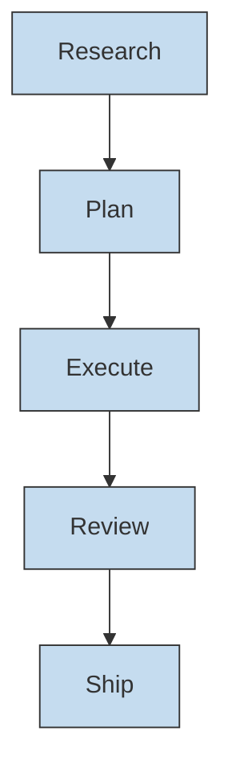
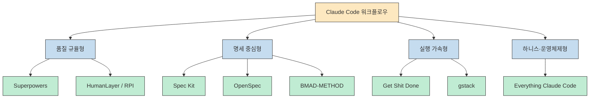
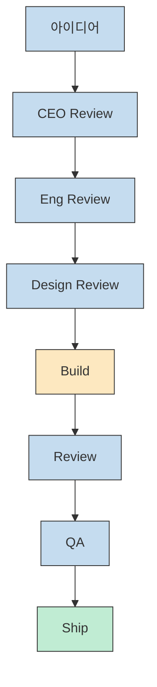
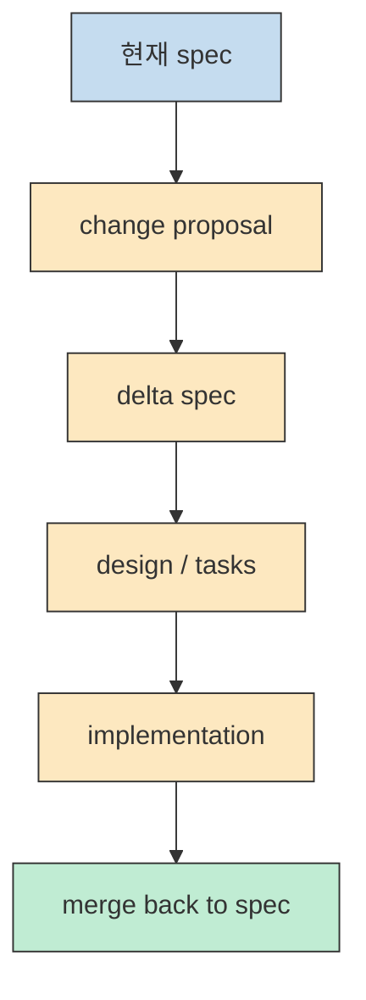
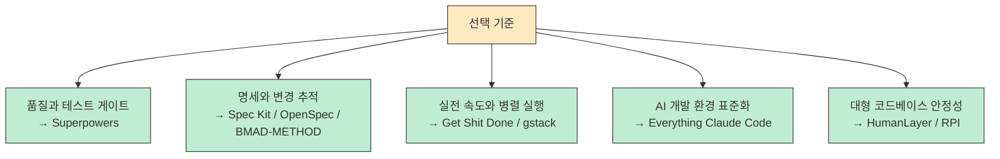

Claude Code 생태계를 조금만 깊게 따라가 보면 금방 헷갈립니다. `Superpowers`, `GSD`, `Spec Kit`, `OpenSpec`, `gstack`, `BMAD`, `Everything Claude Code`, `HumanLayer/RPI` 가 전부 비슷해 보이는데, 막상 안을 들여다보면 같은 문제를 푸는 방식이 전혀 다릅니다. 2026년 3월 24일 기준으로 `shanraisshan/claude-code-best-practice` 의 `Development Workflows` 표가 흥미로운 이유도 여기에 있습니다. 이 표는 여러 시스템을 단순 인기 순위가 아니라, **모두 `Research → Plan → Execute → Review → Ship` 라는 공통 골격 위에 서 있지만 각자 다른 철학을 얹은 워크플로우** 로 읽게 만듭니다. [Development Workflows](https://github.com/shanraisshan/claude-code-best-practice?tab=readme-ov-file#%EF%B8%8F-development-workflows)

그래서 이 글에서는 스타 수나 명령 개수보다 **작동 방식과 잘 맞는 상황** 에 집중합니다. 같은 "AI 코딩 워크플로우" 라고 묶여 있어도, 어떤 것은 테스트 규율을 강하게 밀고, 어떤 것은 명세 문서 체인을 중시하고, 어떤 것은 가상 엔지니어링 팀처럼 병렬 스프린트를 운영하고, 어떤 것은 아예 AI 개발 환경 전체를 하니스 시스템으로 보려 합니다. 결국 중요한 질문은 "무엇이 더 유명한가?" 가 아니라 **"내 팀이 지금 어느 실패 패턴을 줄이고 싶은가?"** 입니다.
<!--more-->

## Sources

- https://github.com/shanraisshan/claude-code-best-practice?tab=readme-ov-file#%EF%B8%8F-development-workflows
- https://github.com/obra/superpowers
- https://github.com/affaan-m/everything-claude-code
- https://github.com/github/spec-kit
- https://github.com/bmad-code-org/BMAD-METHOD
- https://github.com/garrytan/gstack
- https://github.com/gsd-build/get-shit-done
- https://github.com/Fission-AI/OpenSpec
- https://github.com/Fission-AI/OpenSpec/blob/main/docs/concepts.md
- https://block.github.io/goose/docs/tutorials/rpi/

## 1) 먼저 큰 그림부터: 8개가 완전히 다른 것이 아니라, 같은 뼈대 위에서 갈라진다

비교표가 먼저 던지는 메시지는 생각보다 단순합니다. 주요 워크플로우는 결국 `Research → Plan → Execute → Review → Ship` 으로 수렴합니다. 즉 차이는 골격이 아니라, **각 단계에서 무엇을 더 엄격하게 만들고 무엇을 자동화하며 무엇을 인간 승인 대상으로 남기느냐** 에 있습니다. [Development Workflows](https://github.com/shanraisshan/claude-code-best-practice?tab=readme-ov-file#%EF%B8%8F-development-workflows)

예를 들어 **Superpowers** 는 이 공통 골격 안에서 `Plan` 과 `Review` 를 아주 강하게 만들고, 구현 단계에서는 TDD를 강제하는 쪽으로 무게를 둡니다. 반대로 **GSD** 는 같은 흐름을 유지하되 컨텍스트 부패를 줄이고 phase 실행을 가볍게 돌리는 쪽에 더 관심이 많습니다. **Spec Kit** 과 **OpenSpec** 은 산출물과 명세 체인을 정교하게 만드는 데 힘을 쓰고, **gstack** 은 이 뼈대를 실제 팀 스프린트처럼 운영합니다. [Superpowers](https://github.com/obra/superpowers) [GET SHIT DONE](https://github.com/gsd-build/get-shit-done) [Spec Kit](https://github.com/github/spec-kit) [OpenSpec](https://github.com/Fission-AI/OpenSpec) [gstack](https://github.com/garrytan/gstack)

핵심은 이겁니다. **워크플로우를 고르는 일은 도구를 고르는 일이 아니라, 실패를 줄이는 방식을 고르는 일** 입니다. AI가 성급하게 구현부터 들어가서 망하느냐, 문서 없이 바뀐 요구사항을 놓치느냐, 큰 코드베이스에서 맥락을 잃느냐, 병렬 작업이 무질서해지느냐에 따라 선택지가 달라집니다.

## 2) 8개를 4가지 계열로 묶어 보면 더 이해가 쉽다

한 번에 여덟 개를 보는 것보다 계열로 보면 성격이 빨리 잡힙니다.

- **품질 규율형**: 코드 품질, 예측 가능성, 검증 순서를 강하게 잡습니다. 느릴 수 있지만 실패 비용이 큰 팀에 잘 맞습니다.
- **명세 중심형**: 산출물과 요구사항 정렬에 집중합니다. 여러 명이 협업하거나 기존 시스템을 바꿀 때 강합니다.
- **실행 가속형**: 과도한 문서 체계보다 실전 생산성을 우선합니다. 개인 개발자나 소규모 팀에게 매력적입니다.
- **하니스·운영체제형**: 단일 워크플로우가 아니라, 에이전트·훅·규칙·메모리·보안까지 묶은 운영 환경으로 봐야 합니다.

이제 각 워크플로우를 그 관점에서 보면 차이가 훨씬 선명해집니다.

## 3) Superpowers: "AI가 멋대로 구현부터 들어가는 것" 을 가장 강하게 막는다

**Superpowers** 의 핵심은 "잘 코딩하는 프롬프트" 가 아니라 **좋은 엔지니어링 순서를 강제하는 방법론** 입니다. 비교표는 이 워크플로우를 `TDD-first`, `Iron Laws`, `whole-plan review` 로 요약하고, 공식 저장소는 실제로 구현 단계에서 진짜 `red/green TDD` 를 강조합니다. [Development Workflows](https://github.com/shanraisshan/claude-code-best-practice?tab=readme-ov-file#%EF%B8%8F-development-workflows) [Superpowers](https://github.com/obra/superpowers)

장점은 명확합니다. 요구사항 정리 없이 바로 코드를 쓰는 패턴, 테스트 없이 일단 붙이는 패턴, 완료 판정이 흐린 패턴을 잘 막습니다. 특히 리팩터링, 결제, 인증, 데이터 마이그레이션처럼 한 번 잘못 건드리면 비용이 큰 영역에서 강합니다. 단점도 분명합니다. 작은 프로토타입이나 "일단 아이디어 확인" 용도로는 답답할 수 있고, 테스트 문화가 약한 팀은 처음부터 마찰이 큽니다.

- 잘 맞는 경우: 실서비스, 회귀 비용이 큰 기능, 테스트 없는 구현을 줄이고 싶은 팀
- 조심할 점: 속도보다 규율을 우선하기 때문에 실험적 MVP에는 과할 수 있음

## 4) Everything Claude Code: 워크플로우라기보다 AI 개발 운영체제에 가깝다

**Everything Claude Code** 는 다른 항목과 결이 조금 다릅니다. 비교표는 `instinct scoring`, `AgentShield`, `multi-lang rules` 를 특징으로 잡고 있고, 공식 README도 이 저장소를 단순 config pack이 아니라 **agent harness performance system** 으로 설명합니다. 즉 하나의 규칙이 아니라, 스킬·훅·메모리·보안·평가·병렬화까지 묶어 AI 에이전트 운영 환경 전체를 구성하는 쪽입니다. [Development Workflows](https://github.com/shanraisshan/claude-code-best-practice?tab=readme-ov-file#%EF%B8%8F-development-workflows) [Everything Claude Code](https://github.com/affaan-m/everything-claude-code)

이런 구조의 장점은 확장성입니다. 언어가 여러 개이고, 프로젝트도 여러 개이며, 팀이 반복적으로 같은 실패를 겪고 있다면, 단일 워크플로우보다 **에이전트 하니스 자체를 표준화** 하는 편이 더 이득일 수 있습니다. 반대로 개인 프로젝트나 소규모 저장소에서는 너무 크고 무거워서, 설치보다 운영 자체가 목적처럼 느껴질 수 있습니다.

- 잘 맞는 경우: 다언어 팀, 장기 운영, 보안·평가·메모리까지 표준화하고 싶은 경우
- 조심할 점: "무엇을 써야 하는지" 를 배우는 비용이 높고 소형 프로젝트엔 과할 수 있음

## 5) Spec Kit: 가장 정석적인 spec-driven 개발 흐름

**Spec Kit** 은 이 비교군에서 가장 교과서적인 spec-driven 도구에 가깝습니다. `constitution` 으로 프로젝트 원칙을 먼저 세우고, 그다음 `spec`, `plan`, `tasks`, `implement` 로 이어지는 순서를 분명하게 잡습니다. 공식 README도 `constitution.md`, `spec.md`, `plan.md`, `tasks.md` 산출물 체인을 아주 선명하게 보여 줍니다. [Spec Kit](https://github.com/github/spec-kit)

이 방식의 장점은 문서 기반 의사결정이 깔끔하다는 점입니다. 제품 요구사항과 기술 계획, 작업 순서가 섞이지 않고, 나중에 팀원이 합류해도 어디서 무엇을 읽어야 할지 명확합니다. 특히 여러 명이 같이 만드는 제품, 아키텍처 결정이 중요한 프로젝트, 요구사항이 자주 흔들리는 팀에서 유리합니다. 반대로 해커톤이나 짧은 스파이크에는 분명 느립니다. 문서를 싫어하는 팀은 형식만 남기 쉽고, 스펙을 실제 운영 자산으로 다룰 문화가 없으면 금방 유명무실해집니다.

- 잘 맞는 경우: PRD/spec 중심 팀, 협업 제품 개발, 장기 아키텍처 일관성이 중요한 경우
- 조심할 점: 급한 실험에는 느리고 문서 문화가 약하면 유지가 어려움

## 6) BMAD-METHOD: 역할 기반 SDLC 전체를 AI와 함께 구조화한다

**BMAD-METHOD** 는 단순 plan 도구보다 **전주기 개발 방법론** 쪽에 더 가깝습니다. 공식 README는 analysis, planning, architecture, implementation 전반에 걸친 structured workflow, specialized agents, complete lifecycle 을 강조합니다. 비교표가 `full SDLC`, `agent personas`, `22+ platforms` 라고 요약하는 이유도 여기에 있습니다. [Development Workflows](https://github.com/shanraisshan/claude-code-best-practice?tab=readme-ov-file#%EF%B8%8F-development-workflows) [BMAD-METHOD](https://github.com/bmad-code-org/BMAD-METHOD)

이 구조의 장점은 PM, Architect, Developer 같은 역할 분리가 선명하다는 점입니다. 그래서 개발자만이 아니라 기획자나 제품 담당자도 흐름에 참여하기 쉽습니다. 프로젝트를 하나의 구현 작업이 아니라, **아이디어부터 배포까지의 공동 작업 프로세스** 로 다루고 싶을 때 잘 맞습니다. 다만 작은 기능 하나 고치는 데도 페르소나와 단계가 너무 무거워질 수 있습니다. 실행 속도보다 프로세스 충실도가 먼저 나올 때가 있어, 실전 압박이 큰 팀은 답답하게 느낄 수 있습니다.

- 잘 맞는 경우: PM/기획/설계 문서가 중요한 제품 팀, 역할 기반 협업을 명확히 하고 싶은 경우
- 조심할 점: 작은 변경에는 절차가 과하고, 실행보다 프로세스가 앞설 수 있음

## 7) gstack: "가상 엔지니어링 팀" 이라는 운영 모델이 핵심이다

**gstack** 은 다른 항목처럼 명세 프레임워크라기보다 **운영 모델** 이 독특합니다. 공식 README는 CEO, Eng Manager, Designer, QA, Release Manager 같은 역할을 가진 전문가 집합으로 Claude Code를 설명하고, parallel sprints 파트에서는 여러 세션을 각기 다른 workspace에서 동시에 굴리는 구조를 전면에 내세웁니다. [gstack](https://github.com/garrytan/gstack)

즉 gstack의 핵심은 "좋은 문서를 남긴다" 보다 **실제 팀처럼 역할과 스프린트를 분리해서 병렬 실행한다** 는 데 있습니다. 이런 철학은 스타트업 스타일과 잘 맞습니다. 빨리 가설을 확인하고, 계획 리뷰와 디자인 리뷰, QA, ship 을 구분해 계속 돌리는 방식에 강합니다. 반대로 단일 개발자에게는 오히려 복잡할 수 있고, 자동 수정이나 자동 ship 류의 흐름을 무비판적으로 쓰면 통제가 약한 팀에서는 위험할 수 있습니다.

- 잘 맞는 경우: 창업자형 개발, 빠른 기능 실험, 역할 분리된 병렬 스프린트를 돌리고 싶은 팀
- 조심할 점: 단순 작업에는 과하고, write-capable 흐름은 가드레일 없이 쓰면 위험함

## 8) Get Shit Done: 복잡한 프레임워크보다 "실전에서 잘 굴러가는 흐름" 에 가깝다

**Get Shit Done** 은 이름처럼 철학이 분명합니다. 공식 README는 이 저장소를 **가볍지만 강한 meta-prompting, context engineering, spec-driven development system** 으로 소개하고, context rot 를 줄이는 데 집중한다고 설명합니다. 또 phase 실행을 dependency 기반 wave 로 묶고, 계획을 Claude 친화적인 XML 구조로 다루는 점이 특징입니다. [GET SHIT DONE](https://github.com/gsd-build/get-shit-done)

이 접근의 장점은 균형감입니다. 문서가 아예 없는 것도 아니고, 그렇다고 Spec Kit 수준의 무거운 산출물 체인을 강제하지도 않습니다. 그래서 개인 개발자나 소규모 팀이 **복잡한 설정 없이 생산성을 바로 끌어올리기** 좋습니다. 반면 내부 추상화가 많아서 왜 잘 되는지 체감하기 어려울 수 있고, XML plan이나 wave execution 같은 방식은 취향을 탑니다.

- 잘 맞는 경우: 개인 실전 생산성, 소규모 팀, 문서 과부하 없이 체계는 유지하고 싶은 경우
- 조심할 점: 원리를 파악하기 어려울 수 있고, 엄격한 명세 체계가 필요한 조직엔 가벼울 수 있음

## 9) OpenSpec: brownfield 변경 관리에 가장 또렷한 색깔이 있다

**OpenSpec** 은 기존 시스템 변경을 중심에 놓는다는 점에서 **Spec Kit** 과 닮으면서도 꽤 다릅니다. 공식 README는 lightweight spec layer 와 change folder 구조를 강조하고, concepts 문서는 아예 `brownfield-first`, `delta-based approach`, `fluid not rigid` 를 핵심 철학으로 못 박습니다. 즉 전체 시스템 명세를 매번 다시 쓰는 대신, **바뀌는 부분을 change artifact 와 delta spec으로 관리** 하려는 접근입니다. [OpenSpec](https://github.com/Fission-AI/OpenSpec) [OpenSpec Concepts](https://github.com/Fission-AI/OpenSpec/blob/main/docs/concepts.md)

이건 brownfield 환경에서 특히 강합니다. 이미 돌아가는 서비스에 새 기능을 추가하거나, 행동을 조금씩 바꾸거나, 영향도를 추적해야 할 때 효과가 큽니다. 반대로 완전히 새 프로젝트를 시작할 때는 Spec Kit 쪽이 더 직관적으로 느껴질 수 있습니다. OpenSpec의 진짜 강점은 greenfield의 이상적인 설계보다 **기존 시스템의 변화 추적성** 에 있습니다.

- 잘 맞는 경우: 기존 서비스 기능 추가, 리팩터링, 영향도 추적이 중요한 팀
- 조심할 점: artifact와 delta 개념을 이해해야 하므로 초반 러닝커브가 있음

## 10) HumanLayer / RPI: 큰 코드베이스에서 실패 확률을 줄이는 안전 지향 패턴

**HumanLayer / RPI** 는 엄밀히 말하면 거대한 프레임워크라기보다 **Research, Plan, Implement** 를 앞세운 작업 철학에 더 가깝습니다. Block의 Goose 문서도 이 패턴을 "속도보다 clarity, predictability, correctness 를 택하는 방식" 으로 설명합니다. 핵심은 간단합니다. 작은 변경이 아니면 바로 구현하지 말고, 먼저 조사하고 계획을 만든 뒤 구현으로 들어가라는 것입니다. [RPI Tutorial](https://block.github.io/goose/docs/tutorials/rpi/)

이 철학은 특히 대형 코드베이스에서 강합니다. 레거시, 모노레포, 수십만 줄 코드, 불확실한 의존성, 위험한 변경 지점이 많은 상황에서는 "빨리 한 번에" 보다 "확실히 틀리지 않게" 가 더 중요합니다. 반대로 작은 기능 추가나 실험적 프로토타입에서는 이 과정이 느리게 느껴질 수 있습니다. 결국 **HumanLayer / RPI** 의 가치는 속도가 아니라, AI가 큰 코드베이스에서 멋대로 수정하다 망할 확률을 줄이는 데 있습니다.

- 잘 맞는 경우: 대형 모노레포, 레거시, AI가 자주 탈선하는 환경
- 조심할 점: 소규모 작업에는 절차가 무겁고, 프로토타입 단계에는 과할 수 있음

## 11) 결국 무엇을 고르면 되나: 선택 기준은 세 가지면 충분하다

여덟 개를 다 외울 필요는 없습니다. 실제 선택에서는 보통 세 가지 질문이면 충분합니다.

정리하면 다음 표 정도로 압축할 수 있습니다.

| 상황 | 가장 먼저 볼 선택지 | 이유 |
|---|---|---|
| 품질과 회귀 방지가 최우선 | **Superpowers** | 계획, 테스트, 리뷰 게이트가 가장 강함 |
| AI 개발 환경 자체를 표준화하고 싶음 | **Everything Claude Code** | 스킬, 훅, 메모리, 보안, 평가까지 묶음 |
| 정석적인 spec-driven 개발을 원함 | **Spec Kit** | constitution → spec → plan → tasks 체인이 선명함 |
| 제품 개발 전 과정을 역할별로 구조화하고 싶음 | **BMAD-METHOD** | SDLC 전체와 agent personas 중심 |
| 병렬 스프린트를 가상 팀처럼 운영하고 싶음 | **gstack** | CEO, Eng, Design, QA, Ship 흐름이 명확함 |
| 개인 생산성을 빠르게 끌어올리고 싶음 | **Get Shit Done** | context rot 대응과 실행 중심 균형이 좋음 |
| 기존 프로젝트 변경 관리가 핵심 | **OpenSpec** | brownfield-first, delta spec, change artifact 중심 |
| 대형 코드베이스에서 안전하게 가고 싶음 | **HumanLayer / RPI** | 조사와 계획을 먼저 해서 실패 확률을 낮춤 |

## 12) 제 추천: 하나만 고르기보다, 먼저 자신의 실패 패턴을 고르는 편이 낫다

개인적으로 이 비교군에서 가장 캐릭터가 뚜렷한 것은 세 가지입니다.

- **개인 실전 생산성** 이 중요하면: **Get Shit Done**
- **품질과 테스트 규율** 이 중요하면: **Superpowers**
- **스펙 중심의 장기 운영** 이 중요하면: **Spec Kit**

그리고 나머지는 특정 조건에서 더 빛납니다. **OpenSpec** 은 brownfield 변경 관리가 핵심일 때, **gstack** 은 창업자형 병렬 운영이 필요할 때, **Everything Claude Code** 는 AI 개발 환경 자체를 운영체제처럼 깔고 싶을 때, **HumanLayer / RPI** 는 대형 코드베이스에서 안전성을 올리고 싶을 때, **BMAD-METHOD** 는 역할 기반 협업을 전주기로 굴리고 싶을 때 특히 설득력이 있습니다.

결국 좋은 선택은 "가장 강력한 것" 을 고르는 게 아닙니다. 지금 내 팀이 반복해서 망하는 지점이 어디인지 먼저 보고, 그 실패 패턴을 가장 정면으로 줄여 주는 워크플로우를 고르는 것이 맞습니다. 그 기준으로 보면, 이 여덟 개는 서로 경쟁한다기보다 **서로 다른 종류의 리스크를 처리하는 운영 철학** 에 가깝습니다.
