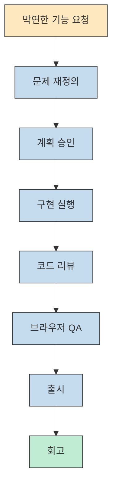
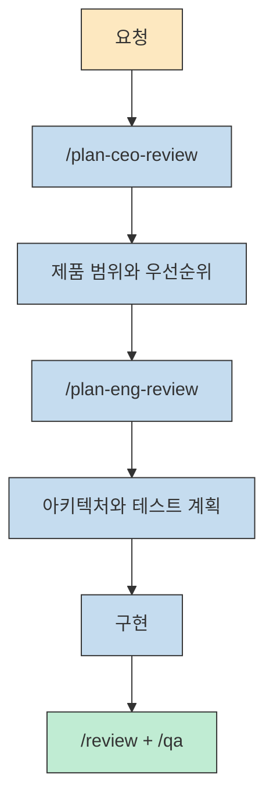
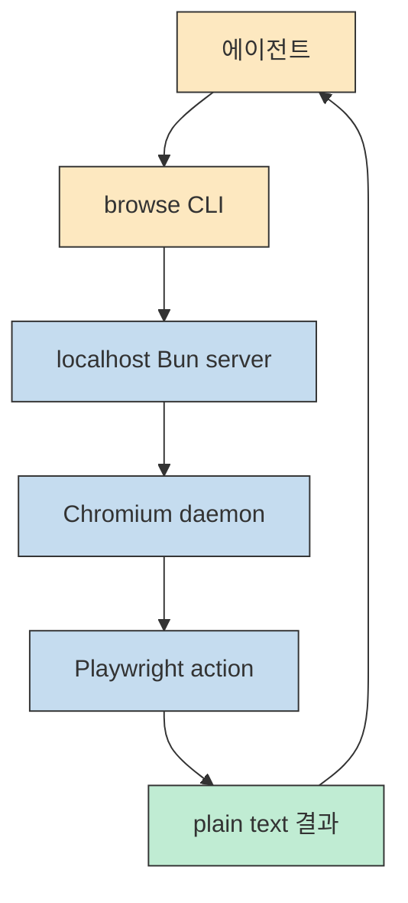
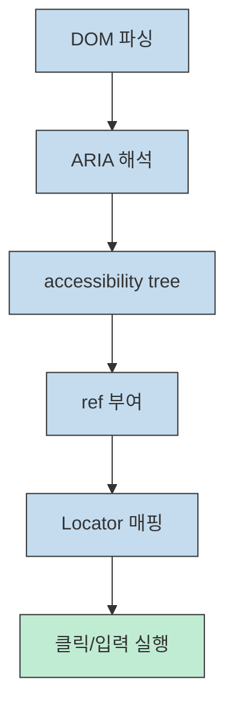
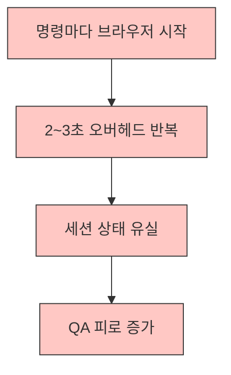
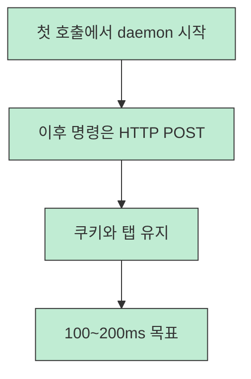
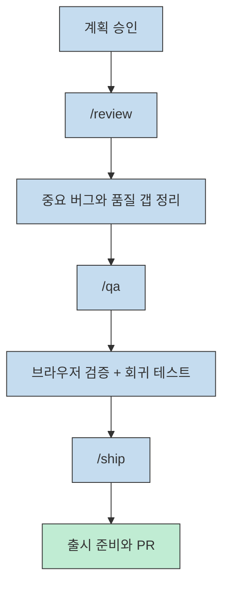
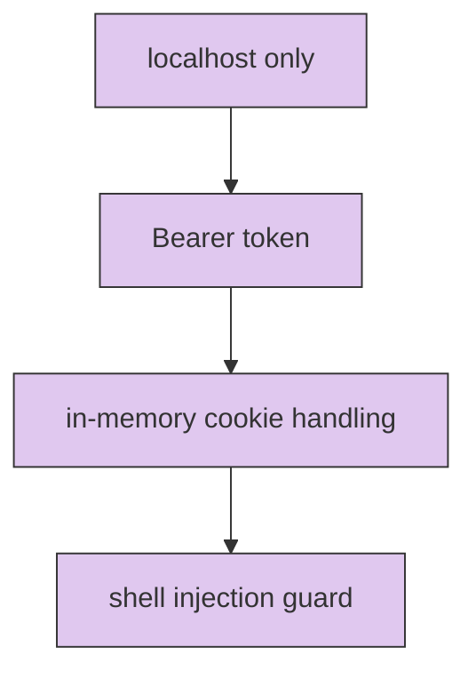

gstack를 그냥 "Claude Code용 스킬 모음"으로 보면 이 프로젝트의 핵심을 놓치기 쉽습니다. 이 영상이 보여 주는 진짜 포인트는, 하나의 에이전트에게 모든 일을 몰아주는 대신 CEO, 엔지니어링 매니저, QA, 릴리즈 엔지니어처럼 역할을 분리하고 그 순서를 워크플로로 고정했다는 점입니다. 발표자는 이를 Garry Tan의 노하우를 Markdown 스킬로 빌려 오는 경험이라고 설명하고, 실제로 기획부터 브라우저 QA, 회고까지를 하나의 개발 루프로 연결해 보여 줍니다 ([t=135](https://youtu.be/vfn_Ezu1qfk?t=135), [t=154](https://youtu.be/vfn_Ezu1qfk?t=154), [t=330](https://youtu.be/vfn_Ezu1qfk?t=330)).

날짜를 분리해서 읽는 것도 중요합니다. 영상은 2026-03-19에 업로드됐고, 설명란에는 업로드 시점 기준으로 15개 스킬과 2.5만 스타가 언급됩니다. 반면 제가 2026-03-24에 GitHub API로 확인했을 때 `garrytan/gstack` 저장소는 스타 43,925개, 포크 5,500개였고, 현재 README는 specialist skills와 power tools를 합쳐 28개의 slash command를 안내합니다. 즉 이 글은 영상이 전하는 설계 철학과 2026-03-24 기준 공식 저장소 상태를 구분해서 읽는 정리입니다. [YouTube 영상](https://www.youtube.com/watch?v=vfn_Ezu1qfk) [gstack 저장소](https://github.com/garrytan/gstack) [gstack README](https://github.com/garrytan/gstack/blob/main/README.md)

<!--more-->

## Sources

- [YouTube 영상](https://www.youtube.com/watch?v=vfn_Ezu1qfk)
- [gstack 저장소](https://github.com/garrytan/gstack)
- [gstack README](https://github.com/garrytan/gstack/blob/main/README.md)
- [gstack ARCHITECTURE](https://github.com/garrytan/gstack/blob/main/ARCHITECTURE.md)
- [gstack skills docs](https://github.com/garrytan/gstack/blob/main/docs/skills.md)

## 1) gstack가 빠르게 퍼진 이유는 "더 좋은 답변"보다 "더 좋은 작업 순서"를 줬기 때문이다

영상에서 gstack는 단순한 코드 생성기가 아니라 Claude Code를 가상 엔지니어링 팀으로 바꾸는 도구로 소개됩니다. CEO 리뷰, 엔지니어링 매니저 리뷰, QA, 릴리즈까지 전체 소프트웨어 라이프사이클을 구조화한다는 설명이 초반부터 반복되는데, 이 메시지가 곧 이 프로젝트의 바이럴 포인트였습니다. 사용자는 더 긴 프롬프트를 배우는 대신, 어떤 순서로 질문하고 검토하고 승인해야 하는지를 바로 가져갈 수 있었기 때문입니다 ([t=154](https://youtu.be/vfn_Ezu1qfk?t=154), [t=166](https://youtu.be/vfn_Ezu1qfk?t=166), [t=2030](https://youtu.be/vfn_Ezu1qfk?t=2030)).

README도 같은 점을 더 노골적으로 밀어붙입니다. 공식 문서는 gstack를 "virtual engineering team"이라고 정의하고, Think -> Plan -> Build -> Review -> Test -> Ship -> Reflect 순서를 하나의 스프린트처럼 설명합니다. 결국 사람들에게 먹힌 것은 "AI가 더 똑똑해진다"는 약속이 아니라, **AI가 엉뚱한 순서로 일하지 못하게 만든다** 는 약속에 더 가깝습니다. [gstack README](https://github.com/garrytan/gstack/blob/main/README.md) [gstack skills docs](https://github.com/garrytan/gstack/blob/main/docs/skills.md)

## 2) 핵심 DNA는 역할 분리, 완전성 지향, 거버넌스, 테스트 우선이다

발표자가 요약한 gstack의 DNA는 네 가지입니다. 역할 기반 분리, "boil the lake"에 가까운 완전성 지향, 구조화된 거버넌스, 그리고 테스트 최우선입니다. 이 조합은 단순해 보이지만 실제로는 범용 에이전트가 흔히 망가지는 지점을 정면으로 겨냥합니다. 범위를 확정하기 전에 코드를 쓰고, 설계 검토 없이 구현을 늘리고, 마지막에 테스트를 덧붙이는 식의 흐름을 금지하는 구조이기 때문입니다 ([t=339](https://youtu.be/vfn_Ezu1qfk?t=339), [t=353](https://youtu.be/vfn_Ezu1qfk?t=353), [t=367](https://youtu.be/vfn_Ezu1qfk?t=367), [t=375](https://youtu.be/vfn_Ezu1qfk?t=375)).

영상에서 `/plan-ceo-review`는 제품과 비전 관점의 재정의에, `/plan-review` 혹은 현재 README 기준 `/plan-eng-review`는 실행과 안정성 점검에 초점을 둡니다. 즉 둘 다 계획 단계이지만 질문이 다릅니다. 하나는 "무엇을 만들 것인가"를 다시 묻고, 다른 하나는 "그걸 어떤 구조로 안전하게 만들 것인가"를 고정합니다. 이 차이를 나누는 순간, AI는 하나의 대화형 편집기보다 작은 조직에 가까워집니다 ([t=1360](https://youtu.be/vfn_Ezu1qfk?t=1360), [t=1432](https://youtu.be/vfn_Ezu1qfk?t=1432), [t=1490](https://youtu.be/vfn_Ezu1qfk?t=1490)) [gstack skills docs](https://github.com/garrytan/gstack/blob/main/docs/skills.md)

## 3) browse 설계가 중요한 이유는 브라우저를 "도구 호출"이 아니라 "지속 상태 런타임"으로 봤기 때문이다

기술적으로 가장 재미있는 부분은 browse입니다. 영상은 사용자의 브라우저 요청이 CLI를 거쳐 Bun 서버로 들어가고, 서버가 Playwright와 Chromium을 붙인 뒤, 결과를 다시 일반 텍스트로 돌려준다고 설명합니다. 여기서 발표자가 특히 강조하는 지점은 MCP 프로토콜이나 JSON schema 오버헤드를 넣지 않고 plain text 입출력으로 설계를 단순화했다는 점입니다. 이 덕분에 첫 호출 이후에는 100~200ms 수준의 왕복 시간을 목표로 한다고 말합니다 ([t=387](https://youtu.be/vfn_Ezu1qfk?t=387), [t=427](https://youtu.be/vfn_Ezu1qfk?t=427), [t=997](https://youtu.be/vfn_Ezu1qfk?t=997)).

공식 `ARCHITECTURE.md`는 이 부분을 더 명확하게 씁니다. AI 에이전트가 브라우저와 상호작용하려면 sub-second latency와 persistent state가 필수이며, 그래서 gstack는 long-lived Chromium daemon을 localhost HTTP 위에 얹었다고 설명합니다. 다시 말해 browse의 핵심은 "브라우저를 열 수 있다"가 아니라, **한 번 열린 브라우저를 계속 살아 있게 유지하고 그 상태를 빠르게 호출한다** 는 점입니다. [gstack ARCHITECTURE](https://github.com/garrytan/gstack/blob/main/ARCHITECTURE.md)

여기서 Bun 선택도 단순한 취향 문제가 아닙니다. 발표자는 컴파일된 단일 바이너리, 내장 SQLite, 네이티브 TypeScript 실행, 내장 HTTP 서버를 이유로 듭니다. 공식 문서도 Bun을 택한 진짜 이유는 1ms급 시작 속도보다 compiled binary와 native SQLite라고 못박습니다. 즉 gstack의 browse는 "Node보다 Bun이 빠르다" 수준이 아니라, **설치 실패 가능성과 런타임 의존성을 줄이기 위해 Bun을 고른 배포 아키텍처** 입니다 ([t=449](https://youtu.be/vfn_Ezu1qfk?t=449), [t=474](https://youtu.be/vfn_Ezu1qfk?t=474), [t=528](https://youtu.be/vfn_Ezu1qfk?t=528)) [gstack ARCHITECTURE](https://github.com/garrytan/gstack/blob/main/ARCHITECTURE.md)

## 4) accessibility tree와 daemon model이 browse를 실전형으로 만든다

영상에서 가장 설득력 있는 설계 포인트는 accessibility tree 활용입니다. gstack는 `page.accessibility.snapshot()`으로 얻은 트리를 순회하면서 각 요소에 `@e1`, `@e2` 같은 ref를 붙이고, 이후 클릭과 입력은 이 ref를 기준으로 실행합니다. 발표자는 이것이 CSS selector나 XPath보다 안정적이고, 보이는 픽셀이 아니라 role과 name 같은 의미 기반 정보에 기대기 때문에 AI가 다루기 좋다고 설명합니다 ([t=660](https://youtu.be/vfn_Ezu1qfk?t=660), [t=698](https://youtu.be/vfn_Ezu1qfk?t=698), [t=729](https://youtu.be/vfn_Ezu1qfk?t=729)).

공식 문서가 덧붙이는 이유도 실전적입니다. DOM에 `data-ref`를 주입하는 방식은 CSP에 막히고, React/Vue/Svelte 하이드레이션에 의해 지워질 수 있으며, Shadow DOM 경계도 문제를 일으킵니다. 반대로 Playwright Locator와 accessibility tree는 DOM 바깥에서 동작하므로 이런 충돌을 줄입니다. 결국 gstack가 accessibility tree를 택한 이유는 "AI 친화적이라서" 이전에, **현대 프런트엔드 환경에서 덜 깨지기 때문** 입니다 ([t=807](https://youtu.be/vfn_Ezu1qfk?t=807), [t=841](https://youtu.be/vfn_Ezu1qfk?t=841), [t=873](https://youtu.be/vfn_Ezu1qfk?t=873)) [gstack ARCHITECTURE](https://github.com/garrytan/gstack/blob/main/ARCHITECTURE.md)

daemon model도 같은 철학입니다. 매 명령마다 브라우저를 새로 띄우면 2~3초가 반복되고, 쿠키와 로그인 세션, 탭 상태도 매번 날아갑니다. 그래서 gstack는 첫 호출만 느리고 이후에는 살아 있는 Chromium에 HTTP POST만 보내는 구조를 택합니다. 영상은 여기에 30분 유휴 시 자동 종료, state file 기반 재시작, stale ref를 `count()`로 빠르게 검출해 30초 타임아웃 대신 즉시 실패시키는 방식을 설명합니다. 즉 browse는 빠르기만 한 것이 아니라, **느리게 틀리기보다 빠르게 실패하는 쪽을 택한 런타임** 입니다 ([t=923](https://youtu.be/vfn_Ezu1qfk?t=923), [t=937](https://youtu.be/vfn_Ezu1qfk?t=937), [t=1004](https://youtu.be/vfn_Ezu1qfk?t=1004)) [gstack ARCHITECTURE](https://github.com/garrytan/gstack/blob/main/ARCHITECTURE.md)

## 5) review, qa, ship가 붙으면서 gstack는 도구가 아니라 운영체계가 된다

영상은 중반 이후 당시 기준 13개 스킬을 계획, 코드/배포, QA, 유틸리티로 나눠 보여 줍니다. 여기서 중요한 것은 스킬 수보다 역할 차이입니다. `/review`는 staff engineer 식의 두 단계 리뷰로 심각한 문제와 정보성 문제를 나누고, `/qa`는 실제 브라우저를 열어 테스트하고 수정과 회귀 테스트까지 묶어서 수행합니다. `/ship`은 메인 브랜치 동기화, 테스트, 리뷰, 버전 범프, PR 생성까지 연결합니다. 각각을 따로 쓰는 것도 가능하지만, 설계 의도는 명확하게 **하나의 스프린트 파이프라인** 입니다 ([t=1280](https://youtu.be/vfn_Ezu1qfk?t=1280), [t=1502](https://youtu.be/vfn_Ezu1qfk?t=1502), [t=1562](https://youtu.be/vfn_Ezu1qfk?t=1562), [t=1620](https://youtu.be/vfn_Ezu1qfk?t=1620)).

README와 `skills.md`를 보면 이 흐름은 영상 이후 더 강화됐습니다. 지금은 `/office-hours`, `/plan-ceo-review`, `/plan-eng-review`, `/review`, `/qa`, `/ship`, `/retro`, `/codex`, `/cso`까지 연결되며, Conductor 같은 멀티 세션 도구와 조합하는 설명도 전면에 나옵니다. 즉 gstack는 프롬프트 재사용 도구가 아니라, **역할이 다른 AI를 순서대로 배치하는 운영 레이어** 로 읽는 편이 정확합니다. [gstack README](https://github.com/garrytan/gstack/blob/main/README.md) [gstack skills docs](https://github.com/garrytan/gstack/blob/main/docs/skills.md)

## 6) 실전 적용 포인트

1. gstack에서 바로 가져갈 핵심은 스킬 이름이 아니라 작업 순서입니다. 제품 재정의 -> 엔지니어링 계획 -> 리뷰 -> QA -> 배포 -> 회고 순서를 프로젝트 운영 규칙으로 먼저 고정하는 편이 효과가 큽니다 ([t=1993](https://youtu.be/vfn_Ezu1qfk?t=1993), [t=2017](https://youtu.be/vfn_Ezu1qfk?t=2017)).
2. `CLAUDE.md`나 `AGENTS.md`에 어떤 스킬을 언제 쓰는지 명시하면, 에이전트는 빈 프롬프트보다 훨씬 덜 흔들립니다. 영상도 setup 재실행, auto-upgrade, 스킬 목록 문맥 주입을 실전 팁으로 강조합니다 ([t=2220](https://youtu.be/vfn_Ezu1qfk?t=2220), [t=2253](https://youtu.be/vfn_Ezu1qfk?t=2253), [t=2265](https://youtu.be/vfn_Ezu1qfk?t=2265)).
3. browse 계열 도구는 단순 데모보다 실제 QA에 붙을 때 가치가 커집니다. persistent browser와 accessibility ref의 장점은 "로그인된 상태를 유지한 채 여러 단계 검증"에서 가장 크게 드러납니다 ([t=991](https://youtu.be/vfn_Ezu1qfk?t=991), [t=1668](https://youtu.be/vfn_Ezu1qfk?t=1668)).
4. 성능 비교표에서 말하는 "0 토큰 오버헤드"는 영상의 설계 주장이지 제가 직접 재측정한 벤치마크는 아닙니다. 따라서 절대 수치보다, 왜 plain text와 daemon model을 선택했는지라는 설계 의도로 읽는 편이 안전합니다 ([t=1800](https://youtu.be/vfn_Ezu1qfk?t=1800), [t=1838](https://youtu.be/vfn_Ezu1qfk?t=1838)).
5. 영상 후반부가 보여 주듯 gstack는 일부를 의도적으로 비워 둡니다. 웹소켓 스트리밍, MCP, 멀티유저, iframe 지원 부재는 미완성이라기보다 복잡성을 제어하려는 선택에 가깝습니다 ([t=2311](https://youtu.be/vfn_Ezu1qfk?t=2311), [t=2385](https://youtu.be/vfn_Ezu1qfk?t=2385), [t=2422](https://youtu.be/vfn_Ezu1qfk?t=2422)).

## 7) 성능, 보안, 그리고 왜 일부 기능을 일부러 빼는가

영상은 보안 레이어도 짧지만 명확하게 짚습니다. localhost 바인딩, bearer token, 메모리 내 쿠키 처리, shell injection 방지라는 네 겹의 방어를 설명하는데, `ARCHITECTURE.md`도 거의 같은 내용을 더 자세히 적고 있습니다. 이 점이 중요한 이유는 browse가 결국 실제 로그인 세션과 브라우저 상태를 다루기 때문입니다. gstack의 설계는 기능 추가보다도 **민감한 상태를 최소 범위에서 유지하고, 서버를 네트워크 밖에 가두는 것** 에 우선순위를 두고 있습니다 ([t=1769](https://youtu.be/vfn_Ezu1qfk?t=1769), [t=1794](https://youtu.be/vfn_Ezu1qfk?t=1794), [t=1808](https://youtu.be/vfn_Ezu1qfk?t=1808)) [gstack ARCHITECTURE](https://github.com/garrytan/gstack/blob/main/ARCHITECTURE.md)

동시에 영상은 "왜 없는 기능이 많은가"도 설명합니다. 웹소켓 스트리밍이 없고, MCP가 없고, 멀티유저도 없고, iframe ref도 없습니다. 이런 선택은 단점처럼 보일 수 있지만, 반대로 보면 gstack의 철학을 드러냅니다. 이 프로젝트는 가능한 많은 표준을 껴안기보다, 빠르고 예측 가능한 로컬 런타임을 먼저 만드는 쪽을 택합니다. 그래서 gstack를 볼 때는 기능표보다 **무엇을 과감히 빼서 이 속도와 단순함을 얻었는가** 를 같이 봐야 합니다 ([t=2311](https://youtu.be/vfn_Ezu1qfk?t=2311), [t=2338](https://youtu.be/vfn_Ezu1qfk?t=2338), [t=2385](https://youtu.be/vfn_Ezu1qfk?t=2385)) [gstack ARCHITECTURE](https://github.com/garrytan/gstack/blob/main/ARCHITECTURE.md)

## 핵심 요약

- gstack가 빠르게 퍼진 이유는 좋은 프롬프트 몇 개보다, AI가 따라야 할 작업 순서를 바로 제공했기 때문입니다 ([t=154](https://youtu.be/vfn_Ezu1qfk?t=154), [t=330](https://youtu.be/vfn_Ezu1qfk?t=330)).
- browse의 본질은 Playwright 자체가 아니라 Bun 기반 daemon, persistent browser state, plain text IO를 묶은 런타임 설계입니다 ([t=387](https://youtu.be/vfn_Ezu1qfk?t=387), [t=997](https://youtu.be/vfn_Ezu1qfk?t=997)) [gstack ARCHITECTURE](https://github.com/garrytan/gstack/blob/main/ARCHITECTURE.md)
- accessibility tree와 stale ref fail-fast 전략은 현대 프런트엔드 환경에서 덜 깨지는 자동화를 만들기 위한 실용적 선택입니다 ([t=660](https://youtu.be/vfn_Ezu1qfk?t=660), [t=923](https://youtu.be/vfn_Ezu1qfk?t=923)) [gstack ARCHITECTURE](https://github.com/garrytan/gstack/blob/main/ARCHITECTURE.md)
- review, qa, ship가 붙는 순간 gstack는 툴킷이 아니라 운영체계처럼 작동합니다 ([t=1502](https://youtu.be/vfn_Ezu1qfk?t=1502), [t=1620](https://youtu.be/vfn_Ezu1qfk?t=1620)) [gstack skills docs](https://github.com/garrytan/gstack/blob/main/docs/skills.md)
- 2026-03-24 기준 공식 저장소는 43,925 stars와 5,500 forks였고, README는 28개 slash command를 안내합니다. 따라서 이 프로젝트는 영상 공개 이후에도 매우 빠르게 확장 중인 상태입니다. [gstack 저장소](https://github.com/garrytan/gstack)

## 결론

gstack를 한 줄로 정리하면, Claude Code를 더 똑똑하게 만드는 플러그인이 아니라 Claude Code가 팀처럼 일하게 만드는 운영 설계에 가깝습니다. 그래서 이 프로젝트에서 배울 가장 큰 포인트는 스킬 개수나 스타 수보다, 역할을 나누고 승인 지점을 만들고 브라우저 상태를 지속시키고 실패를 빠르게 드러내는 방식 그 자체입니다. [YouTube 영상](https://www.youtube.com/watch?v=vfn_Ezu1qfk) [gstack README](https://github.com/garrytan/gstack/blob/main/README.md)

같은 모델을 써도 결과가 달라지는 이유는 종종 모델 자체보다 작업 순서에 있습니다. gstack는 그 사실을 가장 공격적으로 보여 주는 사례 중 하나이고, 그래서 이 프로젝트의 진짜 가치는 "설치해서 써 보라"보다 "내 워크플로도 이렇게 분리할 수 있는가"를 되묻게 만든다는 데 있습니다. [gstack skills docs](https://github.com/garrytan/gstack/blob/main/docs/skills.md) [gstack ARCHITECTURE](https://github.com/garrytan/gstack/blob/main/ARCHITECTURE.md)

<!--
Evidence notes
- claim: video frames gstack as a virtual engineering team spanning CEO review, eng review, QA, release | transcript/time marker: 02:14-02:41 | video url: https://youtu.be/vfn_Ezu1qfk?t=154 | confidence: high
- claim: the four DNA pillars are role separation, completeness, governance, and tests first | transcript/time marker: 05:39-06:18 | video url: https://youtu.be/vfn_Ezu1qfk?t=339 | confidence: high
- claim: browse flow uses CLI -> Bun server -> Playwright/Chromium -> plain text return without MCP overhead | transcript/time marker: 06:27-07:17 | video url: https://youtu.be/vfn_Ezu1qfk?t=387 | confidence: high
- claim: Bun is chosen for compiled binary, native SQLite, native TypeScript, and built-in HTTP server | transcript/time marker: 07:29-09:40 | video url: https://youtu.be/vfn_Ezu1qfk?t=449 | confidence: high
- claim: accessibility tree is used as the main element identification strategy | transcript/time marker: 11:00-14:42 | video url: https://youtu.be/vfn_Ezu1qfk?t=660 | confidence: high
- claim: stale refs are detected via quick count checks and fail fast | transcript/time marker: 15:23-15:38 | video url: https://youtu.be/vfn_Ezu1qfk?t=923 | confidence: high
- claim: daemon model keeps browser state and targets fast repeated calls | transcript/time marker: 16:31-17:05 | video url: https://youtu.be/vfn_Ezu1qfk?t=991 | confidence: high
- claim: review, qa, and ship are presented as specialized phases rather than isolated commands | transcript/time marker: 21:20-27:40 | video url: https://youtu.be/vfn_Ezu1qfk?t=1280 | confidence: high
- claim: practical guidance includes CLAUDE.md integration, setup rerun, and auto-upgrade | transcript/time marker: 37:00-37:50 | video url: https://youtu.be/vfn_Ezu1qfk?t=2220 | confidence: high
- claim: omissions include no websocket streaming, no MCP, no iframe support | transcript/time marker: 38:31-40:25 | video url: https://youtu.be/vfn_Ezu1qfk?t=2311 | confidence: high
- claim: official repo on 2026-03-24 had 43,925 stars, 5,500 forks, and README described 28 slash commands | transcript/time marker: GitHub repo metadata + README checked on 2026-03-24 | video url: https://github.com/garrytan/gstack | confidence: high
-->
