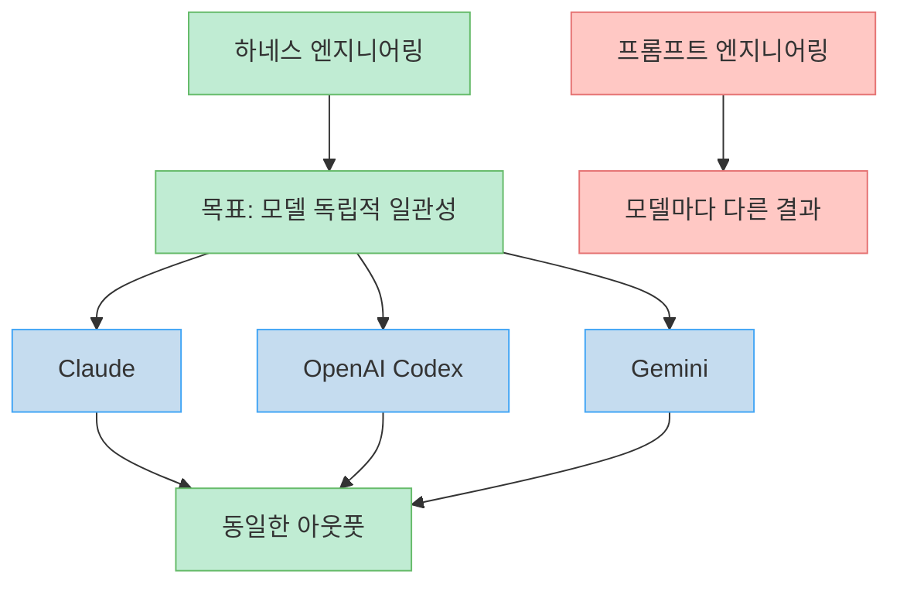
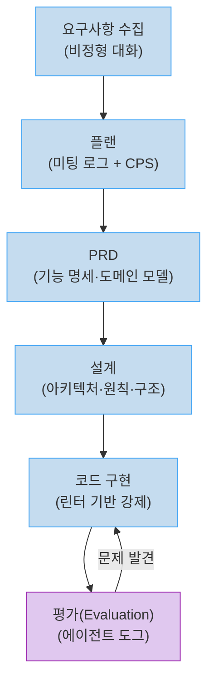
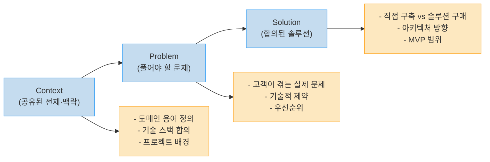
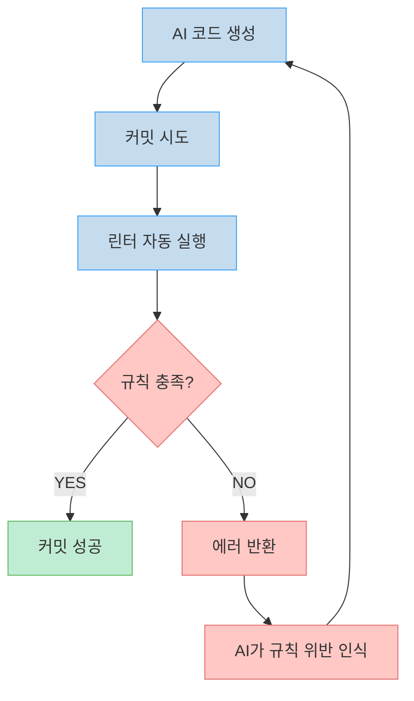
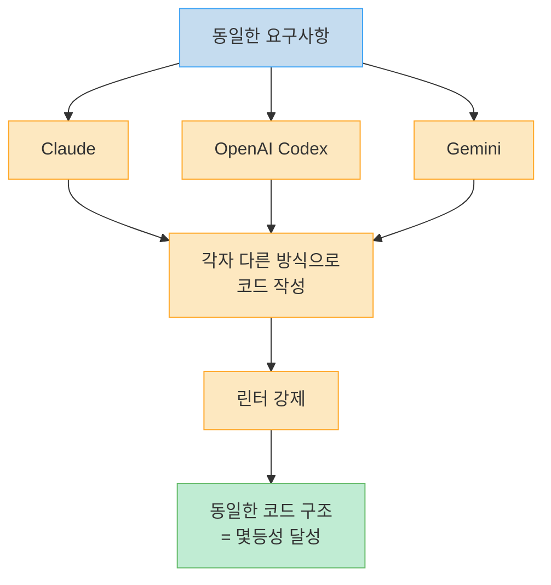
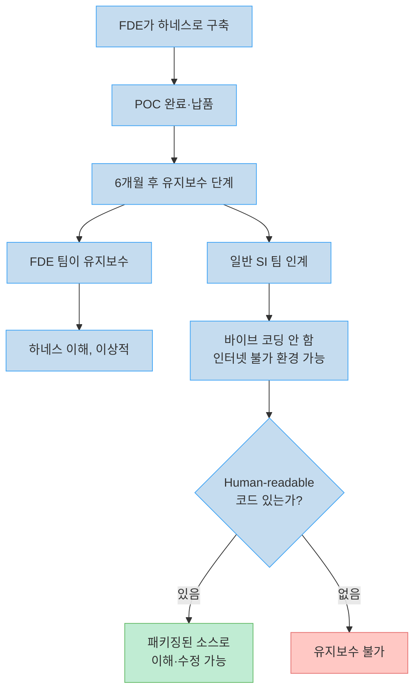
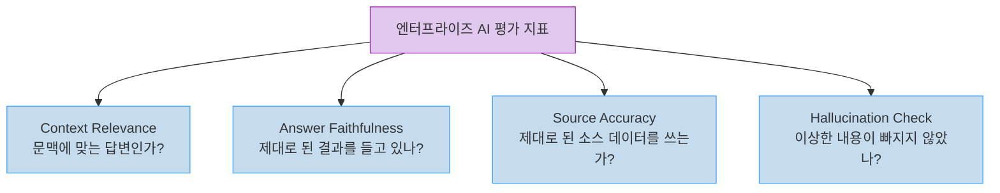
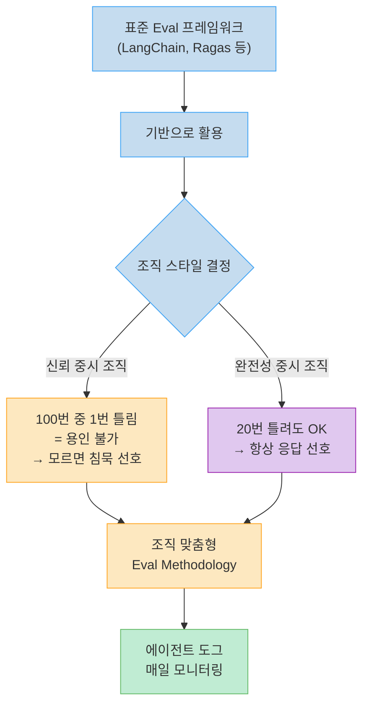
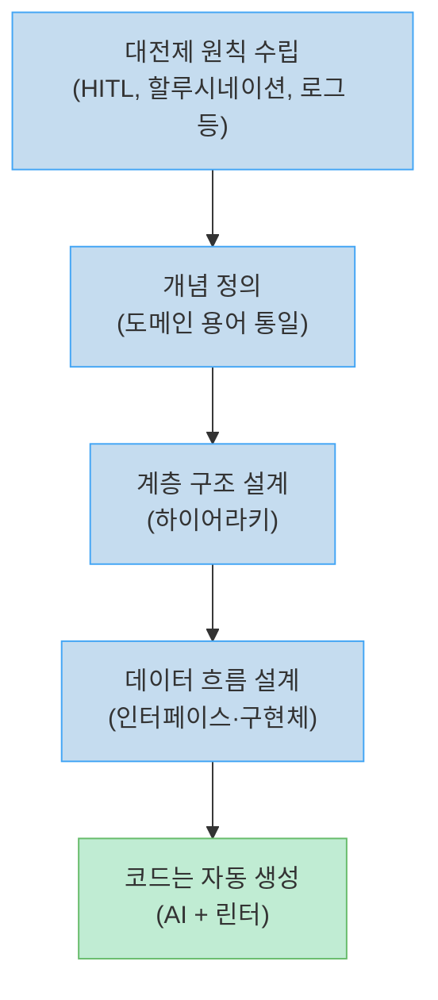
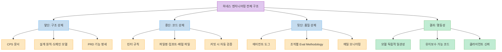

프롬프트 엔지니어링은 AI에게 잘 부탁하는 기술이다. 하네스 엔지니어링은 AI가 잘못된 방향으로 갈 수 없도록 구조 자체를 설계하는 기술이다.

DIO의 Forward Deployed Engineer(FDE) 김지운 님은 Claude를 쓰든, OpenAI Codex를 쓰든, Gemini를 쓰든 동일한 코드 구조와 문서가 나오는 시스템을 구축하는 데 수백 시간을 투자했다. 배달 플랫폼 4개 소프트웨어를 3개 모델에 시키면 12개의 결과물이 나오는데, 그 12개가 실질적으로 동일하다는 것을 직접 시연했다. 이것이 하네스 엔지니어링의 목표다.

<!--more-->

## Sources

- [상위 1% AI 네이티브들은 프롬프트 안쓰고 '하네스 깎기'에 수백시간 투자합니다 - 빌더 조쉬](https://youtu.be/A8PMyC7W_vg)

---

## 하네스 엔지니어링이란 무엇인가

[https://youtu.be/A8PMyC7W_vg?t=30](https://youtu.be/A8PMyC7W_vg?t=30)에서 핵심 개념을 소개한다.

> "클로드를 쓰든 코덱스를 쓰든 제미나를 쓰든 이 하네스 엔지니어링이라는 기법을 잘 활용하면 다른 AI 모델을 써도 같은 아웃풋으로 나올 수 있게끔을 강제할 수 있다."

AI 모델의 랭킹은 6개월마다 뒤바뀐다. 지금 Claude Opus가 최고라도 GPT 5.3이 나오면 바뀔 수 있다. 그런데 매번 모델이 바뀔 때마다 결과물 품질이 달라진다면 엔터프라이즈 수준의 소프트웨어를 납품할 수 없다.

하네스 엔지니어링은 이 문제를 **모델 레이어가 아닌 설계 레이어**에서 해결한다. 어떤 AI 모델에도 통하는 구조적 가드레일을 미리 만들어 두면, 모델이 바뀌어도 아웃풋은 바뀌지 않는다.

비유하면 **디자인 시스템**과 같다. 디자인 시스템은 어떤 디자이너가 작업해도 동일한 브랜드 품질의 결과물이 나오도록 강제한다. 하네스 엔지니어링은 코드 레벨에서 그 역할을 한다.

---

## 6단계 워크플로우: 배달 플랫폼 예시

[https://youtu.be/A8PMyC7W_vg?t=60](https://youtu.be/A8PMyC7W_vg?t=60)에서 시연에 사용한 더미 스펙을 소개한다. 일반적인 배달 플랫폼에는 4개의 소프트웨어가 필요하다.

| 소프트웨어 | 역할 |
|---------|-----|
| 고객 앱 | 주문 |
| 기사 앱 | 픽업·배달 경로 안내 |
| 음식점 앱 | 주문 수락·조리 완료 알림 |
| 어드민 | 전체 관리 |

고객은 처음에 "고객이 주문하는 앱만 있으면 된다"고 말하지만, FDE가 대화를 이끌어 가면서 기사 앱, 음식점 앱, 어드민의 필요성이 도출된다. 이것이 요구사항 분석의 첫 단계다.

[https://youtu.be/A8PMyC7W_vg?t=280](https://youtu.be/A8PMyC7W_vg?t=280)에서 6단계 전체 흐름을 제시한다.

### FDE 미팅 리듬

FDE는 주 2~3회 고객사를 방문하는데, 하루에 오전(출근 직후)·오후(퇴근 직전) 두 번 미팅을 한다. 주 2회라면 총 4회의 고정 미팅이 생긴다. 매 미팅마다 **직전에 완성한 것 리뷰 + 오늘 할 것 확인** 패턴으로 진행된다.

미팅의 원칙은 두 가지다. 첫째, **고객을 제한하지 않는다.** 고객이 하고 싶은 말을 전부 하게 한다. FDE가 두 명이 함께 들어가면 한 명이 고객을 막으려 할 때 다른 한 명이 눈빛으로 막는다. 둘째, 그 모든 발산을 **수렴해서 구조화**한다.

---

## CPS 문서 프레임워크

[https://youtu.be/A8PMyC7W_vg?t=500](https://youtu.be/A8PMyC7W_vg?t=500)에서 CPS 프레임워크의 기원과 활용을 설명한다.

CPS는 **Context-Problem-Solution**의 약자다. 팔란티어의 내부 미팅 방식인 'MURD 세션'에서 영감을 받아 도입했다.

### CPS가 필요한 이유

매번 새로운 문제가 나오고 솔루션이 교환된다. 그때마다 컨텍스트가 쌓인다. CPS 문서는 그 쌓인 컨텍스트를 기반으로 솔루션이 도출됐음을 보여준다. 나중에 다른 사람이 문서를 보더라도 "왜 이 솔루션이 나왔는지"를 바로 이해할 수 있다.

클라이언트와도 공유한다. 고객이 CPS 문서를 읽고 구현 세계관을 이해한 뒤 다음 미팅에 오면 훨씬 깊은 논의가 가능해진다. 문서는 마크다운으로 작성하다가 LaTeX 템플릿으로 PDF 빌드해서 전달한다.

### 문서 공유 타이밍

[https://youtu.be/A8PMyC7W_vg?t=650](https://youtu.be/A8PMyC7W_vg?t=650)에서 POC 기간 중 문서를 두 번 공유한다고 설명한다.

1. **1차 스펙 확정 시**: 지금까지 이야기한 기능 명세와 분석 과정을 정리
2. **프로젝트 완료 시**: 역기획해서 최종 산출물로 전달

대부분의 미팅에서는 소프트웨어 결과물만 가져간다. 문서는 깃허브에서 계속 업데이트되지만, 형식적인 전달은 두 번에 한정한다.

---

## 린터 기반 코드 강제와 몇등성

[https://youtu.be/A8PMyC7W_vg?t=1550](https://youtu.be/A8PMyC7W_vg?t=1550)에서 하네스 엔지니어링의 기술적 핵심인 린터 시스템을 설명한다.

### 왜 린터인가

설계 단계에서 원칙과 도메인 모델이 정해지면 코드 자체는 AI가 작성한다. 그런데 여러 AI 모델은 같은 개념을 다른 방식으로 표현한다. 레스토랑 목록 페이지를 누구는 `RestaurantListPage`라고 하고, 누구는 `RestaurantsPage`라고 하고, 누구는 `RestaurantSearchPage`라고 한다. 프롬프트로 이걸 매번 강제할 수는 없다.

린터는 이 문제를 해결한다. 규칙을 코드 레벨에서 강제하면, **어떤 AI 모델이 코드를 생성해도 규칙을 만족시키지 않으면 커밋 자체가 안 된다.**

### 적용되는 린터 규칙

[https://youtu.be/A8PMyC7W_vg?t=1700](https://youtu.be/A8PMyC7W_vg?t=1700)에서 구체적인 규칙을 공개한다.

**파일명 규칙:**
- 레스토랑이 모여있는 페이지는 복수형 강제: `restaurants.page.tsx`
- `detail`, `list`, `search` 같은 접미사 파일명 사용 금지
- 레스토랑 단건 상세는: `restaurant.page.tsx`

**임포트 규칙:**
- 임포트 문 알파벳 순서 강제
- 임포트 가능한 파일 / 불가능한 파일 구분
- 배럴 파일(index 파일) 생성 규칙

**효과:** 파일명이 강제되면 파일 내의 클래스명, 헬퍼 메소드명도 연쇄적으로 강제된다. 규칙이 전파되는 구조다.

### 몇등성(Idempotency) 달성

[https://youtu.be/A8PMyC7W_vg?t=1970](https://youtu.be/A8PMyC7W_vg?t=1970)에서 시연 결과를 보여준다.

> "총 네 개의 소프트웨어를 세 개 모델에 시켰으니까 12개가 나오게 됐었거든요. 결국 어디 어떤 모델을 시켜도 똑같은 아웃풋이 나오게 됩니다."

입력 요구사항이 a~f(소문자)이든 A~C(대문자)이든 동치의 아웃풋이 나온다. 어떤 AI 모델이 어떤 방식으로 코드를 작성해도 린터를 통과하는 순간 동일한 구조로 수렴한다.

### 린터의 장단점

[https://youtu.be/A8PMyC7W_vg?t=1850](https://youtu.be/A8PMyC7W_vg?t=1850)에서 솔직한 트레이드오프를 설명한다.

**장점:**
- 일관성 있는 코드 품질
- 유지보수 시 코드 역할이 구조적으로 명확
- 버그가 있는 코드를 지우고 다시 쓸 때 원래 인터페이스를 역추적해서 재구현하기 쉬움 (AI가 이 작업을 너무 쉽게 해줌)

**단점:**
- AI 자체적으로는 자신만의 읽기/생성하기 쉬운 스타일이 있는데, 인간이 강제한 규칙이 AI에게 비효율적일 수 있음
- 그러나 이 단점을 압도하는 장점이 있다: **인간과의 협업을 위한 코드**

---

## 엔터프라이즈 AI의 유지보수 문제

[https://youtu.be/A8PMyC7W_vg?t=1900](https://youtu.be/A8PMyC7W_vg?t=1900)에서 린터 강제의 진짜 이유를 설명한다.

> "결국에 받는 사람이 바이브 코딩을 안 할 거면, 그리고 거기서 인터넷도 안 되는 데서 코딩을 해야 되는 환경이면 우리는 거기에 맞게 완벽한 예쁜 패키징된 소스를 줘야 된다."

바이브 코딩으로 만든 소프트웨어가 6개월 후 유지보수 단계에 넘어가면 어떻게 되는가? FDE는 그 회사에 영원히 있지 않다. 유지보수는 일반 SI 팀이 받을 수도 있다. 그 SI 팀은 바이브 코딩을 하지 않을 수 있고, 인터넷이 안 되는 환경에서 작업해야 할 수도 있다.

따라서 자유롭게 블루프린트를 세팅해도, **최종 아웃풋은 엔지니어 레벨의 패키징된 소스로 내야 한다.** 하네스 엔지니어링이 이 요구사항을 충족시킨다.

---

## 평가(Evaluation) 시스템: 에이전트 도그

[https://youtu.be/A8PMyC7W_vg?t=2150](https://youtu.be/A8PMyC7W_vg?t=2150)에서 하네스의 마지막 레이어인 평가 시스템을 소개한다.

코드 구조는 린터로 잡았다. 그러면 AI의 **답변 품질**은 어떻게 지속적으로 모니터링하는가?

> "옛날에 데이터 도그처럼 에이전트 도그 같다 이렇게 많이 부르거든요. 이거를 매일매일 체크가 되면서 이 품질이 유지되고 있는지."

DataDog이 인프라를 모니터링하듯, 에이전트의 응답 품질을 매일 모니터링하는 시스템이다.

### 4가지 기본 평가 지표

[https://youtu.be/A8PMyC7W_vg?t=2200](https://youtu.be/A8PMyC7W_vg?t=2200)에서 RAG 시스템 평가에서 흔히 쓰이는 4가지 기본 지표를 소개한다.

### 조직별 커스터마이즈의 중요성

[https://youtu.be/A8PMyC7W_vg?t=2300](https://youtu.be/A8PMyC7W_vg?t=2300)에서 평가 기준이 조직마다 달라야 한다고 강조한다.

> "100번 물었을 때 한 번 틀린 게 좋은 건지 나쁜 건지, 우리 조직에선 100번 물었을 때 10번 틀리더라도 답을 아예 안 했으면 좋겠다. 아니면 어떤 조직은 20번 틀리더라도 틀린 답이라도 했으면 좋겠다. 이게 조직별로 스타일이 다르거든요."

정확도보다 침묵이 나은 조직이 있고, 약간의 오류를 감수하더라도 항상 응답하는 것이 나은 조직이 있다. 랭체인 같은 표준 프레임워크의 평가 방식을 그대로 가져다 쓰면 안 되고, **조직의 문화와 KPI에 맞는 평가 방법론**을 구성해야 한다.

이 평가 시스템은 클라이언트에게도 가시성을 준다. "지금도 잘 작동하고 있구나"를 매일 확인할 수 있어 안심감을 준다. 동시에 FDE와 클라이언트 사이의 장기적 신뢰 유지에도 기여한다.

---

## 설계 원칙과 도메인 모델: 코드 이전 단계

[https://youtu.be/A8PMyC7W_vg?t=980](https://youtu.be/A8PMyC7W_vg?t=980)에서 코드 구현 전에 반드시 정리해야 할 두 가지를 설명한다.

### 대전제 원칙 세우기

에이전트 프로젝트라면 공통적으로 정의해야 할 원칙이 있다:
- 휴먼 인더 루프(HITL)를 어디까지 허용하는가
- 할루시네이션이 없어야 하는가
- 오딧 로그가 잘 남아야 하는가

이런 대전제 원칙들을 프로젝트 초반에 명문화한다.

### 개념 정의와 계층 구조

원칙이 세워지면 도메인의 개념을 정의한다. 개념의 하이어라키(계층 구조)가 정해지면 구조가 만들어지고, 그 구조에 맞게 데이터를 어떻게 주고받을지 기술적으로 설계하면 결과물이 필연적인 방향으로 간다.

유저 멘탈 모델까지 설계 문서에 포함시키는 수준의 정밀함이다.

---

## 결정론적 설계 철학의 기원: 하드웨어 경험

[https://youtu.be/A8PMyC7W_vg?t=2400](https://youtu.be/A8PMyC7W_vg?t=2400)에서 이 철학의 배경을 공개한다.

김지운 님은 과거 하드웨어 프로젝트에서 C 코드로 펌웨어를 구현하다 막혀서 전문가를 찾아간 적이 있다. 전문가가 준 답변이 하나였다.

> "포맷을 하면 돼요."

처음에는 황당했다. 소프트 전공자에게 '포맷' 이란 극단적 해결책이었다. 그런데 포맷을 하고 처음부터 다시 시작하니 기본 예제 코드가 실행됐다.

이 경험에서 얻은 통찰이 있다. **어떤 짓을 했는지 모르는 상태에서는 결국 처음부터 다시 시작해야 한다.** 그리고 다시 시작했을 때 결과물로 가는 단계가 몇 등이어야 한다(결정론적이어야 한다)는 것을 깨달았다.

이것이 지금의 하네스 엔지니어링 철학으로 이어진 원체험이다. AI 코드가 망가졌을 때 리팩토링이 아닌 **해당 파일 삭제 후 재생성**이 더 효율적인 이유도 여기에 있다. 코드의 역할이 구조적으로 강제되어 있다면, 원래 인터페이스를 역추적해서 재구현하는 것이 AI에게는 너무 쉬운 일이 된다.

---

## 지식 공유 방식: 멘탈 모델 맞추기

[https://youtu.be/A8PMyC7W_vg?t=1250](https://youtu.be/A8PMyC7W_vg?t=1250)에서 DIO 팀 내부의 지식 공유 방식을 설명한다.

방법론이나 코딩 컨벤션을 통일하는 것보다 **멘탈 모델을 일치시키는 것**에 집중한다.

> "프로젝트마다 KPI가 다르다 보니까 우리는 고객이 뭘 기대하냐, 우리의 아웃풋이 뭐냐를 계속 생각하게 된다."

도구는 세 가지만 쓴다: GitHub, Notion, Slack. 모든 산출물은 공개되어 있어 팀원이 다른 사람의 프로젝트를 이어받을 수 있다. 고정 요일에 리뷰 세션을 열어 서로의 설계를 공유하고 집단 지성을 형성한다.

예전 개발자들이 코드 컨벤션, 위키 컨벤션을 공유했다면, 지금은 **방법론·사상·노하우**를 공유하는 것이 협업의 중심이 됐다.

---

## 핵심 요약

| 개념 | 내용 |
|-----|------|
| **하네스 엔지니어링** | 어떤 AI 모델을 써도 동일한 아웃풋이 나오도록 구조로 강제 |
| **6단계 워크플로우** | 요구사항 → 플랜(CPS) → PRD → 설계 → 코드(린터) → 평가 |
| **CPS 프레임워크** | Context-Problem-Solution, 클라이언트 공유용, LaTeX PDF 빌드 |
| **린터 규칙** | 파일명(복수형), 임포트 순서, 배럴 파일 → 커밋 시 자동 실행 |
| **몇등성** | 4소프트웨어 × 3모델 = 12개 결과물이 동일 |
| **에이전트 도그** | DataDog처럼 AI 응답 품질을 매일 모니터링 |
| **조직별 Eval** | 100번 중 1번 오류 허용 vs 오류 시 침묵 — 조직 문화 반영 |
| **유지보수 철학** | SI 팀·인터넷 불가 환경 대비 → Human-readable 패키징 코드 필수 |
| **결정론적 설계** | 하드웨어 "포맷 경험"에서 온 철학 → 구조로 필연적 결과 강제 |

---

## 결론

프롬프트 엔지니어링은 AI에게 더 좋은 질문을 하는 기술이다. 하네스 엔지니어링은 AI가 어떤 질문을 받아도 정해진 구조 안에서 답하게 만드는 기술이다.

상위 1% AI 네이티브들이 프롬프트 대신 하네스에 수백 시간을 투자하는 이유는 명확하다. 프롬프트는 모델이 바뀌면 효과가 달라진다. 하네스는 모델이 바뀌어도 아웃풋이 바뀌지 않는다. 엔터프라이즈 소프트웨어는 6개월 후 유지보수를 고려해야 하고, 그 유지보수를 맡는 팀이 AI 네이티브가 아닐 수 있다. 그때를 위한 준비가 하네스다.
