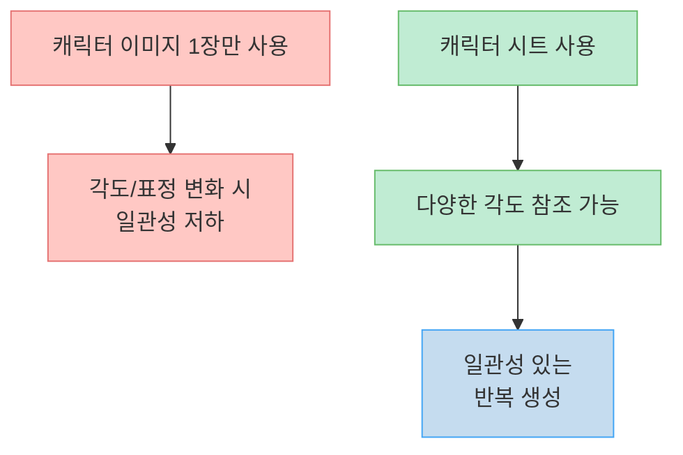
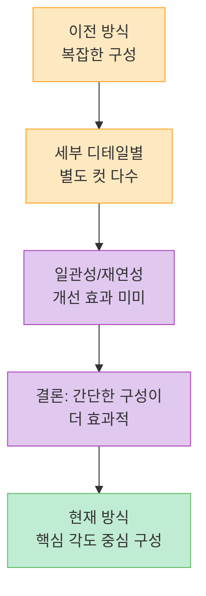
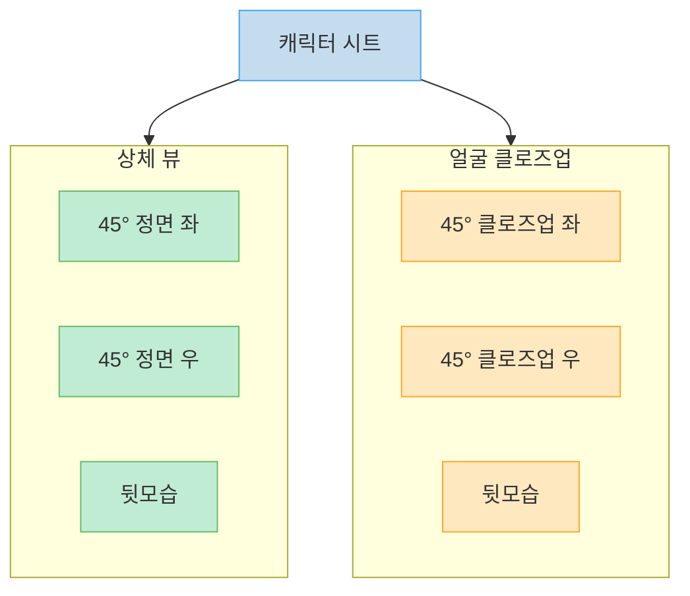
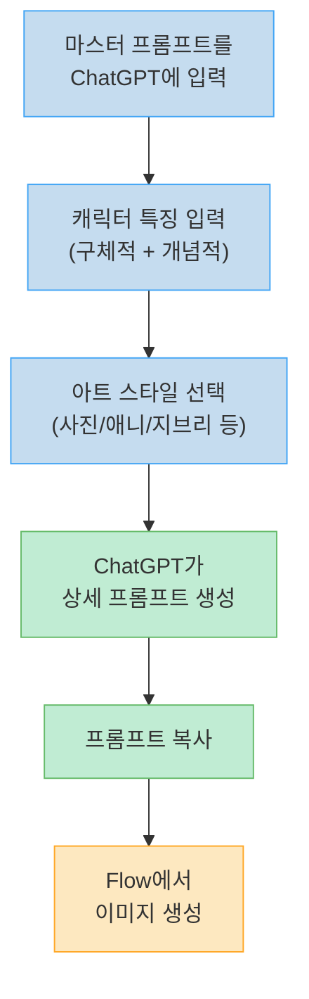
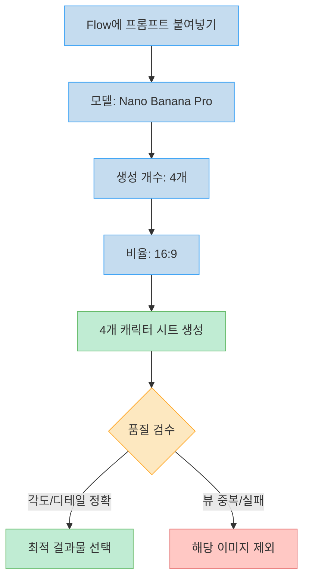
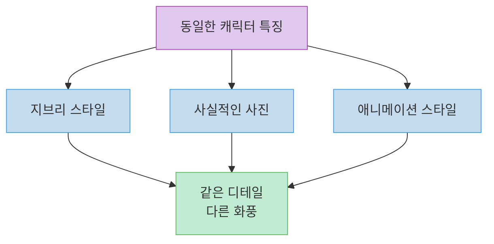

AI로 이미지나 영상을 생성할 때 가장 큰 난관 중 하나는 **캐릭터 일관성** 입니다. 같은 캐릭터를 여러 장면에서 반복 생성하면 얼굴, 체형, 의상 등이 매번 미묘하게 달라지는 문제가 생기죠. 이 문제를 해결하는 핵심 도구가 바로 **캐릭터 시트** 입니다. 이 글에서는 마스터 프롬프트를 활용해 정밀한 캐릭터 시트를 만드는 전체 워크플로우를 정리합니다.

<!--more-->

## Sources

- [캐릭터 시트 제작 방법. 마스터 프롬프트 제공. — AI Freemium](https://www.youtube.com/watch?v=Ib_1WtCXOxs)

## 캐릭터 시트가 필요한 이유

AI 이미지 생성 모델에 캐릭터 이미지 **한 장** 만 참조시키면, 각도나 표정이 바뀔 때 일관성이 급격히 떨어집니다([0:00](https://youtu.be/Ib_1WtCXOxs?t=0)). 특히 영상 생성에서는 프레임마다 캐릭터가 달라 보이는 현상이 더 심해집니다. 캐릭터 시트는 하나의 캐릭터를 **다양한 각도와 클로즈업** 으로 보여주는 참조 이미지 세트로, 생성 모델이 캐릭터의 3차원적 특징을 파악해 일관성을 유지하도록 돕습니다([1:00](https://youtu.be/Ib_1WtCXOxs?t=60)).



## 캐릭터 시트 구성의 진화

채널 운영자는 이전에 세부 디테일을 별도 컷으로 보여주는 복잡한 캐릭터 시트를 사용했지만, **복잡한 구성이 일관성이나 재연성을 높여주지 않는다** 는 결론에 도달했습니다([0:30](https://youtu.be/Ib_1WtCXOxs?t=30)). 최근에는 비교적 간단하지만 핵심 정보를 담은 구성으로 전환했습니다.



## 최적의 캐릭터 시트 구성

현재 사용하는 캐릭터 시트는 6개 뷰로 구성됩니다([0:45](https://youtu.be/Ib_1WtCXOxs?t=45)):

| 구분 | 뷰 | 설명 |
|------|-----|------|
| 상체 | 45도 정면 좌 | 좌측 45도 각도에서 본 상반신 |
| 상체 | 45도 정면 우 | 우측 45도 각도에서 본 상반신 |
| 상체 | 뒷모습 | 뒤에서 본 상반신 |
| 얼굴 | 45도 클로즈업 좌 | 좌측 45도 각도 얼굴 확대 |
| 얼굴 | 45도 클로즈업 우 | 우측 45도 각도 얼굴 확대 |
| 얼굴 | 뒷모습 | 뒤에서 본 머리/헤어스타일 |

이 구성의 핵심은 **45도 각도** 입니다. 정면과 측면의 중간 각도가 캐릭터의 입체감을 가장 효과적으로 전달하며, 뒷모습을 포함해 헤어스타일이나 의상 뒷면 디테일도 참조할 수 있게 합니다.



## 마스터 프롬프트 사용법

마스터 프롬프트는 **ChatGPT** 에서 가장 잘 동작하도록 설계되었지만, Gemini나 Claude에서도 사용 가능합니다([1:20](https://youtu.be/Ib_1WtCXOxs?t=80)). 사용 절차는 다음과 같습니다.

### 1단계: 마스터 프롬프트 입력

다운받은 마스터 프롬프트 전체를 ChatGPT에 붙여넣고 실행합니다([1:30](https://youtu.be/Ib_1WtCXOxs?t=90)). 프롬프트가 상당히 길지만 전체를 복사해야 합니다.

### 2단계: 캐릭터 특징 입력

ChatGPT가 캐릭터의 특징을 나열해 달라고 질문합니다. 여기서 원하는 특징을 **최대한 구체적으로** 작성합니다([1:30](https://youtu.be/Ib_1WtCXOxs?t=90)).

**구체적 특징 예시:**
- 긴 웨이브 머리
- 한국인 여성
- 큰 키
- 아이돌 화장

마스터 프롬프트의 강점은 **모호하고 개념적인 설명도 반영** 한다는 점입니다([2:00](https://youtu.be/Ib_1WtCXOxs?t=120)). 예를 들어 "현대적이고 캐주얼한 힙합 패션"처럼 분위기나 스타일을 자연어로 입력할 수 있습니다.

### 3단계: 아트 스타일 선택

다음으로 아트 스타일을 입력합니다([2:30](https://youtu.be/Ib_1WtCXOxs?t=150)). 이 단계에서 캐릭터 시트의 시각적 방향이 결정됩니다.

**아트 스타일 예시:**
- 극사실적인 사진 (Realistic Photo)
- 일본 애니메이션 스타일
- 지브리 스타일
- 기타 원하는 화풍

### 4단계: 생성된 프롬프트 복사

ChatGPT가 캐릭터 시트 생성용 프롬프트를 작성합니다. 모든 사항을 아주 세밀하게 서술하기 때문에 프롬프트 길이가 상당합니다. 작성이 완료되면 우측 상단의 복사 버튼으로 복사합니다.



## 이미지 생성: Flow + Nano Banana Pro

생성된 프롬프트를 **Flow** 에 붙여넣고 다음 설정으로 이미지를 생성합니다([3:00](https://youtu.be/Ib_1WtCXOxs?t=180)):

| 설정 항목 | 값 | 이유 |
|-----------|-----|------|
| 모델 | Nano Banana Pro | 캐릭터 시트 생성에 최적화 |
| 생성 개수 | 4개 | 디테일 차이를 비교해 최선을 선택 |
| 비율 | 16:9 | 캐릭터 시트 레이아웃에 적합 |

4개를 생성하는 이유가 중요합니다. 이미지 생성 모델은 항상 성공하지 않으며, 아주 디테일한 부분에서 조금씩 차이가 납니다([3:30](https://youtu.be/Ib_1WtCXOxs?t=210)). 예를 들어 원래 다른 방향의 45도 뷰가 나와야 하는데 같은 방향이 중복 생성되는 실패가 발생할 수 있습니다. 4개를 만들어 그중에서 가장 마음에 드는 것을 골라 사용하면 됩니다.



## 아트 스타일 변환

같은 캐릭터 특징을 유지한 채 아트 스타일만 변경하면 완전히 다른 분위기의 캐릭터 시트를 만들 수 있습니다([4:30](https://youtu.be/Ib_1WtCXOxs?t=270)). 예를 들어 지브리 스타일로 생성한 캐릭터를 사실적인 사진 스타일로 다시 생성하면, 디테일은 거의 비슷하게 유지되면서 시각적 표현만 달라집니다.

이를 통해 하나의 캐릭터를 다양한 프로젝트에 맞게 **스타일을 유연하게 전환** 할 수 있습니다.



## 마스터 프롬프트
```markdown
다음 절차를 반드시 순서대로 따르시오:

--------------------------------------------------

STEP 1  
사용자에게 다음과 같이 질문하시오:  
"캐릭터의 특징을 나열하여 주세요."  
사용자의 답변이 오기 전에는 절대 다음 단계로 진행하지 마시오.

--------------------------------------------------

STEP 2  
사용자에게 다음과 같이 질문하시오:  
"이미지의 Art Style을 입력해주세요."  
사용자의 답변이 오기 전에는 절대 다음 단계로 진행하지 마시오.

--------------------------------------------------

STEP 4  
사용자의 입력을 기반으로 “고정 요소”와 “변형 가능 요소”를 분리하시오.

[고정 요소]
- 사용자가 명시적으로 입력한 모든 특징
- 성별, 나이, 인종, 핵심 외형 등

[변형 가능 요소]
- 사용자가 입력하지 않은 모든 세부 요소
- 색상, 재질, 디테일 구조, 악세사리, 세부 치수 등

--------------------------------------------------

[입력 해석 및 우선순위 규칙]

사용자의 입력은 아래 두 가지 유형으로 분류하시오:

1) 명확한 묘사 (Explicit Traits)
- 외형, 수치, 색상, 구조 등 직접적으로 정의된 정보
- 예: "검은 머리", "단발", "키 170cm", "마른 체형"

2) 암시적 표현 (Implicit Traits)
- 분위기, 성격, 인상, 감정 등 간접적인 정보
- 예: "차가운 느낌", "도도한 성격", "몽환적인 분위기"

--------------------------------------------------

[반영 규칙]

1. 명확한 묘사는 해당 항목에 그대로 반영할 것 (수정 금지)

2. 암시적 표현은 직접적으로 항목에 쓰지 말고,
   그 의미를 해석하여 비어 있는 세부 항목들에 구체적인 형태로 변환하여 반영할 것

--------------------------------------------------

[충돌 해결 규칙]

- 명확한 묘사 > 암시적 표현

- 두 요소가 충돌할 경우:
  → 명확한 묘사를 절대 우선으로 유지할 것
  → 암시적 표현은 해당 범위 내에서만 제한적으로 반영할 것

--------------------------------------------------

[출력 금지 규칙]

- 분위기, 성격 등의 추상적 표현을 그대로 출력하지 말 것
- 반드시 물리적/시각적 요소로 변환하여 작성할 것

--------------------------------------------------

STEP 5  
고정 요소와 변형 가능 요소를 기반으로, 하나의 캐릭터 시트를 생성하시오.

규칙:

[공통 규칙]
- 고정 요소는 반드시 유지할 것
- 전체 레이아웃 구조는 템플릿을 그대로 따를 것

[생성 규칙]
- 변형 가능 요소를 활용하여 누락된 모든 디테일을 보완할 것
- 모든 요소는 구체적이고 명확하게 정의할 것
- 모호하거나 추상적인 표현은 사용하지 말 것

--------------------------------------------------

STEP 6  
각 시트에 대해, 누락된 모든 정보를 보완하여 완전한 스펙을 생성하시오.

모든 요소는 반드시 아래 기준으로 정의할 것:

- Position (위치)
- Size (치수)
- Shape (형태)
- Material (재질)
- State (상태)

모호한 표현 금지.

--------------------------------------------------

[포즈 제약 규칙]

- 캐릭터는 반드시 반듯하게 선 정자세를 유지할 것
- 과장된 동작이나 역동적인 포즈는 금지
- 팔과 다리는 신체 구조에 맞게 자연스럽게 정렬될 것
- 소지품이 있을 경우, 물리적으로 자연스럽고 어색하지 않은 방식으로 들고 있을 것

--------------------------------------------------

STEP 7  
각 시트는 아래 템플릿을 절대 수정하지 말고 그대로 사용하여 생성하시오.

- 구조 변경 금지
- 항목 삭제 금지
- 순서 변경 금지
- 모든 항목은 최대한 상세하게 작성

--------------------------------------------------

STEP 8 (출력 규칙)

- 각 시트는 반드시 하나의 코드블록으로 출력할 것
- 코드블록 외에는 어떤 텍스트도 출력하지 말 것

--------------------------------------------------

<CHARACTER SHEET TEMPLATE>

**[OVERALL COMPOSITION - FIXED LAYOUT]**
A professional character design sheet featuring a single [Gender] character, [Art Style], high-quality, 4k resolution, neutral grey studio background (#808080).

The canvas is divided into FOUR vertical sections (1x4 layout), arranged from left to right:

--------------------------------------------------

[SECTION 1 - RIGHT 45° FULL BODY]
- Full body view from a 45-degree angle facing right
- Character stands upright in a neutral, straight posture
- Arms relaxed naturally at the sides unless holding a prop
- If holding a prop, the pose must naturally incorporate the item

--------------------------------------------------

[SECTION 2 - LEFT 45° FULL BODY]
- Full body view from a 45-degree angle facing left
- Same posture and proportional consistency as Section 1
- No pose variation except mirrored orientation

--------------------------------------------------

[SECTION 3 - BACK FULL BODY]
- Full body view from directly behind
- Upright neutral standing posture
- Clear visibility of back structure (hair, outfit, silhouette)

--------------------------------------------------

[SECTION 4 - FACE DETAIL STACK (VERTICAL 3-SPLIT)]

Top:
- Face view from a 45-degree angle facing right

Middle:
- Face view from a 45-degree angle facing left

Bottom:
- Face view from directly behind

Rules:
- Equal vertical spacing
- Zoomed-in framing focused on head only
- Consistent scale and alignment

--------------------------------------------------

[GLOBAL LAYOUT RULES]

- All sections must maintain consistent character proportions
- No perspective distortion between sections
- Strict alignment and equal spacing across all divisions
- No rearrangement of section order
- Clean separation between sections

--------------------------------------------------

**[CHARACTER SPECIFICATION - FULL DEFINITION]**

[Identity]
- Gender:
- Age:
- Ethnicity:

[Body]
- Height:
- Proportion:
- Build:
- Shoulder width:
- Waist:
- Hip:
- Posture:

[Pose]
- A-pose
- Arms:
- Elbows:
- Hands:
- Legs:
- Weight distribution:

--------------------------------------------------

[Face]
- Shape:
- Jaw:
- Chin:
- Eyes:
- Eye color:
- Eye size:
- Brows:
- Nose:
- Lips:
- Skin:
- Expression:

[Makeup]
- Base:
- Blush:
- Eyeshadow:
- Eyeliner:
- Mascara:
- Lips:

--------------------------------------------------

[Hair]
- Length:
- Part:
- Structure:
- Strand thickness:
- Layering:
- Volume:
- Flow:
- Color:
- Surface:
- State:

--------------------------------------------------

[Outfit]

Top:
- Type:
- Length:
- Fit:
- Neckline:
- Sleeve:
- Fabric:
- Wrinkles:

Skirt:
- Type:
- Waist position:
- Length:
- Shape:
- Structure:
- Pleats:
- Fabric:
- Movement:

--------------------------------------------------

[Footwear]
- Type:
- Heel height:
- Sole thickness:
- Shape:
- Coverage:
- Material:
- Color:
- Fit:
- State:

--------------------------------------------------

[Accessories / Wear Position]

Earrings:
- Type:
- Length:
- Material:
- Position:
- Movement:

Necklace:
- Type:
- Lengths:
- Position:
- Material:

Rings:
- Count:
- Placement:
- Material:

Bracelet:
- Wrist:
- Fit:
- Material:

--------------------------------------------------

[Props]
- 

--------------------------------------------------

**[TECHNICAL SPECIFICATIONS]**

[Lighting]
- Key:
- Fill:
- Rim:
- Shadow:

[Rendering Style]
- 

[Color Control]
- 

[Consistency Rules]
- 

[Final Constraint]
- 
```


## 핵심 요약

- **캐릭터 시트** 는 AI 이미지/영상 생성에서 캐릭터 일관성을 확보하는 필수 도구
- 복잡한 구성보다 **45도 각도 중심의 간결한 6뷰 구성** 이 더 효과적
- **마스터 프롬프트** 를 ChatGPT에 입력하면 캐릭터 특징과 아트 스타일을 기반으로 상세한 생성 프롬프트를 자동 작성
- 구체적 특징뿐 아니라 **모호한 개념적 설명** (분위기, 스타일)도 반영 가능
- Flow에서 **Nano Banana Pro 모델** , **4개 생성** , **16:9 비율** 로 설정
- 4개를 생성해 **최적 결과물을 선별** 하는 것이 핵심 노하우
- 같은 캐릭터 특징으로 **아트 스타일만 변경** 하여 다양한 표현 가능

## 결론

캐릭터 시트는 AI 생성 콘텐츠의 품질을 좌우하는 기본기입니다. 마스터 프롬프트를 활용하면 복잡한 프롬프트 엔지니어링 없이도 정밀한 캐릭터 시트를 만들 수 있고, 아트 스타일을 자유롭게 전환하며 다양한 프로젝트에 활용할 수 있습니다. 프롬프트를 직접 수정해서 자신만의 캐릭터 시트 형식을 만들어 보는 것도 좋은 방법입니다.
