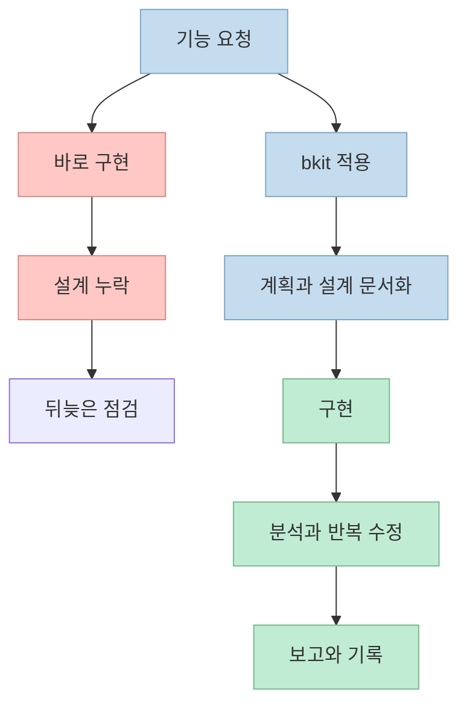
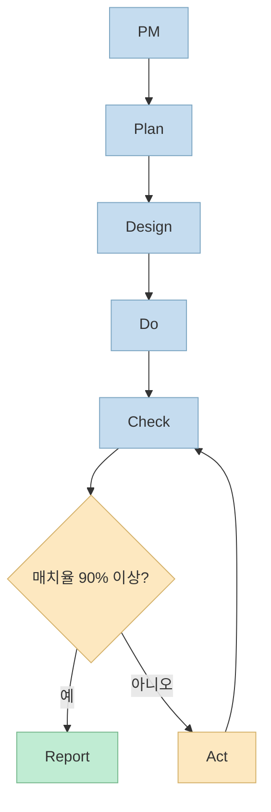
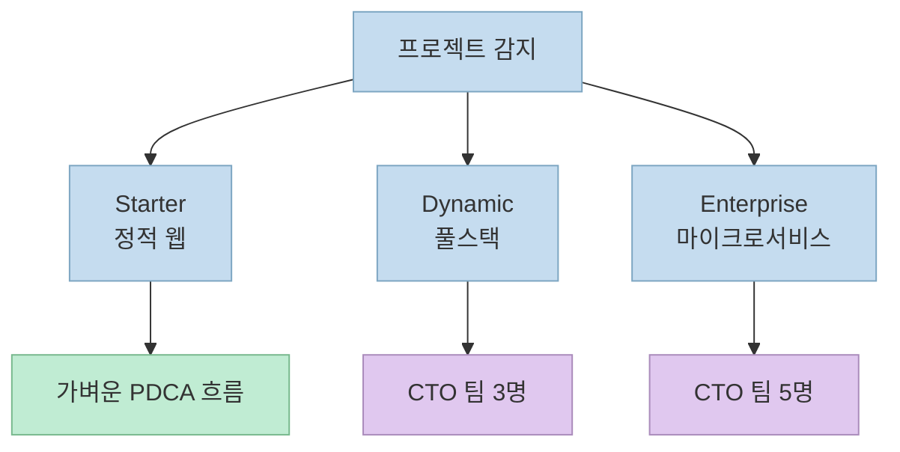
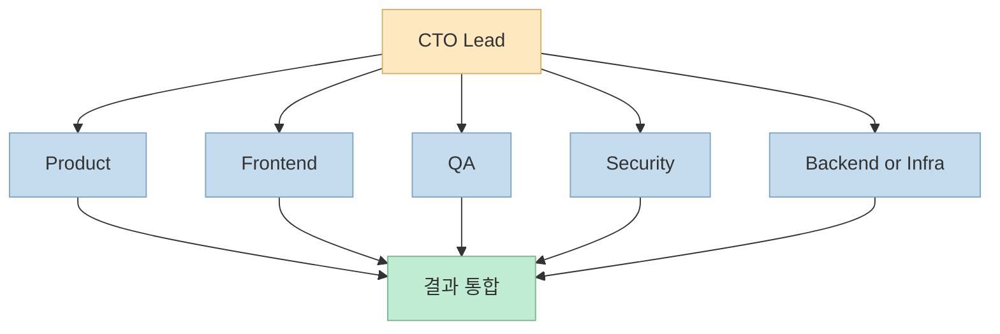
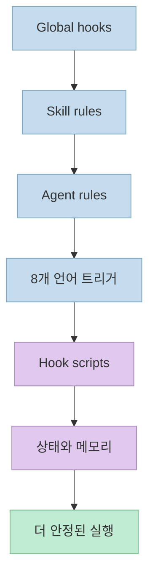
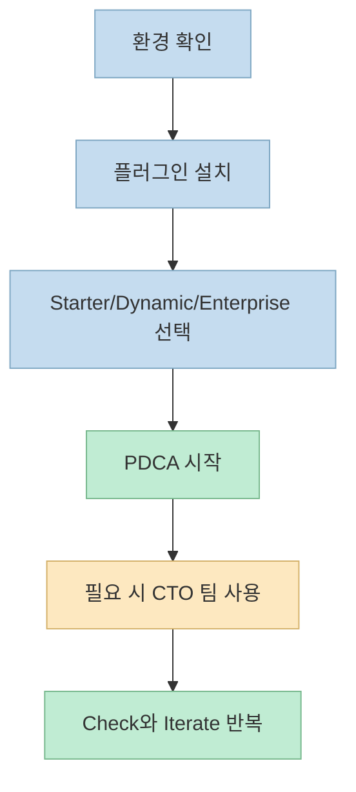

Claude Code를 쓰다 보면 금방 느끼는 문제가 있습니다. 코드는 빨리 나오는데, 계획과 설계와 검증이 한 흐름으로 묶이지 않으면 결과가 들쭉날쭉해진다는 점입니다. 
**bkit** 은 바로 그 지점을 겨냥한 플러그인입니다. 저장소의 현재 설명대로 보면, 이 도구는 Claude Code 위에 **PDCA 방법론**, **CTO-Led Agent Teams**, **자동 문서화**, **Context Engineering** 을 얹어 AI 코딩을 조금 더 "운영 가능한 개발 프로세스"에 가깝게 바꾸려는 시도입니다.

현재 공개 저장소 기준으로 **bkit** 은 `v2.0.6`, `Apache-2.0` 라이선스, `37 Skills`, `32 Agents`, `18 Hook Events`, `57 scripts`, `88 lib modules`, `~620+ functions`를 내세우고 있습니다. 숫자만 많아 보이는 도구처럼 보일 수도 있지만, 핵심은 숫자보다 구조입니다. 이 글에서는 그 구조가 실제로 무엇을 바꾸는지 중심으로 보겠습니다.

<!--more-->

## Sources

- [popup-studio-ai/bkit-claude-code](https://github.com/popup-studio-ai/bkit-claude-code)
- [bkit-system/philosophy/pdca-methodology.md](https://github.com/popup-studio-ai/bkit-claude-code/blob/main/bkit-system/philosophy/pdca-methodology.md)
- [bkit-system/philosophy/context-engineering.md](https://github.com/popup-studio-ai/bkit-claude-code/blob/main/bkit-system/philosophy/context-engineering.md)
- [bkit-system/philosophy/core-mission.md](https://github.com/popup-studio-ai/bkit-claude-code/blob/main/bkit-system/philosophy/core-mission.md)

## 1. bkit은 프롬프트 팩이 아니라 개발 공정 레이어다

README의 한 줄 설명은 꽤 직설적입니다. **bkit** 은 "`PDCA methodology + CTO-Led Agent Teams + AI coding assistant mastery for AI-native development`"를 내세우고, 스스로를 "Claude Code plugin"이라고 소개합니다. 여기서 중요한 부분은 단순히 스킬 몇 개를 추가하는 도구가 아니라, **AI가 코드를 만드는 과정을 단계화하고 추적 가능한 상태로 바꾸려는 플러그인** 이라는 점입니다.

보통 Claude Code를 바로 쓰면 사용자는 기능을 말하고, 모델은 코드를 만들고, 사람이 뒤늦게 구조와 누락을 확인합니다. 반면 **bkit** 은 계획 문서, 설계 문서, 구현, 분석, 반복 수정, 보고까지를 같은 흐름으로 연결합니다. 즉 "좋은 프롬프트를 쓴다"보다 "좋은 개발 절차를 시스템에 강제한다"에 더 가깝습니다.

이 관점은 `core-mission.md`에서도 반복됩니다. 그 문서는 bkit의 목표를 "명령어나 PDCA를 몰라도 document-driven development와 continuous improvement를 자연스럽게 채택하게 하는 것"이라고 설명합니다. 다시 말해 사용자가 공정 전체를 외우지 않아도, 도구가 좋은 개발 습관을 기본값으로 밀어 넣는 구조입니다.

그래서 **bkit** 을 이해하는 가장 좋은 방법은 "Claude Code용 기능 모음"이 아니라 **Claude Code에 공정 관리 계층을 올리는 플러그인** 으로 보는 것입니다. 저장소의 파일 구조가 `agents/`, `skills/`, `hooks/`, `scripts/`, `templates/`, `lib/`, `servers/`로 나뉘어 있는 것도 이 관점을 뒷받침합니다.

## 2. PDCA는 체크리스트가 아니라 상태 머신으로 구현된다

이 프로젝트의 가장 큰 차별점은 **PDCA** 를 단순한 슬로건이 아니라 **상태 머신** 으로 구현했다는 점입니다. `pdca-methodology.md`에 따르면 현재 흐름은 `PM -> Plan -> Design -> Do -> Check -> Act -> Report` 순서이며, 문서에는 `20 transitions`, `9 guards`, `7-stage quality gates`가 명시되어 있습니다.

이 설계가 중요한 이유는 AI 코딩에서 가장 흔한 실패가 "계획 없이 구현으로 점프"하거나, 반대로 "구현했지만 설계와 얼마나 맞는지 모른 채 종료"하는 패턴이기 때문입니다. **bkit** 은 `/pdca plan`, `/pdca design`, `/pdca do`, `/pdca analyze`, `/pdca iterate`, `/pdca report` 같은 명령으로 각 단계를 분리하고, `Check` 단계에서 설계와 구현의 일치도를 따지게 만듭니다.

특히 눈에 띄는 부분은 `Check -> Act` 반복입니다. 문서상으로는 설계-구현 일치율이 `90%` 이상이면 보고 단계로 넘어가고, 그렇지 않으면 `Act`로 넘어가 수정 루프를 최대 `5회`까지 반복합니다. 이 구조는 "한 번에 정답을 만들 것"을 기대하기보다, **AI의 초안 생성 능력과 반복 수정 능력을 공정으로 묶어 관리** 하겠다는 방향에 가깝습니다.

여기서 **bkit** 의 철학도 드러납니다. `core-mission.md`는 세 가지 원칙으로 `Automation First`, `No Guessing`, `Docs = Code`를 제시합니다. 
이 세 문장을 풀면 다음과 같습니다.

- **Automation First**: 사용자가 모든 절차를 기억하지 않아도 시스템이 PDCA 흐름을 앞으로 민다.
- **No Guessing**: 확신이 없으면 문서를 보고, 그래도 불명확하면 사용자에게 묻는다.
- **Docs = Code**: 설계 문서와 구현 결과를 따로 놀게 두지 않는다.

즉 **PDCA** 는 bkit에서 생산성 구호가 아니라, AI가 만든 결과물을 사람이 검토 가능한 산출물과 품질 게이트에 연결하는 장치입니다.

## 3. 프로젝트 레벨 감지와 CTO 팀 운영이 작업 방식을 바꾼다

README는 이 플러그인이 프로젝트를 세 단계로 나눈다고 설명합니다. `Starter`는 정적 사이트, `Dynamic`은 풀스택 애플리케이션, `Enterprise`는 마이크로서비스 아키텍처입니다. 이 분류의 의미는 단순한 난이도 배지가 아니라, **어떤 워크플로우와 어떤 팀 구성이 필요한지 미리 결정하는 기준** 이라는 데 있습니다.

예를 들어 간단한 정적 사이트라면 문서와 팀 구성이 과하게 무거울 수 있습니다. 반대로 여러 서비스와 인프라가 엮인 프로젝트는 프런트엔드, 백엔드, QA, 보안 같은 역할을 한 세션이 모두 떠안기 어렵습니다. **bkit** 은 이런 차이를 전제로 프로젝트 수준에 따라 다른 진입 명령과 다른 팀 구성을 제안합니다.

README의 빠른 시작 예시는 `/starter`, `/dynamic`, `/enterprise` 명령을 보여주고, CTO-Led Agent Teams 섹션에서는 `Dynamic`에서 `3`명의 팀원, `Enterprise`에서 `5`명의 팀원을 병렬로 붙일 수 있다고 설명합니다. 그리고 이 팀은 `cto-lead`가 조율하며, 역할별로 프런트엔드, 제품, QA, 보안 등으로 나뉩니다.

이 구조의 장점은 분명합니다. "Claude 하나가 다 한다"보다, **프로젝트 규모에 따라 필요한 역할을 분리해서 병렬화** 하려는 시도이기 때문입니다. 다만 이것이 언제나 더 낫다는 뜻은 아닙니다. 작은 프로젝트에 너무 무거운 팀 구성을 얹으면 오히려 속도가 느려질 수 있습니다. 그래서 **bkit** 의 프로젝트 레벨 감지가 실제로 맞아떨어지는지가 도구의 핵심 품질 중 하나가 됩니다.

## 4. Context Engineering은 프롬프트보다 시스템 설계에 가깝다

README와 `context-engineering.md`가 반복해서 강조하는 문장은 같습니다. **bkit** 은 `Context Engineering`의 실용적 구현이라는 주장입니다. 여기서 말하는 컨텍스트 엔지니어링은 "프롬프트 문장을 잘 쓰는 기술"이 아니라, **프롬프트와 도구와 상태를 함께 설계해서 모델이 필요한 맥락을 제때 받게 만드는 시스템 설계** 입니다.

문서 기준으로 현재 구조는 `37 skills`, `32 agents`, `18 hook events`, `2 MCP servers`, `88 lib modules`, `~620+ functions`입니다. 이 숫자는 단순한 자랑 포인트라기보다, 컨텍스트를 여러 레이어에서 주입하고 통제하려는 의도를 보여줍니다. 예를 들어 훅 시스템은 세션 시작, 프롬프트 제출, 도구 사용 전후, 실패 시점 같은 이벤트에 맞춰 다른 문맥을 넣을 수 있게 설계되어 있습니다.

또 README와 관련 문서는 6개 레이어의 훅 시스템을 설명합니다. 핵심은 `hooks.json`, 스킬/에이전트 규칙, 다국어 트리거, 스크립트, 팀 오케스트레이션처럼 서로 다른 층에서 규칙이 주입된다는 점입니다. 즉 AI가 잘 동작하길 바라는 대신, **언제 어떤 규칙을 넣고 어떤 상태를 기억시키며 어떤 도구를 금지할지까지 계층화** 하는 방식입니다.

이 설계는 Claude Code를 더 똑똑하게 만든다기보다, **Claude Code가 실수할 수 있는 지점을 주변 시스템으로 감싼다** 는 발상에 가깝습니다. 그래서 `No Guessing` 같은 철학이 단지 좋은 문장이 아니라, 훅, 품질 게이트, 상태 머신, 분석 루프 같은 구조로 내려옵니다.

또 한 가지 흥미로운 부분은 `2 MCP servers`입니다. 문서 기준으로 PDCA 상태 조회와 분석 관련 도구가 별도 서버 계층으로 분리되어 있습니다. 이는 플러그인이 Claude 내부 설정을 넘어서 **외부 도구 계층과도 연결될 수 있는 운영 플랫폼** 으로 가고 있음을 보여줍니다.

## 5. 실전 적용 포인트

실제로 써 보려는 사람이라면 세 가지만 먼저 보는 편이 좋습니다. 
첫째, 이 도구는 최신 Claude Code 기능과 연결되는 부분이 많아서 README 기준 요구사항인 `Claude Code v2.1.78+`와 `Node.js v18+`를 먼저 맞추는 것이 안전합니다. 
둘째, 설치 자체는 단순합니다. README 예시는 `/plugin marketplace add popup-studio-ai/bkit-claude-code` 다음 `/plugin install bkit` 순서입니다. 
셋째, 처음부터 모든 기능을 다 쓰기보다 자신의 프로젝트 크기에 맞는 진입점 하나만 잡는 편이 낫습니다.

현실적인 접근은 이렇습니다.

1. 정적 웹이나 개인 프로젝트면 `Starter` 흐름으로 충분한지 먼저 봅니다.
2. 풀스택 앱이라면 `/pdca plan`과 `/pdca design`이 실제로 문서 품질을 올려주는지 확인합니다.
3. 병렬 작업이 자주 필요한 팀이라면 CTO-Led Agent Teams의 이점이 있는지 비교합니다.
4. 이미 자신만의 `.claude/` 구조가 있다면, bkit의 철학 전체를 받아들이기보다 필요한 컴포넌트만 커스터마이징하는 편이 안전합니다.

즉 **bkit** 의 가치는 "설치하면 갑자기 코드를 잘 짜 준다"가 아니라, **AI 코딩 세션을 계획-설계-검증-반복의 운영 흐름으로 묶어 줄 필요가 있을 때 빛난다** 는 데 있습니다.

## 핵심 요약

- **bkit** 은 Claude Code 위에 PDCA 공정, 자동 문서화, 팀 오케스트레이션을 올리는 플러그인이다.
- 이 도구의 중심은 프롬프트 최적화보다 상태 머신, 품질 게이트, 반복 수정 루프에 있다.
- `Starter`, `Dynamic`, `Enterprise` 구분은 프로젝트 규모에 따라 다른 공정과 팀 구성을 적용하려는 장치다.
- `37 skills`, `32 agents`, `18 hook events`, `2 MCP servers`라는 구조는 컨텍스트 엔지니어링을 시스템 차원에서 구현하려는 방향을 보여준다.
- 현재 저장소 기준으로 bkit은 AI 코딩의 속도보다 **재현 가능한 개발 절차** 를 더 중요하게 보는 도구에 가깝다.

## 결론

Claude Code를 쓰면서 가장 불안한 순간은 "이 결과가 우연히 잘 나온 건지, 다시 해도 같은 품질이 나올지"를 알 수 없을 때입니다. **bkit** 은 바로 그 불안을 줄이기 위해 PDCA, 문서, 팀 역할, 훅, 분석 루프를 한 세트로 엮습니다. 
그래서 이 플러그인은 빠른 데모 한 번보다, 반복 가능한 개발 방식이 필요한 사람에게 더 잘 맞습니다. 현재 저장소와 문서만 봐도 방향성은 꽤 분명합니다. AI에게 더 많은 자유를 주는 도구라기보다, **AI가 일하는 방식 자체를 공정으로 설계하려는 도구** 입니다.
