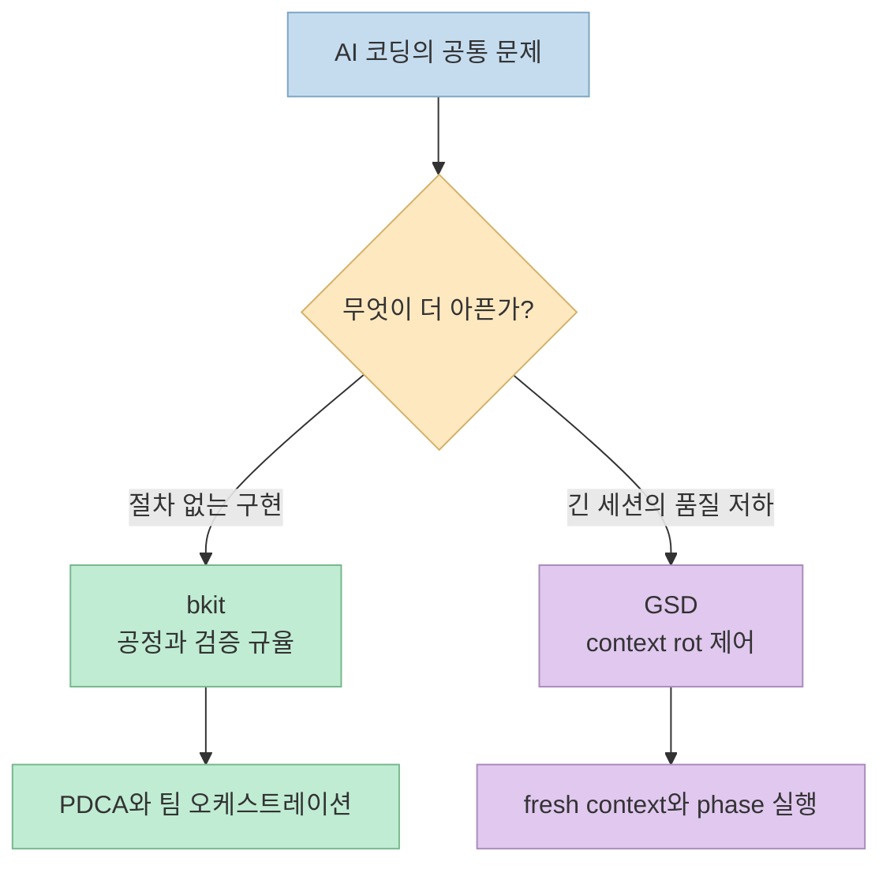
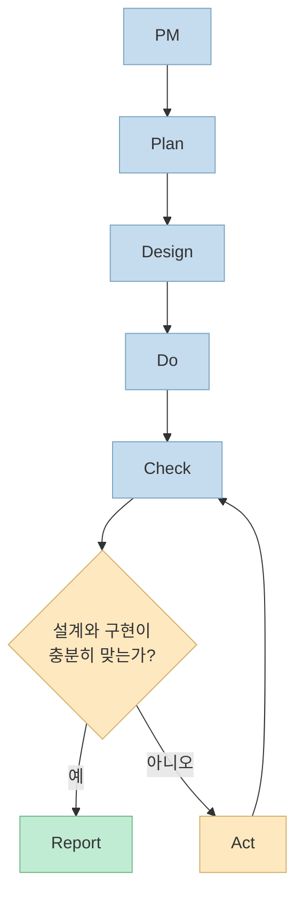
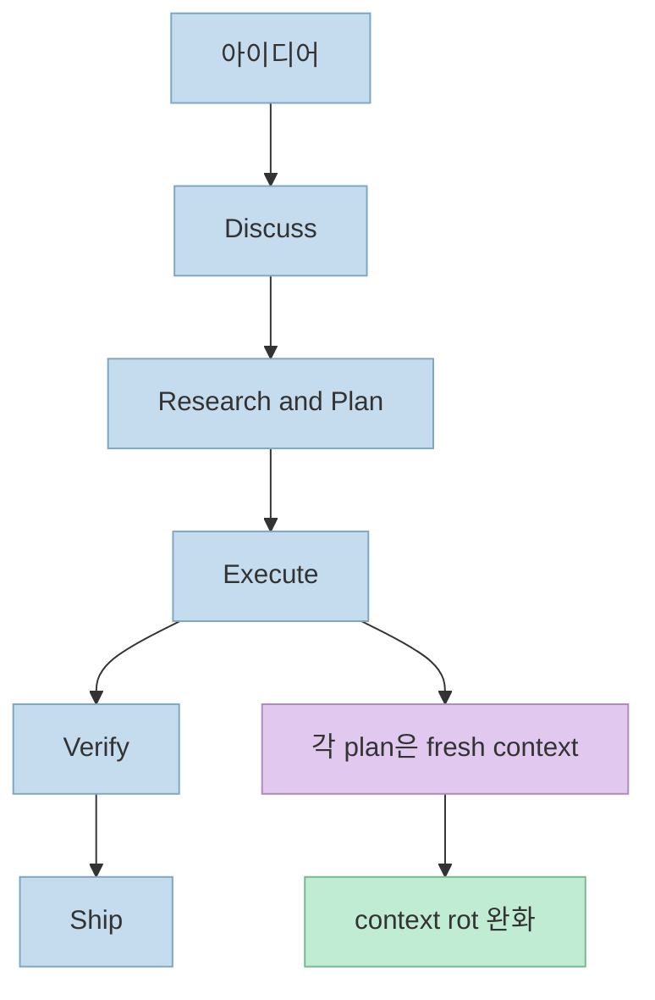
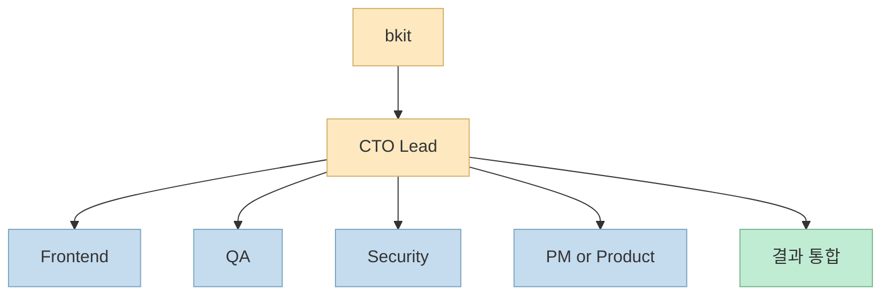
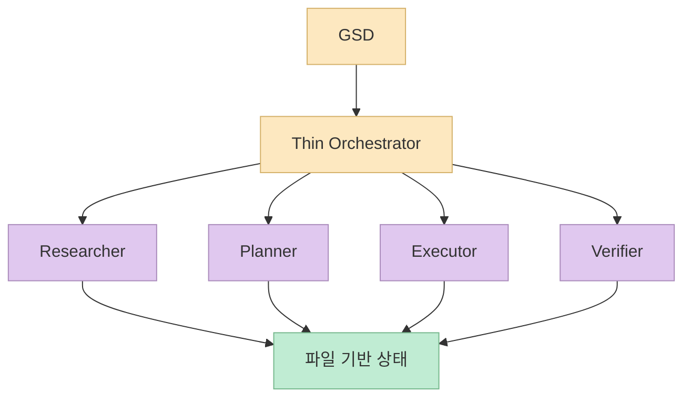
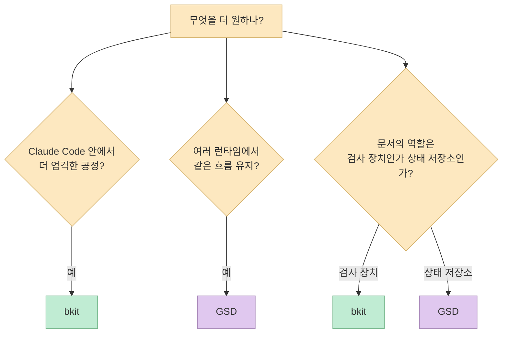

겉으로만 보면 **bkit** 과 **GSD(Get Shit Done)** 는 비슷해 보입니다. 둘 다 AI 코딩을 더 체계적으로 만들겠다고 말하고, 계획과 실행 사이를 문서와 에이전트로 연결하며, 컨텍스트 엔지니어링이라는 표현도 사용합니다. 
하지만 공식 문서를 조금만 깊게 읽어 보면, 두 도구가 실제로 통제하려는 대상은 꽤 다릅니다. **bkit** 은 Claude Code 안에서 **엔지니어링 절차와 검증 규율** 을 강하게 밀어 넣는 쪽이고, **GSD** 는 여러 런타임에서 **context rot를 줄이면서 실전 구현을 계속 굴리는 운영 흐름** 에 더 가깝습니다.

그래서 중요한 질문은 "어느 쪽이 더 강한가"가 아닙니다. 더 정확한 질문은 **AI 코딩에서 내가 지금 가장 줄이고 싶은 실패가 무엇인가** 입니다. 요구사항 없이 바로 구현으로 점프하는 문제가 더 큰지, 긴 세션에서 품질이 무너지는 문제가 더 큰지, 혹은 Claude Code 하나에 깊게 최적화할지 여러 런타임을 오갈지가 더 중요한지에 따라 답은 달라집니다.

<!--more-->

## Sources

- [popup-studio-ai/bkit-claude-code](https://github.com/popup-studio-ai/bkit-claude-code)
- [bkit-system/philosophy/pdca-methodology.md](https://github.com/popup-studio-ai/bkit-claude-code/blob/main/bkit-system/philosophy/pdca-methodology.md)
- [bkit-system/philosophy/context-engineering.md](https://github.com/popup-studio-ai/bkit-claude-code/blob/main/bkit-system/philosophy/context-engineering.md)
- [bkit-system/philosophy/core-mission.md](https://github.com/popup-studio-ai/bkit-claude-code/blob/main/bkit-system/philosophy/core-mission.md)
- [gsd-build/get-shit-done](https://github.com/gsd-build/get-shit-done)
- [GSD User Guide](https://github.com/gsd-build/get-shit-done/blob/main/docs/USER-GUIDE.md)

## 1. 먼저 큰 차이부터: 두 도구는 같은 문제를 푸는 것이 아니다

공식 README를 기준으로 보면 **bkit** 은 스스로를 `PDCA methodology + CTO-Led Agent Teams + AI coding assistant mastery for AI-native development`라고 설명합니다. 또 "AI-assisted development deserves the same rigor as traditional engineering"이라고 못 박습니다. 즉 핵심은 **AI 코딩을 더 엄격한 개발 공정 안으로 넣는 것** 입니다.

반대로 **GSD** 는 첫 문장에서 자신을 `A light-weight and powerful meta-prompting, context engineering and spec-driven development system`이라고 부르고, 가장 먼저 `Solves context rot`를 내세웁니다. 이어서 창립 배경에서 "I'm not a 50-person software company. I don't want to play enterprise theater."라고 말합니다. 여기서 드러나는 핵심은 **복잡한 의식을 줄이면서도 장기 세션 품질 저하를 막고, 실제 구현을 계속 밀어붙이는 것** 입니다.

둘 다 계획과 구조를 중시하지만, 방향은 다릅니다. 
**bkit** 은 "AI에게 공정 규율을 어떻게 강제할 것인가"에 더 가깝고, **GSD** 는 "긴 작업에서도 품질이 무너지지 않게 어떻게 실행 흐름을 운영할 것인가"에 더 가깝습니다.

이 차이를 한 줄로 줄이면 이렇게 말할 수 있습니다. 
**bkit** 은 Claude Code 내부를 더 엔지니어링적으로 만들려는 도구이고, **GSD** 는 AI 코딩의 실행 체계 자체를 더 오래 버티게 만들려는 도구입니다.

## 2. bkit은 PDCA 상태 머신으로 개발 절차를 고정한다

**bkit** 의 가장 중요한 특징은 PDCA를 단순 구호가 아니라 **상태 머신과 품질 게이트** 로 구현했다는 점입니다. 공식 문서에 따르면 흐름은 `PM -> Plan -> Design -> Do -> Check -> Act -> Report`이고, 현재 버전 문서에는 `20 transitions`, `9 guards`, `7-stage quality gates`, `90% match threshold`, `max 5 iterations` 같은 제약이 명시돼 있습니다.

이 구조는 분명히 느릴 수 있습니다. 하지만 bkit이 최적화하는 것은 속도 자체가 아니라, **설계 없는 구현**, **검증 없는 완료 선언**, **문서와 코드의 분리** 같은 실패를 줄이는 것입니다. `core-mission.md`가 `Automation First`, `No Guessing`, `Docs = Code`를 세 가지 철학으로 제시하는 이유도 여기에 있습니다.

또 현재 README 상단과 핵심 설명 구간 기준으로는 `37 Skills`, `32 Agents`, `18 Hook Events`, `88 lib modules`, `~620+ functions` 같은 숫자가 전면에 나옵니다. 이 숫자들의 의미는 단순한 규모 자랑보다, **Claude Code 안에 규칙과 상태와 역할을 계층적으로 주입하려는 설계** 로 읽는 편이 맞습니다.

즉 **bkit** 이 진짜로 하는 일은 "개발자 대신 다 해 준다"가 아닙니다. 그보다는 **Claude Code가 함부로 빠르게 가는 대신, 계획과 설계와 검증을 거치도록 강제로 느리게 만드는 장치** 에 가깝습니다. 그래서 이미 Claude Code에 익숙하고, 공정 규율을 더 강하게 붙이고 싶은 사람에게 설득력이 큽니다.

## 3. GSD는 context rot를 막기 위해 실행 단위를 더 잘게 나눈다

**GSD** 의 핵심 문제 정의는 매우 선명합니다. README는 `context rot — the quality degradation that happens as Claude fills its context window`를 정면으로 내세웁니다. 즉 GSD는 AI가 똑똑하지 않아서가 아니라, **세션이 길어질수록 문맥이 오염되고 품질이 무너지는 구조적 문제** 를 먼저 해결하려 합니다.

이를 위해 GSD는 `new-project -> discuss-phase -> plan-phase -> execute-phase -> verify-work -> ship` 같은 phase 기반 흐름을 사용합니다. 또 각 작업을 더 작은 계획 단위로 쪼개고, README 표현을 빌리면 `fresh context per plan` 또는 `fresh sub-agent context`를 적극 활용합니다. 같은 문서에서 thin orchestrator가 specialist agents를 호출하고, wave 단위로 병렬 실행을 조율한다는 설명도 반복됩니다.

여기서 중요한 차이는 **GSD가 구조를 만들되, 그 구조를 너무 엔터프라이즈 의식처럼 느끼지 않게 유지하려 한다** 는 점입니다. README의 "The complexity is in the system, not in your workflow"나 "No enterprise roleplay" 같은 문구는 바로 이 감각을 드러냅니다.

또 GSD는 bkit보다 런타임 범위를 넓게 잡습니다. 현재 README는 Claude Code뿐 아니라 OpenCode, Gemini CLI, Codex, Copilot, Cursor, Antigravity 같은 여러 런타임을 함께 언급합니다. 이 말은 곧 **특정 Claude Code 기능에 깊게 들어가는 것보다, 여러 에이전트 런타임에 이식 가능한 워크플로우 계층** 을 더 중시한다는 뜻이기도 합니다.

그래서 GSD는 Claude Code 안에 더 깊게 최적화된 플러그인이라기보다, **여러 AI 코딩 런타임 위에 얹는 spec-driven execution layer** 에 더 가깝습니다.

## 4. 두 도구의 오케스트레이션 철학은 생각보다 다르다

두 도구 모두 에이전트를 씁니다. 하지만 에이전트를 쓰는 방식은 다릅니다. 
**bkit** 은 `CTO-Led Agent Teams`를 전면에 둡니다. README는 `Dynamic: 3`, `Enterprise: 5` 팀 구성을 설명하며, `cto-lead`가 팀 구성을 선택하고 작업을 조율한다고 적습니다. 즉 중심에는 **리드 에이전트가 있는 계층형 팀 운영** 이 있습니다.

반대로 **GSD** 는 thin orchestrator가 research, planning, execution, verification 같은 역할을 나누고, 각 단계에서 필요한 specialist를 새 컨텍스트로 호출하는 패턴을 강조합니다. 즉 중심에는 **한 명의 리더가 통솔하는 팀** 보다, **단계별로 필요한 전문 하위 에이전트를 교체하며 쓰는 흐름** 이 있습니다.

이 차이는 실제 사용감에도 영향을 줍니다. 
**bkit** 은 역할 분리가 더 팀 운영처럼 느껴지고, 프로젝트 레벨(`Starter`, `Dynamic`, `Enterprise`)과 결합될 때 힘이 납니다. 
**GSD** 는 phase와 plan 단위를 더 세밀하게 쪼개고, 그때그때 필요한 하위 에이전트를 불러오는 식이라 **장기 세션 품질 유지와 실행 지속성** 에 더 유리합니다.

## 5. 문서와 상태를 다루는 방식도 다르다

둘 다 문서를 중시하지만, 문서의 성격이 다릅니다. 
**bkit** 의 문서는 PDCA 흐름을 따라 `Plan`, `Design`, `Analysis`, `Report` 같은 산출물로 이어집니다. 그리고 그 문서는 단순 기록이 아니라, 다음 단계의 품질 게이트와 반복 수정 루프에 연결됩니다. 그래서 문서가 **개발 공정의 검사 장치** 에 가깝습니다.

반면 **GSD** 는 `PROJECT.md`, `REQUIREMENTS.md`, `ROADMAP.md`, `STATE.md`, `PLAN.md`, `SUMMARY.md`처럼 파일 기반 컨텍스트를 분리합니다. 여기서 문서의 핵심 역할은 공정 검사보다 **에이전트가 새 컨텍스트에서 다시 합류할 수 있게 만드는 상태 저장소** 에 더 가깝습니다.

이 차이를 실무 언어로 옮기면 이렇습니다.

- **bkit**: 문서를 통해 절차를 강제하고 품질을 확인한다.
- **GSD**: 문서를 통해 세션 간 기억을 외부화하고 실행을 이어 간다.

둘 다 훌륭한 방향이지만, 조직이 어떤 문제를 더 자주 겪느냐에 따라 체감 가치는 달라집니다. 설계 누락과 검증 부재가 아프면 **bkit** 이, 긴 프로젝트에서 컨텍스트 유지와 phase 운영이 아프면 **GSD** 가 더 직접적으로 느껴집니다.

## 6. 실제 선택 기준은 세 가지면 충분하다

정리하면 선택 기준은 복잡하지 않습니다. 보통 아래 세 가지 질문이면 충분합니다.

좀 더 실전적으로 풀면 다음과 같습니다.

| 상황 | 더 먼저 볼 도구 | 이유 |
|---|---|---|
| Claude Code 안에서 계획, 설계, 분석, 보고를 강하게 묶고 싶다 | **bkit** | PDCA 상태 머신과 품질 게이트가 핵심이기 때문 |
| Claude Code 외에도 Codex, OpenCode, Gemini CLI까지 같이 다루고 싶다 | **GSD** | 멀티 런타임 설치와 실행 흐름이 전면에 있기 때문 |
| AI가 너무 빨리 구현으로 점프하는 것이 문제다 | **bkit** | 공정 규율과 인터랙티브 체크포인트가 강함 |
| 세션이 길어질수록 결과가 흔들리는 것이 문제다 | **GSD** | context rot 방지와 fresh context 전략이 핵심 |
| 문서화보다 실제 실행을 계속 굴리는 균형이 더 중요하다 | **GSD** | "complexity in the system, not in your workflow" 철학과 맞음 |

## 7. 실전 적용 포인트

이 둘을 실제로 도입할 때는 경쟁 제품처럼 하나만 택해야 하는 상황보다, **자기 환경의 기본 축** 을 먼저 정하는 편이 더 중요합니다. 
예를 들어 Claude Code를 메인 런타임으로 쓰고 있고, 팀이 설계-구현 정렬 문제를 자주 겪는다면 **bkit** 이 더 자연스럽습니다. 반대로 Claude Code 외의 런타임까지 계속 오가거나, 작업 세션이 길어질수록 품질이 무너지는 경험이 많다면 **GSD** 가 더 직접적인 해법이 됩니다.

또 하나 중요한 포인트는 두 도구가 모두 "계획"을 말하지만, 계획의 사용 방식이 다르다는 점입니다. 
**bkit** 에서 계획은 공정 규율의 일부이고, **GSD** 에서 계획은 fresh context 실행을 위한 분해 단위입니다. 같은 plan이라도 의미가 다르기 때문에, README의 명령 이름만 보고 비슷하다고 판단하면 오해하기 쉽습니다.

도입 순서도 다르게 가져가는 편이 좋습니다.

1. **bkit** 은 Claude Code와 팀 공정의 정렬 문제를 해결하려는 시도로 이해하고, `/pdca plan`, `/pdca design`, `/pdca analyze` 같은 흐름부터 체험하는 편이 좋습니다.
2. **GSD** 는 한 번에 큰 프로젝트를 맡기기보다 `new-project -> discuss-phase -> plan-phase -> execute-phase`의 감각과 `quick` 모드의 차이를 먼저 느껴 보는 편이 좋습니다.
3. 둘 다 문서가 늘어나기 때문에, 문서를 기록용으로만 둘지 실제 의사결정 입력으로 쓸지 팀 안에서 먼저 합의하는 것이 중요합니다.

결국 **bkit** 은 "Claude Code를 더 엔지니어링적으로 쓰고 싶다"는 욕구에, **GSD** 는 "AI 실행 흐름을 더 오래 안정적으로 굴리고 싶다"는 욕구에 더 잘 맞습니다.

## 핵심 요약

- **bkit** 과 **GSD** 는 둘 다 AI 코딩 워크플로우 도구지만, 문제 정의가 다르다.
- **bkit** 은 PDCA, 품질 게이트, CTO-Led Agent Teams를 통해 Claude Code 안의 개발 절차를 더 엄격하게 만든다.
- **GSD** 는 context rot 방지, fresh context, phase 실행, 멀티 런타임 지원을 통해 AI 코딩의 실행 지속성을 높인다.
- **bkit** 의 문서는 공정 검사의 일부에 가깝고, **GSD** 의 문서는 세션 간 상태 저장과 컨텍스트 복구의 일부에 가깝다.
- 둘 중 무엇이 더 낫냐보다, 지금 내 워크플로우에서 **공정 붕괴** 와 **컨텍스트 붕괴** 중 무엇이 더 큰 문제인지가 더 중요하다.

## 결론

AI 코딩 도구 비교에서 자주 나오는 실수는, 이름이 비슷하면 같은 부류라고 가정하는 것입니다. 하지만 **bkit** 과 **GSD** 는 같은 언어를 쓰는 듯 보여도 실제로는 다른 병목을 겨냥합니다. 
그래서 선택 기준도 단순합니다. **Claude Code 안에서 더 엄격한 엔지니어링 절차를 만들고 싶다면 bkit**, **여러 런타임에서 실행 흐름과 컨텍스트 품질을 더 오래 안정적으로 유지하고 싶다면 GSD** 쪽이 더 잘 맞습니다. 두 도구를 같은 체크리스트로 평가하기보다, 각 도구가 어떤 실패를 줄이도록 설계됐는지를 보는 편이 훨씬 정확합니다.
