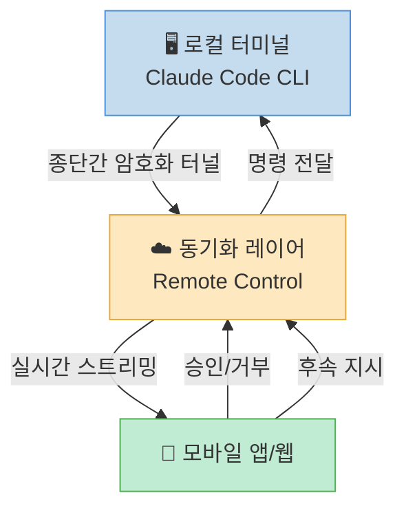
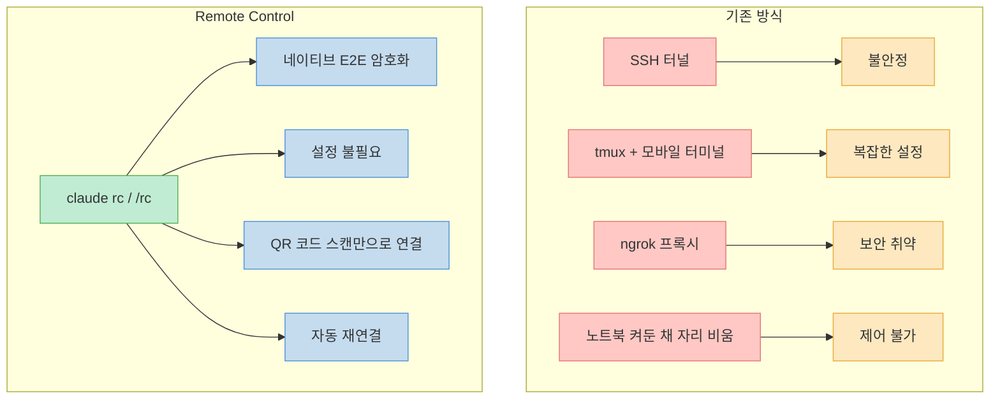
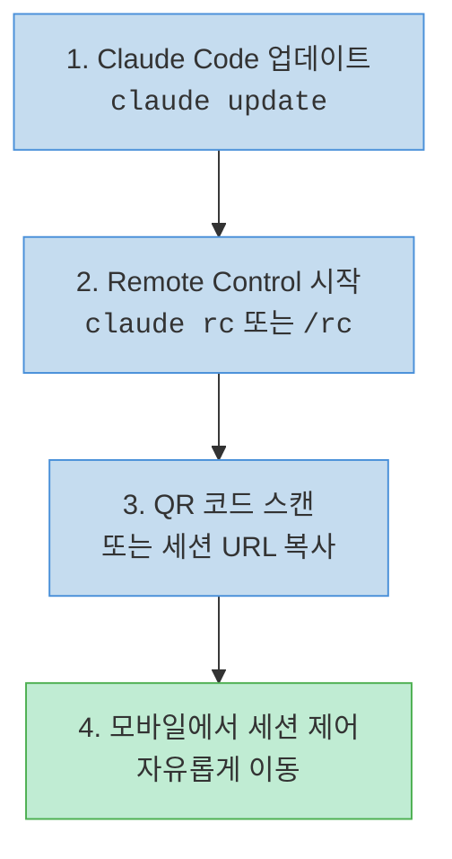
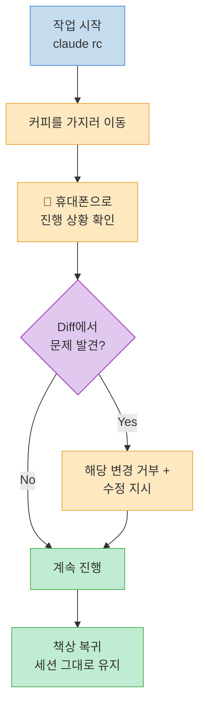
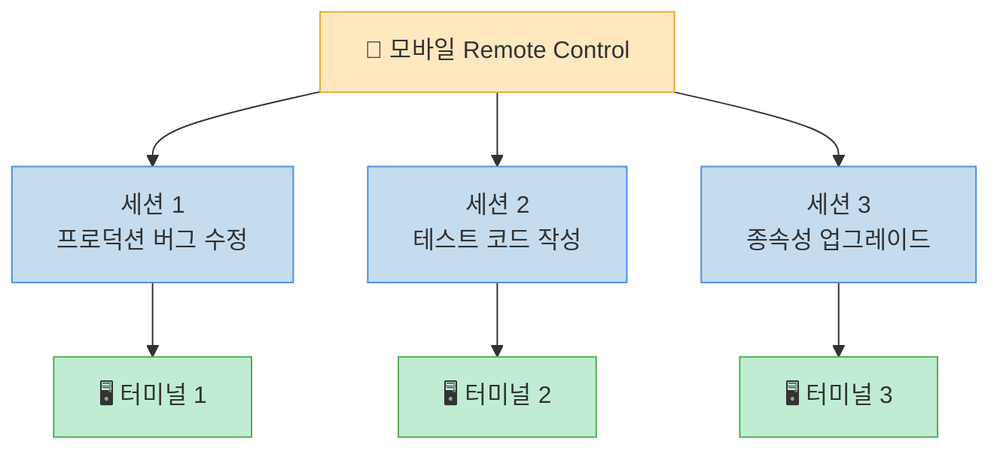
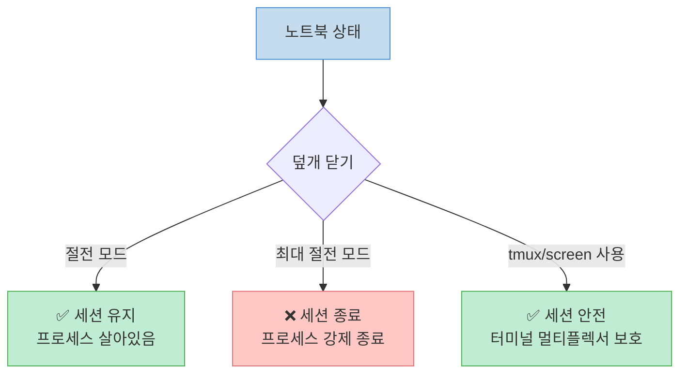
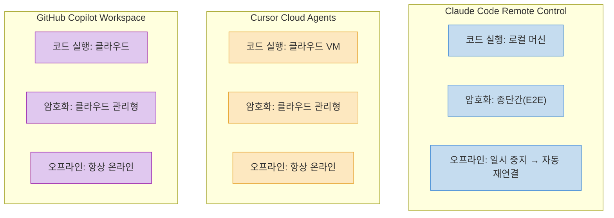
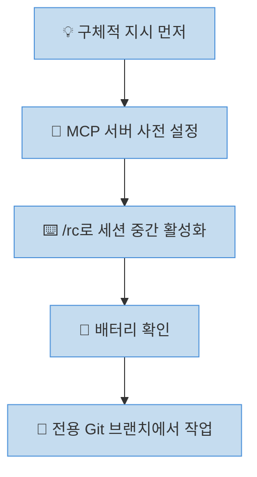

Claude Code에 **Remote Control** 기능이 추가되었습니다. 터미널에서 코딩 작업을 시작한 뒤, 노트북을 두고 자리를 떠나도 휴대폰에서 세션을 그대로 제어할 수 있는 기능입니다.

<!--more-->

## Sources

- [Claude Code Remote Control: 휴대전화로 터미널 실행하기 (2026 가이드) — NxCode](https://www.nxcode.io/ko/resources/news/claude-code-remote-control-mobile-terminal-handoff-guide-2026)

## Remote Control이란 무엇인가

Remote Control은 로컬 CLI와 Claude 모바일 앱(또는 웹 인터페이스) 사이의 **동기화 레이어** 입니다. 핵심은 코드가 사용자의 머신을 절대 떠나지 않는다는 점입니다. 클라우드 컴퓨팅이 아니라 종단간 암호화(E2E) 보안 터널을 통해 세션에 대한 원격 액세스만 제공합니다.



휴대폰에서 할 수 있는 작업은 다음과 같습니다.

- Claude가 현재 무엇을 하고 있는지 **실시간 확인**
- 파일 변경 사항 **승인 또는 거부**
- **후속 지시** 사항 전송
- 장시간 실행되는 **여러 세션 모니터링**

### 기존 방식을 대체하는 이유

Remote Control이 나오기 전에는 SSH 터널, 모바일 터미널에 연결된 tmux 세션, ngrok 프록시 등의 임시 방편을 사용해 왔습니다. 이러한 방법들은 불안정하고 보안에 취약하며 연결이 자주 끊겼습니다.



Remote Control은 이 모든 것을 **설정이 전혀 필요 없는 네이티브 종단간 암호화 연결** 하나로 대체합니다.

## 설정 방법: 60초 이내 완료

### 사전 준비 사항

| 항목 | 요구 사항 |
|------|----------|
| Claude Code 버전 | **v2.1.52 이상** (`claude --version`으로 확인) |
| 구독 플랜 | **Claude Max** (월 $100 또는 $200) |
| 모바일 | Claude 모바일 앱 또는 웹 브라우저 |

### 단계별 설정



**1단계** — Claude Code를 최신 버전으로 업데이트합니다.

```bash
claude update
```

**2단계** — 새 세션에서 Remote Control을 시작하거나, 이미 진행 중인 세션에서 슬래시 명령어를 사용합니다.

```bash
# 새 세션으로 시작
claude rc

# 또는 기존 세션 내부에서
/rc
```

> `/rc` 를 사용하면 기존 대화 맥락이 그대로 보존되므로, 세션 중간에 활성화하는 것이 더 유리합니다.

**3단계** — Claude가 생성한 세션 URL을 모바일에서 엽니다. QR 코드를 스캔하거나 링크를 복사하면 됩니다.

**4단계** — 설정 완료. 휴대폰에서 세션을 완벽하게 제어할 수 있습니다.

## 실제 업무 활용 시나리오

### 시나리오 1: 대규모 리팩터링 모니터링

컴포넌트 라이브러리를 CSS 모듈에서 Tailwind로 마이그레이션하는 것과 같은 대규모 리팩터링 작업에서, 40개 이상의 파일을 처리하는 동안 자리를 비울 수 있습니다.



핵심은 20분 동안 앉아서 지켜볼 필요 없이, 이동 중에도 문제를 즉시 발견하고 수정 지시를 내릴 수 있다는 점입니다.

### 시나리오 2: 백그라운드 빌드 디버깅

간헐적으로 실패하는 빌드를 Claude가 조사하는 동안 회의에 참석해야 할 때:

1. `/rc` 를 입력하여 Remote Control 활성화
2. 회의 중 휴대폰 확인 — Claude가 테스트의 레이스 컨디션 문제를 발견
3. 휴대폰에서 수정 사항 승인
4. 회의가 끝날 때쯤 CI가 통과(Green)

회의 시간이 디버깅 시간과 **완전히 겹쳐서** 시간 낭비 없이 두 가지 일을 동시에 처리할 수 있습니다.

### 시나리오 3: 여러 프로젝트 동시 관리

프로덕션 버그 수정, 테스트 코드 작성, 종속성 업그레이드 등 세 개의 개별 Claude Code 세션을 동시에 운영할 수 있습니다. 각 세션은 고유한 Remote Control 세션을 가지며, 휴대폰에서 채팅 스레드를 전환하듯 각 세션을 관리합니다.



## 반드시 알아야 할 주의사항 (Gotchas)

### 1. 터미널 종료 = 세션 종료

터미널 프로세스가 종료되면 Remote Control 세션도 함께 종료됩니다. 절전 모드가 아니라 **프로세스 자체가 닫히는 경우** 에 해당합니다.

- 전원 설정이 터미널 프로세스를 강제 종료하도록 되어 있다면 노트북 덮개를 닫지 마세요
- '최대 절전 모드'가 아닌 **'절전 모드'** 로 전환되도록 설정하세요
- `tmux` 나 `screen` 같은 터미널 멀티플렉서를 사용하는 것이 안전합니다



### 2. 세션 URL은 비밀번호와 같다

세션 URL을 가진 사람은 파일 변경 승인 권한을 포함하여 해당 Claude 세션에 대한 **모든 제어권** 을 갖게 됩니다.

- Slack 채널에 공유하지 마세요
- 스크린샷을 SNS에 올리지 마세요
- 링크 유출이 의심되면 즉시 터미널 세션을 종료하세요

### 3. 로컬 머신이 반드시 실행 중이어야 함

Remote Control은 클라우드 컴퓨팅이 아닙니다. 노트북이 켜져 있고 인터넷에 연결되어 있어야 합니다. WiFi가 끊기면 연결이 돌아올 때까지 세션이 일시 중지되며(자동 재연결 지원), 그동안 Claude는 작업을 수행하지 않습니다.

### 4. 모바일 경험의 한계

모바일 앱에서 전체 대화와 Diff를 볼 수 있지만, 작은 화면에서 코드를 상세하게 리뷰하는 데는 한계가 있습니다. **모니터링과 단순 승인/거부** 작업에는 훌륭하지만, 세부적인 코드 리뷰는 데스크톱에서 하는 것이 좋습니다.

### 5. 현재는 Max 요금제 전용

월 $100~$200인 Claude Max 구독이 필요합니다. Pro 요금제($20/월) 지원은 아직 출시 예정 상태이며, 팀 또는 엔터프라이즈 요금제에 대한 일정은 미정입니다.

## 경쟁 제품과의 비교

"자리를 비웠다 돌아오는" 문제는 Claude Code만의 고민이 아닙니다.



| 기능 | Claude Code Remote Control | Cursor Cloud Agents | GitHub Copilot Workspace |
|------|---------------------------|--------------------|-----------------------|
| 코드 실행 위치 | 사용자 로컬 머신 | 클라우드 VM | 클라우드 |
| 모바일 제어 | 네이티브 앱 | 웹, Slack, 모바일 | 웹 전용 |
| 자동 재연결 | 지원 | 해당 없음 (클라우드) | 해당 없음 |
| 암호화 | 종단간 암호화 | 클라우드 관리형 | 클라우드 관리형 |
| 오프라인 재개 | 세션 일시 중지 후 재개 | 항상 온라인 | 항상 온라인 |
| 가격 | Max $100–200/월 | Pro/Business | 엔터프라이즈 |

**철학적 차이점** 이 있습니다. Claude는 코드를 로컬에 유지하면서 세션에 대한 원격 액세스를 제공하고, Cursor는 코드를 완전히 클라우드로 이동시킵니다. 로컬 제어(보안, 사용자 정의 환경)와 클라우드 편의성(상시 가동, 노트북 의존성 없음) 중 무엇을 우선시하느냐에 따라 선택이 달라집니다.

## Remote Control 활용 팁

1. **자리를 뜨기 전 구체적인 지시 사항을 남기세요** — 처음에 맥락을 많이 제공할수록 휴대폰에서 수정해야 할 일이 줄어듭니다
2. **시작 전 MCP 서버를 설정하세요** — Remote Control은 MCP를 포함한 모든 로컬 컨텍스트를 유지하지만, 모바일에서 새 MCP 서버를 추가할 수는 없습니다
3. **`claude rc` 대신 `/rc` 를 사용하세요** — 세션 중간에 시작하면 모든 대화 맥락이 보존됩니다
4. **휴대폰 배터리를 확인하세요** — 긴 작업을 모니터링할 경우 스트리밍 연결로 배터리 소모가 발생합니다
5. **Git 브랜치와 병행하세요** — 각 Remote Control 작업을 전용 브랜치에서 시작하면 복귀 후 변경 사항을 쉽게 검토할 수 있습니다



## Claude Code의 폭발적 성장 맥락

Remote Control은 Claude Code의 급성장 시점에 출시되었습니다. 2026년 2월 기준 보도된 수치에 따르면(단일 소스 기반):

- **연간 반복 매출(ARR) 25억 달러** 달성 (연초 대비 2배 성장)
- **일일 VS Code 확장 프로그램 설치 수 2,900만 건** 기록

Claude Code 제품 매니저 Noah Zweben은 Remote Control을 일종의 '라이프스타일 기능'으로 정의했습니다.

> "작업 흐름을 끊지 않고 산책을 하고, 햇볕을 쬐고, 강아지를 산책시키세요."

## 핵심 요약

- **Remote Control** 은 로컬 터미널과 휴대폰을 종단간 암호화로 연결하는 동기화 레이어
- **설정이 즉각적** — `claude rc` 또는 `/rc` 입력 후 QR 코드 스캔이면 끝
- **코드는 로컬에 유지** — 클라우드 컴퓨팅이 아닌 세션 원격 액세스 방식
- **현재 Max 티어 전용** — 월 $100–200, Pro 액세스 출시 예정
- **터미널 종료 시 세션도 종료** — tmux/screen 사용 권장
- **세션 URL은 자격 증명처럼 관리** — 유출 시 즉시 터미널 종료
- **실무에서 진정한 게임 체인저** — 리팩터링 모니터링, 빌드 디버깅, 멀티 세션 관리에 유용

## 결론

Claude Code Remote Control은 "노트북 앞에서만 가능한 코딩"의 제약을 깨뜨리는 기능입니다. SSH 터널이나 ngrok 같은 불안정한 우회 방법 대신, 네이티브 종단간 암호화 연결로 휴대폰에서 터미널 세션을 안전하게 제어할 수 있습니다. 다만 현재는 Max 요금제 전용이며, 코드가 로컬에서 실행되는 만큼 노트북이 켜져 있어야 한다는 점은 기억해야 합니다. 클라우드 기반 경쟁 제품과 달리 보안과 로컬 제어를 우선시하는 접근 방식으로, 자신의 워크플로에 맞는 선택이 필요합니다.
