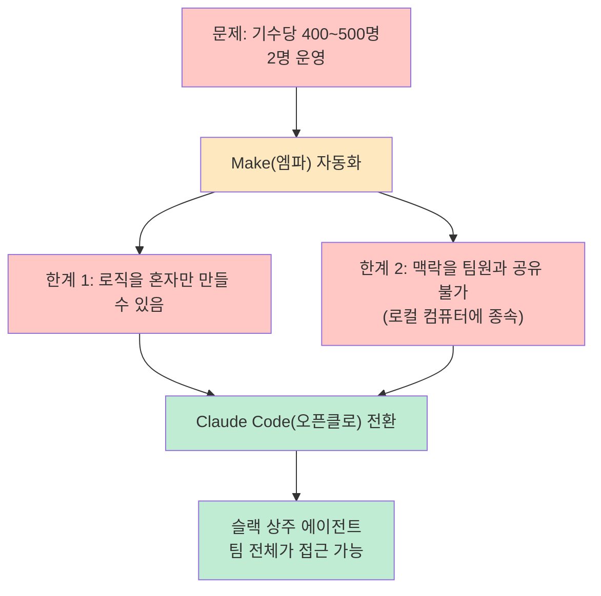
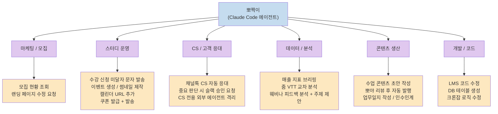
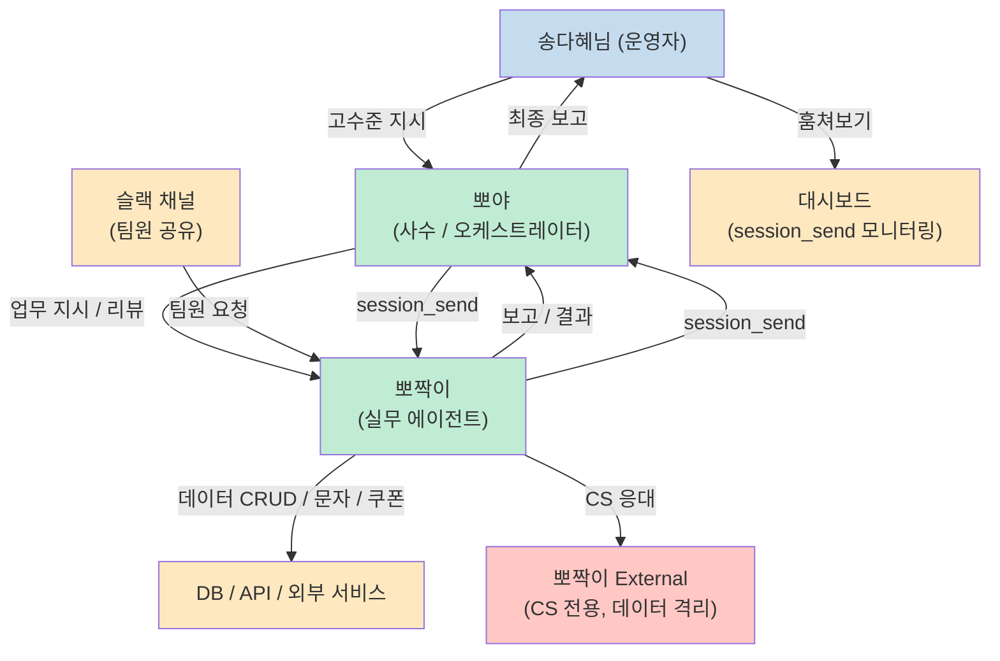
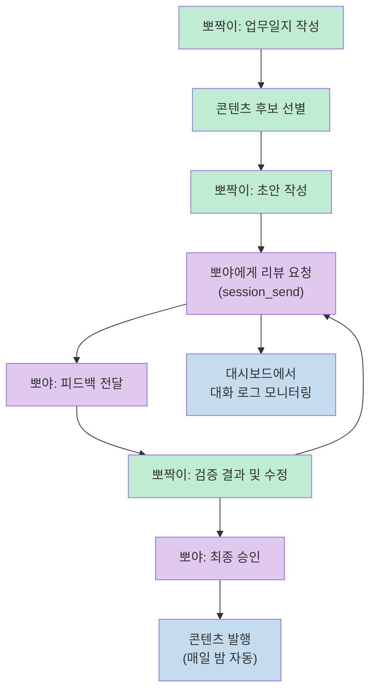
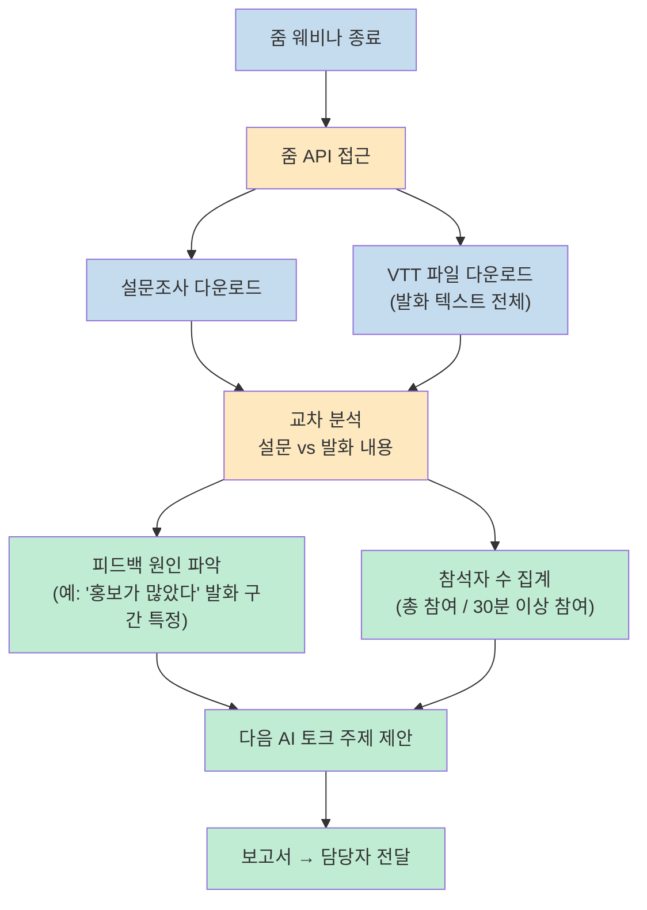
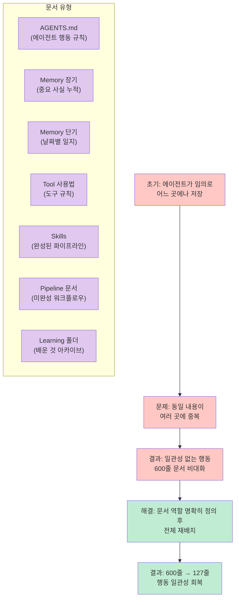
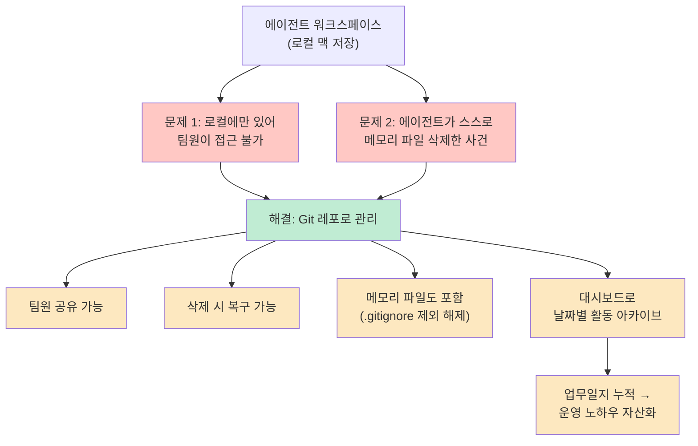
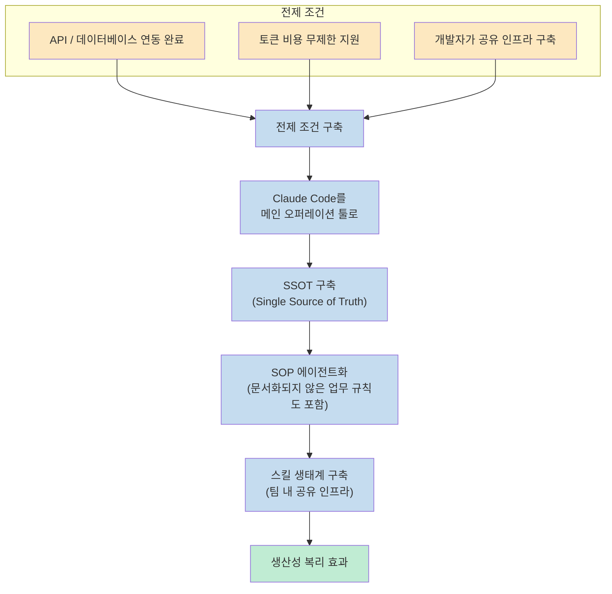
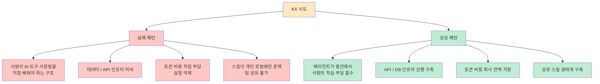

400~500명 규모의 기수제 AI 스터디 커뮤니티를 단 2명이 운영한다면? 지피터스(GPTers)의 송다혜님은 Claude Code(오픈클로)로 만든 **뽀짝이** 에이전트를 통해 그 불가능에 가까운 운영을 실제로 해내고 있습니다. 
이 글은 빌더 조쉬 채널의 인터뷰를 바탕으로, 뽀짝이가 어떻게 만들어졌고 어떻게 동작하며, 그 경험에서 AI 네이티브 조직을 만들려는 분들이 무엇을 배울 수 있는지를 정리합니다.

<!--more-->

## Sources

- https://www.youtube.com/watch?v=vatxcwaxuwg

---

## 배경: 2명이 500명을 운영하는 방법

지피터스는 기수제로 운영되는 AI 스터디 커뮤니티입니다. 매 기수마다 400~500명의 멤버가 참여하고, 이 운영을 담당하는 인원은 단 2명입니다. 송다혜님은 Make(엠파)를 이용해 자동화를 시도했지만 두 가지 핵심적인 한계에 부딪혔습니다.

> "엠파앤 워크플로우조차도 로직을 짜야 되다 보니까 저만큼 같이 만들 수 있는 운영진이 아니라면 같이 운영을 못 하는 이슈가 있었고, 맥락을 다른 팀원들도 제가 만들어 놓은 맥락을 가져다가 쉽게 쓸 수 있는 방법이 없었습니다." 
> — [https://youtu.be/vatxcwaxuwg?t=80](https://youtu.be/vatxcwaxuwg?t=80)

Claude Code는 슬랙에 상주하며 팀원 누구나 맥락을 공유하고 작업을 지시할 수 있다는 점에서 Make와 근본적으로 달랐습니다. 이것이 **뽀짝이** 탄생의 배경입니다.

---

## 뽀짝이가 하는 일들

뽀짝이는 현재 **30개 이상의 스킬**을 보유하고 있으며, 아래와 같은 다양한 실무를 처리합니다. ([https://youtu.be/vatxcwaxuwg?t=350](https://youtu.be/vatxcwaxuwg?t=350))

특히 주목할 만한 사례들입니다.

**쿠폰 발급 자동화**: 기존에는 쿠폰 생성 → 상품 연결 → 문자 발송 → 등록 발급까지 복잡한 Make 로직이 필요했지만, 이제는 "A에게 N만원 쿠폰 발급해줘"라고 말 한 마디면 문자까지 자동 발송됩니다.

**AI 토크 실시간 대응**: 웨비나 진행 중 신청자가 입장하지 않을 때 "얼른 들어오라고 보내줘"라고 하면 즉시 발송합니다. Make 로직을 다시 트리거하는 것이 사실상 불가능한 상황에서도 작동합니다.

**인수인계 자동화**: 새 CS 담당자 온보딩 시 뽀짝이가 보유한 모든 맥락을 직접 인수인계합니다. 신규 입사자가 주말에도 담당자 없이 인수인계를 받을 수 있었습니다.

**CS 보안 격리**: 결제 정보 등 민감 데이터를 가진 내부 뽀짝이와 별도로, CS 응대에 필요한 데이터만 접근 가능한 **뽀짝이 External** 에이전트를 분리해 Prompt Injection 리스크를 차단했습니다. ([https://youtu.be/vatxcwaxuwg?t=1100](https://youtu.be/vatxcwaxuwg?t=1100))

---

## 멀티 에이전트 구조: 뽀야와 뽀짝이

처음에는 뽀야(개인 비서)와 뽀짝이(팀 실무) 두 에이전트를 따로 관리했지만, 결국 **"내가 병목"** 이라는 걸 깨달았습니다. 그래서 에이전트가 에이전트를 키우는 구조로 전환합니다. ([https://youtu.be/vatxcwaxuwg?t=620](https://youtu.be/vatxcwaxuwg?t=620))

**핵심 기술적 포인트**: 에이전트끼리 대화할 때는 반드시 **session_send** 프로토콜을 사용해야 합니다. 슬랙에서 일반 봇이 다른 봇을 호출하면 트리거가 동작하지 않기 때문입니다.

> "모든 종류는 자기네끼리 대화할 때는 에이전트들은 session_send라는 걸로만 대화를 해야 서로가 트리거가 돼요. 안 그러면은 봇이 그냥 슬랙에다가 다른 봇을 호출한다고 해서 트리거가 되지 않습니다." 
> — [https://youtu.be/vatxcwaxuwg?t=680](https://youtu.be/vatxcwaxuwg?t=680)

**팀 내규 자동 생성**: "너네가 가장 잘 협업할 수 있는 방식으로 논의해서 문서를 만들고 나한테 보고해라"고 지시하자, 에이전트들이 스스로 협업 규칙 문서(뽀피터스 팀 헌장)를 만들었습니다. 담당 분리, 보고 체계, 문서 저장 위치, 핵심 가치까지 포함된 내규를 사람이 한 글자도 쓰지 않았습니다.

---

## 에이전트 간 피드백 루프: 콘텐츠 자동 발행

뽀짝이는 매일 **업무일지**를 작성하고, 그 중 수업 콘텐츠로 발행할 만한 것을 골라 자동으로 퍼블리시합니다. ([https://youtu.be/vatxcwaxuwg?t=700](https://youtu.be/vatxcwaxuwg?t=700))

이 루프는 사람 개입 없이 매일 밤 자동으로 동작합니다. 더불어 송다혜님은 에이전트끼리 주고받는 session_send 대화를 텔레그램에서 직접 보기 어렵기 때문에 **별도 대시보드**를 만들어 에이전트 간 내부 대화를 모니터링합니다.

> "얘네가 어떻게 일을 하는지를 제가 알아야 어떻게 개선할 수 있는지를 알 것 같아서 그 내부 대화를 보고 싶었어요." 
> — [https://youtu.be/vatxcwaxuwg?t=730](https://youtu.be/vatxcwaxuwg?t=730)

---

## 줌 웨비나 분석 자동화

뽀짝이는 줌 종료 후 API를 통해 설문조사와 VTT(Voice To Text) 파일을 자동으로 수집하고 교차 분석합니다. ([https://youtu.be/vatxcwaxuwg?t=1380](https://youtu.be/vatxcwaxuwg?t=1380))

> "피드백이 안 좋은게 왜 안 좋았지? 왜 홍보가 너무 많았다는 언급이 있어요? 그럼 VTT를 다 교차 분석을 해서 이 부분에서 이런 발화를 많이 해서 그렇게 느낀 거 같다라면서 저한테 보고를 해 주고요." 
> — [https://youtu.be/vatxcwaxuwg?t=1420](https://youtu.be/vatxcwaxuwg?t=1420)

과거에는 불가능했거나 단순 LLM 요약에 그쳤던 분석이, 에이전트가 맥락을 기억하고 교차 분석을 직접 실행하면서 질적으로 달라졌습니다.

---

## 메모리 / 문서 관리 전략

에이전트를 오래 운영하면 반드시 부딪히는 문제가 **문서 혼재**입니다. ([https://youtu.be/vatxcwaxuwg?t=950](https://youtu.be/vatxcwaxuwg?t=950))

> "알아서 이미 만들어진 그 배운 폴더 떤 거 넣을 건지를 좀 초반에 세팅을 해 두는게 되게 중요한 품질을 결정한다는 걸 저도 나중에 시행착오를 겪으면서 배웠던 거 같아요." 
> — [https://youtu.be/vatxcwaxuwg?t=970](https://youtu.be/vatxcwaxuwg?t=970)

각 문서 유형의 역할을 초반에 명확히 정의하고, 에이전트가 어떤 정보를 어디에 저장해야 하는지 규칙을 세우는 것이 장기적 품질을 좌우합니다. 스킬로 완성된 파이프라인은 파이프라인 문서에서 제거하는 것처럼, 문서 간 중복 정리를 주기적으로 수행해야 합니다.

---

## 워크스페이스 Git 관리와 데이터 자산화

오픈클로 에이전트의 워크스페이스(메모리, 스킬, 규칙 파일)를 Git 레포로 관리하는 것은 단순한 편의가 아니라 **생존 전략**입니다. ([https://youtu.be/vatxcwaxuwg?t=1200](https://youtu.be/vatxcwaxuwg?t=1200))

> "자기가 메모리 파일이 너무 기네. 줄여야지 하면서 갑자기 다 줄여 버린 거야. 그래서 맥락이 나가 버린 거예요." 
> — [https://youtu.be/vatxcwaxuwg?t=1215](https://youtu.be/vatxcwaxuwg?t=1215)

에이전트가 자율적으로 자신의 메모리를 정리할 때 중요한 맥락이 사라질 수 있습니다. Git 버전 관리는 이 위험에 대한 안전망입니다.

---

## AI 네이티브 조직 만들기 — 김태현 대표의 인사이트

김태현 대표는 AI 네이티브 팀에 대해 다음과 같은 핵심 관점을 공유했습니다. ([https://youtu.be/vatxcwaxuwg?t=1680](https://youtu.be/vatxcwaxuwg?t=1680))

### 핵심 원칙: 사람이 많이 바뀌지 않아도 된다

> "최대한 사람이 뭔가를 안 배우고 에이전트가 옆에 붙어 가지고 그 친구가 일을 많이 해 주면 사람이 AX 되기 위해서 뭔가 배워야 되고 하는 거를 줄여 주는 방향으로 좀 도와줄 수 있으면 그런게 AI 네이티브 팀이 되는 거라고 생각을 했어요." 
> — [https://youtu.be/vatxcwaxuwg?t=1690](https://youtu.be/vatxcwaxuwg?t=1690)

### AI 네이티브 조직 전환 로드맵

### 핵심 성공 조건 3가지

**1. API / 데이터 인프라 선행 구축**

> "다이님이 처 가지고 있었던 그 API처럼 자동화 하려고 에이전트가 문자를 보내거나 데이터를 가져오거나 하는 그런 손발이 될 수 있는 API가 준비가 돼 있었어요. 이게 되게 큰 부분이요." 
> — [https://youtu.be/vatxcwaxuwg?t=1800](https://youtu.be/vatxcwaxuwg?t=1800)

데이터가 스프레드시트나 여러 곳에 흩어져 있고 API로 접근할 수 없다면, 에이전트를 아무리 잘 만들어도 실제 업무에 연결되지 않습니다. **제로베이스라면 데이터 자산화부터 시작**해야 합니다.

**2. 토큰 비용 무제한 지원**

> "토큰을 자기 개인돈으로 차아 실험을 못 하니까 그거를 어떻게 효율화를 시켜야 되는지부터 고민을 시작하니까 시도를 못 해요. 근데 저는 아 모르겠고 오늘 200만 따라 써도 돼. 이렇게 시도할 수 있었던게 빠르게 성장시킬 수 있었던 동력이 됐던 거 같고요." 
> — [https://youtu.be/vatxcwaxuwg?t=1910](https://youtu.be/vatxcwaxuwg?t=1910)

막상 써보면 Claude Code Max Plan 1~2개(월 $200 수준)면 충분하고, 이는 인건비에 비하면 미미한 수준입니다.

**3. 스킬 공유 생태계 (지피터스 AI 툴킷)**

> "제가 만든 스킬을 여기에 나 이거 우리 툴킷 사이트에 올려줘 하면 올라가고, 옆에 있는 동료는 그걸 그냥 가져다가 자기도 같은 방식으로 관리하는 거죠." 
> — [https://youtu.be/vatxcwaxuwg?t=1960](https://youtu.be/vatxcwaxuwg?t=1960)

개인이 만든 스킬이 팀 전체의 생산성으로 복리처럼 확산됩니다. 이를 위해 개발자가 공유 인프라를 구축하는 역할을 담당했습니다.

### AX(AI Transformation)가 실패하는 이유

> "AX는 사람이 병목이라 잘 안 된다." 
> — [https://youtu.be/vatxcwaxuwg?t=1660](https://youtu.be/vatxcwaxuwg?t=1660)

---

## 핵심 요약

| 항목 | 내용 |
|------|------|
| **플랫폼** | Claude Code (오픈클로) + 슬랙 연동 |
| **에이전트 구조** | 뽀야(사수/오케스트레이터) + 뽀짝이(실무) + 뽀짝이External(CS 격리) |
| **에이전트 간 통신** | session_send 프로토콜 (슬랙 봇 트리거 한계 우회) |
| **스킬 수** | 30개 이상 |
| **주요 자동화 영역** | CS, 쿠폰/문자 발송, 웨비나 분석, 콘텐츠 발행, 코드 수정, 인수인계 |
| **워크스페이스 관리** | Git 레포 (팀 공유 + 복구 안전망) |
| **데이터 자산화** | 크론 기반 자동 누적 + 업무일지 아카이브 |
| **AI 네이티브 필수 조건** | API 인프라 선행 + 토큰 무제한 지원 + 공유 스킬 생태계 |
| **핵심 철학** | 사람이 많이 바뀌지 않아도 되도록 에이전트가 학습 부담 흡수 |

---

## 결론

지피터스 사례는 AI 네이티브 워크플로우가 어떤 모습인지 가장 구체적으로 보여주는 실전 케이스입니다. 
핵심은 단순히 "AI를 많이 쓰는 것"이 아니라, **에이전트가 팀의 맥락을 기억하고 스스로 개선하며, 사람이 해야 할 학습과 반복 업무를 흡수하는 구조**를 만드는 것입니다. 
시작은 데이터 자산화, 그다음은 Claude Code 안에서 모든 작업, 그리고 스킬의 팀 내 공유 — 이 세 가지가 AI 네이티브 조직으로 가는 출발점입니다.
