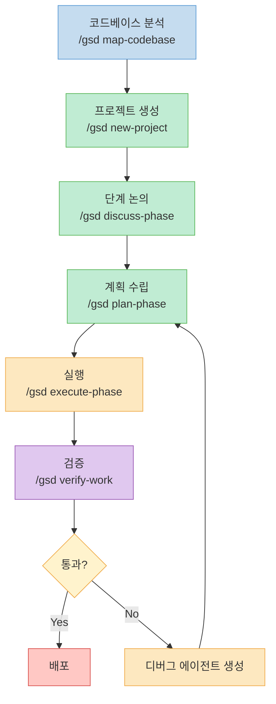
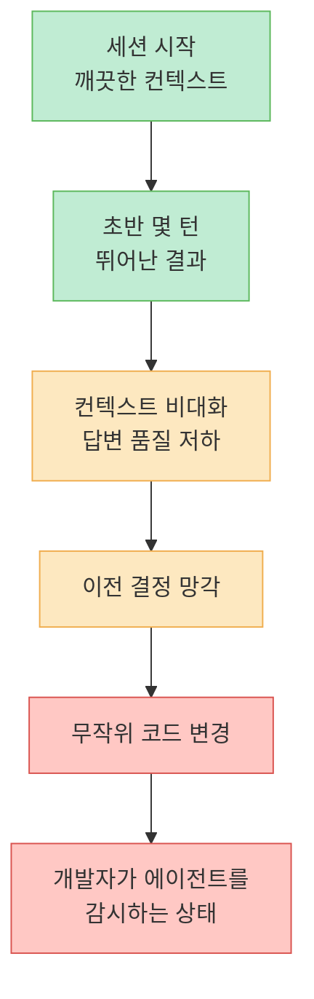
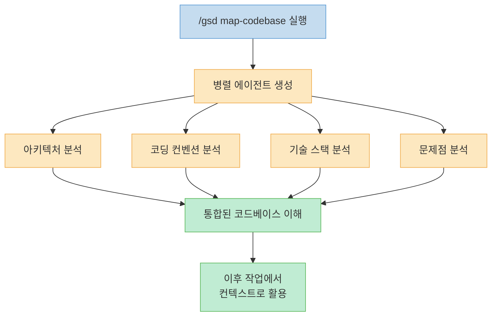
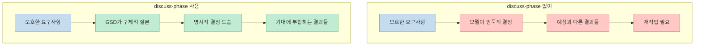
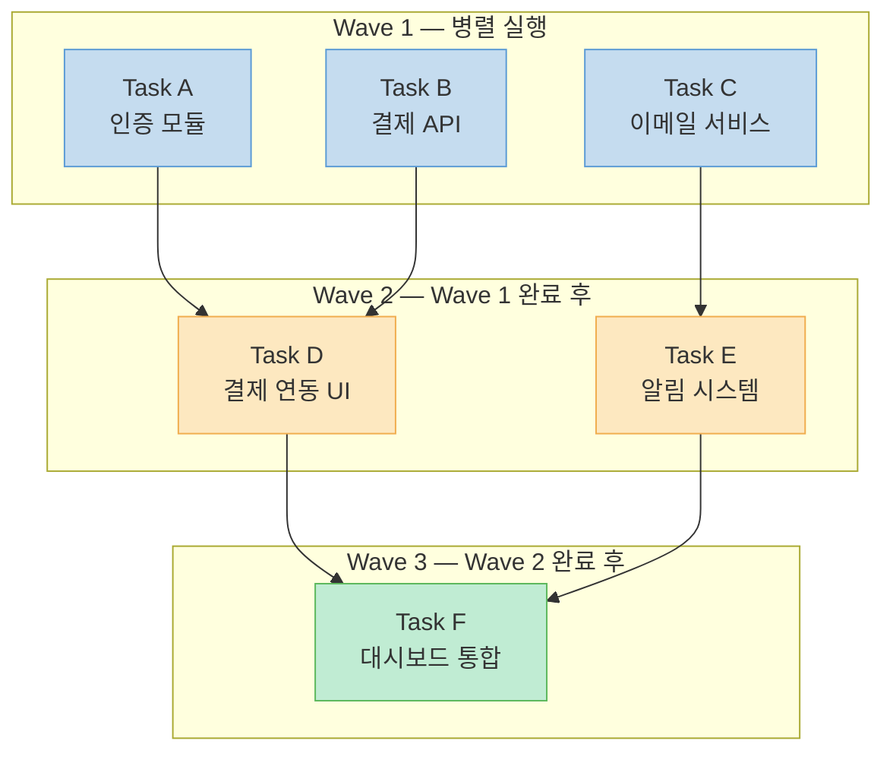
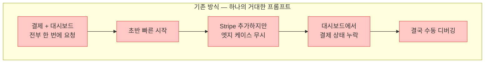
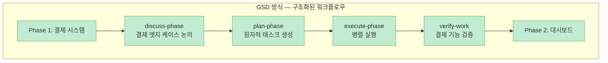
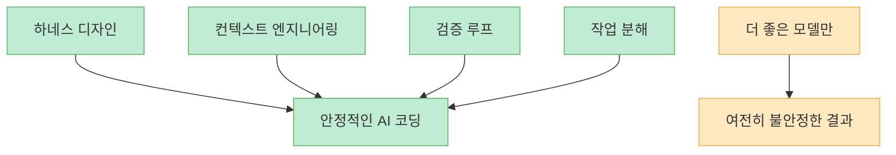

AI 코딩 에이전트로 대규모 프로젝트를 진행하다 보면 누구나 겪는 문제가 있습니다. 처음 몇 턴은 모델이 완벽하게 동작하지만, 컨텍스트가 쌓이면서 답변이 짧아지고, 이전 결정을 잊어버리고, 엉뚱한 코드를 변경하기 시작합니다. **GSD** (Get Shit Done)는 바로 이 **컨텍스트 붕괴** (Context Rot) 문제를 정면으로 해결하려는 오픈소스 워크플로우 시스템입니다. 이미 GitHub에서 수만 개의 스타를 받으며 빠르게 확산되고 있습니다.

<!--more-->

## Sources

- [GSD + Claude Code, Antigravity: This Simple PLUGIN makes your Claude Code & Antigravity 2X BETTER! - AICodeKing](https://www.youtube.com/watch?v=YfJwFZ9L5JI)

## GSD란 무엇인가

GSD는 새로운 AI IDE도, 새로운 모델도 아닙니다. Claude Code, Codex, Gemini CLI, OpenCode, Copilot, Cursor, Antigravity 같은 기존 AI 코딩 도구 **위에 설치하는 워크플로우 레이어** 입니다. 가장 핵심적인 정의는 **코딩 에이전트를 위한 컨텍스트 엔지니어링 레이어** 라는 것입니다 ([0:30](https://youtu.be/YfJwFZ9L5JI?t=30)).

기존 방식에서는 하나의 거대한 프롬프트를 에이전트에 던지고 최선을 바랐습니다. GSD는 이를 **반복 가능한 프로세스** 로 바꿉니다. 코드베이스 분석 → 프로젝트 생성 → 단계 논의 → 계획 수립 → 실행 → 검증 → 배포의 순서로 작업을 진행합니다 ([1:15](https://youtu.be/YfJwFZ9L5JI?t=75)).



GSD는 스스로를 **"엔터프라이즈 시어터"의 반대편** 에 위치시킵니다. 50명 규모의 소프트웨어 회사에서나 쓸 법한 무거운 프로세스가 아니라, 솔로 개발자를 위한 가벼운 구조를 지향합니다 ([2:00](https://youtu.be/YfJwFZ9L5JI?t=120)).

## 컨텍스트 붕괴 (Context Rot) 문제

GSD가 해결하려는 핵심 문제를 이해하면 이 도구의 가치가 명확해집니다. **컨텍스트 붕괴** 란 AI 코딩 에이전트를 사용할 때 세션이 길어지면서 발생하는 성능 저하 현상입니다 ([0:40](https://youtu.be/YfJwFZ9L5JI?t=40)).

구체적인 증상은 다음과 같습니다:

1. 깨끗한 프롬프트로 시작하면 모델이 처음 몇 턴은 뛰어난 결과를 보여줌
2. 컨텍스트가 점점 비대해지면서 답변이 짧아짐
3. 이전에 내린 결정을 잊어버림
4. 관련 없는 코드를 무작위로 변경하기 시작
5. 결국 에이전트를 도와주기보다 **에이전트를 감시하는 데 더 많은 시간** 을 쓰게 됨



GSD의 해결 전략은 **하나의 거대한 세션 대신, 체크포인트가 있는 작고 집중된 작업 단위** 로 분리하는 것입니다. 이렇게 하면 각 단계에서 에이전트가 신선한 컨텍스트 윈도우 안에서 작업할 수 있습니다.

## 설치 방법

설치는 간단합니다. 터미널에서 한 줄의 명령어로 시작합니다 ([2:15](https://youtu.be/YfJwFZ9L5JI?t=135)):

```bash
npx get-shit-done-cc@latest
```

설치 과정에서 두 가지를 물어봅니다:

- **런타임 선택**: Claude Code, OpenCode, Gemini CLI, Codex, Copilot, Cursor, Antigravity 중 선택 (또는 전체 설치)
- **설치 범위**: 글로벌 설치 또는 현재 프로젝트 한정 설치

Mac, Windows, Linux 모든 플랫폼을 지원합니다. 설치 후 검증 방법은 런타임에 따라 다릅니다:

| 런타임 | 검증 명령어 |
|--------|------------|
| Claude Code / Gemini CLI | `/gsd help` |
| Codex | `$args-help` |

Codex의 경우 커스텀 프롬프트 대신 **스킬 폴더** 를 설치하는 방식을 사용합니다. Codex가 이미 동작하는 방식에 자연스럽게 맞추는 설계입니다 ([2:50](https://youtu.be/YfJwFZ9L5JI?t=170)).

## 핵심 워크플로우 명령어

### 1. /gsd map-codebase — 코드베이스 분석

기존 프로젝트가 있다면 여기서 시작하는 것이 좋습니다. 이 명령어는 **병렬 에이전트를 생성** 하여 프로젝트의 아키텍처, 코딩 컨벤션, 기술 스택, 문제점을 분석합니다 ([3:00](https://youtu.be/YfJwFZ9L5JI?t=180)).

이것이 중요한 이유는 에이전트 기반 코딩의 가장 큰 문제 중 하나가 **모델이 코드베이스를 제대로 이해하기 전에 코드를 수정하기 시작** 하는 것이기 때문입니다. GSD는 이 이해를 **선행 작업** 으로 처리합니다.



### 2. /gsd new-project — 프로젝트 생성

계획 흐름을 시작하는 명령어입니다. 질문을 하고, 리서치를 수행하고, 요구사항을 추출하고, 로드맵을 생성합니다 ([4:00](https://youtu.be/YfJwFZ9L5JI?t=240)).

생성되는 파일들:

- `project.mmd` — 프로젝트 정의
- `requirements.mmd` — 요구사항 문서
- `roadmap.mmd` — 개발 로드맵
- `state.mmd` — 현재 상태 추적
- `planning-research/` — 리서치 결과 폴더

이렇게 **영속적인 프로젝트 메모리** 를 먼저 구축한 후에 에이전트가 구현 결정을 내리도록 합니다. 단순히 채팅하는 것이 아니라 체계적으로 프로젝트를 설계하는 것입니다.

### 3. /gsd discuss-phase — 단계 논의

GSD에서 가장 과소평가된 기능이라고 할 수 있습니다. 이 명령어는 **계획 전에 모든 회색 지대를 표면으로 끌어올립니다** ([4:30](https://youtu.be/YfJwFZ9L5JI?t=270)).

작업 유형에 따라 다른 질문을 합니다:

- **UI 작업**: 레이아웃, 밀도, 인터랙션, 빈 상태 처리
- **API/CLI 작업**: 응답 형식, 플래그, 에러 핸들링, 로깅 수준

핵심 통찰은 이것입니다: **모델이 코딩을 못하는 것이 아니라, 당신이 원하는 것을 추측하는 데 실패하는 것** 입니다 ([5:10](https://youtu.be/YfJwFZ9L5JI?t=310)). 모델이 암묵적으로 제품 결정을 내리는 대신, GSD가 그 결정들을 명시적으로 드러냅니다.



### 4. /gsd plan-phase — 계획 수립

이 단계에서 GSD는 해당 단계를 리서치하고, **작고 원자적인 태스크 계획** 을 생성한 뒤, 요구사항 대비 검증합니다 ([5:15](https://youtu.be/YfJwFZ9L5JI?t=315)).

여기서 핵심 트릭이 있습니다: 계획은 **신선한 컨텍스트 윈도우 안에서 실행할 수 있을 만큼 작게** 만들어집니다. 에이전트에게 전체 제품 대화를 기억하면서 동시에 12번째 태스크를 구현하라고 요청하는 것이 아닙니다. 에이전트가 **한 번에 하나의 경계된 작업 단위** 에만 집중할 수 있도록 작업을 청크로 나눕니다 ([5:25](https://youtu.be/YfJwFZ9L5JI?t=325)).

### 5. /gsd execute-phase — 실행

실행 단계는 **병렬 에이전트** 를 좋아하는 사람에게 특히 매력적입니다. GSD는 계획들을 **의존성에 따라 웨이브(wave)로 그룹화** 합니다 ([5:40](https://youtu.be/YfJwFZ9L5JI?t=340)):

- **독립적인 계획** 은 병렬로 실행
- **의존적인 계획** 은 이전 웨이브가 완료될 때까지 대기



또한 GSD는 **수직 슬라이스(vertical slice)가 수평 레이어(horizontal layer)보다 병렬화에 유리하다** 는 점을 강조합니다. 작업을 엔드투엔드 슬라이스로 나누면 충돌이 줄어들고, 각 에이전트가 의미 있는 결과에 더 집중할 수 있습니다 ([5:50](https://youtu.be/YfJwFZ9L5JI?t=350)).

또 하나 중요한 설계는 **각 태스크마다 원자적 git 커밋** 을 생성한다는 것입니다. 실행이 끝났을 때 미스터리한 변경사항의 더미가 아니라, 깨끗한 히스토리와 롤백 포인트를 얻게 됩니다 ([6:10](https://youtu.be/YfJwFZ9L5JI?t=370)).

### 6. /gsd verify-work — 검증

대부분의 AI 코딩 워크플로우는 코드가 컴파일되거나 테스트가 통과하면 멈춥니다. 하지만 이것만으로는 충분하지 않습니다. 기능이 테스트를 통과하면서도 사용자에게는 잘못될 수 있습니다 ([6:25](https://youtu.be/YfJwFZ9L5JI?t=385)).

GSD의 verify-work는 **테스트 가능한 산출물을 추출** 하고 하나씩 확인합니다:

- 사용자가 로그인할 수 있는가?
- 온보딩 흐름이 작동하는가?
- 대시보드가 올바른 상태를 렌더링하는가?

실패하면 **디버그 에이전트를 생성** 하고 수정 계획을 만들어 재실행합니다. 코드 생성에서 끝나는 것이 아니라 **실제로 작동하는 소프트웨어** 에 도달하려고 시도합니다.

### 7. /gsd next — 다음 단계 안내

어떤 명령어를 다음에 실행해야 할지 모를 때, `/gsd next`가 워크플로우에서 다음 논리적 단계를 알려줍니다 ([7:00](https://youtu.be/YfJwFZ9L5JI?t=420)). 작은 기능이지만 작업 모멘텀을 유지하는 데 효과적입니다.

## 실전 예시: SaaS 앱에 결제 + 관리자 대시보드 추가

기존 SaaS 앱에 결제 기능과 관리자 대시보드를 추가하는 시나리오를 살펴봅니다 ([7:15](https://youtu.be/YfJwFZ9L5JI?t=435)).





단계별로 분리하면 각 단계에서 에이전트가 신선한 컨텍스트로 작업하고, 검증 후 다음 단계로 넘어갑니다. 하나의 거대한 프롬프트가 모든 것을 올바르게 처리하기를 바라는 것보다 훨씬 안정적입니다.

## GSD가 적합한 사람

GSD는 AI가 진지한 코딩 작업을 할 수 있다고 믿지만, **혼란에 지친 사람들** 을 위한 도구입니다 ([8:00](https://youtu.be/YfJwFZ9L5JI?t=480)):

- **솔로 개발자** 와 **인디 해커**
- 50명 규모의 회사를 흉내 내지 않으면서 더 많은 **구조** 를 원하는 파워 유저
- 중대형 기능이나 멀티 페이즈 프로젝트를 진행하는 개발자

## 알아야 할 한계점

영상에서는 장점만이 아닌 솔직한 한계도 다루고 있습니다 ([8:20](https://youtu.be/YfJwFZ9L5JI?t=500)):

**1. 마법이 아니다**<br>
GSD 레포에는 "원하는 것이 명확하다면 이것이 대신 만들어준다"라는 문구가 있습니다. 여기서 핵심은 **"명확하다면"** 입니다. 모호한 제품 사고는 아무리 좋은 워크플로우를 씌워도 모호한 결과를 낳습니다.

**2. 작은 작업에는 과도하다**<br>
함수 이름 변경, 작은 버그 수정, 컴포넌트 하나 수정 같은 작업에는 discuss → plan → execute → verify 전체 사이클이 필요 없습니다. GSD는 **컨텍스트 관리가 핵심 문제가 될 만큼 큰 작업** 에서 빛납니다 ([10:15](https://youtu.be/YfJwFZ9L5JI?t=615)).

**3. --dangerously-skip-permissions 권장에 대한 주의**<br>
GSD 레포에서는 마찰 없는 워크플로우를 위해 이 플래그를 권장합니다. 신뢰할 수 있는 머신과 이해하고 있는 프로젝트에서는 괜찮을 수 있지만, **초보자가 모든 곳에서 무분별하게 활성화하는 것은 위험** 합니다 ([9:35](https://youtu.be/YfJwFZ9L5JI?t=575)).

**4. 터미널 중심**<br>
GUI나 시각적 대시보드를 원한다면 GSD는 적합하지 않습니다. 학습 곡선이 존재합니다.

**5. 직설적인 톤**<br>
프로젝트 이름부터가 직설적입니다. 격식을 중시하는 엔터프라이즈 환경에서는 이름만으로도 도입이 어려울 수 있습니다.

## 비용 고려사항

GSD 자체는 **오픈소스 MIT 라이선스** 입니다. 하지만 이것이 모델 비용을 없애주지는 않습니다 ([9:30](https://youtu.be/YfJwFZ9L5JI?t=570)). 비싼 모델을 사용하면서 병렬 에이전트를 여러 개 생성하면 토큰 비용이 빠르게 증가할 수 있습니다.

다만 Codex, Copilot, Cursor, Antigravity처럼 **구독 기반 도구** 와 함께 사용하면 추가 비용 없이 GSD의 구조적 이점을 누릴 수 있어 가치가 더 높아집니다.

## 더 큰 흐름: 하네스 디자인의 중요성

GSD는 현재 AI 코딩 생태계에서 일어나는 **더 큰 전환** 을 보여줍니다 ([9:50](https://youtu.be/YfJwFZ9L5JI?t=590)). 모델 자체는 계속 좋아지고 있지만, **더 좋은 모델만으로는 충분하지 않습니다.** 진정한 차이는 다음에서 옵니다:



GSD의 핵심 메시지: **혼란스러운 에이전트와 안정적인 에이전트의 차이는 모델이 아니라, 모델을 감싸는 워크플로우** 입니다 ([10:30](https://youtu.be/YfJwFZ9L5JI?t=630)).

## 핵심 요약

- **GSD** 는 AI 코딩 에이전트(Claude Code, Codex, Gemini CLI 등) 위에 설치하는 **오픈소스 워크플로우 레이어**
- **컨텍스트 붕괴** 문제를 발견-계획-실행-검증 분리로 해결
- **map-codebase** 로 코드베이스를 선행 분석하여 에이전트에게 맥락 제공
- **discuss-phase** 로 모호한 요구사항을 명시적으로 정리
- **plan-phase** 로 원자적 태스크 계획 생성, 신선한 컨텍스트 윈도우에서 실행 가능한 크기
- **execute-phase** 로 의존성 기반 웨이브 병렬 실행 + 태스크별 원자적 git 커밋
- **verify-work** 로 테스트 통과를 넘어 실제 사용자 시나리오까지 검증
- 솔로 개발자, 인디 해커, 중대형 프로젝트에 적합하며, 작은 작업에는 과도할 수 있음
- 설치: `npx get-shit-done-cc@latest`
- 저장소: `github.com/gsd-build/get-shit-done`

## 결론

GSD는 AI 코딩 에이전트를 위한 가장 실용적인 오픈소스 워크플로우 레이어 중 하나입니다. 독선적이지만 유용한 방향으로 독선적이며, 대규모 에이전트 프로젝트에서 **컨텍스트 관리가 진짜 병목** 이라는 점을 정확히 이해하고 있습니다. 모든 작업에 필요한 것은 아니지만, 컨텍스트가 문제가 되는 규모의 프로젝트를 AI 에이전트로 진행한다면 확실히 시도해볼 가치가 있습니다.
