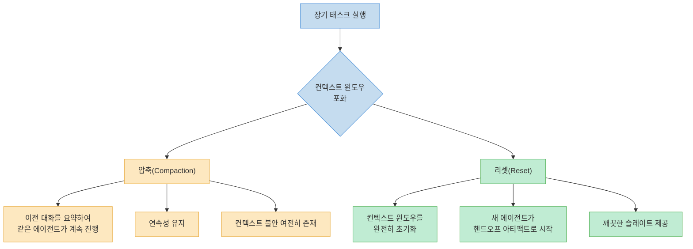
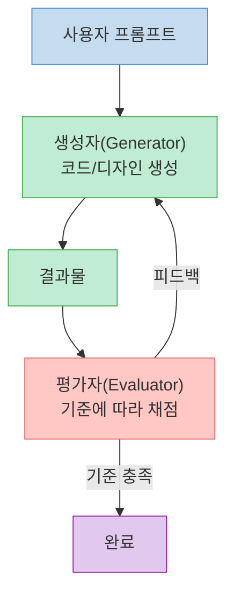
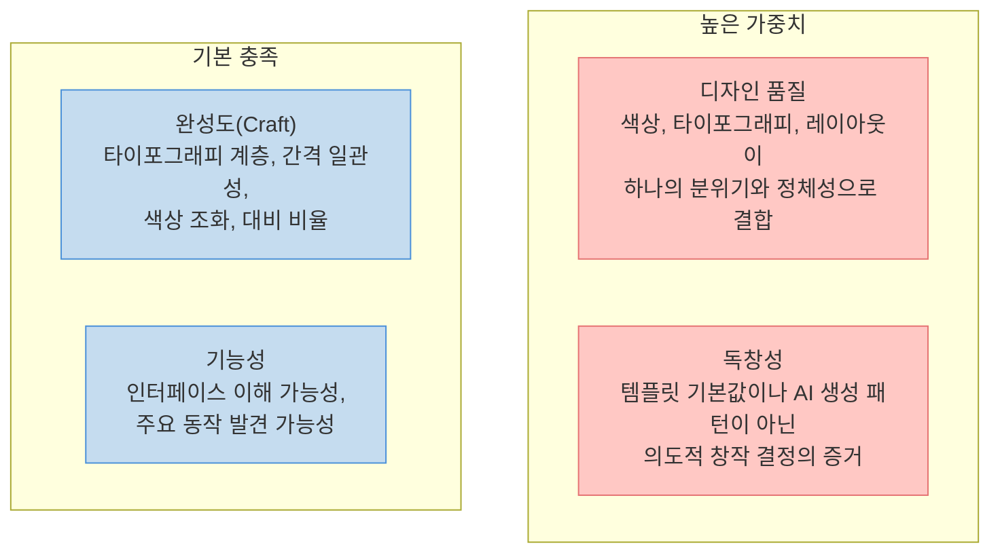
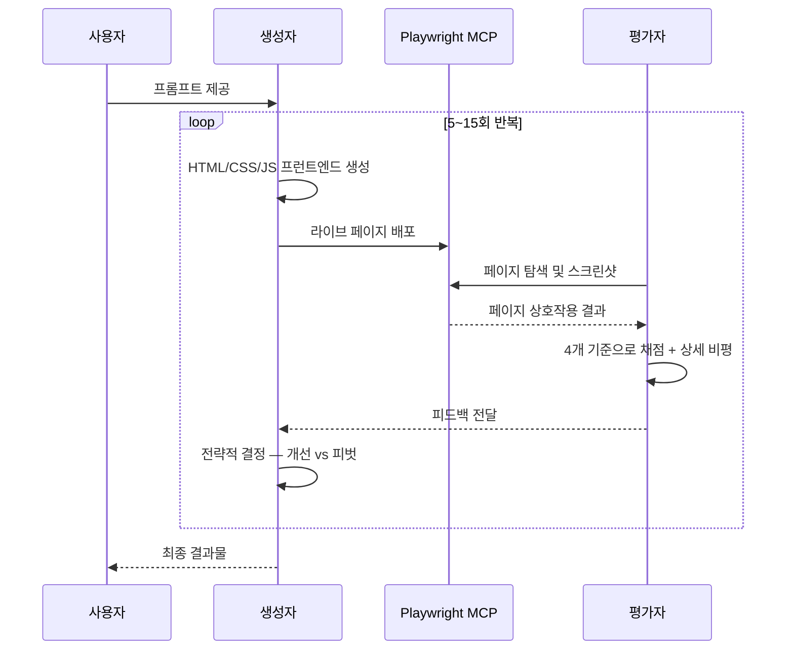
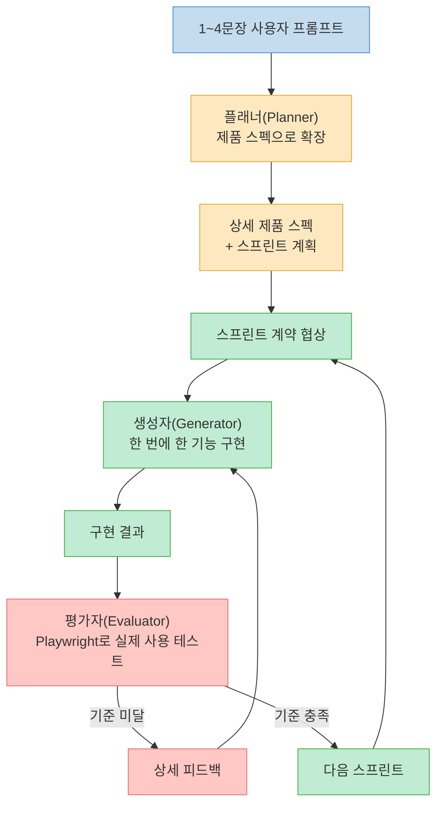
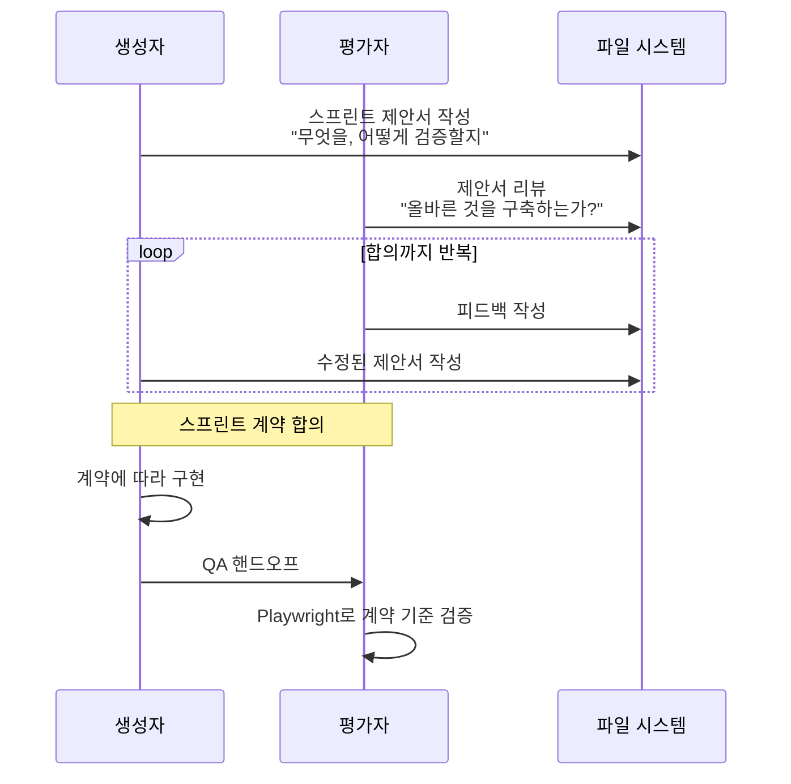
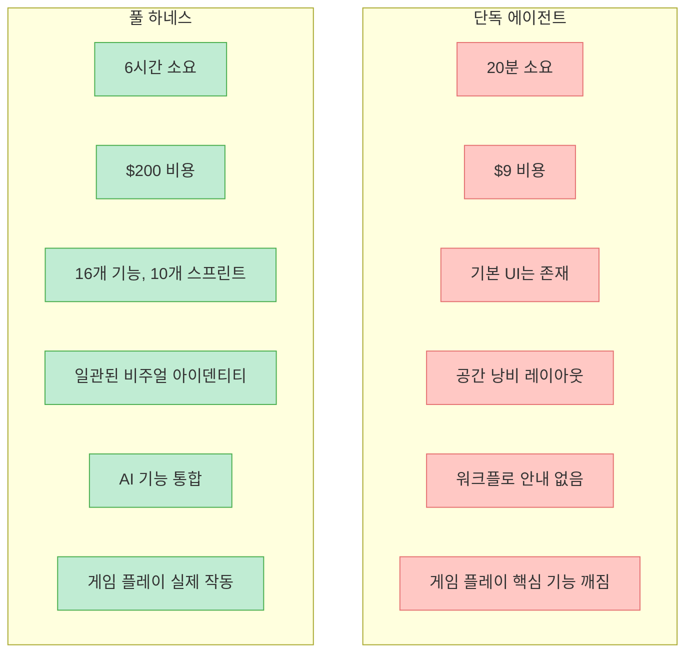
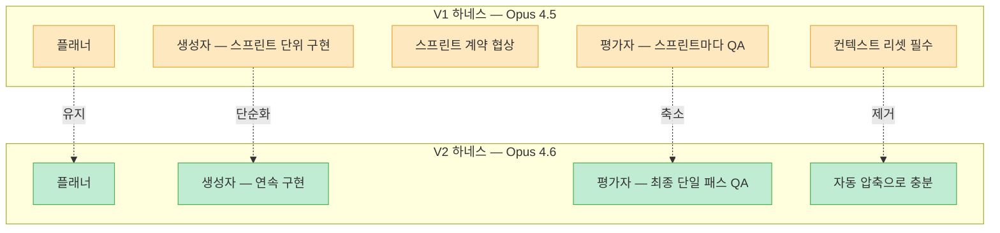
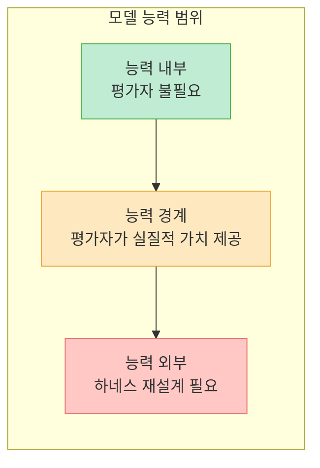
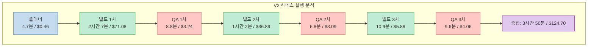

Anthropic Labs의 Prithvi Rajasekaran이 공개한 이 엔지니어링 포스트는 장기 실행 AI 코딩 에이전트의 **하네스 설계** 에 대한 실전 경험을 담고 있습니다. 단순히 "좋은 프롬프트를 쓰면 된다"는 수준을 넘어서, GAN(Generative Adversarial Network) 에서 영감을 받은 멀티 에이전트 구조가 왜 필요하고, 어떻게 진화하는지를 구체적인 실험 데이터와 함께 보여줍니다.

<!--more-->

## Sources

- [Harness design for long-running application development — Anthropic](https://www.anthropic.com/engineering/harness-design-long-running-apps)

## 왜 단순한 구현은 실패하는가: 두 가지 핵심 실패 모드

장기 실행 에이전트 코딩에서 반복적으로 나타나는 실패 패턴은 크게 두 가지입니다.

### 실패 모드 1: 컨텍스트 윈도우 일관성 상실

모델이 긴 태스크를 수행할수록 컨텍스트 윈도우가 채워지면서 **일관성을 잃기 시작** 합니다. 더 흥미로운 현상은 **"컨텍스트 불안(context anxiety)"** 입니다. 모델이 자신의 컨텍스트 한계에 가까워졌다고 "믿으면" 작업을 조기에 마무리하려는 경향을 보이는 것입니다.

이 문제에 대한 해결 접근법은 두 가지가 있는데, Anthropic은 **컨텍스트 리셋** 을 선택했습니다.

**압축(Compaction)** 은 이전 대화를 요약해서 같은 에이전트가 단축된 히스토리 위에서 계속 작업하는 방식입니다. 연속성은 유지되지만, 에이전트에게 깨끗한 슬레이트를 제공하지 못하기 때문에 컨텍스트 불안이 여전히 남습니다.

**리셋(Reset)** 은 컨텍스트 윈도우를 완전히 비우고 새 에이전트를 시작하되, 이전 에이전트의 상태와 다음 단계를 구조화된 핸드오프 아티팩트로 전달하는 방식입니다. Anthropic의 초기 테스트에서 Claude Sonnet 4.5는 컨텍스트 불안이 너무 강해서 압축만으로는 장기 태스크 성능을 충분히 확보할 수 없었고, 컨텍스트 리셋이 **필수적** 이었습니다.

### 실패 모드 2: 자기 평가의 한계

에이전트에게 자신이 만든 작업물을 평가하라고 하면, **자신감 있게 작업물을 칭찬하는 경향** 이 있습니다. 인간 관찰자가 보기에 품질이 분명히 떨어지는 경우에도 마찬가지입니다. 이 문제는 특히 디자인처럼 이진 검증(테스트 통과/실패)이 불가능한 **주관적 태스크** 에서 두드러집니다.

하지만 검증 가능한 결과가 있는 태스크에서조차, 에이전트는 종종 자신의 작업물에 대해 **나쁜 판단** 을 내려 성능을 저하시킵니다. 이 문제의 해결책은 **작업 수행 에이전트와 판단 에이전트의 분리** 입니다. 분리 자체가 관대함을 즉시 제거하지는 않지만, 독립된 평가자를 **회의적으로 튜닝** 하는 것이 생성자가 자기 작업에 비판적이 되도록 만드는 것보다 훨씬 다루기 쉽습니다.

## GAN에서 영감 받은 생성자-평가자 아키텍처

이 두 가지 실패 모드를 해결하기 위해 Anthropic은 GAN(Generative Adversarial Network) 에서 영감을 받은 구조를 설계했습니다.

핵심 아이디어는 간단합니다. 생성자가 결과물을 만들고, 평가자가 명시적 기준에 따라 채점하며, 기준에 미달하면 피드백과 함께 생성자에게 돌려보냅니다. 이 루프가 품질 기준을 충족할 때까지 반복됩니다.

## 프런트엔드 디자인: 주관적 품질을 채점 가능하게 만들기

### 네 가지 채점 기준

Anthropic은 프런트엔드 디자인에서 자기 평가 문제가 가장 두드러졌기 때문에 여기서 먼저 실험했습니다. 개입 없이 Claude는 기술적으로 기능하지만 시각적으로 평범한 "안전한" 레이아웃을 만드는 경향이 있습니다.

핵심 인사이트는 두 가지였습니다.

1. 미학은 점수로 완전히 환원될 수 없지만, **디자인 원칙과 선호를 인코딩한 채점 기준** 으로 개선할 수 있다
2. **생성과 채점을 분리** 하면 생성자를 더 강한 결과물로 밀어붙이는 피드백 루프를 만들 수 있다

이를 바탕으로 생성자와 평가자 모두에게 다음 네 가지 기준을 프롬프트로 제공했습니다.

**디자인 품질** 과 **독창성** 에 더 높은 가중치를 부여한 이유는, Claude가 **완성도와 기능성** 에서는 기본적으로 높은 점수를 받지만 디자인과 독창성에서는 평범한 결과물을 내놓았기 때문입니다. 채점 기준은 명시적으로 "AI 슬롭" 패턴(보라색 그라디언트 위에 흰 카드 같은 전형적 AI 생성 패턴)에 감점을 부여했습니다.

### 평가자 캘리브레이션과 루프 구조

평가자는 **상세한 점수 분석이 포함된 퓨샷 예제** 로 캘리브레이션했습니다. 이를 통해 평가자의 판단이 개발자의 선호에 맞도록 정렬하고, 이터레이션 간 점수 드리프트를 줄였습니다.

루프는 Claude Agent SDK 위에 구축되었으며 다음과 같이 동작합니다.

주목할 점은 평가자가 **정적 스크린샷이 아니라 Playwright MCP를 통해 라이브 페이지와 직접 상호작용** 한다는 것입니다. 평가자가 자체적으로 페이지를 탐색하고, 스크린샷을 찍고, 구현을 세심하게 검토한 뒤 평가를 내렸습니다. 전체 실행 시간은 최대 **4시간** 에 달했습니다.

### 생성자의 전략적 결정

각 평가 후 생성자는 두 가지 전략 중 하나를 선택하도록 지시받았습니다.

- **점수가 상승 추세라면**: 현재 방향을 정교화
- **접근법이 효과적이지 않다면**: 완전히 다른 미학으로 피벗

이 전략적 결정 메커니즘이 예상치 못한 창발적 행동을 이끌어냈습니다. 네덜란드 미술관 웹사이트를 만드는 예제에서, 9번째 이터레이션까지는 깔끔한 다크 테마 랜딩 페이지를 만들었습니다. 그런데 **10번째 사이클에서 접근법을 완전히 폐기** 하고, CSS 원근법으로 렌더링한 체크무늬 바닥의 3D 공간, 벽에 자유롭게 배치된 작품, 스크롤이나 클릭 대신 출입구 기반 내비게이션이 있는 **공간적 경험** 으로 사이트를 재구상했습니다.

### 프런트엔드 실험에서 발견한 패턴

- **점수는 일반적으로 이터레이션에 걸쳐 개선되지만 항상 선형적이지는 않음** — 중간 이터레이션이 마지막 것보다 나은 경우도 빈번
- **구현 복잡도가 라운드에 걸쳐 증가하는 경향** — 평가자의 피드백에 반응하여 더 야심 찬 솔루션을 시도
- **첫 이터레이션부터 기준선보다 나은 결과** — 기준과 관련 언어 자체가 평가자 피드백 이전에도 모델을 기본값에서 벗어나게 함
- **기준 문구가 출력 특성을 직접 형성** — "최고의 디자인은 박물관 수준"이라는 문구가 특정 시각적 수렴을 유도

## 풀스택 코딩으로 확장: 세 에이전트 아키텍처

프런트엔드 실험의 성과를 바탕으로, 풀스택 개발에 이 패턴을 적용했습니다. 생성자-평가자 루프는 소프트웨어 개발 수명주기에 자연스럽게 매핑됩니다 — 코드 리뷰와 QA가 디자인 평가자와 같은 구조적 역할을 합니다.

### 아키텍처 상세

세 에이전트의 역할은 각각 이전 실행에서 관찰된 특정 격차를 해결합니다.

#### 플래너(Planner)

이전 하네스는 사용자가 상세한 스펙을 직접 제공해야 했습니다. 플래너는 이 단계를 자동화합니다.

- **1~4문장의 간단한 프롬프트** 를 받아 전체 제품 스펙으로 확장
- **범위에 대해 야심적** 이되, **제품 맥락과 높은 수준의 기술 설계** 에 집중
- **세부 기술 구현은 의도적으로 생략** — 플래너가 세밀한 기술 세부사항을 미리 지정하고 뭔가를 잘못 지정하면, 그 오류가 다운스트림 구현으로 캐스케이드되기 때문
- **AI 기능을 제품 스펙에 엮어 넣도록** 지시받음

이 접근법의 핵심 원리는: **산출물(deliverables) 에 제약을 걸고, 경로(path) 는 에이전트가 작업하면서 스스로 찾게 하는 것** 입니다.

#### 생성자(Generator)

- **한 번에 한 기능씩** 스프린트 방식으로 구현
- 기술 스택: React, Vite, FastAPI, SQLite(이후 PostgreSQL)
- 각 스프린트 끝에서 자체 평가 후 QA로 핸드오프
- git으로 버전 관리

#### 평가자(Evaluator)

- **Playwright MCP를 사용해 실행 중인 앱을 실제 사용자처럼 클릭하며 테스트**
- UI 기능, API 엔드포인트, 데이터베이스 상태 검증
- 프런트엔드 실험의 기준을 적응하여 **제품 깊이, 기능성, 시각 디자인, 코드 품질** 을 평가
- 각 기준에 **하드 임계값** 이 있고, 하나라도 미달하면 스프린트 실패

### 스프린트 계약 메커니즘

각 스프린트 전에 생성자와 평가자가 **"완료"의 정의** 를 협상합니다. 제품 스펙이 의도적으로 높은 수준이었기 때문에, 사용자 스토리와 테스트 가능한 구현 사이의 격차를 메우는 단계가 필요했습니다.

에이전트 간 통신은 **파일 기반** 으로 이루어졌습니다. 한 에이전트가 파일을 작성하면, 다른 에이전트가 그것을 읽고 같은 파일 내에서 또는 새 파일로 응답했습니다. 이 방식은 구현을 과도하게 초기에 상세 지정하지 않으면서도 스펙에 충실한 작업을 유지했습니다.

## 실험 결과 비교: 단독 에이전트 vs 하네스

### 레트로 게임 메이커 실험 (Opus 4.5)

프롬프트: *"Create a 2D retro game maker with features including a level editor, sprite editor, entity behaviors, and a playable test mode."*

단독 에이전트의 결과는 초기에는 기대에 부합했지만, 클릭해보면 문제가 드러났습니다. 고정 높이 패널이 뷰포트 대부분을 비워두고, 레벨을 채우려고 하면 먼저 스프라이트와 엔터티를 만들어야 하지만 UI가 그 순서를 안내하지 않았습니다. 가장 결정적으로, **실제 게임이 작동하지 않았습니다.** 엔터티가 화면에 나타났지만 입력에 반응하지 않았고, 엔터티 정의와 게임 런타임 사이의 연결이 끊겨 있었습니다.

하네스 결과는 같은 한 문장 프롬프트에서 시작했지만, 플래너가 16개 기능의 스펙을 10개 스프린트로 확장했습니다. 핵심 에디터와 플레이 모드뿐 아니라 스프라이트 애니메이션 시스템, 행동 템플릿, 사운드 효과와 음악, AI 기반 스프라이트 생성기와 레벨 디자이너, 공유 가능한 링크가 포함된 게임 내보내기까지 포함했습니다.

### 평가자가 잡아낸 실제 버그들

평가자의 가치를 보여주는 구체적 사례들입니다.

| 계약 기준 | 평가자 발견 |
|---|---|
| 사각형 채우기 도구로 클릭-드래그하여 선택 타일로 영역 채우기 | **실패** — 도구가 드래그 시작/끝 지점에만 타일 배치. `fillRectangle` 함수는 존재하나 mouseUp에서 제대로 트리거되지 않음 |
| 배치된 엔터티 스폰 포인트를 선택하고 삭제 가능 | **실패** — `LevelEditor.tsx:892`의 Delete 키 핸들러가 `selection`과 `selectedEntityId` 모두 필요하지만, 엔터티 클릭 시 `selectedEntityId`만 설정됨 |
| API를 통한 애니메이션 프레임 순서 변경 | **실패** — `PUT /frames/reorder` 라우트가 `/{frame_id}` 라우트 뒤에 정의됨. FastAPI가 `reorder`를 frame_id 정수로 매칭하여 422 반환 |

이런 수준의 평가를 얻기까지 상당한 작업이 필요했습니다. 초기에 Claude는 **형편없는 QA 에이전트** 였습니다. 정당한 이슈를 발견하고도 "큰 문제가 아니다"라고 스스로 설득하고 작업을 승인하는 모습이 관찰되었습니다. 표면적으로만 테스트하고 엣지 케이스를 탐색하지 않아 미묘한 버그가 빠져나갔습니다.

튜닝 루프는 다음과 같았습니다: 평가자의 로그를 읽고, 평가자의 판단이 개발자의 판단과 달랐던 사례를 찾고, 그 이슈를 해결하도록 QA 프롬프트를 업데이트. 여러 라운드를 거쳐야 합리적인 채점을 하는 평가자를 얻을 수 있었습니다.

## 하네스 단순화: 모델 진화에 따른 적응

### 핵심 원칙

> "하네스의 모든 구성 요소는 모델이 자체적으로 할 수 없는 것에 대한 가정을 인코딩하며, 그 가정은 스트레스 테스트할 가치가 있다."

이 원칙은 하네스 유지보수의 핵심입니다. 가정이 틀렸을 수도 있고, 모델이 개선되면서 빠르게 구식이 될 수도 있습니다. Anthropic의 [Building Effective Agents](https://www.anthropic.com/research/building-effective-agents) 포스트가 제시한 "가능한 가장 단순한 솔루션을 찾고, 필요할 때만 복잡도를 높이라"는 프레임워크가 여기서도 일관되게 나타납니다.

### Opus 4.5 → 4.6 전환과 구조 변화

Opus 4.6의 개선 사항이 하네스 단순화를 가능하게 만든 구체적 이유들입니다.

- **더 신중한 계획 수립** — 스프린트 분해 없이도 일관된 구현 가능
- **장기 에이전트 태스크의 지속력 향상** — 컨텍스트 불안이 크게 감소
- **대규모 코드베이스에서의 안정성** — 리셋 없이 연속 세션 가능
- **자체 실수 감지 능력** — 평가자의 부담 감소
- **장기 컨텍스트 검색 개선** — 압축만으로 충분

#### 제거된 것: 스프린트 구조

스프린트 구조는 모델이 일관성 있게 작업하도록 작업을 청크로 분해하는 역할이었습니다. Opus 4.6의 개선으로 모델이 이런 분해 없이도 작업을 네이티브하게 처리할 수 있게 되었습니다.

#### 변경된 것: 평가자의 역할

평가자를 스프린트마다 채점하는 대신 **실행 끝에 단일 패스** 로 이동했습니다. 평가자의 유용성은 이제 **태스크가 모델의 독립적 능력 경계에 대해 어디에 위치하느냐** 에 달렸습니다.

4.5에서 그 경계는 가까웠기 때문에 평가자가 빌드 전반에 걸쳐 의미 있는 이슈를 잡았습니다. 4.6에서 모델의 원시 능력이 증가하면서 경계가 바깥으로 이동했고, 이전에 평가자가 필요했던 태스크들이 이제는 생성자가 자체적으로 잘 처리하는 범위 안에 들어왔습니다.

#### 유지된 것: 플래너

플래너 없이는 생성자가 범위를 축소했습니다. 원시 프롬프트를 받으면 먼저 작업을 스펙하지 않고 바로 구현을 시작하여, 플래너가 만든 것보다 덜 풍부한 애플리케이션을 만들었습니다.

### DAW(디지털 오디오 워크스테이션) 실험 결과

프롬프트: *"Build a fully featured DAW in the browser using the Web Audio API."*

핵심 관찰 사항들입니다.

- 빌더가 **스프린트 분해 없이 2시간 이상 일관되게 작업** — Opus 4.5가 필요했던 스프린트 구조 없이도 가능
- QA가 여전히 실질적 격차를 발견 — 1차 QA에서 "클립을 타임라인에서 드래그/이동 불가, 악기 UI 패널 없음, 시각적 이펙트 에디터 없음" 등 핵심 DAW 상호작용이 디스플레이 전용이라는 점을 지적
- 2차 QA에서도 "오디오 녹음이 스텁, 클립 리사이즈 미구현, 이펙트 시각화가 그래픽이 아닌 숫자 슬라이더" 등 추가 격차 발견
- 생성자는 **자체적으로 세부사항을 놓치거나 기능을 스텁으로 남기는 경향** 이 있었고, QA가 이런 마지막 마일 이슈를 잡아 수정하게 하는 데 여전히 가치를 제공

최종 앱은 전문 음악 제작 프로그램과는 거리가 있었지만, 작동하는 어레인지먼트 뷰, 믹서, 트랜스포트가 브라우저에서 돌아갔고, 통합 에이전트를 통한 프롬프팅만으로 짧은 곡 스니펫을 만들 수 있었습니다.

## 핵심 요약

- **자기 평가 분리가 핵심 레버** — 에이전트의 자기 작업에 대한 낙관적 편향은 생성자-평가자 분리로 효과적으로 해결됩니다. 독립된 평가자를 회의적으로 튜닝하는 것이 생성자의 자기 비판 능력을 키우는 것보다 훨씬 다루기 쉽습니다.
- **주관적 품질도 채점 가능** — "이 디자인이 아름다운가?"를 "우리 원칙에 맞는 좋은 디자인인가?"로 바꾸면 Claude에게 채점할 수 있는 구체적 대상을 줄 수 있습니다. 퓨샷 캘리브레이션으로 평가자의 판단을 정렬합니다.
- **하네스 구성 요소는 모델 가정의 인코딩** — 각 구성 요소는 "모델이 이것을 자체적으로 할 수 없다"는 가정입니다. 모델이 개선되면 가정을 재검증하고 불필요한 구성 요소를 제거해야 합니다.
- **플래너의 역할은 범위 확장이지 구현 지정이 아님** — 세부 기술 구현을 미리 지정하면 오류가 캐스케이드됩니다. 산출물에 제약을 걸고 경로는 에이전트에게 맡기는 것이 핵심입니다.
- **평가자의 가치는 조건부** — 태스크가 모델의 자체 능력 경계에 있을 때 가장 큰 가치를 제공합니다. 경계 안에 있으면 불필요한 오버헤드, 밖에 있으면 하네스 재설계가 필요합니다.
- **파일 기반 에이전트 간 통신이 실용적** — 에이전트 간 의사소통을 파일 읽기/쓰기로 처리하면 간단하면서도 효과적입니다.

## 결론

이 포스트의 가장 중요한 메시지는 마지막 문장에 있습니다: **"흥미로운 하네스 조합의 공간은 모델이 개선되면서 줄어드는 것이 아니라 이동한다."** 모델 성능이 올라가면 어떤 스캐폴딩은 불필요해지지만, 동시에 더 복잡한 태스크를 가능하게 하는 새로운 하네스 조합의 공간이 열립니다. AI 엔지니어의 핵심 작업은 이 이동하는 프론티어에서 다음 유효한 조합을 찾는 것입니다.
