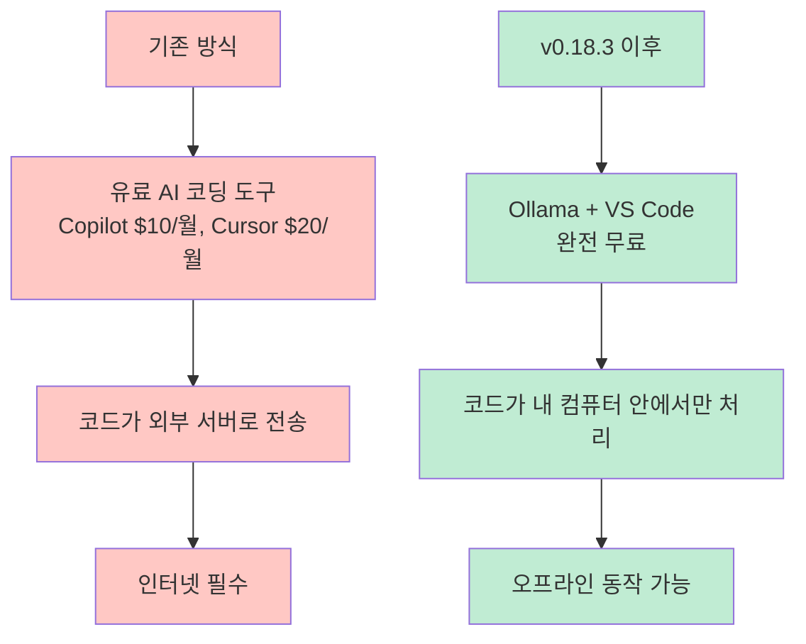
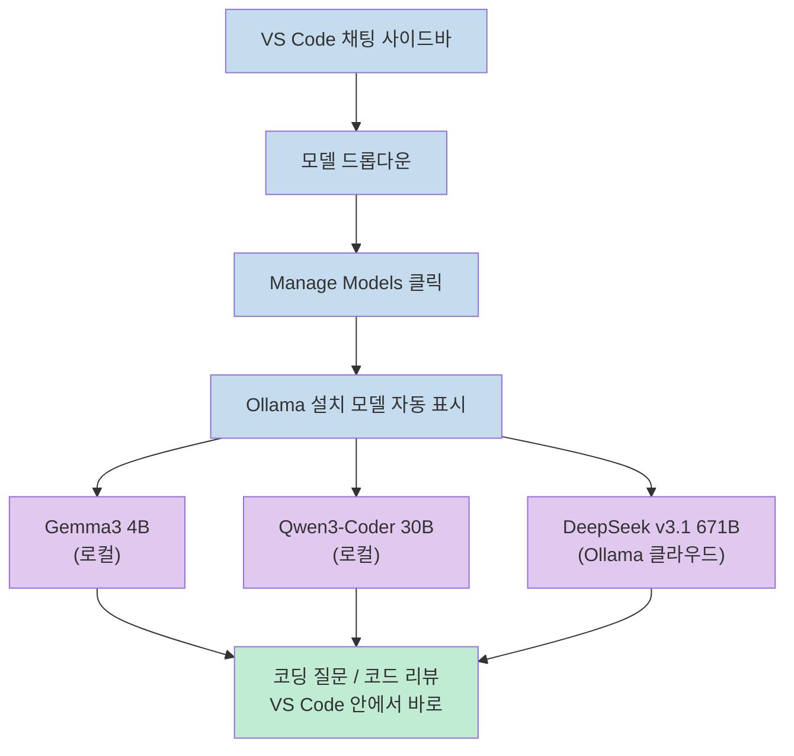
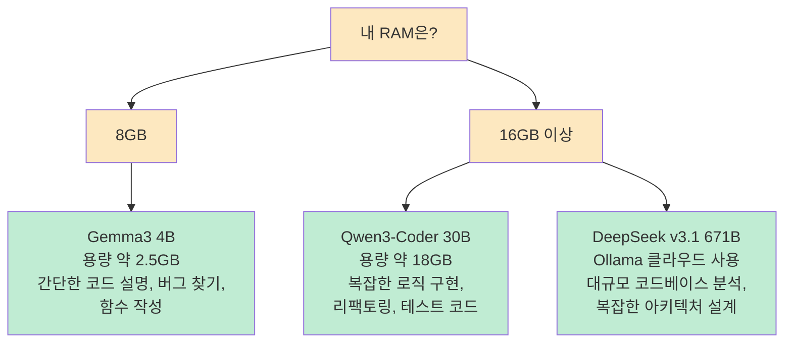
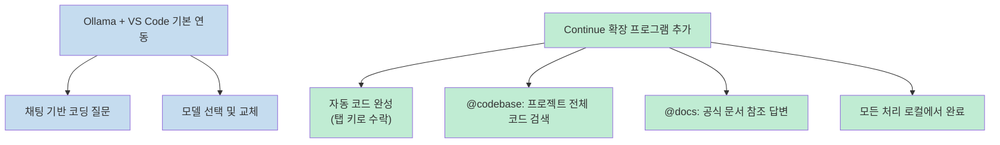

GitHub Copilot은 월 10달러, Cursor Pro는 월 20달러입니다. **Ollama v0.18.3**은 같은 일을 내 컴퓨터에서, VS Code 안에서, 구독료 0원으로 합니다.<br>
`ollama launch vscode` 명령어 한 줄이면 채팅 사이드바에서 Qwen3-Coder, DeepSeek, Gemma3 같은 오픈소스 모델을 바로 쓸 수 있습니다. 코드는 외부 서버로 나가지 않고, 인터넷이 끊겨도 동작합니다.

<!--more-->

## Sources

- https://managerkim.com/news/2026-03-26-ollama-0-18-3-vscode-free-ai-coding-local

---

## Ollama란 무엇인가

Ollama는 세계에서 가장 많이 쓰이는 **로컬 AI 실행 도구**입니다. LLM 모델을 내 컴퓨터에서 직접 실행할 수 있게 해줍니다.

| 지표 | 수치 |
|------|------|
| GitHub 스타 | 166,000개 |
| 월간 다운로드 | 5,200만 회 (2026년 1분기) |
| 연동 앱/서비스 | 40,000개 이상 (Claude Code, n8n, LangChain 등) |
| 가격 | 완전 무료 (오픈소스) |

기존에는 Ollama를 쓰려면 터미널에서 직접 대화해야 했습니다. 코딩 중에 터미널로 왔다 갔다 하는 것은 불편합니다. **v0.18.3부터는 VS Code 안에서 바로 Ollama 모델을 사용할 수 있습니다.**



---

## v0.18.3 핵심: VS Code 네이티브 통합

이번 업데이트의 핵심은 VS Code의 기본 모델 관리 기능에 Ollama가 직접 연결된다는 점입니다. 별도 확장 프로그램 없이도 채팅 사이드바에서 Ollama 모델을 선택하고 바로 사용할 수 있습니다.



모델 드롭다운에서 Manage Models를 클릭하면 Ollama에서 내려받은 모델이 자동으로 표시됩니다. 원하는 모델을 체크하면 즉시 사용 가능합니다.

---

## 5분 안에 설정 완료하는 방법

시작하는 방법은 3단계입니다.

### 1단계 — Ollama 설치

Mac/Linux는 터미널에서 한 줄을 실행합니다. Windows는 [ollama.com](https://ollama.com)에서 설치 파일을 받습니다.

```bash
curl -fsSL https://ollama.com/install.sh | sh
```

### 2단계 — AI 모델 다운로드

코딩용 모델을 하나 받아둡니다.

```bash
# 코딩 전문 모델 (30B, 약 18GB 저장공간 필요)
ollama pull qwen3-coder:30b

# 가벼운 범용 모델 (4B, 약 2.5GB 저장공간 필요)
ollama pull gemma3:4b
```

### 3단계 — VS Code에서 연결

```bash
ollama launch vscode
```

이 명령어 한 줄이면 VS Code가 열리면서 Ollama가 자동으로 연결됩니다. 수동으로 연결하려면 **채팅 사이드바 → 모델 드롭다운 → Manage Models → Provider: Ollama**를 선택합니다.


---

## 어떤 모델을 골라야 할까

용도와 RAM 사양에 따라 모델을 선택합니다.



**Gemma3 4B** — Google이 만든 오픈소스 모델. 8GB RAM이면 충분합니다. 입문용으로 가장 적합합니다.<br>
**Qwen3-Coder 30B** — 현재 오픈소스 코딩 모델 중 최상위 성능. 16GB RAM 이상 권장합니다. 복잡한 코드 작업에 적합합니다.<br>
**DeepSeek v3.1 671B** — 내 컴퓨터에서 직접 돌리기엔 너무 크지만, Ollama 클라우드를 통해 사용할 수 있습니다. 대규모 작업에 활용합니다.

---

## KV 캐시 공유: 연속 질문이 빨라지는 원리

v0.18.3의 또 다른 핵심 업데이트입니다. **KV(Key-Value) 캐시 공유**는 AI에게 같은 프로젝트에 대해 연속으로 질문할 때 이전 대화의 맥락을 재활용하는 기능입니다.


> "AI가 처음부터 다시 코드를 읽지 않고 이미 이해한 맥락 위에서 바로 답합니다. Apple Silicon(M1/M2/M3/M4) 맥북에서 특히 효과적입니다."

프로젝트가 클수록 이 성능 차이가 체감상 두드러집니다. 같은 파일에 대한 후속 질문을 반복하는 일반적인 코딩 작업에서 응답 속도가 눈에 띄게 향상됩니다.

---

## 더 강력하게: Continue 확장 프로그램

VS Code 기본 연동으로도 채팅 기반 코딩이 가능하지만, **Continue 확장 프로그램**을 설치하면 자동 코드 완성(탭 키로 제안 수락)까지 사용할 수 있습니다.



Continue 설정 파일 예시입니다.

```json
{
  "models": [{
    "title": "Qwen3-Coder",
    "provider": "ollama",
    "model": "qwen3-coder:30b"
  }],
  "tabAutocompleteModel": {
    "title": "코드 자동 완성",
    "provider": "ollama",
    "model": "gemma3:4b"
  }
}
```

채팅(고품질 응답)과 자동 완성(빠른 응답)에 서로 다른 모델을 할당할 수 있습니다. 무거운 모델은 채팅에, 가벼운 모델은 실시간 자동 완성에 쓰는 방식이 실용적입니다.

---

## 핵심 요약

| 항목 | 내용 |
|------|------|
| **업데이트** | Ollama v0.18.3 — VS Code 네이티브 통합 |
| **핵심 명령어** | `ollama launch vscode` |
| **지원 모델** | Gemma3 4B, Qwen3-Coder 30B, DeepSeek v3.1 671B 등 |
| **최소 사양** | 8GB RAM (Gemma3 4B) / 16GB+ (Qwen3-Coder 30B) |
| **주요 신기능** | KV 캐시 공유 — 연속 질문 시 응답 속도 향상, Apple Silicon 특히 효과적 |
| **비용** | 완전 무료 |
| **보안** | 코드가 외부 서버로 나가지 않음, 오프라인 동작 가능 |
| **확장 옵션** | Continue 확장으로 자동 코드 완성, @codebase, @docs 지원 |

---

## 결론

Ollama v0.18.3은 "로컬 AI = 터미널만 가능"이라는 고정관념을 깼습니다.<br>
VS Code 채팅 사이드바에서 클릭 한 번으로 모델을 선택하고, `ollama launch vscode` 한 줄로 설정이 끝나는 경험은 유료 AI 코딩 도구와 실질적으로 차이가 없습니다.<br>
회사 코드 보안이 걱정되거나, AI 도구 구독료를 줄이고 싶거나, 오프라인 환경에서 코딩해야 한다면 — 지금 바로 시작해볼 수 있습니다.
