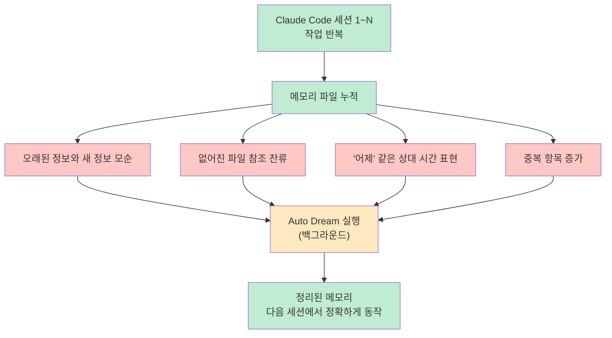
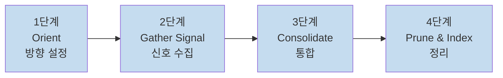
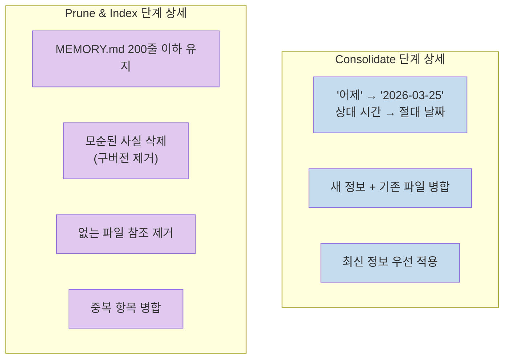
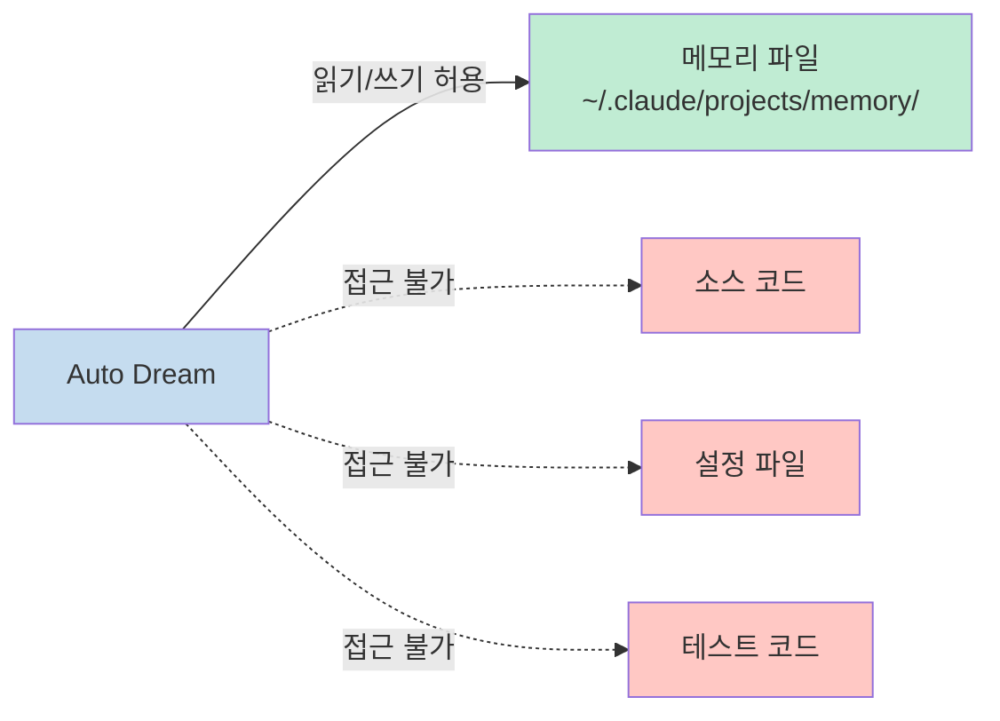
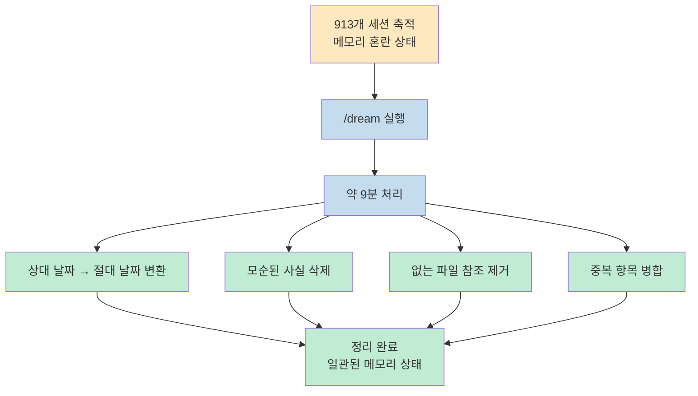
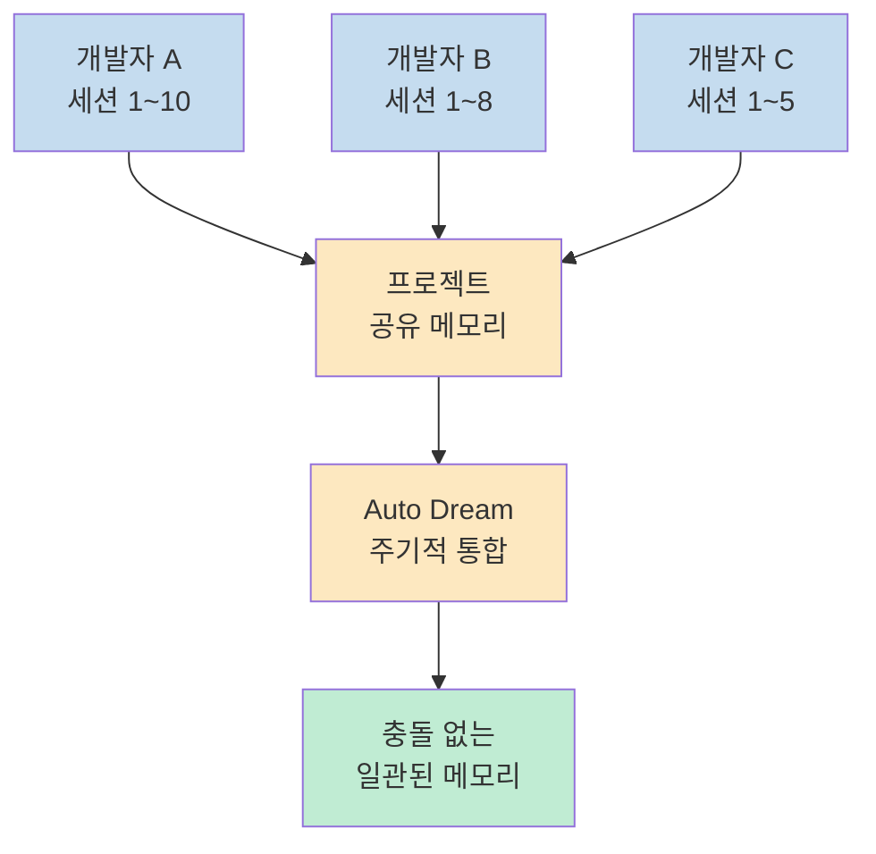
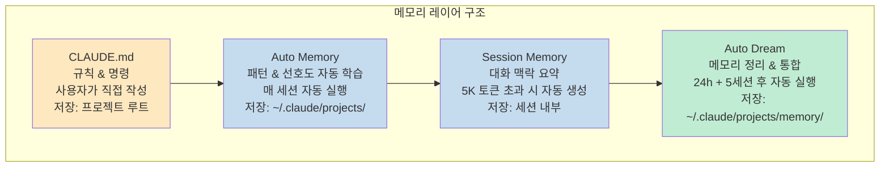

Claude Code를 오래 쓰다 보면 메모리 파일이 뒤죽박죽이 됩니다. 오래된 메모와 새 메모가 모순되고, 없어진 파일을 가리키는 참조가 남아 있고, "어제"처럼 시간이 지나면 의미가 달라지는 표현도 그대로 남습니다. **Auto Dream**은 이 문제를 사람의 손 없이 자동으로 해결하는 Claude Code 내장 기능입니다.<br>
바이브 코딩 중 우연히 발견된 이 기능은 Ray Amjad 채널에서 조회수 8.2만을 기록하며 빠르게 알려졌습니다. `/memory` 설정 한 번이면 됩니다.

<!--more-->

## Sources

- https://www.gpters.org/news/post/claude-code-auto-dream-K38qKem9aNCisDn

---

## Auto Dream이란

**Claude Code Auto Dream**은 세션 사이사이에 Claude Code의 메모리 파일을 자동으로 정리·병합·삭제하는 **백그라운드 메모리 통합 기능**입니다.

이름의 비유가 정확합니다. 사람의 REM 수면이 낮 동안 쌓인 기억을 정리하고 불필요한 것을 지우듯, Auto Dream은 세션과 세션 사이에 Claude의 메모리를 깨끗하게 유지합니다.



---

## 4단계 정리 프로세스

Auto Dream은 실행될 때 다음 4단계를 순서대로 수행합니다.



### 1단계 — Orient (방향 설정)

현재 메모리 디렉토리의 상태를 파악합니다. MEMORY.md 인덱스를 읽고 어떤 파일이 있는지, 어떤 상태인지 전체를 파악하는 단계입니다.

### 2단계 — Gather Signal (신호 수집)

세션 기록을 분석해 **사용자 수정사항**, **반복 패턴**, **중요 결정**을 추출합니다. 단순히 기록을 읽는 것이 아니라, 패턴과 우선순위를 파악하는 단계입니다.

### 3단계 — Consolidate (통합)

새로운 정보를 기존 파일에 병합합니다. 이 단계에서 **상대 날짜를 절대 날짜로 변환**하는 작업도 포함됩니다. "어제"는 "2026-03-25"로, "지난주"는 실제 날짜로 바뀝니다. 시간이 지나도 메모리의 의미가 유지됩니다.

### 4단계 — Prune & Index (정리)

MEMORY.md를 **200줄 이하로 유지**하면서 모순·중복을 제거합니다. 더 이상 존재하지 않는 파일을 가리키는 참조도 이 단계에서 삭제됩니다.



---

## 안전성: 코드는 절대 건드리지 않는다

Auto Dream이 작동하는 동안 **프로젝트 소스 코드, 설정 파일, 테스트 코드는 절대 수정하지 않습니다.** 오직 메모리 파일만 읽고 쓸 수 있는 범위에서 동작합니다.

동시 실행 문제도 락(lock) 파일로 방지합니다. Auto Dream이 실행 중일 때 다른 세션에서 같은 메모리에 접근하더라도 충돌이 발생하지 않습니다. 백그라운드 실행이기 때문에 Auto Dream이 돌아가는 동안 다른 Claude Code 세션에서 작업을 계속할 수 있습니다.



---

## 활성화 방법

설정은 3단계로 끝납니다.


```bash
# Claude Code 터미널에서
/memory
# → auto-dream 항목을 on으로 변경
```

**자동 실행 조건**: 24시간 경과 **AND** 5세션 이상 진행 — 두 조건이 모두 충족되어야 백그라운드에서 자동 실행됩니다.

**즉시 실행**: 조건을 기다리지 않고 지금 당장 메모리를 정리하고 싶다면 `/dream`을 직접 입력합니다.

```bash
/dream
# → 즉시 메모리 통합 시작
```

---

## 실전 활용 시나리오

### 시나리오 1 — 대규모 프로젝트의 메모리 부채 청산

20세션 이상 작업한 프로젝트라면 메모리가 누적되어 일관성이 깨져 있을 가능성이 높습니다. `/dream`을 한 번 실행하면 전체를 정리할 수 있습니다.

실제 관찰된 사례: **913개 세션의 메모리를 약 9분 만에 통합**했습니다.



### 시나리오 2 — 팀 프로젝트의 메모리 충돌 방지

여러 사람이 같은 프로젝트에서 Claude Code를 각자 사용하면, 각 세션에서 쌓인 메모리가 서로 다른 내용을 가리키며 충돌할 수 있습니다. Auto Dream은 이 상황에서 **프로젝트 메모리의 일관성을 자동으로 유지**합니다.



---

## Claude Code 4가지 메모리 시스템 전체 구조

Auto Dream은 Claude Code 메모리 아키텍처의 네 번째 레이어입니다. 전체 구조를 이해하면 각 레이어를 더 효과적으로 활용할 수 있습니다.



| 시스템 | 역할 | 실행 시점 | 저장 위치 |
|--------|------|-----------|-----------|
| **CLAUDE.md** | 규칙·명령 (사용자 직접 작성) | 수동 편집 | 프로젝트 루트 |
| **Auto Memory** | 패턴·선호도 학습 | 매 세션 자동 | `~/.claude/projects/` |
| **Session Memory** | 대화 맥락 요약 | 5K 토큰 초과 시 | 세션 내부 |
| **Auto Dream** | 메모리 정리·통합 | 24h + 5세션 후 | `~/.claude/projects/memory/` |

> "네 가지를 모두 활성화하는 것이 가장 효과적입니다. CLAUDE.md로 기본 규칙을 설정하고, Auto Memory가 세션별로 학습하고, Session Memory가 긴 대화를 요약하고, Auto Dream이 주기적으로 전체를 정리하는 구조입니다."

**Auto Memory vs Auto Dream 차이**: Auto Memory는 매 세션마다 Claude가 배운 내용을 자동으로 기록하는 "노트 필기"입니다. Auto Dream은 그 기록들이 쌓여 어지러워졌을 때 주기적으로 정리하는 "노트 정리"입니다. 둘은 역할이 다르며 함께 써야 효과가 극대화됩니다.

---

## 핵심 요약

| 항목 | 내용 |
|------|------|
| **기능명** | Claude Code Auto Dream |
| **역할** | 메모리 파일 자동 정리·병합·삭제 (백그라운드) |
| **활성화** | `/memory` → auto-dream: on |
| **즉시 실행** | `/dream` |
| **자동 실행 조건** | 24시간 경과 AND 5세션 이상 |
| **4단계 프로세스** | Orient → Gather Signal → Consolidate → Prune & Index |
| **안전성** | 소스 코드·설정 파일 절대 미수정, 락 파일로 동시 실행 방지 |
| **비용** | Claude Code 내장 무료 기능 |
| **실사용 사례** | 913개 세션 메모리를 9분에 통합 |

---

## 결론

Auto Dream은 Claude Code를 장기 프로젝트나 팀 환경에서 쓸 때 반드시 켜두어야 할 기능입니다.<br>
메모리가 쌓일수록 Claude의 응답이 일관성을 잃는다면, 그건 도구의 한계가 아니라 메모리 관리가 안 된 탓일 가능성이 높습니다.<br>
`/memory`에서 auto-dream을 켜는 데 10초도 걸리지 않습니다. 오래된 프로젝트라면 지금 당장 `/dream`을 실행해 한 번 정리해보세요.
