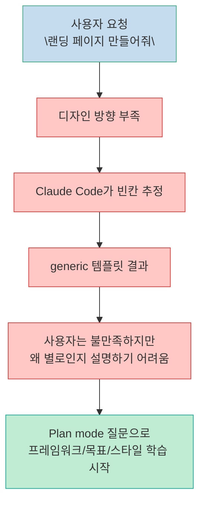
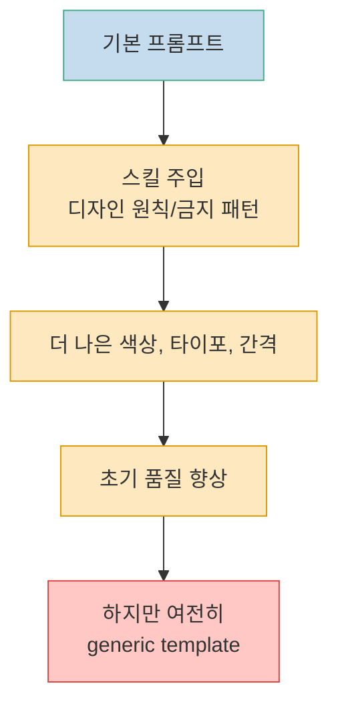
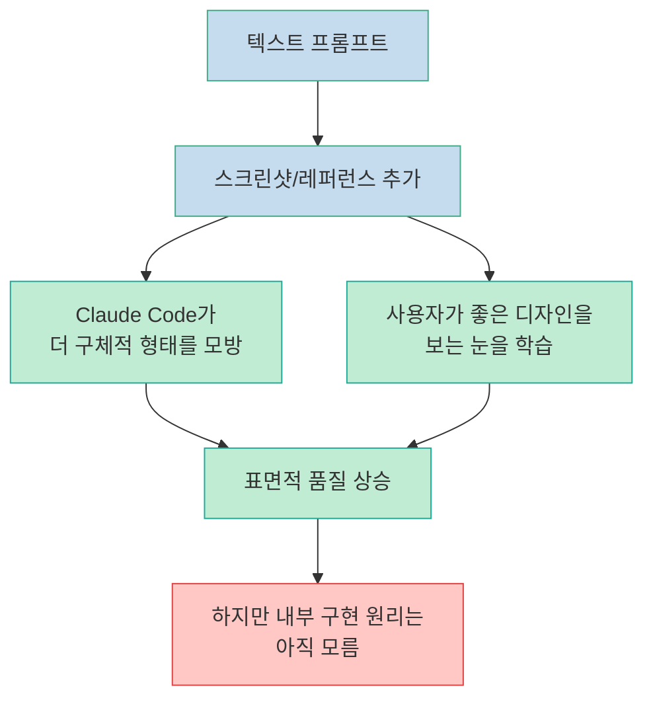
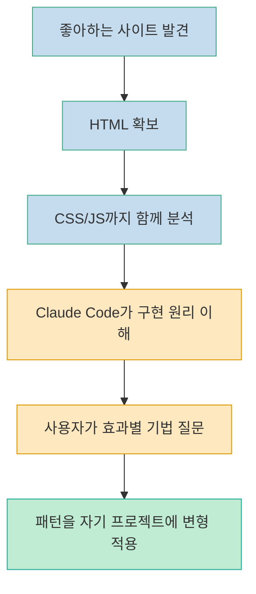
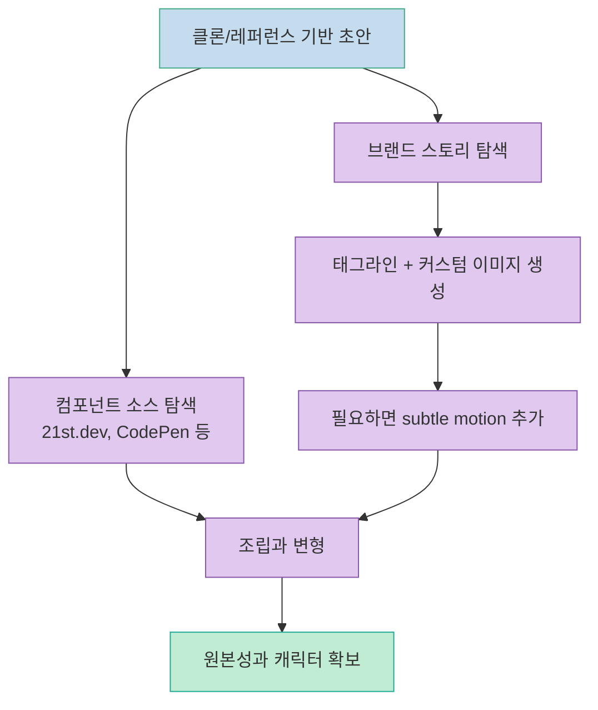
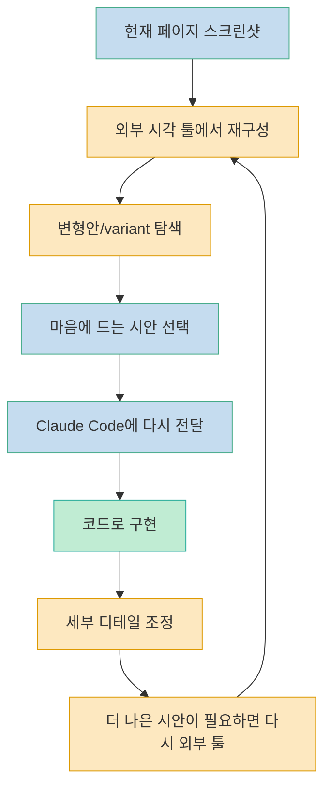

Claude Code로 랜딩 페이지를 만들면 종종 결과물이 비슷해집니다. 영상의 핵심 주장은 단순합니다. 문제는 "Claude Code가 원래 디자인을 못해서" 만이 아니라, 사용자가 자신의 취향과 의도를 충분히 전달하지 못하기 때문에 결과가 generic해진다는 것입니다. 발표자는 이를 해결하기 위한 학습 경로를 7단계로 나눠 설명하며, 각 단계에서 무엇을 기대할 수 있고 어디서 막히는지, 그리고 다음 단계로 어떻게 넘어가야 하는지를 순서대로 보여줍니다. [오프닝 요약](https://youtu.be/1PXFAFMgdns?t=9), [문제 정의](https://youtu.be/1PXFAFMgdns?t=82)

이 글은 그 7단계를 그대로 번역하지 않고, 실제로 Claude Code를 쓰는 개발자 관점에서 다시 구조화한 정리입니다. 핵심은 세 가지입니다. 첫째, 텍스트 프롬프트만으로는 한계가 빠르게 온다는 점, 둘째, 좋은 결과는 스킬과 레퍼런스, 코드 해체, 반복 편집의 누적으로 나온다는 점, 셋째, "AI가 알아서 예쁘게 만들어주길 기대하는 상태" 에서 "내가 비주얼 디렉터로서 AI를 조종하는 상태" 로 역할을 바꿔야 한다는 점입니다. [로드맵 제시](https://youtu.be/1PXFAFMgdns?t=18), [마무리 메시지](https://youtu.be/1PXFAFMgdns?t=2205)

<!--more-->

## Sources

- https://www.youtube.com/watch?v=1PXFAFMgdns

## 왜 대부분의 Claude Code 결과물이 비슷해지는가

레벨 1은 "나와 프롬프트만 있는 상태" 입니다. 발표자는 `Argus`라는 가상의 소셜 미디어 인텔리전스 SaaS 랜딩 페이지를 예시로 들며, 단순히 "이 앱의 랜딩 페이지를 만들어줘" 같은 요청만으로는 결국 방향성이 없는 결과가 나온다고 설명합니다. 이유는 모델이 미적 판단을 대신해주지 못해서이기도 하지만, 더 직접적으로는 사용자가 무엇이 좋은 결과인지, 무엇을 원하는지, 어떤 프레임워크와 어떤 스타일이 적합한지 충분히 설명하지 못하기 때문입니다. [레벨 1 시작](https://youtu.be/1PXFAFMgdns?t=52), [generic 결과 설명](https://youtu.be/1PXFAFMgdns?t=72), [taste 문제](https://youtu.be/1PXFAFMgdns?t=82)

이 단계에서 얻을 수 있는 실질적인 이득은 결과물 자체보다 질문입니다. Plan mode가 프레임워크, 텍스트 스택, 목표 행동, 스타일 같은 질문을 던지기 시작하면, 사용자는 그 질문에 답하는 과정에서 디자인 어휘를 조금씩 학습합니다. 즉 레벨 1은 좋은 결과를 생산하는 단계라기보다, 자신이 무엇을 모르는지 드러나는 단계에 가깝습니다. [질문을 통한 학습](https://youtu.be/1PXFAFMgdns?t=110), [goal과 style 질문](https://youtu.be/1PXFAFMgdns?t=135)

## 레벨 2: 스킬로 Claude Code에 디자인 교육을 주기

레벨 2의 변화는 단순합니다. 프롬프트만 던지던 상태에서, 프론트엔드 디자인 전용 스킬이나 UI/UX 스킬을 같이 투입합니다. 영상에서는 `front-end design skill`, `UIUX Pro Max skill` 같은 예시를 들며, 이런 스킬이 실질적으로는 체크리스트 성격의 텍스트 프롬프트 집합이라고 설명합니다. 이 프롬프트들은 특정 산업군 웹페이지에서 볼 요소, 피해야 할 AI 슬롭 패턴, 색상과 타이포그래피에 대한 기본 규칙을 Claude Code 컨텍스트에 주입합니다. [레벨 2 진입](https://youtu.be/1PXFAFMgdns?t=264), [스킬 설명](https://youtu.be/1PXFAFMgdns?t=277), [체크리스트 역할](https://youtu.be/1PXFAFMgdns?t=312)

이 방식은 분명 개선을 만듭니다. 발표자의 예시에서도 배경, 버튼 글로우, 섹션별 색상 변화 같은 요소가 들어오면서 결과물이 훨씬 덜 초라해집니다. 하지만 본질적 한계도 같이 드러납니다. 보기 좋은 AI 템플릿이 될 뿐, 여전히 템플릿 느낌을 벗어나지 못한다는 점입니다. 즉 스킬은 Claude Code의 기본값을 끌어올리는 데는 유효하지만, 차별화된 결과를 직접 만들어주지는 못합니다. [개선된 결과](https://youtu.be/1PXFAFMgdns?t=370), [여전히 AI 템플릿](https://youtu.be/1PXFAFMgdns?t=397)

## 레벨 3: 텍스트에서 비주얼 디렉션으로 넘어가기

발표자가 레벨 3을 "visual director" 라고 부르는 이유는 명확합니다. 이제는 말로만 설명하지 않고, 스크린샷과 실제 레퍼런스를 보여주기 시작하기 때문입니다. 텍스트 프롬프트만으로는 시각 문제를 완전히 전달할 수 없고, 사용자의 디자인 어휘도 부족하기 때문에 손실이 생깁니다. 그래서 다음 단계는 "show, don't tell" 입니다. 마음에 드는 사이트를 찾아 스크린샷을 찍고, Claude Code에게 "이런 톤과 이런 구성으로 가고 싶다" 를 이미지 자체로 전달하는 것입니다. [레벨 3 전환](https://youtu.be/1PXFAFMgdns?t=456), [visual director 정의](https://youtu.be/1PXFAFMgdns?t=474), [이미지 활용의 이유](https://youtu.be/1PXFAFMgdns?t=489)

여기서 중요한 변화는 단순히 모델이 이미지를 잘 따라 하게 되는 것이 아닙니다. 사용자가 더 많은 레퍼런스를 보게 된다는 점이 더 큽니다. 발표자는 OpenHands 사이트를 예시로 들며, 스크린샷을 여러 장 넣으면 Claude Code가 더 구체적인 비주얼 힌트를 얻고, 동시에 사용자는 "좋은 결과가 무엇인지" 를 보는 눈을 훈련하게 된다고 설명합니다. 다만 이 단계도 한계가 있습니다. 스크린샷은 표면적인 형태는 전달하지만, 그 결과를 만든 구조와 CSS/JS 메커니즘까지는 전달하지 못합니다. [스크린샷 예시](https://youtu.be/1PXFAFMgdns?t=559), [여러 레퍼런스 결합](https://youtu.be/1PXFAFMgdns?t=618), [시각 예시만으로는 부족](https://youtu.be/1PXFAFMgdns?t=717)

## 레벨 4: 스크린샷이 아니라 HTML/CSS/JS를 해체해서 배우기

레벨 4는 이 영상에서 가장 실전적인 구간입니다. 발표자는 이를 "cloner" 단계라고 부르지만, 목적은 표절이 아니라 해체 학습입니다. 마음에 드는 사이트를 찾은 뒤 `view-source` 등으로 HTML을 확보하고, 연결된 CSS와 JavaScript까지 Claude Code가 읽게 만들어 그 사이트가 실제로 어떤 구조와 효과로 만들어졌는지 분석하게 합니다. 발표자는 프론트엔드 디자인을 크게 HTML은 뼈대, CSS는 옷, JavaScript는 근육에 비유합니다. [레벨 4 진입](https://youtu.be/1PXFAFMgdns?t=757), [표절이 아니라 해체 학습](https://youtu.be/1PXFAFMgdns?t=779), [HTML/CSS/JS 비유](https://youtu.be/1PXFAFMgdns?t=821)

이 단계의 핵심은 Claude Code를 단순 생성기가 아니라 해설자로 바꾸는 데 있습니다. 스크린샷만 줄 때는 "비슷하게 보여줘" 수준이지만, 실제 소스와 스타일 파일, 스크립트까지 읽히면 이제 "이 배경 효과는 어떻게 만든 거야?", "이 스크롤 애니메이션은 무슨 기법이야?" 같은 질문이 가능해집니다. 발표자는 web fetch가 큰 CSS/JS를 요약해버리기 때문에, 필요한 경우 더 많은 파일 내용을 직접 가져오게 하는 스킬을 쓴다고 설명합니다. 핵심은 요약본이 아니라 원리에 접근하는 것입니다. [HTML과 CSS/JS 함께 제공](https://youtu.be/1PXFAFMgdns?t=917), [web fetch 한계](https://youtu.be/1PXFAFMgdns?t=929), [질문 가능한 상태로 전환](https://youtu.be/1PXFAFMgdns?t=1018)

이 접근의 장점은 두 가지입니다. 첫째, 결과물이 원본에 더 가까워집니다. 둘째, 더 중요하게는 사용자가 효과와 구현 사이의 대응 관계를 학습하게 됩니다. 발표자는 이를 통해 `clone ceiling`, 즉 "따라 하기는 가능한데 창작은 못 하는 상태" 를 넘어서야 한다고 말합니다. 그래서 레벨 4의 진짜 목표는 복제가 아니라, 복제를 발판으로 기법을 자기 언어로 번역하는 것입니다. [원본에 더 가까운 결과](https://youtu.be/1PXFAFMgdns?t=1110), [clone ceiling 경고](https://youtu.be/1PXFAFMgdns?t=1094), [적응 능력 필요](https://youtu.be/1PXFAFMgdns?t=1084)

## 레벨 5: 오리지널 요소를 집어넣어 "내 것" 으로 만들기

레벨 5부터는 복제 중심 사고에서 벗어나기 시작합니다. 발표자는 여기서부터 컴포넌트와 커스텀 자산을 활용해 자기만의 개성을 넣어야 한다고 말합니다. `21st.dev`, `CodePen` 같은 곳에서 버튼, 캐러셀, 메뉴, 인터랙션 컴포넌트를 가져와 조합할 수도 있고, 직접 변형해 쓸 수도 있습니다. 즉 거대한 전체 레이아웃을 베끼는 대신, 미시적인 부품 수준에서 좋은 조각을 흡수하는 방식입니다. [레벨 5 진입](https://youtu.be/1PXFAFMgdns?t=1185), [컴포넌트 소스 예시](https://youtu.be/1PXFAFMgdns?t=1199), [21st.dev 활용](https://youtu.be/1PXFAFMgdns?t=1211)

하지만 발표자가 더 강조하는 것은 커스텀 비주얼입니다. Argus 예시에서 그는 Pinterest에서 영감을 찾고, 앱의 컨셉인 "남들보다 먼저 본다" 를 신화적 존재 Argus와 연결해 `"See what's next"` 라는 태그라인과 맞물리는 히어로 이미지를 생성합니다. 이 이미지는 단순 장식이 아니라, 앱이 전달하려는 이야기를 화면의 첫인상으로 압축한 시각적 장치입니다. 여기서 Claude Code의 역할은 단독 제작자가 아니라, 시각적 스토리텔링 아이디어를 함께 탐색하는 협업 파트너에 가깝습니다. [비주얼 스토리텔링 도입](https://youtu.be/1PXFAFMgdns?t=1337), [태그라인 설명](https://youtu.be/1PXFAFMgdns?t=1350), [이미지 생성 과정](https://youtu.be/1PXFAFMgdns?t=1392)

또 하나 흥미로운 포인트는 motion입니다. 발표자는 정적인 배경 이미지 대신 미세한 움직임이 있는 비디오 배경을 쓰되, 과도한 모션은 피하고 모바일에서는 정지 이미지를 대체 로드하라고 권합니다. 이는 멋진 연출보다 경험 제어가 우선이라는 뜻입니다. 원본성은 화려함이 아니라 일관된 캐릭터와 적절한 제약에서 나온다는 점을 잘 보여줍니다. [영상 배경과 subtle motion](https://youtu.be/1PXFAFMgdns?t=1529), [15초 루프 설명](https://youtu.be/1PXFAFMgdns?t=1555), [모바일 대체 이미지](https://youtu.be/1PXFAFMgdns?t=1591)

## 레벨 6: Stitch, Figma 같은 외부 툴로 반복 편집하기

레벨 6의 핵심은 Claude Code 바깥으로 일부 작업을 꺼내는 것입니다. 발표자는 터미널 안에서 텍스트로만 시각 문제를 다루는 데는 계속 마찰이 있다고 말합니다. 그래서 `paper.design`, `Stitch`, `Figma`, `pencil.dev` 같은 외부 도구를 써서 시각 캔버스 위에서 재구성하고, 그 결과를 다시 Claude Code에 피드백으로 넣는 루프를 만듭니다. [레벨 6 진입](https://youtu.be/1PXFAFMgdns?t=1683), [외부 툴 목록](https://youtu.be/1PXFAFMgdns?t=1695), [Stitch 예시](https://youtu.be/1PXFAFMgdns?t=1712)

영상에서의 실제 워크플로는 꽤 명확합니다. 먼저 현재 페이지 스크린샷을 Stitch에 넣고, 마음에 드는 히어로는 유지하되 하단 영역을 재디자인해보라고 요청합니다. 그렇게 생성된 glassmorphism 스타일 시안을 다시 Claude Code에 가져와 "이 방향을 어떻게 생각해?" 라고 물으며 구현으로 변환합니다. 즉 외부 툴은 최종 코드의 출처가 아니라, 빠른 시각 탐색과 방향 수정의 매개체입니다. [스크린샷 기반 재디자인](https://youtu.be/1PXFAFMgdns?t=1723), [변형 시안 생성](https://youtu.be/1PXFAFMgdns?t=1750), [다시 Claude Code로 회수](https://youtu.be/1PXFAFMgdns?t=1772)

이 단계에서 발표자가 강조하는 것은 "작은 것들" 입니다. 로딩 텍스트의 지연, 폰트 변경, 티커, 섹션 사이 경계 처리, 카드의 깊이감, 카운터 애니메이션, 하이라이트 움직임처럼 사용자가 의식적으로 보지 않아도 전체 인상을 바꾸는 디테일이 쌓일수록 결과물이 premium하게 느껴집니다. 레벨 6은 사실상 이런 작은 디테일을 반복적으로 추가하고 제거하면서 coherence를 만드는 단계라고 보는 편이 맞습니다. [20분 tinkering 결과](https://youtu.be/1PXFAFMgdns?t=1832), [폰트와 타이포그래피 중요성](https://youtu.be/1PXFAFMgdns?t=1853), [작은 디테일 누적 효과](https://youtu.be/1PXFAFMgdns?t=1932)

## 레벨 7: WebGL, 셰이더, 3D 경험은 아직 프런티어다

레벨 7은 일종의 경계선으로 제시됩니다. 발표자는 2026년 3월 시점 기준으로, 커스텀 WebGL, 셰이더, 3D 인터랙션, 거의 게임에 가까운 웹 경험은 아직 대부분의 사용자가 Claude Code만으로 다루기 어려운 영역이라고 봅니다. 이런 사이트들은 단순히 HTML/CSS를 읽어 복제할 수 있는 수준이 아니라, 디자이너와 엔지니어가 긴 시간 공들여 만든 작품에 가깝다는 것입니다. [레벨 7 소개](https://youtu.be/1PXFAFMgdns?t=2077), [2026년 3월 시점 한계](https://youtu.be/1PXFAFMgdns?t=2100), [WebGL/셰이더 언급](https://youtu.be/1PXFAFMgdns?t=2107)

이 구간은 "지금 당장 이걸 해라" 보다는 "어디까지가 현재의 경계인지 알아라" 에 가깝습니다. 즉 레벨 7의 효용은 실전 체크리스트가 아니라 기대치 조정입니다. 복잡한 인터랙티브 아트 사이트를 보고 내 결과물이 그만큼 안 나온다고 실망하기보다, 오늘 당장 도달 가능한 수준과 아직 사람 주도성이 더 필요한 영역을 구분하라는 이야기로 읽는 것이 맞습니다. [AI로 다루기 어려운 이유](https://youtu.be/1PXFAFMgdns?t=2140), [가능성은 있지만 아직 멀다](https://youtu.be/1PXFAFMgdns?t=2162)

## 실전 적용 포인트

이 영상을 실제 작업 흐름으로 바꾸면 순서는 더 단순합니다. `프롬프트만 던지기` 에서 시작하지 말고, 처음부터 목표 행동과 페이지 목적을 분명히 적고, 가능하면 디자인 스킬을 함께 로드하고, 마음에 드는 레퍼런스 스크린샷을 3개 이상 확보하는 것이 좋습니다. 그 다음 특정 사이트의 구조가 마음에 들면 HTML/CSS/JS를 해체해 질문 가능한 상태를 만들고, 마지막으로 커스텀 이미지나 컴포넌트, 외부 툴을 섞어 반복 편집으로 마감하는 식입니다. [목표와 결과 정의](https://youtu.be/1PXFAFMgdns?t=141), [스킬 활용](https://youtu.be/1PXFAFMgdns?t=264), [해체 학습의 중요성](https://youtu.be/1PXFAFMgdns?t=2221)

중요한 것은 "특별한 스킬 하나" 가 문제를 해결해주지 않는다는 점입니다. 발표자도 마지막에, 좋은 결과는 마법 같은 프롬프트가 아니라 취향을 보는 눈, 해체해서 이해하는 습관, 그리고 반복 수정에서 나온다고 정리합니다. 결국 Claude Code 프론트엔드 디자인의 난점은 AI의 taste 부족만이 아니라, 우리가 아직 그 취향을 충분히 언어화하지 못하는 데서 생깁니다. [특별한 스킬 환상 부정](https://youtu.be/1PXFAFMgdns?t=2249), [taste를 언어화하기 어렵다는 주장](https://youtu.be/1PXFAFMgdns?t=2265), [translation disadvantage 설명](https://youtu.be/1PXFAFMgdns?t=2297)

## 핵심 요약

Claude Code 프론트엔드 디자인의 7단계는 도구 자체의 능력보다 사용자 역할의 변화를 설명하는 프레임에 가깝습니다. 레벨 1과 2에서는 질문과 스킬로 기본기를 만들고, 레벨 3에서는 시각 레퍼런스로 방향을 잡고, 레벨 4에서는 실제 코드를 해체해 원리를 배우며, 레벨 5와 6에서는 오리지널 자산과 외부 툴을 활용해 반복적으로 다듬습니다. 레벨 7은 아직 대다수 사용자에게 프런티어 영역입니다. [전체 진행 구조](https://youtu.be/1PXFAFMgdns?t=2209)

결국 좋은 결과는 Claude Code가 자동으로 생성하는 것이 아니라, 사용자가 무엇을 원하는지 더 잘 보고, 더 잘 분해하고, 더 잘 피드백하는 과정에서 만들어집니다. 이 영상은 "AI가 프론트엔드를 못 만든다" 는 불평보다, "내가 비주얼 디렉터처럼 일하려면 어떤 순서로 학습해야 하는가" 를 더 잘 보여주는 로드맵이라고 볼 수 있습니다. [로드맵의 목적](https://youtu.be/1PXFAFMgdns?t=2306)

## 결론

Claude Code로 프론트엔드 디자인을 개선하는 가장 현실적인 방법은 프롬프트를 더 길게 쓰는 것이 아닙니다. 레퍼런스를 더 많이 보고, 좋은 결과를 해체해 이해하고, 오리지널 요소를 넣고, 외부 시각 도구를 오가며 반복 편집하는 것입니다. 영상의 7단계는 결국 "Claude Code를 디자이너로 기대하지 말고, 내가 디자이너처럼 지시할 수 있는 상태로 성장하라" 는 조언으로 요약됩니다. [최종 정리](https://youtu.be/1PXFAFMgdns?t=2219)
