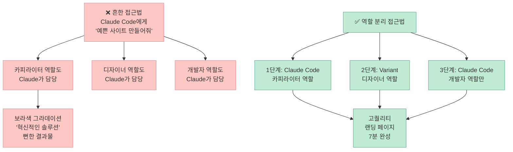
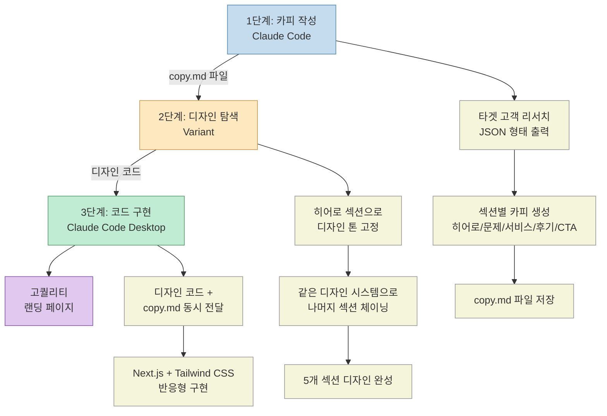
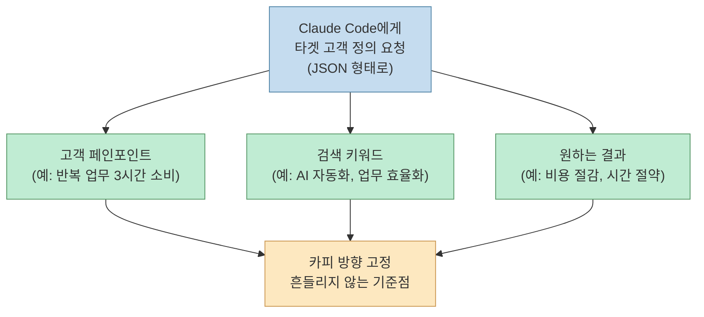
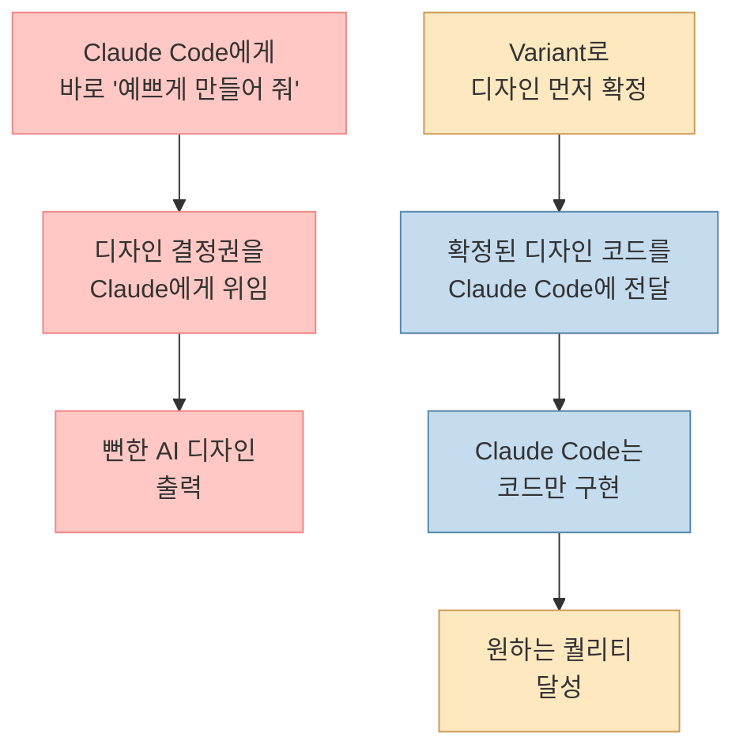
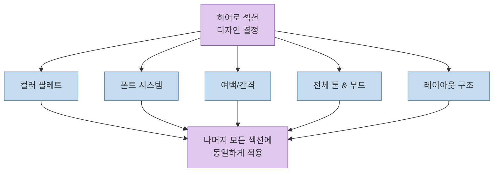
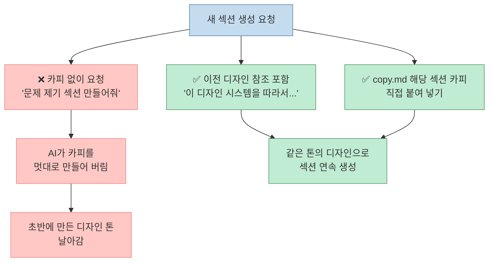
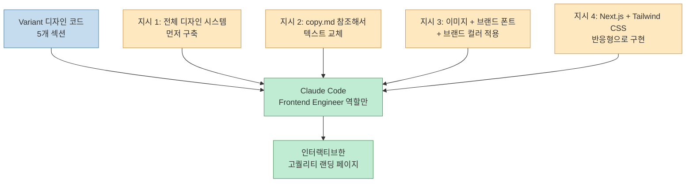
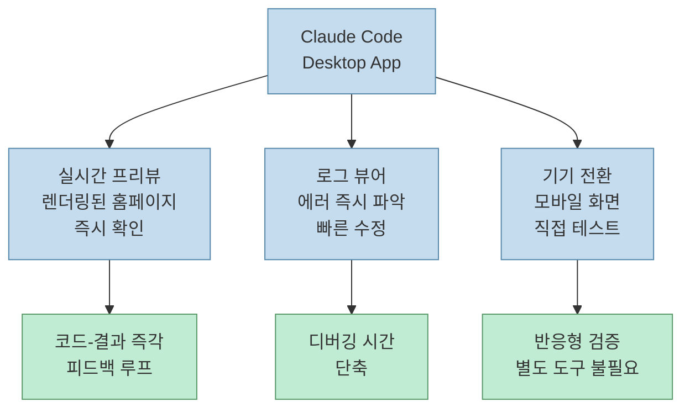

Claude Code에 "예쁜 웹사이트 만들어 줘"라고만 하면 보라색 그라데이션에 "혁신적인 솔루션", "미래를 향한 도전" 같은 문구가 가득한 사이트가 나옵니다. 
AI가 만든 티가 너무 나죠. 
하지만 **같은 Claude Code로도 결과물이 완전히 달라질 수 있습니다.** 비결은 AI에게 한 번에 다 맡기지 않는 것, 즉 **역할 분리**입니다. 
이 글에서는 텐빌더 채널이 공개한 "카피 → 디자인 → 코드" 3단계 워크플로우를 단계별로 해부합니다.

<!--more-->

## Sources

- [클로드 코드로 10분 만에 역대급 디자인의 웹사이트 만드는법 (feat. Variant) — 텐빌더](https://www.youtube.com/watch?v=6iq6CjUJvxc)

---

## 왜 AI로 만든 웹사이트는 다 비슷할까?

Claude Code에게 "랜딩 페이지 만들어 줘"라고 하면 AI는 세 가지 역할을 동시에 수행합니다. 
**카피라이터 + 디자이너 + 개발자** 역할을 한 번에 처리하다 보니, 어느 하나도 제대로 할 수 없는 상황이 만들어집니다.

핵심 원인은 명확합니다. 
**문구(카피)가 정해지지 않은 상태에서 디자인을 하면, 디자인도 흔들리고 코드도 흔들립니다.** 
그 결과 매번 AI 냄새 나는 뻔한 사이트가 나오는 겁니다. [영상 참조](https://youtu.be/6iq6CjUJvxc?t=5)

---

## 3단계 워크플로우 전체 흐름

---

## 1단계: Claude Code로 카피 작성

### 왜 카피가 먼저인가?

> "카피 15분 안 잡고 들어가면 코드 한 시간을 날려 버리게 됩니다." — [영상 참조](https://youtu.be/6iq6CjUJvxc?t=840)

건물로 치면 설계도가 끝난 상태를 만드는 것입니다. 
카피가 먼저 고정되어 있어야 디자인이 흔들리지 않고, 디자인이 고정되어야 코드가 흔들리지 않습니다.

### Step 1-1: 타겟 고객 리서치 (JSON 형태 출력)

Claude Code에게 다음을 요청합니다:
- 이 서비스의 이상적인 고객이 누구인지
- 그 고객이 어떤 문제를 가지고 있는지
- 어떤 키워드로 검색할지

이때 **JSON 형태로 달라고 요청하는 것이 중요합니다.** [영상 참조](https://youtu.be/6iq6CjUJvxc?t=90) 
JSON 형태는 구조화된 형태로 갖춰져 나오기 때문에, 이후 카피 작성을 요청할 때 Claude가 더 잘 인식하고 더 상세한 결과값을 줍니다.

### Step 1-2: 섹션별 카피 생성

리서치 JSON을 기반으로 페이지 구조별 카피를 작성합니다:

| 섹션 | 역할 | 좋은 카피 예시 |
|------|------|---------------|
| 히어로 | 공감 유도 + 핵심 약속 | "매일 3시간 반복 업무에 쓰고 계시죠? → 도입 4주 만에 운영 비용 40% 절감" |
| 문제 제기 | 구체적 수치로 고통 명시 | "CS 문의 하루 평균 127건" |
| 서비스 | 해결책 + 수치 | "광고 세팅 시간 주 12시간 → 2시간" |
| 고객 후기 | 구체적 경험 | "리포트 만드는 월요일이 사라졌습니다" |
| CTA | 허들 낮추기 | "우리 회사에 자동화할 게 있을까? 30분이면 알 수 있습니다" |

> "원칙은 하나예요. 뻔한 말을 구체적인 숫자랑 실제 상황으로 바꿔 주는 겁니다." [영상 참조](https://youtu.be/6iq6CjUJvxc?t=280)

### Step 1-3: copy.md 파일로 저장

생성된 카피를 `copy.md` 마크다운 파일로 저장하도록 Claude에게 요청합니다. 
이 파일이 이후 단계 전체의 **단일 진실 소스(Single Source of Truth)** 가 됩니다.

**AI가 카피를 90%는 정확히 작성하지만, 마지막 10%는 직접 검수가 필요합니다.** [영상 참조](https://youtu.be/6iq6CjUJvxc?t=180) 
수치의 정확성, 브랜드 보이스, 실제 고객 경험 반영 여부를 확인하세요.

---

## 2단계: Variant로 디자인 탐색 및 고정

### Variant란?

[Variant](https://variant.dev)는 텍스트를 넣으면 UI 디자인을 자동으로 만들어 주는 무료 도구입니다. [영상 참조](https://youtu.be/6iq6CjUJvxc?t=320) 
V0(Vercel)와 유사하지만 **디자인 탐색**에 더 특화되어 있습니다. 
스크롤만 내리면 다양한 변형이 계속 생성되고, 마음에 드는 것을 골라 코드로 뽑을 수 있습니다.

Variant가 중요한 이유는 **역할 분리**입니다:

### Step 2-1: Compose 탭에서 히어로 섹션 생성

Variant의 **Compose** 부분에서 `copy.md`의 히어로 카피를 섹션별로 붙여 넣고 원하는 톤을 지정합니다. 
**중요: 첫 섹션(히어로) 하나가 사이트 전체 톤을 결정합니다.** [영상 참조](https://youtu.be/6iq6CjUJvxc?t=470)

히어로 섹션에서 확정해야 하는 요소:

Variant에서는 마음에 들지 않으면 강도(Strength) 조절, 타이틀 스타일 변경, 컬러 리믹스, 레이아웃 셔플 등의 옵션을 제공합니다.

### Step 2-2: "New Chat from Design"으로 섹션 체이닝

히어로 섹션이 마음에 들면, 우측 상단 점 세 개 메뉴에서 **"New Chat from Design"** 버튼을 클릭합니다. [영상 참조](https://youtu.be/6iq6CjUJvxc?t=500) 
이 기능이 핵심입니다: **같은 디자인 시스템을 기반으로 새 섹션을 계속 만들어 갈 수 있습니다.**

각 섹션 생성 시 반드시 지켜야 할 규칙:

이 방식으로 다섯 개 섹션(히어로 → 문제 제기 → 서비스 → 고객 후기 → CTA)을 순서대로 완성합니다.

---

## 3단계: Claude Code로 코드 구현

### Variant에서 Claude Code로 핸드오프

모든 섹션 디자인이 완성되면, Variant 우측에 있는 **"Open in..."** 버튼을 클릭합니다. [영상 참조](https://youtu.be/6iq6CjUJvxc?t=640) 
Cursor, Claude Code, Codex, Antigravity, OpenCode, V0 등 다양한 서비스로 디자인 코드를 넘길 수 있으며, 여기서는 **Claude Code**를 선택합니다.

### Claude Code에 전달하는 프롬프트 구성

5개 섹션의 디자인 코드를 복사해서 Claude Code에 붙여 넣고, 다음 지시를 추가합니다:

**역할 분리의 핵심**은 명확합니다: [영상 참조](https://youtu.be/6iq6CjUJvxc?t=670)

> "베리언트가 크리에이티브 디렉터라고 하면, 클로드 코드는 코드만 짜는 프론트엔드 엔지니어입니다."

Claude Code는 디자인 결정을 내리는 것이 아니라, **이미 확정된 디자인을 코드로 옮기는 일에만 집중**합니다. 
이것이 결과물의 퀄리티가 "바로 만들어 줘" 방식과 완전히 달라지는 이유입니다.

---

## Claude Code Desktop App 활용 팁

웹사이트 개발 시 터미널 CLI 대신 **Claude Code Desktop App**을 사용하는 것을 권장합니다. [영상 참조](https://youtu.be/6iq6CjUJvxc?t=750)

Desktop App이 제공하는 세 가지 핵심 기능:

---

## 핵심 요약

**3단계 워크플로우 요약:**

| 단계 | 도구 | 역할 | 핵심 포인트 |
|------|------|------|-------------|
| 1단계 | Claude Code | 카피라이터 | JSON 형태 타겟 리서치 → 섹션별 카피 → copy.md 저장 |
| 2단계 | Variant | 크리에이티브 디렉터 | 히어로로 톤 고정 → "New Chat from Design"으로 섹션 체이닝 |
| 3단계 | Claude Code Desktop | 프론트엔드 엔지니어 | 디자인 코드 + copy.md 전달 → Next.js/Tailwind 구현 |

**실전 원칙 2가지:** [영상 참조](https://youtu.be/6iq6CjUJvxc?t=840)

1. **카피부터 정리하세요.** 카피 15분 안 잡고 들어가면 코드 한 시간을 날리게 됩니다. 문구가 흔들리면 화면도 흔들립니다.
2. **디자인 톤은 히어로 섹션 하나에서 잠그세요.** 폰트, 색, 밀도를 거기서 정하면 나머지는 같은 걸로 쭉 가면 됩니다. 섹션마다 따로 시키면 페이지가 바로 조각납니다.

**좋은 카피의 원칙:** 뻔한 말을 구체적인 숫자와 실제 상황으로 바꾸는 것입니다.
- ❌ "만족도가 높습니다" → ✅ "리포트 만드는 월요일이 사라졌습니다"
- ❌ "비용이 절감됩니다" → ✅ "도입 4주 만에 운영 비용 40% 절감"
- ❌ "시작하세요" → ✅ "우리 회사에 자동화할 게 있을까? 30분이면 알 수 있습니다"

---

## 결론

AI가 한 번에 모든 것을 처리할 때 생기는 한계는, 역할을 분리함으로써 극복할 수 있습니다. 
**Claude Code = 카피라이터 + 개발자**, **Variant = 디자이너**로 역할을 나누면, 각 도구가 자신의 강점에 집중할 수 있습니다. 
설명을 포함해도 10분이면 충분한 이 워크플로우를, 한 번 직접 따라해 보시길 권합니다.
