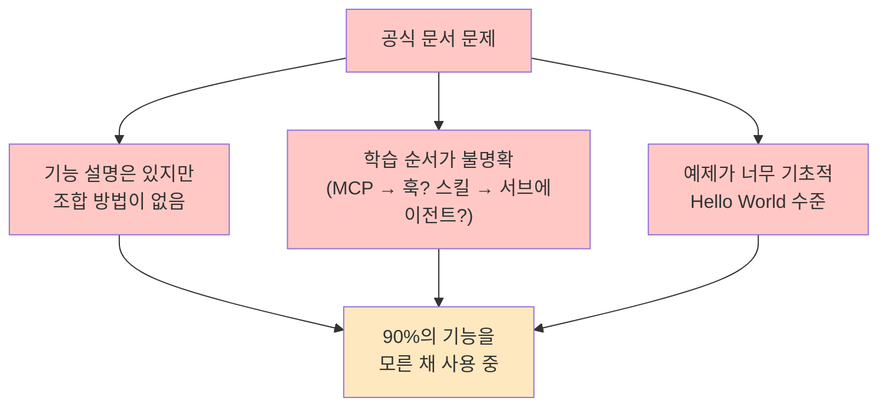
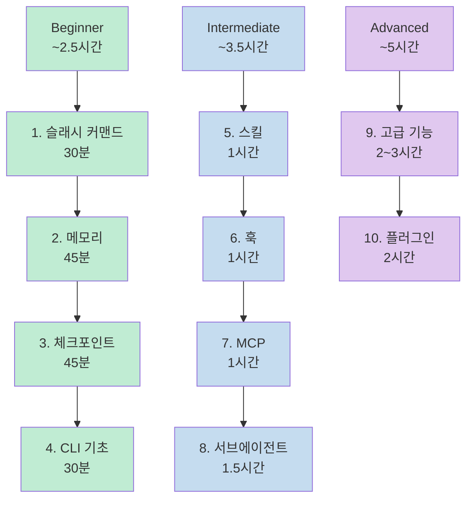
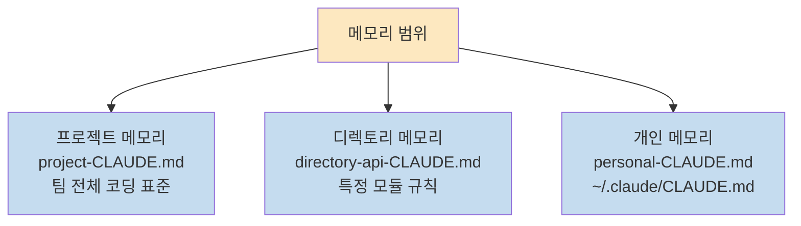
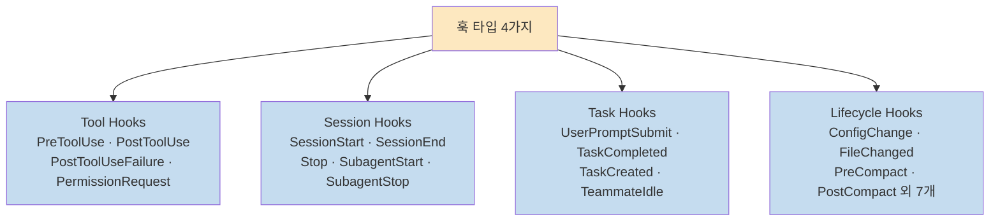
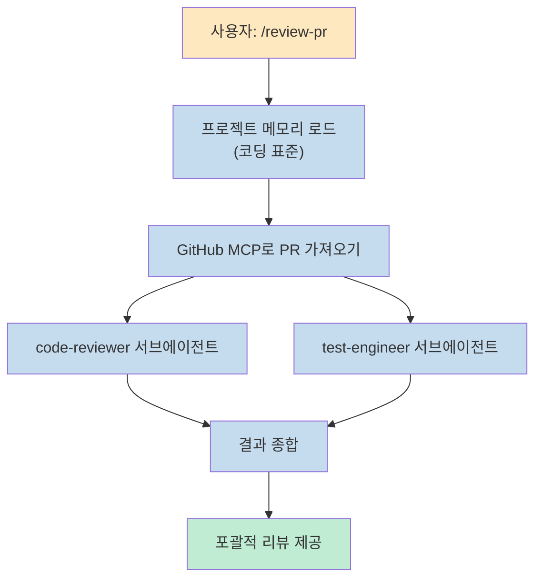
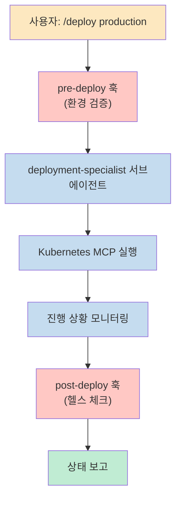

Claude Code를 설치했는데 몇 가지 프롬프트만 써보고 있다면, 실제 기능의 90%를 아직 쓰지 않고 있는 겁니다. **claude-howto**는 슬래시 커맨드에서 시작해 서브에이전트, 훅, MCP, 플러그인까지 체계적으로 익힐 수 있는 오픈소스 학습 가이드입니다.

<!--more-->

## Sources

- https://github.com/luongnv89/claude-howto

---

## 왜 이 가이드가 필요한가

공식 문서는 기능을 설명하지만, **어떻게 조합하는지는 알려주지 않습니다.**



claude-howto는 이 문제를 **10개 모듈의 단계별 학습 경로**와 **즉시 복사해 쓸 수 있는 프로덕션 템플릿**으로 해결합니다.

- GitHub Stars 1,100+, Forks 78
- v2.2.0 (2026년 3월), Claude Code 2.1+ 호환
- MIT 라이선스, 완전 무료

---

## 10개 학습 모듈

전체 경로는 11~13시간이지만, 15분이면 첫 번째 슬래시 커맨드를 프로젝트에 적용할 수 있습니다.



### 1. 슬래시 커맨드 (01-slash-commands/)

Markdown 파일로 만드는 사용자 호출 단축키입니다. `/optimize`, `/pr`, `/generate-api-docs` 같은 커맨드를 `.claude/commands/`에 넣으면 즉시 사용 가능합니다.

```bash
cp 01-slash-commands/*.md /path/to/project/.claude/commands/
# 이후 Claude Code에서 /optimize 입력
```

### 2. 메모리 (02-memory/)

세션을 넘어 유지되는 컨텍스트입니다. 세 가지 범위로 관리합니다.



### 3. 체크포인트 / Rewind (08-checkpoints/)

대화 상태를 스냅샷으로 저장하고 이전 시점으로 되돌립니다. 모든 사용자 프롬프트마다 자동 생성됩니다.

```
/rewind → 5가지 선택:
1. 코드 + 대화 모두 복구
2. 대화만 복구
3. 코드만 복구
4. 여기서부터 요약
5. 취소
```

서로 다른 구현 방식을 A/B 테스트하거나 안전한 실험에 유용합니다.

### 4. 스킬 (03-skills/)

자동 호출되는 재사용 가능 능력 묶음입니다. `code-review/`, `brand-voice/`, `doc-generator/` 예제가 포함됩니다.

### 5. 훅 (06-hooks/)

Claude Code 이벤트에 반응하는 셸 스크립트입니다. **4가지 타입, 25개 이벤트**를 지원합니다.



예제 훅: `format-code.sh`(쓰기 전 자동 포맷), `security-scan.sh`(쓰기 후 보안 스캔), `pre-commit.sh`(커밋 전 테스트), `notify-team.sh`(팀 알림)

```json
{
  "hooks": {
    "PreToolUse": [{"matcher": "Write", "hooks": ["~/.claude/hooks/format-code.sh"]}],
    "PostToolUse": [{"matcher": "Write", "hooks": ["~/.claude/hooks/security-scan.sh"]}]
  }
}
```

### 6. MCP (05-mcp/)

외부 도구·API에 접근하는 Model Context Protocol입니다. GitHub, 데이터베이스, 파일시스템, 복수 MCP 서버 설정 예제가 포함됩니다.

```bash
export GITHUB_TOKEN="your_token"
claude mcp add github -- npx -y @modelcontextprotocol/server-github
```

### 7. 서브에이전트 (04-subagents/)

격리된 컨텍스트에서 동작하는 전문 AI 어시스턴트입니다. `.claude/agents/`에 넣으면 메인 에이전트가 자동으로 위임합니다.

포함 예제: `code-reviewer.md`, `test-engineer.md`, `documentation-writer.md`, `secure-reviewer.md`(읽기 전용), `implementation-agent.md`

### 8. 고급 기능 (09-advanced-features/)

- **Planning Mode** — 코딩 전 상세 구현 계획 생성
- **Extended Thinking** — 복잡한 문제 심층 추론 (`Alt+T` / `Option+T`)
- **Background Tasks** — 블로킹 없이 장시간 작업 실행
- **Permission Modes** — `default`, `acceptEdits`, `plan`, `dontAsk`, `bypassPermissions`
- **Headless Mode** — CI/CD에서 실행: `claude -p "Run tests and generate report"`
- **Session Management** — `/resume`, `/rename`, `/fork`, `claude -c`, `claude -r`

### 9. 플러그인 (07-plugins/)

커맨드·에이전트·MCP·훅을 하나로 묶은 번들입니다.

```bash
/plugin install pr-review
/plugin install devops-automation
/plugin install documentation
```

---

## 기능 비교 한눈에

| 기능 | 호출 방식 | 지속성 | 주 용도 |
|------|-----------|--------|---------|
| **슬래시 커맨드** | 수동 (`/cmd`) | 세션 내 | 빠른 단축키 |
| **메모리** | 자동 로드 | 세션 간 | 장기 학습 |
| **스킬** | 자동 호출 | 파일시스템 | 자동화 워크플로우 |
| **서브에이전트** | 자동 위임 | 격리된 컨텍스트 | 작업 분산 |
| **MCP** | 자동 쿼리 | 실시간 | 라이브 데이터 |
| **훅** | 이벤트 트리거 | 설정 기반 | 자동화·검증 |
| **플러그인** | 한 커맨드 | 전 기능 | 완성된 솔루션 |
| **체크포인트** | 수동·자동 | 세션 기반 | 안전한 실험 |

---

## 실전 워크플로우 예시

### 자동 코드 리뷰



사용 기능: **슬래시 커맨드 + 서브에이전트 + 메모리 + MCP**

### DevOps 배포



사용 기능: **플러그인 + MCP + 훅**

---

## 15분 빠른 시작

```bash
# 1. 클론
git clone https://github.com/luongnv89/claude-howto.git
cd claude-howto

# 2. 첫 번째 슬래시 커맨드 복사
mkdir -p /path/to/your-project/.claude/commands
cp 01-slash-commands/optimize.md /path/to/your-project/.claude/commands/
# → Claude Code에서 /optimize 입력

# 3. 프로젝트 메모리 설정
cp 02-memory/project-CLAUDE.md /path/to/your-project/CLAUDE.md

# 4. 스킬 설치
cp -r 03-skills/code-review ~/.claude/skills/
```

**1시간 필수 설정:**

```bash
cp 01-slash-commands/*.md .claude/commands/       # 슬래시 커맨드 (15분)
cp 02-memory/project-CLAUDE.md ./CLAUDE.md        # 프로젝트 메모리 (15분)
cp -r 03-skills/code-review ~/.claude/skills/     # 스킬 설치 (15분)
# 주말 목표: 훅·서브에이전트·MCP·플러그인 추가
```

---

## /self-assessment 자가 진단

Claude Code에서 직접 실행할 수 있는 자가 진단 기능을 내장하고 있습니다.

```
/self-assessment        # 레벨 진단 → 개인화된 학습 로드맵 생성
/lesson-quiz hooks      # 훅 모듈 이해도 퀴즈
/lesson-quiz memory     # 메모리 모듈 이해도 퀴즈
```

---

## 오프라인 EPUB 생성

전체 가이드를 EPUB 전자책으로 만들 수 있습니다. Mermaid 다이어그램도 렌더링된 상태로 포함됩니다.

```bash
uv run scripts/build_epub.py
# → claude-howto-guide.epub 생성
```

---

## 핵심 요약

| 항목 | 내용 |
|------|------|
| **프로젝트** | luongnv89/claude-howto (1,100+ ★) |
| **버전** | v2.2.0 (2026년 3월), Claude Code 2.1+ |
| **모듈 수** | 10개 모듈 |
| **전체 학습 시간** | 11~13시간 |
| **빠른 시작** | 15분 (첫 슬래시 커맨드 적용) |
| **자가 진단** | `/self-assessment`, `/lesson-quiz [topic]` |
| **오프라인** | EPUB 생성 지원 (`uv run scripts/build_epub.py`) |
| **라이선스** | MIT, 완전 무료 |
| **호환 모델** | Claude Sonnet 4.6 · Opus 4.6 · Haiku 4.5 |

---

## 결론

Claude Code의 공식 문서는 기능을 나열하지만, 실제로 생산성을 높이려면 기능들을 어떻게 엮는지를 알아야 합니다. claude-howto는 그 조합 방법을 10개 모듈과 복사 즉시 쓸 수 있는 템플릿으로 정리한 가이드입니다.<br>
`/self-assessment`로 현재 수준을 확인하고, 부족한 모듈부터 순서대로 채워나가는 방식으로 접근하면 주말 하나로 Claude Code 파워 유저가 될 수 있습니다.
