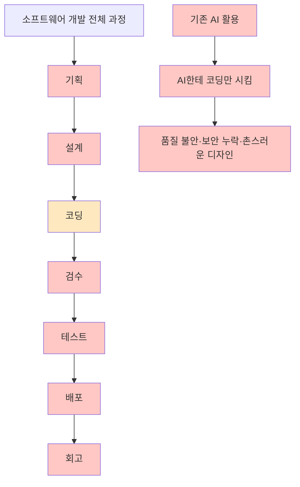
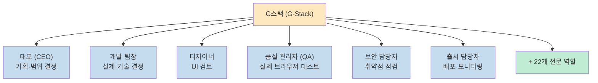
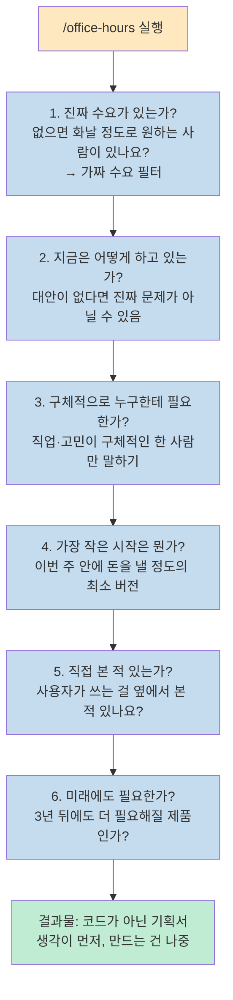
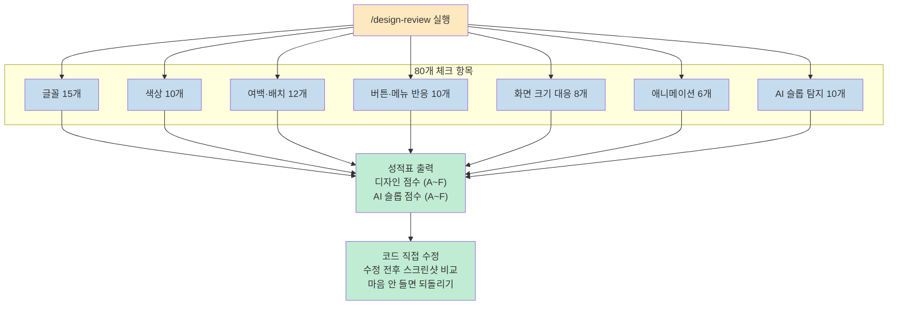
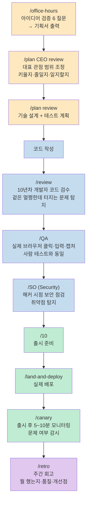
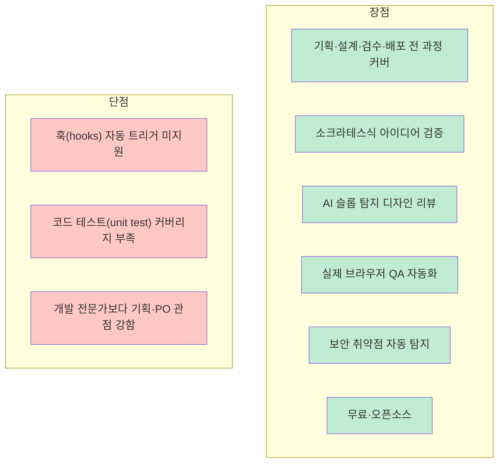

YC 대표 게리탄이 60일 동안 혼자 60만 줄의 코드를 짰습니다. 비결은 코딩 실력이 아닙니다. **AI로 팀을 만들었기 때문입니다.** 그 팀의 이름이 G스택(G-Stack)입니다. GitHub에 올린 지 2주 만에 좋아요 48,000개를 돌파한 이 시스템을 완전히 파헤칩니다.

<!--more-->

## Sources

- https://youtu.be/7ozueqcLWt0?si=R-ApSLM09LiWJ8cy

---

## AI한테 코딩만 시키면 생기는 문제

AI 코딩 도구를 써봤다면 익숙한 상황이 있습니다. 결과물은 나오는데 품질이 의심스럽고, 보안 구멍이 있는지 없는지 모르고, 디자인은 왜 다 비슷비슷하게 촌스럽습니다.

이유는 단순합니다. **AI에게 코딩만 시키기 때문**입니다.



식당에 비유하면 요리사만 있는 셈입니다. 메뉴 기획, 인테리어, 위생 검사, 서빙, 회계 없이 주방만 있는 식당이죠. 게리탄은 이 문제를 **AI에게 역할을 주는 방식**으로 해결했습니다.

---

## G스택이란

G스택은 AI 하나를 28개 전문가 역할의 개발 팀으로 바꿔주는 시스템입니다.



각 역할은 자기 일만 합니다. 대표 역할은 기획만 보고, 디자이너는 디자인만 보고, 품질 관리자는 실제 브라우저를 열어 직접 클릭하며 테스트합니다. 그리고 **앞 사람의 결과물이 다음 사람에게 자동으로 넘어갑니다.**

사용법은 간단합니다. 채팅창에 슬래시 명령어를 입력하면 해당 전문가가 나옵니다.

---

## 오피스 아워 (Office Hours) — 소크라테스식 아이디어 검증

G스택에서 가장 감탄할 기능입니다. `/office-hours`를 실행하면 AI가 코드를 한 줄도 짜기 전에 **날카로운 질문 6개**를 합니다.

보통 AI는 "이거 만들어 줘"라고 하면 바로 만들기 시작합니다. 오피스 아워는 그러지 않습니다. "그거 진짜로 필요한 거 맞아요?"부터 물어봅니다.

### 소크라테스 방법의 현대적 구현

이 방식은 2,500년 된 교육 철학에서 왔습니다. 소크라테스는 답을 주지 않고 질문으로 상대방이 스스로 모순을 발견하게 했습니다. UCLA 로버트 비어크 교수 연구에 따르면, 스스로 질문에 답하려고 애쓴 사람이 설명을 들은 사람보다 장기 기억률이 60% 이상 높습니다. 대학생 74명 실험에서 93%가 소크라테스식 수업을 더 선호했습니다.

G스택은 이 방법을 AI로 구현했습니다.

### 6가지 질문



이 과정에서 AI는 절대 아부하지 않습니다. "좋은 아이디어네요"나 "여러 방법이 있죠" 같은 말이 금지되어 있습니다. 무조건 자기 입장을 잡고 근거를 대고 반박합니다.

실제 예시: 사용자가 "일정 앱을 만들고 싶다"고 하자, AI가 "잠깐요. 당신이 말한 건 알림이 아닙니다. 당신이 실제로 묘사한 건 개인 비서 AI입니다"라고 응답했습니다. 사용자가 스스로도 몰랐던 진짜 제품을 찾아낸 것입니다.

---

## 디자인 리뷰 — AI 슬롭 탐지

AI로 웹사이트를 만들어 본 분이라면 알 겁니다. 보라색 그라데이션 배경, 동그란 아이콘 3개, "Unlock the Power of..." 같은 문구. G스택은 이걸 **AI 슬롭(AI Slop)**이라고 부릅니다.

`/design-review`를 실행하면 AI가 실제 브라우저를 열어 80개 항목을 하나하나 체크합니다.



### AI 슬롭 탐지 10가지

| 번호 | 패턴 |
|------|------|
| 1 | 보라색·남색 그라데이션 배경 |
| 2 | 3열 구성 — 동그란 아이콘 + 굵은 제목 + 2줄 설명 |
| 3 | 색깔 원 안에 아이콘 넣기 |
| 4 | 모든 요소 가운데 정렬 |
| 5 | 모든 모서리 둥글게 |
| 6 | 불필요한 물방울·물결 장식 |
| 7 | 제목에 로켓 이모지 |
| 8 | 카드 왼쪽에 색깔 줄 넣기 |
| 9 | "Welcome to X", "The one solution" 같은 AI 냄새 문구 |
| 10 | 기능·후기·가격·버튼 판에 박힌 순서 |

10가지 중 하나만 걸려도 점수가 깎입니다.

다른 AI 도구(Codex, Gemini, Cursor)가 설치되어 있으면 동시에 리뷰를 시킵니다. 두 AI가 같은 디자인을 각자 보는 **교차 검증**입니다.

---

## 7단계 전체 워크플로우

기획부터 배포 후 회고까지 28개 역할이 하나의 흐름으로 연결됩니다.



앞 사람의 결과물이 다음 사람의 출발점이 됩니다. 이것이 그냥 "AI한테 만들어 줘"와 근본적으로 다른 점입니다.

---

## 설치 및 사용법

**설치 (30초):**

```bash
# G-Stack 다운로드 (GitHub에서 gstack 검색)
# Claude Code + GitHub Actions 필요 (둘 다 무료)
```

**추천 시작 순서:**

```
1. /office-hours    → 아이디어 검증
2. /plan review     → 설계 확정
3. (코드 작성)
4. /review          → 코드 검수
5. /design-review   → 디자인 점검
6. /land-and-deploy → 배포
```

**다중 AI 지원:** Claude Code 외에 Codex, Gemini, Cursor에서도 사용 가능합니다. 설치 시 옵션 하나만 바꾸면 됩니다. 팀이라면 프로젝트 폴더 안에 직접 넣으면 팀 전체가 같은 기준으로 일할 수 있습니다.

---

## 장단점



**가장 잘 맞는 사용자:** 개발자 출신으로 혼자 사업하는 분, 또는 개발자 출신으로 PO·PM 역할을 해야 하는 분. 코딩은 할 줄 아는데 기획·디자인·보안·배포까지 혼자 다 해야 하는 상황에서 빛납니다.

---

## 핵심 요약

| 항목 | 내용 |
|------|------|
| **이름** | G스택 (G-Stack) |
| **만든 사람** | 게리탄 (Garry Tan, YC 대표) |
| **결과** | 60일 · 60만 줄 · 혼자 · GitHub 2주 48,000+ ★ |
| **핵심 개념** | AI에게 역할 부여 → 28개 전문가 팀 |
| **오피스 아워** | 소크라테스식 6 질문 아이디어 검증 → 기획서 출력 |
| **디자인 리뷰** | 80개 항목 체크 + AI 슬롭 탐지 10가지 |
| **워크플로우** | 7단계: 기획 → 설계 → 코딩 → 검수 → QA → 보안 → 배포 → 회고 |
| **지원 도구** | Claude Code · Codex · Gemini · Cursor |
| **비용** | 무료 오픈소스 |

---

## 결론

G스택이 보여주는 핵심 인사이트는 단순합니다. AI에게 코딩만 시키는 것이 아니라 **전체 개발 과정의 각 역할을 맡기는 것**입니다. 혼자서 28명분의 전문성으로 일하는 방법이죠.<br>
특히 오피스 아워의 소크라테스식 6 질문은 "만들기 전에 제대로 생각했는가"를 강제합니다. 아이디어가 있을 때 코드부터 짜는 습관이 있다면, G스택의 `/office-hours`를 먼저 실행하는 것만으로도 실패 확률을 크게 줄일 수 있습니다.
