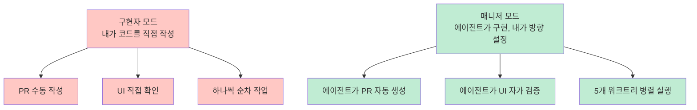
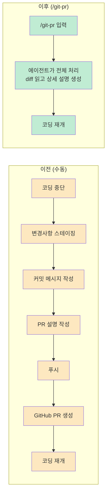
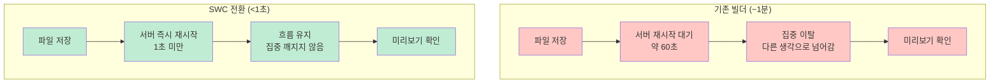
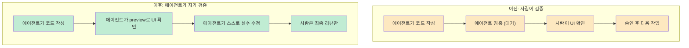
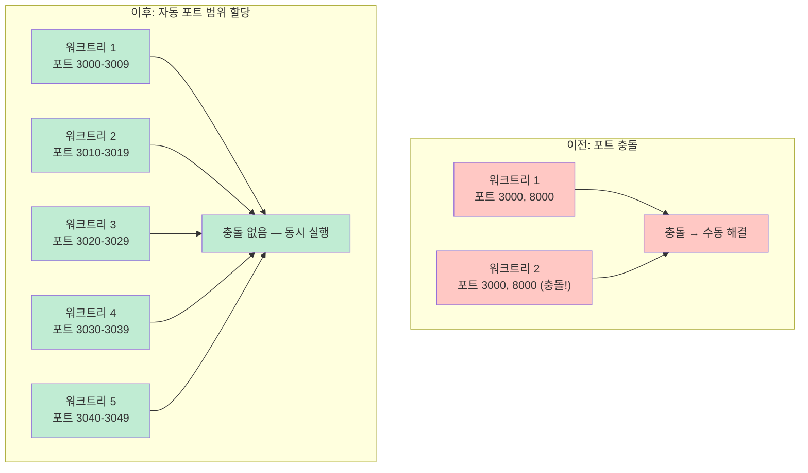
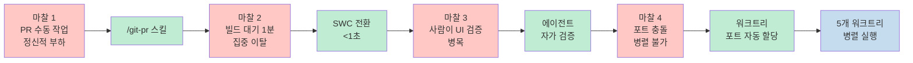
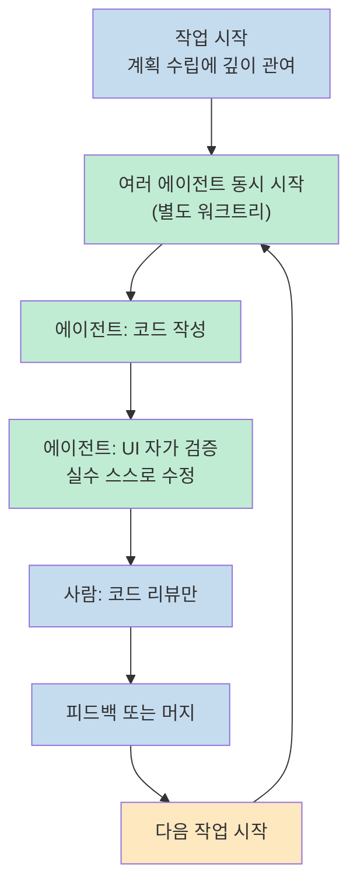

Claude Code를 쓴다는 것은 AI 도구를 쓰는 것이 아닙니다. Neil Kakkar는 Tano에 합류한 후 6주 만에 커밋 수를 극적으로 늘렸는데, 그 비결은 모델을 잘 쓰는 것이 아니었습니다. **에이전트가 일하기 좋은 인프라를 구축한 것**이었습니다. 
구현자에서 에이전트 팀 매니저로 역할을 바꾸고, 마찰을 하나씩 제거하는 4단계 여정을 정리합니다.

<!--more-->

## Sources

- https://neilkakkar.com/productive-with-claude-code.html

---

## 시작점: 나는 구현자가 아니라 매니저다

Neil은 Tano에 합류했을 때 모든 PR을 손으로 만들고 있었습니다. 변경 사항 스테이징, 커밋 메시지 작성, PR 설명 작성, 푸시, GitHub PR 생성. 당연한 과정이라 생각했습니다.

> "그게 첫 번째 진짜 전환점이었습니다. 나는 더 이상 구현자가 아닙니다. 나는 구현을 하는 에이전트 팀의 매니저입니다. 그리고 좋은 매니저는 팀의 반복 작업을 자동화합니다."

이 인식의 전환이 이후 모든 변화의 출발점이 됩니다.

---

## 1단계: /git-pr 스킬 — PR 자동화로 정신적 부하 제거

첫 번째로 만든 Claude Code 스킬은 `/git-pr`입니다. 기존에 수동으로 하던 전체 PR 프로세스를 자동화합니다.

시간 절약도 있지만 진짜 효과는 다른 데 있었습니다.

> "절약된 시간보다 제거된 정신적 부하가 진짜 해방이었습니다. PR을 만들 때마다 작은 컨텍스트 전환이 있었습니다: 코드에 대해 생각하다가, 코드를 어떻게 설명할지 생각하는 모드로 전환. 이제 `/git-pr`을 입력하고 다음 일로 넘어갑니다."

에이전트가 전체 diff를 읽고 요약하기 때문에, PR 설명 품질은 수동으로 작성하던 것보다 오히려 더 좋아졌습니다.

---

## 2단계: SWC 빌드 — 1분 대기를 1초 미만으로

PR 자동화 후 다음 마찰이 눈에 들어왔습니다. 변경 사항을 리뷰하는 루프가 느렸습니다.

> 로컬 미리보기 → 현재 작업 중단 → 개발 서버 종료 → 새 브랜치에서 재시작 → 동작 확인 → 코드 리뷰

서버 빌드 시간이 약 1분이었는데, 이 1분이 집중을 깨뜨리기에 충분했습니다.

> "1초 미만 재시작은 흐름에서 절대 벗어나지 않게 해줍니다. 파일을 저장하면 서버가 이미 올라와 있고, 미리보기를 확인합니다. 주의가 흩어지는 틈이 없습니다. 어색한 침묵이 있는 대화와 자연스럽게 흘러가는 대화의 차이입니다."

---

## 3단계: 에이전트 UI 자가 검증 — 내가 병목이 되지 않도록

빠른 빌드 후 또 다른 문제가 보였습니다. 모든 UI 변경을 Neil이 직접 확인해야 했습니다. 에이전트가 코드를 만들어도 사람이 검증할 때까지 멈춰야 했습니다.

Chrome 확장 프로그램이 계속 충돌하면서 **Claude Code의 preview 기능**으로 전환했고, 여기서 핵심 원칙을 정립했습니다.

> "변경이 '완료'되려면 에이전트가 UI를 직접 검증해야 한다."

에이전트가 자체 실수를 잡을 수 있게 되면서, 사람의 개입 없이 에이전트가 더 오래 자율적으로 실행될 수 있었습니다. 이것이 다음 단계를 가능하게 했습니다.

---

## 4단계: 워크트리 병렬 시스템 — 포트 충돌 없이 5개 동시 실행

빠른 빌드와 자동 검증이 갖춰지자 새로운 마찰이 보였습니다. 동시에 여러 작업을 하기가 어려웠습니다.

문제의 핵심은 **포트 충돌**이었습니다.

> "앱에는 프론트엔드와 백엔드가 있어서 각각 고유한 포트가 필요합니다. 모든 워크트리가 같은 환경 변수를 공유해서 모두 같은 포트에 바인드하려 했습니다. 두 가지를 동시에 실행하는 것은 싸움이었습니다."

기존 방법은 고통스러웠습니다: stash → checkout → rebuild → test → switch back → pop stash. 또는 수동으로 워크트리를 만들고 포트를 직접 관리.

**해결책**: 워크트리가 생성될 때마다 각 서버에 고유한 포트 범위를 자동으로 할당하는 시스템을 구축했습니다.

결과:

> "병렬 브랜치 두 개에 압도되던 것에서 워크트리 다섯 개를 동시에 실행하게 됐습니다. 내 생성 루프가 바뀌었습니다: 여러 에이전트를 별도의 워크트리에서 동시에 시작, 각각 다른 기능을 개발. UI를 스스로 검증한 후에만 멈춥니다."

Neil의 역할은 계획에 깊이 관여하는 것. 그다음은 코드 리뷰까지 손을 놓습니다.

---

## 핵심 통찰: 제약 이론과 인프라

4단계가 우연히 발생한 것이 아닙니다. 각 마찰을 제거하면 다음 마찰이 보이는 **제약 이론(Theory of Constraints)**처럼 작동했습니다.

> "하나를 고치면 시스템이 바로 다음 것을 보여줍니다. 고전적인 제약 이론입니다."

그리고 가장 중요한 통찰:

> "Tano에서 내가 한 가장 레버리지 높은 작업은 기능을 작성한 것이 아닙니다. 커밋의 흐름을 홍수로 바꾼 인프라를 구축한 것입니다."

작업 루프의 최종 형태는 이렇습니다:

> "루프가 충분히 빠르면 엔지니어링이 엔터테인먼트가 됩니다."

---

## 핵심 요약

| 단계 | 제거한 마찰 | 방법 | 효과 |
|------|-----------|------|------|
| 1 | PR 작성 부담 (포맷팅) | `/git-pr` 스킬 | 컨텍스트 전환 제거, PR 품질 향상 |
| 2 | 빌드 대기 (~1분) | SWC 전환 | 재시작 1초 미만, 흐름 유지 |
| 3 | UI 검증 병목 | 에이전트 preview 자가 검증 | 사람 개입 없이 장시간 자율 실행 |
| 4 | 포트 충돌 (병렬 불가) | 워크트리별 자동 포트 할당 | 워크트리 2개 → 5개 동시 실행 |
| **핵심** | — | 구현자 → 에이전트 팀 매니저 | 가장 높은 레버리지는 인프라 구축 |

---

## 결론

Claude Code를 잘 쓰는 것은 프롬프트를 잘 쓰는 것이 아닙니다. **에이전트가 잘 일할 수 있는 환경을 만드는 것**입니다. 
Neil의 경험이 보여주는 것은 하나입니다 — 마찰을 하나 제거하면 다음 마찰이 보입니다. 그 루프를 반복하다 보면, 어느 순간 혼자 일하던 것이 팀이 일하는 것으로 바뀝니다. 
지금 Claude Code를 쓰고 있다면 물어볼 질문은 하나입니다: "에이전트가 내 시스템에서 가장 많이 멈추는 지점은 어디인가?"
