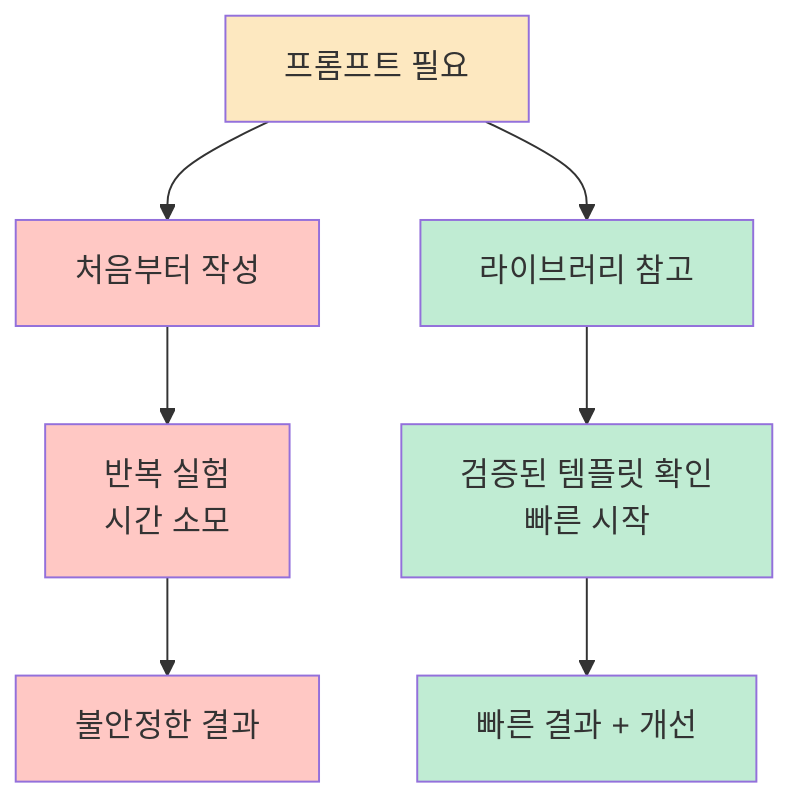
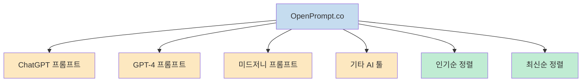
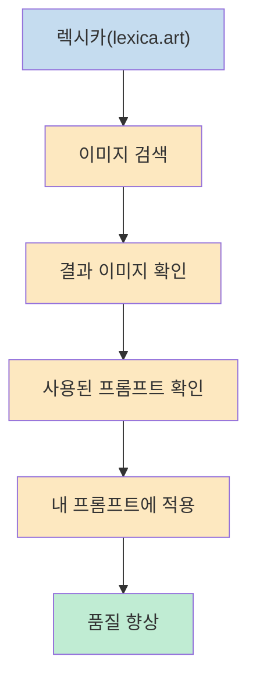
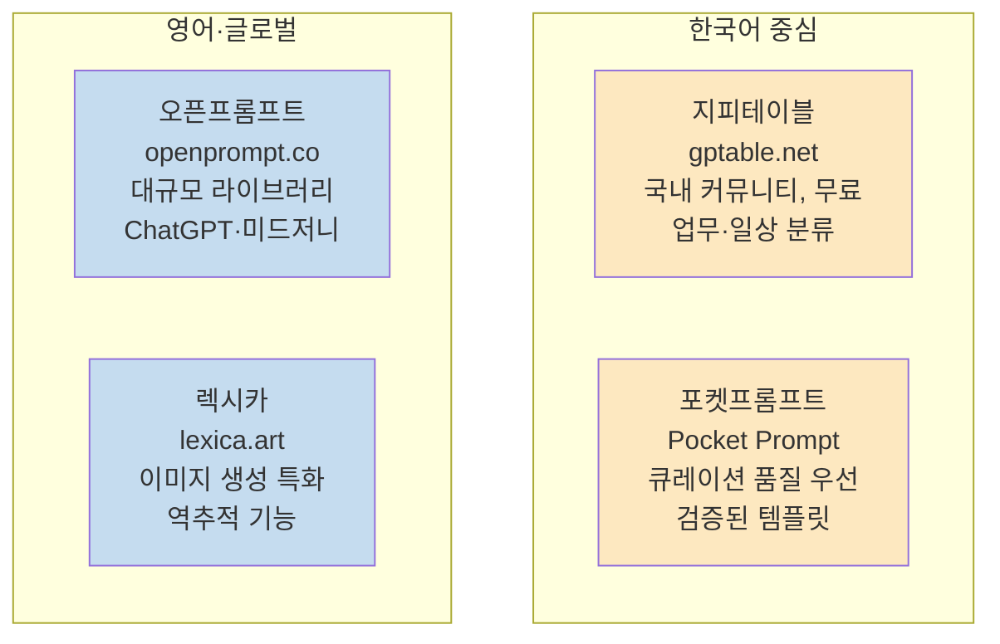

프롬프트를 처음부터 직접 쓰려고 하지 마세요. 잘 만들어진 프롬프트는 이미 공개되어 있습니다. 실력 있는 사람들은 창작하지 않고 참고합니다. 
즐겨찾기에 넣어둘 사이트 4가지를 소개합니다.

<!--more-->

## Sources

- https://www.threads.com/@prompt_recipe_/post/DWWJgeOgUzr

---

## 왜 프롬프트를 직접 작성하려 하나요?

좋은 프롬프트는 수십 번의 반복 실험과 피드백으로 만들어집니다. 처음부터 혼자 만들면 시간이 걸릴 뿐 아니라, 더 나은 접근 방식을 놓칠 수 있습니다. 이미 검증된 프롬프트를 참고해 수정하는 것이 훨씬 빠르고 효과적인 방법입니다.

---

## 4가지 프롬프트 사이트

### 1. 지피테이블 (GPTable) — gptable.net

국내 최초 프롬프트 커뮤니티입니다. 업무용부터 재미용까지 분류가 잘 되어 있고, 완전 무료입니다.

- **대상**: 한국어 사용자, 업무 자동화, 일상 활용
- **특징**: 카테고리 분류 체계, 커뮤니티 기반 공유, 즐겨찾기 기능
- **프롬프트 예시**: 보도자료 작성, 회의록 정리, 메모리 접근 프롬프트

한국어 맥락에 맞는 프롬프트를 찾을 때 가장 먼저 확인할 곳입니다.

### 2. 오픈프롬프트 (OpenPrompt) — openprompt.co

프롬프트 라이브러리 규모가 압도적입니다. 미드저니 사용자에게 특히 유용합니다.

- **대상**: 영어권 포함 글로벌 사용자, 이미지 생성 포함
- **특징**: 스타 수 기반 인기 프롬프트 정렬, ChatGPT/GPT-4/미드저니 카테고리 분리
- **구성**: 제목, 설명, 스타 수, 작성자, 등록일 포함

### 3. 포켓프롬프트 (Pocket Prompt)

퀄리티 중심입니다. 검증된 템플릿만 저장해서 사용할 수 있어 실패 확률을 줄이고 싶을 때 추천합니다.

- **대상**: 빠른 결과를 원하는 사용자, 실패를 줄이고 싶을 때
- **특징**: 큐레이션 기반 — 수량보다 품질 우선, 검증된 템플릿만 등록

양보다 질을 원할 때, 많은 선택지보다 확실한 하나가 필요할 때 유용합니다.

### 4. 렉시카 (Lexica) — lexica.art

이미지 생성에 특화되어 있습니다. 결과물을 보고 프롬프트를 역추적할 수 있어 이미지 프롬프팅 실력을 빠르게 올릴 수 있습니다.

- **대상**: 스테이블 디퓨전, 이미지 AI 사용자
- **특징**: 결과 이미지 → 사용된 프롬프트 역추적, 스타일별 검색

---

## 4가지 사이트 비교

| 사이트 | 특징 | 추천 상황 |
|--------|------|-----------|
| **지피테이블** | 국내 커뮤니티, 업무·재미 분류, 무료 | 한국어 업무 자동화, 일상 활용 |
| **오픈프롬프트** | 글로벌 라이브러리, 규모 최대 | ChatGPT·GPT-4·미드저니 통합 탐색 |
| **포켓프롬프트** | 큐레이션, 품질 우선 | 빠르게 검증된 것만 쓰고 싶을 때 |
| **렉시카** | 이미지 특화, 역추적 | 이미지 AI 프롬프트 학습·탐색 |

---

## 핵심 요약

| 항목 | 내용 |
|------|------|
| **핵심 원칙** | 프롬프트는 처음부터 만들지 말고, 공개된 것을 참고해 수정 |
| **지피테이블** | 국내 최초 프롬프트 커뮤니티, 무료, 한국어 업무용 강점 |
| **오픈프롬프트** | 글로벌 최대 규모 라이브러리, 미드저니 사용자 유용 |
| **포켓프롬프트** | 큐레이션 기반 품질 우선, 실패 확률 최소화 |
| **렉시카** | 이미지 생성 특화, 결과물로 프롬프트 역추적 가능 |

---

## 결론

좋은 프롬프트는 이미 인터넷 어딘가에 있습니다. 4개 사이트를 즐겨찾기에 등록해두고, 필요할 때마다 검색해서 참고하는 습관을 만드는 것이 프롬프트 실력을 빠르게 올리는 가장 실용적인 방법입니다. 
텍스트 프롬프트가 필요하면 지피테이블·오픈프롬프트, 품질 우선이라면 포켓프롬프트, 이미지 AI를 쓴다면 렉시카부터 시작하세요.
