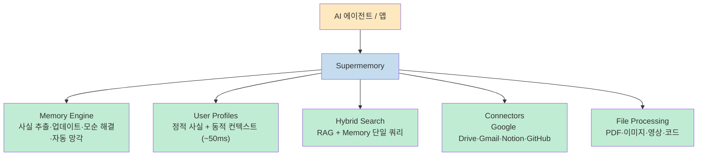
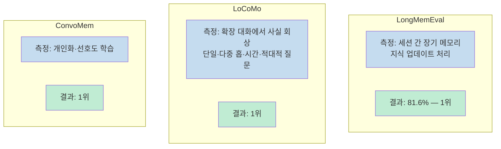
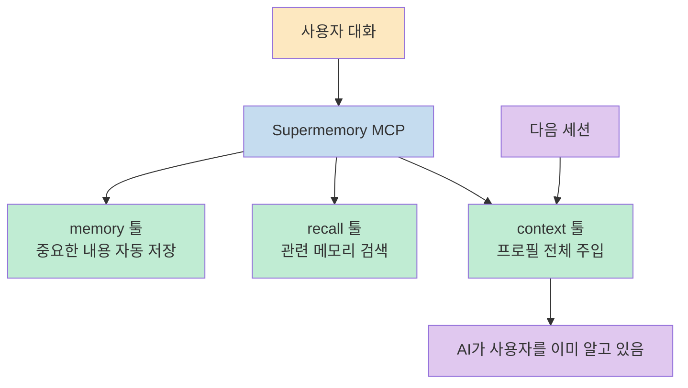

AI와 대화를 나누고 다음 세션을 시작하면, 이전 맥락은 모두 사라집니다. Supermemory는 이 문제를 해결하기 위해 만들어진 **오픈소스 메모리 및 컨텍스트 엔진**입니다. LongMemEval, LoCoMo, ConvoMem — 현재 존재하는 AI 메모리 3대 벤치마크에서 모두 1위를 기록했습니다.

<!--more-->

## Sources

- https://github.com/supermemoryai/supermemory

---

## Supermemory란

Supermemory는 AI를 위한 메모리 및 컨텍스트 레이어입니다. 대화에서 사실을 추출하고, 유저 프로필을 자동으로 구성하며, 지식 업데이트와 모순을 처리하고, 만료된 정보를 자동으로 잊습니다. 그리고 올바른 컨텍스트를 올바른 시점에 전달합니다.



GitHub Stars 19.6k, Forks 1.8k의 오픈소스 프로젝트이며, MIT 라이선스입니다.

---

## 벤치마크: 3개 부문 모두 1위

Supermemory는 AI 메모리 분야의 세 가지 주요 벤치마크에서 모두 1위를 차지했습니다.



비교 대상에는 Mem0, Zep 등 기존 메모리 솔루션이 포함됩니다. 자체 개발한 오픈소스 벤치마킹 프레임워크 **MemoryBench**를 통해 직접 비교할 수도 있습니다.

```bash
bun run src/index.ts run -p supermemory -b longmemeval -j gpt-4o -r my-run
```

---

## MCP로 Claude에 메모리 연결하기

### 한 줄 설치

```bash
npx -y install-mcp@latest https://mcp.supermemory.ai/mcp --client claude --oauth=yes
```

`claude` 자리에 `cursor`, `windsurf`, `vscode` 등을 넣으면 해당 클라이언트에 설치됩니다.

### 지원 클라이언트

Claude Desktop · Cursor · Windsurf · VS Code · **Claude Code** · OpenCode · OpenClaw

### AI가 사용할 수 있는 툴

| MCP 툴 | 동작 |
|--------|------|
| `memory` | 정보 저장 또는 삭제. AI가 기억할 가치가 있다고 판단하면 자동 호출 |
| `recall` | 쿼리로 메모리 검색. 관련 메모리 + 유저 프로필 요약 반환 |
| `context` | 전체 프로필(선호도, 최근 활동)을 대화 시작 시 주입. Claude Code에서는 `/context` 입력 |



### 작동 방식

1. AI와 평소처럼 대화합니다. 선호도, 프로젝트, 문제를 공유합니다.
2. Supermemory가 중요한 내용을 추출해 저장합니다. 사실·선호도·프로젝트 컨텍스트를 저장하고 노이즈는 제외합니다.
3. 다음 세션에서 AI가 이미 사용자를 알고 있습니다. 진행 중인 작업, 선호 방식, 이전 논의를 기억합니다.

메모리는 **프로젝트(container tag)** 단위로 범위가 지정됩니다. 업무와 개인 컨텍스트를 분리하거나, 클라이언트·레포지토리별로 구분할 수 있습니다.

---

## Claude Code 플러그인

Supermemory는 Claude Code 전용 플러그인을 제공합니다.

```bash
# Claude Code 플러그인 (오픈소스)
# https://github.com/supermemoryai/claude-supermemory
```

설치 후 Claude Code 세션 간 메모리가 자동으로 영구 저장됩니다.

---

## 개발자를 위한 API

AI 에이전트나 앱을 만들 때 Supermemory API 하나로 메모리, RAG, 유저 프로필, 커넥터, 파일 처리를 모두 연결할 수 있습니다. 벡터 DB 설정, 임베딩 파이프라인, 청킹 전략이 필요 없습니다.

### 설치

```bash
npm install supermemory
# 또는
pip install supermemory
```

### TypeScript 퀵스타트

```typescript
import Supermemory from "supermemory";
const client = new Supermemory();

// 대화 저장
await client.add({
  content: "User loves TypeScript and prefers functional patterns",
  containerTag: "user_123",
});

// 유저 프로필 + 관련 메모리를 한 번에
const { profile, searchResults } = await client.profile({
  containerTag: "user_123",
  q: "What programming style does the user prefer?",
});
// profile.static → ["Loves TypeScript", "Prefers functional patterns"]
// profile.dynamic → ["Working on API integration"]
```

### API 메서드

| 메서드 | 용도 |
|--------|------|
| `client.add()` | 텍스트·대화·URL·HTML 저장 |
| `client.profile()` | 유저 프로필 + 선택적 검색 |
| `client.search.memories()` | 메모리·문서 하이브리드 검색 |
| `client.search.documents()` | 메타데이터 필터 포함 문서 검색 |
| `client.documents.uploadFile()` | PDF·이미지·영상·코드 업로드 |
| `client.settings.update()` | 메모리 추출·청킹 설정 |

### 검색 모드

```typescript
// Hybrid (기본값) — RAG + Memory 동시 쿼리
const results = await client.search.memories({
  q: "how do I deploy?",
  containerTag: "user_123",
  searchMode: "hybrid",
});
// → 배포 문서(RAG) + 사용자 배포 선호도(Memory) 함께 반환

// Memory만 검색
const results = await client.search.memories({
  searchMode: "memories",
});
```

### 프레임워크 통합

```typescript
// Vercel AI SDK
import { withSupermemory } from "@supermemory/tools/ai-sdk";
const model = withSupermemory(openai("gpt-4o"), "user_123");

// Mastra
import { withSupermemory } from "@supermemory/tools/mastra";
const agent = new Agent(withSupermemory(config, "user-123", { mode: "full" }));
```

지원 프레임워크: **Vercel AI SDK** · **LangChain** · **LangGraph** · **OpenAI Agents SDK** · **Mastra** · **Agno** · **Claude Memory Tool** · **n8n**

---

## Memory vs RAG: 핵심 차이

```mermaid
flowchart TD
    subgraph "RAG (일반 검색)"
        R1["문서 청크 검색"]
        R2["Stateless — 모든 사용자 동일 결과"]
        R3["지식 베이스 조회"]
    end

    subgraph "Memory (Supermemory)"]
        M1["사용자 사실 추출·추적"]
        M2["Stateful — 사용자마다 개인화"]
        M3["\"NYC에 살아\" → \"SF로 이사했어\" 업데이트"]
        M4["임시 정보 자동 망각<br>(\"내일 시험\"은 지나면 삭제)"]
    end

    subgraph "Hybrid (Supermemory 기본값)"
        H1["RAG + Memory 동시 실행"]
        H2["지식 베이스 + 개인화 컨텍스트 함께 반환"]
    end

    classDef rag fill:#fde8c0,color:#333
    classDef mem fill:#c5dcef,color:#333
    classDef hybrid fill:#c0ecd3,color:#333
    class R1,R2,R3 rag
    class M1,M2,M3,M4 mem
    class H1,H2 hybrid
```

**자동 망각**: "내일 시험이 있어"처럼 날짜가 지나면 의미 없어지는 임시 사실은 만료 후 자동 삭제됩니다. 모순도 자동으로 해결됩니다.

---

## 커넥터

외부 데이터를 지식 베이스에 자동 동기화합니다.

- **Google Drive** · **Gmail** · **Notion** · **OneDrive** · **GitHub** · **Web Crawler**

실시간 웹훅으로 업데이트됩니다. 문서는 자동으로 처리·청킹·검색 가능 상태로 변환됩니다.

---

## 파일 처리

| 파일 유형 | 처리 방식 |
|-----------|-----------|
| PDF | 텍스트 추출 + 청킹 |
| 이미지 | OCR |
| 영상 | 트랜스크립션 |
| 코드 | AST 인식 청킹 |

---

## 핵심 요약

| 항목 | 내용 |
|------|------|
| **프로젝트** | supermemoryai/supermemory (19.6k ★, MIT) |
| **정의** | AI를 위한 메모리 및 컨텍스트 엔진 |
| **벤치마크** | LongMemEval(81.6% #1) · LoCoMo(#1) · ConvoMem(#1) |
| **MCP 설치** | `npx -y install-mcp@latest https://mcp.supermemory.ai/mcp --client claude` |
| **지원 클라이언트** | Claude, Cursor, Windsurf, VS Code, Claude Code 등 |
| **API** | npm/pip 설치, TypeScript·Python SDK |
| **검색** | RAG + Memory 하이브리드 기본 지원 |
| **커넥터** | Google Drive·Gmail·Notion·OneDrive·GitHub |
| **자동 망각** | 임시 사실 만료, 모순 자동 해결 |
| **앱** | app.supermemory.ai (노코드 사용 가능) |

---

## 결론

대부분의 AI 메모리 솔루션은 단순 RAG입니다. Supermemory는 그 위에 사용자별 사실 추출, 시간적 업데이트, 자동 망각, 유저 프로필 자동 구성까지 더합니다.<br>
Claude Code를 자주 쓴다면 MCP 한 줄 설치로 세션 간 컨텍스트 유실 문제를 해결할 수 있습니다. 에이전트를 만드는 개발자라면 벡터 DB 없이 메모리+RAG+유저 프로필을 API 하나로 연결할 수 있는 가장 빠른 경로입니다.
