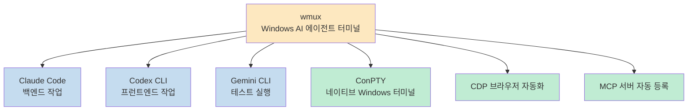
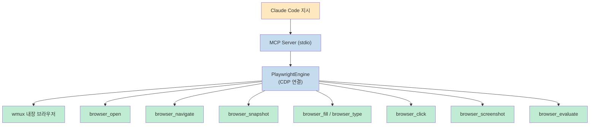
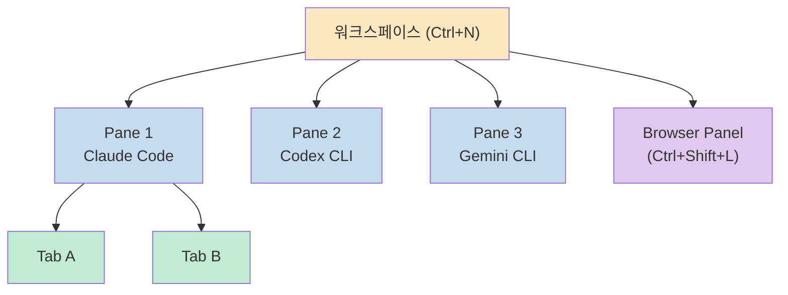
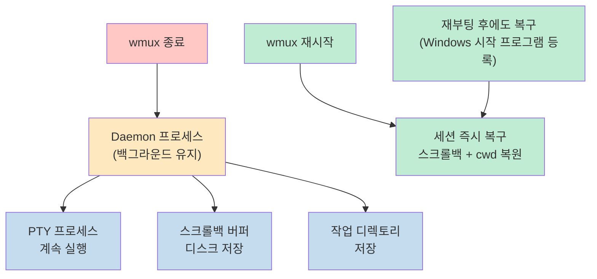
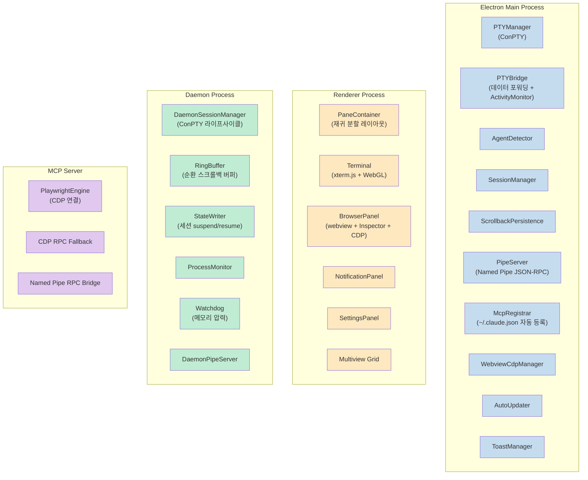
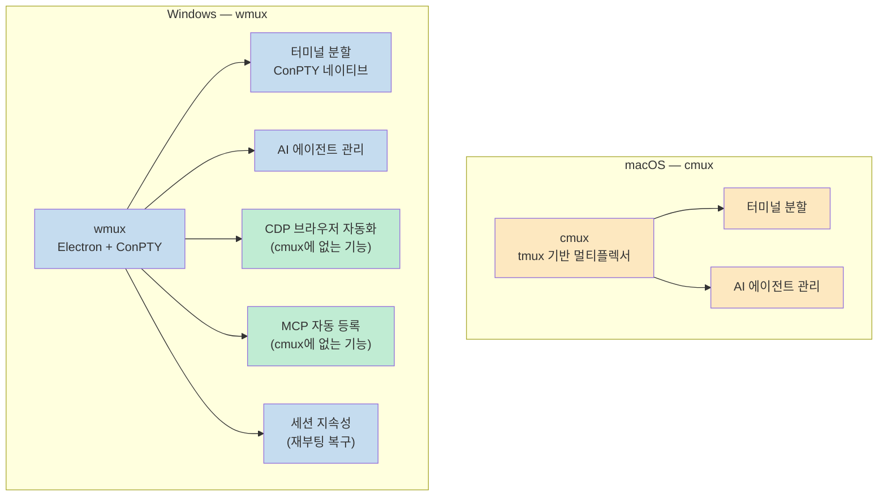

macOS에서 AI 에이전트를 다중 실행할 때 사용하는 cmux처럼, Windows에서도 같은 환경이 필요한 순간이 있습니다. WSL 없이 네이티브 Windows 환경에서 Claude Code, Codex CLI, Gemini CLI를 한 화면에 나란히 두고 싶다면 **wmux**가 그 해답입니다.

<!--more-->

## Sources

- https://github.com/openwong2kim/wmux

---

## wmux가 나온 이유

macOS에는 [cmux](https://github.com/manaflow-ai/cmux)가 있습니다. tmux 기반으로 여러 AI 에이전트를 하나의 화면에서 관리할 수 있는 터미널 멀티플렉서입니다. 그런데 **Windows에는 tmux가 없습니다.** WSL을 쓰지 않는 이상 동등한 환경을 구성할 방법이 없었습니다.

wmux는 이 공백을 메웁니다. Electron 41 + TypeScript로 작성된 네이티브 Windows 앱으로, 터미널 분할·브라우저 자동화·MCP 서버를 하나에 묶었습니다.

```
Claude Code가 왼쪽에서 백엔드를 작성하는 동안
Codex가 오른쪽에서 프런트엔드를 구성하고
Gemini CLI가 하단에서 테스트를 실행합니다
— 동시에, 한 화면에서
```



---

## 6가지 핵심 기능

### 1. AI 에이전트가 직접 브라우저를 제어

wmux에 내장된 브라우저는 Chrome DevTools Protocol(CDP)로 연결됩니다. Claude Code에서 "구글에서 검색해줘"라고 하면 실제로 브라우저가 열리고 검색이 실행됩니다.

```
사용자: "wmux를 구글에서 검색해줘"
Claude: browser_open → browser_snapshot
      → browser_fill(ref=13, "wmux")
      → browser_press_key("Enter")
→ 실제 구글 검색 완료
```

React controlled input, CJK 텍스트 입력도 정상 동작합니다.



멀티 에이전트 환경에서는 모든 브라우저 툴이 `surfaceId`를 파라미터로 받습니다. Claude Code 세션마다 독립적인 브라우저 인스턴스를 제어할 수 있습니다.

### 2. 분할 터미널 (ConPTY 기반)

| 단축키 | 동작 |
|--------|------|
| `Ctrl+D` | 오른쪽으로 분할 |
| `Ctrl+Shift+D` | 아래로 분할 |
| `Ctrl+T` | 새 탭 |
| `Ctrl+N` | 새 워크스페이스 |
| `Ctrl+1~9` | 워크스페이스 전환 |
| `Ctrl+click` | 멀티뷰 추가 |
| `Ctrl+Shift+G` | 멀티뷰 종료 |

xterm.js + WebGL 하드웨어 가속 렌더링을 사용합니다. 스크롤백 버퍼 999K 줄을 디스크에 저장하며, 앱을 재시작해도 터미널 내용이 유지됩니다.



### 3. 스마트 알림 — "끝났나요?" 물어볼 필요 없음

wmux는 AI 에이전트 작업이 완료되면 자동으로 알려줍니다. 패턴 매칭이 아니라 **출력 처리량 기반 감지**로 작동합니다.

- 작업 완료 → 데스크톱 알림 + 태스크바 플래시
- 비정상 종료 → 즉시 경고
- `git push --force`, `rm -rf`, `DROP TABLE` → 위험 명령어 경고

Claude Code, Cursor, Aider, Codex CLI, Gemini CLI, OpenCode, GitHub Copilot CLI를 자동 감지합니다.

### 4. MCP 자동 등록

wmux를 시작하면 MCP 서버가 `~/.claude.json`에 자동으로 등록됩니다. Claude Code를 열면 브라우저·터미널 제어 툴이 즉시 사용 가능합니다.

| MCP 툴 | 동작 |
|--------|------|
| `browser_open` | 브라우저 열기 |
| `browser_navigate` | URL 이동 |
| `browser_screenshot` | 스크린샷 |
| `browser_snapshot` | 페이지 구조 읽기 |
| `browser_click` | 요소 클릭 |
| `browser_fill` / `browser_type` | 폼 입력 |
| `browser_evaluate` | JS 실행 |
| `browser_press_key` | 키 입력 |
| `terminal_read` | 터미널 읽기 |
| `terminal_send` | 명령 전송 |
| `workspace_list` / `surface_list` / `pane_list` | 워크스페이스 관리 |

### 5. 세션 지속성

앱을 재시작하거나 재부팅해도 세션이 살아있습니다.



데몬 프로세스가 wmux 종료 후에도 PTY 프로세스를 유지합니다. 재접속 시 즉시 연결됩니다. 데드 세션은 24시간 TTL 후 자동 정리됩니다.

### 6. 보안

- Named Pipe IPC에 토큰 인증 적용
- SSRF 방어 — 사설 IP, `file://`, `javascript:` 스킴 차단
- PTY 입력 새니타이징 — 명령 인젝션 방지
- CDP 포트 랜덤화 — 고정 디버그 포트 없음
- 메모리 압력 감시 — 750MB에서 데드 세션 정리, 1GB에서 신규 세션 차단
- Electron Fuses — RunAsNode 비활성화, 쿠키 암호화 활성화

---

## 아키텍처

wmux는 세 개의 프로세스로 구성됩니다.



---

## 설치

**인스톨러 다운로드:**

[GitHub Releases](https://github.com/openwong2kim/wmux/releases/latest)에서 `wmux Setup.exe`를 내려받아 실행합니다.

**PowerShell 원라이너:**

```powershell
irm https://raw.githubusercontent.com/openwong2kim/wmux/main/install.ps1 | iex
```

Python 3.x, Visual Studio Build Tools(C++ 워크로드)가 없으면 스크립트가 자동으로 설치합니다.

---

## cmux와 비교



wmux는 cmux에서 영감을 받았지만, CDP 브라우저 자동화와 MCP 자동 등록은 wmux가 추가한 기능입니다.

---

## 핵심 요약

| 항목 | 내용 |
|------|------|
| **플랫폼** | Windows 10 / 11 |
| **기반 기술** | Electron 41 · TypeScript 95% · ConPTY |
| **터미널** | xterm.js + WebGL · 분할 · 999K 스크롤백 |
| **브라우저 자동화** | 내장 CDP · 클릭·입력·스크린샷·JS 실행 |
| **MCP 통합** | 실행 시 `~/.claude.json` 자동 등록 |
| **세션 지속성** | 앱 재시작·재부팅 후에도 세션 복구 |
| **보안** | 토큰 인증 · SSRF 방어 · 메모리 워치독 |
| **알림** | 작업 완료 알림 · 위험 명령어 경고 |
| **지원 에이전트** | Claude Code · Codex · Gemini · Aider · Cursor 등 |
| **라이선스** | MIT |
| **설치** | 인스톨러 또는 PowerShell 원라이너 |

---

## 결론

Windows에서 AI 에이전트 개발 환경을 구성할 때 터미널 분할, 브라우저 제어, MCP 연동을 따로 설정하는 번거로움이 있었습니다. wmux는 이 세 가지를 하나로 묶어 macOS의 cmux와 동등한, 혹은 그 이상의 환경을 Windows에서 제공합니다.<br>
Claude Code를 Windows에서 본격적으로 쓰고 싶다면 wmux를 먼저 설치하고 시작하는 게 가장 빠른 출발점입니다.
