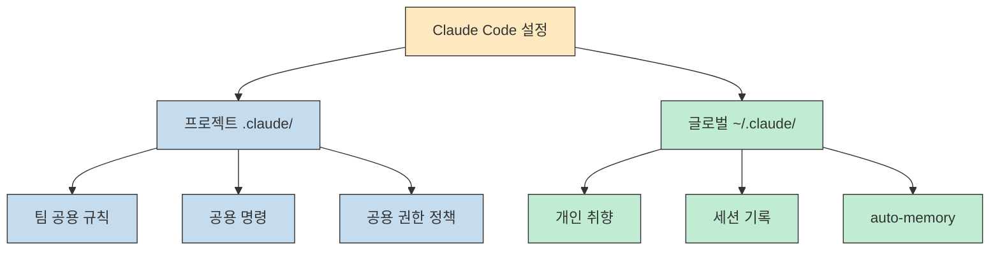
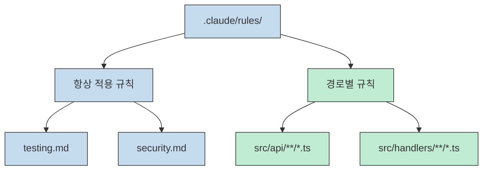
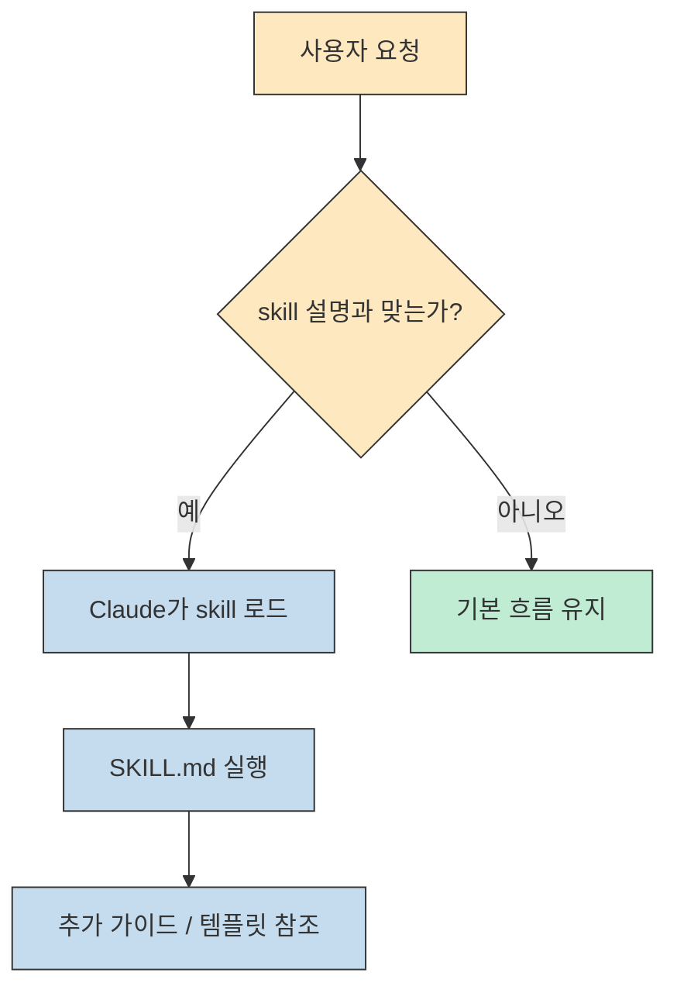
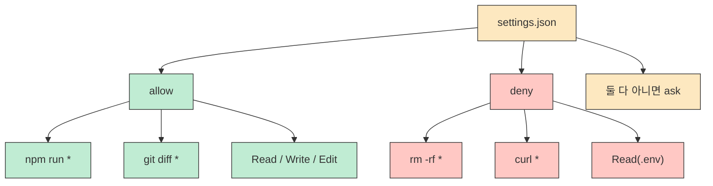

Claude Code를 쓰는 사람은 대부분 `.claude/` 폴더가 있다는 사실은 압니다. 프로젝트 루트에 생기는 것도 봤고, 뭔가 중요한 설정이 들어 있을 것 같다는 감도 있습니다. 그런데 막상 열어 보지 않은 경우가 많습니다.<br>Daily Dose of Data Science의 ["Anatomy of the .claude/ Folder"](https://blog.dailydoseofds.com/p/anatomy-of-the-claude-folder) 는 바로 이 지점을 파고듭니다. `.claude/` 는 그냥 숨김 폴더가 아니라, **Claude Code가 프로젝트 안에서 어떻게 행동할지를 결정하는 제어 센터** 라는 것이 글의 출발점입니다.
<!--more-->

원문이 좋은 이유는 "기능 소개"에 그치지 않고, 실제로 어떤 파일을 어디에 두고 왜 그렇게 나누는지가 한 흐름으로 이어진다는 점입니다. 이 글에서는 그 전개를 최대한 살려서, `.claude/` 폴더를 처음부터 끝까지 한 번에 훑을 수 있게 정리하겠습니다.


## Sources

- https://blog.dailydoseofds.com/p/anatomy-of-the-claude-folder
- https://code.claude.com/docs/en/slash-commands
- https://code.claude.com/docs/en/settings
- https://code.claude.com/docs/en/memory

## 1) 먼저 알아둘 것: `.claude` 는 하나가 아니라 둘이다

원문은 시작부터 중요한 구분 하나를 줍니다. 많은 사람이 `.claude` 폴더를 프로젝트 안의 숨김 디렉터리 하나로 생각하지만, 실제로는 **프로젝트용 `.claude/` 와 개인용 `~/.claude/` 두 층이 함께 작동** 합니다.

- 프로젝트 안 `.claude/`: 팀과 공유하는 설정
- 홈 디렉터리 `~/.claude/`: 개인 취향과 머신 로컬 상태

즉 프로젝트 레벨은 git에 커밋해 팀이 같이 쓰는 규칙과 명령, 권한 정책을 담고, 글로벌 레벨은 내가 모든 프로젝트에서 공통으로 쓰고 싶은 습관과 세션 기록, auto-memory 같은 개인 상태를 담는 구조입니다.




이 구분 하나만 알아도 `.claude/` 설계가 훨씬 쉬워집니다. 팀 전체가 따라야 하는 규칙인지, 아니면 내 개인적 선호인지 먼저 나누면 되기 때문입니다.

## 2) `CLAUDE.md`: 가장 중요한 파일

원문은 `CLAUDE.md` 를 시스템 전체에서 가장 중요한 파일로 둡니다. 이유도 단순합니다. Claude Code 세션이 시작될 때 Claude가 가장 먼저 읽는 것이 바로 이 파일이기 때문입니다. 글은 이 파일을 사실상 **Claude의 instruction manual** 로 설명합니다.

요점은 분명합니다. `CLAUDE.md` 에 적는 내용이 곧 Claude가 프로젝트에서 따라야 할 기준이 됩니다.

- 항상 테스트를 먼저 쓰라고 하면 그렇게 하게 만들 수 있고
- `console.log` 대신 프로젝트 로거를 쓰라고 하면 그 습관을 반복하게 만들 수 있고
- 파일 구조와 에러 처리 방식을 정해 두면 매번 다시 설명할 필요가 줄어듭니다

원문은 `CLAUDE.md` 가 한 군데만 있는 것도 아니라고 설명합니다.

- 프로젝트 루트의 `CLAUDE.md`
- `~/.claude/CLAUDE.md`
- 특정 하위 디렉터리 안의 `CLAUDE.md`

이런 파일들을 Claude가 함께 읽고 결합해서 문맥으로 사용한다는 설명입니다.

## 3) `CLAUDE.md` 에 무엇을 써야 하나

원문에서 가장 실용적인 부분 중 하나가 바로 이 섹션입니다. 많은 사람이 `CLAUDE.md` 에 너무 많은 것을 넣거나, 반대로 너무 빈약하게 적는다고 지적합니다. 글이 권하는 방향은 아주 현실적입니다.

`CLAUDE.md` 에 넣을 것:

- 빌드, 테스트, 린트 명령
- 핵심 아키텍처 결정
- 처음 보면 놓치기 쉬운 함정
- import 규칙, 네이밍 규칙, 에러 처리 스타일
- 주요 폴더와 모듈 구조

`CLAUDE.md` 에 넣지 말 것:

- linter나 formatter가 이미 강제하는 내용
- 링크로 충분히 대체 가능한 긴 문서
- 길고 추상적인 이론 설명

원문은 특히 `CLAUDE.md` 를 200줄 이하로 유지하라고 권합니다. 길어질수록 컨텍스트를 많이 먹고, 오히려 instruction adherence가 떨어진다는 문제의식입니다. 즉 좋은 `CLAUDE.md` 는 "많이 적는 문서"가 아니라 **Claude가 바로 실행에 쓸 수 있는 정보만 남긴 짧고 밀도 높은 파일** 입니다.

원문은 여기서 바로 "짧지만 바로 일하게 만드는" 예시를 보여 줍니다. 아래 블록이 그 핵심입니다.

```md
# Project: Acme API
## 명령어
npm run dev          # 개발 서버 시작
npm run test         # 테스트 실행 (Jest)
npm run lint         # ESLint + Prettier 검사
npm run build        # 프로덕션 빌드

## 아키텍처
- Express REST API, Node 20 사용
- PostgreSQL은 Prisma ORM으로 연결
- 모든 핸들러는 src/handlers/ 아래에 위치
- 공용 타입은 src/types/ 에 위치

## 규칙
- 모든 핸들러의 요청 검증에는 zod 사용
- 반환 형태는 항상 { data, error }
- 클라이언트에 스택 트레이스를 노출하지 않기
- console.log 대신 logger 모듈 사용

## 주의할 점
- 테스트는 mock이 아닌 실제 로컬 DB 사용. 먼저 `npm run db:test:reset` 실행
- TypeScript strict 모드 사용: unused import 허용 안 함
```

## 4) `CLAUDE.local.md`: 개인 오버라이드용


다음으로 원문은 `CLAUDE.local.md` 를 설명합니다. 이 파일은 팀 규칙이 아니라 **나만의 취향** 을 넣는 자리입니다.

예를 들면:

- 특정 테스트 러너를 내가 더 선호하는 경우
- 파일을 열거나 탐색하는 방식에 개인 습관이 있는 경우
- 팀 문서에는 넣고 싶지 않지만 내 작업 효율에는 중요한 지침이 있는 경우

이 파일은 프로젝트 루트에 두되 자동으로 gitignore 되므로, 개인 설정이 실수로 팀 저장소에 올라가지 않는다는 점이 핵심입니다. 원문은 이 파일을 통해 "팀의 기준" 과 "개인의 습관" 을 분리하는 것이 중요하다고 봅니다.

## 5) `rules/` 폴더: 커진 `CLAUDE.md` 를 분해하는 방법

원문은 `CLAUDE.md` 하나로 시작하는 것은 좋지만, 팀이 커지면 결국 파일이 비대해진다고 설명합니다. 그때 등장하는 해법이 `.claude/rules/` 입니다.

이 폴더의 핵심은 **지침을 관심사별로 쪼갤 수 있다** 는 점입니다.

예를 들어:

- `code-style.md`
- `testing.md`
- `api-conventions.md`
- `security.md`

처럼 나누면, 한 파일이 너무 거대해지는 문제를 피할 수 있습니다. 원문은 이 구조의 장점으로 유지보수 책임이 분명해진다는 점도 강조합니다. API 규칙은 API 담당자가, 테스트 규칙은 테스트 표준을 맡은 사람이 관리할 수 있기 때문입니다.

원문은 먼저 폴더를 아주 단순한 트리로 보여 줍니다.

```text
.claude/rules/
├── code-style.md
├── testing.md
├── api-conventions.md
└── security.md
```

원문이 특히 강조하는 것은 **path-scoped rules** 입니다. `paths` frontmatter를 달아 두면, Claude는 그 경로와 관련된 파일을 다룰 때만 해당 규칙을 불러옵니다.

이 설명도 아래처럼 실제 frontmatter 예시와 함께 제시됩니다.

```md
---
paths:
  - "src/api/**/*.ts"
  - "src/handlers/**/*.ts"
---
# API 설계 규칙

- 모든 핸들러는 { data, error } 형태로 반환
- 요청 본문 검증에는 zod 사용
- 내부 에러 상세 정보는 클라이언트에 노출하지 않기
```



즉 React 컴포넌트를 수정할 때는 API 규칙을 굳이 읽지 않게 만들 수 있습니다. 이 방식은 `CLAUDE.md` 가 답답하게 길어졌을 때 가장 먼저 도입할 만한 패턴입니다.

## 6) `commands/` 폴더: 내가 만드는 슬래시 명령

그다음 원문은 `.claude/commands/` 를 설명합니다. 여기의 아이디어는 명확합니다. 기본 제공 명령 `/help`, `/compact` 외에, **자주 쓰는 작업을 프로젝트 전용 slash command로 만들 수 있다** 는 것입니다.


예를 들어:

- `.claude/commands/review.md` → `/project:review`
- `.claude/commands/fix-issue.md` → `/project:fix-issue`

이런 식으로 파일 이름이 곧 명령 이름이 됩니다.

원문이 보여 주는 핵심 포인트는 `!` 백틱 문법입니다. 이 문법을 쓰면 쉘 명령 결과를 실제 프롬프트 안에 주입할 수 있습니다. 예를 들어 현재 브랜치 diff를 넣어 두고 코드 리뷰를 시키는 식입니다. 이 덕분에 command는 단순 저장 텍스트가 아니라 **실시간 컨텍스트를 끌어오는 자동화된 프롬프트** 가 됩니다.


원문이 제시하는 첫 번째 예시는 리뷰용 커맨드입니다.

```md
---
description: Review the current branch diff for issues before merging
---
## 검토할 변경 사항

!`git diff --name-only main...HEAD`

## 상세 diff

!`git diff main...HEAD`

위 변경 사항을 아래 기준으로 검토하세요:
1. 코드 품질 문제
2. 보안 취약점
3. 누락된 테스트 커버리지
4. 성능 우려 사항

파일별로 구체적이고 실행 가능한 피드백을 제공하세요.
```

또 `$ARGUMENTS` 를 이용해 `/project:fix-issue 234` 처럼 인자를 넘길 수 있다는 점도 원문이 자세히 설명합니다. 이 구조는 issue 조사, PR 요약, 보안 스캔 같은 반복 작업에 특히 잘 맞습니다.

그 다음에는 이슈 번호를 받는 커맨드 예시가 이어집니다.

```md
---
description: Investigate and fix a GitHub issue
argument-hint: [issue-number]
---
이 저장소의 이슈 #$ARGUMENTS 를 확인하세요.

!`gh issue view $ARGUMENTS`

버그를 이해하고, 근본 원인을 추적해 수정한 뒤,
이 문제를 잡아낼 수 있었을 테스트도 작성하세요.
```

## 7) `skills/` 폴더: 필요할 때 스스로 발동하는 워크플로우

원문은 commands와 skills를 명확히 구분합니다. commands는 **사용자가 직접 부르는 것**, skills는 **Claude가 설명을 읽고 상황에 맞게 스스로 꺼내 쓰는 것** 이라는 차이입니다.

skill은 보통 아래처럼 구성됩니다.

- 하나의 디렉터리
- 그 안의 `SKILL.md`
- 필요하면 추가 문서, 예제, 템플릿

원문이 말하는 핵심은 skill이 단순 한 파일 프롬프트가 아니라 **패키지 형태의 재사용 워크플로우** 라는 점입니다. `SKILL.md` 의 description을 보고 Claude가 "이 상황은 security review skill이 맞다"고 판단하면 자동으로 그 흐름을 탑니다.

원문은 먼저 skill 디렉터리 구조를 짧은 트리로 보여 줍니다.

```text
.claude/skills/
├── security-review/
│   ├── SKILL.md
│   └── DETAILED_GUIDE.md
└── deploy/
    ├── SKILL.md
    └── templates/
        └── release-notes.md
```

그리고 실제 `SKILL.md` 앞부분 예시도 함께 제시합니다.

```md
---
name: security-review
description: Comprehensive security audit. Use when reviewing code for
  vulnerabilities, before deployments, or when the user mentions security.
allowed-tools: Read, Grep, Glob
---
코드베이스에서 보안 취약점을 분석하세요:

1. SQL injection 및 XSS 위험
2. 노출된 인증 정보 또는 비밀값
3. 안전하지 않은 설정
4. 인증 및 권한 부여의 빈틈
심각도와 구체적인 대응 방안을 함께 보고하세요.
보안 기준은 @DETAILED_GUIDE.md 를 참고하세요.
```



원문은 commands는 single file이고 skills는 supporting files를 묶을 수 있다는 차이도 강조합니다. 그래서 복잡한 security review, deploy, release note generation 같은 작업은 skills 구조가 더 잘 맞습니다.

참고로 2026년 3월 28일 기준 공식 문서에서는 custom commands가 skills 체계로 통합되었다고 설명합니다. 즉 원문이 나눈 구분은 개념 설명에는 여전히 유용하지만, 현재 제품 문서 기준으로는 skills 중심으로 이해하는 편이 더 최신 상태에 가깝습니다. [Anthropic slash-commands docs](https://code.claude.com/docs/en/slash-commands)

## 8) `agents/` 폴더: 전문 역할을 따로 분리하는 방식

원문은 `.claude/agents/` 를 복잡한 작업을 위한 **전문 서브에이전트 페르소나 저장소** 로 설명합니다.

예를 들면:

- `code-reviewer.md`
- `security-auditor.md`

이 파일들에는 이름, 설명, 모델, 허용 도구, 역할 지침이 들어갑니다. 원문에서 중요한 포인트는 두 가지입니다.

1. 복잡한 탐색이나 리뷰를 메인 세션과 분리할 수 있다
2. agent마다 도구 접근 범위를 다르게 줄 수 있다

즉 보안 감사를 맡는 에이전트가 굳이 write 권한을 가질 필요는 없습니다. Read, Grep, Glob만 줘도 됩니다. 원문은 이 제한이 일부러 중요하다고 설명합니다. 작은 모델은 읽기 전용 탐색에 쓰고, 더 강한 모델은 진짜 복잡한 검토나 구현에 쓰는 식의 모델 전략도 함께 제안합니다.


원문은 agents도 트리와 예시 파일을 바로 붙여서 설명합니다.

```text
.claude/agents/
├── code-reviewer.md
└── security-auditor.md
```

```md
---
name: code-reviewer
description: Expert code reviewer. Use PROACTIVELY when reviewing PRs,
  checking for bugs, or validating implementations before merging.
model: sonnet
tools: Read, Grep, Glob
---
당신은 정확성과 유지보수성을 중시하는 시니어 코드 리뷰어입니다.
코드를 리뷰할 때는:
- 스타일 문제만이 아니라 실제 버그를 지적하기
- 모호한 개선안이 아니라 구체적인 수정안을 제시하기
- 엣지 케이스와 에러 처리 누락을 확인하기
- 성능 문제는 실제로 규모에서 의미가 있을 때만 언급하기
```

## 9) `settings.json`: Claude가 무엇을 할 수 있는지 정하는 파일

원문에서 가장 실무 감각이 강한 부분이 바로 `.claude/settings.json` 입니다. 이 파일은 Claude가:

- 어떤 명령을 바로 실행할 수 있는지
- 어떤 파일을 읽을 수 있는지
- 어떤 경우에 사용자 확인을 받아야 하는지
- 어떤 명령은 완전히 금지되는지

를 정하는 자리입니다.

핵심 구조는 `allow` 와 `deny` 입니다.

- `allow`: 확인 없이 허용할 작업
- `deny`: 절대 금지할 작업

원문은 좋은 `allow` 예시로 `npm run *`, `make *`, 읽기 중심 git 명령, 기본 파일 조작 도구를 들고, 좋은 `deny` 예시로 `rm -rf`, `curl`, `.env`, `secrets/` 등을 제시합니다.

여기서는 설명만이 아니라 `settings.json` 전체 예시를 통째로 보여 줍니다.

```json
{
  "$schema": "https://json.schemastore.org/claude-code-settings.json",
  "permissions": {
    "allow": [
      "Bash(npm run *)",
      "Bash(git status)",
      "Bash(git diff *)",
      "Read",
      "Write",
      "Edit"
    ],
    "deny": [
      "Bash(rm -rf *)",
      "Bash(curl *)",
      "Read(./.env)",
      "Read(./.env.*)"
    ]
  }
}
```



원문은 여기서 "중간 지대" 가 중요하다고 봅니다. 모든 것을 완전히 허용하거나 전부 막는 것이 아니라, 명확한 allow와 명확한 deny 사이에서 나머지는 ask로 남겨 두면 안전망이 생긴다는 설명입니다. 그리고 `settings.local.json` 을 이용하면 개인만의 권한 오버라이드도 별도로 둘 수 있다고 정리합니다.

## 10) 글로벌 `~/.claude/` 폴더에는 무엇이 들어가나

원문은 홈 디렉터리 안 `~/.claude/` 를 자주 손댈 폴더는 아니지만, 내부 구조를 알면 Claude가 왜 어떤 것을 "기억하는지" 이해할 수 있다고 설명합니다.

여기서 중요한 항목은 다음과 같습니다.

- `~/.claude/CLAUDE.md`: 모든 프로젝트에 적용되는 내 전역 지침
- `~/.claude/projects/`: 프로젝트별 세션 기록과 auto-memory
- `~/.claude/commands/`: 개인 전역 명령
- `~/.claude/skills/`: 개인 전역 스킬
- `~/.claude/agents/`: 개인 전역 에이전트

특히 `~/.claude/projects/` 는 Claude가 작업 중 발견한 패턴, 빌드 명령, 아키텍처 단서 등을 저장해 두는 곳으로 설명됩니다. 원문은 `/memory` 로 이를 보고 편집할 수 있다고 소개합니다. 공식 문서 역시 프로젝트별 memory 디렉터리가 별도로 존재한다고 설명합니다. [Anthropic memory docs](https://code.claude.com/docs/en/memory)

## 11) 원문이 보여 주는 전체 그림

원문은 마지막에 전체 디렉터리 트리를 한 번 보여 줍니다. 메시지는 분명합니다.

- `CLAUDE.md` 는 팀 지침
- `CLAUDE.local.md` 는 개인 오버라이드
- `.claude/settings.json` 은 공용 권한 정책
- `.claude/settings.local.json` 은 개인 권한 오버라이드
- `.claude/commands/` 는 반복 명령
- `.claude/rules/` 는 모듈형 지침
- `.claude/skills/` 는 자동 발동 워크플로우
- `.claude/agents/` 는 전문 역할 분리
- `~/.claude/` 는 이 모든 것의 개인 전역판 + 기억 저장소

이렇게 보면 `.claude/` 는 설정 모음이 아니라, **Claude에게 프로젝트를 이해시키고 통제하는 운영 프로토콜** 에 가깝습니다.

원문 마지막의 전체 트리를 그대로 보면 각 조각이 어디에 들어가는지 한 번에 보입니다.

```text
your-project/
├── CLAUDE.md                  # 팀 지침 (커밋됨)
├── CLAUDE.local.md            # 개인 오버라이드 (gitignored)
│
└── .claude/
    ├── settings.json          # 권한 + 설정 (커밋됨)
    ├── settings.local.json    # 개인 권한 오버라이드 (gitignored)
    │
    ├── commands/              # 커스텀 슬래시 명령
    │   ├── review.md          # -> /project:review
    │   ├── fix-issue.md       # -> /project:fix-issue
    │   └── deploy.md          # -> /project:deploy
    │
    ├── rules/                 # 모듈형 지침 파일
    │   ├── code-style.md
    │   ├── testing.md
    │   └── api-conventions.md
    │
    ├── skills/                # 자동 호출 워크플로우
    │   ├── security-review/
    │   │   └── SKILL.md
    │   └── deploy/
    │       └── SKILL.md
    │
    └── agents/                # 전문 서브에이전트 페르소나
        ├── code-reviewer.md
        └── security-auditor.md
~/.claude/
├── CLAUDE.md                  # 내 전역 지침
├── settings.json              # 내 전역 설정
├── commands/                  # 내 개인 명령 (모든 프로젝트)
├── skills/                    # 내 개인 스킬 (모든 프로젝트)
├── agents/                    # 내 개인 에이전트 (모든 프로젝트)
└── projects/                  # 세션 기록 + auto-memory
```

## 12) 원문이 제안하는 시작 방법

원문은 시작 순서도 아주 실용적으로 제시합니다.

1. `/init` 으로 시작용 `CLAUDE.md` 를 만든다.
2. `.claude/settings.json` 에 기본 allow/deny 규칙을 넣는다.
3. 자주 하는 작업용 command를 한두 개 만든다.
4. `CLAUDE.md` 가 커지면 `.claude/rules/` 로 분리한다.
5. 개인 취향은 `~/.claude/CLAUDE.md` 로 올린다.

그리고 마지막으로, 대부분의 프로젝트는 여기까지만 해도 충분하다고 말합니다. skills와 agents는 반복되는 복잡한 워크플로우가 생겼을 때 붙이면 된다는 것입니다. 이 점이 원문의 톤을 잘 보여 줍니다. 처음부터 거대한 시스템을 만들라는 글이 아니라, **작게 시작해서 점진적으로 구조화하라** 는 글입니다.

## 핵심 요약

- 원문은 `.claude/` 를 Claude Code의 제어 센터로 본다.
- 핵심 구분은 프로젝트용 `.claude/` 와 개인용 `~/.claude/` 이다.
- 가장 중요한 파일은 `CLAUDE.md` 이며, 짧고 실행 가능한 정보만 담는 것이 좋다.
- `CLAUDE.local.md` 와 `settings.local.json` 은 개인 오버라이드용이다.
- `.claude/rules/` 는 커진 `CLAUDE.md` 를 관심사별, 경로별로 분해하는 구조다.
- `.claude/commands/` 는 반복 작업용 slash command를 만들고, `.claude/skills/` 는 필요할 때 자동으로 동작하는 워크플로우를 담는다.
- `.claude/agents/` 는 전문 역할을 분리해 복잡한 작업을 독립적으로 처리하게 만든다.
- `.claude/settings.json` 은 allow, deny, ask를 통해 실제 권한을 통제하는 핵심 파일이다.
- `~/.claude/projects/` 는 프로젝트별 memory와 세션 기록을 담는다.

## 결론

원문을 최대한 그대로 따라가 보면, `.claude/` 폴더의 본질은 생각보다 단순합니다. Claude에게 "이 프로젝트는 어떤 구조이고, 어떤 규칙을 따르며, 어디까지 행동해도 되는가"를 알려 주는 여러 층의 장치가 모여 있는 것입니다.

그래서 가장 좋은 시작점도 거창하지 않습니다. `CLAUDE.md` 하나를 제대로 쓰고, `settings.json` 으로 위험한 동작을 막고, 반복 작업이 생기면 commands나 skills를 추가하면 됩니다. 원문이 말하듯, 진짜 레버리지는 화려한 자동화보다 **Claude에게 무엇을 어떻게 알려 줄지 명확히 정리하는 것** 에서 나옵니다.
