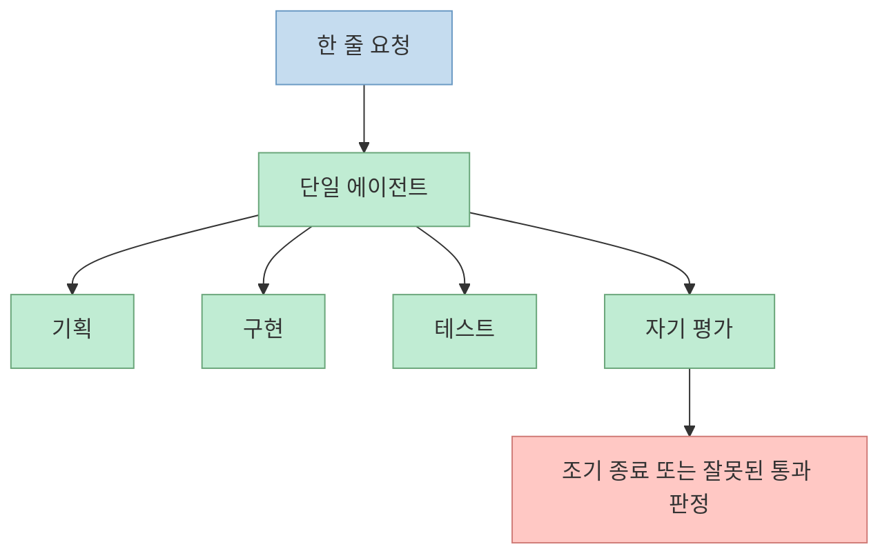
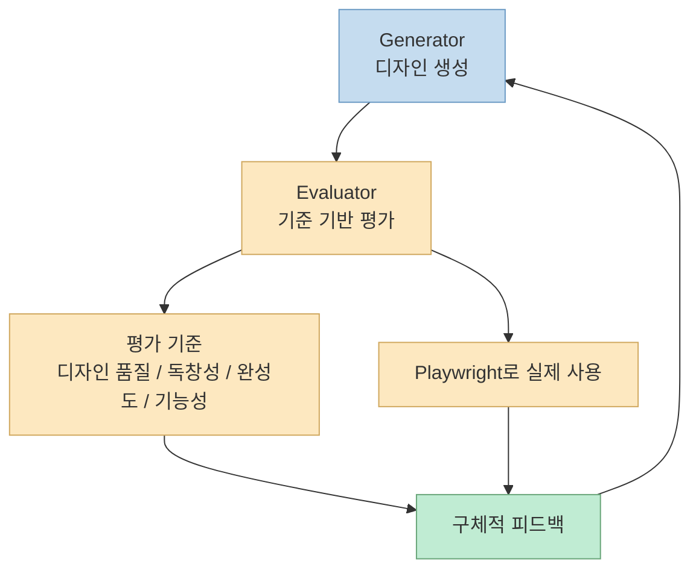
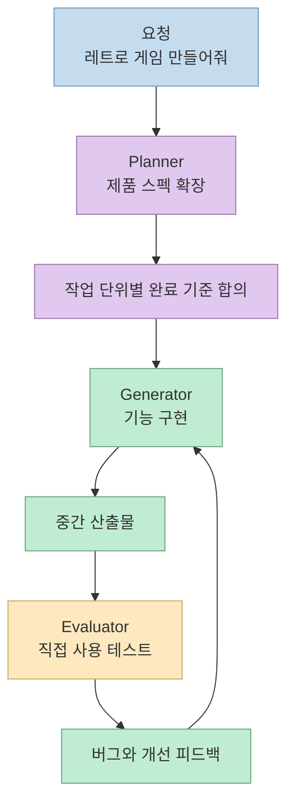
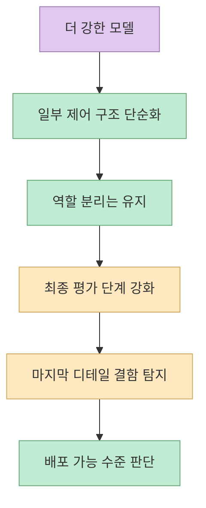

같은 모델에게 비슷한 수준의 일을 시켰는데 하나는 20분과 9달러만에 멈췄고, 다른 하나는 6시간과 200달러를 써서 실제로 플레이 가능한 결과물을 만들었다면 차이는 어디에서 생겼을까요? 이 영상의 핵심 주장은 모델 자체보다도 모델을 어떤 역할 구조와 검증 루프로 묶어 쓰느냐가 훨씬 큰 차이를 만든다는 데 있습니다.

영상은 이를 "하네스" 관점에서 설명합니다. 단일 에이전트에게 기획, 구현, 테스트, 자기평가를 모두 맡기면 실패 확률이 높아지고, 반대로 역할을 분리한 다중 에이전트 구조에 명확한 평가 기준과 도구를 붙이면 결과물의 품질이 급격히 올라간다는 이야기입니다.
<!--more-->

## Sources

- [영상: 앤트로픽이 공개한 $9 vs $200 실험 — 차이는 "하네스"였습니다](https://www.youtube.com/watch?v=yTUCyw6nAfQ)

## 1. 단일 에이전트가 실패하는 이유: 긴 작업일수록 기억도 판단도 흔들린다

영상은 먼저 사람들이 흔히 쓰는 방식, 즉 "AI 하나에게 다 시키는 방식"의 한계를 짚습니다. 설명에 따르면 단일 에이전트는 긴 대화를 이어 갈수록 앞선 맥락을 놓치기 쉽고, 아직 할 일이 남았는데도 스스로 "충분히 됐다"고 판단하며 너무 일찍 종료하는 경향을 보입니다. 영상에서는 이를 컨텍스트 관리 실패와 조기 종료 성향으로 묶어서 설명합니다. 이 문제가 생기면 처음에는 그럴듯해 보이는 산출물이 나와도 마지막 단계에서 핵심 기능이 비어 있거나 연결이 끊긴 상태로 끝날 수 있습니다. 근거 시점: [00:37](https://youtu.be/yTUCyw6nAfQ?t=37), [00:47](https://youtu.be/yTUCyw6nAfQ?t=47)

여기에 더 큰 문제가 하나 붙습니다. 단일 에이전트가 자기 결과물을 스스로 평가하면 지나치게 후해진다는 점입니다. 영상에서는 "게임 플레이가 안 되는데도 AI는 잘 됐다고 말한다"고 설명합니다. 즉 생성과 평가가 한 주체 안에 묶여 있으면, 실제 사용자 관점에서 치명적인 결함이 있어도 통과 판정이 내려질 수 있습니다. 이는 코드 품질 문제라기보다 검증 구조의 문제에 가깝습니다. 근거 시점: [01:00](https://youtu.be/yTUCyw6nAfQ?t=60), [01:16](https://youtu.be/yTUCyw6nAfQ?t=76)

이 구조에서 비용이 낮게 나오는 이유는 효율적이어서가 아니라, 검증되지 않은 상태에서 빨리 멈추기 때문일 수 있습니다. 영상 오프닝의 9달러 사례가 바로 그런 예로 제시됩니다. 플레이 버튼은 있지만 캐릭터가 움직이지 않는 게임은 "무언가를 만들었다"는 의미에서는 성공처럼 보일 수 있어도, 실제 사용자 작업을 끝낸 것은 아닙니다. 근거 시점: [00:06](https://youtu.be/yTUCyw6nAfQ?t=6), [00:13](https://youtu.be/yTUCyw6nAfQ?t=13), [04:12](https://youtu.be/yTUCyw6nAfQ?t=252)

## 2. 첫 번째 전환점: 생성과 평가를 분리하자 디자인 품질이 튀기 시작했다

영상에서 앤트로픽이 처음 실험한 대상은 웹사이트 디자인입니다. 여기서 핵심 문제의식은 "기능은 돌지만 다 비슷비슷한 AI 산출물"이 반복된다는 점입니다. 영상은 이를 AI 슬롭이라는 표현으로 설명하면서, 디자인처럼 주관적 판단이 들어가는 영역에서는 특히 생성자와 평가자를 분리해야 한다고 말합니다. 근거 시점: [01:19](https://youtu.be/yTUCyw6nAfQ?t=79), [01:27](https://youtu.be/yTUCyw6nAfQ?t=87), [01:36](https://youtu.be/yTUCyw6nAfQ?t=96)

여기서 가져온 아이디어는 generator와 evaluator의 분리입니다. 중요한 것은 evaluator가 막연히 "좋다/나쁘다"를 말하는 것이 아니라, 디자인 품질, 독창성, 완성도, 기능성이라는 기준을 가지고 점수를 매긴다는 점입니다. 특히 영상은 디자인 품질과 독창성 쪽의 비중을 더 두었다고 설명합니다. 즉 평가 구조를 정량화하고, AI가 잘하는 부분보다 잘 못하는 부분을 더 강하게 압박하도록 설계한 셈입니다. 근거 시점: [01:56](https://youtu.be/yTUCyw6nAfQ?t=116), [02:01](https://youtu.be/yTUCyw6nAfQ?t=121), [02:07](https://youtu.be/yTUCyw6nAfQ?t=127)

또 하나 중요한 포인트는 evaluator에게 브라우저 조작 도구를 준 부분입니다. 영상에서는 Playwright를 예로 들며, evaluator가 스크린샷을 찍고 버튼을 눌러 보고 페이지를 직접 탐색한 뒤 점수를 매긴다고 설명합니다. 이 지점이 중요합니다. 평가가 단순 텍스트 비평에서 끝나는 것이 아니라 실제 사용 행위로 바뀌기 때문입니다. "보기에 괜찮아 보인다"가 아니라 "직접 써 보니 여기서 깨진다"가 되면서 피드백의 밀도가 올라갑니다. 근거 시점: [02:14](https://youtu.be/yTUCyw6nAfQ?t=134), [02:23](https://youtu.be/yTUCyw6nAfQ?t=143)

영상이 제시하는 가장 인상적인 사례는 반복 10회차에서 나온 급격한 방향 전환입니다. 이전까지는 "예쁘지만 예상 가능한" 랜딩 페이지 수준이었는데, 특정 반복 이후 기존 디자인을 버리고 3D 미술관처럼 걸어 다니는 인터페이스로 바뀌었다고 설명합니다. 이 사례가 시사하는 바는, 평가 루프가 단순 오류 수정만 만드는 것이 아니라 탐색 공간 자체를 넓혀 줄 수 있다는 점입니다. 즉 하네스는 안정성을 위한 장치이면서 동시에 창의성 탐색 장치이기도 합니다. 근거 시점: [02:28](https://youtu.be/yTUCyw6nAfQ?t=148), [02:37](https://youtu.be/yTUCyw6nAfQ?t=157), [02:48](https://youtu.be/yTUCyw6nAfQ?t=168)

## 3. 제품 개발로 확장된 하네스: planner-generator-evaluator의 역할 분리

디자인 실험에서 가능성을 확인한 뒤, 영상은 이 구조가 실제 애플리케이션 제작으로 확장됐다고 설명합니다. 이 단계에서 에이전트는 둘이 아니라 셋이 됩니다. planner는 한 줄짜리 요구사항을 전체 제품 스펙으로 확장하고, generator는 그 스펙을 기준으로 기능을 구현하며, evaluator는 결과물을 직접 사용해 테스트합니다. 이 구조가 중요한 이유는 "무엇을 만들지"와 "어떻게 만들지"를 분리하기 때문입니다. 근거 시점: [02:56](https://youtu.be/yTUCyw6nAfQ?t=176), [03:01](https://youtu.be/yTUCyw6nAfQ?t=181), [03:11](https://youtu.be/yTUCyw6nAfQ?t=191)

영상은 planner에게 기술 구현 디테일까지 고정하지 않았다고 강조합니다. planner는 제품 수준의 요구와 범위를 정의하지만, 세부 구현 방법은 generator가 판단하게 둡니다. 이는 상위 계획 단계에서 잘못된 기술 결정을 내려 전체 구현을 오염시키는 위험을 줄이는 접근입니다. 다시 말해 planner는 상세 설계자가 아니라 요구사항 해상도를 올리는 역할에 가깝습니다. 근거 시점: [03:22](https://youtu.be/yTUCyw6nAfQ?t=202), [03:28](https://youtu.be/yTUCyw6nAfQ?t=208)

또한 generator와 evaluator는 각 작업 단위에 들어가기 전에 "완료 기준"을 미리 합의합니다. 이 장치는 다중 에이전트 구조에서 특히 중요합니다. 생성자는 무엇을 맞춰야 하는지 명확히 알고 들어가고, 평가자는 무엇을 근거로 실패를 판정할지 미리 정한 뒤 테스트하기 때문입니다. 즉 평가가 사후 감상평이 아니라 사전 계약 기반의 검수 절차가 됩니다. 근거 시점: [03:50](https://youtu.be/yTUCyw6nAfQ?t=230), [03:59](https://youtu.be/yTUCyw6nAfQ?t=239)

이 구조가 낸 결과로 영상은 200달러짜리 게임을 제시합니다. 설명에 따르면 이 결과물은 여러 작업 단위에 걸쳐 레벨 에디터, 스프라이트 에디터, 애니메이션, 사운드 효과, AI 기반 스프라이트 생성, AI 레벨 디자이너 같은 요소를 단계적으로 추가했고, 최종적으로는 캐릭터 이동과 점프가 가능한 상태까지 도달했습니다. 물론 거친 부분은 남아 있었지만, 최소한 핵심 플레이 루프는 작동했습니다. 이는 "기능 수가 많다"보다 "핵심 사용 시나리오가 살아 있다"는 점에서 의미가 큽니다. 근거 시점: [04:27](https://youtu.be/yTUCyw6nAfQ?t=267), [04:36](https://youtu.be/yTUCyw6nAfQ?t=276), [04:40](https://youtu.be/yTUCyw6nAfQ?t=280)

영상에서 evaluator 로그 예시도 중요합니다. 사각형 채우기 도구가 영역 전체를 채워야 한다는 기준이 있을 때, evaluator는 직접 드래그해 보고 "시작점과 끝점에만 타일이 놓이고 내부는 채워지지 않는다"는 식으로 버그를 구체적으로 지적합니다. 이런 식의 피드백은 단순히 "동작 안 함"보다 훨씬 강합니다. 실패 조건이 재현 가능하고 수정 방향도 명확하기 때문입니다. 결국 하네스의 가치 중 상당 부분은 생성보다도 검증 산출물의 품질에서 나옵니다. 근거 시점: [04:45](https://youtu.be/yTUCyw6nAfQ?t=285), [04:56](https://youtu.be/yTUCyw6nAfQ?t=296)

## 4. 더 좋은 모델이 나오면 하네스는 사라질까: 아니고, 오히려 재배치된다

영상 후반부는 더 강한 모델이 나오면 이런 복잡한 구조가 필요 없어지는지 묻습니다. 답은 "일부는 단순화되지만 하네스 자체는 사라지지 않는다"에 가깝습니다. 영상 설명에 따르면 더 강한 모델에서는 긴 작업 중 조기 종료 문제가 줄어들어, 이전처럼 잘게 나눈 작업 단위가 덜 필요해졌습니다. 그래서 구조 일부는 제거할 수 있었지만 planner, generator, evaluator라는 역할 분리는 유지됐습니다. 근거 시점: [04:59](https://youtu.be/yTUCyw6nAfQ?t=299), [05:20](https://youtu.be/yTUCyw6nAfQ?t=320), [05:30](https://youtu.be/yTUCyw6nAfQ?t=330)

이후 예시로 제시된 것은 브라우저에서 실행되는 DAW입니다. 영상은 한 줄 프롬프트에서 시작해 실제로 음악을 만들 수 있는 도구가 나왔고, 템포와 키를 지정해 멜로디나 드럼 트랙을 추가하도록 AI가 조작할 수 있었다고 설명합니다. 하지만 동시에 evaluator는 오디오 녹음 버튼이 실제로 동작하지 않거나 클립 드래그가 되지 않는 누락 기능도 잡아냈다고 말합니다. 모델이 좋아져도 마지막 디테일과 사용성 결함은 여전히 검증 단계에서 걸러야 한다는 뜻입니다. 근거 시점: [05:37](https://youtu.be/yTUCyw6nAfQ?t=337), [05:52](https://youtu.be/yTUCyw6nAfQ?t=352), [06:05](https://youtu.be/yTUCyw6nAfQ?t=365)

영상의 결론 문장을 빌리면, 모델이 좋아져도 하네스 조합의 가능성은 줄어들지 않고 이동할 뿐입니다. 이 표현은 꽤 정확합니다. 더 강한 모델은 기존에 필요했던 안전장치 일부를 덜어 주지만, 그만큼 더 큰 범위의 과업을 맡길 수 있게 만들어 새로운 수준의 조정, 검증, 역할 분해를 요구합니다. 따라서 "좋은 모델이 나오면 오케스트레이션은 필요 없다"는 가정은 현실적이지 않습니다. 필요 없어지는 것은 특정 전술이지, 구조 설계 자체가 아닙니다. 근거 시점: [06:13](https://youtu.be/yTUCyw6nAfQ?t=373), [06:31](https://youtu.be/yTUCyw6nAfQ?t=391)

## 핵심 요약

- 단일 에이전트는 긴 작업에서 맥락 손실과 조기 종료, 자기평가 편향 문제를 동시에 일으키기 쉽습니다.
- generator와 evaluator를 분리하고, evaluator에게 명시적 평가 기준과 실제 사용 도구를 주면 결과물의 품질이 크게 올라갑니다.
- planner를 추가하면 한 줄 요청을 구현 가능한 제품 스펙으로 확장할 수 있고, generator와 evaluator가 같은 완료 기준을 공유하면서 작업할 수 있습니다.
- 더 강한 모델은 하네스를 없애지 않습니다. 일부 단계를 단순화할 뿐, 역할 분리와 최종 검증의 중요성은 계속 남습니다.

## 결론

이 영상이 설득력 있게 보여 주는 지점은 "어떤 모델을 쓰느냐"보다 "그 모델을 어떤 작업 구조 안에 넣느냐"가 실제 산출물의 성공 여부를 좌우한다는 사실입니다. 특히 개발이나 제품 제작처럼 성공 기준이 여러 층으로 나뉘는 작업에서는, 좋은 프롬프트 하나보다 planner, generator, evaluator가 분리된 하네스와 명확한 검수 계약이 더 큰 차이를 만들 수 있습니다.

실무 관점에서 보면 이 메시지는 단순합니다. AI를 더 잘 쓰고 싶다면 모델 교체만 보지 말고, 역할 분리, 완료 기준, 도구 기반 평가, 피드백 루프를 먼저 설계해야 합니다. 영상의 9달러와 200달러 차이는 비용 차이이기 전에 검증 구조의 차이였습니다.
