거의 매일 Claude Code의 사용 방식을 바꾸는 새로운 오픈소스 프로젝트가 GitHub에 등장하고 있습니다. 노이즈를 걷어내고, Chase AI가 선별한 2026년 3월의 핵심 리포지토리 5개를 집중 분석합니다. 일부는 이미 들어봤겠지만, 몇 가지는 분명 놀랄 것입니다.

<!--more-->

## Sources

- https://youtu.be/6SnFH43qPAw

---

## 전체 지형도

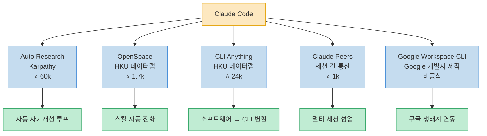

---

## Repo 1: Auto Research — Karpathy의 자동 자기개선 루프

[Auto Research](https://youtu.be/6SnFH43qPAw?t=30)는 Andrej Karpathy가 만든 리포지토리로, 출시 3주 만에 GitHub 스타 60,000개를 돌파했습니다. 한 마디로 **"머신러닝 알고리즘을 박스 안에 넣은 것"**입니다.

Claude Code를 특정 태스크에 연결하고, 자동으로 테스트를 반복 실행하며 자기 개선을 수행합니다. 점수가 올라가면 커밋, 내려가면 버립니다. 이 자동화된 시행착오를 통해 원하는 결과를 점진적으로 최적화합니다.

**Shopify CEO의 실전 결과:**

> [Toby(Shopify CEO)가 내부 모델에 Auto Research를 적용했습니다.](https://youtu.be/6SnFH43qPAw?t=80) 0.8B 파라미터의 소형 모델이었는데, 8시간 동안 37번의 실험을 자동으로 수행한 결과 **19% 효율 향상**을 달성했습니다.

### 머신러닝 30초 크래시 코스

Auto Research를 이해하려면 기본 ML 개념이 필요합니다.

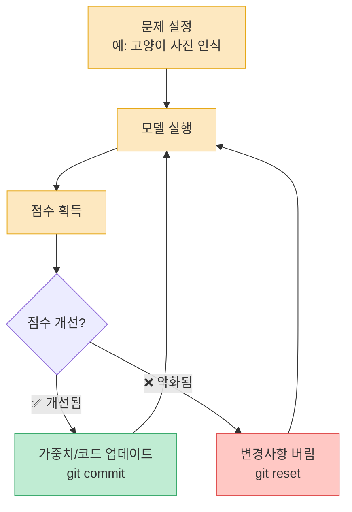

### 3개의 핵심 파일

[Auto Research의 구조는 3개 파일로 이루어져 있습니다.](https://youtu.be/6SnFH43qPAw?t=120)

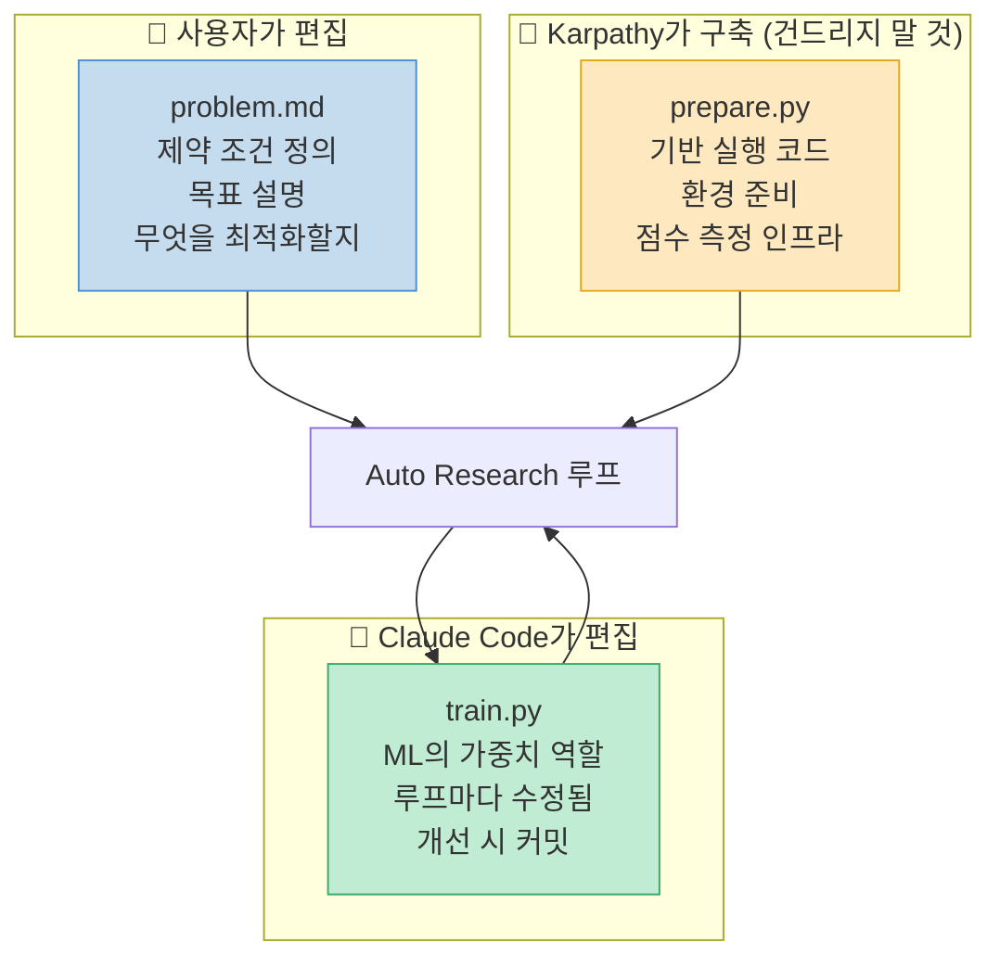

### 언제 쓰고 언제 쓰지 말아야 하나

[모든 태스크가 Auto Research에 적합하지는 않습니다.](https://youtu.be/6SnFH43qPAw?t=240) **이진(yes/no) 점수로 측정할 수 없는 것**은 사용 불가입니다.

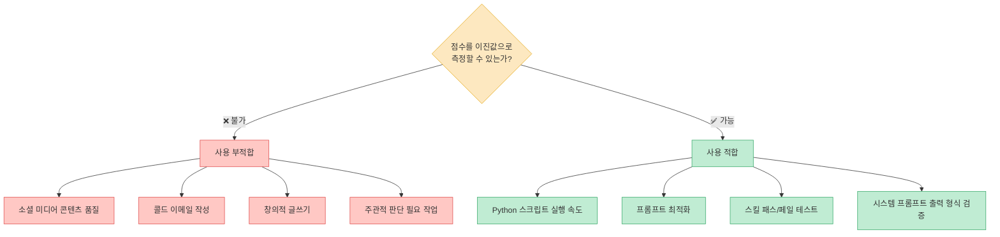

**실제 성과:** [첫 번째 예시에서 83번 실험, 15번 채택 개선](https://youtu.be/6SnFH43qPAw?t=320)이 이루어졌습니다. 모든 실험이 개선으로 이어지지 않는 것이 정상입니다.

---

## Repo 2: OpenSpace — 스킬 자동 진화 시스템

[OpenSpace는 HKU(홍콩대학교 데이터 인텔리전스 랩)가 만든](https://youtu.be/6SnFH43qPAw?t=380) 스킬 자동 개선·진화 시스템입니다. Lightra, Nanobot, Rag Anything, Deep Code 등을 만든 팀으로, 출시 4일 만에 GitHub 스타 1,700개를 돌파했습니다.

핵심 아이디어: **MCP 서버가 스킬 사용 현황을 추적하고 품질 모니터링을 수행한 뒤, 자동으로 개선**합니다.

### 3개 버킷 분류 시스템

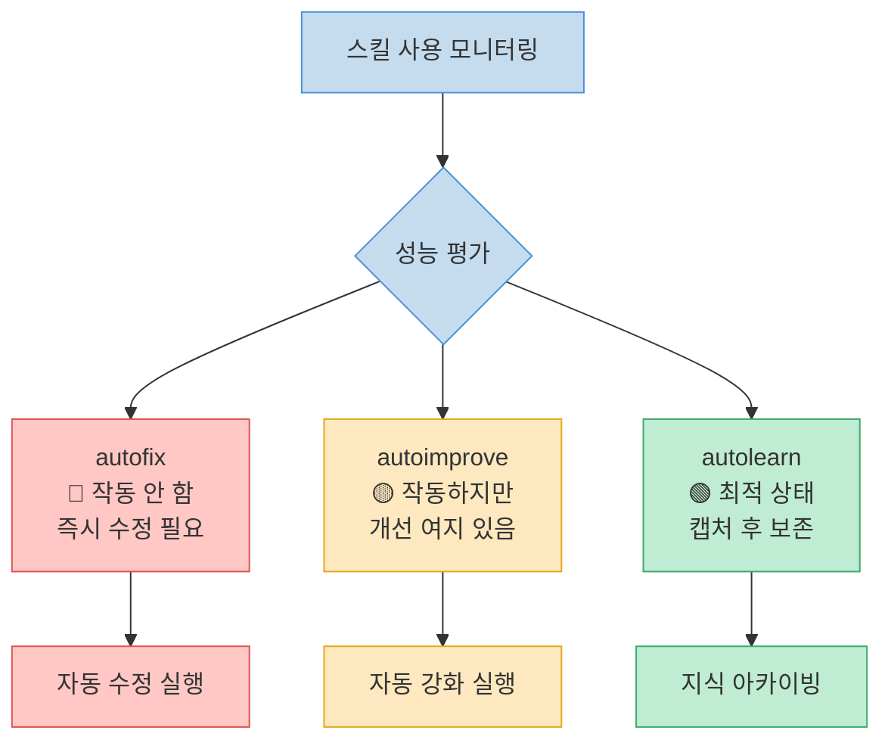

### 성능 지표

[테스트 결과는 인상적입니다.](https://youtu.be/6SnFH43qPAw?t=455)

| 지표 | 결과 |
|---|---|
| **토큰 절감** | 46% fewer tokens on real-world tasks |
| **소득 증가** | 4.2배 higher income |
| **가치 포착** | 73% value capture |
| **품질** | 70% (vs 기준 40%) |
| **테스트 규모** | 220개 실제 업무 × 44개 직종 |

**자동 성장 데모:** [초기 6개의 스킬에서 시작해 시스템이 자동으로 54개를 추가, 최종 60개 스킬로 성장](https://youtu.be/6SnFH43qPAw?t=500)했습니다.

---

## Repo 3: CLI Anything — 모든 것을 CLI로

[CLI Anything도 HKU 데이터랩이 만들었으며, 2026년 3월 초 출시 후 GitHub 스타 24,000개](https://youtu.be/6SnFH43qPAw?t=535)를 기록했습니다. Claude Code 생태계에서 **MCP에서 CLI로의 전환 트렌드**에 올라탄 도구입니다.

**핵심 기능:** 오픈소스 프로젝트를 가리키면 자동으로 CLI 도구로 변환해줍니다.

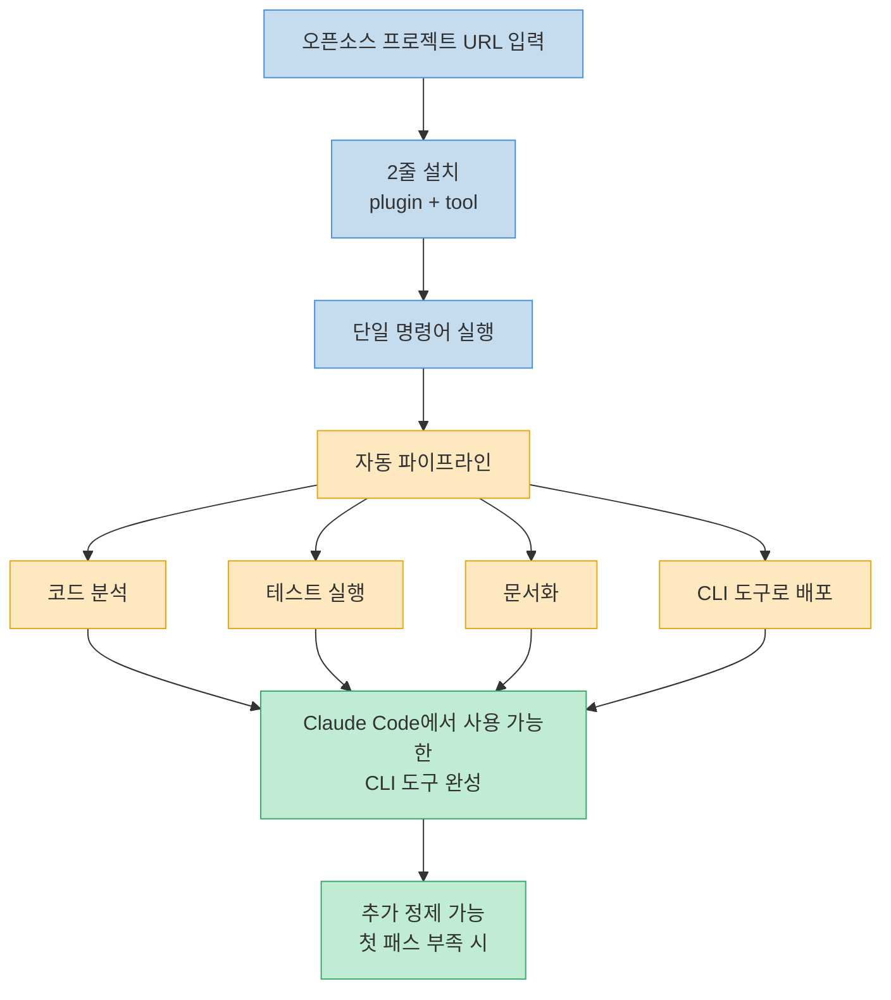

**검증된 소프트웨어:** Blender, Audacity, OBS, Zoom, draw.io에 이미 적용 완료.

**왜 중요한가:** [Claude Code가 상호작용할 수 없었던 소프트웨어들을 터미널로 제어 가능하게 만들어, 에이전트-소프트웨어 간격을 좁혀줍니다.](https://youtu.be/6SnFH43qPAw?t=600) 한 번 CLI를 만들면 계속 정제할 수 있고, 첫 패스에서 원하는 기능이 없으면 추가 기능을 붙일 수 있습니다.

---

## Repo 4: Claude Peers — 세션 간 통신

[Claude Peers는 지난주 출시된 신생 프로젝트로, GitHub 스타 1,000개를 넘었습니다.](https://youtu.be/6SnFH43qPAw?t=640) 핵심 아이디어: **여러 Claude Code 인스턴스가 서로를 발견하고 대화**할 수 있게 합니다.

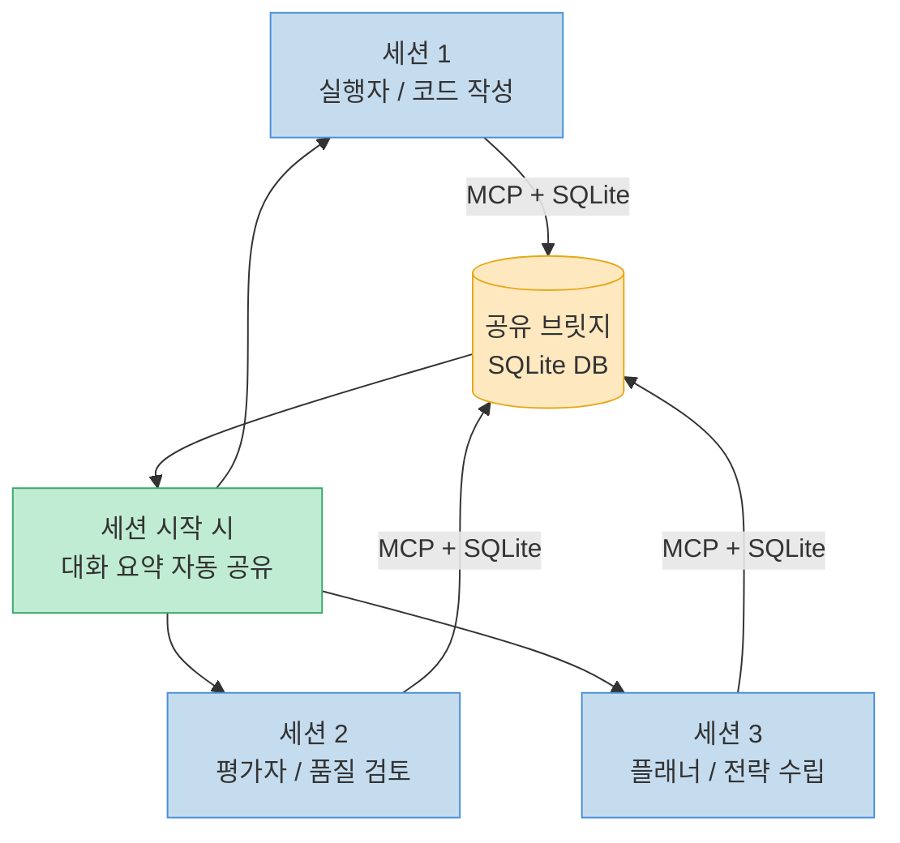

### Anthropic 멀티세션 Harness 아티클과의 연계

[Anthropic이 3월 24일 발표한 아티클](https://youtu.be/6SnFH43qPAw?t=680)은 장기 실행 애플리케이션 개발을 위한 하네스 구조를 제안했습니다.

**핵심 인사이트:** Claude Code는 자신의 작업을 스스로 평가하는 데 취약합니다. 자기 작업에 과도하게 긍정적입니다. 특히 프론트엔드 디자인, 게임 개발 같은 복잡한 프로젝트에서 이 문제가 두드러집니다.

**제안 솔루션:**

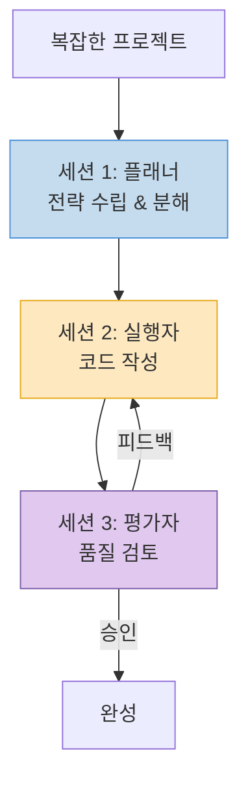

[Claude Peers를 이 Harness 구조에 결합하면](https://youtu.be/6SnFH43qPAw?t=730), 실행자 세션과 평가자 세션이 자동으로 통신하며 하네스가 거의 자동으로 구성됩니다.

---

## Repo 5: Google Workspace CLI — 구글 전체 생태계 연동

[Google Workspace CLI는 Google 개발자들이 직접 만들었지만 공식 Google 제품은 아닙니다.](https://youtu.be/6SnFH43qPAw?t=760) Claude Code에게 구글 전체 생태계에 대한 접근권을 부여합니다.

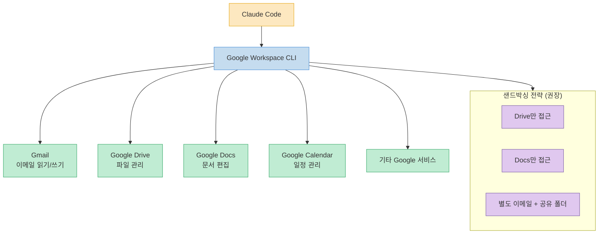

**설치 전 권장 접근법:** 모든 서비스를 한꺼번에 연결하지 말고, Claude Code에게 저장소를 클론하게 한 뒤 **어떤 스킬이 자신에게 맞는지 먼저 파악**한 후 필요한 것만 설치하세요.

### 프롬프트 인젝션 방어: Model Armor

[Gmail 연동 시 가장 큰 우려는 프롬프트 인젝션입니다.](https://youtu.be/6SnFH43qPAw?t=870) Google의 **Model Armor**가 이를 해결합니다.

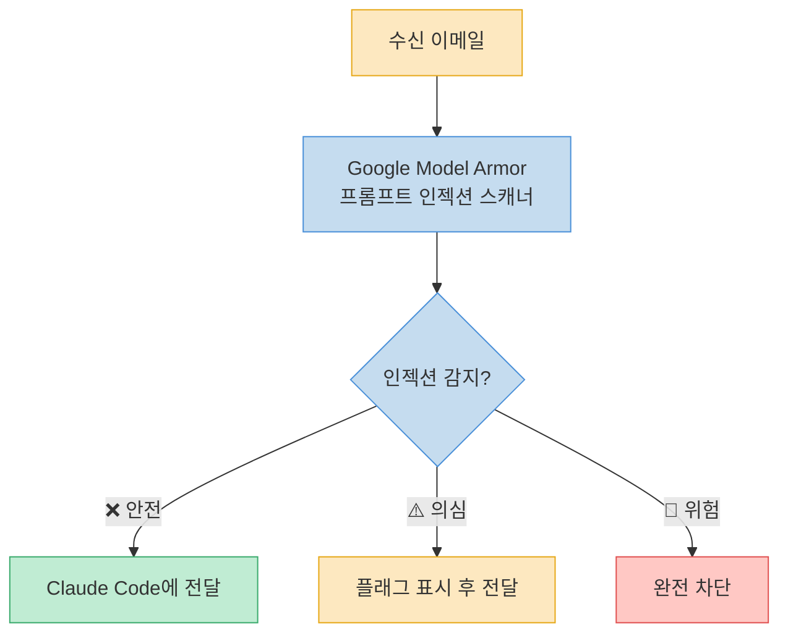

---

## 핵심 요약

| # | 리포지토리 | 제작사 | 스타 | 핵심 가치 |
|---|---|---|---|---|
| 1 | **Auto Research** | Karpathy | ⭐ 60k | 자동 자기개선 루프 |
| 2 | **OpenSpace** | HKU 데이터랩 | ⭐ 1.7k | 스킬 자동 진화 (46% 토큰 절감) |
| 3 | **CLI Anything** | HKU 데이터랩 | ⭐ 24k | 소프트웨어 → CLI 변환 |
| 4 | **Claude Peers** | 커뮤니티 | ⭐ 1k | 멀티 세션 간 통신 |
| 5 | **Google Workspace CLI** | Google 개발자 | — | 구글 생태계 전체 연동 |

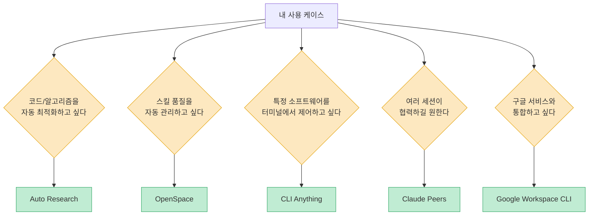

---

## 결론

2026년 3월 한 달 동안 Claude Code 생태계는 폭발적으로 성장했습니다. Auto Research는 ML적 자기개선을 AI에 적용했고, OpenSpace는 스킬 자체를 진화시키며, CLI Anything은 소프트웨어 장벽을 허물고, Claude Peers는 멀티 에이전트 협업을 현실화했으며, Google Workspace CLI는 일상 생산성 도구를 연결합니다.

이 다섯 가지 중 하나라도 지금 당장 적용한다면, Claude Code는 지금과 완전히 다른 도구가 될 것입니다.
