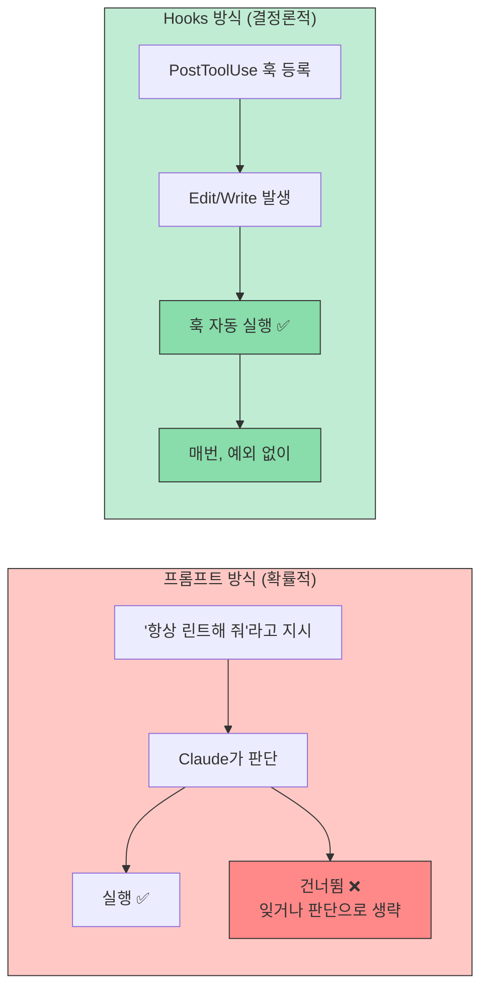
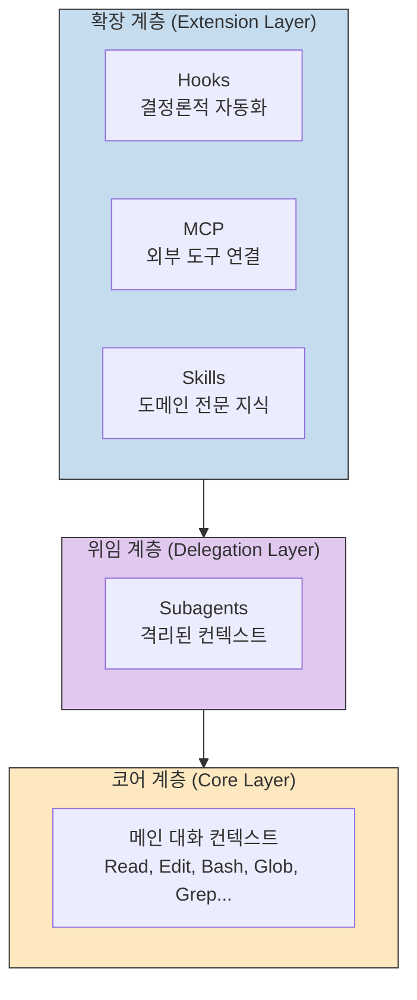
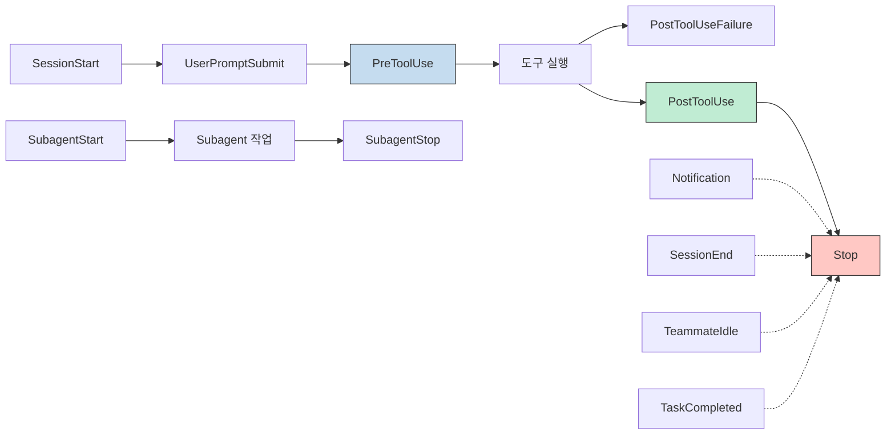
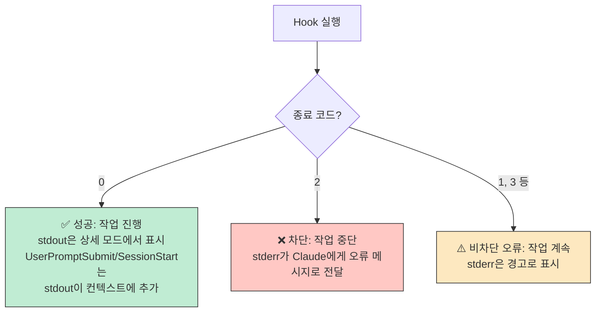
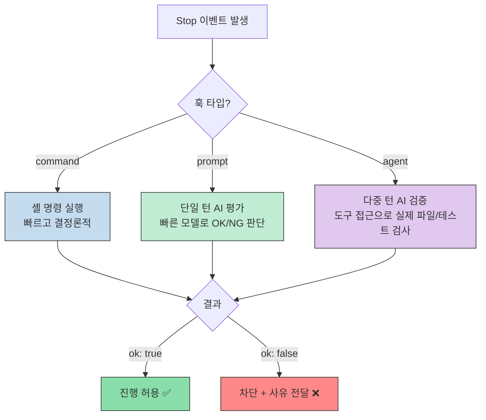
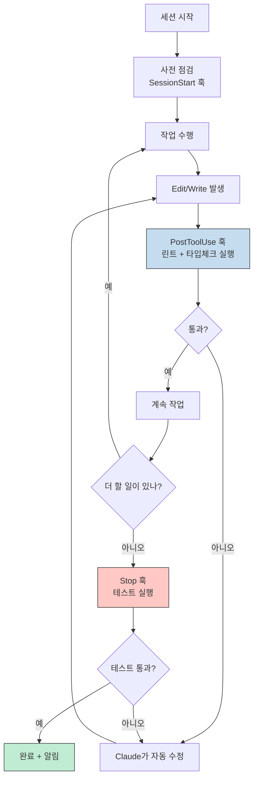
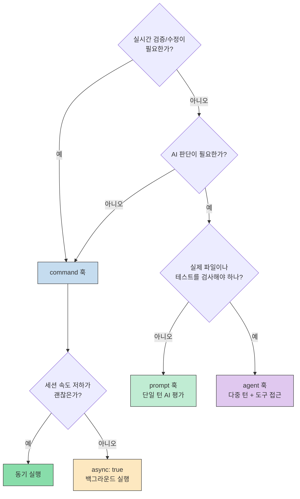

Claude Code에서 "파일 편집 후 항상 Prettier를 실행해 줘"라고 프롬프트하면 어떻게 될까요? 가끔은 작동하지만, Claude가 잊거나 속도를 우선시하거나 변경이 "너무 작다"고 판단하면 건너뜁니다. **Hooks** 는 이 문제를 근본적으로 해결합니다. 모델의 동작과 관계없이 특정 시점에 셸 명령을 **반드시** 실행하는 결정론적 자동화 시스템입니다.

이 글은 Blake Crosley의 [Claude Code CLI: The Definitive Technical Reference](https://blakecrosley.com/ko/guides/claude-code#hooks%EB%8A%94-%EC%96%B4%EB%96%BB%EA%B2%8C-%EC%9E%91%EB%8F%99%ED%95%98%EB%82%98%EC%9A%94)를 핵심 참고 자료로 활용하여, Hooks 시스템의 전체 구조와 실전 활용법을 정리합니다.

<!--more-->

## Sources

- https://blakecrosley.com/ko/guides/claude-code#hooks%EB%8A%94-%EC%96%B4%EB%96%BB%EA%B2%8C-%EC%9E%91%EB%8F%99%ED%95%98%EB%82%98%EC%9A%94 (http)

## Hooks가 필요한 이유: 프롬프트 vs Hooks



프롬프트는 "부탁"이고, **Hooks** 는 "규칙"입니다. 컴플라이언스, 보안, 팀 표준에서는 결정론적 실행이 확률적 실행보다 우수합니다.

## Hooks 시스템 아키텍처

Claude Code는 세 개의 계층으로 작동하며, Hooks는 **확장 계층(Extension Layer)** 에 위치합니다.



## 14개 라이프사이클 이벤트

Hooks는 Claude Code 워크플로우의 특정 시점에서 트리거됩니다. 각 이벤트의 타이밍과 차단 가능 여부를 이해하는 것이 핵심입니다.



| 이벤트 | 타이밍 | 차단 가능 | 주요 용도 |
| --- | --- | --- | --- |
| `PreToolUse` | 도구 실행 **전** | ✅ 예 | 검증, 로깅, 작업 차단 |
| `PostToolUse` | 도구 완료 **후** | 아니요 | 출력 포매팅, 린터 실행 |
| `PostToolUseFailure` | 도구 실패 **후** | 아니요 | 실패 로깅, 교정 피드백 |
| `UserPromptSubmit` | 프롬프트 전송 시 | ✅ 예 | 컨텍스트 주입, 입력 검증 |
| `Notification` | 알림 트리거 시 | 아니요 | 커스텀 알림 처리 |
| `Stop` | 응답 완료 시 | ✅ 예 | 완료 기준 강제 |
| `SubagentStart` | Subagent 생성 시 | 아니요 | 컨텍스트 주입 |
| `SubagentStop` | Subagent 완료 시 | ✅ 예 | 품질 게이트 |
| `TeammateIdle` | 팀원 유휴 시 | ✅ 예 | 품질 게이트 (v2.1.33+) |
| `TaskCompleted` | 작업 완료 시 | ✅ 예 | 완료 기준 강제 (v2.1.33+) |
| `SessionStart` | 세션 시작 시 | 아니요 | 환경 설정, 컨텍스트 로드 |
| `SessionEnd` | 세션 종료 시 | 아니요 | 정리, 최종 로깅 |
| `PreCompact` | 컨텍스트 압축 전 | 아니요 | 검증, 로깅 |
| `PermissionRequest` | 권한 대화상자 표시 시 | ✅ 예 | 커스텀 승인 로직 |

## Hook 설정: settings.json

Hooks는 `settings.json`의 `hooks` 키에 정의합니다. 계층 구조의 어느 레벨에도 배치할 수 있습니다.

```json
{
  "hooks": {
    "PostToolUse": [
      {
        "matcher": "Edit|Write",
        "hooks": [
          {
            "type": "command",
            "command": "npx prettier --write \"$FILE_PATH\""
          }
        ]
      }
    ],
    "PreToolUse": [
      {
        "matcher": "Bash",
        "hooks": [
          {
            "type": "command",
            "command": ".claude/hooks/validate-bash.sh"
          }
        ]
      }
    ],
    "UserPromptSubmit": [
      {
        "matcher": "",
        "hooks": [
          {
            "type": "command",
            "command": ".claude/hooks/inject-context.sh"
          }
        ]
      }
    ]
  }
}
```

**설정 계층에서의 위치:**

| 레벨 | 위치 | 범위 |
| --- | --- | --- |
| 엔터프라이즈 | `managed-settings.json` | 모든 사용자, 재정의 불가 |
| 사용자 | `~/.claude/settings.json` | 모든 프로젝트 |
| 공유 프로젝트 | `.claude/settings.json` | 팀 전체 (git 공유) |
| 로컬 프로젝트 | `.claude/settings.local.json` | 개인용 |

## 매처(Matcher): 어떤 도구에 반응할까?

`matcher` 필드는 어떤 도구가 hook을 트리거할지 결정합니다.

```json
{"matcher": "*"}              // 모든 도구에 매칭
{"matcher": "Bash"}           // Bash만 매칭
{"matcher": "Edit|Write"}     // Edit 또는 Write에 매칭
{"matcher": "mcp__github"}    // MCP 서버 도구에 매칭
{"matcher": ""}               // 도구 없는 이벤트에 매칭 (UserPromptSubmit 등)
```

## Hook 입출력 프로토콜

Hooks는 **stdin으로 JSON** 을 수신하고, **종료 코드** 로 동작을 제어합니다.

### 입력 (stdin JSON)

```json
{
  "tool_name": "Bash",
  "tool_input": {
    "command": "npm test",
    "description": "Run test suite"
  },
  "session_id": "abc-123"
}
```

v2.1.47+에서 `Stop`/`SubagentStop` hooks는 `last_assistant_message` 필드를 추가로 수신합니다:

```json
{
  "session_id": "abc-123",
  "last_assistant_message": "I've completed the refactoring. Here's what changed..."
}
```

### 종료 코드 제어



### JSON 출력으로 고급 제어

Hook은 JSON을 출력하여 더 풍부한 제어가 가능합니다:

```json
{
  "hookSpecificOutput": {
    "hookEventName": "PreToolUse",
    "permissionDecision": "allow",
    "permissionDecisionReason": "Command validated and modified",
    "updatedInput": {
      "command": "npm test -- --coverage --ci"
    },
    "additionalContext": "Note: This database has a 5-second query timeout."
  }
}
```

| 필드 | 값 | 설명 |
| --- | --- | --- |
| `permissionDecision` | `"allow"`, `"deny"`, `"ask"` | 허용/차단/사용자 확인 요청 |
| `permissionDecisionReason` | 문자열 | 사용자에게 표시되거나 Claude에게 전달되는 메시지 |
| `updatedInput` | 객체 | 실행 전 도구 입력을 수정 |
| `additionalContext` | 문자열 | Claude의 컨텍스트에 주입 |

## 실전 Hook 예제

### 1. 편집 후 TypeScript 파일 자동 포매팅

```json
{
  "hooks": {
    "PostToolUse": [
      {
        "matcher": "Edit|Write",
        "hooks": [
          {
            "type": "command",
            "command": "bash -c '[[ \"$FILE_PATH\" == *.ts ]] && npx prettier --write \"$FILE_PATH\" || true'"
          }
        ]
      }
    ]
  }
}
```

### 2. 민감한 파일 접근 차단

```bash
#!/bin/bash
# .claude/hooks/protect-files.sh
data=$(cat)
path=$(echo "$data" | jq -r '.tool_input.file_path // empty')

if [[ "$path" == *".env"* ]] || [[ "$path" == *"secrets/"* ]] || [[ "$path" == *".pem"* ]]; then
  echo "Blocked: Cannot access sensitive file $path" >&2
  exit 2  # Exit 2 = 차단. Exit 1 = 비차단 오류
fi
exit 0
```

### 3. 모든 Bash 명령 로깅

```json
{
  "hooks": {
    "PreToolUse": [
      {
        "matcher": "Bash",
        "hooks": [
          {
            "type": "command",
            "command": "jq -r '.tool_input.command' >> ~/.claude/bash-history.log"
          }
        ]
      }
    ]
  }
}
```

### 4. 프롬프트에 동적 컨텍스트 주입

```bash
#!/bin/bash
# .claude/hooks/inject-context.sh
# Add current git branch and recent commits to every prompt

branch=$(git branch --show-current 2>/dev/null)
commits=$(git log --oneline -3 2>/dev/null | tr '\n' ' ')

if [ -n "$branch" ]; then
  echo "[Context: Branch '$branch', Recent: $commits]"
fi
exit 0
```

### 5. 커스텀 알림 시스템

```json
{
  "hooks": {
    "Notification": [
      {
        "matcher": "",
        "hooks": [
          {
            "type": "command",
            "command": "notify-send 'Claude Code' 'Waiting for your input'"
          }
        ]
      }
    ]
  }
}
```

### 6. 코드 변경 후 테스트 실행

```json
{
  "hooks": {
    "PostToolUse": [
      {
        "matcher": "Edit",
        "hooks": [
          {
            "type": "command",
            "command": "bash -c '[[ \"$FILE_PATH\" == *.test.ts ]] || npm run test:affected'"
          }
        ]
      }
    ]
  }
}
```

## 비동기 Hooks (v2.1.32+)

Hook에 `"async": true`를 추가하면 Claude Code의 실행을 차단하지 않고 백그라운드에서 실행할 수 있습니다.

```json
{
  "hooks": {
    "PostToolUse": [
      {
        "matcher": "Edit|Write",
        "hooks": [
          {
            "type": "command",
            "command": ".claude/hooks/notify-slack.sh",
            "async": true
          }
        ]
      }
    ]
  }
}
```

**비동기 훅을 사용해야 할 때:**
- 세션 속도를 저하시키지 않아야 하는 알림 (Slack, 이메일)
- 백그라운드 로깅 및 텔레메트리
- 비핵심 후처리 (분석, 백업)

**비동기 훅을 사용하면 안 되는 경우:**
- 포매팅 (다음 편집 전에 완료되어야 함)
- 검증 (실패 시 차단해야 함)
- 도구 입출력을 수정해야 하는 모든 훅

## 프롬프트 기반 & 에이전트 기반 Hooks

셸 명령(`type: "command"`) 외에도, AI 추론을 사용하는 두 가지 훅 유형이 있습니다.

### 프롬프트 훅 (type: "prompt")

빠른 Claude 모델에 단일 턴 프롬프트를 전송합니다:

```json
{
  "hooks": {
    "Stop": [
      {
        "hooks": [
          {
            "type": "prompt",
            "prompt": "Evaluate if Claude should stop: $ARGUMENTS. Check if all requested tasks are complete and tests pass.",
            "timeout": 30
          }
        ]
      }
    ]
  }
}
```

### 에이전트 훅 (type: "agent")

도구 접근 권한을 가진 subagent를 생성하여 다중 턴 검증을 수행합니다:

```json
{
  "hooks": {
    "Stop": [
      {
        "hooks": [
          {
            "type": "agent",
            "prompt": "Verify all unit tests pass. Run the test suite and check results. $ARGUMENTS",
            "timeout": 120
          }
        ]
      }
    ]
  }
}
```



## Hook 환경 변수

| 변수 | 사용 가능 위치 | 설명 |
| --- | --- | --- |
| `$CLAUDE_PROJECT_DIR` | 모든 훅 | 프로젝트 루트 디렉토리 |
| `$CLAUDE_ENV_FILE` | SessionStart만 | 환경 변수 유지용 파일 경로 |
| `$CLAUDE_CODE_REMOTE` | 모든 훅 | 원격 환경에서 `"true"` |
| `${CLAUDE_PLUGIN_ROOT}` | 플러그인 훅 | 플러그인의 루트 디렉토리 |

SessionStart에서 환경 변수를 유지하려면:

```bash
#!/bin/bash
if [ -n "$CLAUDE_ENV_FILE" ]; then
  echo 'export NODE_ENV=production' >> "$CLAUDE_ENV_FILE"
fi
exit 0
```

## 야간 자율 세션 전략

Hooks를 가드레일로 사용하면 Claude가 장시간 무인으로 올바른 방향을 유지할 수 있습니다.



```json
{
  "hooks": {
    "PostToolUse": [
      {
        "matcher": "Edit",
        "hooks": [
          {
            "type": "command",
            "command": "npm run lint && npm run typecheck",
            "timeout": 60000
          }
        ]
      }
    ],
    "Stop": [
      {
        "hooks": [
          {
            "type": "command",
            "command": "npm test || echo 'Tests failing - Claude should fix before stopping'"
          }
        ]
      }
    ]
  }
}
```

샌드박스 컨테이너에서 `--dangerously-skip-permissions`와 결합하면 완전 자율적인 야간 실행이 가능합니다. Claude는 테스트가 통과하거나 선택지가 소진될 때까지 계속 반복합니다.

## 컴포넌트 스코프 Hooks (v2.1.0+)

Hooks는 Skills, Subagents, 슬래시 명령의 프론트매터에서도 직접 정의할 수 있습니다. 해당 컴포넌트가 활성화된 경우에만 실행됩니다.

```yaml
---
name: secure-deployment
description: Deployment skill with security validation
hooks:
  PreToolUse:
    - matcher: Bash
      command: ".claude/hooks/validate-deploy.sh"
  PostToolUse:
    - matcher: Bash
      command: ".claude/hooks/log-deploy.sh"
  Stop:
    - command: ".claude/hooks/cleanup.sh"
      once: true  # 세션당 한 번만 실행
---
```

`once` 옵션은 skills와 슬래시 명령에서만 사용 가능하며, 정리나 마무리 작업에 유용합니다.

## Hook 디버깅

문제 해결을 위해 디버그 모드를 활성화하세요:

```bash
claude --debug
```

디버그 모드에서 로깅되는 항목:
- Hook 실행 시간
- 입출력 데이터
- 오류 메시지 및 스택 트레이스
- 의사결정 결과 (allow/reject/ask)

## 세 가지 Hook 유형 선택 가이드



## 요약: Hooks 핵심 정리

| 구분 | 내용 |
| --- | --- |
| **핵심 원칙** | Hooks는 모델 동작과 관계없이 **반드시 실행** 됩니다 |
| **설정 위치** | `settings.json`의 `hooks` 키 |
| **이벤트 수** | 14개 라이프사이클 이벤트 |
| **입력** | stdin으로 JSON 수신 |
| **출력** | 종료 코드 (0=성공, 2=차단, 1=경고) + JSON 출력 |
| **훅 유형** | `command`, `prompt`, `agent` 세 가지 |
| **비동기** | `async: true`로 백그라운드 실행 가능 |
| **디버깅** | `claude --debug` |

**기억하세요:** 반드시 실행되어야 하는 작업에는 Hooks를, 그렇지 않은 작업에는 프롬프트를 사용하세요. 이것이 Claude Code를 "좋아하는" 것과 "마스터하는" 것의 차이입니다.
