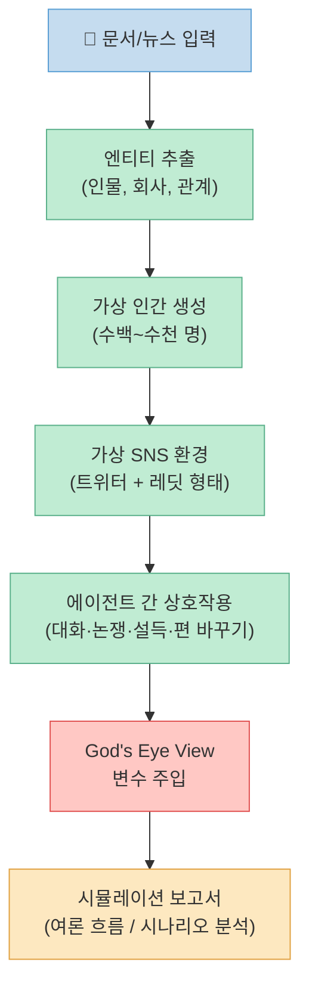
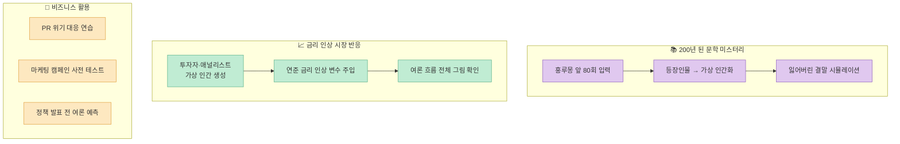
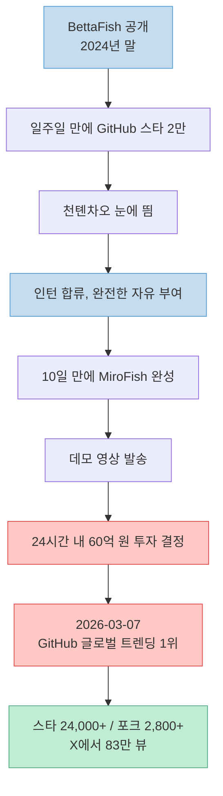

대학생 한 명이 10일 만에 만든 AI가 GitHub 세계 1위를 찍었습니다.

**MiroFish**라는 프로젝트입니다. 문서 하나를 넣으면 수천 명의 가상 인간을 만들어내고, 이 사람들이 서로 대화하고, 논쟁하고, 편을 바꾸면서 "앞으로 어떤 일이 벌어질지"를 시뮬레이션해줍니다.

과거에는 연구실 전체가 필요했던 시스템을, 22살 개발자 한 명이 만들어냈습니다. GitHub 스타 2만 4천 개, 포크 2,800개, X에서 83만 뷰.

<!--more-->

> 원본: [@unclejobs.ai on Threads](https://www.threads.com/@unclejobs.ai/post/DWZHibYkg1s)

---

## 궈항장, 그는 누구인가

온라인에서는 **BaiFu**라는 닉네임을 씁니다. 베이징우편전신대학교 4학년, 나이 22세.

첫 프로젝트 **BettaFish**(AI로 여론을 분석하는 도구)가 2024년 말에 GitHub에서 화제가 됐습니다. 일주일 만에 스타 2만 개. 이걸 눈여겨본 사람이 있었습니다.

**천톈차오.** 성다그룹 창업자. 한때 중국에서 가장 부자였던 사람입니다. 2000년대 초반에 게임 회사로 대박을 치고, 이후 미국으로 건너가서 테크 투자를 하고 있습니다.

천톈차오가 요즘 밀고 있는 생각이 하나 있습니다. **"슈퍼 개인."** AI 시대에는 한 사람이 예전에 회사 하나가 해야 했던 일을 해낼 수 있다는 것입니다. 궈항장을 보고 "이게 바로 그 증거다"라고 생각한 것이죠.

---

## 10일 만에, 60억 원 투자 결정

천톈차오가 궈항장을 인턴으로 불렀습니다. "하고 싶은 거 해봐"라고 완전한 자유를 줬습니다.

궈항장은 10일 만에 MiroFish를 만들었습니다. 본인 말로는 **"바이브코딩"** — 빠르게, 직관적으로, 너무 복잡하게 안 만들고.

완성한 그날 밤, 데모 영상을 찍어서 천톈차오에게 보여줬습니다. **24시간 안에 3,000만 위안(약 60억 원) 투자가 결정됐습니다.**

인턴이 하룻밤 만에 CEO가 됐습니다.

---

## MiroFish는 무엇을 하는가

각 단계를 좀 더 자세히 보면:

**1단계 — 엔티티 추출** 
뉴스 기사 하나를 입력하면, 그 안에 나오는 모든 사람, 회사, 관계를 뽑아냅니다.

**2단계 — 가상 인간 생성** 
추출된 정보를 바탕으로 성격이 다른 가상 인간을 수백~수천 명 만들어냅니다. 낙관적인 투자자, 신중한 애널리스트, 경쟁사를 의식하는 임원 등.

**3단계 — 가상 SNS에 배치** 
가상 인간들을 트위터 + 레딧 형태의 가상 공간에 풀어놓습니다. 서로 대화하고, 논쟁하고, 설득하고, 편을 바꿉니다.

**4단계 — God's Eye View** 
시뮬레이션 중간에 새 변수를 던질 수 있습니다:
- "만약 미국이 관세를 올리면?"
- "만약 CEO가 갑자기 사임하면?"
- "만약 경쟁사가 먼저 제품을 출시하면?"

변수를 주입하면 수천 명 가상 인간이 실시간으로 반응합니다. 여론이 바뀌고, 새로운 연합이 생기고, 예상 못 한 패턴이 출현합니다.

**5단계 — 보고서 생성** 
시뮬레이션 종료 후 AI가 여론 흐름, 영향력 인물, 유력 시나리오를 분석한 보고서를 만들어줍니다. 가상 인간에게 직접 "왜 의견을 바꿨어?"라고 질문도 가능합니다.

**한마디로: 미래를 미리 돌려보는 디지털 샌드박스.**

---

## 실제 활용 사례

---

## 한계와 주의사항

흥분하기 전에 냉정하게 볼 것들도 있습니다.

- **검증 데이터 없음**: 예측 결과와 실제 결과를 비교한 데이터가 없습니다.
- **편향 증폭**: CAMEL-AI 연구팀 논문에서도 지적했듯, AI 가상 인간은 실제 사람보다 군중 행동에 더 취약합니다. 여론이 현실보다 빠르게 한쪽으로 쏠릴 수 있습니다.
- **훈련 데이터 편향 상속**: 가상 인간의 성격이 AI 훈련 데이터의 편향을 물려받습니다.
- **API 비용**: 수천 명 시뮬레이션 시 비용이 상당히 나옵니다.
- **초기 단계**: 현재 버전은 **v0.1.2**입니다.

그래도 가치가 있는 이유: "혼자서는 생각 못 했을 시나리오"를 보여주는 도구이기 때문입니다. **정확한 답이 아닌, 놓칠 수 있는 가능성을 표면화하는 도구** 로 봐야 합니다.

---

## 왜 화제인가

- 2026년 3월 7일: **GitHub 글로벌 트렌딩 1위**
- GitHub 스타 **2만 4천 개**, 포크 **2,800개**
- X(트위터)에서 **83만 뷰**
- 완전 오픈소스 (AGPL-3.0)
- 라이브 데모 제공 중

---

## 슈퍼 개인의 시대

댓글 중에 이런 표현이 있었습니다.

> "연구실 전체가 필요했던 걸 22살 한 명이 10일 만에 만든 것이 이 시대의 레버리지"

천톈차오가 60억 원을 건 건 이 소프트웨어가 아닙니다. **'슈퍼 개인의 시대가 이미 시작됐다'는 믿음에 건 것입니다.**

MiroFish가 완벽한 예측 도구인지는 아직 모릅니다. 하지만 "혼자 빠르게, 직관적으로 만든다"는 바이브코딩 방식이 어디까지 갈 수 있는지를 보여준 사례임은 분명합니다.

---

## 관련 링크

- GitHub: [github.com/666gh/MiroFish](https://github.com/666gh/MiroFish)
- 라이브 데모: [mirofish.ai](https://mirofish.ai)
- 데모 페이지: [mirofish-demo.pages.dev](https://mirofish-demo.pages.dev)
- 한국어 포크: [github.com/ByeongkiJeong/MiroFish-Ko](https://github.com/ByeongkiJeong/MiroFish-Ko)
