하루에 터미널 창 20개를 열어놓고 각각의 Claude Code 세션이 뭘 하고 있는지 잊어버린 적 있는가? Paperclip은 바로 그 고통에서 출발한 오픈소스 AI 오케스트레이션 도구다. 출시 3주 만에 GitHub 스타 36,000개를 돌파했고, Nate Herk가 직접 대시보드 라이브 데모를 통해 어떻게 CEO·엔지니어·마케터 에이전트를 한 화면에서 지휘하는지를 공개했다.

<!--more-->

## Sources

- https://youtu.be/HJ-dwefABss

---

## 미션 컨트롤: Paperclip 대시보드 첫인상

[Nate의 화면](https://youtu.be/HJ-dwefABss?t=0)에는 7개의 에이전트가 활성화되어 있고, 5개 작업이 진행 중이며, 인박스에는 승인 대기 항목이 쌓여 있다. CEO·소셜 미디어 에이전트·마케터·카피라이터·전략가·디자이너·리서처가 동시에 움직인다.

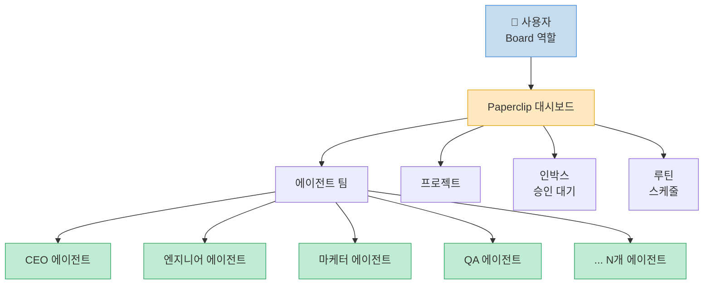

핵심 포인트는 "board" 역할이다. [사용자는 고수준 목표와 메트릭만 제시](https://youtu.be/HJ-dwefABss?t=30)하고, 실제 운영은 에이전트 팀이 맡는다. 직접 터미널 안에 들어가서 조작하는 "operator"가 아니라, 큰 방향을 설정하고 승인하는 "board"가 되는 것이다.

---

## Paperclip이란 무엇인가?

[Paperclip은 완전 무료, MIT 라이선스의 오픈소스](https://youtu.be/HJ-dwefABss?t=110) AI 오케스트레이션 플랫폼이다. 슬로건은 **"Zero Human Companies"** — AI 직원들이 스스로 다른 직원을 채용하고, 목표를 설정하며, 비즈니스 전체를 자동화할 수 있다.

**주요 특징 요약:**

| 기능 | 설명 |
|---|---|
| 멀티 에이전트 오케스트레이션 | 여러 에이전트가 동시에 독립적으로 작업 |
| 에이전트별 예산 관리 | 월별 토큰 소비 상한선 설정 |
| 하트비트 시스템 | 4/8/12시간 주기로 에이전트 자동 깨우기 |
| 티켓 시스템 | 모든 대화·이슈 로그 추적 |
| 스킬 마켓플레이스 | skills.sh에서 GitHub URL로 설치 |
| 루틴 | 반복 워크플로우 스케줄링 |
| 회사 템플릿 | 미리 구성된 에이전트 팀 임포트 |
| 멀티 회사 | 하나의 Paperclip 인스턴스에 여러 회사 운영 |

출시는 2026년 3월 초였으며, 3주 만에 GitHub 스타 36,000개를 돌파했다. OpenClaw와 Claude Code의 흐름을 타면서 급속도로 성장했다.

---

## 탄생 배경: 20개 터미널 문제

[창업자 중 한 명인 Dota가 공개한 pain point](https://youtu.be/HJ-dwefABss?t=310)가 바로 이 도구의 출발점이다.

> "every day he would have 20 different terminals running, 20 different Claude Code sessions running. And then when you come back, you're like, okay, I forgot which one's doing what."

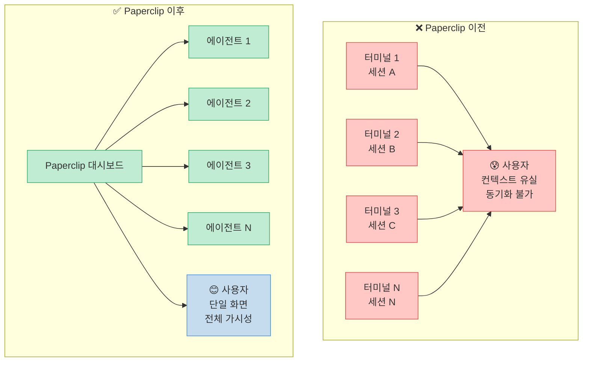

Paperclip의 핵심 가치는 **가시성(visibility)과 동기화(synchronization)**다. 모든 에이전트가 공통 목표를 인식하고, 사용자는 하나의 대시보드에서 전체 상황을 파악할 수 있다.

---

## 설치 및 퀵스타트

[터미널에서 단 한 줄의 명령](https://youtu.be/HJ-dwefABss?t=330)으로 시작한다.

```bash
# Paperclip 공식 사이트에서 제공하는 시작 명령어
npx paperclip
```

명령을 실행하면 로컬호스트 대시보드가 자동으로 열린다. 기본값은 로컬에서만 동작하지만, VPS에 배포하면 어디서든 접근 가능하다.

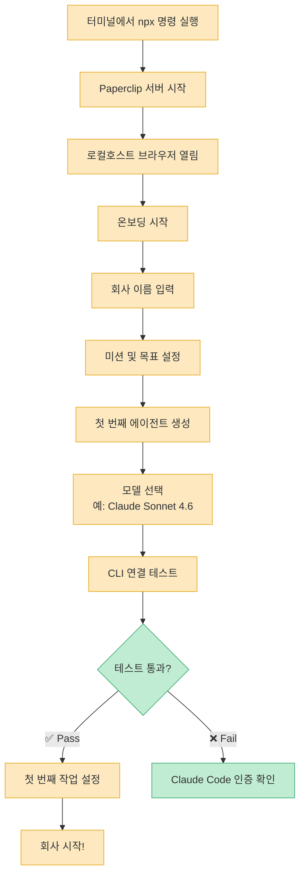

이미 Claude Code가 로컬 터미널에 인증되어 있다면, Paperclip은 별도 설정 없이 곧바로 연결된다.

---

## 에이전트 설정 파일 아키텍처

각 에이전트는 [4가지 핵심 파일](https://youtu.be/HJ-dwefABss?t=530)로 구성된다.

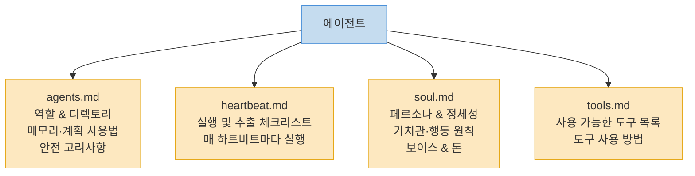

**Soul 파일** (CEO 예시):
- "You own the P&L."
- "You default to action."
- "You hold the long view while executing the near-term."
- "You protect focus hard."

CEO 에이전트는 이 soul 파일에 따라 매번 하트비트가 실행될 때마다 같은 페르소나로 동작한다. 보이스·톤·의사결정 원칙도 이 파일에서 커스터마이징할 수 있다.

---

## 하트비트 시스템: 에이전트를 살아있게 만드는 원리

하트비트는 [Paperclip의 가장 핵심적인 기능 중 하나](https://youtu.be/HJ-dwefABss?t=500)로, OpenClaw가 유명해진 이유이기도 하다.

> "the agents basically wake up on a schedule, whether that's every 4 hours, every 8 hours or every 12 hours. And when they wake up, it's almost as if they were just born. So they wake up with fresh context and fresh memory."

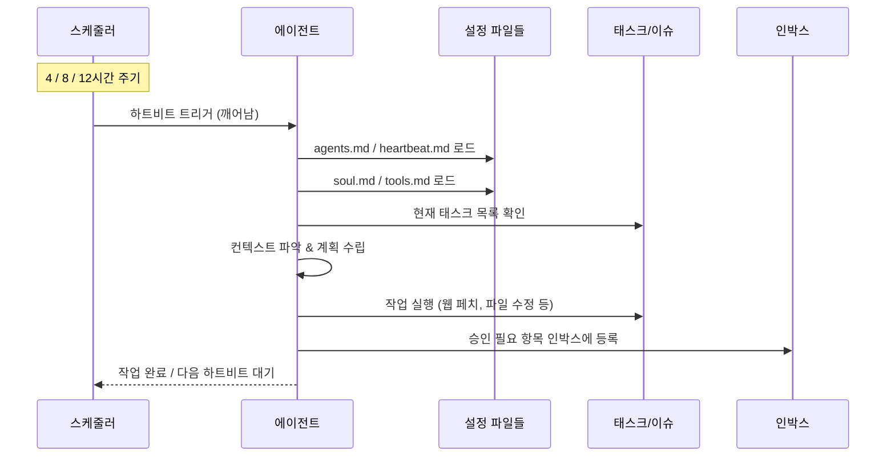

**왜 fresh context인가?**
에이전트는 매번 깨어날 때 설정 파일을 새로 읽는다. 이전 대화 맥락에 오염되지 않고, heartbeat.md 체크리스트대로 현재 상태부터 파악한 뒤 작업을 이어간다. 장기적으로 24시간 내내 비동기로 일하면서도 방향을 잃지 않는 구조다.

---

## CEO 에이전트 채용 데모: ProofShot 회사 만들기

Nate는 [ProofShot이라는 신규 회사를 라이브로 설정](https://youtu.be/HJ-dwefABss?t=370)했다. ProofShot은 고객에게 링크를 제공해 영상 후기를 녹화하면 AI가 정제해 웹사이트에 임베드할 수 있게 해주는 서비스다.

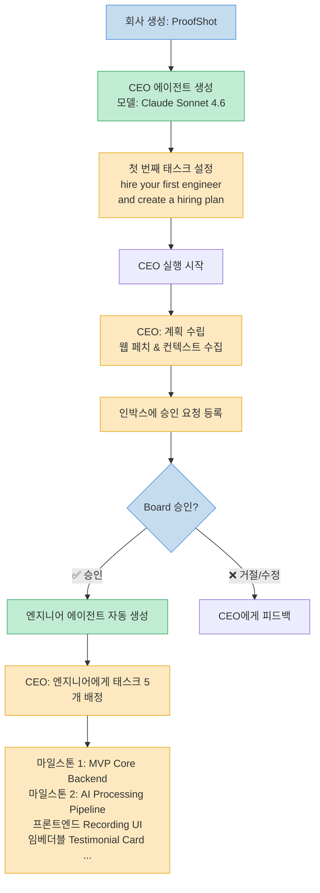

[Board가 채용을 승인하자](https://youtu.be/HJ-dwefABss?t=780) CEO는 즉시 링크드 이슈를 생성하고 엔지니어 에이전트를 스폰(spawn)했다. 새로 생성된 엔지니어 에이전트는 최소한의 초기 지시만 가진 채로 CEO가 배정하는 작업을 기다린다. 이후 CEO는 5개의 마일스톤 태스크를 자동으로 생성해 엔지니어에게 배정했다.

---

## 스킬(Skills) 시스템과 skills.sh 마켓플레이스

[skills.sh는 Paperclip 에이전트에 설치할 수 있는 스킬 마켓플레이스](https://youtu.be/HJ-dwefABss?t=870)다. 대부분 무료이며, GitHub URL 한 줄로 설치된다.

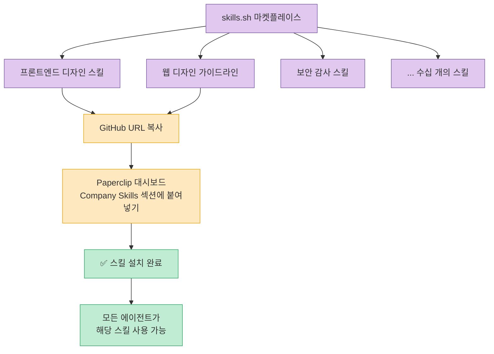

**주의사항:** 스킬은 외부 GitHub 저장소에서 가져오기 때문에 보안 감사가 있더라도 신중해야 한다. 공식적으로 신뢰할 수 있는 소스인지 확인한 후 설치하는 것을 권장한다.

스킬은 **회사 전체 레벨**에도, **개별 에이전트 레벨**에도 설치할 수 있어 세밀한 역할 분리가 가능하다. Paperclip에 내장된 에이전트들은 이미 Paperclip 자체의 스킬을 알고 있어 바로 사용할 수 있다.

---

## 루틴(Routines): 반복 워크플로우 자동화

[루틴 기능은 현재 베타](https://youtu.be/HJ-dwefABss?t=1020)이며, 정기적으로 실행되는 워크플로우를 정의할 수 있다.

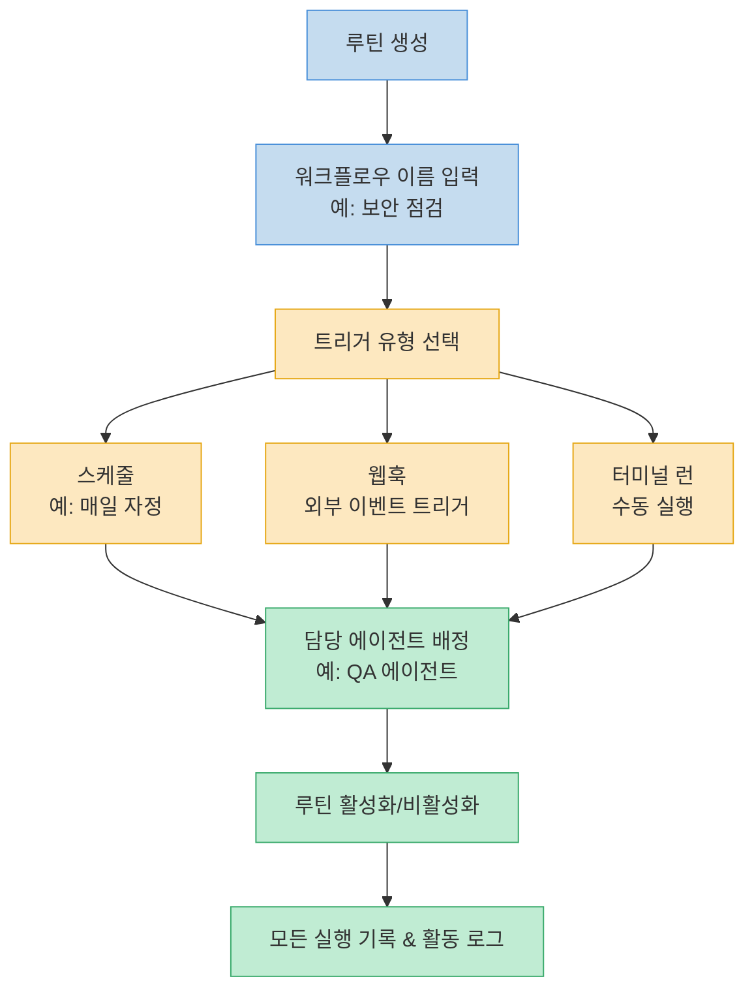

예시 루틴: 매일 밤 QA 에이전트가 자동으로 코드 보안 검사를 실행하고, 시크릿 노출이나 사이버 보안 취약점을 점검한다.

---

## 회사 템플릿 임포트: 50명으로 시작하기

[Paperclip은 사전 구성된 에이전트 팀 템플릿을 임포트](https://youtu.be/HJ-dwefABss?t=1060)할 수 있다. 마치 기업이 다른 기업을 인수해 좋은 팀과 프레임워크를 가져오는 것처럼.

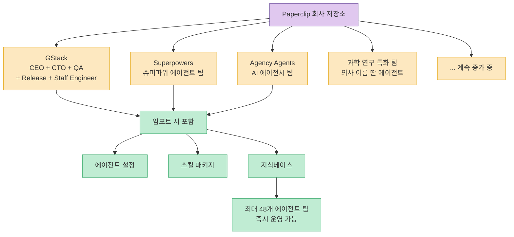

GStack 템플릿 예시는 CEO·CTO·QA 엔지니어·릴리즈 엔지니어·스태프 엔지니어와 관련 스킬이 모두 패키지로 제공된다. 0명에서 시작하는 대신 48명짜리 검증된 팀 구조를 가져와 즉시 운영할 수 있다.

---

## Claude Code + Paperclip 조합: 최강의 파트너십

[Nate는 Claude Code를 Paperclip 어시스턴트로 활용](https://youtu.be/HJ-dwefABss?t=600)하는 별도 프로젝트를 구성했다. 이것이 이 영상 제목의 핵심이다.

**Claude Code 프로젝트에 주입한 컨텍스트:**
- Paperclip 전체 아키텍처
- Paperclip API 명세
- 하트비트 프로토콜 작동 방식
- VPS 마이그레이션 방법
- 운영 중인 에이전트 구성
- 시크릿 및 환경변수 위치
- 쿼리 방법 및 주의사항

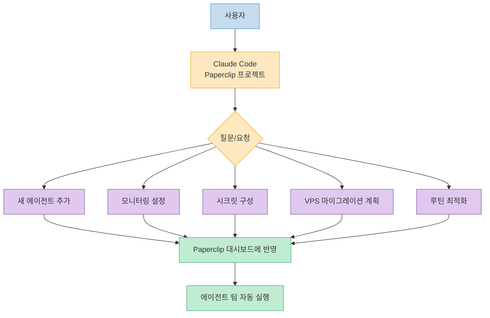

Claude Code는 오픈소스 Paperclip 저장소를 직접 참조할 수 있어 최신 API와 내부 구조를 파악하고, 사용자가 Paperclip을 더 잘 활용하도록 안내하는 "파트너"가 된다.

특히 [시크릿/환경변수 관리](https://youtu.be/HJ-dwefABss?t=1130)처럼 대시보드 UI에 명확히 표시되지 않는 기능도 Claude Code에게 물어보면 Paperclip 내부 구조를 이해하고 정확한 위치와 사용법을 알려준다.

---

## 예산 및 시크릿 관리

**에이전트별 예산 관리:**
[각 에이전트에 월별 토큰 소비 한도](https://youtu.be/HJ-dwefABss?t=130)를 설정할 수 있다. API 토큰 과금 방식을 사용하는 경우 실시간 소비 분석이 제공된다 (Claude 구독 방식 사용 시 $0 표시).

**시크릿 관리:**
대시보드 UI에 별도의 환경변수 섹션이 명시적으로 표시되지 않지만, Paperclip 내부적으로 환경변수 저장 메커니즘이 존재한다. Claude Code를 통해 각 에이전트가 시크릿을 어디서, 어떻게 읽는지 설정할 수 있다. Blot, Nano Banana 등 외부 서비스와의 연동도 이 방식으로 처리된다.

---

## 핵심 요약

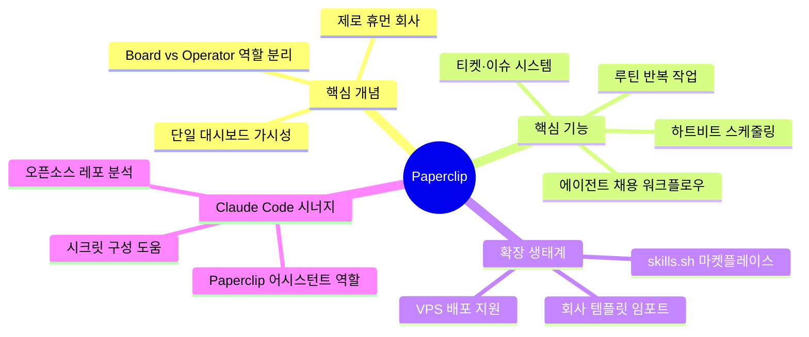

| 항목 | 내용 |
|---|---|
| **도구명** | Paperclip |
| **라이선스** | MIT (완전 무료) |
| **출시** | 2026년 3월 초 (3주 만에 GitHub ⭐ 36,000+) |
| **핵심 가치** | 에이전트 팀 가시성 & 동기화 |
| **하트비트** | 4/8/12시간 주기 에이전트 자동 깨우기 |
| **에이전트 설정** | agents + heartbeat + soul + tools 4개 파일 |
| **스킬 마켓** | skills.sh (GitHub URL 한 줄 설치) |
| **템플릿** | 최대 48개 에이전트 팀 즉시 임포트 |
| **Claude Code 활용** | Paperclip 어시스턴트 프로젝트 구성 권장 |

---

## 결론

Paperclip은 "Claude Code를 어떻게 팀으로 만들 것인가"라는 질문에 대한 현실적인 답변이다. 20개 터미널 문제를 해결하고, 에이전트들이 스스로 채용하고, 하트비트로 24시간 작동하며, skills.sh 마켓플레이스로 즉시 확장 가능하다.

특히 **Claude Code를 Paperclip 어시스턴트로 구성하는 메타 전략**이 흥미롭다. Claude Code가 Paperclip의 오픈소스 레포를 분석하고, 사용자가 놓친 기능을 찾아주며, 에이전트 팀을 최적화하는 파트너가 되는 것이다. AI가 AI 오케스트레이션 도구를 관리하는 시대가 열리고 있다.
